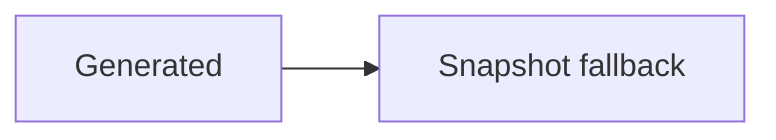

# Source Projection HAT

Use Reading View for every text-annotation scenario in this note.

## Paragraphs and headings

Select part of this ordinary paragraph, then select from this paragraph into the tight list below.

- tight first item
- tight second item with **bold text**
- tight last item

## Nested, task, and loose lists

- [ ] open task with `inline code`
- [x] completed task
- parent item
  - nested first
  - nested second

- loose first paragraph

  loose second paragraph

## Inline syntax

Select ordinary text before `inline code` and ordinary text after `inline code`.

Select **bold**, _italic_, ==highlighted==, and ~~struck~~ text.

Select the [Markdown label](https://example.com), [[Unaliased Target]], and
[[Aliased Target|aliased label]].

Escaped \* punctuation and entities &amp; &#128512; remain source-backed.

中文、emoji 😀、combining é、עברית、and ZWJ 👩‍💻 remain UTF-16 stable.

Text before %%a hidden comment%% text after. ^source-projection-block

## Fenced code

```ts
const answer = 42;
console.log(answer);
```

## Quote and callout

> Quote first line with **formatting** and its continuation.
>
> Quote second paragraph.

> [!NOTE] Explicit **callout title** Callout body with ==marked text== and a continuation line.

## Table

| Name  | Value |
| ----- | ----- |
| Alpha | One   |
| Beta  | Two   |

## Cross-kind selection

Select from this paragraph into the first item below.

- cross-kind list item
- another item

## Atomic and unsupported surfaces

Whole math source fixture: $x^2 + y^2$.

Partial rendered math must fail as unsupported and offer Snapshot Annotation.



## Repeated text

Repeated bounded target.

Context between repeated targets.

Repeated bounded target.
