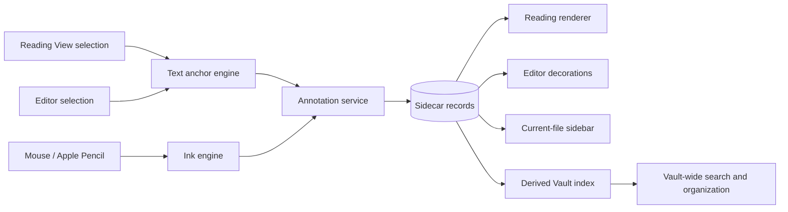
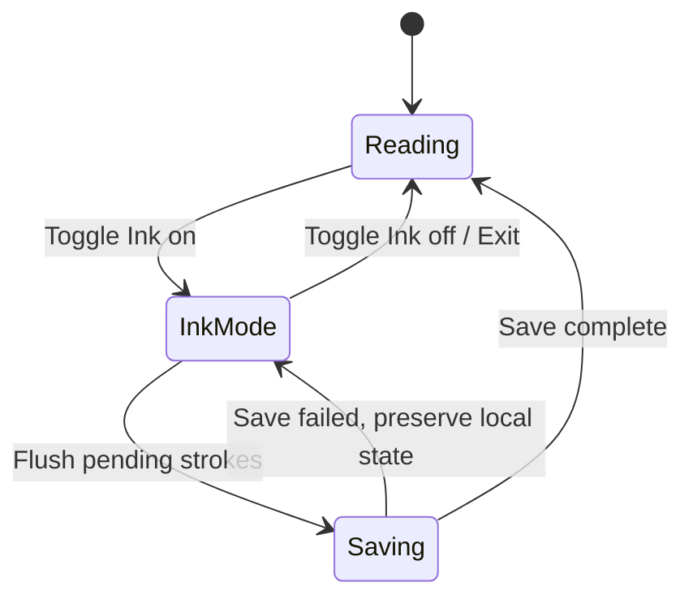

# Obsidian Annotation Plugin Product and Architecture Spec

## Status

Working design, created on 2026-07-14 from the current product discussion.

This specification records the product, data, anchoring, Ink, iCloud, performance, portability,
failure-handling, and first-pass UI/UX decisions agreed so far. It does not implement the plugin,
choose final visual tokens, contain validated high-fidelity designs, or commit to a release plan.

The next design phase is low-fidelity prototyping and validation: verify the interaction model on
desktop and a real iPad, resolve WebView-specific selection behavior, and turn the accepted flows
into implementation-ready component states.

## Superseding Specification

The current first-version Ink direction is specified separately in
[Ink v1 fixed-width workspace and manual repositioning](2026-07-15-ink-fixed-width-manual-repositioning.md).
Where the two documents conflict on Ink layout lifecycle, Markdown/layout changes, or Select/Move,
the 2026-07-15 incremental specification is authoritative. This document remains the historical
product, architecture, and UI/UX baseline.

## Product Definition

The product is an annotation layer for mutable Obsidian Markdown, not only a highlighter command.

It must support two fundamentally different annotation targets:

1. Reflowable text annotations, including highlights, underlines, and attached notes/comments.
2. Spatial Ink annotations, including freehand drawing, lines, handwriting, arrows, and erasing with
   a mouse or Apple Pencil.

The product must keep both experiences coherent while preserving their different anchoring models:

- Text annotations follow semantic text as Markdown reflows or changes.
- Ink annotations belong to a stable logical surface rather than raw screen coordinates.

User experience is the highest priority. Performance, data safety, mobile behavior, recoverability,
and portability are product requirements rather than later optimizations.

## User Outcomes

The user can:

- Select text directly in Reading View and invoke a nearby annotation toolbar.
- Apply a color highlight, underline, or attach a note/comment without switching to editing mode.
- Click an explicit switch to enter or leave Ink Mode.
- Draw with a mouse on desktop and Apple Pencil on iPad.
- Leave Ink Mode and continue reading without the drawing layer intercepting input.
- See, navigate, edit, copy, organize, resolve, and delete annotations for the current Markdown
  file.
- Search, filter, classify, and organize annotations across the entire Vault.
- Continue using the same annotation data on Mac/PC and iPad through the current iCloud-backed
  Vault.
- Recover annotations whose original text or layout can no longer be located.
- Export annotations into portable representations instead of being permanently locked into the
  plugin.

## Confirmed Decisions

| ID   | Decision                                                                                                                                                                        | Status                                            | Rationale                                                                                                                                       |
| ---- | ------------------------------------------------------------------------------------------------------------------------------------------------------------------------------- | ------------------------------------------------- | ----------------------------------------------------------------------------------------------------------------------------------------------- |
| D-01 | Treat annotations as a separate domain layer over Markdown.                                                                                                                     | Confirmed                                         | Supports comments, tags, overlapping marks, search, recovery, and Ink without continuously rewriting source Markdown.                           |
| D-02 | Use sidecar data as the canonical annotation source.                                                                                                                            | Confirmed                                         | Keeps Markdown clean and aligns with annotation systems that store annotations separately from the annotated document.                          |
| D-03 | Keep Markdown/PDF/SVG/PNG materialization as export, not canonical storage.                                                                                                     | Confirmed                                         | Preserves portability without turning every annotation edit into a source-document rewrite.                                                     |
| D-04 | Use compound text anchors: source position, exact quote, prefix/suffix context, and structural scope.                                                                           | Confirmed                                         | Position is fast; quote and context allow recovery after edits; structural scope disambiguates repeated text.                                   |
| D-05 | Fail closed when an anchor cannot be resolved with high confidence.                                                                                                             | Confirmed                                         | A visible unanchored item is safer than silently attaching a note to the wrong sentence.                                                        |
| D-06 | Preserve unresolved annotations as `unanchored`/`orphaned` and provide a repair flow.                                                                                           | Confirmed                                         | Matches established web annotation behavior and prevents data loss.                                                                             |
| D-07 | Ink is entered through an explicit mode switch.                                                                                                                                 | Confirmed by user                                 | Normal reading and drawing have incompatible pointer and scrolling behavior and need clear state.                                               |
| D-08 | Ink Mode uses a fixed logical annotation layout rather than arbitrary responsive screen coordinates.                                                                            | Adopted recommendation                            | Freehand paths require a stable page/canvas coordinate system to remain aligned across devices.                                                 |
| D-09 | The current Vault sync mechanism is iCloud.                                                                                                                                     | Confirmed by user                                 | Storage granularity and conflict handling must be designed for file-level cloud synchronization.                                                |
| D-10 | Do not place a live SQLite database or one monolithic annotation JSON inside the iCloud Vault.                                                                                  | Confirmed                                         | File-level conflicts would make the whole annotation collection a single contention and corruption boundary.                                    |
| D-11 | Store text annotations at approximately record-level granularity and Ink at bounded surface-level granularity.                                                                  | Confirmed                                         | New annotations receive unique files; editing one item does not rewrite all annotations; one file per stroke is avoided.                        |
| D-12 | Treat indexes and summaries as derived, disposable, and rebuildable.                                                                                                            | Confirmed                                         | Cache conflicts must not become annotation data loss.                                                                                           |
| D-13 | The first stable creation workflow is Reading View.                                                                                                                             | Adopted recommendation                            | It directly addresses the primary reading use case and isolates the highest-risk rendered-text anchoring problem.                               |
| D-14 | Unsupported or ambiguous content is rejected with a precise explanation in the first version.                                                                                   | Adopted recommendation                            | Best-effort mutation without reliable anchoring would undermine trust.                                                                          |
| D-15 | Mobile is a first-class platform. Core code must not depend on top-level Node or Electron APIs.                                                                                 | Confirmed                                         | iPad and Apple Pencil support are core requirements, not optional compatibility.                                                                |
| D-16 | Selecting text shows annotation actions but does not create an annotation by default.                                                                                           | Adopted recommendation                            | Text selection is also used for copying, searching, and thinking; implicit mutation would make reading feel unsafe.                             |
| D-17 | Use an anchored quick toolbar on desktop; target an anchored toolbar on iPad with a stable bottom action-bar fallback when native selection UI or viewport constraints collide. | Adopted recommendation                            | The action should stay near context when reliable without fighting iOS selection handles, system menus, the keyboard, or safe areas.            |
| D-18 | A note/comment is optional content attached to an annotation target, not a mutually exclusive alternative to highlight or underline.                                            | Confirmed through UI/UX review                    | One annotation must be able to represent highlight-only, underline-only, note-only, highlight-plus-note, and underline-plus-note.               |
| D-19 | Clicking an existing annotation opens an annotation inspector; overlapping targets expose all records before editing.                                                           | Adopted recommendation                            | Existing annotations should be edited as domain objects rather than accidentally creating another text selection.                               |
| D-20 | Single-item deletion is immediate with undo; bulk deletion and whole-Ink-surface deletion require confirmation.                                                                 | Adopted recommendation                            | This keeps frequent cleanup fast while protecting high-impact actions.                                                                          |
| D-21 | Ink Mode remains an explicit, visually persistent input mode; normal reading never invisibly intercepts drawing input.                                                          | Confirmed                                         | Reading, selection, link activation, scrolling, and drawing compete for the same pointer events.                                                |
| D-22 | When Ink is visible, a note with Ink uses its fixed annotation layout even after leaving Ink Mode.                                                                              | Confirmed by user acceptance                      | Exiting Ink stops input; it must not cause the content and existing strokes to jump into a different responsive layout.                         |
| D-23 | Present Ink as one continuous document overlay while internally partitioning it into bounded section/block surfaces.                                                            | Adopted recommendation                            | The user should not manage technical surfaces, while local content edits should invalidate only the affected region rather than the whole note. |
| D-24 | Apple Pencil draws and finger input scrolls by default on iPad; desktop left mouse draws and wheel/trackpad scrolls.                                                            | Adopted recommendation, pending device validation | It preserves the platform's dominant reading gesture and avoids a hidden finger-drawing mode.                                                   |
| D-25 | The sidebar is one view with `Current file` and `Entire Vault` scopes; `Current file` is the default and the Vault-wide index loads lazily.                                     | Adopted recommendation                            | Immediate context stays lightweight, while global organization remains available without startup cost.                                          |
| D-26 | Annotation lists are compact and document-ordered; color is presentation, while reusable classification uses named style presets and tags.                                      | Adopted recommendation                            | Dense reading workflows need scanability, and fixed universal meanings for colors do not fit every user.                                        |

## Non-Goals for the First Complete Slice

- Do not annotate PDF, EPUB, web pages, images, audio, or video in the first Markdown slice.
- Do not implement multi-user collaboration or remote comment threads.
- Do not add AI summarization, classification, OCR, or handwriting recognition.
- Do not create a custom synchronization service.
- Do not modify Markdown by default to persist visual annotations.
- Do not promise stable anchoring inside arbitrary third-party rendered DOM.
- Do not support partial selection inside Mermaid, Dataview, iframe, or similar generated surfaces.
- Do not support arbitrary responsive full-document Ink without a fixed logical layout.
- Do not make Ink strokes directly queryable as semantic text in the first version.

## Architecture



### Main Components

| Component                 | Responsibility                                                                                   |
| ------------------------- | ------------------------------------------------------------------------------------------------ |
| Reading selection adapter | Capture Reading View DOM selection, determine the rendered section, and request a source anchor. |
| Editor adapter            | Create and render annotations in CodeMirror 6 without duplicating domain logic.                  |
| Text anchor engine        | Create selectors, resolve selectors, score candidates, and return a confidence result.           |
| Ink input adapter         | Normalize mouse, touch, and pen pointer streams.                                                 |
| Ink engine                | Capture, render, simplify, serialize, erase, undo, and export vector strokes.                    |
| Annotation service        | Enforce annotation invariants and coordinate storage, rendering, navigation, and deletion.       |
| Sidecar repository        | Read and write canonical annotation and Ink records.                                             |
| Reading renderer          | Paint resolved annotations without breaking rendered Markdown structure.                         |
| Editor renderer           | Render resolved text annotations through CodeMirror decorations.                                 |
| Sidebar views             | Provide current-file and Vault-wide annotation management.                                       |
| Derived index             | Support search, grouping, and filtering without becoming canonical truth.                        |
| Exporter                  | Materialize text annotations, comments, and Ink into portable formats.                           |

## Canonical Storage Model

### Directory Shape

The initial physical design is:

```text
.obsidian-annotations/
└── v1/
    └── notes/
        └── <normalized-path-hash>/
            ├── meta.json
            ├── annotations/
            │   ├── <annotation-id>.json
            │   └── <annotation-id>.json
            ├── ink/
            │   ├── <surface-id>.drawing.json
            │   └── <surface-id>.drawing.json
            └── summary.json
```

Rules:

- `meta.json` records a stable note ID, current source path, source fingerprint, schema version, and
  last reconciliation time.
- Text annotations use one small record per annotation.
- A drawing file contains one bounded logical Ink surface, not the whole Vault and not one stroke
  per file.
- `summary.json` is derived and can be deleted or rebuilt.
- Settings belong in normal plugin settings storage and are not mixed with annotation records.
- Paths use normalized Vault-relative paths. Raw path characters must not be destructively
  sanitized.
- A note rename observed by Obsidian moves/rekeys the note sidecar directory and updates
  `meta.json`.
- An external rename performed while the plugin is inactive is reconciled later using stored path,
  source fingerprint, and user-assisted repair if needed.

### Why This Granularity

- A single SQLite database is unsuitable for ordinary iCloud file synchronization.
- A single all-Vault JSON makes unrelated annotations contend for the same file.
- A single per-note JSON still makes every annotation in that note contend for one file.
- A separate file for every stroke creates excessive file-system and iCloud overhead.
- One record per text annotation and one file per bounded Ink surface approximates record-level sync
  while respecting iCloud's file-level transport.

### Text Annotation Record

```ts
interface TextAnnotationRecord {
  schemaVersion: 1;
  id: string;
  noteId: string;
  filePath: string;

  target: {
    displayText?: string;
    position: {
      start: number;
      end: number;
      unit: 'utf16-code-unit';
    };
    quote: {
      exact: string;
      prefix: string;
      suffix: string;
    };
    scope: {
      headingPath?: string[];
      sectionStartLine?: number;
      sectionEndLine?: number;
      blockFingerprint?: string;
    };
    sourceRevision?: string;
  };

  mark?: {
    kind: 'highlight' | 'underline';
    styleId: string;
  };
  tags: string[];
  body?: string;
  status: 'draft' | 'active' | 'resolved' | 'unanchored';

  revision: number;
  deviceId?: string;
  createdAt: string;
  updatedAt: string;
  deletedAt?: string;
}
```

Notes and invariants:

- `mark` and `body` are composable. A note is not a mutually exclusive annotation type.
- `quote.exact` is the canonical contiguous Markdown source slice. `displayText` is stored only when
  the selected visible text differs because that slice contains presentation markers.
- An active record must contain at least one of `mark`, a non-empty `body`, or one or more `tags`.
- A note-only annotation renders a small note-anchor indicator rather than inventing an implicit
  background highlight.
- Tapping `Add note` persists the target first as a `draft`, then opens the shared annotation
  inspector with `Note` active and the note field focused. Body and tag edits remain in memory until
  explicit Save. Leaving an empty draft removes it safely.
- `styleId` carries a stable presentation-preset identity. Its color and optional user-facing name
  may change without rewriting the annotation target.
- `tags` are independent from color and style.
- `deletedAt` is a tombstone used to prevent deleted records from reappearing after delayed sync.
- The exact Unicode normalization and grapheme-boundary contract remains an implementation-level
  item to validate with CJK, emoji, combining characters, and bidirectional text.

### Ink Surface Record

```ts
interface InkSurfaceRecord {
  schemaVersion: 1;
  id: string;
  noteId: string;
  filePath: string;

  layout: {
    logicalWidth: number;
    logicalHeight: number;
    fontFamily: string;
    fontSize: number;
    lineHeight: number;
    themeMode: 'light' | 'dark';
    sourceRevision: string;
    blockFingerprints: string[];
  };

  strokes: InkStroke[];
  status: 'active' | 'needs-rebase' | 'unanchored';
  revision: number;
  deviceId?: string;
  createdAt: string;
  updatedAt: string;
  deletedAt?: string;
}

interface InkStroke {
  id: string;
  tool: 'pen' | 'highlighter' | 'eraser';
  color: string;
  width: number;
  points: Array<{
    x: number;
    y: number;
    pressure: number;
    time: number;
    tiltX?: number;
    tiltY?: number;
  }>;
}
```

The editable vector record is canonical. PNG previews are caches. SVG/PNG are export formats.

There is no broadly adopted Web Ink interchange format equivalent to the W3C text selector model.
The plugin therefore uses a small versioned stroke schema that follows the established
drawing/stroke/point abstraction used by Pencil systems and keeps an explicit SVG export path.

## Text Anchoring

### Anchor Creation

For a Reading View selection:

1. Capture the transient DOM `Range` and selected visible text.
2. Identify the owning Markdown preview section and source file.
3. Narrow mapping to the relevant source section rather than scanning the entire note first.
4. Map rendered text to the smallest contiguous source range. Presentation markers at the selection
   edges are excluded where possible; markers inside the selected visible text remain part of the
   canonical source quote.
5. Store position, canonical source quote, optional visible display text when it differs from the
   source quote, prefix, suffix, heading path, section range, block fingerprint, and source
   revision.
6. Reject empty, synthetic, or ambiguous selections that cannot produce a stable source target.

The transient DOM `Range` is never persisted as the canonical anchor.

### Reattachment Order

1. Validate the saved position by comparing its current source text with `quote.exact`.
2. Search within the original block or section using exact quote and prefix/suffix context.
3. Score multiple candidates using structural scope, context similarity, and distance from the
   original position.
4. Expand to a wider search only when the narrower scope cannot resolve the annotation.
5. Accept only one candidate above a defined confidence threshold.
6. Mark the annotation `unanchored` when no unique high-confidence result exists.

The plugin must never silently choose an arbitrary occurrence of repeated text.

### Unanchored Recovery

The sidebar preserves:

- Original quoted text.
- Note/comment body.
- Tags and style.
- Last known heading/block context.
- Failure reason when known.
- A command to select replacement text and reattach the annotation.

Unanchored annotations remain searchable and exportable.

### First-Version Supported Content

- Paragraphs.
- Headings.
- Lists and task-list visible text.
- Blockquotes.
- Callout body text.
- Visible link labels.
- Text containing ordinary bold, italic, highlight, or strikethrough markup.

### First-Version Restricted Content

- Fenced code blocks and partial inline-code selection.
- Partial selection within rendered math.
- Mermaid, Dataview, iframe, and other generated plugin DOM.
- Cross-file transclusions and embedded-note instances.
- Selections spanning multiple complex block types.
- Any surface whose displayed content cannot be traced to a stable Markdown source.

The UI must explain why the action is unavailable instead of failing silently.

### Embedded Content Policy

The long-term semantic default is that an annotation belongs to the embedded source file and may
additionally record where it was presented. This is not implemented in the first complete slice
because one source passage may appear through multiple embed instances and requires an explicit
instance model.

## Rendering

### Reading View

- Use Markdown post-processing and section information to render only relevant annotations.
- Build an interval render plan before mutating the DOM.
- Split cross-node or cross-block annotations into text-node-local fragments.
- Do not use one cross-block `Range.extractContents()` wrapper that can invalidate heading, list,
  quote, or code structure.
- Clean up plugin-owned wrappers/listeners on rerender and unload.
- Cache source line offsets and mapping artifacts by file revision.
- Render only annotations intersecting the current rendered section.

### Editing View

- Use CodeMirror 6 decorations backed by the same annotation domain records.
- Do not create a second annotation format for Live Preview.
- Editor transactions may update transient mapped positions, but quote/context anchors remain the
  recovery basis.
- Reading View creation is the first stable workflow; complete editor creation/editing can follow
  after the Reading View mapping is proven.

### Overlapping Annotations

The adopted default composition rule is:

- Preserve every underlying annotation record.
- Allow multiple underline layers to stack when visually feasible.
- Aggregate comment indicators at the same target.
- For competing background fills, render the most specific annotation, then the most recently
  updated annotation as tie-breaker.
- Clicking an overlapped region exposes all annotations at that position.

The exact visual treatment remains part of the UI/UX phase.

## Ink Mode

### State Model



### Reading State

- Text selection, links, scrolling, and annotation toolbar work normally.
- Ink overlays may remain visible.
- Ink canvases do not intercept pointer input.
- Existing Ink cannot be edited until Ink Mode is entered.

### Ink State

- The mode is visually explicit and always has a clear exit action.
- The Markdown content is read-only.
- The transparent Ink surface intercepts drawing input.
- Desktop left mouse draws.
- Apple Pencil draws on iPad.
- Finger input should scroll by default on iPad; this behavior requires real-device verification.
- The initial tool set is pen, highlighter, eraser, color, width, undo, and redo.
- Each completed stroke updates the in-memory drawing immediately.
- Persistence is debounced to avoid rewriting the drawing file for every raw pointer event.
- Exiting Ink Mode forces a final flush.
- A failed flush keeps the mode/state recoverable and must not discard strokes.

### Fixed Logical Annotation Layout

The first time Ink is activated for a note, the plugin creates a fixed logical layout derived from
the current reading content width and required typography metrics.

Once the note contains visible Ink, leaving Ink Mode stops drawing input but does not return the
note to an unrelated responsive layout. The content and Ink remain in the same fixed annotation
layout so strokes do not visibly jump away from their targets.

The user experiences the note as one continuous annotated document. Internally, the Ink engine
partitions that document into bounded surfaces associated with stable heading sections or block
groups:

- Surface boundaries are implementation details and are never shown as pages or tiles in the normal
  UI.
- A stroke that visually crosses a boundary is split into linked internal stroke fragments without
  changing its appearance.
- Moving an intact section moves its surfaces as a unit.
- Editing one section should mark only the affected surfaces `needs-rebase` when possible.
- A full-note surface is a fallback for content that cannot be partitioned reliably, not the
  default.

On other devices:

- Render the same logical width.
- Scale the logical surface to fit the device viewport.
- Preserve logical stroke coordinates.
- Verify font availability and layout fingerprints before claiming exact alignment.

The first entry may animate into the fixed layout only when required. Subsequent entry and exit must
not shift content. The exact width, scaling limits, and transition duration remain prototype
variables rather than unvalidated constants.

### Markdown Changes After Ink Creation

1. If source and layout fingerprints still match, show Ink in place.
2. If earlier unrelated content moves but the bound surface fingerprints remain stable, move the
   whole surface with its content.
3. If the bound surface content/layout changes, set `needs-rebase` rather than distorting strokes.
4. If the original surface cannot be found, set `unanchored` and preserve a drawing thumbnail plus
   vector data.
5. Provide a later UI flow to bind an orphaned drawing to a replacement section/surface.

The plugin does not silently warp a circle, arrow, or handwritten note onto newly reflowed text.

### Pointer and Rendering Strategy

- Use Pointer Events as the unified mouse/touch/pen input model.
- Use `pointerType`, pressure, tilt, pointer capture, and coalesced events where supported.
- Render live strokes with Canvas 2D.
- Keep committed strokes and the active stroke on separate rendering layers.
- Batch paint work through animation frames.
- Simplify and delta-encode points after stroke completion, not during live capture.
- Redraw bounded dirty regions rather than the entire document when practical.
- Do not depend on Apple Pencil double-tap, squeeze, or hover in the first release.

## iCloud Synchronization and Conflict Policy

### Assumptions

- One user owns the Vault.
- Mac/PC and iPad may be offline and later reconnect.
- The same annotation or drawing is not normally edited concurrently on two devices.
- iCloud provides file transport, not record-level semantic merging.

### Conflict-Reduction Rules

- New text annotations use unique UUID filenames.
- New Ink surfaces use unique IDs.
- Records carry `revision`, `updatedAt`, and optional `deviceId`.
- Deletion writes a tombstone before later garbage collection.
- Save operations are serialized per record/surface.
- A write re-reads the latest visible file before applying an update when possible.
- Conflicting/bounced duplicate files are scanned and reconciled by annotation ID and revision when
  visible to the plugin.
- Derived summaries never overwrite canonical records.
- The plugin reports detected duplicate/conflict artifacts instead of deleting them automatically
  when merge safety is uncertain.

### Residual iCloud Risk

An Obsidian plugin cannot fully access or control all iCloud `NSFileVersion` conflict state.
Simultaneous edits to the same annotation record or the same Ink surface can still produce a losing
version that the plugin cannot automatically retrieve. This limitation must be documented and
tested, not hidden.

## Sidebar Scope

The sidebar is one annotation-management view with a segmented scope control: `Current file` and
`Entire Vault`. It must not be required for quick annotation creation and may remain closed during
ordinary reading.

### Current File

- Sort annotations by document position.
- Group by heading section when headings exist.
- Use compact rows rather than large cards: a style/type marker, up to two lines of quoted text, up
  to two lines of note preview, and only essential metadata.
- Show quoted text, note/comment, style, tags, type, time, and state on expansion.
- Jump to source.
- Edit note/comment.
- Recolor/restyle.
- Resolve/reopen.
- Copy.
- Delete with undo.
- Keep unanchored text annotations and Ink requiring rebase in a visible problem section above the
  normal document order.
- Represent Ink as a section-positioned thumbnail/surface summary with a stroke count rather than
  one row per stroke.
- Selecting a sidebar row navigates to the target and briefly pulses it; selecting an annotation in
  the document synchronizes the active sidebar row when the sidebar is open.

### Entire Vault

- Load or refresh the Vault-wide index only when this scope is opened or explicitly queried.
- Search annotation text, quoted source, note body, file path, and tags.
- Filter by folder, note, tag, style, color, type, status, and time.
- Group by note by default, with optional grouping by tag/category, type, or time.
- Open the source note and navigate to the annotation.
- Support bulk copy, tag/style change, export, and deletion where safe.
- Enter an explicit bulk-selection mode before showing row checkboxes.
- Use list virtualization for large result sets.

Color is presentation. A style preset has a stable ID and may have an optional user-defined name,
but the plugin does not impose universal meanings such as “yellow means important.” Cross-cutting
classification uses tags independently.

## Portability

Canonical sidecars must remain locally readable and versioned.

Required export directions:

- Plain Markdown highlight where representable.
- HTML `<mark>` where requested.
- Footnote or adjacent Markdown note for comments.
- A standalone Markdown annotation report.
- SVG for editable/vector-friendly Ink export.
- PNG for broad visual compatibility.

Uninstalling the plugin leaves sidecar data intact, but dynamic annotations are not expected to
remain visible in Obsidian without either the plugin or an explicit export/materialization step.

## Performance Requirements

### Principles

- Load the current note's annotations first.
- Do not scan all Markdown or all sidecars during plugin startup.
- Build or refresh the Vault-wide index only when needed and incrementally afterward.
- Restrict Reading View rendering to intersecting sections.
- Restrict Editor rendering to the CodeMirror viewport where possible.
- Bound sidecar read concurrency.
- Serialize writes by canonical record.
- Use virtualized results for Vault-wide views.
- Keep Ink live rendering independent from cloud persistence latency.

### Proposed Acceptance Budgets

These are targets to validate, not yet measured facts:

| Interaction                                             | Target                                                                                 |
| ------------------------------------------------------- | -------------------------------------------------------------------------------------- |
| Synchronous plugin startup work                         | Under 30 ms desktop; under 60 ms tablet                                                |
| Desktop selection-toolbar appearance                    | Under 100 ms after selection stabilizes                                                |
| iPad selection-toolbar appearance                       | Under 150 ms after native selection stabilizes                                         |
| Ink drawing or selection-drag input-to-paint frame time | P95 below 16.7 ms at 60 Hz                                                             |
| Vault-wide list                                         | Virtualized at 20,000 annotation records                                               |
| Large note fixture                                      | 200,000 characters and 500 text annotations without full-note rerender on every scroll |

## Reliability and Failure Policy

- Never discard an annotation because its target cannot be rendered.
- Never silently bind to an ambiguous target.
- Never discard unsaved Ink after a failed persistence attempt.
- Never treat a derived index as canonical truth.
- Never hard-delete an annotation immediately when undo or delayed sync may still reference it.
- Never claim that local persistence means iCloud has completed synchronization.
- Never enable drawing input without an obvious Ink Mode state.
- Never let an inactive Ink canvas block text selection, links, or scrolling.
- Never use unavailable desktop APIs on the mobile path.

## Risks That Remain Explicit

1. Third-party rendered content may not have a stable Markdown source mapping.
2. Large rewrites can make text annotations unanchored.
3. Responsive full-document freehand is inherently unstable without a fixed logical layout.
4. Custom fonts or theme differences across devices can invalidate an Ink layout fingerprint.
5. iPad WebView behavior for Pencil-versus-finger input, palm rejection, native selection UI, and
   keyboard overlap must be tested on real hardware.
6. iCloud may retain conflict versions that the Obsidian plugin cannot access.
7. Simultaneously editing the same annotation or drawing on multiple devices remains unsafe without
   a semantic sync service.
8. Large numbers of small annotation files may affect first-time iCloud hydration and Vault-wide
   indexing; directory sharding and realistic scale tests are required.
9. The editable Ink schema is plugin-defined because there is no equivalent widely adopted Web Ink
   selector/serialization standard; portability therefore depends on maintained SVG/PNG export.
10. The interaction model is defined, but exact overlap styling, selection-toolbar collision
    behavior, fixed-layout transition values, and visual tokens still require prototypes and
    real-device validation.

## Validation Spikes Required Before Full Implementation

### Spike A: Reading Selection and Reattachment

- Map selections in headings, lists, links, emphasis, quotes, callouts, repeated text, CJK, emoji,
  and long paragraphs.
- Verify toolbar placement, selection preservation, direct highlight/underline creation, note draft
  creation, and cancellation.
- Refresh and verify rendering.
- Insert/delete/reorder nearby Markdown and verify recovery or correct unanchored state.
- Verify that DOM wrapping does not break block structure or another simple post-processor.

### Spike B: Real iPad Ink Input

- Verify native text-selection menu behavior and anchored-toolbar collision handling before testing
  Ink.
- Verify Apple Pencil `pointerType`, pressure, tilt, pointer capture, and coalesced event behavior.
- Verify Pencil drawing while finger scrolling.
- Verify palm behavior, orientation changes, split view, keyboard appearance, and long-stroke
  latency.
- Determine whether any WebView-specific fallbacks are required.

### Spike C: Fixed Layout Across Devices

- Create Ink on desktop and render on iPad.
- Create Ink on iPad and render on desktop.
- Verify logical-width scaling, typography matching, theme changes, and missing-font handling.
- Verify that entering and leaving Ink Mode does not reflow a note that has visible Ink.
- Verify that linked stroke fragments crossing internal surface boundaries remain visually
  continuous.
- Modify Markdown above, inside, and below an Ink surface and verify move/rebase/unanchored
  behavior.

### Spike D: iCloud Conflict and Hydration

- Create different annotations offline on two devices and reconnect.
- Edit the same annotation offline on both devices and observe actual conflict artifacts.
- Edit the same drawing surface offline on both devices.
- Measure first-time hydration and index construction with realistic record counts.
- Confirm tombstone behavior after delayed sync.

## UI/UX Interaction Specification

### UX Constitution

1. **Reading first.** Inactive annotations and Ink must not interfere with scrolling, links, text
   selection, or native Obsidian navigation.
2. **Annotate on intent.** Selecting text reveals actions; it does not mutate data until the user
   chooses an action.
3. **Visible modes.** Ink input is never enabled invisibly. Its entry, active state, failure state,
   and exit are continuously understandable; routine local-saving/saved text does not become a
   floating obstruction.
4. **Progressive disclosure.** Frequent actions stay close to the selection. Tags, export, repair,
   and bulk operations live in inspectors or the sidebar.
5. **Recoverability over confirmation fatigue.** Ordinary edits and single deletion use undo;
   destructive collection-level actions ask for confirmation.
6. **Same model, adaptive containers.** Desktop and iPad expose the same annotation concepts and
   action order, while placement adapts to pointer, keyboard, safe-area, and pane constraints.
7. **Local persistence is not cloud sync.** Whenever local persistence feedback is surfaced, it says
   `Saved locally` rather than claiming cloud synchronization; the compact Ink toolbar visually
   suppresses routine saving/saved feedback and surfaces only actionable save failures.

### Interaction State Model

```mermaid
stateDiagram-v2
    [*] --> Reading

    Reading --> TextSelected: Select text
    TextSelected --> Reading: Escape / collapse / invalid target
    TextSelected --> Annotated: Color / underline
    TextSelected --> Composing: Add note
    Composing --> Annotated: Save / protected close
    Annotated --> Inspecting: Click or tap annotation
    Inspecting --> Reading: Close

    Reading --> InkMode: Explicit Ink switch
    InkMode --> Saving: Exit / background / forced flush
    Saving --> Reading: Local save complete
    Saving --> InkMode: Save failed; retain strokes

    Reading --> Managing: Open annotation sidebar
    Inspecting --> Managing: Expand in sidebar
    Managing --> Reading: Close sidebar
```



The sidebar is an independent management surface, not a mutually exclusive input mode. It may remain
open during Reading, Inspecting, or Ink Mode, but it must not steal focus during an active stroke.

### Adaptive Interaction Surfaces

| Task                        | Desktop                                         | iPad / mobile                                                                                              |
| --------------------------- | ----------------------------------------------- | ---------------------------------------------------------------------------------------------------------- |
| New text annotation         | Selection-anchored quick toolbar                | Selection-anchored toolbar when safe; stable bottom action bar when native UI or viewport collisions occur |
| Add/edit a short note       | Shared anchored annotation inspector            | The same edge-aware inspector, constrained to the visual viewport                                          |
| Edit an existing annotation | Shared anchored annotation inspector            | The same edge-aware inspector, constrained to the visual viewport                                          |
| Ink tools                   | Collapsible vertical palette beside the content | Bottom floating palette above the safe area                                                                |
| Current/global management   | Obsidian side pane                              | Obsidian drawer/narrow pane with the same scope model                                                      |

Container fallback is selected once per interaction. A toolbar must not jump repeatedly between
anchored and bottom positions while the user adjusts native selection handles.

### Text Selection Lifecycle

1. The user selects supported rendered text.
2. The adapter waits until the selection is non-empty and stable, then captures the transient range
   and requests a source anchor.
3. The quick toolbar appears within the next render opportunity and within the performance budget.
4. While the user adjusts selection handles, the plugin updates the pending target without creating
   an annotation.
5. Choosing an action commits the target; clicking outside, pressing `Escape`, collapsing the
   selection, navigating away, or beginning a scroll dismisses the pending toolbar.
6. If the target is unsupported or ambiguous, the plugin does not show disabled controls without
   explanation. It shows one concise reason and offers no destructive best-effort fallback.

The default interaction never auto-highlights. A later explicit `Continuous highlight` power mode
may emulate Zotero's locked highlighter, but it is outside the first complete slice and must have a
persistent mode indicator.

### Quick Annotation Toolbar

The primary order is stable across platforms:

```text
Color presets | Underline | Add note | More
```

Behavior:

- Show up to five user-configurable color presets directly.
- Clicking a color creates a highlight immediately with that preset.
- Clicking `Underline` creates an underline using the current or most recently used style preset.
- A secondary control may expose other underline colors without widening the default toolbar.
- Clicking `Add note` first persists the target as a draft, then opens the shared annotation
  inspector with `Note` selected and the note textarea focused.
- `More` contains tag, copy quote, copy annotation link, export, and context-specific commands
  rather than another duplicate color picker.
- A committed mark is its own success feedback; do not show a success toast for every highlight.
- After committing a mark, collapse the native selection and dismiss the quick toolbar.
- Tooltips and accessible names describe both mark type and preset name; color alone is never the
  only label.

### Shared Annotation Inspector

- Treat note content as optional Markdown attached to the same target as the mark.
- Keep one or two lines of quoted source visible at the top so focus and keyboard changes do not
  erase context.
- Persist the anchor as a `draft` before moving focus into the editor.
- New-note creation and existing-annotation editing use the same inspector implementation. There is
  no separate Note Composer surface.
- Editing body or tags changes only the live inspector state; elapsed time never writes the draft.
- Keep `Save` as the stable primary action. Clicking it writes the latest body and tags through the
  local persistence path and closes the inspector only after that write succeeds. An explicit Save
  failure keeps the inspector open, preserves its live body and tags, shows a concise error beside
  the action, and focuses the retryable Save action.
- Outside click, `Escape`, or focus dismissal attempts a final save for valid dirty edits. If
  validation or persistence fails during dismissal, abandon the in-memory changes and hide the
  inspector rather than trapping the user in an invalid editor. A clean empty new draft is removed.
- Display `Saved locally`, `Saving…`, or a persistent actionable save error. Do not claim `Synced`
  based only on a completed file write.
- Present the quoted target as one restrained context row and render Tags as one icon-led field.
  Native Obsidian button chrome must not create extra raised controls.
- On iPad, position and size the shared inspector against the current visual viewport so the
  software keyboard cannot leave required controls below the visible area.
- Closing an empty new draft removes it safely. Closing a non-empty draft promotes it to `active`.
- A long note can move into or expand within the sidebar without creating a second record.
- A note-only target renders a restrained note-anchor indicator; it does not silently become a
  yellow highlight.

#### Existing annotation entry

- Clicking or tapping an existing mark opens the inspector rather than starting another selection
  workflow.
- The inspector exposes style/mark conversion, note preview/editing, tags, copy, source navigation,
  export, and delete.
- Hover may show a passive preview on pointer-capable desktop devices, but no essential action
  depends on hover.
- If multiple annotations overlap, the first inspector presents every matching record with quote,
  style, and note preview. The user chooses the record to edit.
- Each overlap choice reserves stable space for its mark label; a long quote is visually truncated
  inside the remaining row width instead of crossing or displacing that label.
- Background-fill composition may still use specificity and update time for rendering, but visual
  z-order never decides which record is edited.
- Closing the inspector restores focus to the annotated text or the invoking sidebar row.

### Deletion and Undo

- Deleting one text annotation is immediate and creates a tombstone plus an undo action.
- The undo affordance stays available long enough for ordinary pointer or touch recovery and remains
  reachable by the Obsidian command system.
- Bulk deletion, permanent tombstone cleanup, and deleting an entire Ink surface require a
  confirmation dialog that states scope and item count.
- After a confirmed Ink-surface deletion, the current-file sidebar shows `Restore` for 5 seconds
  from `deletedAt`, then removes the deleted row. The canonical tombstone remains stored for iCloud
  conflict safety even after the transient restore affordance disappears.
- Deleting or restoring an Ink surface immediately rebuilds the active Ink workspace from canonical
  active surfaces so deleted strokes never remain painted and restored strokes return on the current
  or next Ink entry without an app reload.
- An Ink surface with zero visible strokes is an internal session artifact, not a user annotation:
  it never appears in Current file or Entire Vault and never enters the derived index. After a
  successful Ink exit flush, the repository automatically tombstones every such active surface
  without offering `Restore`; the tombstone is retained to prevent delayed iCloud artifacts from
  resurrecting it.
- Failed deletion or failed undo keeps the canonical record and reports the failure; the UI must not
  optimistically hide data that remains canonical.

### Ink Mode Entry and Exit

- Place the document-level Ink switch in the note/view header and register the same action as an
  Obsidian command.
- Inactive state uses a normal pen icon plus `Ink`; active state uses a persistent accent,
  `Ink Mode`, and an obvious `Exit` action.
- Entering Ink clears any pending text-selection toolbar, makes Markdown read-only, activates the
  transparent input surface, and reveals the tool palette.
- The first entry shows a one-time concise hint: Pencil/mouse draws, finger/wheel scrolls, and
  `Escape` exits on desktop.
- Leaving Ink Mode forces a local persistence flush. A successful flush returns to Reading without
  changing the fixed annotation layout.
- A failed flush keeps Ink Mode and all in-memory strokes recoverable, with a persistent error and
  retry action.
- Backgrounding the app triggers a flush but does not discard the session when iCloud transport is
  incomplete.

### Ink Tool Palette

The first complete slice uses this order:

```text
Exit | Pen | Highlighter | Stroke eraser | Color | Width | Undo | Redo | More
```

- Tool identity and order remain consistent across desktop and iPad.
- Desktop uses a compact horizontal floating palette near the document edge. A dedicated drag handle
  lets the user reposition it within the viewport so it does not cover the content being read or
  drawn; the transient position remains device-local and never enters the Vault sidecar.
- iPad uses the same horizontal tool order in a bottom floating palette above the safe area and
  keyboard.
- Re-selecting the active pen/highlighter opens its color and width controls.
- The first eraser removes whole strokes, not arbitrary point segments.
- Line, arrow, lasso, shape recognition, Pencil double-tap, squeeze, and hover are later
  capabilities, not hidden partial features.
- Remember the last pen, color, and width per device; do not let an iCloud-delayed preference change
  unexpectedly switch a live tool.

### Ink Pointer and Navigation Feedback

- On desktop, left mouse or pen draws; wheel and trackpad gestures scroll; holding `Space`
  temporarily pans without changing tools.
- On iPad, Apple Pencil draws and one-finger input scrolls by default. Finger drawing may be an
  explicit setting later.
- The cursor/hover indicator previews tool width on devices that support hover without requiring
  hover for use.
- Palm, native gesture, split-view, orientation, and Pencil behavior are provisional until Spike B
  passes on real hardware.
- During a stroke, navigation commands that would destroy pointer capture are deferred or explicitly
  cancel only the active uncommitted stroke.

### Ink Layout Experience

- The user sees a continuous annotated document; internal bounded surfaces are not drawn as
  technical pages or tiles.
- A note with visible Ink remains in its fixed annotation layout after exiting Ink Mode.
- The first transition into a required fixed layout may animate, but subsequent enter/exit
  operations must not reflow the content.
- Cross-boundary strokes remain visually continuous even when stored as linked fragments.
- If layout fingerprints fail, the UI preserves and previews the Ink, labels the affected surface
  `Needs rebase`, and prevents misleading in-place rendering.
- Rebase is an explicit recovery flow: show the old thumbnail/context, let the user choose a
  replacement section, preview placement, then confirm.
- The UI never silently stretches, warps, or scales only the Ink to make it appear attached after
  incompatible content changes.

### Sidebar Structure and Row Behavior

The top-level layout is:

```text
Annotations
[ Current file | Entire Vault ]
[ Search annotations… ]
[ Tags ] [ Type ] [ Status ] [ More ]

[ Problems, only when non-empty ]
[ Heading groups and compact annotation rows ]
```

Current-file behavior:

- Default to document order and heading groups.
- Keep rows compact: style/type marker, quoted source, optional note preview, and essential
  tags/state.
- Expand only the active row for editing and secondary metadata.
- Navigate to the target and briefly pulse it when a row is selected.
- Synchronize document and sidebar selection without auto-opening a closed sidebar.
- Place `Unanchored` and `Needs rebase` records in a visible problem group above normal annotations.
- Represent a bounded Ink surface with a thumbnail, section context, status, and stroke count.

Entire-Vault behavior:

- Lazily build/load the derived index when the scope is opened.
- Search quote text, note body, file path, tags, style names, and status.
- Use removable filter chips and group by note by default.
- Enter a deliberate bulk-selection mode before showing checkboxes.
- Virtualize the list and never load Ink vector point arrays merely to render search results; use
  metadata and thumbnails.

### Style and Classification Model

- Ship with up to five visually distinct highlight presets, but do not impose semantic names such as
  `Important` or `Question` globally.
- Allow the user to rename a preset and change its color later while preserving its stable
  `styleId`.
- Treat highlight versus underline as mark presentation, not category.
- Treat note body as composable content, not category.
- Use tags for reusable cross-note classification and filtering.
- Never rely on color alone to communicate state, failure, or selected item.

### Empty, Unsupported, and Recovery States

- First use of text annotation relies on direct manipulation; do not force a modal onboarding tour.
- First use of Ink shows one dismissible, one-time interaction hint.
- An empty current-file sidebar explains how to select text or enter Ink Mode and contains no fake
  sample records.
- An empty global search distinguishes `No annotations exist` from `No results match these filters`.
- Unsupported selections name the relevant reason, such as generated Dataview content or a
  cross-file embed, and preserve the selection when possible.
- Unanchored records remain searchable, exportable, and editable before repair.
- iCloud conflict artifacts appear as a repair task, not as silent duplicate deletion.

### Accessibility and Command Integration

- Register commands for opening the annotation sidebar, applying the most recent highlight, adding a
  note to the current selection, toggling Ink Mode, and exiting Ink Mode. Default keybindings beyond
  `Escape` remain user-configurable to avoid Obsidian/plugin conflicts.
- Use roving keyboard focus and arrow-key navigation inside toolbars; `Enter`/`Space` activates the
  focused control.
- `Escape` closes the innermost surface first: color picker, composer/inspector, selection toolbar,
  then Ink Mode.
- Return focus to the invoking selection, mark, or sidebar row after closing transient UI.
- Every icon has an accessible name and visible tooltip; presets expose text names in addition to
  color.
- Selected, error, unresolved, and Ink-active states use shape/icon/text as well as color.
- Respect reduced motion and theme contrast; layout transitions become immediate under reduced
  motion.
- Touch targets follow platform-appropriate minimum sizes and do not overlap native selection
  handles.

### UI/UX Acceptance Criteria

- Selecting text without choosing an action leaves no sidecar record.
- A default highlight can be created with one action after selection.
- A note can coexist with either a highlight or underline; routine editing remains in memory until
  Save, while app backgrounding performs the documented protective flush.
- The quick toolbar never remains detached from a collapsed or different selection.
- Existing and overlapping annotations can be selected deterministically.
- Inactive Ink never blocks links, text selection, or scrolling.
- Ink Mode is recognizable without relying only on color and always has an obvious exit.
- Pencil drawing and finger scrolling can coexist on the validated iPad target.
- Leaving Ink Mode with visible Ink does not reflow the document.
- A single deletion is undoable; high-scope deletion cannot occur without explicit confirmation.
- Current-file annotation management works before the Vault-wide index is ready.
- No UI claims iCloud sync completion from a local file-write result.

## Implementation Sequence

The implementation sequence remains provisional until low-fidelity prototypes and device Spikes
pass:

1. Produce desktop and iPad low-fidelity prototypes for selection, note composition,
   existing-annotation inspection, Ink Mode, and sidebar states.
2. Prove Reading View source mapping, toolbar placement, draft persistence, and reattachment.
3. Implement text sidecar storage, current-file rendering, and the quick annotation loop.
4. Implement the current-file sidebar, annotation inspector, undo deletion, and unanchored repair.
5. Add the lazily derived Vault-wide index, search, filters, and virtualized result list.
6. Prove real-device Pencil/finger interaction, fixed logical layout, and bounded-surface
   continuity.
7. Implement bounded Ink surfaces, the accepted Ink tool palette, and iCloud-aware persistence.
8. Add export and portability paths.
9. Extend complete creation/editing behavior into Live Preview only after the shared domain model
   and Reading View UX are stable.

## Source Manifest

### Sources

- User discussion in the current Codex task on 2026-07-14: requested an Obsidian annotation plugin,
  Reading View selection toolbar, Kindle/Apple Books-like text annotation, explicit drawing-mode
  switch, mouse and Apple Pencil Ink, current-file and Vault-wide sidebars, high UX quality, and
  high performance.
- User decision in the current Codex task: Ink is entered through an explicit switch.
- User decision in the current Codex task: current cross-device Vault synchronization uses iCloud.
- User direction in the current Codex task: follow established annotation software and industry
  practice where possible instead of inventing unnecessary custom behavior.
- User acceptance in the current Codex task on 2026-07-14: write the proposed UI/UX model into the
  specification, including the recommended fixed annotation layout while Ink is visible.
- User request in the 2026-07-17 Codex conversation: remove the mobile-only Note Composer and route
  Add note through the shared annotation inspector with Note active and its textarea focused.
- User follow-up in the 2026-07-17 Codex conversation: keep explicit Save semantics; a successful
  Save closes the inspector, while a failed dismissal abandons invalid changes and hides it.
- User follow-up in the 2026-07-17 Codex conversation: keep the shared inspector visible above the
  iPad software keyboard and prevent long overlap-choice text from overflowing its row.
- [Apple Books on iPad](https://support.apple.com/en-ae/guide/ipad/ipade2f8027b/ipados):
  selection-adjacent Highlight, Add Note, Translate, Search, Copy, and Share actions.
- [Apple Books on Mac](https://support.apple.com/en-kw/guide/books/ibks3975f128/mac): select text,
  choose color/underline/add-note, edit existing annotations, and use the highlights list for
  navigation.
- [Readwise Reader highlights, tags, and notes](https://docs.readwise.io/reader/docs/faqs/highlights-tags-notes):
  optional auto-highlighting, mobile annotation bar, keyboard-first annotation actions, and
  independent highlight tags.
- [Zotero PDF Reader and Note Editor](https://www.zotero.org/support/pdf_reader): default selection
  popup, explicit locked continuous-highlighting mode, color/underline creation, annotation sidebar,
  and source navigation.
- [LiquidText features](https://www.liquidtext.net/features): direct Ink on reading material and
  spatial connection patterns used as an interaction reference, not as proof that reflowable
  Markdown can use fixed-document coordinates.
- [W3C Web Annotation Data Model](https://www.w3.org/TR/annotation-model/): Text Quote Selector and
  Text Position Selector model.
- [W3C Pointer Events](https://www.w3.org/TR/pointerevents/): mouse, touch, pen, pressure, tilt,
  pointer capture, and coalesced event model.
- [Hypothesis system overview](https://web.hypothes.is/help/overview-of-the-hypothesis-system/):
  W3C-style selectors, separate annotation/sidebar model, and rendered-host integration.
- [Hypothesis unanchored annotations](https://web.hypothes.is/help/what-are-unanchored-annotations/):
  preserve annotations that can no longer attach to changed content.
- [Zotero annotation storage rationale](https://www.zotero.org/support/kb/annotations_in_database):
  separate annotations from PDFs for record-level sync, search, tagging, conflict reduction, and
  later export.
- [Zotero sync guidance](https://www.zotero.org/support/sync): do not place a live Zotero data
  directory/database directly in ordinary cloud storage.
- [Apple PencilKit](https://developer.apple.com/documentation/PencilKit): drawing, stroke, path,
  point, and Ink abstractions.
- [Apple PencilKit drawing data representation](https://developer.apple.com/documentation/pencilkit/pkdrawing-swift.struct/datarepresentation%28%29):
  persist a drawing as drawing data rather than raw screen pixels alone.
- [Apple PDFKit Ink Annotation](https://developer.apple.com/documentation/pdfkit/pdfannotationink):
  freehand paths bound to a fixed PDF page.
- [Apple iCloud conflict handling](https://developer.apple.com/library/archive/technotes/tn2336/):
  file-version and bounced-file conflicts under multi-device iCloud document storage.
- [Obsidian API types](https://github.com/obsidianmd/obsidian-api/blob/master/obsidian.d.ts):
  Markdown post-processors, section information, editor extensions, and custom views.
- [Obsidian editor decorations](https://docs.obsidian.md/Plugins/Editor/Decorations): CodeMirror
  decoration model and viewport guidance.
- [Obsidian plugin load-time guidance](https://docs.obsidian.md/plugins/guides/load-time): keep
  startup and view construction lightweight.
- [Obsidian deferred-view guidance](https://docs.obsidian.md/plugins/guides/defer-views): avoid
  loading invisible views without need.
- [Obsidian mobile plugin checklist](https://docs.obsidian.md/oo/plugin): mobile-safe API and
  dependency boundaries.
- [FloatMark](https://github.com/wanghuan9/obsidian-float-mark): nearby reference for selection
  toolbar, sidecar annotations, text-anchor relocation, Reading/Editor rendering, and
  current/all-document sidebar behavior.
- [Reader Highlighter Tags](https://github.com/DuckTapeKiller/obsidian-reader-highlighter-tags):
  nearby reference for Reading View selection mapping, mobile interaction, and Vault-wide research
  views.
- [Highlightr](https://github.com/chetachiezikeuzor/Highlightr-Plugin): nearby reference for a
  compact color palette and highlight interaction.
- [Annotation Manager](https://community.obsidian.md/plugins/annotation-manager): nearby reference
  for annotation sidebar, grouping, and queryability.
- [Ink](https://github.com/daledesilva/obsidian_ink): nearby reference for paragraph-adjacent Apple
  Pencil handwriting and documented SVG/tldraw performance limits on iOS.
- Repository convention: `docs/specs/` contains this plugin's authoritative product, implementation,
  and execution specifications.
- `/Users/ivan/.agents/docs/agents/workflows.md` and
  `/Users/ivan/.agents/docs/agents/handoff-policy.md`: persistent design artifacts must preserve a
  Source Manifest and downstream continuation context.

### Produced Artifacts

- `docs/specs/2026-07-14-obsidian-annotation-plugin-design.md`
- `docs/specs/assets/obsidian-annotation-plugin-ui-v2/`

### Key Decisions

- Canonical annotations are separate sidecar records; Markdown remains clean by default.
- Text uses compound semantic anchoring and an explicit unanchored state.
- Ink uses an explicit mode and stable logical surfaces, not raw responsive-screen coordinates.
- iCloud requires small conflict-isolated files rather than a monolithic database/file.
- Current-file state is hot-loaded; Vault-wide state is indexed lazily and derivatively.
- Ambiguity is reported instead of silently resolved.
- Mobile and iPad constraints shape the core architecture from the beginning.
- Text selection is non-mutating until the user chooses a quick action; auto-highlighting is not the
  default.
- Mark presentation and note body are composable fields on one annotation target.
- Desktop uses a selection-anchored toolbar; iPad targets the same behavior with a stable bottom
  action-bar fallback when WebView/native UI collisions occur.
- Existing and overlapping annotations use a deterministic inspector rather than visual z-order for
  editing.
- Visible Ink keeps the document in a fixed annotation layout after input mode exits.
- Ink appears continuous to the user while storage and invalidation use bounded section/block
  surfaces.
- The sidebar is one compact view with `Current file` and lazily loaded `Entire Vault` scopes.

### Verification Evidence

- Reviewed the original AI Wiki specification conventions before initial writing; `docs/specs/` in
  this plugin repository is canonical after the 2026-07-15 relocation.
- Reviewed current worktree state before writing and did not modify unrelated untracked files.
- Reviewed current Apple Books, Readwise Reader, Zotero Reader, and LiquidText interaction
  documentation before adopting the UI/UX baseline.
- Verified the cited public standards, official product documentation, Obsidian API documentation,
  and reference plugin repositories during the design discussion.
- Checked the updated Markdown structure, Mermaid fence balance, decision IDs, removed superseded
  `motivation` semantics, and retained one consolidated Source Manifest.
- Relocated this specification and its UI v2 source images from the external AI Wiki into the plugin
  repository on 2026-07-15 so downstream agents use one repository-local source of truth.
- The 2026-07-17 annotation editor and overlap-choice follow-up passed focused DOM/state/CSS tests,
  the full 103-file / 718 test coverage suite, 10 performance tests, formatting, lint, typecheck,
  production/mobile build, `git diff --check`, and development Vault installation.

### Open Questions / Risks

- Exact visual tokens, component dimensions, motion values, and high-fidelity desktop/iPad designs
  are not selected.
- Real iPad pointer, scrolling, palm, native selection-menu collision, safe-area, split-view, and
  keyboard behavior is unverified.
- Fixed-layout typography consistency and acceptable scaling limits across devices are unverified.
- The exact bounded-surface partitioning algorithm and cross-boundary stroke-fragment contract
  require a prototype.
- Actual iCloud conflict artifacts for Obsidian plugin sidecars are unverified.
- Exact Unicode normalization and the final visual composition of overlapping annotations remain to
  be specified and tested.
- The next recommended artifact is a low-fidelity interactive prototype covering the UI/UX
  acceptance criteria before production implementation.
