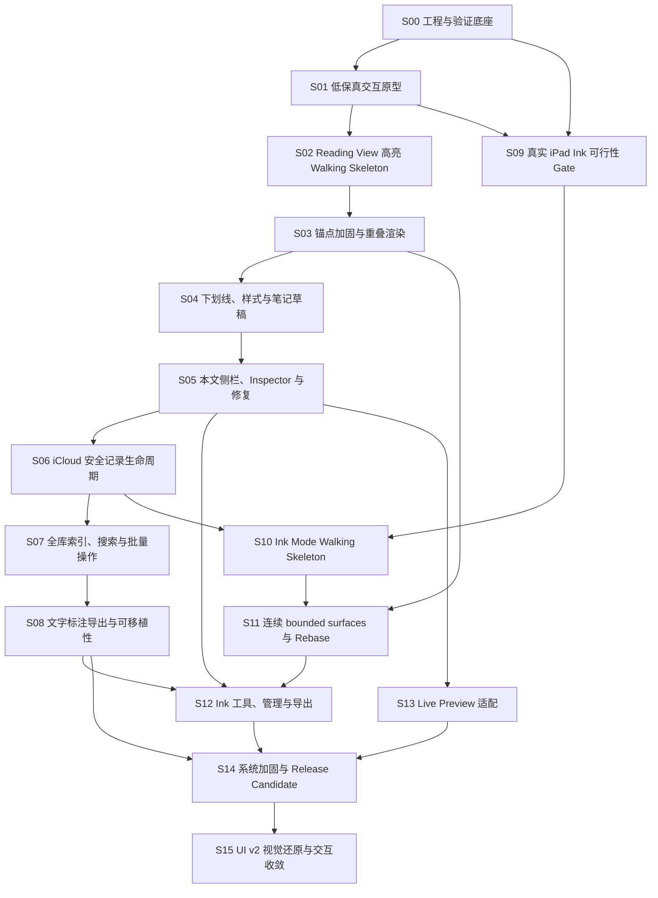

# Obsidian 标注插件执行任务书

## 状态

- 创建日期：2026-07-14
- 状态：执行中（S02～S14 的既有自动实现与桌面证据已汇入，S15 UI
  v2 正在演进；统一端到端回归及完整桌面/Windows/iCloud/iPad HAT 仍待完成）
- 目标：把产品/架构规格与 UI/UX 规格拆成可按依赖执行、可独立验收、可保留证据的 vertical slices。
- 实现仓库：`/Users/ivan/workspace/ai/obsidian-annotation-plugin`；全文中的 `<plugin-root>`
  均指向该目录。
- 当前文件同时承担任务编排和完成状态登记；只有带证据的 checkbox 才能勾选。

## 后续增量规格

当前第一版 Ink 方向及其 S16 交付清单已独立到
[Ink v1 固定宽度工作区与手动重定位规格](2026-07-15-ink-fixed-width-manual-repositioning.md)。本任务书保留 S00～S15 的历史执行基线；两者冲突时，以该增量规格为准。

## 两个规格的映射

当前两个逻辑规格位于同一个物理文件中：

1. **产品与架构规格**：`Product Definition` 到
   `Validation Spikes Required Before Full Implementation`，覆盖领域模型、锚点、sidecar、iCloud、Ink、性能和故障边界。
2. **UI/UX 交互规格**：`UI/UX Interaction Specification` 到
   `UI/UX Acceptance Criteria`，覆盖桌面/iPad 交互、工具栏、笔记、Inspector、Ink
   Mode、侧栏、无障碍和反馈。

执行时必须重读原始章节，不能只依赖本任务书的摘要。

## 使用方式

- 一个 Slice 是一个最小完整的“开发—验证”闭环，不是单纯的技术层或文件目录。
- 每次只把满足 Definition of Ready 的 Slice 标记为进行中。
- Slice 内的实现、自动测试、人工验收、性能/可靠性检查和证据归档全部完成后，才能勾选 Slice 完成。
- 2026-07-15 起按用户指令优先快速自动验证：剩余物理设备/真实 iCloud/主观 UX 验收由用户后续执行；这些条目继续保持未勾选，不能用单元测试冒充通过。
- Gate 未通过时，后续依赖 Slice 不得用临时假设继续堆功能。
- 本任务书不直接创建 issue、分支、PR 或发布版本；进入执行时可将每个 Slice 转成独立 issue。
- 如规格与执行任务冲突，以规格中的硬边界为准，并先更新规格与本任务书，避免代码成为新的隐式规格。

## 交付目标

第一个完整可发布候选版本必须形成以下闭环：

- 在 Reading View 选择支持的 Markdown 文本，创建高亮、下划线或笔记。
- 关闭并重新打开 Obsidian 后，文字标注仍能解析并正确渲染。
- Markdown 发生局部变化时，标注可以自动重定位；不能可靠定位时进入可恢复的 `unanchored` 状态。
- 当前文件侧栏可以查看、定位、编辑、复制、删除、撤销删除和修复标注。
- 全库侧栏可以懒加载索引并进行搜索、筛选、分组和安全的批量操作。
- sidecar 数据在 iCloud 文件级同步约束下尽量隔离冲突，并显式暴露无法安全合并的冲突。
- 用户通过明确开关进入 Ink Mode，在桌面用鼠标、在 iPad 用 Apple Pencil 绘制。
- Ink 可见时保持固定标注版式；内部 bounded surfaces 对用户呈现为连续画布。
- Ink 支持笔、荧光笔、整笔橡皮、颜色、粗细、撤销/重做、侧栏管理和 SVG/PNG 导出。
- Mac、Windows 和真实 iPad 上通过目标交互、性能、可访问性和恢复性验收。

以下内容不进入第一个完整版本：PDF/EPUB/Web 标注、多人协作、AI 摘要/OCR/手写识别、自建同步服务、任意第三方生成 DOM、任意响应式 Ink、语义化识别 Ink 内容。

## 依赖图



## 里程碑与 Gate

| 里程碑               | 包含 Slice         | 可观察结果                                                 | 必须通过的 Gate                 |
| -------------------- | ------------------ | ---------------------------------------------------------- | ------------------------------- |
| M0 可行性成立        | S00、S01、S02、S09 | 桌面文字高亮闭环成立；真实 iPad 输入与固定版式有证据       | G1 文字锚点、G2 iPad Ink        |
| M1 文字标注 MVP      | S03～S06           | 完整文字标注、本文件管理、恢复、iCloud 生命周期            | G3 锚点可靠性、G4 iCloud 冲突   |
| M2 全库知识管理      | S07～S08           | 全库检索、批量整理和可移植导出                             | G5 规模与导出                   |
| M3 Ink Beta          | S10～S12           | 固定版式上的完整 Ink 创建、管理、恢复与导出                | G6 bounded surface 与跨设备布局 |
| M4 Release Candidate | S13～S15           | Reading/Live Preview、桌面/iPad、性能、无障碍与 UI v2 闭环 | G7 发布验收                     |

Gate 定义：

- **G1 文字锚点**：支持范围内的基础段落/标题选择能够持久化、刷新、重开并重渲染，不能用 DOM
  Range 作为持久化真相。
- **G2 iPad Ink**：真实 iPad 上证明 Pencil 绘制、手指滚动、pointer
  capture、长笔迹和固定版式可用；模拟器不能替代。
- **G3 锚点可靠性**：规定 fixture 变更矩阵内无一次静默错绑；不能唯一解析时全部进入 `unanchored`。
- **G4 iCloud 冲突**：真实双设备离线/重连测试完成；同记录冲突被保留并暴露，不能以 Last Write
  Wins 假装安全。
- **G5 规模与导出**：20,000 条索引与 500 条当前笔记标注达到性能预算；导出可重读且包含 unresolved 数据。
- **G6
  Ink 版式**：桌面与 iPad 互建互看，跨 surface 笔迹连续，修改上方/内部/下方内容分别触发正确的移动、rebase 或 unanchored。
- **G7 发布验收**：所有 P0/P1
  HAT 通过，S15 核心界面获得用户视觉验收，无数据丢失、静默错绑、不可恢复笔迹或虚假的“已同步”状态。

## 规格覆盖矩阵（审计索引）

这张矩阵不是新的需求来源；它用于证明每个已确认决策和 UI/UX 验收条件都有实现与验证落点。规格变更时，先从这里定位受影响 Slice，再修改依赖、任务和 Gate。

| 规格决策/验收主题                                                                    | 主负责 Slice  | 复用或回归 Slice        |
| ------------------------------------------------------------------------------------ | ------------- | ----------------------- |
| D-01、D-02、D-03：独立 annotation domain、sidecar canonical、materialization 仅导出  | S02           | S06、S08、S14           |
| D-04、D-05：compound anchor、唯一高置信解析、fail closed                             | S02、S03      | S05、S13、S14           |
| D-06：保留 `unanchored` 并可修复                                                     | S03、S05      | S08、S11、S14           |
| D-07、D-08：显式 Ink Mode、固定逻辑版式                                              | S09、S10、S11 | S12、S14                |
| D-09、D-10、D-11、D-12：iCloud、小粒度 records/surfaces、派生索引                    | S06           | S02、S07、S10、S11、S14 |
| D-13、D-14：Reading View 优先、明确拒绝 unsupported/ambiguous content                | S02、S03      | S04、S05、S13           |
| D-15：mobile-first，禁止 desktop-only 顶层依赖                                       | S00、S09      | S10、S12、S14           |
| D-16、D-17：选择不自动写入；桌面 anchored toolbar 与 iPad fallback                   | S01、S02、S04 | S09、S14                |
| D-18：mark、note body、tags 可组合                                                   | S04           | S05、S08、S13           |
| D-19、D-20：Inspector、overlap chooser、single undo、high-scope confirmation         | S05           | S07、S12、S14           |
| D-21、D-22、D-23、D-24：可见 Ink state、continuous overlay、Pencil/手指/鼠标输入分工 | S09、S10、S11 | S12、S14                |
| D-25、D-26：Current file/Entire Vault、紧凑列表、style 与 tag 分类                   | S05、S07      | S08、S12、S14           |
| UI：quick toolbar、composer、focus、keyboard、a11y、empty/error/recovery copy        | S01、S04、S05 | S09、S12、S14           |
| UI：fixed layout transition、Ink palette、save failure、rebase experience            | S09、S10、S11 | S12、S14                |
| UI：全文检索、filters、bulk actions、virtual list                                    | S07           | S08、S14                |
| UI v2：Obsidian 原生图标、紧凑 toolbar/Inspector、双 scope 侧栏、Ink dock            | S15           | S05、S07、S12、S14      |
| 性能预算、真实设备、iCloud、端到端恢复性                                             | S00、S06、S09 | S11、S14                |

## Slice 通用 Definition of Ready

每个 Slice 开始前必须满足：

- [ ] 上游依赖 Slice 已完成，或依赖图明确允许并行。
- [ ] 执行者已重读本 Slice 引用的规格章节与决策 ID。
- [ ] 本 Slice 的用户可观察结果、非目标和失败语义没有歧义。
- [ ] 自动测试 fixture、人工验收设备和所需数据已经可用。
- [ ] 涉及 iPad/iCloud 的 Slice 已预约真实设备与账号环境，不能以未来补测替代完成条件。
- [ ] 性能或可靠性预算已有测量入口，而不是完成后再临时补 instrumentation。
- [ ] 未决设计问题已经升级为 Gate 或显式限制，不允许隐藏在实现 TODO 中。

## Slice 通用 Definition of Done

每个 Slice 完成时必须满足：

- [ ] 用户可观察闭环可在干净 fixture Vault 中重现。
- [ ] 领域逻辑先有失败测试，再完成实现并保持回归测试绿色。
- [ ] 单元、契约、集成测试与本 Slice 相关的静态检查全部通过。
- [ ] 对应 HAT 清单已执行；P0/P1 有明确通过证据，P2 问题已记录。
- [ ] 对数据写入、失败重试、卸载/重载、异常退出做过本 Slice 所需验证。
- [ ] 性能测量不超过当前预算，或规格已明确接受新预算及原因。
- [ ] 没有把 canonical 数据放入 cache/index，也没有用 UI 状态代替领域状态。
- [ ] 变更包含迁移/兼容处理，或明确证明当前无历史数据需要迁移。
- [ ] Slice 产物保留 Source Manifest、测试命令、结果摘要、截图/录屏或性能报告。
- [ ] 发现的新风险已回写规格或本任务书，而不是只留在 PR 评论或聊天里。

## 全局验证矩阵

### 自动测试层

- [x] Pure unit：selector、resolver、score、record invariant、revision、tombstone、Ink
      geometry、index、export。
- [x] Property/fuzz：重复文本、Unicode、随机局部编辑、point simplification、stroke split/join。
- [x] Repository contract：创建、读取、更新、删除、重试、冲突副本、损坏文件、schema migration。
- [x] DOM integration：Markdown preview sections、嵌套 inline markup、overlap、post-processor
      cleanup。
- [x] Editor integration：CodeMirror transaction、viewport decorations、IME/composition。
- [x] Performance fixture：200,000 字符、500 个当前文件标注、20,000 个全库记录、长笔迹与多 surface。

### 人工验收环境

- [ ] macOS + 当前 Obsidian stable，默认浅色/深色主题。（真实 Obsidian
      1.12.7 的默认 light/dark 文字高亮、Ink、侧栏与 focus 已通过；完整 macOS P0/P1 仍有 Live
      Preview、accessibility、crash/background 等项目。）
- [ ] Windows + 当前 Obsidian stable，至少完成 Reading、侧栏、文件路径和鼠标 Ink 回归。
- [ ] 真实 iPad + 当前 Obsidian mobile + Apple Pencil，覆盖横竖屏、Split View、键盘和后台恢复。
- [ ] iCloud 同一 Vault 的 Mac/iPad 双设备离线、重连、同记录冲突和首次 hydration。
- [ ] 至少一个常用第三方主题做兼容性观察，但不承诺任意主题像素一致。

### 固定性能预算

- [ ] 同步插件启动工作：桌面低于 30 ms，平板低于 60 ms。
- [x] 桌面选择工具栏：selection stable 后低于 100 ms。（真实 macOS Obsidian 样本为 2.5 ms。）
- [ ] iPad 选择工具栏：native selection stable 后低于 150 ms。
- [ ] Ink input-to-paint：60 Hz 下 P95 低于 16.7 ms。（真实 macOS Obsidian 单 surface 36 帧为 P50
      3.9 ms、P95 10.2 ms、max 19.3 ms；200k/30-surface 42 帧为 P50 8.4 ms、P95 14.8 ms、max 18.3
      ms，真实跨 boundary 连续笔迹已通过。Windows 与 iPad/Pencil 仍待验证。）
- [x] 20,000 条全库结果使用虚拟列表，不一次加载 Ink vector points。（10,000 text + 10,000 Ink
      list-only fixture；Ink vector 与 thumbnail SVG 均被契约测试排除。）
- [ ] 200,000 字符与 500 条标注的长文档滚动时不进行全文件重渲染。

---

## S00：工程与验证底座

**目标**：得到可在桌面 Obsidian 加载、可自动测试、可安装到 fixture
Vault、可记录性能与错误证据的插件空骨架。

**依赖**：无。

**非目标**：不实现标注业务；不把源码直接开发在当前 AI Wiki 的 `.obsidian/plugins/` 运行目录中。

### 实现清单

- [x] 确认独立实现仓库或 package 路径，并记录 `<plugin-root>` 的真实位置。
- [x] 确认插件 ID、显示名、最低 Obsidian 版本和 mobile 支持声明；名称可暂定但 ID 一旦产生用户数据后不随意变化。
- [x] 创建 TypeScript 插件骨架、`manifest.json`、构建与开发安装脚本。
- [x] 建立 `domain`、`application`、`storage`、`adapters/obsidian`、`ui`、`test-fixtures`
      的边界，禁止 UI 直接写 sidecar。
- [x] 配置 format、lint、typecheck、unit test、coverage 和 production build。
- [x] 建立 fixture
      Vault，包含段落、标题、列表、任务、引用、callout、链接、强调、代码、数学、Mermaid、Dataview 占位、CJK、emoji 和重复文本样例。
- [x] 建立插件 load/unload、view 注册/释放、event listener 与 DOM cleanup 测试入口。
- [x] 建立可关闭的诊断日志和性能 mark，默认不记录正文、笔迹内容或敏感路径。
- [x] 建立 mobile-safe import 检查，阻止顶层 Node/Electron API 进入 mobile bundle。
- [x] 建立版本化 schema/migration 入口，即使 v1 暂时没有迁移。

### 自动验证清单

- [x] 全新 clone/install 后一条命令可以完成 lint、typecheck、unit test 和 build。
- [x] production bundle 可以被 fixture Vault 加载，无启动异常。
- [x] 连续 enable/disable 插件三次，没有重复 view、重复 event listener 或残留 DOM。
- [x] mobile bundle 静态检查不包含禁止依赖。
- [x] 空插件同步启动工作达到预算，记录基线而非只写“感觉很快”。
- [x] 破坏一个 manifest/schema fixture 时测试能够失败，证明验证链不是空跑。

### 人工验收清单

- [x] macOS Obsidian 可以加载、禁用、重载插件。
- [ ] Windows Obsidian 可以加载插件并正确处理中文/空格路径。
- [ ] iPad Obsidian 可以加载空插件，打开 Vault 与切换笔记不崩溃。
- [x] 打开调试开关能看到结构化诊断；关闭后不产生正文级日志。

### 证据与退出条件

- [ ] 保存环境重建说明、验证命令、三端加载截图和启动基线报告。
- [x] 后续 Slice 不需要手工复制未记录文件才能运行测试。
- [ ] Gate：工程底座通过后才允许 S01、S02、S09 进入实现。

---

## S01：低保真交互原型与状态契约

**目标**：在生产代码前验证桌面/iPad 的选择工具栏、笔记、Inspector、Ink
Mode 和侧栏信息架构，形成实现可直接消费的状态契约。

**依赖**：S00。

**规格覆盖**：D-16、D-17；UX Constitution、Interaction State Model、Adaptive Interaction
Surfaces、Accessibility and Command Integration。

**非目标**：不追求高保真视觉；不写 canonical sidecar；不以静态截图代替交互状态验证。

### 原型清单

- [x] 建立 Reading、TextSelected、Composing、Annotated、Inspecting、InkMode、Saving、Managing 状态原型。
- [x] 原型覆盖桌面 selection-anchored toolbar 的上/下/左右 viewport collision。
- [x] 原型覆盖 iPad anchored toolbar 与稳定 bottom action bar fallback，确保单次交互中不反复跳位。
- [x] 原型覆盖五个颜色预设、Underline、Add note、More 的固定动作顺序。
- [x] 原型覆盖桌面 360 px 左右 composer 与 iPad keyboard-aware bottom sheet。
- [x] 原型覆盖 note-only anchor、高亮+笔记、下划线+笔记。
- [x] 原型覆盖单标注 Inspector 与 overlap record chooser。
- [x] 原型覆盖当前文件/全库 scope、问题区、紧凑行、Ink thumbnail 和批量选择模式。
- [x] 原型覆盖桌面竖向 Ink palette、iPad 底部 Ink palette、显式 Exit 和保存失败。
- [x] 原型覆盖空状态、unsupported、unanchored、needs-rebase、iCloud
      conflict 和 local-save-only 文案。
- [x] 定义 focus return、Escape 层级、键盘漫游、touch target、reduced motion 和非颜色状态表达。

### 验证清单

- [x] 使用任务脚本走通“选择并一键高亮”，没有误触发自动标注。
- [x] 走通“添加笔记—键盘出现—切后台—返回—本地草稿仍在”。
- [x] 走通“点击重叠区域—选择正确记录—修改—返回原位置”。
- [x] 走通“进入 Ink—识别当前模式—绘制—退出—内容不重排”。
- [x] 走通“侧栏定位问题标注—选择替代文本—预览—确认 reattach”。
- [x] 在窄桌面窗格、iPad 横/竖屏和模拟键盘区域检查遮挡、跳位和不可退出状态。
- [x] 用仅键盘操作工具栏、Inspector 和侧栏；用高对比/色盲视角检查状态表达。
- [x] 记录仍需真实 WebView/Pencil 才能验证的行为，不把原型结果写成平台事实。

### 产物与退出条件

- [x] 输出可交互低保真原型或等价可运行 demo，而非只输出图片。
- [x] 输出 component/state/command/error copy 清单和关键尺寸的“待测范围”。
- [x] 已核对原型结论：无需改变产品规格语义，状态契约仅将既有要求具体化。
- [ ] 用户完成一次核心任务 walkthrough 并确认交互骨架。
- [x] Gate 例外：用户在尚未执行 walkthrough 时明确要求“先跳过 iPad 验证，继续开发”；按先前“其他按推荐”冻结 A +
      B fallback、淘汰 C，S02 允许开始。

---

## S02：Reading View 单色高亮 Walking Skeleton

**目标**：交付第一个真正端到端闭环：选择支持的文字，点击一个颜色，写入独立 sidecar，立即渲染，重启后仍正确显示。

**依赖**：S00、S01。

**规格覆盖**：D-01～D-05、D-11～D-16；Text Annotation Record、Anchor Creation、Reading View、Quick
Annotation Toolbar。

**非目标**：只支持段落与标题；不做下划线、笔记、侧栏、全库索引、复杂恢复和 Ink。

### 测试先行清单

- [x] 为 UTF-16 position、exact quote、prefix/suffix、heading scope 和 source revision 建立 record
      fixture。
- [x] 写出“选区映射成功—保存—重新解析”的失败测试。
- [x] 写出“只选择但不点击动作时不产生任何 record”的失败测试。
- [x] 写出“插件刷新后按 position 快速命中，quote 校验通过”的失败测试。
- [x] 写出“DOM wrapper cleanup 后原始预览结构保持有效”的失败测试。
- [x] 写出 per-record JSON 的 create/read/update schema contract 测试。

### 实现清单

- [x] 实现稳定 note ID、normalized Vault-relative path、path hash 与 `meta.json`。
- [x] 实现最小 `TextAnnotationRecord` invariant 和版本化 JSON codec。
- [x] 实现每条文字标注一个 UUID 文件的 repository；索引/cache 不得成为 canonical。
- [x] 捕获 Reading View selection 与所属 preview section，不持久化 DOM Range。
- [x] 对段落和标题实现 rendered text 到 Markdown source 的 compound anchor。
- [x] 实现一个默认颜色的 selection-anchored action。
- [x] 点击颜色后写 record、渲染 text-node-local wrapper、折叠 selection、关闭 toolbar。
- [x] 按 section 只加载/渲染相关 annotation，注册 cleanup。
- [x] 保存失败时不显示成功高亮，并保留可重试错误上下文。

### 自动验证清单

- [x] unit：record codec、invariant、path normalization、position/quote selector。
- [x] contract：独立 record 文件可 round-trip，损坏 JSON 不导致其他记录丢失。
- [x] DOM integration：段落、标题、inline emphasis 内选区渲染后 DOM 结构有效。
- [x] reload integration：卸载/重载/重开笔记后同一高亮恢复。
- [x] negative：selection collapse、跨不支持 block、空选择不创建文件。
- [x] 性能：toolbar 与当前 section render 达到预算并保留测量报告。

### 人工验收清单

- [x] 桌面 Reading View 选择段落并一次点击创建高亮。（真实鼠标精确选择
      `italic text`，一次 Mint 创建同一 canonical ID。）
- [ ] 只选择、复制或点击空白处不会留下标注文件。
- [x] 切换笔记、重载插件、重启 Obsidian 后高亮仍在。（S02 `bold text` 已完成应用重载；S14 新建
      `italic text` 的 disable/enable 前后 record hash 与渲染 ID 一致。）
- [x] 主题切换时高亮可读，且不破坏链接点击与普通滚动。（默认 light/dark 实测对比度：violet
      7.39/6.09，yellow 13.83/8.44；第三方主题保留在 S14。）

### 退出条件

- [x] G1 功能 Gate 通过：Walking Skeleton 在 fixture
      Vault 可重复执行；桌面视觉判断仍保留为人工 HAT 项。
- [x] 记录测试、HAT、性能与 sidecar 示例；任何映射限制已显式进入 unsupported 清单。

---

## S03：锚点加固、Unanchored 与重叠渲染

**目标**：把 S02 的基础闭环扩展到规定的 Reading View 内容类型，并证明局部编辑后不会静默错绑。

**依赖**：S02。

**规格覆盖**：D-04～D-06、D-14；Reattachment Order、Supported/Restricted Content、Overlapping
Annotations、Reliability Policy。

### 测试先行清单

- [x] 为标题、列表/任务、引用、callout、链接标签、bold/italic/highlight/strike 建立映射 fixtures。
- [x] 为 CJK、emoji、combining characters、双向文本和相同 quote 重复出现建立 fixtures。
- [x] 建立 insert/delete/reorder/heading rename/section move 的 mutation matrix。
- [x] 写出 position 命中、block-scope quote 命中、section-scope 命中、全局候选评分的分级测试。
- [x] 写出 repeated text 多候选时拒绝静默绑定的测试。
- [x] 写出找不到目标时完整保留 quote/body/tags/style/context 的 `unanchored` 测试。
- [x] 写出 overlap interval plan、跨 text node fragment 和多个 underline layer 的测试。
- [x] 写出 Mermaid、Dataview、iframe、partial math/code、cross-file embed 与复杂跨块选择的拒绝测试。

### 实现清单

- [x] 实现按 position → block → section → wider search 的 resolver pipeline。
- [x] 实现候选评分、唯一性阈值和可诊断的失败 reason code。
- [x] 缓存 source line offsets 与 mapping artifacts，并以 file revision 失效。
- [x] 为支持内容实现 source mapping；拒绝内容返回精确原因。
- [x] 实现 `unanchored` 状态，不删除 canonical record。
- [x] 实现 interval render
      plan，跨节点/块拆成局部 fragments。（同类型且可稳定映射的简单跨 block 选择持久化为一个 compound
      anchor，并在同一或分离 preview section 中拆成 block-local
      fragments；跨不同复杂 block 类型按规格继续 fail closed。）
- [x] 实现 overlap hit-testing：点击时返回所有 record ID，不由视觉 z-order 选择记录。
- [x] 确保 post-processor rerender/unload 清理所有 plugin-owned wrapper/listener。

### 自动验证清单

- [x] mutation suite 内自动重定位结果全部符合 expected target 或 expected unanchored。
- [x] supported fixture 无静默错绑；ambiguous fixture 的 false-positive 数为 0。
- [x] property/fuzz 对随机局部插入删除不抛异常、不丢记录、不产生越界 position。
- [x] overlap render 不破坏 heading/list/quote/link DOM 语义。
- [x] 500 条标注 fixture 仅渲染相交 section，不随滚动进行全文件重渲染。

### 人工验收清单

- [ ] 在所有支持 block 中创建标注并刷新验证。
- [x] 修改标注前后文本、移动章节和制造重复文本，观察正确重定位或 unanchored。（真实 macOS 插入/删除已验；重复文本由 mutation
      fixture 验证。）
- [ ] 在 unsupported 表面选择文字时看到短而精确的原因，没有生成 sidecar。
- [ ] 点击重叠区域能获得完整 record 列表。

### 退出条件

- [x] G3 通过：fixture mutation matrix 无静默错绑。
- [x] 评分阈值、reason codes、支持矩阵和已知限制形成可重读文档。

---

## S04：样式、下划线与笔记草稿闭环

**目标**：在同一个 annotation
target 上组合 highlight/underline、Markdown 笔记、标签和稳定样式预设，完成桌面与 iPad 的笔记创建/恢复体验。

**依赖**：S03。

**规格覆盖**：D-16～D-18、D-26；Text Annotation Record、Quick Annotation Toolbar、Note
Composer、Style and Classification Model。

### 测试先行清单

- [x] 写出 `mark` 可选、`body` 可选但 active record 至少包含 mark/body/tag 之一的 invariant 测试。
- [x] 写出 highlight-only、underline-only、note-only、highlight+note、underline+note 的 codec 测试。
- [x] 写出 `draft → active`、空 draft cleanup、关闭/后台/卸载强制 flush 测试。
- [x] 写出 style preset 改名/改色但 annotation `styleId` 不变化的测试。
- [x] 写出 note-only anchor indicator 与普通 highlight 不混淆的渲染测试。
- [x] 写出保存失败后草稿不丢、状态不虚假显示为 saved 的测试。

### 实现清单

- [x] 实现最多五个默认 style presets，preset 有稳定 ID、颜色和可选名称。
- [x] 扩展 quick toolbar：直接颜色、Underline、Add note、More；顺序保持稳定。
- [x] Underline 使用当前或最近样式；额外颜色放入二级控件。（第一版上限为五个，无额外 preset。）
- [x] Add note 先持久化 target draft，再把焦点移入 composer。
- [x] 桌面实现 anchored compact composer；iPad 实现 keyboard-aware bottom
      sheet/fallback。（iPad 真机验证延期。）
- [x] composer 顶部保留一到两行 quote，上下文不会因 selection collapse 丢失。
- [x] 对正文输入 debounce autosave，并在 close/navigation/background/unload 强制 flush。
- [x] 仅显示 `Saving…`、`Saved locally` 或可操作的错误；不显示无证据的 `Synced`。
- [x] 实现 tags 基础编辑，确保 tags 与 style/color 解耦。
- [x] 注册 apply-last-highlight、add-note-to-selection 命令，但默认快捷键可由用户配置。

### 自动验证清单

- [x] 所有 mark/body/tag 组合 round-trip，旧 S02 record 兼容读取或有明确 migration。
- [x] 快速连续输入、切笔记、关闭 view、卸载插件不会覆盖较新 draft revision。
- [x] style 改名/改色不触发 target 重写，当前渲染正确刷新。
- [x] 空 draft 不残留可见垃圾记录；已输入 draft 在异常关闭后可恢复。
- [x] toolbar 使用键盘 roving focus、Enter/Space、Escape，并正确 return focus。
- [x] selection-toolbar 桌面性能继续满足预算。（真实 macOS 测得 3 ms。）

### 人工验收清单

- [ ] 创建五种颜色高亮、下划线和 note-only annotation。
- [x] 给已有高亮添加笔记，再将其改为下划线，笔记和 tags 不丢失。（真实 macOS 同 ID revision
      1→2→3。）
- [ ] iPad 调整 selection handles 后打开 composer，toolbar 不反复跳位。
- [ ] 输入笔记后立即切后台再返回，草稿仍在且只声称本地保存。
- [ ] 屏幕阅读器/高对比下能区分颜色预设名称、underline 和 note anchor。

### 退出条件

- [x] 文字标注创建面已覆盖规格中的所有第一版类型组合。
- [x] iPad 文本选择仍有未验证平台行为时，必须记录 fallback 与设备证据，不能隐含假设。（bottom-sheet 已实现；真机矩阵明确延期且保持未勾选。）

---

## S05：本文侧栏、Annotation Inspector、Undo 与修复

**目标**：用户无需操作 sidecar 文件即可在当前文档查看、定位、编辑、复制、删除、撤销删除并修复文字标注。

**依赖**：S04。

**规格覆盖**：D-06、D-19、D-20、D-25、D-26；Unanchored Recovery、Current File Sidebar、Existing
Annotation Inspector、Deletion and Undo。

### 测试先行清单

- [x] 写出按 document position 与 heading group 排序的 selector 测试。
- [x] 写出 compact-row view model：style/type、两行 quote、两行 note preview、tags/status。
- [x] 写出 document click ↔ sidebar active row 同步测试，关闭侧栏时不自动打开。
- [x] 写出 overlap chooser 返回全部匹配记录并编辑指定 ID 的测试。
- [x] 写出 delete → tombstone → undo restore 的领域测试。
- [x] 写出 reattach 必须先 preview 新 target、确认后更新 anchor 的测试。
- [x] 写出 unanchored record 在 repair 前仍可编辑、复制、导出的测试。

### 实现清单

- [x] 注册一个延迟初始化的 Annotation side view，默认 scope 为 `Current file`。
- [x] 实现 heading groups、compact rows、active-row expansion 与问题区。
- [x] 点击行时跳转目标并短暂 pulse；找不到目标则进入问题区而非跳到错误位置。
- [x] 点击正文 annotation 打开 Inspector；hover 仅做非必要 preview。
- [x] Inspector 支持 mark/style、note、tags、copy quote、copy annotation link、source
      navigation 和 delete。
- [x] overlap 第一步显示 record chooser，不让视觉 z-order 决定编辑对象。
- [x] 单条删除立即写 tombstone 并提供 undo toast/command。
- [x] 实现 reattach 流程：选择替代文本 → 生成 candidate → 展示 quote/context preview → 确认写入。
- [x] 错误关闭后 focus 返回调用 mark 或 sidebar row。
- [x] 侧栏空状态说明如何选择文字，不放伪造示例数据。

### 自动验证清单

- [x] side view 未打开时不做昂贵初始化。
- [x] 500 条当前文件标注的 row model 与导航不加载全 Vault。
- [x] delete/undo 在重载前后保持 canonical 一致，不因 UI optimistic state 丢记录。
- [x] reattach 失败不会覆盖旧 quote/context；成功后新位置可重新解析。
- [x] overlap 编辑只改变目标 record。
- [x] view close/unload 释放 listener、observer 和 pending timeout。

### 人工验收清单

- [x] 侧栏按照标题与文档顺序展示高亮、下划线、笔记。
- [x] 点击行准确导航；点击正文准确选中侧栏行。
- [x] 编辑 overlap 中的第二条记录，第一条不变化。
- [x] 删除一条并撤销；批量/整 surface 删除尚未出现。
- [x] 制造 unanchored，按引导重新选择文本并确认修复。
- [ ] 窄侧栏和 iPad drawer 中不存在水平溢出或不可达动作。

### 退出条件

- [x] 当前文件文字标注的创建—查看—编辑—删除—恢复闭环全部可用。
- [x] 侧栏在未打开时对启动和 Reading View 没有可测的显著成本。

---

## S06：iCloud 安全的记录生命周期与冲突暴露

**目标**：在 iCloud 文件级传输约束下，实现 record/surface 级写入隔离、revision、tombstone、rename
reconciliation、冲突探测和可恢复失败语义。

**依赖**：S05。

**规格覆盖**：D-09～D-12；Canonical Storage Model、iCloud Synchronization and Conflict
Policy、Reliability Policy。

**完成限制**：没有真实 Mac/iPad 双设备 iCloud 测试，S06 只能标记为“实现完成，Gate 未通过”，不得标记 Done。

### 测试先行清单

- [x] 写出 per-record serialized writes 与 revision monotonicity 测试。
- [x] 写出 write 前 re-read 最新可见版本、发现 stale revision 时拒绝覆盖的测试。
- [x] 写出 tombstone 防止延迟旧文件复活的测试。
- [x] 写出同 ID 不同 revision、相同 revision 不同内容、bounced/conflicted filename 的 reconciliation
      fixtures。
- [x] 写出 damaged/partial/zero-byte JSON 不连带损坏其他记录的测试。
- [x] 写出 Obsidian 内 rename、插件离线期间外部 rename、同名/路径变化和中文路径测试。
- [x] 写出 derived summary/index 删除后可完整重建的测试。（note summary 已覆盖；Vault
      index 在 S07 建立后继续覆盖。）
- [x] 写出没有云同步证据时 UI 不得进入 `synced` 状态的测试。

### 实现清单

- [x] 实现 per-record/surface write queue，避免同一 canonical 文件并行写。（text record 已完成；Ink
      surface 在 S11 复用。）
- [x] 写入携带 revision、updatedAt、deviceId，并在可能时 write 前 re-read。
- [x] 删除先写 tombstone，垃圾回收使用保守等待期且不得自动清理未知 conflict。（首版禁用自动 GC，等价于无限保守等待。）
- [x] 实现冲突/duplicate file scanner，以 annotation/surface ID 和 revision 归组。（text
      record 已完成；Ink surface 在 S11 复用。）
- [x] 可安全判断时合并不同 UUID 新记录；无法安全判断的同记录分支生成 conflict repair task。
- [x] `summary.json` 与 Vault index 标记为 disposable，任何时候都能从 canonical files 重建。
- [x] 监听 Vault rename/delete/modify，更新 note meta 与路径；插件离线 rename 使用 fingerprint
      reconciliation。（delete 标记 source missing 并保留 sidecar，恢复后清除。）
- [x] 对未 hydration、读取超时、权限、空间不足、写失败提供可重试状态。
- [x] 记录本地写入与 iCloud 传输之间的边界，日志不泄露正文。

### 自动验证清单

- [x] 使用两个独立 repository actor 模拟离线创建不同记录再合并。
- [x] 模拟同时编辑同一记录，系统保留两个候选且不静默丢失任何一方。
- [x] 模拟删除与旧版本迟到，tombstone 阻止复活。
- [x] 模拟 rename、move、case/path normalization 和文件名特殊字符。
- [x] 删除所有 cache/summary 后重建结果与 canonical records 一致。
- [x] 反复注入写失败/进程中断，不产生不可识别的半记录。（DataAdapter temporary/backup
      journal 覆盖 promotion 前后、backup-only、temp-only、promotion
      failure 与 retry 的重启可见状态；真实 OS kill 仍由 S14 HAT 观察。）

### 真实 iCloud 验收清单

- [ ] Mac 与 iPad 离线创建不同 annotation，重连后两者均存在。
- [ ] Mac 与 iPad 离线编辑同一个 annotation，重连后观察真实 artifact 并进入 conflict repair。
- [ ] 一端删除、一端延迟重连，旧记录不静默复活。
- [x] 对同一 Ink surface 做冲突测试，即使 Ink UI 尚未完成也可用 repository fixture。
- [x] 外部移动 Markdown 后重新打开，note sidecar 能自动 reconcile 或要求用户确认。
- [x] 20,000 小文件级 fixture 的首次 hydration 与扫描时间有实测记录。（本地 APFS 上 20,100
      canonical 文件 / 20,000 index entries，冷 hydration 714.32 ms、0 issues；真实 iCloud
      hydration 仍未通过。）

### 退出条件

- [ ] G4 通过，真实冲突行为、无法控制的 `NSFileVersion` 边界和人工恢复路径已记录。
- [x] UI 始终区分 local save、cloud unknown、conflict 和 failed。

---

## S07：全库派生索引、搜索、筛选与批量操作

**目标**：在不把索引变成 canonical truth 的前提下，提供全 Vault 标注查找、分组、过滤和安全批量整理。

**依赖**：S06。

**规格覆盖**：D-12、D-20、D-25、D-26；Entire Vault Sidebar、Performance Principles、Empty States。

> 2026-07-14 状态：桌面文字标注索引闭环已完成并有 20,000 条自动化证据；bulk export 由 S08 接入，Ink
> metadata 由 S11 在 canonical Ink
> schema 建立后补齐。真实滚动/内存规模与 iPad 窄 drawer 验证仍延期，详见插件仓库
> `docs/delivery/slices/S07-vault-index/`。

### 测试先行清单

- [x] 定义仅含搜索/列表所需字段的 index entry，不包含完整 Ink points。
- [x] 写出从 canonical text/Ink metadata 全量重建索引的测试。
- [x] 写出 create/update/delete/rename/conflict 的 incremental index update 测试。
- [x] 写出 quote、body、path、tag、style name、type、status、time 的查询测试。
- [x] 写出 filter chips 组合、默认按 note 分组、空结果原因区分测试。
- [x] 写出 bulk action 的 selection snapshot 与并发变更保护测试。
- [x] 写出 20,000 records 虚拟列表与懒加载性能基准。

### 实现清单

- [x] 只有首次打开 `Entire Vault` 或显式查询时才初始化/刷新全库索引。
- [x] 实现 bounded-concurrency scanner 与可取消的 incremental builder。
- [x] 通过 canonical record events 增量更新；检测漂移时允许安全全量重建。
- [x] 实现统一 search box、可移除 filter chips 和默认 note grouping。
- [x] 使用虚拟列表，不因列表行加载 Ink vector arrays。
- [x] 明确进入 bulk mode 后才显示 checkbox。
- [x] 实现 bulk copy、tag/style change、export selection 和 deletion confirmation。
- [x] bulk delete 逐条写 tombstone，部分失败时报告成功/失败集合，不做虚假全成功。
- [x] 区分 `No annotations`、`No matching results`、`Index building` 和 `Index unavailable`。

### 自动验证清单

- [x] 随机删除 index/cache 后能重建等价结果。
- [x] rename/move 后旧 path 不残留为重复结果。
- [x] 搜索排序和分组稳定，CJK 与大小写行为有明确测试。
- [x] 20,000 条结果下首次可交互时间、搜索延迟、虚拟窗口物化与真实 Obsidian 滚动表现有报告。（本地 APFS/Node：hydration
      714.32 ms、search 19.58 ms、18-row window 0.06 ms；真实 Obsidian
      20k 物理 profile 与 caveat 见 S14 evidence。）
- [x] bulk 部分失败不会丢掉未处理 selection，也不会覆盖较新 revision。
- [x] side view 未打开时 index 不在插件启动同步路径执行。

### 人工验收清单

- [ ] 从当前文件切换到全库后看到构建/加载进度，Reading View 不冻结。
- [ ] 按路径、quote、note、tag、style、status 搜索并组合筛选。
- [ ] 点击结果打开正确笔记并导航目标；unanchored 打开问题上下文。
- [ ] 进入 bulk mode 批量加 tag、复制和删除，确认框显示准确数量。
- [ ] iPad 窄 drawer 下筛选 chips、分组和批量操作仍可达。

### 退出条件

- [x] G5 的 20,000 条索引性能部分通过。（10,000 text + 10,000 Ink list-only
      metadata 的搜索预算与虚拟 DOM 已通过；真实滚动帧率/内存仍归 S14。）
- [x] 证明删掉整个派生索引不会造成 canonical 数据损失。

---

## S08：文字标注导出与可移植性

**目标**：让用户即使离开插件，也能把高亮、下划线、笔记、tags、来源和 unresolved 状态导出为可读格式。

**依赖**：S07。

**规格覆盖**：D-02、D-03；Portability、Unanchored Recovery、Entire Vault bulk export。

### 测试先行清单

- [x] 为 Markdown highlight、HTML `<mark>`、脚注/邻接笔记、standalone report 建立 golden files。
- [x] 写出 highlight+note、underline+note、note-only、tags、overlap 的导出测试。
- [x] 写出 unanchored/conflict record 仍保留 quote、body、context 和状态的导出测试。
- [x] 写出单条、当前文件、筛选结果和全库导出的稳定排序测试。
- [x] 写出特殊字符、CJK、emoji、Markdown escaping 和 filename collision 测试。

### 实现清单

- [x] 建立与 UI/存储解耦的 exporter interface，输入 canonical read model。
- [x] 实现 plain Markdown、HTML mark、footnote/adjacent note 和 standalone annotation report。
- [x] 对不能无损表达的 underline/overlap 明确使用可读降级并标注元数据。
- [x] 每个导出条目保留 source note/path、quote、note、tags、style/type 和状态。
- [x] 支持当前记录、当前文件、全库筛选结果的导出入口。
- [x] 导出失败不修改 canonical records；重复导出采用明确 overwrite/unique-name 策略。
- [x] 文档说明卸载插件后 sidecar 仍存在，但动态渲染需要插件或显式 materialization。

### 自动验证清单

- [x] golden tests 在相同输入下输出确定性结果。
- [x] 导出的 Markdown/HTML 可被解析，不生成破损 fence、link 或脚注。
- [x] unresolved/conflict 数据不会因无法定位而从导出中消失。
- [x] 20,000 条全库导出使用流式/分批策略，不一次占用不可接受内存。

### 人工验收清单

- [x] 导出一篇含各种 annotation 组合的 Markdown report 并在 Obsidian 重读。
- [x] 导出 HTML 并在浏览器检查高亮和文本转义。
- [x] 卸载/禁用插件后，确认 sidecar 未被删除，导出文件仍独立可读。
- [x] 从筛选结果导出时只包含当前 selection scope。

### 退出条件

- [x] G5 的导出部分通过；格式限制和不可逆降级全部在用户文档中可见。
- [x] exporter contract 可被 S12 复用于 Ink SVG/PNG/report。

---

## S09：真实 iPad Ink 与固定版式可行性 Gate

**目标**：在投入完整 Ink 产品实现前，用受控 spike 在真实 iPad 和桌面证明 Pointer
Events、Pencil/手指分工、Canvas 延迟、固定逻辑版式和 bounded-surface 方向可行。

**依赖**：S00、S01。可与 S02～S06 的文字链并行。

**规格覆盖**：D-07、D-08、D-15、D-21～D-24；Spike B、Spike C、Pointer and Rendering Strategy、Ink
Layout Experience。

**非目标**：spike 数据不是 canonical；不实现完整工具、sidecar 冲突、侧栏或发布 UI。

> 2026-07-14 状态：桌面/mouse 的独立 spike 与自动化契约已完成。用户明确要求先跳过 iPad 验证，因此 G2 仍未通过；允许继续 S10 的桌面实现属于显式风险接受，不代表 Pencil、手指滚动、跨设备对齐或真实长笔迹性能已经证实。证据见插件仓库
> `docs/delivery/slices/S09-ink-feasibility/`。

### Spike 开发清单

- [x] 在 feature flag/独立实验 view 下建立 Pointer Events 采样，不污染生产路径。
- [x] 记录 pointerType、pressure、tilt、coalesced events 数量、capture 生命周期和 frame
      timing；不记录可识别笔迹内容。
- [x] 实现 Canvas 2D active-stroke layer 与 committed-stroke layer。
- [x] 通过 animation frame 批量绘制，stroke 完成后再做 simplification/delta encoding。
- [x] 实现 Pencil/pen 绘制、finger scroll、mouse draw、wheel/trackpad scroll 的实验路由。
- [x] 实现 orientation、Split View、软键盘区域和 app background/resume 探测。
- [x] 建立一个固定 logical width 的 Markdown rendering prototype，在桌面/iPad 之间 scale-to-fit。
- [x] 建立至少两个内部 bounded surfaces，并让一条视觉连续 stroke 跨界后拆成 linked fragments。
- [x] 记录 font family/size/line height/theme/source revision/block fingerprints，并模拟 fingerprint
      mismatch。
- [x] 建立 metrics overlay/导出报告，测 input-to-paint、point 数、simplification ratio 和 redraw
      region。

### 真实设备验证清单

- [ ] Apple Pencil 被识别为 pen，手指保持滚动；两者快速交替不会锁死输入。
- [ ] 验证 pressure、tilt、coalesced events 是否真实可用，并记录缺失/异常值。
- [ ] 验证 pointer capture 在长笔迹、移出 canvas、系统手势和 app 切后台场景的行为。
- [ ] 验证 palm 接触、双指、快速滚动、横竖屏和 Split View。
- [ ] 验证 native text selection menu 与 annotation
      toolbar 的碰撞/fallback，即使这不是 Ink 输入本身。
- [ ] 桌面创建固定版式笔迹后在 iPad 对齐；iPad 创建后在桌面对齐。
- [ ] 切换浅色/深色、改变 viewport、缺失字体时观察 fingerprint 与阻断策略。
- [ ] 跨 surface 笔迹肉眼连续，内部 fragments 可以独立保存/读取。
- [ ] 长笔迹和连续书写达到 P95 16.7 ms 预算；失败时提供 profile 而不是主观判断。

### Gate 决策清单

- [ ] **Pass**：Pencil/手指路由、固定版式、跨设备对齐和性能全部满足最低标准，允许 S10。
- [ ] **Conditional pass**：仅非核心能力缺失，例如 tilt 不稳定；规格明确降级后允许 S10。
- [ ] **Fail—输入**：若无法可靠区分 Pencil 与手指，暂停 S10，重新评估显式 finger-draw/scroll
      toggle。
- [ ] **Fail—版式**：若字体/缩放无法稳定对齐，暂停 S10，重新评估受控字体、只在固定阅读主题显示 Ink 或更小 surface 边界。
- [ ] **Fail—性能**：若 Canvas 路径无法满足预算，先最小化 stroke pipeline/dirty
      region，不能通过降低数据安全要求绕过。

### 证据与退出条件

- [ ] 保存设备型号、iPadOS/Obsidian 版本、测试矩阵、录屏、截图、metrics 和结论。
- [ ] 所有 Conditional/Fail 结论回写产品规格与后续 Slice。
- [ ] G2 通过后 S10 才可进入 production implementation。

---

## S10：Ink Mode 单 Surface Walking Skeleton

**目标**：交付第一个 canonical Ink 闭环：显式进入 Ink Mode，在一个 bounded
surface 上用 pen 绘制，自动保存，退出后不拦截阅读，重开后保持对齐。

**依赖**：S06、S09。

**规格覆盖**：D-07～D-12、D-21、D-22、D-24；Ink Surface Record、Ink State Model、Pointer
Strategy、iCloud write rules。

**非目标**：只实现 pen 和一个 surface；不实现 highlighter、eraser、undo/redo、跨 surface、rebase、缩略图和导出。

### 测试先行清单

- [x] 写出 InkSurface/InkStroke codec、version、revision、point bounds 和 logical layout
      invariant 测试。
- [x] 写出 Reading → InkMode → Saving → Reading 与 save-failure → InkMode 状态机测试。
- [x] 写出 inactive canvas `pointer-events: none` 和 active canvas input capture 测试。
- [x] 写出 stroke completion、debounced persistence、exit/background forced flush 测试。
- [x] 写出写失败保留 in-memory strokes、retry 后 revision 正确推进的测试。
- [x] 写出 desktop/iPad logical coordinate 与 CSS/device pixel conversion 测试。

### 实现清单

- [x] 在 note/view header 注册 Ink switch，并注册 Obsidian toggle/exit commands。
- [x] active 状态持续显示 `Ink Mode`、accent 和明确 Exit，不只依赖颜色。
- [x] 进入时清除 pending text toolbar、锁定 Markdown 编辑、激活透明 canvas。
- [x] 实现一个 bounded surface 的 layout record 与 source/block fingerprint。
- [x] 实现 pen input、pressure fallback、pointer capture、active/committed Canvas layers。
- [x] stroke 完成后 simplification/delta encoding；实时绘制不等待持久化。
- [x] 使用 S06 repository 规则保存一个 surface 文件，按 surface 串行写。
- [x] debounce autosave；exit/background/unload 强制 flush。
- [x] 成功时显示 local save 状态；失败时留在可恢复 Ink Mode 并提供 Retry。
- [x] 退出后 canvas 不再截获 selection、links、scrolling，固定 annotation layout 不重排。

### 自动验证清单

- [x] state machine 所有转移与失败路径可重复测试。
- [x] pointer stream → logical points → codec → reload → render round-trip。
- [x] rapid strokes 不并行覆盖 surface revision。
- [x] 写失败注入后屏幕笔迹与 in-memory model 都不丢失。
- [x] inactive state 的 link、selection 与 scroll integration tests 通过。
- [x] dirty-region/live render 性能保持 S09 预算。（真实 macOS Obsidian production
      Canvas 的单 surface 鼠标样本为 P95 10.2 ms /
      36 帧；iPad/Pencil 与多 surface 仍属于 S09/S14 物理 Gate。）

### 人工验收清单

- [x] 桌面点击 Ink、用鼠标写一笔、退出、继续选择文字和点击链接。（真实 macOS Obsidian：1
      stroke 保存；退出后鼠标拖选 49 字符，链接点击到达 `visible link label`。）
- [ ] iPad 用 Pencil 写一笔、手指滚动、退出后正常阅读。
- [ ] 重载插件、重启 Obsidian、换设备后笔迹仍在正确 surface。（桌面重启后 1 stroke 仍在正确
      `Anchor Lab` surface；换设备未验证。）
- [ ] 人为制造写失败，笔迹留在屏幕且 Retry 后恢复。
- [x] 进入/退出已有 Ink 的 note 不发生内容 reflow。（显式 rebase 后既有 1-stroke
      surface 进/出 Ink，首段 viewport Y 前/中/后差值均为 0 px。）

### 退出条件

- [x] 单 surface Ink 形成 canonical 开发—验证闭环。（真实 Obsidian 鼠标输入后显示
      `Saved locally`，退出后侧栏显示 1 stroke；既有 dark fingerprint 在后续 light
      theme 下按规格进入 `needs-rebase`，vector 未静默丢失。）
- [x] 未实现的工具与跨 surface 能力在 UI 中不可见，不能出现半工作按钮。

---

## S11：连续 Bounded Surfaces、固定版式与 Rebase

**目标**：用户看到连续文档 Ink；内部按稳定章节/块分区、跨界 stroke 可拆分关联，内容修改后只影响必要 surface，并提供 needs-rebase/unanchored 恢复。

**依赖**：S03、S10。

**规格覆盖**：D-08、D-11、D-22、D-23；Fixed Logical Annotation Layout、Markdown Changes After
Ink、Ink Layout Experience、Spike C。

### 测试先行清单

- [x] 定义 surface partition、stable boundary、linked stroke fragment 和 full-note fallback
      contract。
- [x] 写出按 heading section/block group 划分 surfaces 的 fixtures。
- [x] 写出视觉 stroke 跨一个/多个 boundary 后 split、serialize、reload、join-render 的测试。
- [x] 写出内容在 surface 之前移动、surface 内修改、surface 之后修改的状态转换测试。
- [x] 写出 exact fingerprint → active、whole-section move → relocated、layout mismatch →
      needs-rebase、target missing → unanchored 测试。
- [x] 写出固定 logical layout 在 viewport resize、theme change、font missing 时的判定测试。
- [x] 写出 rebase preview 不修改 canonical，confirm 后原子更新 target/layout 的测试。
- [x] 写出同 surface iCloud conflict 不自动覆盖的测试。

### 实现清单

- [x] 实现对用户隐藏的 surface partitioner，默认按稳定 heading section/block group。
- [x] 实现连续 overlay composition，不显示 page/tile 边界。
- [x] 实现 crossing stroke 的 linked fragments 与统一 hit/erase identity。
- [x] surface 保存 source revision、block fingerprints、typography/layout fingerprint。
- [x] 实现 source change reconciliation：无关移动、相关修改、target 消失分别处理。
- [x] Ink 可见时保持固定 annotation
      layout；首次必要转换可动画，后续 enter/exit 不重排。（真实 macOS 既有 surface 进/出前后段落 Y 差值 0
      px，surface 维持 410 × 540。）
- [x] mismatch 时停止误导性原位渲染，保留 thumbnail/vector，进入 `needs-rebase`。
- [x] 实现 rebase UI：旧 thumbnail/context → 选择新 section → placement preview → confirm。
- [x] 实现 unanchored Ink problem item，不删除 vector 数据。
- [x] per-surface 使用 S06 revision/conflict/tombstone 规则。

### 自动验证清单

- [x] 跨 boundary stroke 在 round-trip 后视觉路径误差低于定义阈值。
- [x] 修改某一 section 不把其他稳定 surfaces 标记为 needs-rebase。
- [x] 随机插入/删除/移动 section 的 property tests 不丢 stroke fragments。
- [x] font/theme mismatch 不会静默显示为“已对齐”。
- [x] rebase cancel 保持旧 record；confirm 后新 fingerprint 与坐标一致。
- [x] 长文档多 surfaces 只重绘 viewport/dirty
      regions。（逻辑 overlay 保持全文坐标，物理 Canvas 高度限制为 scroll
      viewport；滚动只筛选并重绘相交笔迹，10,000-stroke 可见性扫描低于 16.7 ms 本地算法预算。）

### 跨设备人工验收清单

- [ ] 桌面创建跨 section Ink，iPad 查看；iPad 创建后桌面查看。
- [ ] 修改 Ink 之前的章节，surface 整体随内容移动。
- [ ] 修改 Ink 绑定章节，进入 needs-rebase 而不是扭曲笔迹。
- [ ] 删除原章节，Ink 进入 unanchored 且缩略图/vector 可访问。
- [ ] 完成一次 rebase，预览与确认一致。
- [ ] 改变 viewport/横竖屏，固定逻辑布局 scale-to-fit 且文字/笔迹仍对齐。

### 退出条件

- [ ] G6 通过，surface 算法、误差阈值、fingerprint 和降级路径有文档与证据。
- [x] 任何 full-note fallback 都是可诊断例外，不成为默认偷懒实现。（仅空笔记允许显式 diagnostic
      fallback；普通笔记必须按 bounded section partitions。）

---

## S12：Ink 工具、侧栏管理与 SVG/PNG 导出

**目标**：完成第一版 Ink 用户能力：pen、highlighter、整笔 eraser、颜色、粗细、undo/redo、双端 palette、侧栏摘要、删除恢复和可移植导出。

**依赖**：S05、S08、S11。

**规格覆盖**：Ink Tool Palette、Ink Pointer Feedback、Sidebar Ink rows、Deletion and
Undo、Portability、Accessibility。

### 测试先行清单

- [x] 写出 pen/highlighter style、width、pressure fallback 与 stroke eraser identity 测试。
- [x] 写出 undo/redo command stack、save boundary、跨 linked fragments 一次撤销的测试。
- [x] 写出整 surface 删除确认、tombstone 和 undo/restore 测试。
- [x] 写出 Ink surface 删除后 live overlay 立即卸载，以及 `Restore` 仅保留 5 秒的计时回归测试。
- [x] 写出 zero-stroke Ink 在 repository、退出时序、Current
      file、增量索引与全量索引重建中的自动回收/不可见回归测试。
- [x] 写出 Ink thumbnail metadata 不加载全 points 的测试。
- [x] 写出 SVG geometry/style 与 PNG dimension/background 的 golden tests。
- [x] 写出 active tool per-device preference 不被 iCloud 延迟设置改变的测试。

### 实现清单

- [x] 实现固定顺序 `Exit | Pen | Highlighter | Eraser | Color | Width | Undo | Redo | More`。
- [x] 桌面使用可折叠竖向 palette；iPad 使用 safe-area 上方底部 palette。
- [x] 再次点击 active pen/highlighter 打开 color/width controls。
- [x] 实现整笔 eraser，linked fragments 作为一个用户 stroke 删除。
- [x] 实现 session-aware undo/redo，并与 surface persistence 正确协调。
- [x] 记住本设备最后工具/颜色/粗细，不从迟到云设置改变 live tool。
- [x] 首次 Ink 显示一次性提示，不做阻塞式教程。
- [x] 当前文件侧栏加入 section-positioned Ink thumbnail、status 和 stroke count。
- [x] Inspector/侧栏支持定位、进入 Ink 编辑、整 surface 删除确认和恢复。
- [x] 删除/恢复 Ink surface 后从 canonical active
      surfaces 重建当前文档 overlay；删除行仅保留 5 秒 Restore 窗口，tombstone 继续持久化。
- [x] 成功退出并完成最终 flush 后自动 tombstone 全部 zero-stroke active
      surfaces；空 surface 不显示、不进入索引、不提供 Restore，保存失败时不回收。
- [x] 实现 SVG vector export、PNG raster export，并接入 standalone report。
- [x] 为 icon、tool state、error、active mode 提供非颜色可访问表达。

### 自动验证清单

- [x] 每个工具对 pointer stream 产生正确 record；eraser 不留下 orphan fragments。
- [x] undo/redo 后 reload 结果与当前画面一致。
- [x] thumbnail/index path 不读取完整 vector points。
- [x] SVG 可解析且保留 logical coordinates；PNG 与目标尺寸/主题策略一致。
- [x] 大 stroke count 下 palette 操作与 eraser hit-test 有性能报告。
- [x] keyboard focus、tooltip、accessible name、reduced motion tests 通过。

### 人工验收清单

- [ ] 桌面/iPad 分别切换所有工具并持续绘制，无隐藏模式或不可退出状态。
- [x] 删除跨 surface 的一笔时视觉和内部 fragments 同时消失，可撤销。（真实 macOS 200k/30-surface
      HAT 中，Eraser 仅命中前一 fragment 后两个 surface 同时从 revision 2 / 1 stroke 变为 revision 3
      / 0 stroke；Undo 同时恢复为 revision 4，共享原 linked stroke ID，截图肉眼连续且无 notice。）
- [ ] 侧栏点击 Ink thumbnail 定位正确 section，并能进入编辑。
- [ ] 删除整个 surface 时确认框显示准确范围；取消不改变数据。
- [x] SVG 在矢量工具/浏览器中可读，PNG 在普通图片查看器中可读。（真实 macOS fixture 导出后由系统
      `file` 识别为 SVG 与 410 × 540 RGBA PNG，SHA-256 已归档。）
- [ ] 屏幕阅读器/高对比下能识别工具、粗细、active Ink 和保存失败。

### 退出条件

- [x] Ink 创建—保存—查看—编辑—删除—恢复—导出闭环完成。（真实 macOS 完成鼠标创建/重启、sidebar
      Edit、Eraser、Undo→Redo→Undo、两步删除/Restore、SVG/PNG；Windows/iPad 属于独立平台 Gate。）
- [x] line、arrow、lasso、shape recognition、Pencil
      double-tap/squeeze/hover 未实现且不出现在第一版 UI。

---

## S13：Live Preview / Editing View 适配

**目标**：复用同一个 annotation domain 与 sidecar，让 Live
Preview 中的文字标注可见并最终支持创建/编辑，不产生第二套格式或锚点逻辑。

**依赖**：S05。可与 S06～S12 并行，但只有 Reading View 领域/UX 稳定后开始。

**规格覆盖**：Editing View、Architecture `Editor adapter`、Implementation Sequence 的最后扩展步骤。

### 测试先行清单

- [x] 写出 canonical record → CodeMirror decoration range 的映射测试。
- [x] 写出 viewport-only decoration、scroll、fold、selection 和 transaction update 测试。
- [x] 写出 insert/delete/replace/undo/redo 后 transient position 更新但 quote/context 保留的测试。
- [x] 写出 IME composition、CJK 输入、emoji、multi-cursor 与 paste 测试。
- [x] 写出 Reading View 与 Live Preview 对同 record 渲染一致的测试。
- [x] 写出 editor selection 创建 annotation 仍调用同一 anchor/service/repository 的测试。

### 实现清单

- [x] 建立 CodeMirror 6 extension 与 viewport-aware decoration provider。
- [x] 只在可见范围解析/装饰，避免每次 transaction 全文件重建。
- [x] editor transaction 更新 transient mapped positions；canonical quote/context 用于恢复。
- [x] 复用 style、overlap、note-only、unanchored 的领域语义。
- [x] 先交付只读 decoration，再在验证稳定后启用 selection toolbar 创建。
- [x] Live Preview Inspector、composer 与 commands 复用现有 UI/application services。
- [x] 处理 source mode 与 Reading View 切换，不重复写 record。
- [x] Ink 创建仍限定 Reading/Ink fixed layout，不在普通 editor 上叠加不稳定自由画布。

### 自动验证清单

- [x] 复杂编辑 transaction 后无越界 decoration、重复 record 或静默错绑。
- [x] 200,000 字符文档只装饰 viewport，输入延迟在可接受预算内。
- [x] IME/composition 期间不提前提交错误 anchor。
- [x] Reading ↔ Live Preview 切换后 annotation ID、target、style/body/tags 完全一致。
- [x] editor extension unload 不残留 state field/view plugin。

### 人工验收清单

- [ ] 在 Live Preview 查看所有文字标注类型并切换 Reading View 对比。
- [ ] 编辑标注附近文本，标注正确移动或进入 unanchored。
- [x] 使用中文 IME、emoji、undo/redo，不出现输入卡顿或 decoration 残影。（macOS 真实 CodeMirror 已通过 Unicode/emoji、系统剪贴板 paste、Undo/Redo、fold/unfold 与 Option-click 双范围一次创建两条 active
      highlight。独立 HAT 使用 macOS System Events 与豆包输入法真实输入
      `zhongwen`/`ceshi`，捕获完整 composition 事件链并提交
      `中文测试`；两次 composition 各为一个 Undo 单元，Redo 恢复精确源文，既有 `前缀` active
      highlight 的 ID/decoration 保持稳定，无残留 composition DOM 或 notice。）
- [x] 从 editor selection 创建一条标注，在 Reading
      View 与侧栏看到同一 record。（真实 CodeMirror 键盘选区创建 underline，侧栏立即出现，切回 Reading
      View 后同 ID/style。）

### 退出条件

- [x] 不存在第二套 editor annotation schema、repository 或 resolver。
- [x] Live Preview 的性能/兼容问题不会回退破坏 Reading View MVP。

---

## S14：系统加固与 Release Candidate

**目标**：把所有 Slice 汇合为可发布候选，完成跨平台、规模、故障、无障碍、迁移、文档和回滚验证；本 Slice 不授权外部发布。

**依赖**：S08、S12、S13。

### 集成与回归清单

- [x] 建立端到端 fixture：文字标注、overlap、draft、unanchored、conflict、Ink
      active/needs-rebase/unanchored、全库索引与导出。
- [ ] 执行 Mac、Windows、真实 iPad 的 P0/P1/P2 HAT。
- [x] 执行 default light/dark 与一个第三方主题回归。（真实 Obsidian 已完成 default
      light/dark 与 Minimal 8.2.1；Minimal 首轮暴露 link/blockquote foreground 和 dark Live Preview
      contrast，修复后所有采样高于 4.5:1，Ink/focus/canonical bytes 保持正确。）
- [ ] 执行插件 enable/disable、Obsidian restart、app
      background、crash/recovery 和 upgrade/migration。（真实 enable/disable/re-enable、restart、window-blur
      background flush 与 SIGKILL journal recovery 已通过；真实 runtime version
      upgrade/migration 仍未完成。）
- [ ] 执行 iCloud 双设备离线创建、同记录编辑、删除冲突、hydration 与 rename。
- [x] 执行 source Markdown 外部编辑、Vault rename/move、sidecar corruption 和 cache
      deletion。（自动 repository/integration fixture 已覆盖；真实 macOS 进一步完成 derived
      index/Ink summary 删除重建与损坏副本隔离，canonical
      hash 不变；真实 iCloud 文件顺序仍由双设备 HAT 处理。）
- [ ] 执行 accessibility：键盘、focus order、screen reader labels、contrast、reduced motion、touch
      targets。（键盘-only toolbar/composer/Retry/Inspector/sidebar/Ink、稳定 focus、真实 AX tree
      names/states/live regions、default/Minimal contrast 与真实 macOS Increase Contrast/Reduce
      Transparency 已通过；增强对比度 HAT 发现 storage alert
      3.44:1、Problems 标题 1.59:1，TDD 修复后均为 13.01:1，系统设置已恢复。物理 VoiceOver/NVDA 与 Windows/iPad
      touch target 仍未完成。）
- [x] 检查所有失败文案，没有把 local save 写成 synced，没有静默 auto-fix ambiguous targets。

### 最终自动验证清单

- [x] 在干净环境执行完整 format、lint、typecheck、unit、property/fuzz、repository contract、DOM
      integration、CodeMirror integration 与 production build。
- [x] 用端到端 fixture 执行可重复的创建、重载、局部编辑、unanchored、reattach、delete/undo、conflict
      repair、Ink rebase 和导出回归。
- [x] 运行 schema compatibility/migration suite，覆盖旧 v1 records、损坏 record、未知更高 schema
      version 和 tombstone retention。
- [x] 运行 mobile-safe
      import/bundle 检查，确认不存在 Node/Electron 顶层依赖和仅桌面可用的测试替身泄漏。
- [x] 运行规模/性能 harness，产出启动、工具栏、Ink
      frame、长文档、全库索引、搜索、虚拟滚动和内存报告。（已汇总真实 macOS 启动/工具栏与自动化 frame/长文档；APFS/Node 规模报告记录 20,100 文件、20,000
      entries 和进程内存。真实浏览器帧/Pencil/Obsidian 设备内存仍在下方保持未完成。）
- [ ] 对所有自动化失败保留 trace、fixture、日志和复现命令；不以重跑通过覆盖偶发失败。

### 性能与资源清单

- [ ] 同步 startup 达到 30/60 ms 预算，side view/index 未进入启动热路径。
- [ ] desktop/iPad selection toolbar 达到 100/150 ms 预算。
- [ ] Ink input-to-paint P95 达到 16.7 ms，长笔迹、连续笔迹与多 surface 有 profile。（单 surface
      macOS 鼠标 P95 10.2 ms、200k/30-surface 顶/中/底 P95 14.8
      ms 与真实跨 boundary 连续笔迹已通过；Windows 与 iPad/Pencil 未完成。）
- [x] 200,000 字符 + 500 annotation 的 Reading/Live Preview 不在滚动时全量重渲染。（真实 Obsidian
      500/500 resolved、0 unanchored；Reading 七个滚动点保持 771–791 DOM，Live Preview 保持 3–11
      decorations / 779–803 DOM；两者滚到底后均能重新选择并打开 toolbar。）
- [x] 20,000 全库 records 的索引构建、搜索、virtual scroll 和 bulk
      action 有报告。（真实 Obsidian 物理 fixture 冷构建 9.344 s、搜索 17.1
      ms、top/middle/bottom 为 8/12/8 rows、100/100 UI bulk；20k Markdown export 暴露 Renderer
      crash，采用 hidden atomic stream + 1,000-entry partition 后 28.77 s 完成且 50.95
      s 后仍存活。）
- [x] 测量插件 load 后 idle memory、打开长文档、打开全库索引和 Ink
      session 的内存变化。（真实 Obsidian used JS heap：load 27.99/28.76 MB、200k zero-active 29.33
      MB、200k/500 Reading 62.57 MB、Live Preview 64.91 MB、20k Entire Vault 34.71 MB、Ink 28.83
      MB。）
- [ ] 对超预算项目完成 profile、修复或由规格显式接受，不得只降低测试频率。

### 数据安全与兼容清单

- [x] schema v1 codec、未来 migration 入口和 unknown newer schema 的 fail-closed 行为通过。
- [x] canonical sidecars 不因卸载、cache clear、index rebuild 或 UI error 被删除。
- [x] tombstone retention/cleanup 策略可配置或有明确保守默认。
- [x] conflict repair、unanchored repair、Ink rebase 都可以取消且不覆盖原数据。
- [x] 导出覆盖 active/resolved/unanchored/conflict 与 text/Ink。
- [x] mobile bundle 无 Node/Electron 顶层依赖。
- [x] 对插件设置、日志、路径和 annotation 内容做隐私检查，不上传外部服务。

### 文档与验收产物清单

- [x] 编写安装、升级、数据目录、备份、卸载和导出说明。
- [x] 编写支持内容、unsupported 内容、固定 Ink 版式和 iCloud 冲突限制。
- [x] 编写快捷命令、侧栏、修复、rebase 和故障恢复说明。
- [x] 生成最终 HAT guide、prepare 脚本/fixture、human report 和性能报告。
- [x] 记录已知问题与“不承诺”能力，避免用户把第一版误解为 PDF/多人/任意主题 Ink。
- [x] 生成 release candidate
      package 并验证安装/升级/回滚；不执行外部发布。（checksum 先验、隔离 Vault fresh
      install/upgrade/rollback/uninstall 与 canonical byte
      sentinel 已通过；真实 Obsidian 版本回滚仍保留 HAT。）

### 最终退出条件

- [ ] G7 通过：所有 P0/P1 验收通过，P2 有明确 disposition。
- [ ] 没有已知数据丢失、静默错绑、不可恢复 Ink 或同记录冲突自动覆盖。
- [ ] 所有性能预算有真实测量，不以 mocks/simulator 替代设备证据。
- [ ] Source Manifest、实现版本、测试命令、设备版本和产物路径完整。
- [ ] 用户单独授权后，才能进入上架、发布、推送或公开仓库流程。

---

## S15：UI v2 视觉还原与交互收敛

**目标**：根据用户在真实 Obsidian 中的验收反馈和已确认视觉稿，重做 selection quick
toolbar、Annotation Inspector、Current file、Entire Vault 与 Ink
Mode 的视觉和交互；保持既有领域模型、canonical
sidecar、恢复语义和规模性能不退化。S15 完成的是一轮“视觉还原—行为验证—用户复验”闭环，不把视觉稿中的示意状态误当作新的数据能力。

**依赖**：S05、S07、S12、S14。S14 已有功能与性能基线是回归下限；S15 不修改 S06 的 iCloud 语义，也不重开已冻结的 schema 决策。

**主要实现落点**：

- `<plugin-root>/src/ui/quick-highlight-toolbar.ts`
- `<plugin-root>/src/ui/annotation-inspector.ts`
- `<plugin-root>/src/ui/current-file-sidebar.ts`
- `<plugin-root>/src/ui/vault-annotation-sidebar.ts`
- `<plugin-root>/src/ui/ink-canvas-controller.ts`
- `<plugin-root>/src/adapters/obsidian/annotation-sidebar-view.ts`
- `<plugin-root>/src/adapters/obsidian/ink-mode-manager.ts`
- `<plugin-root>/styles.css`
- 上述组件已有的 unit/DOM integration/virtual list/keyboard tests

### 视觉来源与优先级

实现者必须直接查看持久化视觉来源，不能仅凭本节文字“脑补”间距或层级：

| 范围                       | 当前问题截图                                                                                                                                                                                                                                                                                    | 确认目标稿                                                                                                   |
| -------------------------- | ----------------------------------------------------------------------------------------------------------------------------------------------------------------------------------------------------------------------------------------------------------------------------------------------- | ------------------------------------------------------------------------------------------------------------ |
| Quick toolbar / Inspector  | [当前 toolbar](assets/obsidian-annotation-plugin-ui-v2/feedback/01-current-quick-toolbar.png)、[当前 Inspector](assets/obsidian-annotation-plugin-ui-v2/feedback/02-current-inspector.png)                                                                                                      | [toolbar / Inspector 目标稿](assets/obsidian-annotation-plugin-ui-v2/targets/01-quick-toolbar-inspector.png) |
| Current file / empty state | [当前空状态](assets/obsidian-annotation-plugin-ui-v2/feedback/03-current-sidebar-empty.png)、[密度参考](assets/obsidian-annotation-plugin-ui-v2/feedback/04-sidebar-density-reference.png)、[当前 populated](assets/obsidian-annotation-plugin-ui-v2/feedback/05-current-sidebar-populated.png) | [Current file 目标稿](assets/obsidian-annotation-plugin-ui-v2/targets/02-current-file-sidebar.png)           |
| Ink Mode                   | [当前 Ink Mode](assets/obsidian-annotation-plugin-ui-v2/feedback/06-current-ink-mode.png)                                                                                                                                                                                                       | [Ink Mode 目标稿](assets/obsidian-annotation-plugin-ui-v2/targets/03-ink-mode.png)                           |
| Entire Vault               | [当前 Entire Vault](assets/obsidian-annotation-plugin-ui-v2/feedback/07-current-entire-vault.png)、[单行反馈](assets/obsidian-annotation-plugin-ui-v2/feedback/08-entire-vault-one-row-feedback.png)                                                                                            | [Entire Vault 目标稿](assets/obsidian-annotation-plugin-ui-v2/targets/04-entire-vault-sidebar.png)           |

当视觉稿与产品真相冲突时，优先级为：数据安全与诚实状态 > 已确认交互决策 >
Obsidian 原生模式 > 像素外观。尤其禁止照抄视觉稿中的
`Synced`：iCloud 不提供插件可可靠证明的完成态，只显示 `Sync status unavailable`、`Saved locally`
或真实可证实的本地状态。

### S15.0：共享视觉底座闭环

**开发**

- [x] 从四张目标稿提取最小 token：紧凑间距、控制高度、圆角、边框、surface、阴影、弱文字、危险色、focus
      ring；优先映射 Obsidian CSS variables，插件变量只做语义别名。
- [x] 建立共享的 icon button、segmented tabs、compact field、status chip、card、empty
      state 与 overflow menu 样式，不为四个界面复制私有“魔法数字”。
- [x] 所有 action 图标通过 Obsidian `setIcon` 渲染，使用 `setTooltip`
      提供原生 tooltip；禁止打包第二套 SVG icon library。
- [x] 冻结首选图标语义：`underline`、`message-square-plus`/`notebook-pen`、`square-pen`、`pen-line`、`highlighter`、`eraser`、`undo-2`、`redo-2`、`check`、`search`、`list-filter`、`arrow-up-down`、`copy`、`download`、`trash-2`、`tag`、`refresh-cw`；若目标 Obsidian 版本缺少某 ID，选择同义内置图标并记录映射。
- [x] `ellipsis` 只表示真正的低频 overflow
      menu，不再承担“详情”“编辑”或未知动作；明确动作必须使用明确图标和可访问名称。
- [x] icon-only control 全部具备 `aria-label`、tooltip、keyboard
      focus 和可见 pressed/disabled/danger 状态；触摸目标不因视觉紧凑而小于可操作下限。
- [x] CSS 对 default light/dark、Minimal、Increase Contrast、reduced
      motion 保持变量驱动，不用硬编码白底、黑字或仅靠颜色表达状态。

**验证**

- [x] 为共享组件补 DOM test：内置 icon 节点、tooltip/accessible
      name、tab/arrow/Enter/Space/Escape、pressed/disabled 状态。
- [x] 运行 style/lint/typecheck 与现有 accessibility regression，证明共享 primitive 不破坏 focus
      order 和 AX name。
- [ ] 在 320、360、480 px 侧栏宽度制作共享组件截图基线，检查无横向滚动、文字挤压和 tooltip 遮挡。

**退出条件**

- [x] 四个界面可以复用同一套视觉 primitive；后续子闭环不再各自定义按钮、阴影和圆角系统。

### S15.1：Quick toolbar 与 Inspector 闭环

**开发**

- [x] 把选择后的 quick toolbar 重构为单一紧凑 surface：五个色点、Underline、Add note、Open
      details；减少独立大按钮边框和过重阴影。
- [x] 色点具备 selected ring、hover/focus、颜色名称 accessible
      label；单击颜色仍保持原有创建语义，不能因视觉重构改变 annotation record。
- [x] 用 `square-pen`/明确的 details icon 替换原先含义不清的 `...`；只有确有更多低频动作时才另设
      `ellipsis` menu。
- [x] toolbar 继续锚定选区并处理 viewport
      edge；窄屏维持既有稳定 fallback，不强行把桌面布局压缩到不可点。
- [x] Inspector 改为清晰层级：标题与状态、mark type segmented
      control、颜色、note、tags、主保存状态、底部 icon actions/overflow；删除 `Close inspector`
      按钮。
- [x] `Escape`
      和点击 Inspector 外部自动关闭；未修改时立即关闭，已修改时先自动保存并仅在成功后关闭，保存失败时保持打开、聚焦错误并提供 Retry，禁止静默丢稿。
- [x] 复制 quote/link、定位、导出、删除等动作使用内置 icon；低频动作进入 overflow，删除保留危险色和二次防误触语义。
- [x] overlap、unanchored、conflict、deleted/tombstone 状态沿用既有处理能力，只改变信息层级，不隐藏问题入口。

**验证**

- [x] 补 toolbar DOM tests：颜色、Underline、Add note、Open details、viewport edge、selection
      loss、keyboard 和 focus return。
- [x] 补 Inspector dismiss tests：clean outside/Escape、dirty auto-save success、save failure stays
      open、Retry、删除确认、overlay/overlap 选择。
- [x] 断言 quick create、Inspector edit/delete/undo 前后 canonical
      bytes/revision 符合既有契约，视觉重构不产生重复 record。
- [ ] 对 default/focus/error、single/overlap/unanchored/deleted、dirty save
      failure 分别截图对比目标稿。

**退出条件**

- [x] 用户不再需要猜测 `...` 的含义；toolbar 一眼可读，Inspector 可自然消失且失败时不丢数据。

### S15.2：Current file 侧栏闭环

**开发**

- [x] 建立紧凑共享 header：`Annotations`、Search、Refresh、overflow；`Current file` / `Entire Vault`
      使用下划线 tab，而不是两个高阴影大按钮。
- [x] 空状态使用小型图标、简短标题、一步说明和可选主动作，避免大面积散落文案；无当前文件、无 annotation、加载失败分别给出准确状态。
- [x] 当前文件按 Text、Ink、Problems 等必要分组展示紧凑 card；保留引用摘要、type/tag/status/time 和颜色侧边标识，不重复暴露底层技术字段。
- [x] card 主点击定位来源；Edit/Copy/Delete/Repair/Export 等通过 icon 或 overflow 提供，常用与危险动作有清晰层级。
- [x] Ink card 保留 thumbnail、stroke count、anchor/rebase 状态；未锚定 Ink 使用明确 warning
      card，不用橙色 outline 包住整个大容器。
- [x] 当前文件 export 移入 header overflow 或上下文菜单，不再用全宽大按钮长期占据首屏。

**验证**

- [x] 补 empty/loading/error/populated/Problems/Ink state tests，并验证切换活动文件后无陈旧 card。
- [x] 回归定位、编辑、复制、删除/undo、repair、Ink entry 与 export；每项失败路径可恢复。
- [ ] 用 0、1、20、500 annotation fixtures 检查布局密度和滚动性能，500 条不引入无界 DOM。
- [ ] 在 320/360/480 px、light/dark/Minimal 下截图 empty、mixed content、Problems 三种状态。

**退出条件**

- [x] 空状态有意图、非空状态可扫描，首屏不再被 scope/export 大按钮和技术状态占满。

### S15.3：Entire Vault 侧栏闭环

**开发**

- [x] 把 Search、Filter、Sort 压缩到同一行：Search 占剩余宽度，`All` 下拉承载过滤，sort 使用
      `arrow-up-down` icon 并以 tooltip 显示当前规则，例如 `Sort: Updated`。
- [x] `All` 下拉第一层提供 All、Highlights、Notes、Ink、Problems；Tags、Location、Updated
      date 作为需要时展开的二级筛选，不再常驻七个过滤控件。
- [x] 激活筛选后在主行以 count/badge 或短 label 明确反馈，并能一键 Clear；下拉关闭后搜索结果不发生无法解释的变化。
- [x] 结果按文件分组，group header 显示 note icon、文件名、数量和 collapse 状态；annotation
      card 与 Current file 复用同一视觉 primitive。
- [x] multi-select 后显示 sticky contextual bulk bar；Add tags、Change
      style、Copy、Export、Delete 使用 icon + 短 label，未选中时不长期占空间。
- [x] 保留 20,000 条 list-only index 与有界 DOM。若 file group
      header 和 card 高度不同，将分组树扁平为 `group-header | annotation-row`
      可视项，维护累计 offset/prefix table，用二分查找计算可视窗口；不得退回渲染全部分组。
- [x] 搜索、筛选、排序、collapse、selection 使用稳定 ID；刷新或懒加载后不把 selection 错绑到另一条 annotation。

**验证**

- [ ] 补单行工具栏的 responsive tests：320/360/480
      px 无第二行、无截断不可操作；窄到无法保证触摸目标时允许 icon 化，但不恢复常驻过滤矩阵。
- [ ] 补 dropdown tests：一级类型、Tags/Location/date 二级筛选、active count、Clear、Escape/outside
      click 和 focus return。
- [x] 补 grouped virtual list
      tests：top/middle/bottom、collapse/expand、搜索后高度重算、动态结果插入、键盘定位与 20,000 条 bounded
      DOM。
- [x] 回归 mixed Text/Ink/Problems 搜索、定位、复制、批量 tag/style/export/delete 及 stale revision
      failure。
- [ ] 对 default、filter dropdown、no results、20k grouped results、bulk
      selection 五种状态截图比对目标稿。

**退出条件**

- [x] Entire
      Vault 的搜索/过滤/排序在一行完成，复杂能力按需展开；20k 规模基线不退化且批量操作仍安全。

### S15.4：Ink Mode 进入与工具 dock 闭环

**开发**

- [x] 在 Markdown view header 使用内置 `pen-line`/pencil icon 作为 Ink 开关，并提供
      `Draw on this note` tooltip、pressed 状态和键盘入口；进入模式不再依赖难发现的文字按钮。
- [x] 将当前巨大的垂直 pill 改为紧凑横向 floating
      dock：拖拽把手、Pen、Highlighter、Eraser、Color、Width、Undo、Redo、More、Done 均以紧凑内置图标/视觉控件表达，active
      tool、disabled history 和 Done 有明确层级。
- [x] 桌面宽视图默认贴近内容边缘且支持 viewport 内拖动，避免遮挡正文和当前笔迹；touch 或窄视图使用 safe-area 上方的底部横向 dock。拖动位置只属于本地临时 UI 状态，不进入 iCloud
      sidecar。
- [x] 颜色和粗细以紧凑控件呈现，最近一次值在当前会话可见；Ink dock 不显示会遮挡工具的常规
      `Saving…`/`Saved locally` chip，仅在 `Save failed` 时显示持久、可操作的恢复提示。
- [x] 用克制的 1 px surface
      guide/状态提示替代包围整篇 Markdown 的粗紫色矩形；固定版式边界仍可感知但不抢正文注意力。
- [x] More 仅承载低频真实动作；Done 退出后恢复 selection/link/scroll，保存失败沿用可恢复行为，不因收起 dock 隐藏失败。

**验证**

- [x] 补 view-header toggle、pressed/tooltip、enter/exit、focus return、touch/desktop layout tests。
- [x] 回归 Pen/Highlighter/Eraser、color/width、Undo/Redo、More、Done 和 save failure；确认 pointer
      routing、linked fragments、canonical surface 不变。
- [x] 用长文档与 30 surfaces 重跑 bounded Canvas/observer
      regression，确认 dock/popover 不触发 reconcile loop 或明显 input-to-paint 回退。
- [ ] 对 entry、Pen active、Highlighter options、Eraser、save failure、desktop/touch
      dock 分别截图对比目标稿。

**退出条件**

- [x] Ink 一眼可进入、工具不遮正文、状态诚实可恢复，并保持 S14 已证明的绘制和长文档性能边界。

### S15.5：集成视觉验证与用户验收闭环

**自动验证**

- [x] 运行 `<plugin-root>` 的
      `npm run check`，只补能保护交互行为和数据安全的测试，不为提高覆盖率数字制造低价值 mock。
- [x] 运行 `npm run package:rc`，确认安装包、checksum、fresh install/upgrade/rollback 和 canonical
      sentinel 仍通过。
- [ ] 使用固定 fixture 对 toolbar、Inspector、Current file、Entire Vault、Ink
      Mode 执行截图矩阵；至少覆盖 320/360/480 px、default light/dark、Minimal、reduced
      motion/Increase Contrast。
- [x] 对齐目标稿时检查层级、密度、间距、字体、icon、边框、阴影、hover/focus/pressed/error，不以“功能能点”替代视觉完成。
- [ ] 复测 200k/500 当前文档、20k Entire Vault 与 200k/30-surface
      Ink；若指标回退，先 profile 并修复，不能通过减少 fixture 或关闭功能通过。
- [x] 记录变更前后截图、命令结果、性能差异、已知视觉偏差和 canonical tree hash 到
      `<plugin-root>/docs/delivery/slices/S15-ui-v2/`。

**用户验收**

- [x] 启动安装最新插件的验收 Obsidian，由用户检查五个核心界面的视觉、密度、发现性和手感。
- [ ] 用户确认 toolbar/Inspector、Current file、Entire Vault、Ink
      Mode 四组目标均可接受；反馈回到本 Slice checklist，不用自动截图替代主观验收。
- [ ] iPad、Windows、真实双设备 iCloud 和物理 screen reader 仍按既有延期/手验边界处理，不因 S15
      UI 完成而自动勾选。

**最终退出条件**

- [x] 四张目标稿对应界面已实现，用户指出的“丑、难进入、过滤太复杂、操作含义不明”均有可观察修复。
- [x] 所有新增 icon action 都有 Obsidian 内置图标、tooltip、accessible name 和键盘路径。
- [x] Inspector 外部点击/Escape、Entire Vault 单行过滤、Ink 显式开关等交互契约有自动回归。
- [x] 既有 schema、canonical bytes、iCloud/conflict 语义、20k virtual list 和 Ink
      frame/observer 基线无退化。
- [ ] 用户完成最终视觉验收前，S15 与 G7 保持未完成；不得仅凭实现者自评勾选。

---

## 总体进度 Checklist

- [ ] S00 工程与验证底座
- [ ] S01 低保真交互原型与状态契约
- [ ] S02 Reading View 单色高亮 Walking Skeleton
- [ ] S03 锚点加固、Unanchored 与重叠渲染
- [ ] S04 样式、下划线与笔记草稿闭环
- [ ] S05 本文侧栏、Annotation Inspector、Undo 与修复
- [ ] S06 iCloud 安全的记录生命周期与冲突暴露
- [ ] S07 全库派生索引、搜索、筛选与批量操作
- [ ] S08 文字标注导出与可移植性
- [ ] S09 真实 iPad Ink 与固定版式可行性 Gate
- [ ] S10 Ink Mode 单 Surface Walking Skeleton
- [ ] S11 连续 Bounded Surfaces、固定版式与 Rebase
- [ ] S12 Ink 工具、侧栏管理与 SVG/PNG 导出
- [ ] S13 Live Preview / Editing View 适配
- [ ] S14 系统加固与 Release Candidate
- [ ] S15 UI v2 视觉还原与交互收敛

## 并行执行边界

可以安全并行：

- S09 可以在 S02～S06 文字链开发期间独立进行，但共享 S00 的 build/device instrumentation。
- S13 可以在 S05 完成后与 S06～S12 并行，但不得复制或改变 annotation schema/repository。
- S01 的视觉原型可以与 S00 后半段并行细化，但 state contract 必须在 S02 UI 实现前冻结。
- 测试 fixture、HAT guide 和性能 harness 可以由独立执行者提前准备，只要不预设未通过 Gate 的行为。
- S15.1～S15.4 在 S15.0 共享视觉底座冻结后可以按界面并行，但最终由 S15.5 在同一主题、宽度和 fixture 矩阵中统一收敛。

不得并行造成双重真相：

- S02～S06 同时修改 TextAnnotationRecord 或 repository contract 时，必须由一个 owner 串行合并。
- S10～S12 同时修改 InkSurfaceRecord、stroke identity 或 surface partition
  contract 时，必须由一个 owner 串行合并。
- S07 index 与 S06 canonical lifecycle 不得各自定义 rename/delete/conflict 语义。
- S13 Editor adapter 不能自行创建第二套 anchor/resolver 以规避 S03 的边界。
- S15 不允许多个 owner 同时改共享 sidebar shell、icon primitive 或全局 CSS
  token；界面分工必须避开同文件所有权重叠。

关键路径至少包含：

```text
S00 → S01 → S02 → S03 → S04 → S05 → S06 → S10 → S11 → S12 → S14 → S15
```

S14 还必须等待 S08 与 S13，S15 必须等待 S14 的功能和性能基线；因此 G6、iCloud
Gate、导出、Editor 适配或 UI v2 用户验收任一未完成，都不能称为完整 Release Candidate。

## 每个 Slice 的建议交付目录

在 `<plugin-root>` 确定后，每个 Slice 建议保留：

```text
docs/delivery/slices/Sxx-<slug>/
├── README.md              # 目标、范围、状态、执行入口
├── source-manifest.md     # 原始规格、issue、PR、设备与环境
├── test-results.md        # 自动测试命令和结果
├── hat-guide.md           # 人工验收步骤与判定标准
├── human-report.md        # 实际验收记录
├── performance.md         # 本 Slice 相关预算与实测
└── evidence/              # 截图、录屏、trace、fixture 摘要
```

若仓库采用既有 HAT 目录约定，应映射到既有约定而不是重复创建第二套目录。

## Slice 转 Issue 模板

进入 issue tracker 时，一个 Slice 对应一个主 issue。子任务保留在主 issue
checklist 中，只有出现以下情况才拆子 issue：

- 可以独立交付并通过自己的用户/系统验收。
- 不需要共享未稳定 schema 或同一组核心文件。
- 失败不会让主 Slice 留下半写 canonical 数据。
- 有清晰的 Source Manifest 和返回主 issue 的集成 Gate。

建议 issue 字段：

```markdown
## Outcome

## Depends on

## Spec coverage

## Non-goals

## Implementation checklist

## Automated validation

## HAT checklist

## Performance / reliability budget

## Exit gate

## Source Manifest (required)
```

## 风险登记表

| ID   | 风险                                                      | 首次阻断点  | 处理原则                                                                     |
| ---- | --------------------------------------------------------- | ----------- | ---------------------------------------------------------------------------- |
| R-01 | 插件实现仓库或 ID 在产生数据后被迁移                      | S00         | 已固定 `<plugin-root>` 与插件 ID；后续改名必须配套迁移与升级验证。           |
| R-02 | Reading View DOM 到 Markdown 映射对复杂内容不稳定         | S02/S03     | 缩小支持面、fail closed、进入 unanchored；不得猜测绑定。                     |
| R-03 | iPad WebView 的 native selection UI 与自定义 toolbar 冲突 | S01/S09     | anchored 为目标，bottom action bar 为稳定 fallback；真实设备决策。           |
| R-04 | Pencil/手指/palm 行为无法满足预期                         | S09         | Gate 失败就暂停 Ink production，实现显式降级而不是隐藏问题。                 |
| R-05 | 固定版式受字体、主题、缩放影响                            | S09/S11     | fingerprint、受控布局、needs-rebase；不单独扭曲 Ink。                        |
| R-06 | bounded surfaces 难以对用户保持视觉连续                   | S09/S11     | linked fragments、视觉误差阈值、跨设备录屏；必要时缩小 surface 能力。        |
| R-07 | iCloud 同记录并发编辑产生不可访问的 losing version        | S06         | 记录级隔离、revision、冲突暴露；明确无法完全控制 `NSFileVersion`。           |
| R-08 | 小文件数量影响 hydration 与扫描                           | S06/S07     | 分片目录、bounded concurrency、懒索引、真实 20,000 条测试。                  |
| R-09 | Ink 实时绘制和持久化耦合导致掉帧                          | S09/S10     | 内存实时渲染、RAF、dirty region、stroke 后简化、debounced persistence。      |
| R-10 | Live Preview 扩展导致双 schema/双 resolver                | S13         | 强制复用 application/domain services，Editor 只是 adapter。                  |
| R-11 | 删除/修复/重定位 UI 造成不可逆误操作                      | S05/S11/S12 | 单条 undo、高范围确认、preview-before-commit、保留 tombstone/vector。        |
| R-12 | 性能在真实大 Vault 中晚期暴露                             | 所有 Slice  | 每 Slice 保留预算与基线，S14 只做汇总而不是第一次测量。                      |
| R-13 | 视觉稿漂移或实现散落大量 magic pixels                     | S15         | 固化视觉来源、先提取共享 token，再用固定截图矩阵收敛。                       |
| R-14 | icon-only action 紧凑但失去语义和可访问性                 | S15         | `setIcon` + `setTooltip` + `aria-label` + 可见 focus；ellipsis 仅 overflow。 |
| R-15 | 文件分组和可变行高破坏 20k virtual list                   | S15.3       | 扁平可视项、累计 offset/二分窗口、有界 DOM 与规模回归。                      |
| R-16 | Inspector 外部关闭时静默丢失未保存修改                    | S15.1       | dirty dismiss 先保存；失败保持打开、聚焦错误并允许 Retry。                   |

## 变更控制

- 新增支持内容、Ink 工具或同步语义必须先判断是否扩大产品边界。
- 只影响实现细节且不改变用户可观察行为时，更新本任务书即可。
- 改变 canonical
  schema、失败语义、固定 Ink 版式、支持内容或删除/冲突策略时，必须先更新产品规格，再更新本任务书。
- 改变 S15 已确认的视觉目标、icon 语义、dismiss 规则或单行过滤结构时，先更新本节和持久化 target 素材，再修改代码。
- Gate 失败时保留失败证据，并选择“收窄范围、改变方案、停止后续链路”之一；不得把失败项改名为未来优化后继续宣布完成。
- 完成 checkbox 必须有可定位证据。PR 合并、代码存在或测试命令未报错都不能单独等价于 Slice Done。

## Source Manifest

### Sources

- 用户在当前 Codex 任务中要求：基于两个规格生成详细执行任务书，按依赖拆分 Slice 和 checkbox 任务清单，每个 Slice 都是一个开发—验证子闭环。
- 用户在 2026-07-15 的真实 Obsidian 验收中指出 quick toolbar、Inspector、Current
  file 空状态/列表、Entire Vault 与 Ink
  Mode 的视觉和发现性问题，并确认过滤收进下拉、Search/Filter/Sort 单行紧凑布局及使用 Obsidian 自带图标。
- 用户在当前 Codex 任务 2026-07-15 要求：所有本插件相关计划与规格统一存放在
  `<plugin-root>/docs/specs/`，不再以外部 AI Wiki 路径作为真相源。
- `docs/specs/2026-07-14-obsidian-annotation-plugin-design.md`
  的产品/架构部分：`Product Definition`、`Confirmed Decisions`、`Architecture`、`Canonical Storage Model`、`Text Anchoring`、`Rendering`、`Ink Mode`、`iCloud Synchronization and Conflict Policy`、`Sidebar Scope`、`Portability`、`Performance Requirements`、`Reliability and Failure Policy`、`Validation Spikes`。
- `docs/specs/2026-07-14-obsidian-annotation-plugin-design.md`
  的 UI/UX 部分：`UI/UX Interaction Specification`、`UI/UX Acceptance Criteria`。
- `/Users/ivan/.agents/docs/agents/workflows.md`：持久化任务产物需要可被后续执行者重读、验证与继续。
- `/Users/ivan/.agents/docs/agents/handoff-policy.md`：持久化产物必须保留 Source
  Manifest、验证证据和未决风险。
- `USER.md`：优先提供最小完整闭环，区分已证实/推断/待验证，并把稳定经验沉淀为可执行产物。
- `docs/specs/assets/obsidian-annotation-plugin-ui-v2/feedback/`：8 张用户验收问题截图和密度参考。
- `docs/specs/assets/obsidian-annotation-plugin-ui-v2/targets/`：4 张经对话迭代确认的 UI v2 目标稿。

### Produced Artifacts

- `docs/specs/2026-07-14-obsidian-annotation-plugin-execution-plan.md`
- `docs/specs/README.md`
- `/Users/ivan/workspace/ai/obsidian-annotation-plugin`
- `/Users/ivan/workspace/ai/obsidian-annotation-plugin/docs/delivery/slices/S00-engineering-foundation/`
- `/Users/ivan/workspace/ai/obsidian-annotation-plugin/prototypes/s01-ui/`
- `/Users/ivan/workspace/ai/obsidian-annotation-plugin/docs/delivery/slices/S01-interaction-prototype/`
- `docs/specs/assets/obsidian-annotation-plugin-ui-v2/feedback/`
- `docs/specs/assets/obsidian-annotation-plugin-ui-v2/targets/`
- 本任务书 `S15：UI v2 视觉还原与交互收敛` 章节。

### Key Decisions

- 将同一物理 spec 文件中的产品/架构部分与 UI/UX 部分视为两个逻辑规格来源。
- 使用 vertical slice 而不是按 UI、数据库、测试等横向组件拆任务。
- 文字标注先形成主链；真实 iPad Ink spike 在工程底座完成后并行，以 Gate 阻断不可行方案。
- iCloud 同记录冲突与真实 iPad Pencil/手指输入不可由模拟器或单元测试替代。
- 每个 Slice 都包含测试先行、实现、自动验证、人工验收、证据与退出 Gate。
- Release Candidate 只生成可验收包；公开发布、推送、上架仍需用户单独授权。
- 独立实现仓库确定为 `/Users/ivan/workspace/ai/obsidian-annotation-plugin`，插件 ID 为
  `inkstone-annotations`，显示名为 `Inkstone Annotations`。
- UI v2 使用 Obsidian 内置 Lucide 图标和原生 tooltip，不引入第二套 icon library；`ellipsis`
  只表示真正 overflow。
- Inspector 使用外部点击/Escape 自动关闭；dirty 状态先保存，失败保持打开，避免为了“自动隐藏”牺牲草稿安全。
- Entire
  Vault 将 Search、Filter、Sort 压缩到同一行，复杂筛选收进下拉；文件分组仍必须维持 20k 有界虚拟列表。
- iCloud UI 不显示无法证明的 `Synced`；Ink Mode 使用显式 view-header 开关和紧凑 dock。
- 自动测试保护关键交互和数据安全，不以追求覆盖率数字替代功能完成；最终主观视觉验收由用户执行。

### Verification Evidence

- 已将 8 张用户反馈截图和 4 张最终目标稿迁入
  `docs/specs/assets/obsidian-annotation-plugin-ui-v2/`，后续执行者不依赖聊天附件、临时目录或外部 AI
  Wiki 工作树。
- 目标稿 SHA-256：`01-quick-toolbar-inspector.png` =
  `1ba9e8d25bd57271365f7745780903d66e1d7d9d3b392f26d93782da490b3ce5`；`02-current-file-sidebar.png`
  = `59109b2da3b6227d2628cbfb9827764491b84c592721e76212661114953ca841`；`03-ink-mode.png` =
  `016e0acfaf5032766dab10da2042e0820d66e160fc626f44a5fbfa58e6c4c983`；`04-entire-vault-sidebar.png`
  = `074bb4aabe24d4b88a24a85893031b31a4208957e9f42eaf6a3bde1f726c5cc5`。
- S15 已存在实现与自动回归基线，但截图矩阵、完整性能复测和用户最终视觉验收仍未完成。
- 已把产品/UI 规格、总执行计划和 12 张 UI v2 来源图迁入
  `<plugin-root>/docs/specs/`，并更新 AGENTS、计划内相对图片链接及历史 R09 handoff；旧 AI
  Wiki 路径不再是有效入口。
- 完整重读产品/架构与 UI/UX 规格；D-01～D-26 已映射进 S00～S15。
- 已创建独立插件实现仓库；源码不位于 AI Wiki 的 `.obsidian/plugins/` 运行目录。
- 检查当前工作区存在与本任务无关的未提交变更；本次只新增本执行任务书目录与文件。
- S00 当前自动化证据：format、lint、strict typecheck、5 个测试文件/10 个测试、production
  build、mobile bundle scan 和 fixture Vault 安装均通过。
- S00 clean-room 证据：在排除 `.git`、依赖、coverage、bundle 和已安装插件的中文空格路径副本中，Node
  22.17.1 / npm 10.9.2 通过 `npm ci`、完整 `npm run check` 与 `npm run install:dev`。
- macOS Obsidian 1.12.7 通过官方 CLI 证明 restricted
  mode 已关闭、插件 0.1.0 已加载；三轮 disable/enable/reload 后命令均恰好注册一次，renderer
  error/console buffer 为空。真实 reload 的同步启动为 0.5 ms，诊断随后恢复默认关闭。
- S00 设备 HAT 已按 `blank` 模式准备：`prepare / info / cleanup` 仅管理带 ownership
  marker 的独立 Vault，安全拒绝已有目录，中断后可恢复；最终 prepare 已生成 4 个 fixture 和生产 bundle。
- S00 的 disposable Vault 已作为独立 `S00-Inkstone-Device-HAT` Vault 写入 Obsidian iCloud
  Documents，三个插件文件与源产物 SHA-256 一致；未改动现有 `ai`/`ivan` Vault。Xcode 和 `devicectl`
  确认当前无真实 iPad，也未发现 Windows VM，因此这只是 transport-ready，不是设备通过证据。
- S01 已交付一键运行的 A/B/C 交互原型、状态契约、用户 walkthrough 与浏览器证据；首轮对抗式 dogfood 发现的 9 个问题均已修复并复测。
- S01 最终验证覆盖单击高亮、笔记草稿、重叠 Inspector、Ink 保存失败、reattach、窄屏/iPad 横竖屏、键盘漫游、灰阶和深色/reduced-motion；最终浏览器无 page/console
  error，`npm run check` 仍全绿。
- S01 用户 HAT 已具备 `prepare / info / cleanup` 入口与完整 Source Manifest；最终
  `prepare.sh prepare` 从干净依赖安装后通过当前 5 文件/10 测试门禁，但不替代产品 owner 决策。
- Computer Use 仍因 ScreenCaptureKit `-3812` 无法截取原生 Obsidian；S01 的 throwaway Web
  UI 已改用隔离浏览器会话完成视觉取证，不影响该原型结论。
- 用户随后明确要求先跳过 iPad 验证并继续开发；结合此前“其他按推荐”，冻结桌面 A + 稳定 B
  fallback、淘汰 C，S01/S00 未完成的设备观察不再阻塞 S02 代码开发，但不被误记为设备通过。
- S02 最终 `npm run check` 通过 format、lint、strict typecheck、15 个测试文件/33 个测试、production
  build 与 mobile bundle scan。
- S02 在真实 macOS Obsidian 1.12.7 / fixture Vault 中完成 `bold text` → `Sun` → 独立 sidecar →
  text-node-local wrapper → 完整应用重载恢复；最终 record 的 UTF-16 position 为
  `57–66`，`quote.exact` 为 `bold text`，wrapper 仍位于原 `<strong>` 内，warning console 为空。
- S02 真实 HAT 暴露并修复三项回归：whole-document `getSectionInfo` 映射、`text`/`lineStart`
  不一致导致的 31 code-unit 静默错绑，以及高层 Vault
  API 不索引 dot-folder；隐藏 sidecar 改由移动端兼容 `DataAdapter` 写入。
- S02 macOS 诊断样本：同步启动 0.4 ms、首个 section 26.2 ms、缓存 section 14.0–15.2 ms、selection
  toolbar 2.5 ms；诊断已恢复为关闭。
- S02 HAT、性能、unsupported、Source Manifest 与 sidecar 示例位于
  `<plugin-root>/docs/delivery/slices/S02-reading-highlight/`；`prepare.sh` 已通过
  `bash -n`，本机无 shellcheck。
- S03 最终 `npm run check` 通过 format、lint、strict typecheck、17 个测试文件/53 个测试、production
  build 与 mobile bundle scan；200 轮 deterministic mutation property 与 500-record section
  regression 通过。
- S03 真实 macOS HAT：可见链接标签精确持久化为 `161–179` 且 wrapper/href 语义不变；inline
  code 保留选区并显示精确拒绝原因；mutation lab 从 revision 1 / `28–44` 自动 rebase 到 revision 2 /
  `92–108`，删除目标后成为 revision 3 / `unanchored` / `not-found` 且 canonical
  quote/style 未丢失，最终 warning console 为空。
- S03 resolver 阈值、reason codes、支持/拒绝矩阵、HAT 与 Source Manifest 位于
  `<plugin-root>/docs/delivery/slices/S03-anchor-resolver/`；`prepare.sh` 已通过
  `bash -n`，本机无 shellcheck。
- S13/S14 初始 macOS 局部 smoke：当前 production bundle 在 Obsidian 1.12.7 重启后加载，Reading
  View 与 Live Preview 侧栏显示同一组现有记录，Live Preview 保留可见 decoration；无有效 CodeMirror
  selection 时命令给出明确拒绝文案。原生 accessibility
  selection 当时未能可靠驱动 CodeMirror，随后 ScreenCaptureKit 连续返回
  `-3812`；后续已改用隔离 profile、真实 Pointer/keyboard/System
  Events 和 DOM/Canvas 证据完成创建/编辑/原生 IME/Ink/全库交互，不再沿用该初始 smoke 的未通过结论。
- S14 自动候选已重新生成并校验 `dist/inkstone-annotations-0.1.0/`；隔离 HAT
  Vault 为 prepared，包含 11 篇 Markdown fixture，其中包括真实 Obsidian 使用的 200k
  long-document、keyboard 与 crash/background
  fixtures，并保留确定性的 overlap、draft、unanchored、同 revision 文字冲突、Ink
  active/needs-rebase/unanchored 状态。派生 index/summary 被有意省略以验证重建；该夹具不替代真实 iCloud 或破坏性恢复证据。
- S14 新增统一 canonical recovery integration
  regression：文字 create/edit/reload、unanchored/reattach、delete/undo、冲突/损坏 sibling 隔离、显式候选 conflict
  repair，Ink save/undo/redo/rebase/surface
  delete/restore，以及 Markdown/SVG/PNG/HTML 导出在同一 fixture 中闭环；最新完整门禁为 73 个测试文件、330 个测试全绿。V8 覆盖率现将
  `src/**/*.ts`
  全部纳入分母，Statements/Branches/Functions/Lines 为 72.75%/65.54%/68.17%/74.24%，`npm run check`
  强制 72/65/67/73 全局阈值；机器证据位于
  `<plugin-root>/docs/delivery/slices/S14-release-candidate/unit-coverage-report.json`。覆盖率阈值用于防回退，不作为继续补 mock 测试的目标。
- Entire Vault 已从仅文字扩展为文字 + Ink 的 list-only 派生索引：10,000 text + 10,000
  Ink 性能夹具通过搜索预算与虚拟 DOM 测试；Ink 可搜索、筛选、定位、复制、按 revision 删除与混合导出，vector
  points 和 thumbnail SVG 不进入 cache/index/search。
- Ink 同 revision 分歧已具备与文字一致的显式修复闭环：只有用户选择的候选在 bytes/revision 复验后才能提升为更高 canonical
  revision，原 conflict siblings 全部保留，陈旧审阅失败关闭。
- `package:rc` 现在包含 checksum 先验与隔离文件生命周期验证：fresh install、旧 runtime
  upgrade、逐字节 rollback、uninstall、tampered package rejection 均通过，并以 canonical sentinel
  SHA-256 证明这些操作未修改标注数据；真实 Obsidian enable/restart 观察仍保留为 HAT。
- S06/S14 新增应用级 journaled
  write：临时文件写后回读校验，更新时先保留 backup 再 promotion；重启扫描能处理 promotion 前后、backup-only 与 temp-only 状态，注入 promotion
  failure 后恢复旧 canonical 并可重试。它降低半记录风险，但不宣称 iCloud
  provider 或 OS 级全局原子事务。
- `npm run measure:scale`
  已在本地 APFS 创建并清理 20,100 个真实 canonical 小文件，通过生产 repository/index 路径生成 20,000 条 list-only
  entries：冷 hydration 714.32 ms、cache restore 53.89 ms、search 19.58 ms、virtual window 18
  rows、100 条 bulk write 全成功；Node heap/RSS 增量为 73.16/110.58 MB，且派生 index 不含 Ink
  points/thumbnail SVG。机器可读证据位于
  `<plugin-root>/docs/delivery/slices/S14-release-candidate/scale-report.json`，不替代真实 Obsidian/iCloud/device
  memory。
- 诊断系统新增 opt-in `Capture memory diagnostics checkpoint`：在 runtime 暴露 `performance.memory`
  时仅记录 MB totals；真实 Obsidian 已记录 plugin load 27.99/28.76 MB used JS heap、settled 200k
  Reading 29.33 MB、small-fixture Entire Vault 30.70 MB 与单 surface Ink 28.83 MB。20k Entire
  Vault 物理 trace 仍未用小 fixture 冒充。
- 真实 macOS Obsidian 1.12.7 production
  Canvas 已完成一次单 surface 鼠标 Ink 闭环：36 个 pointer-to-presented-frame 样本为 P50 3.9 ms、P95
  10.2 ms、max 19.3 ms，达到桌面 16.7 ms P95 预算；保存状态为 `Saved locally`，退出后侧栏保留 1
  stroke。桌面重启后该 stroke 仍在；显式 rebase 后 surface 回到
  `active`，既有 surface 进/出前中后的段落 Y 差值为 0
  px；退出后鼠标拖选得到 49 字符，链接点击到达原 external link。机器、方法与未证实边界记录在
  `<plugin-root>/docs/delivery/slices/S14-release-candidate/desktop-ink-runtime-report.json`。
- 同一次真实运行首先复现了严重 renderer 卡死：Ink activation 超过 30 秒无响应且 renderer 达 134%
  CPU。根因是 Markdown view `MutationObserver` 观察插件自己的 Ink status/Canvas
  mutation，reconcile 再次 `enter()` 形成无界 microtask loop；新增 `.inkstone-ink-surface` mutation
  filter 与真实 jsdom observer regressions 后，Ink 在 750
  ms 内进入、renderer 保持响应；后续多 surface、增强对比度和全量源码覆盖率加固后的最新完整 73/330 门禁通过。
- 后续真实桌面 P0 从 sidebar 进入既有 surface，完成 Eraser、Undo→Redo→Undo、退出保存、两步 surface
  delete、Restore、SVG 与 PNG；canonical 最终为 revision 10 / 1 stroke /
  active，导出格式和 SHA-256 位于
  `<plugin-root>/docs/delivery/slices/S14-release-candidate/desktop-long-document-report.json`。
- 真实 200k Reading View 暴露并修复四个长文档放大点：布局重新匹配后 `needs-rebase`
  状态卡住、MutationObserver burst 累积完整 reconcile promise chain、347 个虚拟化 section
  root 被强引用、零 resolved record 仍做逐块 source mapping。新增 keyed trailing queue、bounded
  single-flight source cache、grace pruning、Reading View delegated context 与 zero-record fast
  path；最终 section timing 16.7–17.1 ms，首/中/尾滚动选择工具栏均恢复，settled used heap 29.33
  MB。500 active records 物理 profile 未完成。
- S10/S11 增加真实本地数据路径回归：Pointer Events 经逻辑坐标转换、continuous document
  session、canonical repository/codec、重载后由 committed Canvas 重绘；长文档改为全文逻辑 overlay +
  viewport 高度物理 Canvas，滚动不再分配整页 bitmap 或回放离屏笔迹。
- 真实 lifecycle HAT 先暴露 startup 被动布局对账会把 Ink `active` 自动写成 `needs-rebase`
  并增加 revision；修复后 passive Reading View
  reconcile 只读、显式进入 Ink 才能持久化真实 mismatch/recovery。完整 restart 与 disable/re-enable 前后 canonical
  tree SHA-256 均保持 `fd72bd6e…`，disable 后插件 DOM 为 0。
- 默认 light/dark HAT 保留 7,932 个 committed Ink 非透明像素、侧栏文字与 3 px focus ring；首轮 dark
  violet 高亮只有 2.52:1，新增 dark
  tint 后提高到 6.09:1，yellow 为 8.44:1，light 两项为 7.39:1/13.83:1。机器可读证据位于
  `<plugin-root>/docs/delivery/slices/S14-release-candidate/desktop-theme-lifecycle-report.json`；第三方主题当时、high
  contrast 与 screen reader 仍未完成；后续 Minimal 8.2.1 和真实 macOS Increase Contrast/Reduce
  Transparency 已分别完成，物理 screen reader 仍开放。
- 真实 macOS Increase Contrast/Reduce Transparency HAT 从两个偏好键均不存在的状态临时启用，复现
  `--background-modifier-error = rgb(233,49,71)` 后 storage
  alert 文字仅 3.44:1、Problems 标题仅 1.59:1。TDD 修复将错误 surface 改为 14% error tint + primary
  background，并以正常主题文字、红色边框、`role=alert`
  和标题共同表达语义；同一系统模式复测两项均为 13.01:1，Sun/Violet 高亮保持 10.84:1/7.39:1，焦点环与三个 Ink 状态可见、无 notice。Electron 只暴露
  `prefers-reduced-transparency`，未暴露
  `prefers-contrast`，该边界已记录；退出后两个系统偏好键均删除并验证恢复。证据位于
  `<plugin-root>/docs/delivery/slices/S14-release-candidate/desktop-macos-increased-contrast-report.json`。
- 真实数据恢复 HAT 删除 `index.json` 与 9 个 Ink summary 后，由 Entire
  Vault 重建 13 条索引记录与当前 canonical notes 的 summary，canonical tree hash 保持
  `4bbda2af…`。注入 truncated annotation copy 后，显式 scope refresh 报告
  `1 file couldn't be read`，同时保留 2 条健康文字与 2 条 Ink；清理副本后 hash 恢复一致。隐藏 DataAdapter
  sidecar 不保证即时 Vault event，因此前台 iCloud live freshness 仍是双设备 Gate。
- 真实 Reading View P0 用鼠标选择 `italic text` 并创建 Mint 高亮；disable/enable 后同一 annotation
  ID 与 record
  SHA-256 不变。Inspector 将其改为 Sky、写入 note/tags，delete 后 wrapper 消失，Undo 恢复 revision 4
  active；独立 Markdown export 保留 ID、位置、style、tags 与 note。证据位于
  `<plugin-root>/docs/delivery/slices/S14-release-candidate/desktop-reading-crud-report.json`。
- 真实 Live
  Preview 键盘选择先暴露 toolbar 在第一字符后抢焦点，以及创建后 sidebar 不刷新的两个问题；新增 120
  ms keyup settle 与 shared refresh
  callback 后，15 字符选区在 editor 保持 focus，稳定后才显示 toolbar。`struck text`
  underline 创建后立即进入侧栏，切回 Reading View 保持同 ID/style。证据位于
  `<plugin-root>/docs/delivery/slices/S14-release-candidate/desktop-live-preview-report.json`。后续隔离 HAT 已通过 Unicode/emoji、Electron 系统剪贴板、Undo/Redo、fold/unfold，以及 Option-click 两个 selection 一次生成两条 active
  highlight；证据位于
  `<plugin-root>/docs/delivery/slices/S14-release-candidate/desktop-editor-input-report.json`。随后使用 macOS
  System Events 和豆包输入法真实输入 `zhongwen`/`ceshi`，捕获 `compositionstart/update/end` 和
  `insertCompositionText/isComposing=true`，提交
  `中文测试`；两次 composition 各为一个 Undo 单元，Redo 恢复精确源文，既有 highlight
  ID/decoration 稳定且无残留节点或 notice。第三方 editor plugin 与 Windows IME 仍未完成。
- 真实 reattachment HAT 删除 `struck text` 后 record 进入 revision 2
  `unanchored/not-found`；选择 replacement 可预览，但 Cancel 前后 record SHA-256 保持
  `42f9b270…`。恢复原始 Markdown 也不会静默 reactivate；再次选择原文、预览并显式确认后 revision 3
  active、Problems 清空。证据位于
  `<plugin-root>/docs/delivery/slices/S14-release-candidate/desktop-reattachment-report.json`。
- Minimal 8.2.1 真实回归暴露并修复 inherited link/blockquote foreground、dark Live Preview
  tint 与 theme-overridden focus ring；post-fix Reading/Live
  Preview 采样均高于 4.5:1，Ink 保留 7,932 pixels，theme 与 Ink entry/exit 不改变 canonical
  bytes。证据位于
  `<plugin-root>/docs/delivery/slices/S14-release-candidate/desktop-third-party-theme-report.json`。
- 完整键盘-only HAT 已覆盖 Reading toolbar、composer、真实 write failure/Retry、async
  scope、Inspector、Ink tools/Exit 与稳定 focus return；真实 AX tree 暴露 named
  toolbar/dialog、pressed/disabled state、note anchor 与 polite atomic status。物理 VoiceOver/NVDA
  speech 仍是独立 Gate。证据位于 `desktop-keyboard-accessibility-report.json`。
- macOS Hide 因 `MacWebContentsOcclusion` 被禁用而不触发可靠 `visibilitychange`；新增 window blur
  flush 后 334 ms 内完成持久化。另一次真实 SIGKILL 从 missing target + complete backup + truncated
  temp 启动，restart 恢复 exact record/tree SHA-256 并清除 journal artifacts。证据位于
  `desktop-background-crash-report.json`。
- 真实 Obsidian 物理规模 HAT 用 production codec 生成 20,101 canonical files / 20,000
  records，其中 500 records 对应 200k long note。Reading/Live Preview 滚动 DOM 有界、end
  selection 可用；Entire Vault 冷构建 9.344 s、搜索 17.1 ms、virtual rows 8/12/8。20k Markdown
  export 两次暴露 Renderer metadata-worker crash，最终 hidden atomic stream + 1,000-entry
  partitions 在 28.77 s 完成且无新 crash；原 34-file fixture tree 随后按 exact
  SHA-256 恢复。证据位于 `desktop-physical-scale-report.json`。

### Open Questions / Risks

- S00 的 Windows/真实 iPad 验收 Vault、脚本和证据模板已就绪，但仍缺两台物理设备的插件加载与启动证据，因此跨端 Gate 未通过；macOS 加载与启动基线已有证据。
- S01 原型 walkthrough 尚未由用户亲自执行，但用户已明确允许继续开发；这保留为产品视觉确认项，不再是 S02 实现阻塞。
- S02 默认 light/dark 已完成真实 DOM/computed-style 对比度 HAT，功能 P0、原生鼠标创建与真实 reload 已通过；viewport-edge 视觉、第三方主题和最终产品视觉批准仍未完成。
- S03 已支持同类型、可稳定映射的简单跨 block
  annotation 创建/重载渲染，并对 Obsidian 分离挂载的 preview
  sections 做了集成回归；跨段落/列表等不同复杂 block 类型按第一版规格继续 fail
  closed。完整 supported-surface 人工 walkthrough 与 overlap picker 视觉仍未被误记为已批准。
- 真实 iPad Pencil/WebView 与 iCloud conflict artifact 均未验证，分别由 S09 与 S06 Gate 处理。
- S13/S14 原生桌面已覆盖全部 P0，以及 Minimal 第三方主题、keyboard/focus/AX-tree、原生中文 IME、真实 macOS
  Increase Contrast/Reduce Transparency、background/SIGKILL、500-active 长文档、20k Entire
  Vault、200k/30-surface Ink 和真实跨 boundary 连续笔迹 P1/P2；ScreenCaptureKit `-3812`、物理 screen
  reader 与 runtime version migration 仍未闭环，因此不能勾选完整 Mac P1/P2。
- iCloud same-revision
  divergence 已具备产品闭环：侧栏要求人工比较并选择候选，确认时重新读取 bytes/revision，成功后写更高 canonical
  revision 且保留全部冲突副本；真实双设备 iCloud 产生的 conflict artifact 与人工 UX 仍待 HAT。
- 本地 APFS 20,100 文件 hydration 与真实 Obsidian 20,101-file/20k-record、200k/500、200k/30-surface
  Ink、browser heap 和跨真实 boundary 连续笔迹都有可重复报告；iCloud 首次 hydration、系统级 resident
  memory、Windows 和 iPad/Pencil 仍是物理环境证据缺口。
- 真实 macOS Obsidian 1.12.7 隔离 HAT profile 先用 `app.vault.adapter.basePath` 锁定 disposable
  Vault，再对 200k 文档执行 30-surface Ink。该运行复现并修复显式 entry/observer 并发双 mount、虚拟化
  `.markdown-preview-sizer` 替换导致 controller 孤儿化、345 px provisional layout 生成 11–12
  px 空 surface、固定盒策略阻止空 surface 采用 settled geometry、sticky
  palette 错贴左侧五个问题。最终 Canvas 固定挂在稳定
  `.markdown-preview-view`，sizer 仅提供可替换几何；81,669
  px 总布局中顶部/中部/底部三笔分别落到 3 个 surface，30 个 surface 均为 active；42 个输入帧为 P50
  8.4 ms、P95 14.8 ms、max 18.3 ms。后续独立运行等待 canonical 30-surface 高度与 live
  overlay 同为 81,322 px，再让一条连续鼠标笔迹跨过 global `y = 27494`
  边界；持久化结果恰好为相邻两个 fragment，共享一个 linked stroke ID，前片段在 local
  `(307.5999994692595, 2776)` 结束，后片段从 `(307.5999994692595, 0)`
  开始。另一次干净运行中，Eraser 仅命中前一 fragment 后两个 surface 同时由 revision 2 / 1
  stroke 变为 revision 3 / 0 stroke，Undo 同时恢复为 revision 4 且共享原 linked stroke
  ID；视觉截图确认恢复后连续。证据位于
  `<plugin-root>/docs/delivery/slices/S14-release-candidate/desktop-multi-surface-ink-report.json`；iPad 仍按用户要求延期且未通过。
- Slice 数量、issue 粒度和并行 owner 尚未绑定具体团队容量；依赖关系不因此改变。
- 视觉 tokens 和高保真 UI
  v2 已纳入 S15，最终用户视觉验收尚未完成。最终社区插件发布流程仍不在本任务书当前授权范围。
