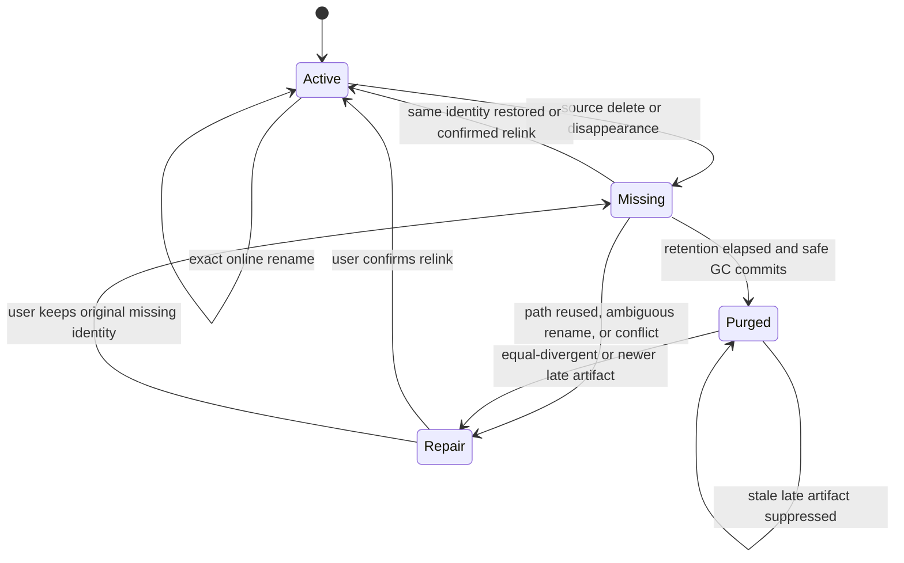
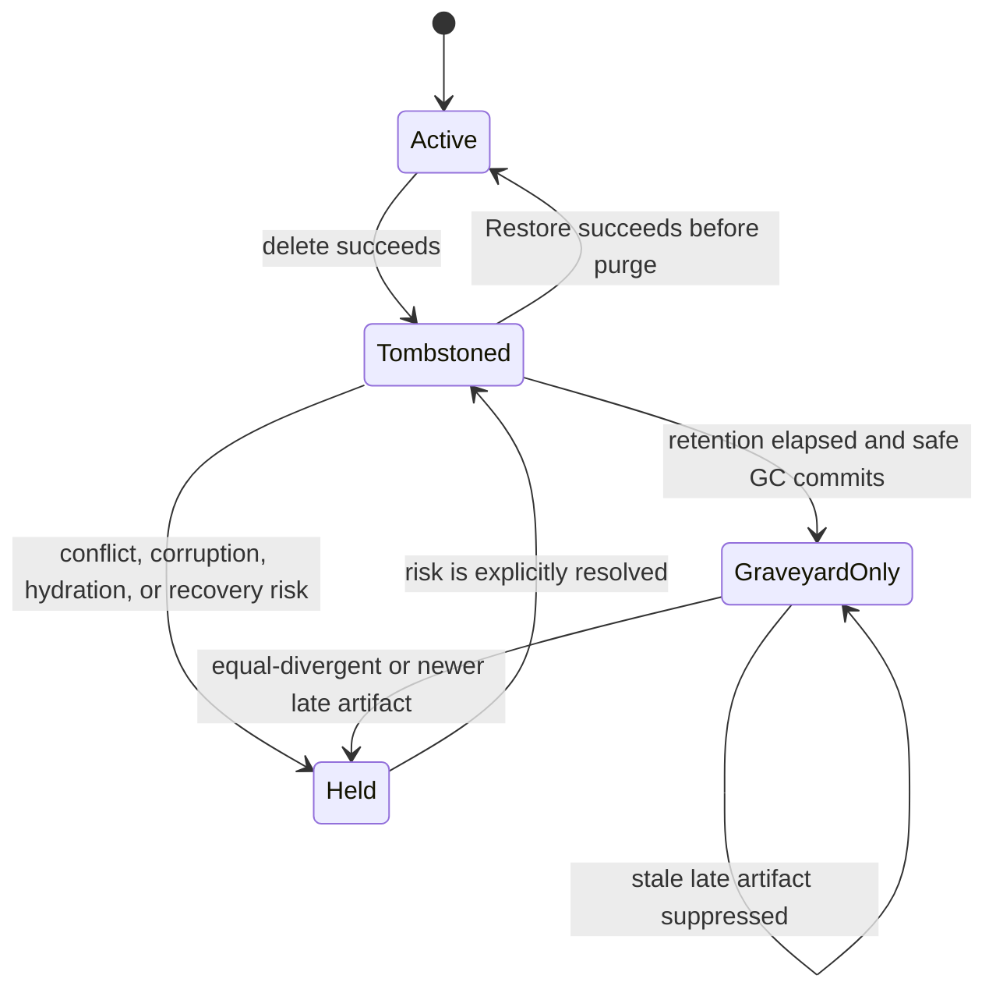

# Sidecar Lifecycle, Trash, and Garbage Collection

## Status

- Created: 2026-07-16
- Status: implementation in progress; L1 lifecycle correctness is implemented and verified, while
  L2–L4 Trash, graveyard, and automatic GC remain pending
- Scope: Markdown rename/delete reconciliation, source-missing visibility, annotation and Ink
  retention, recoverable Trash, compact deletion evidence, physical sidecar garbage collection, and
  the corresponding Entire Vault/storage-management UX.

This focused specification replaces only the current “automatic GC disabled / retain tombstones
indefinitely” policy and refines Markdown rename/delete handling. It preserves the existing
canonical sidecar model, per-record conflict isolation, five-second quick Restore affordance,
fail-closed conflict behavior, and the rule that local persistence does not prove iCloud sync.

Automatic physical cleanup remains release-gated until its real two-device iCloud acceptance tests
pass. The active-index and exact-rename corrections do not depend on that gate and should ship
first.

## Problem Statement

The current implementation is intentionally conservative but conflates four different concepts:

1. a live Markdown note;
2. a temporarily missing source note whose annotations are still recoverable;
3. a deleted text annotation or Ink surface represented by a tombstone;
4. a compact deletion fact needed only to reject delayed cloud artifacts.

Today, deleting a Markdown file writes `sourceMissingAt` but the Entire Vault builder still indexes
the note as if it were live. Tombstoned canonical files are retained indefinitely. Online rename
ignores Obsidian's exact `oldPath` argument and attempts content-fingerprint reconciliation instead.
Consequences include:

- deleted notes appearing beside live notes without a missing/deleted label;
- old and new names coexisting after an unsuccessful rename reconciliation;
- unrelated files recreated at a reused path being at risk of inheriting old sidecars;
- unbounded growth in tombstoned text files, Ink files, empty note directories, and iCloud file
  operations;
- no product surface for inspecting, restoring, or deliberately removing retained data.

This is not solved safely by deleting every old JSON file after a timeout. Delayed iCloud artifacts
still need a compact, canonical deletion record or stale annotations can reappear.

## Goals

- A successful Obsidian rename replaces the old path immediately and never waits for GC.
- A deleted source note disappears immediately from the normal Entire Vault scope.
- Recoverable data has a visible, understandable Trash lifecycle.
- Large payloads and empty directories are eventually removed under a bounded retention policy.
- Delayed lower-revision cloud artifacts cannot silently resurrect purged data.
- Conflicts, corrupt artifacts, incomplete hydration, and unsaved Ink always fail closed.
- Background work is bounded, resumable, cancellable, and absent from the synchronous startup path.
- File count, storage usage, held items, and cleanup results are inspectable without exposing note
  contents in diagnostics.

## Non-Goals

- Proving that iCloud has uploaded or deleted a file on every device.
- Enumerating inaccessible `NSFileVersion` history.
- Automatically merging ambiguous offline renames or same-revision divergent records.
- Recreating the deleted Markdown source from annotation sidecars; the plugin does not store a full
  source-note backup.
- Replacing Obsidian's own file Trash or deletion confirmation.
- Moving all active annotations into a monolithic database or all-Vault JSON.
- Automatically erasing corrupt, unknown, or conflict artifacts merely to reduce file count.

## Terminology

| Term                | Meaning                                                                                                                |
| ------------------- | ---------------------------------------------------------------------------------------------------------------------- |
| Active note         | The Markdown source exists and its sidecar identity is reconciled.                                                     |
| Missing-source note | The source was deleted or disappeared, while recoverable sidecars remain.                                              |
| Trash               | A derived UI projection of missing-source notes and recoverable tombstoned records. It is not a second canonical copy. |
| Tombstone           | A full canonical text/Ink record carrying `deletedAt` and a deletion revision.                                         |
| Graveyard entry     | A compact canonical fact written before a full payload is physically removed.                                          |
| Purged payload      | Full annotation/Ink content removed after a graveyard entry was durably verified.                                      |
| Held item           | Data ineligible for automatic GC because it is conflicting, corrupt, unhydrated, ambiguous, or locally unsaved.        |
| Derived cache       | `index.json`, summaries, Trash indexes, and candidate-scan state that can be rebuilt.                                  |

Trash visibility, payload retention, and resurrection protection are deliberately separate. Hiding
an item never implies that its canonical bytes have already been deleted.

## Product and Architecture Decisions

| ID     | Decision                                                                                                                                                                                                                              |
| ------ | ------------------------------------------------------------------------------------------------------------------------------------------------------------------------------------------------------------------------------------- |
| LGC-01 | Online rename uses Obsidian's exact `oldPath -> newPath` event. Source fingerprint is not the primary key for an observed online rename.                                                                                              |
| LGC-02 | Offline rename may use a unique exact fingerprint match. Zero or multiple matches fail closed into a repair task.                                                                                                                     |
| LGC-03 | Source deletion immediately marks the note missing and atomically removes its rows from the normal Entire Vault projection.                                                                                                           |
| LGC-04 | Missing-source notes and recoverable tombstones appear only in Trash, not as apparently live file groups.                                                                                                                             |
| LGC-05 | The default retention for new data is 30 days. Supported policies are 30 days, 90 days, and Never; manual Empty Trash remains available.                                                                                              |
| LGC-06 | Existing Vaults do not automatically purge legacy retained data on first upgrade. Legacy cleanup requires one explicit policy acknowledgement.                                                                                        |
| LGC-07 | A matching source restored before purge automatically leaves Trash. A different file recreated at the same path never inherits old annotations automatically.                                                                         |
| LGC-08 | GC writes and verifies compact graveyard entries before deleting any full canonical payload.                                                                                                                                          |
| LGC-09 | Graveyard entries are canonical and retained indefinitely by default; they are batched into bounded device-owned segments to avoid per-record fragmentation.                                                                          |
| LGC-10 | Lower-revision delayed artifacts are suppressed by graveyard evidence. Equal divergent or higher-revision artifacts become repair tasks and are never silently deleted.                                                               |
| LGC-11 | Unknown conflicts, corrupt files, read timeouts, partial hydration, and reachable local Ink recovery checkpoints are never automatically collected.                                                                                   |
| LGC-12 | Automatic GC runs only after layout readiness and an idle delay, at most once per device per day, with strict item/time limits. It never performs a Vault-wide startup scan.                                                          |
| LGC-13 | Rename, record writes, conflict repair, restore, and GC share the same Vault-scoped write coordinator and use deterministic lock ordering.                                                                                            |
| LGC-14 | Derived indexes and summaries may be removed immediately and rebuilt; their presence never blocks canonical cleanup.                                                                                                                  |
| LGC-15 | Manual permanent cleanup shows exact note/item counts, held counts, and the consequence that annotation payload recovery will no longer be possible.                                                                                  |
| LGC-16 | Every successful delete/restore emits one mutation receipt and invalidates every affected projection. The five-second quick Restore window starts when the completed receipt is presented, not when the first canonical write begins. |

## Lifecycle Model

### Source-note lifecycle



Rules:

- `sourceMissingAt` starts the missing-source retention clock.
- Rename never passes through `Missing` during a normal online event.
- `Purged` is represented by graveyard evidence, not a retained note directory.
- A missing source can be restored only while its payload still exists. After purge, a returning
  Markdown file is treated as a source without recoverable annotation payloads.

### Annotation/Ink lifecycle



The existing five-second Restore control is a quick-undo presentation rule, not the persistence
retention limit. A tombstoned item remains restorable from Trash until its configured deadline.

## Rename Contract

### Online rename

The Vault adapter must pass both values from Obsidian's event:

```ts
vault.on('rename', (file, oldPath) => {
  lifecycleService.reconcileObservedRename({
    oldPath,
    newPath: file.path,
  });
});
```

The application operation must:

1. normalize both paths while preserving case and Unicode;
2. acquire old-path and new-path lifecycle locks in lexical order;
3. locate the source sidecar directly from the old path hash;
4. reject a destination owned by a different `noteId`;
5. rekey the sidecar directory idempotently;
6. update `meta.json` and both text and Ink `filePath` projections;
7. clear `sourceMissingAt` only for the same reconciled note identity;
8. emit one note-level rename event so the derived index replaces every row atomically;
9. verify that the old root is absent or contains only explicitly preserved repair artifacts.

Content may change in the same Obsidian transaction. That must not make an observed rename fail.
Case-only renames on case-insensitive filesystems must use a temporary intermediate path when the
adapter cannot rename directly. Exact path migration must not wait for `cachedRead` or fail solely
because the renamed Markdown is not hydrated yet; fingerprint refresh can follow when source bytes
become readable.

If a process stops partway through a directory move, the next reconciliation may observe two roots
with the same `noteId`. It may resume automatically only when ownership and record bytes are
compatible. Different note IDs, same-revision divergence, or unknown files become a visible repair
task. Successful repair removes the stale path; GC is not responsible for normal rename cleanup.

### Offline/external rename

When no `oldPath` event exists:

1. exact current-path ownership wins;
2. otherwise, one unique `sourceFingerprint` candidate may be rekeyed;
3. multiple exact fingerprint matches are ambiguous and fail closed;
4. no exact match may be shown as `Possible renamed note` with candidate evidence, but is never
   auto-attached based on fuzzy similarity;
5. repair preview must show old/new paths, note ID, annotation counts, and whether the current
   source fingerprint differs before the user commits.

## Source Delete, Restore, and Path Reuse

### Delete handling

After a Markdown delete event succeeds:

- immediately mark the note `source-missing-pending` in the derived model so it cannot continue to
  look like a live result;
- persist `sourceMissingAt` before claiming that the group is recoverable in Trash;
- emit a note-level lifecycle event only after that write succeeds;
- remove all rows for the note ID from the active index in one update;
- expose the group in Trash with the last path, deletion time, payload counts, and retention
  deadline;
- never attempt to open the nonexistent path from the normal result list.

If writing `sourceMissingAt` fails, the plugin reports a retryable Problem and must not claim that
the group was safely moved to Trash. The pending group remains absent from live results and appears
under Problems until retry succeeds or the source reappears.

An explicit Obsidian delete event may start the missing-source clock. Mere absence during a scan may
not: a provider placeholder, read timeout, incomplete Vault enumeration, or unavailable adapter is
`source-unavailable` and held. An external deletion missed while the plugin was inactive becomes
confirmed missing only after a complete Vault inventory observes the absence twice at least 24 hours
apart and offline-rename reconciliation has found no unique destination.

### Automatic source restoration

A source reappearing at the same path automatically restores its sidecar only when at least one of
these identity checks succeeds:

- its fingerprint equals the missing note's stored fingerprint; or
- a still-live observed rename transaction identifies the same `noteId`.

A different fingerprint at a reused path is `path-reused`, not restoration. Old annotations remain
in Trash and the new note starts without them unless the user explicitly relinks after preview.
Relinking updates anchors through the existing recovery flow; it must not silently bind ambiguous
targets.

### Missing-source purge

When a missing-source group becomes eligible, GC creates one note graveyard entry and one entry for
every full text/Ink payload it will remove. Active records inside a deleted source note use reason
`source-note-purged`; they do not need to be rewritten into individual full tombstones first.

The note directory may be removed only after:

- every removable payload has a verified graveyard entry;
- no conflict, corrupt, unknown, or unhydrated child remains;
- the directory is re-listed after payload deletion;
- the final note marker records the source path, fingerprint, `noteId`, and purge time.

If anything is held, the directory remains and Trash shows the held reason.

## Record Delete and Restore

- Text annotation and whole-Ink deletion continue to write full tombstones with monotonically
  increasing revisions.
- Single, Current-file bulk, and Entire-Vault bulk deletion use the same canonical mutation command.
  The command returns successful tombstone handles, failed snapshots, and affected file paths;
  callers must not reconstruct this result from a disposable index.
- A completed deletion batch creates one scope-independent receipt. `Current file` and
  `Entire Vault` both show `N annotations deleted · Restore` for at least five seconds after the
  receipt is first presented. Slow iCloud/file-provider writes may not consume that presentation
  window. A later completed batch merges with an unexpired receipt instead of replacing its Restore
  handles.
- A fully successful batch exits selection mode so row actions are not hidden behind checkboxes.
  Partial failure keeps only failed rows selected and reports the count.
- Current file may additionally show row-level Restore while a recent tombstone is visible. Normal
  Entire Vault continues to exclude tombstones; its quick Restore is carried by the transient
  receipt, not by reinserting deleted rows into the active index.
- Restore performs a tombstone-revision compare-and-swap for both text and Ink. Partial restore
  keeps the failed handles retryable and never overwrites a newer candidate.
- Single-row and bulk Text/Ink deletion perform the same selected-revision compare-and-swap at the
  canonical write boundary. A preflight read alone is not sufficient.
- After each successful delete or restore, affected file paths are deduplicated and fan out to
  Reading View, Live Preview, the Current-file cache, the Vault active index, and Ink presence. One
  projection failure is reported but does not prevent the other projections or the Restore receipt
  from updating.
- Reading View uses a per-section render generation so an older asynchronous resolve cannot repaint
  a marker after a newer delete refresh has completed, including a section whose initial mount is
  still pending. Current-file sidebar reads use the same newest-generation-wins rule.
- External canonical text/Ink sidecar changes resolve their owning Markdown path from validated note
  metadata and enter the same projection-invalidation path. Derived caches remain rebuildable and
  are never treated as the mutation source of truth.
- Local watcher echoes are suppressed only while the canonical bytes still match the completed local
  write. A different iCloud payload at the same path is processed even inside the five-second echo
  window; failed local writes leave no suppression token. External `ink-summaries.json` arrivals are
  rebuilt from canonical surfaces.
- Tombstone revision `N` removes any older active Vault projection through revision `N - 1`, while
  preserving same/newer active projections. A Vault rebuild commits only if no canonical index
  mutation superseded its snapshot; it retries once and otherwise retains the live incremental index
  as not-fresh.
- Canonical writes and deletion receipts cannot be reclassified as failures by exceptions from
  disposable projection subscribers or diagnostics.
- A Markdown source deletion removes its active Vault projection immediately. Rebuild also checks
  actual source availability, so failure to persist `sourceMissingAt` cannot resurrect a live row.
- After five seconds, the deleted row leaves Current file and normal Entire Vault but remains in
  Trash until the retention deadline.
- Restoring from Trash performs the same stale-revision preflight as current Restore. A newer
  visible candidate prevents restoration and opens repair.
- Zero-stroke Ink and empty abandoned drafts are internal artifacts. Once a successful persistence
  boundary proves they contain no user payload, they use a 24-hour safety hold and then compact to
  graveyard evidence. Failed or locally recoverable sessions are excluded.
- Changing retention from Never/90 days to 30 days requires a confirmation if existing items become
  immediately eligible.

## Canonical Graveyard

### Physical layout

```text
.obsidian-annotations/
└── v1/
    ├── notes/
    │   └── <normalized-path-hash>/
    │       ├── meta.json
    │       ├── annotations/
    │       ├── surfaces/
    │       └── summary.json          # derived
    ├── graveyard/
    │   └── <owner-device-id>/
    │       ├── 2026-07-001.json
    │       └── 2026-07-002.json
    ├── graveyard-index.json          # derived
    └── index.json                    # derived
```

One device owns and appends to its own current segment through the existing verified journaled write
path. A segment rolls over at 1 MiB or a calendar-month boundary. No device rewrites another
device's segment. This reduces permanent deletion evidence from one file per deleted record to at
most a small number of bounded segments per device and month.

Graveyard segments are canonical. `graveyard-index.json` is a disposable lookup acceleration file
and may never be used to recreate missing canonical entries.

### Segment schema

```ts
interface GraveyardSegmentV1 {
  schemaVersion: 1;
  segmentId: string;
  ownerDeviceId: string;
  createdAt: string;
  updatedAt: string;
  entries: GraveyardEntryV1[];
}

type GraveyardEntryV1 =
  | {
      kind: 'text' | 'ink';
      noteId: string;
      recordId: string;
      sourcePathAtDeletion: string;
      deletionRevision: number;
      deletedAt: string;
      compactedAt: string;
      reason: 'record-deleted' | 'source-note-purged' | 'empty-internal-artifact';
      payloadSha256: string;
    }
  | {
      kind: 'note';
      noteId: string;
      sourcePathAtDeletion: string;
      sourceFingerprint: string;
      sourceMissingAt: string;
      purgedAt: string;
    };
```

Entries are immutable facts. A later segment may add a superseding fact, but existing entries are
not edited in place across device ownership. Segment codecs must reject malformed or unsupported
versions without making their referenced payloads eligible for deletion.

### Delayed artifact resolution

For a visible artifact matching a graveyard record ID:

| Artifact condition                      | Result                                                                                            |
| --------------------------------------- | ------------------------------------------------------------------------------------------------- |
| Revision lower than `deletionRevision`  | Suppress from active UI; eligible for safe redundant-artifact cleanup.                            |
| Same revision and same payload digest   | Treat as a duplicate of the purged payload; suppress and clean safely.                            |
| Same revision but different bytes/state | Create a same-revision divergence Problem; preserve both.                                         |
| Higher revision                         | Create a post-deletion edit conflict; preserve it until the user chooses restore or keep-deleted. |
| Marker unreadable or conflicting        | Hold everything; do not delete or suppress based on the marker.                                   |

Choosing `Keep deleted` writes a new deletion revision above every visible candidate before the
candidate can later become GC-eligible. Choosing `Restore newer edit` creates a new active canonical
revision and records the repair decision; it does not erase historical graveyard facts.

## Garbage-Collection Eligibility

A payload is automatically eligible only when all conditions are true:

1. the configured retention is not Never;
2. `deletedAt` or `sourceMissingAt` plus retention is earlier than current time;
3. the candidate was observed eligible in two completed scans at least 24 hours apart;
4. the canonical directory and candidate file were read successfully in the current scan;
5. the candidate revision and digest still equal the first observation;
6. no duplicate artifact, same-revision divergence, corrupt record, unknown file, or repository
   issue exists in its ownership scope;
7. no reachable local Ink recovery checkpoint references the record/surface;
8. no rename, restore, edit, or repair operation owns the note lock;
9. the graveyard destination is readable and writable;
10. the user has acknowledged legacy policy when the candidate predates this feature.

The two-observation rule protects against clock jumps, incomplete hydration, and a note that only
briefly appears missing. Its observation cache is derived and device-local. Losing that cache merely
delays cleanup; it never makes cleanup earlier.

Manual Empty Trash may bypass the 24-hour second-observation delay after explicit confirmation. It
may not bypass conflict, corruption, hydration, local-recovery, stale-revision, or graveyard-write
guards.

## Crash-Safe GC Transaction

Each bounded batch follows this order:

1. discover and snapshot candidate paths, revisions, digests, and ownership;
2. acquire note/record locks using deterministic ordering;
3. re-read every candidate and all visible siblings;
4. calculate graveyard entries without mutating payloads;
5. journal-write the owner segment and read it back;
6. verify every planned entry exactly;
7. remove only payloads covered by verified entries;
8. re-list affected directories and remove only proven-empty derived files/directories;
9. publish lifecycle/index events and record a non-content diagnostic summary;
10. release locks and persist resumable progress.

Crash outcomes are intentionally one-sided:

- crash before verified graveyard write: all payloads remain;
- crash after marker write but before removal: marker and payload coexist; retry is idempotent;
- crash during payload removal: some covered payloads remain; retry removes only verified matches;
- marker write/read failure: no payload in that batch is removed;
- index update failure: canonical cleanup remains valid and the disposable index rebuilds later.

GC must never use a recursive directory delete based only on age. Every removed canonical file must
have an exact verified plan entry.

## Scheduling and Resource Budgets

### Automatic run

- Do no synchronous GC work during plugin startup.
- After `onLayoutReady`, wait for at least 30 seconds of application idle time.
- Run at most once per device per 24 hours.
- Default batch: at most 50 payload files, 10 MiB of known payload size, or two seconds of active
  work, whichever comes first.
- Canonical read concurrency: two on mobile, four on desktop.
- Yield between batches and stop on app background, Vault close, user cancellation, memory pressure,
  or a foreground Ink persistence failure.
- Resume from canonical state; progress files are hints, never truth.

### Manual run

`Run cleanup now` performs a cancellable dry run first and reports:

- recoverable item count;
- eligible payload count and known bytes;
- note directories expected to become empty;
- held count grouped by reason;
- unknown-size count when the adapter cannot provide metadata without hydration.

The manual operation may continue beyond the automatic batch limit but remains chunked and
cancellable. Cancellation finishes the current atomic batch and leaves the rest untouched.

## User Experience

### Entire Vault

- Normal Entire Vault contains active-source records only.
- A note-level lifecycle update removes or renames all rows atomically by `noteId`; users never see
  a partially migrated old/new group.
- A stale cache version that cannot represent source lifecycle is rejected before rendering; it must
  not briefly flash deleted paths.
- Rename ambiguity, path reuse, held cleanup, and late-artifact conflicts appear under Problems, not
  as ordinary annotation groups.

### Trash and storage

The sidebar overflow menu adds `Trash and storage…`. The view has three groups:

1. **Recoverable** — missing-source groups and tombstoned records before their deadline;
2. **Ready to clean** — items that satisfy time policy, including first/second observation state;
3. **Needs attention** — conflicts, corrupt files, unhydrated data, path reuse, and local recovery
   holds.

Required actions:

- `Restore annotation` for text/Ink tombstones whose source still exists;
- `Relink source…` for missing notes after the user restores or replaces a Markdown file;
- `Keep deleted` / `Restore newer edit` for late-artifact conflicts;
- `Run cleanup now` after dry-run preview;
- `Empty Trash…` with note, text, Ink, file, and held counts;
- `Retry scan` for transient read/hydration failures.

The plugin must not label a missing-source group `Restore note`, because it cannot recreate deleted
Markdown content. Copy should instead say that the source must be restored through Obsidian or the
file provider, then relinked if necessary.

After physical cleanup, the item leaves recoverable Trash. Storage details may report aggregate
graveyard marker counts, but must not present a marker-only item as restorable.

### Settings

Add one `Annotation Trash retention` setting:

- `30 days` — default for new installs and new data after policy acknowledgement;
- `90 days`;
- `Never clean automatically`.

The setting explains that full payloads are removed after the period while small deletion markers
remain to prevent delayed-sync resurrection. It must not imply iCloud completion.

## Upgrade and Rollback

### Existing Vault migration

- Detect sidecars created before `lifecyclePolicyVersion: 1` lazily, not during synchronous startup.
- Set legacy state to `review-required`; do not auto-clean legacy tombstones or missing notes.
- Present counts and retention choices when the user first opens Trash/storage.
- Once acknowledged, persist `policyAcceptedAt` and whether retention applies to legacy data.
- New deletions after `policyAcceptedAt` follow the selected policy even if legacy data remains
  held.
- Existing `sourceMissingAt` and `deletedAt` timestamps remain the original lifecycle timestamps;
  the migration must not reset them merely to make cleanup easier.

### Compatibility boundary

Older plugin versions do not understand graveyard segments. Therefore:

- automatic physical GC must not be enabled in a release until the graveyard reader/suppression path
  and real two-device delayed-artifact HAT have passed;
- rollback documentation must warn that an older build can display delayed artifacts that a newer
  build suppresses;
- unsupported graveyard schema versions fail closed and disable physical GC;
- export before cleanup remains available for users who need a portable backup.

## Architecture Placement

The implementation must preserve project boundaries:

- `src/domain/sidecar-lifecycle.ts`: pure states, retention eligibility, late-artifact comparison,
  and invariant checks;
- `src/application/sidecar-lifecycle-service.ts`: rename/delete/restore/relink use cases and
  note-level lifecycle events;
- `src/application/sidecar-garbage-collector.ts`: dry-run plans, bounded batches, cancellation, and
  transaction coordination through ports;
- `src/storage/graveyard-repository.ts`: segment codec, owner-sharded writes, verification, and
  disposable lookup-index rebuilding;
- `src/storage/sidecar-repository.ts` and `ink-surface-repository.ts`: exact preflight/read/remove
  primitives behind application ports;
- `src/adapters/obsidian/`: pass `oldPath`, observe Vault lifecycle events, provide idle/background
  signals, and expose mobile-safe DataAdapter operations;
- `src/ui/`: render Trash/storage and confirmation states; never write sidecars directly;
- `src/runtime/`: diagnostics and scheduling signals only, with no lifecycle policy.

The note-level event contract needs at least:

```ts
type NoteLifecycleEvent =
  | { kind: 'renamed'; noteId: string; oldPath: string; newPath: string }
  | { kind: 'source-missing'; noteId: string; filePath: string; sourceMissingAt: string }
  | { kind: 'source-restored'; noteId: string; filePath: string }
  | { kind: 'payload-purged'; noteId: string; removedRecordIds: readonly string[] };
```

The derived index applies each event atomically. `source-missing` removes every row with that note
ID; `renamed` changes every matching row's path without depending on record-by-record arrival order.

## Diagnostics and Failure Policy

Allowed diagnostics:

- scan duration and candidate count;
- removed file/directory count and known bytes;
- held counts by reason;
- marker segment ID and operation ID;
- retry/error class without annotation body, quote, stroke points, or full source path unless the
  user explicitly opens a repair detail.

Failure behavior:

- rename failure keeps both roots and opens a repair task;
- source-missing write failure keeps the active projection and reports Retry;
- GC failure keeps payloads whenever marker durability is uncertain;
- index/cache failure never rolls back canonical lifecycle state;
- storage-full during marker write removes nothing;
- permission or hydration errors delay cleanup without advancing eligibility observations.

## Test Strategy

Development follows vertical TDD cycles. Mock only Vault, clock, idle/background, and file-store
boundaries.

### Domain tests

- retention boundaries for 30/90/Never and the 24-hour second observation;
- clock rollback/forward-jump behavior;
- late artifact lower/equal-divergent/higher revision matrix;
- source path reuse versus valid restore;
- held-reason precedence and manual-cleanup non-bypassable guards;
- deterministic lock and batch ordering.

### Repository/application tests

- online rename uses `oldPath` and succeeds even when source content changes simultaneously;
- rename rewrites/reprojects both text and Ink, preserving `noteId` and eliminating the old root;
- Unicode, folder move, case-only rename, retry, and destination collision;
- offline unique fingerprint succeeds; multiple matches create repair without mutation;
- source delete persists missing state before atomically removing index rows;
- same-fingerprint restore succeeds; different content at the same path does not inherit sidecars;
- source-missing notes are absent from active rebuild and present in Trash rebuild;
- old derived cache versions cannot flash stale groups;
- marker-write, verify, remove, and re-list failures at every transaction phase;
- restart after marker-only and partially removed batches is idempotent;
- conflicts, corruption, unknown children, hydration timeout, and local Ink recovery prevent GC;
- empty note directory removal occurs only after exact child verification;
- segment rollover, multi-device ownership, and unsupported segment versions fail closed.

### UI tests

- normal Entire Vault never renders missing-source groups;
- Trash distinguishes recoverable, ready, and held states;
- missing-source copy never promises Markdown restoration;
- retention-change and Empty Trash confirmations contain accurate counts;
- cancellation and partial cleanup keep remaining selections/results;
- narrow iPad drawer has reachable actions without horizontal overflow;
- keyboard/focus return and screen-reader labels identify destructive scope.

### Scale and performance tests

- 20,000 active records plus 20,000 retained tombstones build the active index without loading Trash
  payloads;
- 10,000 eligible payloads produce bounded GC batches and bounded DOM;
- monthly graveyard segments remain below the 1 MiB rollover limit and rebuild a lookup index with
  bounded concurrency;
- no synchronous startup scan and no Ink vector parsing merely to render storage counts;
- file-count and cold-hydration comparison before/after compacting a realistic deletion-heavy
  fixture.

### Physical HAT gates

- macOS and iPad online rename while editing, including folder and Unicode path changes;
- delete on one device, keep another offline beyond retention, reconnect, and verify stale artifact
  suppression;
- create a higher-revision offline edit after deletion and verify a repair task rather than loss;
- interrupt the app after graveyard commit and during payload removal, then verify idempotent
  resume;
- iCloud hydration timeout/placeholder behavior never makes data eligible;
- storage-full and permission failure remove no unmarked payload;
- old-version rollback limitation is documented and observed;
- 30-day timing may be tested with an injected clock, but at least one real delayed-sync sequence is
  required before automatic GC is enabled by default.

## Delivery Plan

### L1 — Lifecycle correctness and active-index hygiene

- pass `oldPath` through the Obsidian adapter;
- add exact/idempotent rename use case for text and Ink;
- make same-path different-fingerprint restoration fail closed;
- introduce note-level lifecycle events and atomic index rename/remove;
- exclude `sourceMissingAt` notes from active full rebuild;
- invalidate incompatible derived caches;
- surface rename/path-reuse failures under Problems.

Exit: online rename leaves no old group; deleted sources immediately leave normal Entire Vault; no
physical payload is deleted.

Implementation status on 2026-07-16: complete. The implementation uses Obsidian `oldPath`, rewrites
text and Ink paths, batches derived-index publication, excludes missing sources, rejects unrelated
same-path restoration, invalidates lifecycle-unaware/stale caches, and preserves the original
missing timestamp across repeated events. Full `npm run check` and development installation passed.

### L2 — Trash and retention policy

- add the Trash/storage derived model and UI;
- expose recoverable tombstones and missing-source notes;
- add restore/relink flows and retention setting;
- add legacy review/acknowledgement without automatic cleanup;
- add count-only dry run and held reasons.

Exit: users can understand every retained group and recover or review it; infinite retention is no
longer invisible.

### L3 — Graveyard and manual physical cleanup

- implement canonical segment codecs and derived graveyard lookup;
- implement crash-safe GC planning/commit/removal batches;
- add manual Run cleanup/Empty Trash with confirmation and cancellation;
- remove exact covered payloads and proven-empty directories;
- suppress delayed lower-revision artifacts and expose divergent/newer ones.

Exit: manual cleanup passes fault injection and local scale tests; automatic scheduling remains off.

### L4 — Automatic bounded GC and release evidence

- add idle/daily scheduling and device-local observation cache;
- enforce mobile/desktop budgets and background cancellation;
- complete migration behavior and export-before-cleanup affordance;
- run physical macOS/iPad iCloud HAT and rollback documentation;
- enable the 30-day default only after the release gate passes.

Exit: automatic GC is safe to enable for new data, with legacy data still requiring explicit
acknowledgement.

## Acceptance Criteria

- A normal online rename immediately replaces the old path, including all text and Ink rows.
- A deleted Markdown source never appears as a live Entire Vault group.
- Reusing a deleted path for unrelated content cannot inherit old annotations silently.
- Trash shows recoverable deadlines, held reasons, and accurate destructive-action counts.
- Default new-data retention is 30 days; 90 days and Never are supported.
- No legacy payload is automatically removed before policy acknowledgement.
- No full canonical payload is removed before its graveyard entry is durably written and verified.
- Delayed lower-revision artifacts do not resurrect; divergent/newer artifacts are preserved for
  repair.
- Conflicting, corrupt, unhydrated, unknown, and locally recoverable data is never auto-collected.
- Automatic GC performs no synchronous startup scan and respects batch/time/concurrency limits.
- Removing derived caches before or after cleanup produces the same active and Trash projections.
- Targeted tests, full `npm run check`, realistic file-count profiling, and physical two-device HAT
  pass before the feature is called complete.

## Residual Risks

- An offline device running an older plugin build can temporarily display artifacts that only the
  new graveyard reader knows to suppress.
- Obsidian plugins cannot prove that every iCloud version has been observed or removed.
- Device-owned segment safety assumes stable distinct device IDs; duplicate IDs must be detected as
  a conflict and stop segment mutation.
- Exact byte-size reporting may be unavailable for unhydrated provider files; unknown size must not
  be presented as zero.
- Never-retention remains intentionally available and can still accumulate payload files; the UI
  must show that consequence.
- Real iCloud delayed-delete and conflict behavior remains a physical-device release gate, not a
  unit-test claim.

## Source Manifest

### Sources

- User instruction in the current 2026-07-16 Codex task: define when renamed/deleted note entries
  are reclaimed and produce a detailed specification that prevents long-term sidecar fragmentation.
- User screenshots in the same task showing renamed/deleted paths such as `未命名.md`,
  `未命名qqw.md`, and `Test.md` still presented as live Entire Vault groups. The original attachment
  path is temporary; the durable observation is recorded in `Problem Statement` above.
- User instruction and screenshots in the 2026-07-17 follow-up task showing that Current-file and
  Entire-Vault bulk deletion hid Restore and left deleted highlights rendered in Markdown Reading
  View; the durable requirement is the unified receipt and projection-invalidation contract in
  `Record Delete and Restore`.
- `docs/specs/2026-07-14-obsidian-annotation-plugin-design.md`, especially Canonical Storage Model,
  iCloud Synchronization and Conflict Policy, Entire Vault, Performance, Reliability, and Deletion
  and Undo.
- `docs/specs/2026-07-14-obsidian-annotation-plugin-execution-plan.md`, S06 and S07.
- `docs/delivery/slices/S06-icloud-safety/README.md`, `risk-register.md`, and `source-manifest.md`.
- `docs/delivery/slices/S07-vault-index/README.md` and `source-manifest.md`.
- `docs/delivery/slices/S14-release-candidate/risk-register.md`.
- Current implementation in `src/main.ts`, `src/storage/sidecar-repository.ts`,
  `src/storage/ink-surface-repository.ts`, `src/application/vault-index-builder.ts`,
  `src/application/vault-index-events.ts`, `src/domain/vault-annotation-index.ts`, and
  `src/adapters/obsidian/vault-text-file-store.ts`.
- Obsidian type declaration confirming rename callback `(file, oldPath)` in
  `node_modules/obsidian/obsidian.d.ts`.
- `/Users/ivan/.agents/docs/agents/workflows.md` and
  `/Users/ivan/.agents/docs/agents/handoff-policy.md`.

### Produced artifacts

- `docs/specs/2026-07-16-sidecar-lifecycle-trash-and-garbage-collection.md`.
- One index entry in `docs/specs/README.md`.
- L1 implementation in `src/application/sidecar-lifecycle-service.ts`,
  `src/storage/sidecar-repository.ts`, `src/storage/ink-surface-repository.ts`,
  `src/domain/vault-annotation-index.ts`, `src/application/vault-index-builder.ts`,
  `src/storage/vault-index-cache.ts`, and `src/main.ts`, with colocated tests.
- Bulk-delete consistency implementation in `src/application/annotation-projection-coordinator.ts`,
  `src/adapters/obsidian/annotation-sidebar-commands.ts`,
  `src/adapters/obsidian/annotation-sidebar-view.ts`,
  `src/adapters/obsidian/reading-view-integration.ts`, `src/ui/stores/annotation-sidebar-store.ts`,
  and the Current/Entire Vault sidebar UI.
- Concurrency and iCloud hardening in `src/application/vault-index-builder.ts`,
  `src/application/vault-index-events.ts`, `src/domain/vault-annotation-index.ts`,
  `src/adapters/obsidian/vault-text-file-store.ts`, `src/storage/sidecar-repository.ts`, and
  `src/storage/ink-surface-repository.ts`.

### Key decisions

- Separate immediate UI removal, recoverable Trash retention, heavy-payload GC, and permanent
  resurrection protection.
- Use exact `oldPath` for online rename and reserve fingerprints for offline recovery.
- Default new data to 30-day retention while requiring explicit acknowledgement before legacy
  cleanup.
- Batch permanent deletion facts into canonical device-owned graveyard segments before removing full
  payloads.
- Gate automatic GC on real two-device iCloud evidence; ship lifecycle/index correctness first.
- Treat quick Restore as an explicit completed-operation receipt and keep the normal Entire Vault
  active index free of tombstones.
- Treat canonical mutation revisions and bytes—not UI timing, cache state, or file path alone—as the
  authority for delete, Restore, watcher deduplication, and projection replacement.

### Verification evidence

- Document-only change; no runtime behavior or schema was modified.
- Relevant current code paths and S06/S07/S14 evidence were inspected before drafting.
- `npx prettier --check docs/specs/2026-07-16-sidecar-lifecycle-trash-and-garbage-collection.md docs/specs/README.md`
  passed.
- `git diff --check -- docs/specs/README.md` passed; the new untracked specification was separately
  formatted and inspected because ordinary `git diff` does not include untracked files.
- After L1 implementation, `npm run check` passed with 99 test files / 651 tests, coverage,
  performance tests, typecheck, production build, and mobile bundle verification.
- `npm run install:dev` installed the verified build into the development Vault.
- After the 2026-07-17 delete/Restore consistency follow-up, `npm run check` passed with 102 test
  files / 756 functional tests, 10 performance tests, formatting, ESLint, typecheck, production
  build, and mobile bundle verification. The follow-up includes explicit concurrency tests for stale
  Vault rebuilds, Current/Reading async refresh races, revision-bounded deletion, consecutive
  Restore receipts, iCloud content-aware watcher deduplication, and projection-event isolation.
- `npm run install:dev` installed that verified follow-up build into
  `test-fixtures/vault/.obsidian/plugins/inkstone-annotations`.

### Open questions / risks

- Automatic GC cannot be enabled by default until the physical iCloud gates above pass.
- The exact storage-size metadata available for unhydrated iCloud files must be confirmed during L2
  implementation; unknown sizes must remain explicit.
- Compatibility with older builds remains bounded by documented rollback behavior rather than a
  claim that old code understands new graveyard segments.
