# Ink 原生体感性能底座与双画笔执行计划

- **状态：** S27R1–S27R4 与 S28–S33 自动化候选实现已落地；2026-07-19 S27R5 Session
  1 失败证据包含 quota/performance、subpixel-redraw/stringing、post-subpixel coalesced-input/
  stringing 与 delayed-first-frame stringing；S26/S26R1 Recovery Journal 已停止，S26R2 Live-first
  Persistence 已落地。最新一轮连续画笔主观丝滑，但性能 Gate 仍 FAIL，且起笔短暂不显示后仍可出现 A→B
  chord。先前 S27R6 PASS 已因本轮零样本/输入因果协议与实现变化而过期；新 S27R6
  PASS 前禁止再生成 iPad marker，真机、校准与人工验收仍为 `INCOMPLETE`，2026-07-19
- **规范：** `docs/specs/2026-07-17-ink-native-feel-performance-and-brush-fidelity.md`
- **范围：** 先完成性能 Foundation，再实现现有 Pen 与 Highlighter 的物理笔刷

## 交付结论

本计划原始 S22–S34 的产品目标保持不变。首个有效 S27 真机 artifact 已按固定预算判定
`FAIL`，因此在 S27 与 S28 之间插入 S27R1–S27R5 remediation。2026-07-18 的 S27R5 Run
1 又暴露十来笔后明显卡顿与 iPad 发热，且同一 raw 内发生 `stylus-touch → pointer`
Adapter 切换，因此只作为失败诊断证据，不能参与通过结果。Run 2/3 停止。

新增 S27R6 — Local Obsidian Performance
Gate。它必须先在本地真实安装的 Obsidian、生产 Canvas 与当前 build 上自动通过全部可测 S27 预算，才允许生成任何新的 iPad
marker。Vitest/jsdom、Node microbenchmark 或 standalone
browser 结果不能替代此 Gate。物理验收从 47 次捕获压缩为最多 4 次短会话；重复采样全部移交本地确定性自动回放。

2026-07-19 的压缩 Session 1 相比上一轮已有明显改善，但在 95 笔、约 2.08 MB Recovery
entry 后触发 retained stroke；Obsidian 被后台终止后，重启连续显示
`The quota has been exceeded.`。最新产品决定不再继续建设 S26/S26R1 的同步写前、exact-copy、owner/ack/compaction 状态机，改为 S26R2
“Live-first + Best-effort Draft + Cold Canonical
Save”。旧 Recovery 仅保留冷启动只读迁移；新笔画的 move/pen-up 同步路径禁止一切 storage、encode、hash、surface
fragmentation 和 canonical validation。S26R2 完成并重新跑出当前 build/protocol 的 S27R6
PASS 前，Session 2 不得启动。

随后第一次 post-Live-first Session 1 整体手感继续明显改善，但在 80%
zoom 下偶发“下笔开头卡住，随后从起点连丝到第三/第四段曲线”。raw 证明 input-handler P99 仅 1
ms，而 viewport redraw P95/P99/max 达 40/50/64 ms，14 次 redraw 超过 16.7
ms，单次最多重画 176 笔。根因是 `ResizeObserver` 每次 callback 强制 full-history redraw，加上 Stage
Frame exact-float equality 将 WebKit CSS zoom 的亚像素量化抖动当成真实布局变化。已用 176-stroke
deterministic RED 锁定并修复；该 raw/截图仍按 FAIL 归档，且截图显示
`45 S22 Ink Empty`，不是干净空白 fixture。fresh 本地 Gate PASS 与替换 owned iPad
Vault 前不得重测，更不得进入 Session 2。

post-subpixel 的干净 `S22 Ink Empty` Session
1 再次改善丝滑度，但仍出现多条从一段波形连接到后续段的 chord。raw 中 95 个 Pointer
contact 均完整、无 Adapter switch、无 generation 错配；input-handler P99 1 ms、frame-work P99 2
ms、commit P99 6 ms、viewport P95 4 ms，另有一次 146 ms 首帧等待和 50 个成对出现的大 coalesced
batches。诊断锁定两个可独立造 chord 的合同错误：`pointermove` 同时消费 coalesced raw
list 与 display-aligned parent，且无跨 batch causal watermark；physical
reducer 又让 pressure/orientation
endpoint 在 geometry-error/arc/time 前封口并丢弯点。两项均必须先以 deterministic
RED/Green 修复，再重跑当前协议 S27R6；本轮 raw/截图仅作 FAIL 诊断，Session 2 继续停止。

后续 deterministic 审计进一步收紧该结论：旧 raw 没有 overlap
counter，因此 50 个相邻大 batch 不能证明跨 batch 重放。实现不得用单 endpoint 或 timestamp 猜测 overlap；只允许同一 contact 的 bounded
old-tail/new-prefix 最长 exact overlap。foreign/non-finite
batch 必须 poison 并取消整笔，不能保留为 0-sample contact 后在 pen-up 处补长线。同时，146
ms 首帧等待复现为 canonical submit 后、coalescing drain/Repository
continuation 前开始新 contact 的竞态；Live Document 现在独占 bounded surface timer，writer 在 host
barrier 前后双重检查，并把 contact checkpoint 贯穿 Repository I/O、encode、summary 与 Vault
continuation。rapid lift 的前一笔 promotion 也改为 per-stroke
queue，旧 promotion 完成不得清空新 Active Stroke。这些协议变更再次使旧 S27R6 digest 失效。

最新导出的物理 Session
1 进一步把“性能”和“连丝”拆成两个独立结论。连续 move 热路径主观丝滑，raw 的 input-handler P99 为 1
ms、frame-work P99 为 1 ms、matching input-to-submit P99 为 10 ms；但完整 Gate 仍因 canonical
persistence submit P99 36 ms 与 102 次 >=50 ms host gap 判定 FAIL。raw 还包含 6,674 个 accepted
zero-sample move handler 和 6,537 个 accepted zero-sample submit，证明 cumulative coalesced exact
replay 仍在制造无意义的 geometry/frame
work。另一方面，用户精确描述为：A 点下笔后首帧短暂不可见，移动到 B 点才同时出现正确曲线与 A→B 直线。deterministic
RED 证明，当 WebKit 在同一 coalesced list 中把 exact display parent B 放在一组更老且有序的 raw
curve 前面时，旧 Adapter 会输出 `A, B, raw...` 并必然造 chord。修复必须忽略 fully replayed
zero-sample batch，并仅在 exact parent + 有序 older group 这一可证明条件下零拷贝旋转为
`raw..., B`；不得用距离阈值猜测或丢弃合法回折。

用户在 2026-07-18 进一步明确要求继续后续 Slice、最后统一验收。因此原计划的 S27R5→S28依赖从“禁止候选代码开发”修正为“禁止发布与生产激活”：S28–S34 可以连续实现并完成自动化Red/Green/Refactor，但只能产生
`candidateRevision`、fixture、未发布 registry
profile 和默认关闭的候选消费路径。在 S27R5 与 S34 统一真机/人工 Gate 全部通过前，禁止把物理版本标为 published，禁止让生产输入写入 physical
schema v3 stroke，禁止把 Worker/WASM/GPU 或物理画笔设为默认，也禁止宣称 Foundation 或产品体验通过。

按用户 2026-07-18 的执行顺序，S27R1–S27R4 的自动化实现先连续完成，再统一进行 desktop 与 physical
HAT、main/Worker production-iPad A/B 与 S27R5。这里的“自动化实现已落地”不等于任何 physical
Gate 或完整 Slice 已通过：main Canvas
2D 仍是默认，Worker 未经物理 A/B 不得 promote；当前 S27R4 结论固定为
`not-adopted-js / production-device-evidence-required`。S28 的候选自动化开发不再阻塞；发布与生产启用仍由统一 Gate 阻塞。

当前 S28–S33 只通过专用 `npm run build:physical-hat` 安装候选输入与 active lane；普通
`npm run build` 不构造候选，继续写入/显示 legacy 默认路径。S34 已交付 fail-closed
runner、条件卡、兼容与人工报告骨架，但未执行 physical `prepare`、采集、校准或发布。

| Remediation | 自动化状态                                                                                        | 仍需统一验收的 Gate                                        |
| ----------- | ------------------------------------------------------------------------------------------------- | ---------------------------------------------------------- |
| S27R1       | generation/terminal outcome、frame lanes、persistence isolation、capability/evidence fence 已实现 | diagnostics on/off target-iPad A/B 与新物理 raw            |
| S27R2       | data-oriented capture、constant-time main Canvas、canonical parity 已实现                         | 最终完整仓库 Gate、desktop/physical HAT 与物理 profile     |
| S27R3       | experimental Worker/Offscreen Adapter、failure fallback、provisional prediction 已实现            | main/Worker production-iPad A/B；未通过前不 promote        |
| S27R4       | fail-closed 条件决策 Gate 已实现；当前不采用 WASM/GPU                                             | production profiler 若触发 eligible 分支，才实现并重测候选 |
| S27R5       | 三次 Session 1 已归档为失败诊断；Run 2/3 停止，旧 47 次矩阵废止                                   | 仅在 post-fix S27R6 PASS 后从干净 Session 1 重测           |
| S27R6       | 旧 build/protocol 曾通过 22 条预算；本轮 input/cold-lane/promotion 协议已使其 digest 失效         | 当前 build 必须重新运行并 PASS                             |
| S26/S26R1   | 已交付的 Journal 作为失败诊断和旧数据迁移实现保留；停止新增能力                                   | 不再作为 release architecture                              |
| S26R2       | Live-first 热路径、Add-only 薄 Draft Store、增量冷 canonical save 与本地 Gate 已通过              | 旧 v1–v4 只读迁移兼容、真机稳定性                          |

| Brush Slice | 自动化状态                                                                                                                                                          | 仍需统一验收的 Gate                                         |
| ----------- | ------------------------------------------------------------------------------------------------------------------------------------------------------------------- | ----------------------------------------------------------- |
| S28         | 合同、registry、12 fixtures、golden/raster oracle 已完成                                                                                                            | real Pencil fixture 与 release calibration                  |
| S29         | schema v3、cold plan 与 first-command candidate 已完成；Recovery v4 生产写路径已移除                                                                                | exact released-old-binary、旧 Recovery 只读迁移、iCloud HAT |
| S30         | causal physical trace、bounded tail 与 shared geometry seam 已完成                                                                                                  | 真机性能与 filter/emission calibration                      |
| S31         | Pen filled geometry及 physical-HAT active→commit→reload 闭环已完成                                                                                                  | iPad Pen 卡、最终常数与主观签署                             |
| S32         | Highlighter chisel/mask及 physical-HAT active→commit→reload 闭环已完成                                                                                              | iPad tilt/密度卡、最终常数与主观签署                        |
| S33         | bounds/hit/Canvas/SVG/PNG/HTML/thumbnail 已统一；linked physical 的 document-level rebase 已实现完整集 join→transform→resplit 与原子提交，per-record 仍 fail closed | target-device visual/export parity 与 Foundation rerun      |
| S34         | fail-closed unified runner、六张条件卡与报告/manifest 骨架已完成                                                                                                    | 所有 physical、compatibility、calibration 与 human verdict  |

```mermaid
flowchart LR
  S22["S22 可相信的测量"] --> S23["S23 InkLiveDocument"]
  S23 --> S24["S24 InkCapturePipeline"]
  S23 --> S26["S26/S26R1 失败诊断（retired）"]
  S26 --> R26["S26R2 Live-first Persistence"]
  S24 --> S25["S25 InkRenderRuntime + legacy geometry"]
  S25 --> S27["S27 Foundation 真机 Gate"]
  R26 --> S27
  S27 -->|"首轮 FAIL"| R1["S27R1 可信归因与能力探针"]
  R1 --> R2["S27R2 常数时间 Active Stroke"]
  R2 --> R3["S27R3 Worker/Offscreen bake-off"]
  R3 --> R4["S27R4 WASM/GPU 条件升级"]
  R4 --> R5["S27R5 Run 1 失败诊断"]
  R5 --> R6["S27R6 本地 Obsidian 性能硬 Gate"]
  R26 --> R6
  R4 -->|"候选自动化获准继续"| S28["S28 笔刷合同与 TDD fixtures"]
  S28 --> S29["S29 schema v3 与版本传播"]
  S29 --> S30["S30 Control Trace 与几何内核"]
  S30 --> S31["S31 Pen physical v1"]
  S31 --> S32["S32 Highlighter chisel v1"]
  S32 --> S33["S33 所有消费端统一"]
  S33 --> S34["S34 真机校准与发布 Gate"]
  R6 -->|"本地全部 PASS 后，最多四次物理会话"| S34
```



S26/S26R1 不再继续。S26R2 同时修改 Live Document、完成几何与 persistence
lane，按垂直 TDD 串行落地。S31 与 S32 虽然模型独立，但都会修改几何内核、活动 Canvas 和缓存，默认不并行，除非先把共享文件所有权拆清并由父任务逐提交合并。

## 全局实施规则

### 规格与语言

- 实现前必须重读主规范、`CONTEXT.md`、相关现有规格和上游 Slice Source Manifest。
- 使用主规范中的 Module、Interface、Implementation、Seam、Adapter、Logical Stroke、Brush Control
  Trace、Brush Geometry 和 Brush Render Version；不得在代码中另造同义模型。
- 代码不是隐式规格。任何改变数据语义、性能预算、Gate 或降级行为的决定，先更新主规范和本计划。

### 垂直 TDD

每个 Slice 必须按同一节奏执行：

1. **Red：** 写一个从真实公开 Interface 观察失败的测试，避免只测私有 helper。
2. **Green：** 实现最小行为并运行 focused suite。
3. **Refactor：** 把知识收回所属 deep Module，删除旧重复路径，再跑 focused 与完整检查。
4. **Evidence：** 写自动化结果、性能/可靠性结果、HAT 和 Source Manifest。

Mock 只用于系统 seam，例如时间、rAF、Canvas Adapter、local
storage、Vault 和物理设备采样导入；不得 mock `InkLiveDocument`、Brush Control Trace 或 Brush
Geometry 来证明它们自身正确。

### 每个 Slice 的固定产物

每个 Slice 新建 `docs/delivery/slices/<slice-name>/`，至少包含：

- `README.md`：结果、范围、未完成项、回滚方式；
- `test-results.md`：Red/Green/Refactor 命令与结果；
- `performance.md`：复杂度、调用次数、内存或真机分位数；
- `hat.md` 或 `hat-guide.md`：可重复的人类验收步骤与结果；
- `source-manifest.md`：原始来源、关键决定、修改文件、测试与后续交接。

存在 schema、恢复或用户数据风险的 Slice 还要包含 `risk-register.md`
和故障注入证据。任何未执行的真机步骤必须明确写为 pending，不能用模拟器或 CI 代替后标记完成。

### 全局完成定义

单个 Slice 只有同时满足以下条件才可完成：

- 主规范覆盖的 requirement 有可追踪测试或 HAT；
- focused tests、`npm run format`、`npm run check` 通过；
- 相关既有 Ink 回归套件通过；
- 性能或可靠性预算有证据，不以“手感不错”替代；
- sidecar、Draft、Undo/Redo、跨 surface 原子性与本规范接受的可靠性合同无回归；
- Source Manifest 完整，下游可重读原始来源而非依赖摘要；
- 没有把当前 Slice 的未完成工作伪装成后续优化。

## 阶段 A：性能 Foundation

### S22 — 可相信的测量合同与真机基线

**目标：** 先让数据覆盖真实热路径，并保存重构前的可比基线；不改变笔触视觉和输入行为。

**依赖：** 无。 **覆盖：** `INK-NF-01`、`INK-NF-02`、`INK-NF-08`，性能合同，以及
`INK-PF-02`、`INK-PF-03`、`INK-PF-38` 的测量前置。 **交付目录：**
`docs/delivery/slices/S22-ink-performance-baseline/`。

#### 实现任务

- [x] 从 Pointer/Touch listener 第一行开始记录 `ink-input-handler`，覆盖 coalesced 展开、Stage
      Frame 映射、capture 和 active geometry queue。
- [x] 增加 `ink-frame-work`、`ink-input-to-submit`、`ink-stroke-commit`、
      `ink-recovery-journal`、`ink-viewport-redraw` 六类 bounded local spans。
- [x] 增加开发/测试用 phase-aware forbidden-work counters：cold snapshot、DOM measurement、canonical
      encode、historical scan/sort/copy、recovery storage write；move/active
      phase 的目标必须为 0，completion phase 最终只允许一个有界 v4 journal append。S22 将现有 full
      checkpoint 明确记为 baseline violation；只有 S27 要求计数达标。
- [x] 指标只保留 timing、sample count 桶、viewport/result count 和 cache
      bytes；审计不得记录坐标、压力、倾斜、颜色、形状或文件内容。
- [x] 建立使用真实 `InkDocumentSession` 的 empty、1k、10k strokes / 30 surfaces
      fixture，替换现有性能测试中的常量 `snapshot()` 假对象作为唯一证据的做法。
- [ ] 在 production build 的目标 iPad 上记录重构前 Pointer pen 与 WebKit stylus
      Touch 路径的 P50/P95/P99、事件率、coalesced 数量、missed frames 和 >=50 ms long tasks。

#### TDD 与自动化 Gate

- **Red：** listener 前执行的人工 3 ms 工作必须出现在 `ink-input-handler`；旧计时应失败。
- **Red：** diagnostics payload 包含坐标/压力字段时隐私测试失败。
- **Green：** fake rAF 下每个 contact 可关联 input、frame、Canvas submit 和 commit
  spans，dispose 后无悬挂 span。
- **Green：** 10k/30
  fixture 可以复现当前真实 snapshot 热成本，并保存基线 JSON；本 Slice 不要求旧实现达到新预算。
- **Refactor：** timing 和 bounded buffer 留在
  `src/runtime/`；controller 只发结构化生命周期事件，不实现统计聚合。

#### HAT 与退出条件

- [ ] 记录 iPad、Pencil、iPadOS、Obsidian、插件 commit/build、文档 fixture、屏幕录制方式。
- [ ] 覆盖 30 秒小字、2,000-sample 长线、快速连续抬落、50/100/150/Fit、Split View、empty 与 10k
      history。
- [ ] 每个 condition 先 warmup 10 秒，再运行 3 次且每次累计至少 1,000 move batches；pen-up 至少 100
      strokes。记录 120 个 idle rAF interval 的 `R`、refresh P10/P50/P90 和刷新设置。
- [ ] 按主规范公式计算 missed frames；明确 Long Tasks API 是否可用。另以 >=240 fps、每组 20 strokes
      x 3 runs 记录 tip/tail lag，不能把 rAF submit 当作真实 display latency。
- [ ] 输出基线而不宣称达标；每项标注 Pointer 或 Touch Adapter。
- [ ] 相同脚本能在后续 S27/S34 重放，指标定义不再漂移。

### S23 — 深化 `InkLiveDocument`

**目标：** UI 获得 O(1) 稳定 read view、增量 `InkDocumentChange` 和 viewport
query，不再通过完整 composite snapshot 观察实时文档。

**依赖：** S22。 **覆盖：** `INK-PF-10`–`INK-PF-15`、`INK-PF-24` 的索引前置。 **交付目录：**
`docs/delivery/slices/S23-ink-live-document/`。

#### Interface 与实现任务

- [x] 冻结 `InkDocumentReadView`：logical
      width/height、generation、persistence、selection、稳定Logical Stroke refs；连续两次无变更
      `read()` 返回相同引用。
- [x] 冻结 `InkDocumentChange`：command ID、generation、added/updated/removed IDs、旧/新conservative
      bounds、selection/persistence delta。
- [x] 冻结 transactional `InkDocumentApplyResult` 与 `retry(pendingId)`：`committed`
      才产生change；`retained/not-journaled` 与 `retained/journaled` 不乐观修改 read
      view，并让同一 pending command 保持可达。S23 可暂接现有 Recovery Adapter，S26 再替换物理协议。
- [x] 实现 fragment-to-logical 增量 read model。bounded
      surface 仍是存储 Implementation，不能泄漏到 controller。
- [x] 实现可增量更新的逻辑 bounds index，`query(viewport)` 为 `O(log H + V)`。
- [x] 把 add、erase、move、restyle、Undo、Redo 表达为 document commands；保留现有跨 surface
      all-or-none 和 stable logical ID。
- [x] 将完整 canonical materialization 收口为显式 cold Interface，只有 load/save/recovery/
      export/fixture 可调用。
- [x] manager/controller 的 change callback 改为 read view + change，不再携带完整 composite record。
- [x] 选择和 closed-loop Eraser 仍保持当前产品语义；本 Slice 只改变读模型与定位成本。

#### TDD 与自动化 Gate

- **Red：** 10k/30 下 `read()` 触发 join/sort/copy 或创建新全部 stroke refs 时失败。
- **Red：** append 一个跨两个 surfaces 的 Logical Stroke，change 若不是一个 logical
  ID 或 bounds 不精确则失败。
- **Red：** move/erase/Undo/Redo 后 index 与 cold materialization 不一致时失败。
- **Green：** 无变更 `read()` O(1) 且引用稳定；viewport query 与 brute-force oracle 相同。
- **Green：** instrumentation 证明普通 command 不 materialize composite snapshot。
- **Green：** 现有 multi-surface、selection、closed-loop Eraser、Undo/Redo、save/retry/iCloud
  reconciliation tests 全绿。
- **Refactor：** session 编排从 `InkDocumentSession` 迁入 `InkLiveDocument`
  Implementation；不要用一个新 facade 包住旧全量 snapshot 后保留双模型。

#### 性能、HAT 与退出条件

- [x] 自动复杂度测试覆盖 empty/1k/10k/30，`read()` 分配与历史规模无关。
- [x] 800 logical px query 只返回 `V` 个 refs；记录 index bytes。
- [ ] 桌面 HAT 验证画、选、移动、整笔擦、圈选擦、Undo/Redo 和跨 surface 视觉不变。
- [x] cold export/save/recovery 仍可 materialize 完整 canonical records，且 UI 热路径不可调用。

### S24 — 深化 `InkCapturePipeline`

**目标：** 把原生事件差异、Contact Batch、传感器缺失、去重和 chunked active
capture 收进一个 Module；Foundation 阶段仍输出 legacy 笔迹。

**依赖：** S23 的 read view 与 command Interface。 **覆盖：** `INK-PF-01`–`INK-PF-09`。
**交付目录：** `docs/delivery/slices/S24-ink-capture-pipeline/`。

#### Interface 与实现任务

- [x] 定义 native Adapter 输入和 normalized Contact Batch；一个 batch 携带 phase、ordered
      samples、tool/style snapshot、完整 Stage Frame epoch、logical bounds 和 sensor capability。
- [x] `PointerEventInkAdapter` 保留 down/up parent endpoint；`pointermove` 在非空 coalesced raw
      list 与可能 display-aligned 的 parent 之间严格二选一；每个 pointer contact 使用 bounded
      rolling fingerprints，只丢弃最长 exact old-tail/new-prefix
      overlap，禁止按 timestamp 回退或在新轨迹内部搜索单 endpoint；foreign
      pointer/type/非有限坐标 batch poison 并取消整笔，且不得 materialize/copy native-rate prefix。
- [x] `WebKitStylusTouchAdapter`
      将 force、altitude/azimuth（可用时）归一到同一语义；直接手指仍交给原生滚动。
- [x] 冻结 note-logical orientation contract：`+X` 向右、`+Y` 向下、azimuth 从 `+X`
      顺时针；Pointer 优先标准 altitude/azimuth，否则严格使用 W3C tilt
      conversion；Touch 映射相同 unit vector。覆盖 wrap、epsilon clamp、partial
      loss、rotation 和 frame epoch。
- [x] contact arbiter 解决 Pointer/Touch 双派发、pointercancel、lost capture、out-of-order
      timestamp 和 host replacement。
- [x] 修复 `pressure === 0` 被替换为 `0.5`；将 `measured` 与 `unavailable` 显式区分。
- [x] 一个 batch 只读取一次 Stage Frame/read view/style，按 `O(k)` 转成 Ink Samples。
- [x] Active Stroke 改用 chunked append-only storage，并实现冻结的 Foundation legacy causal
      reducer：XY error、最大 arc/time gap、pressure/tilt
      extrema 和 endpoint 共同触发 emission；暴露 stable prefix 与 bounded mutable tail。
- [x] active legacy Canvas 只消费 reducer trace；pen-up 只 finalize tail，不再执行 full-stroke XY
      RDP。记录 30 秒输出尺寸，并让 too-large command 保留 completed
      trace、阻止下一笔且显示可 Retry 错误，禁止静默截断。
- [x] 删除 sample append 对 `session.snapshot()`、DOM measurement 和 storage 的调用。

#### TDD 与自动化 Gate

- **Red：** pressure 0、tilt 0、missing pressure、missing tilt 混淆时失败。
- **Red：** coalesced list 为空导致 tap/down/up 消失时失败。
- **Red：** coalesced raw list 后再次追加 parent，或下一批 cumulative prefix 重放旧点时失败。
- **Red：** 合法新 batch 回折经过旧 endpoint、native timestamp 回退、另一 pointer down 或 invalid
  batch 后远端 pen-up 时，不得误删弯点、覆盖 watermark 或产生桥接 stroke。
- **Red：** 同一 Pencil 同时发 Pointer 与 Touch 产生两个 stroke 时失败。
- **Red：** 同一 ordered samples 被分在不同 event batches 后输出顺序不同则失败。
- **Green：** Pointer/Touch parity、timestamp monotonization、frame epoch
  replace、cancel/dispose 和长 stroke chunk growth 全部确定性通过。
- **Green：** spy 证明 move/active listener 内 snapshot/DOM/storage/encode/history
  scan 均为 0；completion 只向 `InkLiveDocument.apply()` 交接一个 command，Capture
  Module 本身不接触 Recovery Adapter、canonical encode 或 Vault write。
- **Green：** Foundation legacy active-final 与 command trace 完全相同；压力/倾斜极值、空 coalesced
  endpoint 和 event regroup 均不因 reducer 丢失。
- **Green：** empty 与 10k/30 history 的每 batch 调用数完全相同。
- **Refactor：** controller 只路由 native events 与 tool intent；不再理解 Touch
  force、tilt 角度、coalesced 去重或点 buffer。

#### HAT 与退出条件

- [ ] iPad Pencil 可以画，手指可以原生滚动，Pointer/Touch fallback 不重复，旋转/Split
      View 中途不产生坐标飞点。
- [ ] 鼠标 fallback 保持现有 fixed-width 视觉；Pen/Highlighter 仍是 legacy baseline。
- [ ] 30 秒长 stroke 内 buffer append 不出现随长度增长的复制峰值；输出只随 authored
      arc/time 增长，不随 native event frequency 线性放大。

### S25 — `InkRenderRuntime` 与 legacy Brush Geometry Seam

**目标：** 将 rAF、活动/已提交层、viewport culling、dirty regions 和 cache 收进 Render Module；先用
`legacy-round-v1` 证明行为等价与 history independence。

**依赖：** S23、S24。 **覆盖：** `INK-PF-16`–`INK-PF-30`，暂不引入物理笔刷。 **交付目录：**
`docs/delivery/slices/S25-ink-render-runtime/`。

#### Interface 与实现任务

- [x] 在 `src/domain/` 建立纯 `InkStrokeGeometry` Interface 和 `legacy-round-v1`
      Implementation；历史 v1/v2 points 是严格 no-change golden，新 Foundation stroke 以旧 active
      fixed-width round geometry 为兼容 golden，不以旧 pen-up RDP 结果为基线。
- [x] 在 `src/ui/` 建立 `InkRenderRuntime`：唯一 rAF owner、active delta、document change、frame
      replacement、dispose。
- [x] active paint 只追加 stable prefix，并局部重算 bounded mutable tail；任何 active
      length 下最多一个 rAF 排队。
- [x] 实现 no-blank promotion：同一 geometry 已在 committed scene 可见后才释放 active owner。
- [x] document changes 使用 logical ID + generation
      invalidation；消除对象引用不稳定导致的普通全量 redraw。
- [x] 引入 conservative bounds index/viewport query 和 dirty rect；Stage Frame/backing
      replace 才允许 viewport redraw。
- [x] 建立 geometry/cache key、disposable cache 的 32 MiB per mount / 64 MiB
      global 预算和 LRU 驱逐顺序；分别统计 active/canonical working set 与最多 3 个 viewport backing
      stores，禁止 document-sized Canvas。
- [x] Canvas 2D、SVG、PNG 先接到同一 legacy Geometry
      Seam，证明输出兼容；物理 contours 留到 S30 之后。
- [x] 移除 committed Canvas 的额外 `opacity: 0.94` 或将其纳入 legacy
      golden，使 active、commit 和 reload 不再发生未定义的透明度切换。

#### TDD 与自动化 Gate

- **Red：**
  第二个 rAF 被排队、普通 append 全量 redraw、pen-up 空白 frame、active 工作随历史/ 已画长度增长时失败。
- **Red：** zoom/DPR 改变使 logical cache key 或 geometry digest 改变时失败。
- **Red：** cache 超预算、驱逐 active capture 或 cache bytes 进入 sidecar 时失败。
- **Green：** 50k-point active fixture 每帧只处理新 tail；10k history 与 empty 的调用数相同。
- **Green：** append/move/restyle/erase/frame replace 分别只有预期 invalidation。
- **Green：** 新 Foundation trace 的 active-final、commit、reload 和 legacy export geometry
  golden 等价；历史 v1/v2 output 与既有 committed golden 等价。
- **Green：** Canvas/context loss 后从 canonical trace 重建，不丢 active stroke。
- **Refactor：** 从约 2k 行 controller 中删除 Canvas 状态和 brush drawing 知识；不得保留新旧 rAF
  owner 并存。

#### HAT 与退出条件

- [ ] 桌面与 iPad 检查 legacy Pen/Highlighter 外观没有无意变化。
- [ ] 快速抬笔/下一笔无闪烁、跳色、shape jump；scroll/zoom/resize/preview 无残影。
- [ ] 记录 empty 与 10k/30 的 input/rAF/viewport 差值、cache peak 和 eviction evidence。

### S26 — Recovery Journal v4（已废弃，仅保留历史交付记录）

**目标：** 用冷 base + append-only logical commands 取代每次变更同步重写完整 Recovery
v3，同时保留全部 fail-closed 语义。

**依赖：** S23 冻结 document command；可与 S24 并行。 **覆盖：** `INK-PF-31`–`INK-PF-38`。
**交付目录：** `docs/delivery/slices/S26-ink-recovery-journal-v4/`。

#### Interface 与实现任务

- [x] 定义 v4 base、generation、sequence、PreparedInkCommand、transaction result、receipt 和 exact
      acknowledge codec，带显式尺寸/版本限制；`InkLiveDocument.apply()`
      内部唯一拥有 prepare→append→idempotent live apply 顺序。
- [x] 实现分段 local-storage namespace：small `head`、`generation/<g>/base`、每 sequence 独立
      `entry/<seq>`、small `ack`；append 正常路径只执行一次新 entry `setItem`，不重写 entries
      array 或随历史增长的 manifest。
- [x] Ink input 激活前在 cold path `arm(base)`；completed command 同步只 append command footprint。
- [x] command 冻结 exact before revision/digest、after digest、added/replaced/deleted IDs、exact
      candidate stroke/layout patches、style/input
      profile/version。Add、move/restyle、erase、Undo/Redo、schema plan 和跨 surfaces 都由 v4 patch
      codec 恢复，不重跑未来 Implementation。
- [x] canonical flush 只 acknowledge 实际覆盖的 exact sequence；in-flight 后追加项保留。
- [x] recovery 分类保留 exact base、already landed、safe append、third state、corrupt
      quarantine、stale owner 和 all-or-none preflight。
- [x] v3 checkpoint 继续可读；成功恢复后可在 cold path 重新 arm v4，禁止原地破坏旧记录。
- [x] quota/stale/write failure 保留 mounted live owner，显示 durability error 并尝试 canonical
      background flush；两者失败时 Retry 仍访问同一对象状态。
- [x] journal compaction 在 cold path 写完整 next-generation base、校验、切换 small
      `head`，最后清旧 generation；不能进入 pointer 或 active rAF。
- [x] journal append failure 返回 `retained/not-journaled`；append 后 live apply failure 返回
      `retained/journaled`。两者保留同一个 pending ID/active
      visual、阻止下一笔，Retry 不产生第二个 semantic command。
- [x] 新 generation 的 `head` 声明 `command-chain-v1`；cold base 仍完整编码/校验，但 completed
      append 的 after digest 只绑定 previous digest、sequence、command ID 和已校验 payload
      checksum，不读取历史 point payload。缺少声明的旧 v4 generation 继续按 legacy record
      digest 冷读，禁止就地改写。

#### TDD 与故障注入 Gate

- **Red：** completed
  stroke 编码历史 record、ack 清掉 save-in-flight 新 stroke、跨 surface 部分 recover、第三状态被覆盖时失败。
- **Red：** quota/stale owner 导致 active/live stroke 丢失或 owner 释放时失败。
- **Red：** add 成功但 live apply、ack、head switch 或 compaction 任一 storage
  call 中断时，若 recovery 混合 generations、重复 command 或丢 destructive patch 则失败。
- **Green：** crash-before-save、write-landed-before-error、save-in-flight append、remote safe
  append、semantic conflict、corrupt byte、stale owner、quota 和双路径失败全部通过。
- **Green：** v3 fixtures 可恢复；v4 unknown version fail closed 并保留原始 bytes。
- **Green：** append 编码字节和时间只随 command footprint 增长，正好一次 entry write，historical
  encode count 与 history-sized manifest rewrite count 均为 0。
- **Green：** 真实 `LocalInkRecoveryStore` 在 10,000-stroke base 上完成 add
  append，不读取任一旧 point payload，entry <2 KiB 且 desktop completion encode <25 ms。
- **Refactor：** local storage 是 Recovery Journal Adapter；manager 不再构造/序列化完整 checkpoint。

#### HAT 与退出条件

- [ ] 真机完成 stroke 后立即杀进程，再打开可恢复；跨 surface stroke all-or-none。
- [ ] local storage quota 故障与 Vault write 故障同时注入时 UI 明确失败且 live owner/Retry 可达。
- [ ] iCloud safe append 与 semantic conflict HAT 无回归，不把 local write 宣称为 cloud synced。

### S26R1 — Recovery Capacity 与 Tiered Journal（停止执行）

**目标：** 保留 Recovery v4 精确字节和同步 write-ahead 语义，同时让 quota-limited front
journal 只随尚未归档的 command 增长；在 WKWebView local
storage 已满、进程被杀、旧 v4 尚未恢复的情况下，仍能接管 owner、重放并保存，不要求用户清数据。

**依赖：** S26。 **覆盖：** `INK-PF-52`–`INK-PF-55`。 **阻断：** 新 S27R6 PASS 与全部 S27R5/S34
physical marker。 **交付目录：** `docs/delivery/slices/S26R1-ink-recovery-capacity/`。

#### Interface 与实现任务

- [x] 满 quota crash owner 接管只替换 lease key；不能重写或删除旧 base/head/entry。真实
      `LocalInkRecoveryStore` manager 回归证明 unacknowledged v4 stroke 可恢复且不发 issue。
- [ ] 新建 tiered device-local Storage Adapter：同步 local-storage front、异步 IndexedDB
      archive、hydration/flush/capacity diagnostics；Recovery v4 key/value 与 checksum 不变。
- [ ] `append()` 先同步写一个 front entry，再异步 exact-copy 到 archive；只有 archive
      commit 成功且 bytes 相同才删除 front copy。archive 失败保留 front/live state，不得 silent
      clear。
- [ ] cold startup 先 hydrate archive，再迁移旧 local-storage
      v1–v4；相同副本 dedupe，bytes 冲突 fail closed。`arm()` 的 base/head 必须 archive
      durable 且可读后才启用 input。
- [ ] owner lease 留在 front；ack、compaction、generation GC 与 legacy
      migration 排到 pointer/rAF 外。background/exit safe point 等待 archive
      drain；crash-before-drain 从 front 恢复。
- [ ] production `main.ts` 只在 IndexedDB capability/初始化成功后选择 tiered
      Adapter；不可用时明确 capability failure 并保持数据可恢复，不得把 quota-limited
      fallback 误报为容量 Gate PASS。
- [ ] 暴露 privacy-safe capacity diagnostics：front bytes/key count、archive bytes/key
      count、pending work、last archive failure；不记录 stroke 内容、Vault path 或用户标识。

#### 垂直 TDD 与 Gate

- **Red：** full-quota
  restart 重写 owner 失败；crash-before-drain 丢 entry；archive 成功前删除 front；divergent
  duplicate 被任选其一；arm 未 durable 即接受 input；archive failure 清 retained stroke。
- **Green：** 旧 v4 95-entry
  fixture 在满 quota 下可 claim/load；drain 后 front 回到有界水位；archive failure/retry、exact
  duplicate、conflict、ack/compaction crash matrix 全部保留 fail-closed 语义。
- **Green：** 10k/30 base + 至少 5 分钟 growing history 下，front bytes 不随总笔数持续增长，pending
  drain 最终回零，Recovery/persistence
  span 不进入 listener/active-rAF；memory/archive 有界并输出 raw。
- **Refactor：** `LocalInkRecoveryStore` 继续只理解同步 Recovery v4 Storage
  contract；tiering、IndexedDB
  transaction 与 lifecycle 由独立 Adapter 拥有，manager 不直接操作浏览器存储 API。

#### HAT 与退出条件

- [ ] 安装修复 build 后直接打开当前 quota-full fixture；不清 local storage，旧 retained
      stroke 恢复并可保存，重启不再产生 quota toast storm。
- [ ] 本地真实 Obsidian S27R6 重新全量 PASS；报告包含 capacity counters 与 archive failure
      injection。
- [ ] 真机 Session 1 重新开始前执行 process-kill/reopen smoke；通过后仍只执行最多四次短会话。

### S26R2 — Live-first + Best-effort Draft + Cold Canonical Save

**目标：** 删除 Recovery Journal 对书写完成路径、下一笔和 Ink Mode 生命周期的控制权；让 Logical
Stroke 先进入内存工作文档并复用 Active Geometry，再把 Draft 与 canonical
sidecar 作为互不阻塞的后台持久化层。

**依赖：** S23–S25、S27R2 的增量文档/渲染基础。 **覆盖：** 主规范重新冻结的
`INK-PF-03`、`INK-PF-31`–`38`、`INK-PF-47`、`INK-PF-52`–`55`。 **阻断：** 新 S27R6
PASS 与全部 S27R5/S34 physical marker。 **交付目录：**
`docs/delivery/slices/S26R2-ink-live-first-persistence/`。

#### Slice 1 — 热路径合同与 Live Document

- [x] 从 `InkDocumentApplyResult` 删除 `retained/not-journaled`、`retained/journaled` 与 storage
      failure；普通 Add 在一个进程内原子地追加 Logical Stroke、bounds、Undo 与 dirty revision。
- [x] pen-up 不再先调用 `prepareInkAddCommandPatch`、surface split/join 或 Recovery Adapter；
      `InkLiveDocument` 的 Add 热路径不读取 bounded session snapshots。
- [x] 删除 Recovery 失败阻止下一笔、capture `holdCompleted`、离开 Ink
      Mode 强制 Retry 与全局 retained owner registry。保存失败只改变 `Unsaved` 状态并允许继续画。
- [x] 加入 phase-aware forbidden-call 回归：move/up 的 Storage、IndexedDB、Vault、
      `JSON.stringify`、hash、full trace materialization、full geometry compile、surface
      fragmentation、canonical validation、history scan 全部为 0。

#### Slice 2 — Geometry 直接封口与 promotion

- [x] `InkBrushActiveGeometryCompiler.finish()` 的结果成为完成笔画唯一几何；production 不再调用
      `compileInkPenPhysicalGeometry` / `compileInkHighlighterPhysicalGeometry`
      对完整 trace 重编译，不再计算 active/committed full coverage parity digest。
- [x] `InkRenderRuntime` 将 Active Geometry 所有权提升为 committed cache；pen-up 只处理 mutable
      tail，不清空再重画，不因历史或点数增长。
- [x] 完整 compile/parity 只保留在 deterministic fixture/oracle 测试，不进入 production controller。

#### Slice 3 — 薄 Draft Store

- [x] 冻结唯一 Interface：`enqueue(operation)`、`load(noteKey)`、
      `discardThrough(noteKey, revision)`；operation 只含 note key、revision、逻辑 command payload。
- [x] Draft v1 只保存 completed
      Add；相对 move/Undo/Redo 若在“sidecar 已落盘、Draft 尚未删除”窗口重放无法幂等，因此不伪造通用事务协议，编辑操作依赖 cold
      canonical save。
- [x] 生产 Adapter 直接使用 IndexedDB 原生 transaction，小批量异步写；无 localStorage、base/head/generation/entry/ack、checksum
      chain、exact-copy、compaction、GC 或 lease。
- [x] Live commit 后只投递内存队列；scheduler 在无 active contact、无 frame
      debt 时 flush，任何 Draft 错误只报告 `Unsaved`，不回滚、不阻塞下一笔。
- [x] canonical revision `N` 成功后调用 `discardThrough(..., N)`；保存期间新增 revision 保留。

#### Slice 4 — 冷 canonical persistence 与旧数据迁移

- [x] 4096px surface fragmentation、strict join validation、canonical
      record/JSON 编码、跨 surface 原子 sidecar 写入全部移到 persistence
      lane；一个 save 只 materialize 一个冻结 revision。
- [x] cold save 只投影 dirty Logical Stroke，并只改写受影响 surface；只有无 contact、无 frame
      debt时启动，background/exit 可等待但不能影响已挂载文档继续画。
- [x] Live Document 独占 canonical timer；bounded surface 禁止独立 auto-flush。Coalescing
      writer 在 host macrotask barrier 前后检查 contact
      fence，并把 checkpoint 传入 Repository；任何已在 I/O 中的 canonical/summary 工作在返回后、开始下一段 CPU/encode/Vault
      work 前再次等待 idle。
- [x] Active→Committed promotion 使用 per-stroke pending queue；前一笔尚未完成 promotion
      frame 时下一笔仍可立即开始，旧 promotion 完成不得 clear 新 Active Stroke。
- [x] 旧 Recovery
      v1–v4 只读加载/校验并迁移；新会话不 claim/arm/append/ack/clear/compact。迁移成功前保留原始 bytes；陈旧、损坏或 surface-set 不匹配时保留 bytes、记录一次 console 诊断并继续使用 canonical 文档，不再阻止进入 Ink
      Mode。
- [x] 删除 production tiered Recovery wiring、quota toast storm 与 dead write-path
      code；迁移器及其 fixtures 暂时保留，后续兼容 Gate 通过再移除。

#### 垂直 TDD 与性能 Gate

1. **Red→Green：** transaction
   Adapter 的每个方法都设为 throwing，pen-up 仍必须 committed，下一笔立即可开始，且 storage/encode/hash/fragment
   counters 为 0。
2. **Red→Green：** 10k/30 下 100 次 Add 的同步调用次数与 empty 完全相同；按 1–10、11–20…窗口 pen-up
   P99 ≤4 ms 且无持续增长。
3. **Red→Green：** production physical completion spy 证明 full compiler/parity digest 为 0，active
   final 与 promoted geometry 为同一冻结对象/ownership token。
4. **Red→Green：** Draft delay/failure/quota、canonical
   delay/failure、save-in-flight 新 revision、background/exit、突然 kill 窗口与旧 v4
   migration 全部满足新可靠性合同。
5. **Refactor：** 删除没有生产读者的 Recovery
   state、UI 文案、tests 与 diagnostics；更新真实 Obsidian Gate protocol digest，保留失败 Session
   1 与旧实现 evidence 不改写。

#### 完成定义

- [x] `npm run format`、`npm run check` 与 focused 性能/故障测试通过；Source
      Manifest 记录本次用户决策、旧数据风险和明确弱化后的 crash-loss window。
- [x] 新 build 的 `npm run gate:ink-local-obsidian` 全量 PASS：Pencil move P99 ≤4 ms、pen-up P99 ≤4
      ms、move/up forbidden
      call 全零、下一笔不等待 persistence、历史增长不影响 move/pen-up、save 只在无 active
      contact/无 frame debt 时运行。2026-07-19 结果为 22 conditions、300127.8 ms soak、machine
      `PASS`；后续实现/协议 digest 变化仍须在新 iPad marker 前重跑。
- [ ] 只有新 S27R6
      PASS 后恢复最多四次 iPad 短会话；WASM/Worker 仍需 profiler 证据，不因删除 Recovery 自动采用。

### S27 — Foundation Physical-iPad Gate

**目标：** 用 S22 同一脚本证明 Foundation 达到系统预算，并冻结允许开始笔刷工作的基线。

**依赖：** S22–S25、S26R2 全部通过。 **覆盖：** 主规范全部 Foundation requirement 与性能合同。
**交付目录：** `docs/delivery/slices/S27-ink-foundation-ipad-gate/`。

#### Gate 任务

- [x] 实现主规范“Connected-device Assisted Physical Gate Protocol”的 checked-in runner，至少提供
      `info`、`prepare`、`run <condition>`、`analyze`、`cleanup`；状态可恢复，所有 destructive
      cleanup 都由 ownership marker 防护。
- [x] `info` 只读发现已连接的 physical iPad 并记录 device/iPadOS/Obsidian/plugin build/refresh
      readiness；拒绝 Simulator，证据不得包含序列号、账户标识或用户 Vault 路径。无法自动识别的 Pencil 型号由 tester 明确填写，不能猜测。
- [x] `prepare` 构建 production plugin，只创建或刷新 frozen empty、1k、10k/30 synthetic fixture
      Vault，并输出明确的安装、同步、打开步骤；不得修改真实 Vault。若平台工具不能自动安装/打开 Obsidian，runner 必须停在可审计的人工 handoff，而不是伪报自动完成。
- [x] `run` 以状态机逐条件引导命名 tester 完成真实 Pencil 书写、finger
      navigation、快速抬落、zoom、rotation、portrait/landscape、Split
      View、kill/reopen 与 reference-app 对照；只自动写 condition
      markers 和安全 diagnostics，禁止以 XCTest、Simulator、mouse 或 synthetic Pointer
      event 代替这些动作。
- [x] `analyze` 离线、确定性地产生 `R`、P50/P95/P99、missed-frame ratio、>=50 ms gaps/Long
      Tasks、empty-vs-10k delta、viewport、cache、journal 和 forbidden-work
      verdict；缺样本、混用 build、refresh 不稳定或缺必需 artifact 必须是 `incomplete/fail`。
- [x] 生成主规范规定的 S27 evidence layout，包含 raw/result、artifact hash、自动 verdict、human
      report、risk register 和 Source Manifest；断连后只有 device/build/fixture/protocol
      digest 全部一致才可续跑。
- [ ] production
      build 运行 empty、1k、10k/30，30 秒小字、长线、快速抬落、50/100/150/Fit、portrait/landscape、Split
      View、旋转、scroll 与 cache eviction。
- [ ] 输出每个 span 的 P50/P95/P99、missed-frame ratio、>=50 ms long tasks、cache
      peak、Draft 与 canonical persistence bytes/time、forbidden-work counters。
- [ ] 按 S22 冻结的 `R`、warmup、runs、sample count、missed-frame 和 Long Tasks
      protocol 重放；另交付 >=240 fps tip/tail lag 对照，不能用 rAF surrogate 代替。
- [ ] 证明 input/rAF 与历史独立，viewport query 为 `O(log H + V)`，所有主规范预算逐项通过。
- [ ] 集成证明 capture completion 只调用一次 Live Document
      `apply()`，move/up 的 storage/encode/hash/fragment 调用全零；Draft/canonical 失败保持 mounted
      Live state、允许下一笔，并仅在无 active contact/无 frame debt 的后台 lane 重试。
- [ ] 对比 S22，解释改善来自哪个 Module，不只给最终平均数。
- [ ] HAT 验证 legacy
      Pen/Highlighter、Eraser、Select/Move、Undo/Redo、Preview/Raw、zoom/scroll、recovery、export、iCloud
      fail-closed 均无回归。
- [ ] human acceptance owner 对 tip following、低速稳定、pen-up/下一笔、锯齿、native
      navigation 和 Notes/Freeform 相对感知逐项签署
      `pass/fail`；runner 只能校验签署完整，不能生成主观结论。

#### 退出条件

- **Pass：** 所有预算和回归 Gate 通过，Source Manifest 完整；主规范状态可更新为“Foundation
  verified”，自动 verdict 与 human sign-off 均完整，S28 获准开始。
- **Fail：**
  任一固定预算、数据安全或原生交互失败；记录 flame/trace、最小复现和下一架构 Slice。不得开始 schema
  v3、control trace 或物理笔刷，不得把 Gate 改成软目标。
- **Incomplete：** 真机断连、fixture/build/protocol
  digest 不一致、必需录像/样本/人工签署缺失，或只能用 Simulator/synthetic
  input；保留 checkpoint，修复条件后续跑，不得当作 Pass 或 Fail 的替代。

### S27R1 — 可信 Presentation Frame 归因与运行时能力探针

**目标：** 修复首轮 S27 暴露的跨 contact/跨 frame 串账和 stationary-contact
missed-frame 误报，使后续优化由可相信的 generation evidence 驱动；不改变 Ink 视觉或 canonical 行为。

**依赖：** S27 首轮 FAIL artifact。 **覆盖：**
`INK-PF-39`、`INK-PF-40`、Recovery 计数语义及主规范修正后的 measurement protocol。 **交付目录：**
`docs/delivery/slices/S27R1-ink-presentation-measurement/`。

#### 纵向 TDD 与实现任务

1. **Red→Green：generation ownership。**
   - [x] 通过 controller/`InkRenderRuntime` 公开生命周期测试证明：两个 accepted
         batch 在同一 rAF 前到达时可由同一 Presentation Frame Generation 结算；batch 只被结算一次。
   - [x] contact A 没有 active callback、contact B/viewport 后来 flush 时，A 的 span 必须是
         `cancelled`/`unpresented`，禁止成功结算到后来的 frame。
   - [x] schema-v2 raw 为每个 input-to-submit 终态导出 privacy-safe `contactSequence`、
         `batchSequence`、`requestedGeneration`、`submittedGeneration` 与
         `submitted`/`unpresented`；analyzer 拒绝缺字段、generation 不匹配、重复终态和不足 1,000 个真实 submitted
         batch 的条件。
   - [x] cancel、lost capture、dispose、host replace 和 context
         loss 不留下可被未来 callback 成功结算的 pending span。
2. **Red→Green：frame debt。**
   - [x] 用 fake clock/rAF 证明只有 `pendingConfirmedSamples > 0`
         的 request→submit 间隔产生 expected/missed frame；Pencil 按住不动不产生 missed frame。
   - [x] idle heartbeat、host gap、active generation debt 分开导出，analyzer 不再混算。
3. **Red→Green：Recovery denominator。**
   - [x] `ink-stroke-commit` 明确输出 `documentCommandProduced` 和 completion
         outcome；只有实际 command 必须存在一次 Recovery Journal append。
   - [x] tap/no-op/cancel/selection intent 不得伪装成缺失 journal；真实 add
         command 少一次 append 仍必须 hard fail。
4. **Refactor（已完成）：** generation 和 bounded pending ownership 收回
   `InkRenderRuntime`/diagnostics
   Module；controller 不实现 percentile、missed-frame 或 analyzer 规则。
5. **能力探针（已完成）：** 只记录 Worker startup/module、OffscreenCanvas 2D transfer、Worker
   rAF、Offscreen WebGL2、WASM、WASM SIMD、`crossOriginIsolated`、SAB、`navigator.gpu`
   的布尔结果和 privacy-safe failure category，并记录 `PointerEvent.prototype.getPredictedEvents`
   presence；能力存在不自动选择 Adapter。离线 analyzer 要求 12 项 outcome 完整且
   `available`/`failureCategory` 一致；Worker artifact 还必须证明 Worker construct、OffscreenCanvas
   2D 与 transfer。
6. **协议版本（已完成）：** runner/analyzer schema 与 protocol
   digest 必须变更；旧 raw 保留原判定，不得用新公式回写成 Pass。
7. **运行时来源 fence（已完成）：** saved setting 只表示请求配置；physical
   capture 冻结 runtime 的 requested Adapter、effective Adapter 与 Adapter
   epoch，并在 start/calibration/heartbeat/finish 全程复核。fallback、epoch 改变或任一 mismatch 后不得继续以 Worker 名义产出 artifact。

#### Gate

- [x] focused diagnostics/controller/runtime/analyzer tests 全绿；旧错误行为的 Red evidence 写入
      `test-results.md`。
- [x] diagnostics disabled 不创建 per-batch pending span/object，并以 1,000-batch deterministic
      sentinel/call-count Gate 验证。
- [ ] target-iPad diagnostics on/off 同轨迹 A/B 的 listener 和 frame P95 差异不超过
      `max(1 ms, 10%)`。
- [x] 用冻结 synthetic trace 证明 generation/result 可重放且 analyzer 输出确定。
- [x] 自动化退出声明只覆盖“measurement contract trusted”；target-iPad diagnostics
      A/B、物理性能与 S27 verdict 仍明确 pending，不宣称 S27 已通过。

### S27R2 — 常数时间 Active Stroke Presentation

**目标：** 深化 `InkRenderRuntime`，让 Active Stroke 每帧成本只依赖新样本和 bounded mutable
tail；删除首轮实现中随已画长度增长的统计、空间索引、对象树和逐段 Canvas 提交。

**依赖：** S27R1。 **覆盖：** `INK-PF-19`、`INK-PF-20`、`INK-PF-41`–`INK-PF-43`。 **交付目录：**
`docs/delivery/slices/S27R2-ink-active-presentation/`。

实现可在 S27R1 的旧 artifact 隔离与 schema
fence 下并行开始，以缩短修复反馈周期；但 S27R1 自动化 measurement
contract 未完成时，S27R2 不得退出、不得产出可信物理百分位，也不得进入 S27R3 Adapter
bake-off。S27R1 的 target-iPad diagnostics
A/B 按用户要求并入统一 S27R5，不是自动化 R3 实现的前置物理步骤。

#### 纵向 TDD 与实现任务

1. **Red→Green：增量统计。**
   - [x] `InkSpatialGridIndex.byteSizeEstimate` 或其替代 cache
         counter 在 set/delete/replace 时维护，getter 为 `O(1)`；tip frame 不遍历全部 active
         entries。
   - [x] memory diagnostics 降频或读取 running counters；diagnostics off 完全跳过统计调用。
2. **Red→Green：删除 Active Stroke 通用二维索引。**
   - [x] Active stable prefix 进入 append-only stable layer；bounded mutable
         tail 使用独立 layer，每帧只清理/重建 tail。
   - [x] committed Ink 的 bounds/viewport index 保留；Active Stroke 不建立字符串 segment ID、cell
         key、candidate Map 或排序数组。
   - [x] Eraser preview、no-blank promotion、frame replacement、context
         recovery 和 overlay 维持现有可观察行为。
3. **Red→Green：批量 Canvas submission。**
   - [x] 同一 generation 的新 stable segments 合成一个 path/geometry
         chunk 后提交，禁止每个两点 segment 单独 `save/stroke/restore`。
   - [x] 50k-point active
         fixture 的最后 100 帧与最初 100 帧有相同数量级调用；instrumentation 证明每帧 work 为
         `O(new + tail)`。
4. **Red→Green：data-oriented capture。**
   - [x] 使用预分配/chunked numeric storage 保存 x/y/time/pressure/orientation/capability；steady
         state 不为每个 sample 构建嵌套 frozen object tree。
   - [x] style、logical bounds 和 Stage Frame
         epoch 每 contact/batch 复用；删除同一热路径内 tilt→spherical→tilt 往返。
   - [x] pen-up/canonical seam 仍产生现有 immutable Brush Control Trace；事件 regroup、sensor
         extrema、recovery 和 sidecar goldens 不变。
   - [x] 输入 Adapter 以同步 borrowed `InkSampleSequence`/复用 scalar cursor 暴露 normalized
         samples；`InkCapturePipeline.accept()` 必须在调用返回前消费，禁止把 borrowed
         view 留到下一 native event。capability 使用独立 bit flags，measured
         zero 不得与 unavailable 混淆。
   - [x] causal trace 使用 256-sample `Float64Array` chunks 和 bounded tail ring；保留
         `rawSampleCount` 但不保留 native-rate object history。不得使用 Float32 或改变现有运算顺序。
   - [x] Active geometry delta 使用 numeric view；`InkRenderRuntime.applyActiveDelta()`
         返回前复制到 runtime 自有 numeric chunks/ring，rAF 不得 retain producer buffer。只有 pen-up
         canonical seam materialize 当前 frozen control
         trace/`InkStroke`，并只在该 seam 执行 spherical→tilt。
   - [x] 先冻结非零 tilt/pressure、measured zero/unavailable、非单调 timestamp、coalesced
         endpoint 的 exact points、legacy geometry digest 和 sidecar bytes；增加 producer-buffer
         overwrite、10k retained count、materialization count 与 context-replay Red
         tests，禁止用易抖动的单次 heap/wall-clock 代替 allocation Gate。
5. **Red→Green：backing/transform。**
   - [x] width/height/DPR 不变时 frame origin/scroll/zoom 只更新 transform，不重新赋 Canvas backing
         dimensions；尺寸真的变化时才重建并完整 redraw。
6. **Refactor（已完成）：** Active Stroke Presentation 的知识保留在一个 deep
   Module；不得以多个 shallow helper 把 generation、stable/tail ownership 和 Canvas call
   ordering重新泄漏回 controller。

#### Gate

- [x] 主线程 Canvas 2D Adapter 在 empty/10k、短笔/50k 长笔下均满足 history independence。
- [x] 确定性 allocation/retained-object 计数证明应用层没有随 move rate 增长的 native-rate sample
      object 峰值；长笔 working set 只随 canonical trace
      chunks 增长。浏览器/GPU 原生分配仍在 S27R5 物理 profile 中单独验证。
- [x] active-final、commit、reload legacy geometry digest 与 opacity 不变；Highlighter
      tail 重画不累积 alpha。
- [x] S27R2 focused suites 与确定性性能/正确性矩阵通过。
- [x] 最终完整 `npm run check` 通过；2026-07-18 最终 shared tree 为 139 个功能测试文件 / 1377
      tests、10 个性能测试文件 / 31 tests，format/lint/typecheck/build/mobile bundle 全部通过。
- [ ] desktop/physical HAT 与 production-iPad
      A/B 全部通过。按用户要求，R3 自动化实现可以先完成；但在本项完成前，Worker 不得 promote，S27R2 也不得宣称完整 Slice 通过。

### S27R3 — Worker / OffscreenCanvas 2D Adapter Bake-off

**目标：** 用第二个真实 Adapter 判断将 Active Stroke
Presentation 移出 Obsidian 主线程是否降低尾延迟；不以平台支持声明代替真机结果。

**依赖：** S27R2 主线程 fallback 全绿。 **覆盖：** `INK-PF-44`、`INK-PF-45`。 **交付目录：**
`docs/delivery/slices/S27R3-ink-offscreen-worker/`。

**2026-07-18 状态：** 自动化 Adapter/prediction 实现已落地；production-iPad A/B 和 promotion
decision 延后到统一验收。这里的“已落地”不表示 Worker 已胜出或完整 Slice 已通过。

#### 实现任务与 Gate

- [x] 在现有 seam 实现 Dedicated Worker + transferred OffscreenCanvas 2D Adapter；DOM、Pointer
      listener、tool UI 和 canonical ownership 保留在主线程。
- [x] 使用 2–3 个 transferable ArrayBuffer ping-pong pool；若 `crossOriginIsolated`
      为 false，不尝试 SAB/WASM threads。每个 buffer 有 generation/sequence，丢失、重复、乱序 fail
      closed。
- [x] Worker 预热在 Ink 激活冷路径完成，不能在第一笔同步编译/启动；startup
      failure 自动选择主线程 fallback，且不改变 canonical bytes。
- [x] Worker late/crash/context loss 时，confirmed trace 保留在主线程 truth
      lane，可由主线程 fallback 或 canonical Brush Geometry 重建；下一笔不等待 Worker ack。
- [x] 若 `getPredictedEvents()` 可用，增加独立 provisional tail；confirmed
      overlap 替换它，相关 fixture 证明 prediction 不进入 stable
      state、journal、Undo、hit-test 或 export；throwing getter、malformed/cross-contact/
      out-of-order/stale-epoch input 与 runtime/Worker failure 均 fail closed 到 confirmed-only
      rendering。
- [ ] 用同一 production build、同一冻结 trace/fixture 在 production iPad 比较 main Canvas
      2D 与 Worker OffscreenCanvas：listener、transfer、generation wait、frame work、missed
      frame、context recovery、memory/backing、active-final digest。
- [x] production evidence 记录 requested/effective Adapter 与 runtime Adapter epoch 而非只信任 saved
      setting；完整 capability outcome 与 Worker construct/OffscreenCanvas 2D/transfer 是 Worker
      artifact 的 fail-closed 前置。
- **Promote：** Worker 在正确性全等前提下降低 input/frame tail，且不增加 unpresented generation。
- **Do not promote：** unsupported、CSP/URL
  failure、无改善或更慢时保留主线程默认；记录证据即可完成本 Slice，不得为了证明架构而强行启用。

### S27R4 — WASM SIMD / GPU 条件升级

**目标：** 只对 S27R3
profiler 证明的剩余 limiter 增加更重的 Implementation；允许“有证据不采用”作为完成结论。

**依赖：** S27R3。 **覆盖：** `INK-PF-46`。 **交付目录：**
`docs/delivery/slices/S27R4-ink-kernel-renderer-bakeoff/`。

**2026-07-18 当前分支结论：** 已实现 fail-closed 纯决策 Gate；在统一 production-iPad profiler
evidence 尚未产生前，结果固定为
`not-adopted-js / production-device-evidence-required`。因此本轮不实现 WASM/GPU
candidate，也不把 capability 或 microbenchmark 当作晋级证据；统一验收若识别出 eligible
geometry/raster limiter，再按下列条件开启对应实现分支。

#### 当前未触发分支的自动化结果

- [x] 纯 decoder/decision Gate 对缺字段、非有限数、跨 limiter、继承属性与 hostile Proxy 均 fail
      closed，且不修改输入 evidence。
- [x] 无 production-device limiter evidence 时只返回
      `not-adopted-js / production-device-evidence-required`。
- [x] geometry、raster 与 platform-limiter 分支的晋级条件已冻结为自动化测试；没有把“具备能力”或 desktop
      microbenchmark 解释为生产晋级。

下列候选实现任务当前均**未触发**，因此保持未勾选；这不表示遗漏，也不表示候选已测量后落败：

#### 决策树

- [ ] 若纯 geometry/filter/contour/tessellation 在目标 frame 内持续占用超过预算，先冻结 JavaScript
      reference trace/geometry，然后在 Worker 内实现批量 WASM SIMD kernel。禁止 main-thread
      WASM 和逐 sample JS↔WASM 调用。
- [ ] JS 与 WASM 对每个 fixture 的 quantized output/digest 必须相同；WASM 只有在 production iPad
      geometry P95 至少节省 1 ms 或 throughput 至少 2x 时才能 promote。
- [ ] 若 geometry 已达标但 Canvas raster/fill 是剩余 limiter，实现 Offscreen WebGL2
      triangle-strip/coverage Adapter，并保留 2D fallback、context-loss rebuild 和 shared Geometry
      digest。
- [ ] WebGPU 只生成 capability/实验报告；不能成为 S27/S34 唯一 release Adapter。
- [ ] 若 limiter 是 PointerEvent delivery、WKWebView host long task、message
      transfer 或 compositor，本 Slice禁止用 WASM/GPU掩盖；记录平台限制并返回 S27R5/Stop-and-respec 决策。

### S27R5 — 修正后的 Foundation Physical-iPad Gate

**目标：** 保留 Run
1 失败诊断，并在 S27R6 本地硬 Gate 通过后，用最多四次短会话验证只能由 iPad/Pencil、人类体感与温升判断覆盖的项目。

**依赖：**
S27R1–S27R4 自动化实现/决策分支完成；这些 Slice 延后的物理 A/B 与人工项目在本次统一 Gate 内一起执行，而不是循环前置。
**交付目录：** `docs/delivery/slices/S27R5-ink-foundation-ipad-regate/`。

#### 执行与退出条件

- [x] 2026-07-18 Run 1 作为失败诊断归档：约十笔后明显卡顿、iPad 发热；raw 在同一条件内从
      `stylus-touch` 切换到 `pointer`，不得纳入通过结果。
- [x] 2026-07-19 压缩 Session 1 作为第二份失败诊断归档：95 笔 raw 本身已 FAIL；随后出现 retained
      stroke，进程被后台杀后重启连续 `The quota has been exceeded.`。旧 Journal 与截图保留，Session
      2 未启动；S26R2 替代架构和 fresh S27R6 PASS 前禁止继续。
- [x] 2026-07-19 post-Live-first Session 1 作为第三份失败诊断归档：体感显著改善，但 80%
      zoom 下偶发起笔 stall 与连丝；raw 的 viewport P95/P99/max 为 40/50/64 ms，late
      callback 最多重画 176 笔。`ResizeObserver` forced redraw 与 Stage Frame exact-float
      equality 已由 deterministic RED→GREEN 修复。该 run 的 `45 S22 Ink Empty`
      也证明 fixture 非空，不能参与通过结果。
- [x] 停止 Run 2/3；旧 47 次捕获矩阵与“人类为每个条件重复三次”的流程废止。
- [x] runner 在生成下一 run marker 前离线分析已导入 raw；混合 input Adapter、malformed
      evidence 或任一 frozen budget `FAIL` 必须保留当前 marker 并原地失败，禁止先推进再分析。
- [x] runner 必须先验证同一 build/protocol 的 S27R6
      `PASS`；缺失、过期、digest 不一致或任一本地预算失败时，禁止生成物理 marker。
- [ ] S27R6 PASS 后最多执行四次短会话：空白 Pen+Highlighter；10k/30；滚动/缩放/旋转/Split
      View 后继续绘制；3–5 分钟稳定性、温升与 Notes/Freeform 主观对比。明显卡顿或发热立即 fail-fast。
- [ ] 对所选 Adapter 运行 diagnostics
      on/off、main/Worker（若支持）和 JS/WASM/GPU（若 promoted）来源清晰的 A/B，不混合不同 protocol/build
      digest。
- [x] Foundation analyzer 固定且只接受 11 个 human checkpoints：每项必须唯一、为 `PASS | FAIL`
      且 notes 非空；missing/duplicate/unknown/invalid/empty-note 均不能 Pass，任何固定项的 explicit
      `FAIL` 优先。Automation 只校验，不代写体感。
- [x] Foundation 与 unified analyze 入口每次计算 current protocol digest；stale raw 或已有
      `results.json` 在聚合写回前拒绝，unified Gate 对 digest 不一致的 Foundation result 返回
      `INCOMPLETE`，不同 protocol evidence 不混用。
- [ ] >=240fps tip/tail comparison 与 human
      report 仍是必须项，但并入上述四次会话；automation 不代写体感。
- **Pass：** 与原 S27 同样的全部固定预算、回归、Source
  Manifest 和人工签署通过，解除 S34 发布决策的 Foundation
  blocker；仍不能跳过 S34 产品/兼容/人工 Gate。
- **Fail：** 保留 Foundation 与默认关闭的候选实现，但继续阻断发布、生产 physical input、Worker
  promotion 与 calibration freeze；若 event
  delivery/compositor 已被证明是不可控 limiter，进入显式 native-host/product-expectation
  respec，绝不偷偷放宽预算。

### S27R6 — Local Obsidian Performance Gate

**目标：** 在再次消耗 iPad/人力前，用一个自动命令证明当前安装 build 在真实桌面 Obsidian、生产 Ink
Canvas 与生产 Runtime 上满足全部本地可测 S27 预算，并用 growing-history
evidence 定位和阻断“十来笔后变慢”。

**依赖：** S26R2、S27R1–S27R4 与当前 hot-path repairs。 **阻断：** S27R5/S34 的任何新 iPad marker。
**交付目录：** `docs/delivery/slices/S27R6-local-obsidian-performance-gate/`。

#### Protocol 与自动入口

- [x] 新增单一命令 `npm run gate:ink-local-obsidian`，完成 build、安装 owned local test
      Vault、启动/连接真实 Obsidian、提交 request、等待 raw、自动分析与报告。无
      `--force-pass`、无交互改 threshold、无用户 Vault fallback。命令在完整 unattended
      capture 期间持有 display/idle-sleep assertion；host 失焦或进入后台时保留原始失败原因并 fail
      closed，禁止误报为 sample timeout。
- [x] production plugin 只在 ownership marker 与显式 local-gate
      build/request 同时存在时启用 replay；普通 build 与用户 Vault 不暴露入口。运行时证明 Obsidian
      host/version、当前 build digest、protocol digest、fixture digest、生产 Canvas
      Adapter 与 effective Adapter。Obsidian CLI `reload`
      client 必须有 5 秒硬上限；已送达 reload 但不自行退出的 client 由 runner 终止，最终仍以 runtime 回写的 build/request
      digest 证明实际加载，不得因 CLI 进程常驻而永远阻塞 Gate。
- [x] 自动加载 empty、1k、10k strokes / 30 surfaces
      fixtures，分别覆盖 Pen、Highlighter；固定轨迹覆盖普通书写、长线、快速抬笔、滚动/缩放与 cache
      create/evict/remount。
- [x] 自动重复采样满足现有 minimum：每条件 warmup、>=1,000 move batches；commit 条件 >=100 completed
      strokes；刷新周期使用 >=120 个 warmed rAF intervals。normalized batch 先等待一个真实 host
      rAF 作为锚点，在锚点后固定 2 ms 交付，并由下一个真实 host rAF 结算；禁止使用会在 120
      Hz 下跨帧的固定 12 ms timer、把输入锁在结算 rAF 之后，或用高频 DOM
      timer 与 compositor 竞争。额外锚点保持回放节拍与完整诊断缓冲有界。人类不重复绘制。
- [x] 每笔首帧加入本地 stringing canary：同一个结算 rAF 前连续交付 down 与 12-sample
      front-loaded-parent
      curve，复现“A 点不显示，B 点才出现曲线和直连”的时序；每条件必须观察 >=100 次
      `front-loaded-parent` causal repair，端到端 physical canonical trace 的首段不得命中 long-chord
      oracle。accepted zero-sample move/input-to-submit 计数必须严格为 0。
- [x] 至少 5 分钟 growing-history/soak，逐 1–10、11–20、21–30…十笔窗口报告 input、submit、frame、commit、viewport、Draft/canonical
      persistence、host gap、heap、backing store、geometry
      cache。持续退化判定至少保留 6 个窗口，对每个指标取最多前 10 个与后 10 个窗口的中位数，并计算全程线性回归总增幅；仅当早晚窗口组中位数差和回归总增幅都超过
      `max(1 ms, 前组中位数的 10%)`
      时判 FAIL。孤立窗口抖动不构成持续退化，但所有冻结的绝对 P95/P99 预算仍独立执行，不得用趋势判定掩盖超限。
- [x] raw JSON、machine report、`performance.md`、build/protocol/fixture digest、完整命令、
      `PASS | FAIL | INCOMPLETE` 与 Source Manifest 保存在 Slice 目录；旧结果不得与新 digest 混用。
- [x] physical diagnostics 使用 65,536-span bounded capture 并导出累计
      `droppedSpanCount`；任何 missing/non-zero drop 均 fail closed。physical
      analyzer 删除退役的 Recovery Journal denominator，改为要求三道 Live-first guard、cold-only
      audited work、零 forbidden/Journal write，Draft submit P99 <=4 ms、canonical submit P99 <=12
      ms。

#### 冻结预算与 Gate

- **Red：** 真实 Obsidian runner 缺失，或一个受控 history-linear commit/recovery
  regression 能在 10–20 笔窗口后增长却仍被标成 PASS。
- **Green：** input-handler P99 <=4 ms；frame-work P99 <=12 ms；matching-generation input-to-submit
  P99 <=2R；pending-work missed ratio <1%；零 pending-work gap >=50 ms；stroke
  commit、viewport、Draft/canonical persistence 满足现有冻结预算；sample minimum 满足；empty vs
  10k/30 保持冻结 delta；10k 下不随新增笔数持续退化；heap/backing store/geometry
  cache 有界；Draft/canonical
  persistence 不进入 listener/completion/active-frame 热路径。independent host heartbeat 的 >=50 ms
  gap 按 condition、次数和最大值单独报告，不得混算成 pending-work
  gap；只有 raw/profiler 能归因到 Ink 工作时，才按对应 long-task、viewport、cache
  lifecycle 或 persistence 预算失败，不能仅凭一个无 pending-work 的 rAF 间隔伪造归因。fully replayed
  cumulative
  batch 必须在进入 geometry/presentation 前被忽略；所有 22 个 condition 均须通过 delayed-first-frame
  stringing canary，不能只依赖全局 P99 或人工截图。
- **Refactor：** request/result transport、host orchestration、protocol/analyzer 与 runtime
  replay 各自归属清晰；UI 不写 sidecar，runtime 不 top-level import Node/Electron。
- **Fail：** 任一预算、minimum、digest/provenance、boundedness 或 host
  requirement 失败，写 blocker 并确保 S27R5/S34 runner 不生成 iPad marker。

#### 性能诊断与修复顺序

1. 用 raw/profiler 先检查
   `ink-input-to-submit`、`ink-stroke-commit`、frame/viewport 与历史量同步工作；当前约 3
   ms 的 input-handler P99 不是首要假设。
2. 通过十笔窗口找出首个增长点和具体调用栈，验证 commit/promotion、Draft/canonical
   persistence、Canvas fill/compositor、viewport、allocation/GC 或 host
   scheduling 假设。schema-v3 会话的 canonical save 只能在无 active contact、无 frame debt 的 safe
   point 启动。Local Gate warmup 必须显式 flush 并等待 `Saved locally` 后再 reset
   diagnostics，确保 cold migration 不泄漏到 steady-state。safe-point flush 复用一次 note
   snapshot、并行 surface I/O，并仅重建与变更 `linkedStrokeId`
   关联的 summary；不得因单 surface 新笔触重算 30 个 thumbnail。growing-history
   add 热路径还必须使用增量 `InkBoundsIndex` byte counter、document/surface append
   buffer 与 add-only delta Undo entry；不得逐笔复制完整 stroke/read-view/Undo history。普通 Add
   completion 不得触碰 surface index、canonical stroke-ID set、Draft Store 或历史数组。
3. 每个修复先添加可观察 RED 性能/复杂度回归，再最小实现并运行真实 Gate；预算不因桌面机器较快而替换。对 viewport/layout 类缺陷，固定加入 zoom 亚像素量化与重复
   `ResizeObserver` callback；等价 Stage Frame 不得触发任何随 visible
   history 增长的 redraw，真实 geometry/backing 变化仍必须刷新。
4. 只有 production-host profile 证明 geometry/filter/tessellation 是主要瓶颈，才评估 Worker/
   WASM；禁止用主线程 WASM 掩盖 persistence、Obsidian/Electron/WKWebView 或 compositor 问题。

#### 完成定义

- [x] 单一真实 Obsidian 命令可重复运行并 fail closed；所有覆盖、预算、soak、boundedness 与 Source
      Manifest 完整。
- [ ] 本次 input causality、cold-lane
      continuation、rapid-promotion 与 reducer 协议变更后的当前 build 尚待重新运行真实 Obsidian
      Gate；在新的 22-budget `PASS` 与 digest/Source Manifest 产生前，不生成干净 Session 1
      marker。任何旧 build/protocol 的 PASS 均已失效，不得沿用。S27R6
      PASS 仍不代表 Pencil 原生事件、iPad 温升、tip-to-display 或 Notes/Freeform 体感通过。

## 阶段 B：双画笔物理效果

### S28 — 笔刷合同、registry 与 TDD Fixtures

**目标：** 在写物理几何前冻结 Brush Control Trace、Brush Geometry、Brush Render Version 和 golden
oracle，交付可执行且全绿的 fixture harness；不启用新笔触。

**候选自动化依赖：** S27R1–S27R4 实现与自动化 Gate。 **发布依赖：** S27R5 Pass。 **覆盖：**
`INK-NF-03`–`INK-NF-06`、`INK-NF-08`，主规范“Canonical Brush Contract”和“Golden Fixtures”。
**交付目录：** `docs/delivery/slices/S28-ink-brush-contract-fixtures/`。

#### 任务

- [x] 定义纯领域类型：input profile、versioned brush registry、control trace、active stable
      prefix/mutable tail、compiled contours、bounds、hit shape、blend semantics 和 digest。
- [x] Registry 冻结 filter、spacing、geometry
      error、pressure/velocity/tilt 曲线、cap/join、alpha 和 quantization；禁止运行时随设备静默调参。
- [x] 建立主规范列出的 12 个 JSON fixtures；synthetic fixtures 手工可审计，real Pencil
      fixture 先定义格式和隐私检查，S34 再写最终数据。
- [x] 建立 exact legacy/harness trace/geometry goldens 和 cross-Adapter raster
      oracle（IoU、边界、alpha）；physical cases 在本 Slice 只有 property oracle 与 fixture
      schema，不伪造未校准坐标。
- [x] 为 legacy/physical mixed、unknown version、event regroup、surface
      join、active/reload/export 建立 acceptance map；每个 case 指向 S29–S33 的 owning
      Slice，防止后续遗漏。

#### TDD 与退出条件

- **Red：** serializer 遇到非有限值、非确定 key 顺序、未知 fixture
  schema、非法 version/profile 组合或不可复现 raster oracle 时失败。
- **Green：** legacy registry、fixture validation、golden serializer、digest 和 raster comparison
  harness 全部通过；future physical fixtures 作为合法输入和 acceptance
  map 被校验，但不会伪装成已实现的 brush assertion。
- [x] 定义非 canonical 的 `candidateRevision` test/build metadata：S31/S32 可更新 unpublished
      candidate goldens，S34 才记录 calibration diff 并冻结首个 published version。
- [x] 所有拟议常数均有 registry 字段和验收语义；暂不填伪装成校准结果的“手感数字”。
- [x] owning Slice 的 focused physical assertions 已激活且未删除 fixture 或弱化 oracle。
- [x] 最终 shared tree 的 `npm run check` 已于 2026-07-18 通过：139 个功能测试文件 / 1377
      tests、10 个性能测试文件 / 31 tests；它与仍待执行的 physical/HAT
      Gate 是两个独立状态，自动化通过不能代写真机结论。

### S29 — Schema v3、Brush Version 传播与 Legacy 兼容

**目标：** 安全保存不可变 Brush Render Version 与 input
profile；旧 sidecar 不迁移、不变形，未知版本 fail closed。

**依赖：** S28。 **覆盖：** 主规范“Schema v3 and Migration”、`INK-PF-17`、`INK-PF-27`、
`INK-PF-33`、`INK-PF-36`。 **交付目录：** `docs/delivery/slices/S29-ink-schema-v3-brush-version/`。

#### 实现任务

- [x] 将 domain stroke 类型收紧为 legacy/physical visible stroke 与 Eraser
      intent 的可验证 union，防止 tool/version 错配。
- [x] codec/validation 支持 schema v3；physical 新写入使用 raw absolute
      `points`，保证任意有限的 IEEE-754 `x/y/time` 无 subtract/add 漂移；read
      compatibility 只覆盖已存在的 unlinked `physical-delta-v1`，不存在 v2 delta
      encoding 合同。physical raw/stored point key contract 包含 `fragmentGlobalY`，且任一 linked
      point 必须持久化 finite exact note-global Y。Schema v1/v2
      decode 规范化为内存 legacy，不在 read 时写回。
- [x] 实现 cold `preparePhysicalInk()`：在启用 input 前计算/校验全部 active surfaces 的 exact v3
      candidate，并预先 arm Recovery base/schema plan；confirmed canonical bases 与 transient
      working surfaces 分离，Recovery `sourceCanonicalBytes`/`sourceBaseDigest` 和 writer
      `expectedBases` 只使用 confirmed bases。working/candidate 仅允许 final
      surface 做 non-shrinking transient `logicalHeight` extension，其余 bytes 按 ordered
      per-surface `encodeInkSurfaceRecord(...)` canonical string 与 confirmed exact
      compare；禁止用 unordered object comparison 或 digest-only shortcut。每次 transient
      extent 改变同步更新 `InkLiveDocument.logicalHeight`
      并推进 generation，使旧 readiness 在 Journal append 前 stale；只显示
      `Preparing Ink`，不写 canonical。
- [x] 第一个 physical command 的 entry 只含 plan digest/reference 与新 fragments；Recovery Journal
      append 前以完整 candidate surface set 做 strict Logical Stroke validation，cold
      replay 使用同一 fence。transactional live apply 原子激活 schema plan + stroke，background
      flush 才以 confirmed `expectedBases` 原子 materialize canonical v3，包括 final
      surface 的 permitted transient height extension。历史 points 原样复制并显式标记
      `legacy-round-v1` / `legacy-unknown`。
- [x] shared hot pre-append/cold-replay fragment-set fence 以 candidate history 的
      `(linkedStrokeId ?? id)` 建立 Logical Stroke identity set；新 physical `linkedStrokeId`
      冲突时 fail closed，不 append Recovery。Runtime 同时维护独立的 historical fragment-ID
      set 与 historical Logical-Stroke-identity set；前者查 record ID 重复，后者才使用
      `(linkedStrokeId ?? id)`，不得把合法 sibling 误判为重复 fragment。
- [x] preparation 失败时不接受第一笔；unused plan 在无绘制退出时丢弃。read
      generation 改变时 re-arm；active contact 后发现 stale plan 时保留 completed
      trace、阻止下一笔并 fail closed/Retry。
- [x] unknown schema/version 保留原始 bytes 并拒绝 edit/export；错误文案不能暗示可以强制覆盖。
- [x] v3 Pen/Highlighter 缺 metadata 或 tool/version/profile/color 错配视为 unsupported；历史
      `tool:'eraser'` 无 brush metadata、保持 non-visible 且不 export。
- [x] split/join、move、safe
      merge、recovery、Undo/Redo、summary 和删除流程保留 metadata；每个 linked physical fragment
      point 保存 `fragmentTraceOrder` 与 exact note-global
      `fragmentGlobalY`，且每个 run 内严格递增；local `y` 只用于 surface render
      projection。重复内部边界点保存 `authored-copy | synthetic-clip`、stable `fragmentBoundaryId`
      与 `fragmentBoundaryEdge: start | end`。join 只接受 distinct adjacent opposite end/start
      surfaces 上恰好两个 kind/payload 一致的 occurrence；先以 `fragmentGlobalY`
      恢复每个 point 的 global coordinate，再校验 local projection 与 edge。这样 non-zero fractional
      origin 的任意 interior point 也逐点无损，而不只 boundary
      snap。再按 order 重建、删除 synthetic、合并 authored 一次并清除全部五个 provenance 字段；non-monotonic/incomplete/duplicate/same-side/non-adjacent/divergent 输入 fail
      closed。
- [x] split/join surface bounds 显式携带原始 canonical `logicalHeight`，要求 finite、positive 且
      `endY === startY + logicalHeight`；localize/globalize 使用该值，禁止用 `endY - startY`
      重建。document outer edge 的 physical point 即使不是 internal boundary copy，也结构化 snap 到
      `0` / `logicalHeight`。
- [x] legacy 与 unlinked/single-canonical physical rebase preview/confirm 保留 metadata；任一 linked
      physical fragment 的 per-record
      rebase 均明确拒绝且不改 canonical，因为单条 record 无法证明 sibling 完整，等待 document-level
      `join -> transform -> resplit`。
- [x] document-level rebase 要求同一 note 的完整、连续、fixed-width source/target surface
      set；先 strict join 验证 linked physical
      sibling 与 provenance，再在 note-global 坐标只变换一次并 resplit。Preview 零 mutation，confirm 对全部 base
      revision 设 fence；多 surface 只允许
      `updateSurfacesAtomically(records, expectedBases)`，禁止逐 surface fallback。
- [x] safe-merge fingerprint 包含五个 fragment
      provenance 字段；只改变 order/globalY/kind/ID/edge 也属于 canonical
      identity 变化。v2↔v3 并发被分类为 semantic conflict；禁止把迁移或 provenance 差异当普通 safe
      append。

#### TDD、可靠性与退出条件

- **Red/Green：** v1/v2 open-no-write、cold plan 无 canonical diff、first-command O(new) atomic
  activation、unused/stale/preparation failure、mixed legacy/physical v3、cross-surface
  propagation、missing/unknown metadata fail-closed、old-binary simulation、iCloud concurrent schema
  conflict。
- **Green：** raw absolute physical encode/decode 对任意有限 IEEE-754 `x/y/time`
  exact；只保证已有 unlinked `physical-delta-v1` 可读，不声明 v2。旧未发布 linked cross-surface
  raw/delta bytes 若任一点缺 `fragmentGlobalY` 或 boundary 缺 edge，必须保留 bytes 并 fail
  closed；owned HAT test Vault 只能显式 reset/repair，不能猜测迁移。
- **Green：** move/Undo/canonical reload/Legacy
  Recovery 只读迁移以及支持范围内的 legacy、unlinked/single-canonical physical
  rebase 后 version/input profile 不变。
- **Green：** equal-time、多 surface 离开/重入与 authored-boundary trace 不依赖 caller
  order 精确重建；每个 linked point 以 persisted `fragmentGlobalY` 无损 globalize 并校验 local
  projection，覆盖 non-zero fractional origin interior points；start/end edge 额外验证 topology；run
  order non-monotonic、非法 boundary pair 及任一 linked physical fragment 的 per-record
  rebase 均 fail closed、零 canonical mutation。
- **Green：** mismatched/missing `logicalHeight` fail closed；内部 boundary 与 document outer
  edge 使用 canonical height 精确 snap，任何 physical local/global 路径都不以 `endY - startY` 代替。
- **Green：** full fragment/surface set 在 cold canonical projection 与 Legacy
  Recovery 只读迁移时都通过同一 join fence，并要求/校验每点 `fragmentGlobalY`；merge
  fingerprint 对任一 provenance 差异 fail closed。
- **Green：** writer expected bases 固定使用 confirmed canonical bytes；working 只可在 final
  surface 扩展 transient `logicalHeight`，其余按有序逐 surface canonical string exact
  compare，任一差异 fail closed；cold persistence 原子持久化包含该 extension 的 v3
  candidate。extent 每次改变都更新 document logicalHeight/generation，并让旧 cold plan stale。
- **Green：** candidate history 任一 `(linkedStrokeId ?? id)` 与新 physical `linkedStrokeId`
  冲突时，Live apply 与 cold projection 共用的 identity fence 同样拒绝，canonical write
  count 不增加；独立 fragment-ID set 仍允许同一 Logical Stroke 的合法 sibling 共用 linked identity。
- **Green：** 升级事务在 canonical failure 前后均有可恢复的 all-old 或 all-new 状态，无部分 surface
  v3。
- [ ] HAT 打开历史 Vault 只查看不产生 diff；Preparing 期间不能落笔；首次真实 command 后历史视觉不变，新 binary 可重载，模拟旧 binary 不修改 v3。
- [x] `risk-register.md` 说明升级、回滚、iCloud 冲突与 unknown version 风险。

### S30 — Causal Control Trace 与共享 Brush Geometry 内核

**目标：** 实现两支笔共享的 causal filtering、geometry-aware resampling、stable/mutable
tail 和 filled-contour 内核；仍不完成具体 Pen/Highlighter 产品效果。

**依赖：** S29。 **覆盖：** `INK-PF-05`、`INK-PF-06`、`INK-PF-09`、`INK-PF-16`、
`INK-PF-17`、`INK-PF-19`、`INK-PF-24`，主规范“Brush Control Trace”“Shared Geometry”。 **交付目录：**
`docs/delivery/slices/S30-ink-control-trace-geometry/`。

#### 实现任务

- [x] 在 S24 legacy causal reducer Interface 上实现纯 physical
      `InkControlTraceBuilder`：missing/zero sensor、monotonic time、causal speed-adaptive
      filters、arc-length + geometry-error emission、required endpoint；不恢复第二套 capture
      buffer。
- [x] 同一 ordered samples 不同 coalesced batching 产生相同 finalized trace。
- [x] geometry-error、arc-gap、time-gap 约束先于 later pressure/orientation endpoint
      emission；sensor 变化不得通过 `emitTailAt(endpoint)` 删除合同要求保留的中间弯点。
- [x] active builder 暴露 stable prefix 与有硬上限的 mutable tail；pen-up 只 finalize
      tail，不跑 XY-only RDP。
- [x] 实现 renderer-neutral contour primitives、robust union/sweep、round/chisel
      footprints、conservative bounds、hit shape、digest 和 failure result。
- [x] Logical Stroke 先 join 再 compile；每个 linked physical point 保存 total trace order 与 exact
      note-global `fragmentGlobalY`，local `y` 仅为 surface render
      projection；每个 run 严格递增；重复的 authored sample 与 synthetic clip 保存 stable pair
      identity 和 explicit start/end edge。join 严格验证 distinct adjacent opposite end/start
      surfaces、matching kind/payload 与 exact pair cardinality，先用 `fragmentGlobalY`
      恢复每个 fractional-origin global coordinate，再验证 local projection/edge；surface
      bound 同时携带 canonical `logicalHeight` 并满足
      `endY === startY + logicalHeight`，不得以 subtraction 重建。再按 order 恢复 exact
      trace、删除 synthetic、合并 authored 一次并清除五个 provenance 字段，不产生内部 cap、reorder 或 digest 漂移；任何 missing-globalY、不完整、non-monotonic、invalid-height 或矛盾 pair
      fail closed。
- [x] 定义 Canvas/SVG/PNG Adapter 共用的 quantization 与 fill rules，暂以 fixture brush
      profile 验证内核。

#### TDD 与性能 Gate

- **Red/Green：** pressure impulse、pressure-change-after-corner、uneven event batching、same
  timestamp、missing sensors、tilt upright、tap、corner、hairpin/self-cross、surface crossing。
- **Green：** property tests 与明确标为 unpublished `candidateRevision` 的 trace/geometry
  goldens 确定性通过，domain Module 无 DOM/Canvas/Node/storage imports。
- **Green：** active extend 成本只随新 samples + bounded tail；50k-point stroke 不重算 full prefix。
- **Green：** compile failure 返回 per-stroke degradation，不抛弃 canonical trace。
- [x] 性能证据记录 point reduction、max contour error、tail 上限、allocation 和 geometry cache
      size，不以更少 points 破坏压力/倾斜峰值。

### S31 — `pen-physical-v1` 垂直 Slice

**目标：** 新 Pen 使用 round-nib pressure + restrained velocity 的 filled
outline，并首先完成 active→commit→reload 闭环。

**依赖：** S30。 **覆盖：** `INK-NF-03`、`INK-NF-04`、`INK-NF-06` 与主规范“Pen Physical Model”。
**交付目录：** `docs/delivery/slices/S31-ink-pen-physical-v1/`。

#### 实现任务

- [x] 在 registry 实现 monotonic bounded PressureCurve、secondary bounded VelocityCurve、reference
      pressure/speed 和 nominal width 语义。
- [x] tap 生成压力对应实心圆；stroke 生成连续 filled outline、round caps、bounded round joins。
- [x] 处理低压、快速线、90°、hairpin、自交、重复点和零长度 segment，无 spike/gap/hole。
- [x] 接入 active Canvas stable prefix/mutable tail、no-blank promotion、committed cache 和 reload。
- [x] 新 Pen 使用 opaque sRGB source-over；删除针对 physical Pen 的 `lineWidth + stroke()` 路径。
- [x] tilt 数据按 schema 保留但不改变圆形 Pen 几何，并在 HAT 文案中明确这是设计语义。

#### TDD、性能与 HAT Gate

- **Green：** pressure ramp 轮廓单调、speed thinning 有界、impulse retained、tap/corner/hairpin
  goldens 通过。
- **Green：** active-final/commit/reload geometry digest 相同，pen-up 无 blank/shape/opacity jump。
- **Green：** Canvas 与 geometry golden
  coverage 达标；S33 前 SVG/PNG 可以暂由测试 Adapter 验证，但不能宣称全消费端完成。
- [ ] physical
      iPad 中间 HAT：小字低速抖动、快速长线、压力控制、转角、连续落笔、各 width；未校准常数和主观问题记录给 S34。
- [ ] 性能不低于 S27 budgets，geometry/cache 内存不超限。

### S32 — `highlighter-chisel-v1` 垂直 Slice

**目标：** 新 Highlighter 使用 tilt-aware rounded chisel
coverage，同一笔自重叠不加深，不同笔交叉按 source-over 加深。

**依赖：** S31（共享 Render/Geometry 稳定后）。 **覆盖：** `INK-NF-03`、`INK-NF-05`、 `INK-NF-06`
与主规范“Highlighter Physical Model”。 **交付目录：**
`docs/delivery/slices/S32-ink-highlighter-chisel-v1/`。

#### 实现任务

- [x] 消费 S24 的统一
      `altitude/azimuth/reliable`，禁止在 brush 内再次解释 Pointer/Touch；goldens 覆盖 logical
      `+X/+Y`、W3C tilt conversion、`2PI` wrap、epsilon clamp、partial loss、Stage Frame
      replacement 和设备旋转。
- [x] 实现 upright enter/exit hysteresis、last reliable angle 和 no-tilt default angle。
- [x] 实现 rounded chisel footprint、bounded pressure sizing、swept union/mask、tap stamp 和 chisel
      start/end。
- [x] 每个 Logical Stroke 以固定 optical density 合成一次；active stable prefix/mutable
      tail 使用 isolated opaque mask，禁止 segment alpha 累积。
- [x] 新 Highlighter canonical color 为 opaque `#RRGGBB`，alpha 只来自 Brush Render
      Version 一次；legacy Highlighter 保持历史解释。
- [x] cache/memory 驱逐可重建 coverage mask，不改变 canonical trace。

#### TDD、性能与 HAT Gate

- **Green：** tilt compass/upright 没有 180° 非输入跳转；missing tilt 使用固定角。
- **Green：** self-overlap alpha 等于 `a`，two-stroke crossing 等于 `1-(1-a)^2`，误差 <=1/255。
- **Green：** active tail 重画、pen-up、reload 和 surface join 不出现深色 seam 或假 cap。
- **Green：** 各 width、zoom、light/dark 不改变 canonical color、density 或 logical geometry。
- [ ] physical iPad 中间 HAT：倾斜方向、直立稳定、慢/快 sweep、回折、自交、连续标记。
- [ ] 性能继续满足 S27；retained mask/tile cache 纳入 32/64 MiB disposable 预算，临时 viewport mask
      backing 单独报告且不突破最多 3 个 backing stores 的合同。

### S33 — 所有 Brush Geometry 消费端统一

**目标：**
屏幕、bounds、culling、hit-test、selection、thumbnail、rebase、SVG、PNG 和 HTML 不再各自近似 brush；共享同一个 Geometry
Interface。

**依赖：** S31、S32。 **覆盖：** `INK-NF-03`、`INK-NF-05`、`INK-NF-06`，以及
`INK-PF-17`、`INK-PF-23`–`INK-PF-29`，主规范“Shared Geometry Consumers”。 **交付目录：**
`docs/delivery/slices/S33-ink-brush-consumer-unification/`。

#### 实现任务

- [x] `inkSurfaceVisibleBounds` 使用 compiled conservative bounds；未知 version fail closed。
- [x] viewport culling、dirty rect、point selection、selection chrome 使用 geometry bounds/hit
      shape；closed-loop Eraser 保留当前 centerline 产品语义并有回归测试。
- [x] summary thumbnail、支持范围内的 legacy 与 unlinked/single-canonical physical rebase
      preview/confirm，以及 mixed legacy/physical scene 使用相同 registry；任一 linked physical
      fragment 的 per-record rebase fail closed。
- [x] SVG 输出 filled contours/group；PNG rasterize 相同 contours；standalone HTML 复用 SVG
      Adapter。
- [x] direct single-record summary/thumbnail、SVG、PNG 与 file export 在 linked physical
      sibling 不完整时 fail closed 且不写 partial artifact；repository/sidebar/note-level/bulk
      export 先加载并传入 related note records。Conflict
      dialog 对无法证明完整的 candidate 保留 repair/selection actions，但省略 misleading preview。
- [x] 跨 bounded surfaces 在 export/thumbnail 前按 Logical Stroke join；严格验证 point run
      order、逐点 exact `fragmentGlobalY`、canonical `logicalHeight` bounds、local
      projection、boundary pair edge provenance 与 complete connected set，输出 canonical
      trace 不含 provenance，非法/缺失 fragments 拒绝 consumer 输出，不生成内部 caps 或 alpha
      seams。
- [x] 删除 Canvas/SVG/PNG 中独立 `lineWidth` polyline、disk-line 和二次 Highlighter
      alpha 的 physical 路径；legacy 只能通过 `legacy-round-v1` Implementation 存在。

#### 自动化、视觉与退出条件

- **Green：** Canvas/SVG-raster/PNG coverage IoU：Pen >=0.995，Highlighter >=0.99；2x 的 P95 contour
  deviation <=0.5 px。
- **Green：** zoom/DPR/export fixture 的 logical digest/bounds 相同；projection 才变化。
- **Green：** selection/hit/culling 与 geometry oracle 一致，粗/倾斜 nib 不被裁切或点不到。
- **Green：** legacy 与 unlinked/single-canonical physical rebase
  preview/confirm 后 geometry 可预测缩放，version/input profile 不丢失；任一 linked physical
  fragment 的 per-record rebase 明确拒绝且零 canonical
  mutation，因为单条 record 无法证明 sibling 完整。Document-level 完整集
  `join -> transform -> resplit` 保留 Brush Control Trace/metadata，缺 sibling、stale
  revision 或无 atomic writer 均在 partial write 前 fail closed。
- **Green：** linked single-record consumer 缺 sibling 时 summary/export 全部拒绝；bulk
  path 传 related set 后才 join。Conflict repair 不因 preview fail-closed 而不可操作。
- [ ] 视觉 HAT 覆盖 mixed legacy/physical、surface boundary、transparent/background
      export、light/dark、50/100/200%；没有 active/reload/export 形状分叉。

### S34 — 真机校准、兼容回归与发布 Gate

**目标：** 在固定模型内校准并冻结 `pen-physical-v1` / `highlighter-chisel-v1`
常数，完成最终性能、视觉、数据安全和回滚验收。

**依赖：** S28–S33 全部通过，且同一 build/protocol 的 S27R6 Local Obsidian Performance Gate 为
`PASS`。 **覆盖：** 主规范全部目标、golden、Physical-iPad Product Acceptance 和 Release/Rollback。
**交付目录：** `docs/delivery/slices/S34-ink-native-feel-release-gate/`。

#### 校准任务

- [x] 准备 fail-closed、可恢复的 S27R5/S34 runner、四张共享 physical session cards、path-free
      artifact manifest、compatibility/old-binary fence 与人工报告骨架；所有 verdict 初始并保持
      `INCOMPLETE`，automation 不代写体感。
- [x] 将 runner 改为先消费当前 S27R6 PASS
      artifact；缺失/过期/失败时禁止 marker。把六张旧条件卡与 47 次捕获矩阵压缩为最多四张 physical
      session cards，自动兼容/数据检查保留在本地，不转嫁成人类重复捕获。
- [x] S34 human parser 只读取唯一且完整的 `HAT:MANUAL ratings` 与 `HAT:MANUAL tester-notes`
      blocks；block 外行/字段、duplicate/missing markers 不能伪造 `PASS`。ratings
      block 内 malformed/unknown/missing/duplicate
      row 不能被 regex 静默忽略；tester-notes 每个必填 field 必须精确一次，任一
      `HOLD | STOP_AND_RESPEC` 即使与 duplicate `RELEASE` 并存也优先 `FAIL`；block 内 explicit
      rating `FAIL` 同样优先。
- [ ] 用无用户内容的固定书写卡采集/审核 `real-pencil-small-writing` trace。
- [ ] 只在主规范允许的模型内校准 spacing、geometry error、filter cutoffs、speed gain、pressure
      curve、tilt hysteresis、mutable-tail extent 和 Highlighter optical density。
- [ ] 把最终常数写进 versioned registry，记录 unpublished candidate→release 的 calibration
      diff，替换并冻结 exact trace/geometry goldens；删除非 canonical candidate
      metadata。此 freeze 之后的调参必须新建 Brush Render Version。
- [ ] 用 production build 在同一设备交替测试 Inkstone、Apple
      Notes、Freeform 的固定卡；参考应用只用于感知对照，不宣称内部实现或毫秒级等同。
- [ ] 每次物理会话出现明显卡顿或发热立即 `FAIL` 并停止后续会话；不得以采满矩阵为理由继续。

#### 最终 Gate 矩阵

- [ ] S27 全部性能预算在 physical brush 开启后仍通过，附 P50/P95/P99、missed frames、long
      tasks、cache/mask peak、Draft 与 canonical persistence data。
- [ ] Pen：笔尖跟随、低速抖动、压力可控、快速收细、转角、hairpin、锯齿、pen-up、下一笔 readiness 全部 pass。
- [ ] Highlighter：倾斜、直立稳定、自重叠、跨笔叠色、segment seam、tap、边界连接全部 pass。
- [ ] schema v1/v2 no-write open、v3 migration、unknown version、old binary fail-closed、iCloud
      concurrent schema conflict、Legacy Recovery v1–v4 只读迁移/原始 bytes 保留、canonical
      failure 全部 pass；不得要求或重新启用 Recovery writer。
- [ ] Eraser、Select/Move、Undo/Redo、zoom/scroll/resize/Split View、Preview/Raw、editing
      dormancy、summary、legacy/unlinked physical rebase success、linked physical per-record rebase
      refusal/零 mutation、linked physical document-level
      rebase 完整集原子成功、SVG/PNG/HTML、历史 legacy Ink 全部 pass。
- [ ] 同一书写卡的每个主观维度由 acceptance owner 明确签字；任何“明显差一档”不能通过。
- [ ] 设备/软件/build、录像、fixture、自动化命令、原始结果、已知限制、回滚演练和 Source
      Manifest 齐全。

#### 发布或停止条件

- **Release：** 所有 Gate 通过，主规范更新为 implemented/verified；只对新完成 stroke 启用 physical
  versions，历史不迁移。
- **Hold：** 视觉未达标但数据/性能安全时，保留 Foundation 和 legacy renderer，physical
  flag 不发布，继续在同一 Brush Render Version 发布前校准。
- **Stop and respec：**
  需要改变模型、性能预算、schema、平台假设或 Eraser 语义时停止，先写新规格；不得用隐藏 fallback 或修改 golden 掩盖问题。

## Requirement-to-Slice 追踪

| 规范区域                                       | 主负责 Slice | 最终验证            |
| ---------------------------------------------- | ------------ | ------------------- |
| Measurement / performance budgets              | S22          | S27R6、S27、S34     |
| `InkCapturePipeline` / `INK-PF-01`–`09`        | S24          | S27、S34            |
| `InkLiveDocument` / `INK-PF-10`–`15`           | S23          | S27、S34            |
| Geometry/Render/cache / `INK-PF-16`–`30`       | S25          | S27R6、S27、S30–S34 |
| Real-Obsidian local replay / `INK-PF-48`–`51`  | S27R6        | S27、S34            |
| Recovery / `INK-PF-31`–`38`                    | S26          | S27、S29、S34       |
| Foundation hard Gate                           | S27          | S34 regression      |
| Presentation attribution / `INK-PF-39`–`40`    | S27R1        | S27R5、S34          |
| Constant-time Active Stroke / `INK-PF-41`–`43` | S27R2        | S27R5、S34          |
| Prediction/Worker Adapter / `INK-PF-44`–`45`   | S27R3        | S27R5、S34          |
| WASM/GPU conditional escalation / `INK-PF-46`  | S27R4        | S27R5、S34          |
| Corrected Foundation hard Gate                 | S27R5        | S34 regression      |
| Brush contract and goldens                     | S28          | S30–S34             |
| Schema v3 and compatibility                    | S29          | S34                 |
| Control Trace and geometry kernel              | S30          | S31–S34             |
| Pen physical model                             | S31          | S33、S34            |
| Highlighter physical model                     | S32          | S33、S34            |
| Shared consumers and export                    | S33          | S34                 |
| Product release decision                       | S34          | release evidence    |

## 建议文件落点

最终名称可在 Slice 内按现有命名约定微调，但知识必须保持以下 Locality：

```text
src/domain/
  ink-contact.ts                 normalized samples and capability types
  ink-control-trace.ts           causal trace builder and trace invariants
  ink-brush-registry.ts          immutable Brush Render Versions
  ink-stroke-geometry.ts         pure compiled geometry Interface/kernel
  ink-surface.ts                 schema v3 canonical types/codec validation
  ink-surface-layout.ts          metadata-preserving trace fragmentation

src/application/
  ink-live-document.ts           stable read/query/apply/flush Interface
  ink-exporter.ts                SVG/PNG Adapters consuming geometry
  ink-summary-service.ts         thumbnail consumer, if current naming remains

src/storage/
  local-ink-recovery-journal.ts  v4 local-storage Adapter

src/ui/
  ink-capture-pipeline.ts        native-independent contact ownership/capture
  ink-render-runtime.ts          rAF, Canvas layers, cache, promotion, masks
  ink-canvas-controller.ts       orchestration and user intent only

src/runtime/
  ink-performance-diagnostics.ts bounded local spans and counters
```

不要为了匹配这张图创建只有转发逻辑的 shallow Module。若现有文件已经能提供同样的 deep
Interface，应深化现有 Module 并记录决定；但不得把新知识重新塞回 controller 或复制到每个 export
Adapter。

## 风险登记总览

| 风险                                               | 最早阻断 Slice | 必须证据                                                         |
| -------------------------------------------------- | -------------- | ---------------------------------------------------------------- |
| 优化只让 benchmark 变快，listener 仍有隐藏历史工作 | S22/S24        | listener-first spans + forbidden counters + real session fixture |
| read facade 背后仍全量 snapshot                    | S23            | allocation/call-count/history-independence tests                 |
| pen-up 为 recovery 或 full redraw 卡住             | S25/S26        | no-blank promotion + append journal + rapid lift/drop HAT        |
| v3 让旧 binary 静默丢 version                      | S29            | old-binary fail-closed + cold plan + O(new) activation           |
| 旧 Ink 被偷偷换成新外观                            | S29/S33        | mixed golden + open-no-write Vault diff                          |
| localStorage 伪 append 实际重写完整 journal        | S26            | key-per-sequence + call count + crash-state matrix               |
| rAF submit 被误报为真实 display latency            | S22/S27        | measured R + fixed runs + >=240fps physical comparison           |
| pending input 被无关 contact/viewport frame 结算   | S27R1          | contact + Presentation Frame Generation ownership tests          |
| stationary Pencil 被误报为 active missed frame     | S27R1          | pending-confirmed-work denominator + separate idle heartbeat     |
| active memory 统计或 spatial grid 随已画长度增长   | S27R2          | O(1) running counters + 50k early/late frame call-count oracle   |
| Worker/WASM/GPU 增加 transfer 或调度延迟           | S27R3/S27R4    | same-trace production-device A/B + mandatory Canvas 2D fallback  |
| smoothing 降抖但产生笔尖尾随                       | S30/S34        | bounded mutable tail + real Pencil slow/fast card                |
| Pressure/tilt 极值被 resampling 删除               | S30            | geometry-error and impulse/tilt fixtures                         |
| Highlighter 每段重复叠黑                           | S32            | exact alpha fixture + active-tail HAT                            |
| 屏幕漂亮但 reload/export 不同                      | S33            | shared digest + IoU/boundary Gate                                |
| 物理 brush 重新打破 Foundation 预算                | S34            | 完整重跑 S27，不能只测 Foundation legacy                         |
| WKWebView 固有限制使预算不可达                     | S27/S34        | trace + Hold/Stop 决定，不虚假宣称原生等同                       |

## Source Manifest

### 原始来源

- 用户在本任务中的 2026-07-17 指令：仅做好已有 Pen/Highlighter，排除不可实现项；先建立架构层面的性能保障，再优化笔刷绘制；输出详细 spec 与任务拆分。
- 用户在本任务中的 2026-07-17 补充：已有连接的 physical
  iPad；把连接真机后的半自动 S27 流程正式写入 spec，自动化准备/采集/分析/证据，真实 Pencil 操作和主观体验由人类完成并签署。
- 用户在本任务中的 2026-07-17 补充：首个真机 run 体感比旧版更差；允许不保留现有 Implementation，评估新算法、Worker、WASM 和 GPU；先落地到 spec，随后立即开始优化。
- 用户在本任务中的 2026-07-18 补充：先完成后续 Slice 的自动化实现，随后统一进行物理/人工验收。
- 用户在本任务中的 2026-07-18 最新补充：继续完成 S28–S34 后续 Slice；S27R5 与产品物理/人工项目并入最后统一验收。候选实现不得被误标为发布或真机通过。
- `AGENTS.md`、`CONTEXT.md`。
- `docs/specs/2026-07-17-ink-native-feel-performance-and-brush-fidelity.md` 及其 Source Manifest。
- `docs/specs/2026-07-14-obsidian-annotation-plugin-execution-plan.md` 的 Slice 与 Gate 格式。
- `docs/specs/2026-07-16-ink-stage-frame-and-native-navigation.md`。
- `docs/specs/2026-07-16-ink-closed-loop-stroke-eraser.md`。
- `docs/specs/2026-07-17-ink-icloud-resilient-persistence.md`。
- `docs/specs/2026-07-17-editing-mode-dormancy.md`。
- `docs/delivery/slices/` 中既有自动化、HAT、性能与 Source Manifest 结构。
- 当前 Ink input/session/recovery/render/export 源码及只读热路径探针。
- `src/domain/ink-surface.ts`、`src/domain/ink-surface-layout.ts` 及其测试中的 schema-v3 fragment
  raw-absolute codec、linked-point `fragmentGlobalY`、unlinked physical-delta-v1 read、canonical-
  logicalHeight bounds、local-projection/outer-edge snap、edge provenance、strict
  per-run/join 与 per-record linked-physical rebase fence；
  `src/domain/ink-recovery-patch.ts`、`src/application/ink-physical-preparation.ts` 与
  `src/domain/ink-concurrent-append-merge.ts` 及其测试中的 pre-append/cold-replay full-set
  fence、historical Logical Stroke identity collision、confirmed-base/transient-final-extent
  separation、extent-generation staleness 和 merge fingerprint。
- `docs/delivery/slices/S27-ink-foundation-ipad-gate/raw/empty-writing-pointer-run-1.json`、
  `results.json`、`reports/20260717-204242/summary.md` 与 S27 Source Manifest。
- [W3C Pointer Events Level 3](https://www.w3.org/TR/pointerevents3/) §4.1.5/§10、
  [WebKit Safari 18.2 input support](https://webkit.org/blog/16301/webkit-features-in-safari-18-2/)、Apple
  UIKit [altitudeAngle](https://developer.apple.com/documentation/uikit/uitouch/altitudeangle) 与
  [Apple Pencil input](https://developer.apple.com/documentation/uikit/handling-input-from-apple-pencil)，均访问于 2026-07-17。
- [WebKit Safari 16.4](https://webkit.org/blog/13966/webkit-features-in-safari-16-4/)、
  [Safari 17](https://webkit.org/blog/14445/webkit-features-in-safari-17-0/)、
  [WebAssembly architecture](https://webkit.org/blog/7691/webassembly/) 与
  [shared-memory isolation requirements](https://webkit.org/blog/12140/new-webkit-features-in-safari-15-2/)，均访问于 2026-07-17。

### 拆分决定

- S22–S27 单独建立并验证 Foundation，避免性能重构与视觉变化互相掩盖。
- S28 先建全绿的 contract/fixture harness 与 acceptance
  map，S29 再解决 canonical 兼容，之后才写 physical geometry；每个 owning Slice 从对应 physical
  assertion 的 Red 开始。
- Pen 先于 Highlighter，先稳定 filled outline 和 active promotion，再增加 chisel mask/alpha 复杂度。
- S33 独立统一所有消费端，防止主 Canvas 完成后遗漏 bounds、hit-test、preview 或 export。
- Linked physical fragment provenance 对每点保存 total trace order 与 exact note-global
  `fragmentGlobalY`，并为 boundary 保存 pair identity、authored/synthetic 语义与 explicit start/end
  edge；join 先使用 globalY，再验证 local surface projection，所以 non-zero fractional
  origin 的 interior points 也逐点无损。只有 run order 严格递增且结构完整的相邻 opposite end/start
  pair 才能 join。surface bounds 必须携带 canonical `logicalHeight` 并满足
  `endY === startY + logicalHeight`，内部和 document outer edge 都结构化 snap，fractional
  origin 不依赖 subtraction 猜测。schema-v3 physical writer 使用 raw absolute
  points；只保留已有 unlinked `physical-delta-v1` 读取，不存在 v2；旧未发布 linked cross-surface
  linked raw/delta 缺 `fragmentGlobalY` 或 required edge bytes fail closed。Cold canonical
  projection 与 Legacy Recovery 只读迁移共享 full-set fence，merge
  fingerprint 包含全部五个 provenance。Writer expected bases 来自 confirmed canonical
  base；working/candidate 只可扩展 final surface 的 transient `logicalHeight` 且其余 bytes
  exact；每次 extent 改变更新 live-document height/ generation，使旧 cold plan stale；persistence
  lane 原子持久化扩展 candidate。Live apply/cold projection 还以 candidate-history
  `(linkedStrokeId ?? id)` 拒绝新 physical Logical Stroke
  identity 冲突，不写 canonical。任何 per-record rebase 都无法证明 linked
  sibling 完整或同步更新所有 sibling，因此只要当前 physical fragment 有 `linkedStrokeId` 就 fail
  closed；document-level operation 已补齐完整集 `join -> transform -> resplit`、全 revision
  fence 与 atomic writer。
- S34 同时重跑性能、数据安全和视觉 Gate；只通过视觉或只通过 benchmark 都不能发布。
- S27 首轮 FAIL 不改写为 Pass；S27R1 改 protocol digest 后重采，先修观测再优化真实热路径。
- Active Stroke 使用顺序 append-only stable layer + bounded mutable-tail layer，committed document
  index 不再复用到笔尖路径。
- Canvas 2D 是 mandatory fallback；Worker/Offscreen、WASM
  SIMD 与 GPU 都是通过真机 A/B 决定是否 promote 的 Adapter/Implementation，不是预设答案。

### 尚未产生的证据

本文件最初只完成执行设计；之后 S22–S27 已产生 implementation/evidence，首个 S27 artifact 为
`FAIL`。S27R1–S27R4 与 S28–S33 当前已有自动化实现及各自的 Red/Green/Refactor、确定性性能/可靠性证据和 Source
Manifest；S27R5/S34 也已有严格保持 `INCOMPLETE`
的统一验收包。这些都不等于物理 Gate 或发布通过。尚缺 desktop/physical HAT、production-iPad
main/Worker A/B、compatibility/old-binary 实测、>=240
fps 对照、校准与人工签署。每个验收任务必须从本 Source Manifest 回到原始规范、旧 S27
raw/report、源码和各 Slice 原始证据。

### 本次产物与验证

- 产物：`CONTEXT.md`、本执行计划、配套主规范、`AGENTS.md` source-of-truth 索引，以及
  `docs/delivery/slices/S22-ink-performance-baseline/` 至
  `docs/delivery/slices/S27-ink-foundation-ipad-gate/`
  的 Foundation 自动化、首轮物理失败证据、HAT 与 Source Manifest；
  `docs/delivery/slices/S27R1-ink-presentation-measurement/` 至
  `docs/delivery/slices/S27R4-ink-kernel-renderer-bakeoff/` 的自动化/性能/延后 HAT/Source
  Manifest 证据；`docs/delivery/slices/S28-ink-brush-contract-fixtures/` 至
  `docs/delivery/slices/S33-ink-brush-consumer-unification/` 的未发布候选证据；以及
  `docs/delivery/slices/S27R5-ink-foundation-ipad-regate/`、
  `docs/delivery/slices/S34-ink-native-feel-release-gate/` 的统一验收包。
- 2026-07-18 最终 shared tree 已通过 `npm run format` 与 `npm run check`：139 个功能测试文件 / 1377
  tests，coverage 为 82.25% statements、77.92% branches、84.67% functions、84.36%
  lines；10 个性能测试文件 / 31 tests 在未放宽 250 ms
  budget 的前提下通过，lint、typecheck、production build 与 mobile bundle
  check 通过。`npm run install:dev` 仅安装到仓库自带 fixture Vault；普通 bundle 保持
  `unpublished-physical-ink-hat=false`。这证明自动化候选整合，不是 physical/HAT、校准、Worker
  promotion 或发布证据。
- `.gitignore` 明确保留 S22–S34 的交付目录，使 Foundation、remediation 与 brush candidate 的 Source
  Manifest 都能作为可持久化交接产物，而不是只存在于被忽略的本地目录。
- 探索期一次性 30-surface probe 后续已由 S22 checked-in
  harness 取代。S27 首个物理 capture 的 hash 与失败报告已列入来源；S27R implementation 从当前 dirty
  worktree 开始，不能把旧 artifact 或本计划文本当作修复后的 Gate evidence。
