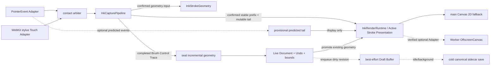

# Ink Native-Feel Performance and Brush Fidelity

- **Status:** S26/S26R1 Recovery Journal is retired by the 2026-07-19 live-first amendment; the
  2026-07-19 S27R5 Session 1 attempts remain failed quota/performance, subpixel-redraw/stringing,
  post-subpixel coalesced-input/stringing, and delayed-first-frame stringing evidence. The latest
  attempt felt smooth during continuous drawing but still failed the frozen performance Gate and
  reproduced an A-to-B chord after a briefly invisible first frame. The prior S27R6 PASS authorized
  only the attempt whose build/protocol it named; the zero-sample and front-loaded-parent causal
  repairs make that digest stale. A new real-Obsidian S27R6 PASS, clean physical Session 1 retest,
  calibration, and product sign-off remain `INCOMPLETE`, 2026-07-19
- **Scope:** performance Foundation first, then physical rendering for the existing Pen and
  Highlighter only
- **Companion plan:** `docs/specs/2026-07-17-ink-native-feel-execution-plan.md`

## Executive Decision

Inkstone will improve the existing Ink experience in two strictly ordered phases:

1. Build and pass a systemic performance Foundation that makes input, live state, brush geometry,
   rendering, recovery, and canonical persistence incremental by construction.
2. Develop the versioned Pen and Highlighter contracts, schema, geometry, candidate profiles, and
   shared consumers behind an unpublished/default-off lane; only after the physical Foundation and
   final product Gate pass may new production strokes replace the fixed-width polyline
   Implementation.

The first valid S27 physical artifact failed the fixed Foundation Gate. Physical publication and
production activation remain blocked. The failure starts an explicit S27R1-S27R5 remediation
sequence: correct the measurement ownership, make Active Stroke Presentation independent of already
painted length, compare main-thread and Worker rendering Adapters, escalate pure geometry to WASM or
rasterization to a GPU Adapter only when a production-device A/B proves the preceding Implementation
cannot meet the fixed budgets, then rerun S27 in full. The budgets are not relaxed by this
amendment.

The automated S27R1–S27R4 implementation is now present. This statement covers deterministic
measurement ownership, constant-time main Canvas presentation, the experimental Worker/
OffscreenCanvas Adapter and provisional prediction lane, and the conditional kernel/renderer
decision Gate. It is not a Foundation pass: the user has deferred target-iPad A/B, physical HAT,
human perception, and the corrected S27R5 run to one unified acceptance pass. Main Canvas 2D remains
the default, Worker is not promoted without that A/B, and the current S27R4 decision is
`not-adopted-js / production-device-evidence-required`.

The user subsequently authorized S28–S34 candidate automation to continue before that unified run.
S28–S33 are now implemented behind a compile-time, dedicated physical-HAT build boundary, and the
S27R5/S34 runner, condition cards, compatibility fences, and human-report skeleton are prepared. The
ordinary build does not construct the physical candidate lane and continues to author only legacy
strokes. This changes development ordering, not evidence or release semantics: the pre-Gate
implementation may contain fixture schemas, `candidateRevision` metadata, schema-v3 preservation
support, unpublished brush profiles, geometry kernels, and default-off consumers. It may not publish
a Brush Render Version, enable physical input in production, write a physical stroke to a user
sidecar, select an experimental presentation Adapter by default, or claim physical
quality/performance. S27R5 and S34 remain one combined release Gate.

The first corrected S27R5 iPad run then exposed a product-level regression: the tester observed
obvious lag after roughly ten strokes and device heating. The raw capture also changed from the
stylus-Touch Adapter to the Pointer Adapter inside one condition, so it is invalid for a passing
verdict. It remains immutable failed diagnostic evidence only. Run 2 and Run 3 are cancelled.

The compressed 2026-07-19 S27R5 Session 1 was materially smoother than that prior run, but it still
failed. After 95 accepted strokes and approximately 2.08 MB of encoded Recovery entries, the next
stroke was retained. The host was subsequently killed in the background; reopening the note emitted
repeated `The quota has been exceeded.` notices. This is direct evidence that the S26/S26R1
write-ahead guarantee spends database-level complexity, synchronous completion work, quota, and
lifecycle risk on a reliability contract that no longer matches the product priority.

The 2026-07-19 product decision therefore retires S26/S26R1 instead of completing the tiered exact-
copy Journal. S26R2 freezes a **Live-first + Best-effort Draft + Cold Canonical Save** model. Pen-up
first seals the incremental trace/geometry, appends the Logical Stroke to the Live Document, updates
Undo and bounds, promotes the already-rendered geometry, and posts one dirty revision. Storage,
encoding, hashing, fragmentation, canonical validation, and historical scans are forbidden in that
synchronous stack. A thin IndexedDB Draft Buffer may receive small operations asynchronously, but
its success is never a condition for the next contact.

This evidence changes the execution order and reliability contract without relaxing any latency or
memory budget. S26R2 and the S27R6 **Local Obsidian Performance Gate** must run the installed
production plugin and production Canvas inside the real desktop Obsidian host. It automatically
replays fixed traces for Pen and Highlighter over empty, 1k, and 10k-stroke/30-surface fixtures,
including writing, long-line, rapid-lift, scroll/zoom, cache lifecycle, and at least five minutes of
growing-history soak. Every locally measurable S27 budget, sample minimum, history-independence
rule, and memory/cache bound must pass before any iPad condition marker can be generated. Vitest,
jsdom, microbenchmarks, or a standalone browser remain useful lower-level evidence but cannot
satisfy S27R6.

After S27R6 passes, physical acceptance is limited to at most four short human sessions: (1) blank
Pen and Highlighter baseline, (2) the 10k/30 worst case, (3) scroll/zoom/rotation/Split View
followed by continued drawing, and (4) a three-to-five-minute stability, temperature, Notes, and
Freeform comparison. Any obvious lag or heating fails the active session immediately. The former
47-capture condition matrix is retired and must not be presented to a human tester.

The first post-Live-first Session 1 was substantially smoother, but is still failed diagnostic
evidence. At 80% workspace zoom the tester observed occasional drag-start stalls followed by a
visible connector from the initial tip position to a later curve. The raw capture recorded input
handler P99 1 ms, while viewport redraw P95/P99/max were 40/50/64 ms. Fourteen redraws exceeded one
60 Hz frame and late callbacks repainted up to 176 visible strokes. Exact floating-point Stage Frame
comparison plus a forced full-history redraw on every `ResizeObserver` callback made harmless WebKit
CSS-zoom quantization noise invoke O(visible strokes) Canvas work. The Implementation now treats
subpixel-equivalent Stage Frames as identical and performs a non-forced viewport update for ordinary
resize callbacks. This closes the deterministic stall reproduction; a clean physical Session 1 must
still prove the stringing symptom gone.

The next clean-fixture Session 1 confirmed that the subpixel correction improved smoothness and
reduced viewport redraw P95 to 4 ms, but persistent connectors remained. The immutable raw contains
95 complete, non-overlapping Pointer contacts with no Adapter switch, missing terminal, dropped
span, or generation ownership error. One contact nevertheless waited 146 ms for its first submitted
frame and was followed by two large coalesced batches; 50 large batches occurred as adjacent pairs.
The input Adapter was consuming both every confirmed coalesced raw sample and the dispatched parent
`pointermove`, even though that parent may be display-aligned. The adjacent-batch pattern motivated
an overlap hypothesis, but the old protocol exported no overlap counter and therefore does not prove
cross-batch replay. Deterministic REDs nevertheless found two independent chord constructors: a
single-point watermark could mistake a legitimate return through an old point for replay and delete
the bend; and the physical trace reducer let a pressure/orientation endpoint emission run before the
geometry-error/arc/time invariants. A third RED reproduced the 146 ms start-stall window: canonical
submission could precede Pencil down while its coalescing writer and Repository continuations ran
after the contact fence. These are input/persistence causality defects, not Canvas `closePath`,
prediction, cross-contact ownership, or viewport-history artifacts.

The repaired input contract is normative: a non-empty trusted `pointermove` coalesced list and its
parent are mutually exclusive sources; down/up retain the parent endpoint; invalid foreign or
non-finite samples poison and cancel the contact rather than becoming an empty bridgeable batch; and
each pointer contact owns a bounded rolling fingerprint tail. Only the longest exact old-tail/new-
prefix overlap may be removed. Native timestamps may move backward and are never used to guess
overlap; a new batch that merely returns through an old point remains intact. In Control Trace
reduction, geometry error, arc gap, and time gap are preserved before a later sensor-change endpoint
may seal. Canonical/Draft work has one Live Document scheduler, rechecks contact idleness after
every host yield and Repository I/O continuation, and cannot resume summary/encode/Vault work during
a new contact. A finalized Active stroke awaiting its committed promotion frame also cannot block or
clear a rapid next stroke. A current-protocol S27R6 PASS is required before another iPad marker, and
Session 2 remains prohibited.

That attempt cannot satisfy the blank-fixture claim: its note title was `45 S22 Ink Empty` and it
already contained visible history. It is archived without reinterpretation. Before the retest, the
owned iPad Vault must be replaced rather than copied as another duplicate, and the exact
`S22 Ink Empty.md` fixture must be confirmed. Session 2 remains prohibited.

This work can make Inkstone materially closer to Apple Notes and Freeform in perceived latency,
curve quality, pressure response, Highlighter behavior, and active-to-committed continuity. It does
not claim equality with PencilKit, Metal, ProMotion scheduling, or system-level Pencil handling.
Inkstone remains an Obsidian plugin running in WKWebView with JavaScript and Canvas constraints.

The scope deliberately excludes capabilities that are unavailable, host-dependent, or unrelated to
the two current tools. Candidate brush work may proceed only through the frozen automated contracts;
visual plausibility alone cannot publish it or satisfy a Gate.

## Relationship to Existing Specifications

This specification is additive except for three focused corrections:

- It supersedes the **full-record representation** required by `INK-V1.3-12` and the “Device-local
  recovery checkpoint” section of the Stage Frame specification. It also supersedes S26/S26R1,
  `INK-PF-31`–`INK-PF-38`, `INK-PF-47`, and `INK-PF-52`–`INK-PF-55` as previously worded. Legacy
  Recovery v1–v4 is read-only migration input; new sessions do not preserve its write-ahead,
  owner-lease, exact-sequence, retained-command, or next-contact-blocking semantics.
- It supersedes fixed `lineWidth` polyline rendering for **new** Pen and Highlighter strokes after
  the Foundation Gate. Historical strokes retain `legacy-round-v1` and do not change appearance.

It does not change the Stage Frame, 704 logical width, pane-wide drawing model, bounded canonical
surfaces, three-state view, manual Select/Move semantics, closed-loop Eraser semantics, editing-mode
dormancy, or iCloud reconciliation rules.

The iCloud-resilient persistence specification's non-goal of replacing canonical bounded snapshots
with an immutable mutation log remains in force. The Draft Buffer is device-local and disposable: it
adds no canonical operation log, parent hash, cloud merge ancestry, or automatic merge class.
Canonical sidecar save and existing fail-closed iCloud reconciliation remain authoritative.

## Problem Evidence

The pre-remediation implementation entering the first S27 Gate captured more information than it
displayed, but its hot path and rendering model prevented native-feel behavior:

- A coalesced input sample calls `InkDocumentSession.snapshot()` to obtain logical height.
  `snapshot()` joins, copies, and sorts the mounted document. A read-only probe over 30 bounded
  surfaces, 10,020 strokes, and 20,040 points measured P50 5.40 ms, P95 10.46 ms, and max 47.49 ms
  for one snapshot before brush work or paint.
- The pre-remediation latency metric began after sample expansion and Stage Frame mapping, so it
  omitted a substantial part of the input path.
- Pen and Highlighter were the same fixed-width `lineTo` renderer. Highlighter differed mainly by
  alpha. Pressure and tilt are captured and encoded but ignored by screen and export rendering.
- Pen-up ran an XY-only simplifier. It could delete a pressure or tilt peak on a geometrically
  straight stroke, making later physical reconstruction impossible.
- Active Canvas, committed Canvas, SVG, and PNG used separate approximations. Active and committed
  output could change shape or opacity at pen-up.
- Synchronous full Recovery checkpoint encoding and identity-unstable composite snapshots could
  delay pen-up and the next pen-down.
- The 2026-07-19 compressed physical Session 1 accepted 95 Recovery entries totaling 2,075,726
  encoded bytes, then retained the next stroke. After a background process kill, restart repeatedly
  reported `The quota has been exceeded.`. The owner lease was being rewritten before recovery was
  read, and the segmented entries remained permanently resident in the same quota-limited
  local-storage namespace. This is direct capacity/lifecycle evidence, not a geometry/WASM signal.
- Canvas backing stores already accounted for DPR. The visible jaggedness was primarily a geometry
  and continuity problem, not a missing-DPR problem.

The first production physical capture on an iPad mini (6th generation), fixed 60 Hz, Apple Pencil 2,
and the current App Store Obsidian build added stronger evidence:

- `ink-input-handler` P99 was 1 ms and `ink-frame-work` P99 was 8 ms, so the reported 3,308 ms
  `ink-input-to-submit` P99 is not evidence that one brush calculation consumed 3.3 seconds.
- The failed S27 build's controller kept accepted input spans in one pending queue and completed all
  of them at the next active-render callback. Contacts with no active frame could therefore be
  charged to a later unrelated viewport frame. The metric crossed both Presentation Frame Generation
  and contact ownership and was invalid for an algorithm decision until S27R1 repaired it.
- The failed S27 artifact's active-writing gap metric compared dirty render callbacks while a
  contact remained open. A stationary Pencil producing no new presentation work could therefore be
  misclassified as missed frames.
- Independently of those measurement defects, every active frame in that build asked the active
  spatial index to recompute its byte estimate by walking all prior active entries. Active rendering
  also allocated frozen per-sample/per-segment objects, string grid keys, maps, sorted query arrays,
  and separate two-point Canvas strokes. These were real violations of history-independent Active
  Stroke Presentation and could make the Foundation Implementation heavier than the former direct
  polyline.

The physical artifact remains a valid failed Gate result under the protocol that produced it. Its
measurement defects are not reinterpreted as a pass; the corrected protocol receives a new digest
and requires a fresh three-run capture.

These are architectural causes. Tuning smoothing constants or changing Canvas line caps before the
Foundation would hide symptoms without making latency independent of document size.

## Goals

| ID        | Goal                                                                                                                        |
| --------- | --------------------------------------------------------------------------------------------------------------------------- |
| INK-NF-01 | Input and active paint cost depend on the current Contact Batch and visible change, not total document history.             |
| INK-NF-02 | Pen-tip feedback has no avoidable full snapshot, storage, serialization, DOM measurement, or history scan.                  |
| INK-NF-03 | Active, committed, reloaded, previewed, and exported Ink consume the same Brush Geometry.                                   |
| INK-NF-04 | New Pen strokes have smooth, anti-aliased, pressure-responsive round-nib geometry with restrained velocity thinning.        |
| INK-NF-05 | New Highlighter strokes have a tilt-aware chisel footprint and stable optical density without self-overlap darkening.       |
| INK-NF-06 | Historical Ink remains visually and semantically stable.                                                                    |
| INK-NF-07 | Completed Ink is immediately usable; best-effort draft and cold sidecar saves never block the next contact.                 |
| INK-NF-08 | Performance, deterministic geometry, compatibility, and physical-iPad quality are release Gates, not informal observations. |

## Non-Goals

This plan does **not** include:

- new Pencil, Fountain Pen, crayon, texture, wet-ink, ruler, shape-recognition, or brush-selection
  tools;
- Apple Pencil double-tap, squeeze, barrel roll, hover, or system tool-palette integration;
- PencilKit, Metal, native iOS views, native palm-rejection control, or a rewrite of Obsidian;
- guaranteed 120 Hz / ProMotion parity with Apple Notes or Freeform;
- an unconditional WebGL/WebGPU rewrite. Main-thread Canvas 2D remains the mandatory fallback;
  Worker OffscreenCanvas 2D, Offscreen WebGL2, and WebGPU are optional rendering Adapters promoted
  only by the S27R3/S27R4 production-device bake-off;
- predicted samples in canonical data. S27R2 authorizes a separately tagged transient prediction
  tail only for Active Stroke Presentation when the runtime exposes `getPredictedEvents()`;
  predicted samples never enter filter stable state, Brush Control Trace, Ink Live Document,
  Recovery Journal, sidecars, Undo/Redo, hit-testing, or export;
- a main-thread WASM rewrite or a requirement for `SharedArrayBuffer`/WASM threads. A pure geometry
  WASM Implementation may run inside a Worker only after the JavaScript kernel is measured and the
  runtime capability probe passes;
- changes to Eraser product semantics, Select/Move behavior, Undo/Redo intent, Markdown rebase, zoom
  behavior, or editing-mode availability;
- passive conversion of old strokes to new brushes or reconstruction of pressure detail that the old
  XY-only simplifier already discarded.

## Domain Language

The normative terms **Ink Sample**, **Contact Batch**, **Active Stroke**, **Active Stroke
Presentation**, **Presentation Frame Generation**, **Logical Stroke**, **Brush Control Trace**,
**Brush Geometry**, **Brush Render Version**, **Ink Live Document**, **Draft Buffer**, **Legacy
Recovery Journal**, and **Stage Frame** are defined in `CONTEXT.md`.

In addition:

- **Stable prefix** is the finalized portion of an Active Stroke whose Brush Geometry will not
  change when later confirmed samples arrive.
- **Mutable tail** is the bounded end of an Active Stroke that may be re-filtered and recompiled to
  keep the visible tip responsive.
- **Physical Gate** is acceptance on a production build running on the declared physical iPad and
  Apple Pencil, with device and software versions recorded.
- **Assisted Physical Gate** is the S27/S34 workflow in which a connected-device harness performs
  environment preflight, fixture preparation, bounded diagnostics capture, analysis, and evidence
  packaging, while a named human performs real Apple Pencil and system-UI actions and signs the
  perceptual checkpoints. It is not synthetic Pencil automation.
- **Local Obsidian Performance Gate** is an automatic, deterministic performance Gate that installs
  the current production bundle into an owned local test Vault and runs the production Ink Canvas
  inside the real Obsidian desktop host. Its replay Adapter begins at the normalized Contact Batch
  seam, so it measures Inkstone and host work deterministically but does not claim native Pencil
  event-delivery or photon latency. It is a hard prerequisite for, not a substitute for, the
  compressed Physical Gate.

## Required Architecture

Only four deep Modules own the drawing path. Draft Buffer and canonical saving are cold persistence
seams behind Ink Live Document, not write-ahead transaction coordinators.

| Module               | Narrow Interface                                                                                        | Hidden Implementation                                                                                                                                                                                                                                                                           | Depth, Leverage, and Locality                                                                                                                                   |
| -------------------- | ------------------------------------------------------------------------------------------------------- | ----------------------------------------------------------------------------------------------------------------------------------------------------------------------------------------------------------------------------------------------------------------------------------------------- | --------------------------------------------------------------------------------------------------------------------------------------------------------------- |
| `InkCapturePipeline` | Accept a normalized contact batch and return active deltas, completion, or cancellation.                | Pointer/Touch arbitration, parent/raw exclusivity, per-contact coalesced causal watermark, one Stage Frame epoch, monotonic time, missing sensors, chunked capture, causal trace building.                                                                                                      | WebKit differences and input correctness remain local; controller callers do not know native event details.                                                     |
| `InkLiveDocument`    | `read()`, `query(viewport)`, synchronous `apply(command)`, physical-ink readiness, and `flush(intent)`. | Stable logical identities, incremental bounds/Undo, dirty revisions, legacy recovery migration, best-effort drafts, and cold canonical surface materialization.                                                                                                                                 | UI never waits for persistence or sees bounded-surface fragmentation; sidecars remain the cold canonical boundary.                                              |
| `InkStrokeGeometry`  | Extend an Active Stroke or compile one Logical Stroke into renderer-neutral geometry.                   | Brush registry, `legacy-round-v1`, physical brush versions, contours, bounds, hit shape, blend semantics, stable-prefix/mutable-tail logic.                                                                                                                                                     | Canvas, SVG, PNG, selection, and culling share one geometric truth.                                                                                             |
| `InkRenderRuntime`   | Install a Stage Frame, apply an active delta, apply a document change, and dispose.                     | Presentation Frame Generations, single frame owner, append-only stable raster, bounded mutable tail, active/committed promotion, dirty regions, viewport queries, incremental memory counters, geometry cache, Canvas backing stores, Highlighter masks, and optional Worker rendering Adapter. | Frame attribution, scheduling, backpressure, and Canvas state stay local; callers never coordinate presentation generations or wait for background compilation. |

Real seams and Adapters are limited to:

- `PointerEventInkAdapter` and `WebKitStylusTouchAdapter` at the input seam;
- Canvas 2D, SVG, and PNG at the Brush Geometry seam;
- main-thread Canvas 2D and Worker OffscreenCanvas 2D at the Active Stroke Presentation seam once
  S27R3 supplies and verifies the second Adapter. Before that comparison, the seam remains internal
  to `InkRenderRuntime` rather than a speculative public abstraction;
- IndexedDB and deterministic in-memory test Adapters at the best-effort Draft Buffer seam;
- the existing Stage Frame as the only coordinate Interface.

No generic plug-in brush registry UI, third-party brush Interface, or second coordinate model is
authorized.

`InkRenderRuntime` owns two latency classes behind one Interface:

- **Presentation lane:** confirmed Contact Batches are appended to a preallocated/chunked numeric
  buffer, associated with one Presentation Frame Generation, and submitted through an append-only
  stable layer plus a bounded mutable-tail layer. This lane never waits for persistence, a global
  spatial index, background compilation, Worker response, or WASM. If an optional Adapter misses a
  deadline, the current main-thread Canvas 2D Implementation remains a valid fallback.
- **Truth lane:** confirmed samples continue into the Brush Control Trace, Ink Live Document,
  committed Brush Geometry, caches, the best-effort Draft Buffer, and cold sidecar save. Live
  document acceptance and geometry promotion are synchronous and storage-free; persistence work is
  asynchronous and never owns next-contact readiness.

The Active Stroke is an ordered append stream, not a two-dimensional historical query. Its stable
presentation Implementation must not use the committed-document spatial index. Stable pixels or
geometry chunks are appended once; only the bounded mutable-tail layer is cleared and rebuilt.

### Reference Interfaces

```ts
interface InkCapturePipeline {
  accept(batch: InkContactBatch): InkCaptureResult;
}

interface InkLiveDocument {
  read(): InkDocumentReadView; // O(1), stable immutable references
  query(viewport: InkLogicalRect): readonly InkRenderableStrokeRef[];
  preparePhysicalInk(): Promise<InkPhysicalInkReadiness>; // cold, no canonical mutation
  apply(command: InkDocumentCommand): InkDocumentApplyResult;
  flush(intent: 'background' | 'exit' | 'retry'): Promise<InkFlushResult>;
}

type InkDocumentApplyResult = {
  readonly kind: 'committed'; // committed to the mounted Live Document, not yet canonical
  readonly change: InkDocumentChange;
  readonly dirtyRevision: number;
};

interface InkStrokeGeometry {
  extend(active: ActiveGeometryState, delta: InkSampleDelta): ActiveGeometryDelta;
  compile(stroke: InkLogicalStroke): CompiledInkStroke;
}

interface InkRenderRuntime {
  setFrame(frame: VersionedInkStageFrame): void;
  applyActiveDelta(input: InkRenderActiveDelta): void; // confirmed delta + optional borrowed provisional tail
  applyDocumentChange(change: InkDocumentChange): void;
  dispose(): void;
}

interface InkDraftStore {
  enqueue(operation: InkDraftOperation): Promise<void>;
  load(noteKey: string): Promise<readonly InkDraftOperation[]>;
  discardThrough(noteKey: string, revision: number): Promise<void>;
}
```

These Interfaces include call order, complexity, ownership, and failure semantics. They are not only
TypeScript signatures.

### Data Flow



A Contact Batch uses one complete immutable Stage Frame epoch. A later batch may atomically use a
replacement frame; one batch may never combine old and new frame fields.

`InkLiveDocument.apply()` owns one in-process mutation. For an Add command it appends the Logical
Stroke, bounds-index delta, add-only Undo entry, and dirty revision without first constructing
bounded surfaces. Active-to-committed presentation reuses the incremental compiler output. The
method does not call localStorage, IndexedDB, Vault, encoders, hashes, fragmentation, canonical
validation, or historical scans.

After `apply()` returns, a persistence scheduler may enqueue one small draft operation and later
materialize bounded surfaces for canonical save. Draft or sidecar failure changes persistence state
to visibly unsaved, reports the error, and keeps the mounted Live Document writable. It never
returns a retained command, blocks the next contact, or forces Retry before leaving Ink Mode.
Destructive commands remain atomic within the process and enter the same dirty-revision lane.

## Foundation Requirements

### Input and Capture

- `INK-PF-01` — Every accepted Pencil or mouse contact becomes a normalized Contact Batch before
  capture. The two native Adapters must not implement brush or persistence behavior.
- `INK-PF-02` — Converting one event with `k` actual/coalesced samples is `O(k)`. The cost must not
  depend on historical strokes or bounded-surface count.
- `INK-PF-03` — Move-phase input, active capture, and active paint call stacks must not call
  document `snapshot()`, canonical encoding, `JSON.stringify`, storage, DOM geometry measurement,
  full stroke scan, full sort, or full-array copy. Contact completion has the same prohibition:
  storage, encoding, hashing, fragmentation, canonical validation, and historical scanning call
  counts are exactly zero, and the synchronous pen-up path meets the 4 ms P99 budget.
- `INK-PF-04` — Logical height, selected style, and Stage Frame come from a stable read view. They
  are not recomputed for every sample.
- `INK-PF-05` — Measured pressure `0` and tilt `0` are valid. Missing capability is explicit and
  must not be represented by a falsy check or silently rewritten to measured `0.5`.
- `INK-PF-06` — The parent down/up endpoint is retained when `getCoalescedEvents()` is empty. A
  non-monotonic native timestamp is monotonized inside capture without changing prior Ink Samples.
- `INK-PF-06A` — A non-empty trusted move coalesced list and its dispatched parent are mutually
  exclusive confirmed sources. Cross-batch deduplication may remove only the longest exact bounded
  old-tail/new-prefix overlap for the same pointer contact. It may not search for a matching sample
  inside the new trajectory or infer overlap from timestamps or approximate sensor values.
- `INK-PF-06A1` — A fully replayed cumulative coalesced move with no sample after the exact overlap
  is ignored; it must not create an accepted zero-sample batch, geometry update, frame request, or
  input-to-submit span. If WebKit front-loads the exact dispatched parent before an otherwise
  monotonic group of older coalesced samples, the Adapter rotates only that exact parent behind the
  older group without copying or dropping samples. This bounded causal repair is not timestamp-
  based overlap inference and must be reported by the privacy-safe local Gate canary.
- `INK-PF-06B` — A foreign pointer/type or non-finite parent/coalesced move poisons and cancels the
  current contact. It is not represented as a valid zero-sample move, and no later move/up may
  commit or bridge from the last valid point. Watermarks are isolated per pointer contact.
- `INK-PF-07` — Active sample storage is chunked and append-only. Growing a long stroke must not
  repeatedly copy its full history.
- `INK-PF-08` — Pointer and stylus Touch double delivery creates one Logical Stroke. The arbiter
  records one Adapter owner for the contact sequence.
- `INK-PF-09` — No new stroke may change from raw active points to a different full-stroke RDP
  result at pen-up. Trace reduction is causal with a bounded mutable tail and preserves position,
  time, pressure/tilt extrema, required endpoints, and final Brush Geometry within its frozen
  version error budget.

#### Foundation Legacy Trace

Foundation does not postpone active/commit consistency until the physical brushes:

- Historical v1/v2 points remain byte-for-byte unchanged and render with the existing fixed-width,
  round `legacy-round-v1` geometry.
- New Foundation-era legacy strokes use a frozen causal legacy reducer. It emits on XY contour
  error, maximum arc-length/time gaps, pressure or tilt extrema, and required contact endpoints. Its
  stable prefix never changes; only a bounded tail may be revised.
- Active Canvas renders that emitted trace rather than a separate raw polyline. Pen-up only
  finalizes the tail; it does not scan or replace the whole stroke. Active-final, committed, and
  reload input points are therefore identical.
- The compatibility target for a new Foundation stroke is the current **active** fixed-width round
  geometry, including width, cap, join, and color. Highlighter uses its configured one-stroke
  density, not accidental frame-seam accumulation. Retaining more faithful turns than the old pen-up
  RDP is an intentional correction. Historical committed Ink remains the no-change baseline.
- Reducer output grows with authored arc length/time, not native event frequency. S24 freezes and
  tests maximum spacing, maximum time gap, tail extent, 30-second output size, and an explicit
  too-large-command failure that retains the completed trace rather than truncating it.

### Ink Live Document

- `INK-PF-10` — `read()` is `O(1)` and returns stable immutable references. It must not join
  fragments, sort all strokes, or clone the full document.
- `INK-PF-11` — `query(viewport)` is `O(log H + V)` or better, where `H` is historical Logical
  Strokes and `V` is the visible result set.
- `INK-PF-12` — A committed `apply(command)` result contains exact added, updated, and removed
  logical IDs, a generation, and conservative invalidation bounds. A rejected in-process mutation
  produces no optimistic `InkDocumentChange`; persistence failure occurs only after commit and does
  not change that Live result.
- `INK-PF-13` — A Logical Stroke spanning bounded surfaces remains one command for Undo, rendering,
  optional best-effort Draft enqueue, and canonical atomic persistence.
- `INK-PF-14` — UI change notifications contain a shallow read view and `InkDocumentChange`; they do
  not attach a newly materialized composite record.
- `INK-PF-15` — Full canonical record materialization is permitted only on cold paths: mount/load,
  canonical save, legacy Recovery read-only migration, explicit export, and fixture creation.

### Geometry and Rendering

- `INK-PF-16` — `InkStrokeGeometry` is pure domain code with no DOM, Obsidian, Canvas, Node, or
  storage imports.
- `INK-PF-17` — One finalized stroke trace and Brush Render Version produce the same quantized
  logical geometry for active-final, commit, reload, preview, SVG, and PNG. Within one completion
  transaction, the already-validated compiled physical geometry is transferred through document
  bounds, Active finalization, committed promotion, and the geometry cache; none of those consumers
  may independently recompile the same complete trace.
- `INK-PF-18` — Foundation work first wraps the current look as `legacy-round-v1` and proves golden
  parity under the Foundation Legacy Trace rules. Physical brush versions are forbidden until the
  Foundation Physical Gate passes.
- `INK-PF-19` — Active rendering processes only newly stable geometry plus a bounded mutable tail.
  Its work must not grow with already-painted active length or document history.
- `INK-PF-19A` — A completed stroke waiting for identical committed geometry to be painted never
  blocks the next contact. Promotion identity is queued per stroke; completing an older promotion
  must not clear the newer Active stroke.
- `INK-PF-20` — `InkRenderRuntime` is the only active-paint rAF owner, with at most one frame
  queued.
- `INK-PF-21` — Pen-up does not clear active geometry before identical committed geometry is
  visible. Ownership transfers without a blank frame, opacity change, or shape jump.
- `INK-PF-22` — Ordinary append invalidates only the new stroke; active input invalidates only its
  geometry delta; move/restyle/erase invalidates only affected IDs. An added-only promotion
  preserves a matching prepared cache entry instead of invalidating and recompiling it.
  Frame/backing replacement may redraw the viewport.
- `INK-PF-23` — DPR and zoom affect Canvas projection only. They do not alter logical geometry,
  sidecar coordinates, or logical geometry cache keys.
- `INK-PF-24` — Visible bounds, dirty regions, viewport culling, point hit-testing, selection
  chrome, and export bounds consume conservative Brush Geometry rather than `width / 2` guesses.
- `INK-PF-25` — Highlighter active rendering uses an isolated coverage mask or equivalent.
  Repainting a segment or mutable tail must not accumulate alpha inside one Logical Stroke.
- `INK-PF-26` — Geometry failure for a known Brush Render Version does not mutate canonical data.
  One affected stroke degrades to a deterministic legacy presentation with a local diagnostic; it
  must not clear the document. An unknown version follows the schema fail-closed rule instead.

### Cache and Memory

- `INK-PF-27` — A geometry cache key includes logical stroke ID, Brush Render Version, canonical
  point digest/generation, nominal width, and color/blend inputs.
- `INK-PF-28` — Cache invalidation follows `InkDocumentChange`. Stage Frame, DPR, and zoom changes
  do not invalidate logical geometry.
- `INK-PF-29` — Geometry, masks, indexes, and Canvas pixels are disposable. A miss is rebuilt from
  canonical Brush Control Traces and no cache bytes enter sidecars, recovery, or merge comparisons.
- `INK-PF-30` — Disposable CPU geometry, spatial-index, retained mask/tile, and presentation-cache
  estimates are capped together at 32 MiB per mounted document and 64 MiB for the plugin. Canonical
  traces, the current Active Stroke, and the mandatory current-viewport Canvas backing stores are
  correctness working sets and are reported separately rather than pretending they are evictable
  cache. Eviction order is non-active, outside viewport, then least recently used.

`InkRenderRuntime` may own at most three viewport-sized backing stores: committed, Active Stroke
stable, and Active Stroke mutable-tail/temporary Highlighter mask. Stable and tail Canvas children
share one presentation stack opacity so a Highlighter Logical Stroke is composited once; separate
child opacity must not darken their overlap. The tail/mask store is released or reused after
promotion. A fourth simultaneous viewport backing store and every document-sized store are
forbidden. Diagnostics report estimated bytes as `width * height * DPR^2 * 4` per backing store plus
the disposable-cache estimate; browser/GPU copies that JavaScript cannot observe are explicitly
labeled unmeasured.

### S27 Failed-Gate Remediation

- `INK-PF-39` — Every accepted Contact Batch that requests presentation is tagged with the current
  contact sequence and one Presentation Frame Generation. `ink-input-to-submit` completes only when
  that generation's active render callback has consumed the batch. Contact end, cancel, dispose,
  frame replacement, and an unrelated viewport callback cancel or separately classify unconsumed
  measurements; they never complete them as successful submissions.
- `INK-PF-40` — Missed-frame debt is measured only while confirmed presentation work is pending. A
  contact held stationary with no unpresented samples contributes no expected active frames. A
  separate warmed heartbeat may report host scheduling gaps, but it must not be merged into the Ink
  missed-frame ratio or attributed to brush work.
- `INK-PF-41` — Active Stroke Presentation is `O(k + T)` per frame, where `k` is newly confirmed
  samples and `T` is the frozen mutable-tail bound. It contains no query, memory-stat scan, sort,
  allocation, or redraw proportional to already painted Active Stroke length. The committed Ink Live
  Document retains its viewport/bounds index; the Active Stroke does not.
- `INK-PF-42` — The steady-state Contact Batch/Active Stroke hot Implementation uses reusable
  numeric chunks or ring buffers. It does not build nested frozen capability/sample/style/bounds
  object trees per native sample, convert orientation to one representation and back inside the same
  hot path, or clone full prefix arrays. Immutable domain objects are materialized only at a
  canonical or test-observation seam.
- `INK-PF-43` — Active stable output is appended in one bounded Canvas path or geometry chunk per
  Presentation Frame Generation. Only the mutable-tail layer is cleared and rebuilt. Canvas backing
  width/height are assigned only when the physical backing dimensions change; Stage Frame origin,
  scroll, and projection changes update transforms without implicitly reallocating both stores.
- `INK-PF-44` — When runtime capability detection exposes `getPredictedEvents()`, an Adapter may
  display a tagged provisional tail. Confirmed actual/coalesced samples replace overlapping
  predictions before the next stable append. A throwing getter, malformed/cross-contact/out-of-order
  prediction, stale Stage Frame epoch, capability absence, or runtime/protocol failure falls back to
  confirmed rendering without changing any canonical, filtering, recovery, hit-test, or export
  result.
- `INK-PF-45` — Main-thread Canvas 2D is the mandatory Active Stroke Presentation Adapter. A
  Dedicated Worker plus transferred OffscreenCanvas 2D may become the preferred Adapter only when
  the same production-device trace passes correctness, failure/recovery, and latency A/B Gates.
  Pointer listeners remain on the main thread; a Worker result is never allowed to gate the next
  visible tip update or ownership of confirmed samples.
- `INK-PF-46` — WASM is a replaceable pure geometry Implementation inside a Worker, never a
  main-thread rewrite or per-sample foreign-function call. Promotion requires deterministic output
  against the JavaScript reference and a material production-device win. SharedArrayBuffer/WASM
  threads require an affirmative `crossOriginIsolated` capability result; otherwise a bounded pool
  of transferable buffers is used. Offscreen WebGL2 is considered only after Canvas raster work is
  the measured limiter. WebGPU remains experimental and cannot be the sole release Adapter.

### Historical S26/S26R1 Recovery Contract — Retired, Non-Normative

The following S26/S26R1 requirements and tiered-storage protocol are retained only so old evidence,
tests, and migration bytes remain understandable. They are superseded in full by the normative S26R2
contract below. New production code must not satisfy them by writing a Recovery Journal.

- `INK-PF-31` — Sidecars remain canonical. Recovery Journal is a device-local write-ahead cache.
- `INK-PF-32` — Recovery v4 uses a cold versioned base plus independently stored, append-only
  logical-command entries. The base is armed before input or another cold path. Completing a stroke
  writes one new entry; it never rewrites an entry array, manifest proportional to history, or
  historical records.
- `INK-PF-33` — A journal delta contains command ID, owner/generation, sequence, affected surface
  IDs, exact before revision/digest, exact after digest, added/replaced/deleted IDs, exact
  canonical-encoded candidate strokes/layout patches, style, input profile, and Brush Render
  Version. Recovery applies the frozen v4 patch codec; it never reruns future fragmentation, brush,
  move, erase, Undo, or migration algorithms.
- `INK-PF-34` — All fragments of one cross-surface stroke are one journal command and recover
  all-or-none.
- `INK-PF-35` — Canonical save acknowledges only the exact sequence it committed. Entries appended
  while save is in flight remain recoverable.
- `INK-PF-36` — Recovery v3 remains readable. Recovery v4 retains exact-base, already-landed, safe
  append reconciliation, corrupt quarantine, stale-owner fencing, and fail-closed third-state
  behavior.
- `INK-PF-37` — Journal quota, stale owner, or write failure never discards live Ink. The mounted
  owner retains it, displays a durability error, and immediately attempts canonical background
  flush. If both paths fail, Retry retains the same live state.
- `INK-PF-38` — Vault writes, iCloud reconciliation, SVG/PNG export, and cache construction never
  run in the pointer listener or active-rAF call stack.
- `INK-PF-47` — Recovery v4 computes the complete base digest only on the cold arm/load path. New
  generations declare `command-chain-v1`: every completion entry binds the previous digest,
  contiguous sequence, command identity, and checked payload checksum without encoding historical
  records or point payloads. A head without this declaration remains readable with the legacy
  record-digest algorithm. Cold replay still applies every frozen command and verifies the selected
  digest algorithm before exposing recovery state.
- `INK-PF-48` — The installed production plugin exposes an ownership-fenced, build-time-enabled
  local performance request/result seam. Only an owned synthetic Vault may activate it. The seam
  mounts the same production Ink Canvas, `InkCapturePipeline`, `InkLiveDocument`,
  `InkStrokeGeometry`, `InkRenderRuntime`, Recovery Journal, and persistence Adapters used by the
  plugin; it must not replace them with jsdom, mocks, or a benchmark-only renderer.
- `INK-PF-49` — Local deterministic replay injects privacy-safe Pen and Highlighter traces at the
  normalized Contact Batch seam, waits on real host `requestAnimationFrame`, and records the same
  bounded spans and provenance as S27. It covers empty, 1k, and 10k/30 fixtures; ordinary writing,
  long lines, rapid pen-up/down, scroll/zoom, cache create/evict/remount, and at least five minutes
  of growing history. Fixed traces are replayed repeatedly by automation; a human never repeats the
  performance matrix. Each synthetic normalized batch is delivered at a fixed pre-frame phase and
  then settled by the next real host frame; replay must not phase-lock input immediately after rAF
  or emulate native samples as competing high-frequency DOM tasks.
- `INK-PF-50` — S27R6 is fail closed. One command installs the current build, launches or connects
  to real Obsidian, submits the frozen protocol, waits for raw output, analyzes every locally
  measurable frozen budget, and writes the build digest, protocol digest, raw JSON, normalized
  report, verdict, and Source Manifest. Missing samples, stale/mixed digests, unbounded memory,
  history-correlated regression, unavailable required host evidence, or any failed budget produces
  `FAIL`/`INCOMPLETE` and prevents all iPad marker generation.
- `INK-PF-51` — Growing-history results are reported in fixed stroke windows (1–10, 11–20, 21–30,
  and subsequent ten-stroke windows). Input-to-submit, stroke commit, frame/viewport work, host
  gaps, Recovery/persistence, heap/backing-store, and geometry-cache trends must identify the first
  regressing window and attributable span. Recovery and canonical persistence never run in the
  listener or active-frame stack. Worker or WASM work is considered only after a production-host
  profile attributes the dominant cost to transfer-safe geometry/filter/tessellation; main-thread
  WASM may not mask persistence, WKWebView/Electron host scheduling, or compositor work.
- `INK-PF-52` — Recovery v4 keeps its serialized base/head/ack/entry protocol but the production
  device-local Adapter is tiered: a synchronous, quota-bounded local-storage front journal plus an
  asynchronous IndexedDB archive. Legacy v1–v4 bytes remain readable. Hydration or migration must
  preserve exact bytes and checksums; this storage placement correction does not create Recovery v5
  or change canonical sidecar semantics.
- `INK-PF-53` — A completed command is durable only after its exact entry is synchronously present
  in the front journal. The Adapter may archive that entry asynchronously and remove the front copy
  only after the exact bytes are durably committed. Recovery merges archive and front by scoped key
  and exact bytes, deduplicates identical copies, and fails closed on divergent copies, sequence
  gaps, or checksum mismatch. The armed base and head must be durably archived and readable before
  input is enabled.
- `INK-PF-54` — A process restart at full front-journal quota must be able to replace only the tiny
  stale owner lease and then read the existing journal without rewriting its base, head, or entries.
  Lease replacement failure restores the prior lease best-effort and changes no journal bytes.
  Repeated mounts must not create a quota-toast storm or hide a recoverable unacknowledged command.
- `INK-PF-55` — Front-journal usage is bounded by commands not yet confirmed in the archive, not by
  drawing history. Archive failure leaves the front copy and live retained command reachable;
  capacity pressure never clears user Ink. Archival, migration, compaction, Vault persistence, and
  garbage collection never run in a pointer listener or active-rAF stack. The Local Obsidian Gate
  must inject archive delay/failure, verify restart at full quota, run growing-history capacity
  sampling, and report front/archive bytes and pending archive work.

#### Recovery v4 Tiered Storage Protocol

The tiered device-local Adapter uses one segmented namespace scoped by vault, device, file, owner,
and generation. The serialized keys and values remain Recovery v4 compatible; only their durable
placement changes:

```text
head                         -> active generation ID and owner fence
generation/<g>/base          -> exact confirmed base + optional pre-armed schema plan
generation/<g>/entry/<seq>   -> one checksummed PreparedInkCommand
generation/<g>/ack           -> highest exact canonical sequence acknowledged
```

- The owner lease and newly completed entry first use the synchronous local-storage front journal.
  Base, head, ack, quarantined bytes, and drained entries live in the IndexedDB archive after
  hydration. A fresh `arm()` writes and validates the complete cold base, switches the small `head`,
  and awaits durable archive commit before input is accepted.
- `append()` performs exactly one synchronous front-journal `setItem` for a new sequence key. The
  entry includes generation, sequence, command ID, payload length, and checksum; no tail manifest is
  rewritten per command. Async draining copies the exact value to the archive and deletes the front
  key only after commit succeeds.
- Startup hydrates the archive, then imports any legacy front-resident v1–v4 keys without changing
  their bytes. Identical front/archive copies deduplicate; divergent copies fail closed and both
  remain inspectable. Migration deletes a front copy only after its archive transaction commits.
- Recovery enumerates the merged active generation, sorts numeric sequence keys, rejects gaps,
  duplicate command IDs with different bytes, checksum failure, owner mismatch, or an unexpected
  before digest. It quarantines ambiguous bytes and changes no canonical sidecar.
- `ack` is a small watermark written only after the exact canonical result becomes the confirmed
  live base. A crash after canonical write but before `ack` is resolved by already-landed detection;
  a crash after `ack` but before deletion safely ignores the covered entries.
- Cold compaction writes a complete next-generation base, validates it, switches `head`, then
  garbage-collects the previous generation. Failure injection at every storage call must prove that
  recovery selects either the complete old generation or the complete new generation, never a
  mixture.
- Archive draining, legacy migration, compaction, and garbage collection are scheduled outside the
  pointer and active-frame stacks. Background/exit safe points await pending archive work, while a
  crash before drain remains recoverable from the synchronous front copy.
- Entry size is `O(command footprint)`: add stores new fragments; move/restyle stores exact
  replacements; erase stores deleted IDs plus required before/after digests; Undo/Redo stores the
  exact inverse/forward patch; layout/schema changes reference an exact pre-armed plan. A command
  affecting many selected strokes may scale with those strokes, but never with unaffected history.

### Normative S26R2 Live-First Persistence Contract

- `INK-PF-31` — Sidecars remain canonical. The mounted Ink Live Document is the immediate working
  truth for interaction; the Draft Buffer is best-effort device-local protection, not a write-ahead
  cache or commit prerequisite.
- `INK-PF-32` — Synchronous pen-up performs only: seal the current mutable trace/geometry tail;
  append one Logical Stroke to the Live Document; incrementally update bounds and add-only Undo;
  promote the existing Active Geometry; and publish one dirty revision. Its complexity is `O(T)`
  where `T` is the frozen mutable-tail bound, independent of history and canonical surface count.
- `INK-PF-33` — Pointer move/up stacks perform zero Storage, IndexedDB, Vault, JSON encoding,
  checksum/hash, complete trace materialization, full geometry compilation/parity digest, bounded-
  surface fragmentation, canonical validation, or history scan calls.
- `INK-PF-34` — `InkDraftStore` exposes only `enqueue(operation)`, `load(noteKey)`, and
  `discardThrough(noteKey, revision)`. Production uses native IndexedDB transactions and small
  asynchronous batches. It has no localStorage front, base/head/generation/entry/ack protocol,
  checksum chain, compaction, garbage collection, or durable owner lease. Draft v1 intentionally
  protects completed Add operations only: relative move/Undo/Redo cannot be reconciled idempotently
  across the sidecar-written/Draft-not-yet-deleted crash window without recreating a transaction
  protocol. Editing operations therefore rely on the cold canonical save.
- `INK-PF-35` — Draft enqueue begins only after Live Document acceptance and never gates the next
  contact. Canonical save of revision `N` permits deletion of drafts through `N`; later revisions
  remain. Draft failure leaves the current process writable, reports `Unsaved`, and does not force a
  Retry workflow.
- `INK-PF-36` — Recovery v1–v4 remains a cold, read-only migration input for a bounded transition
  period. Migration may load and validate legacy bytes before mounting the note, then enqueue the
  recovered operations or force a canonical save. Stale, corrupt, or surface-set-mismatched legacy
  bytes are preserved and ignored in favor of canonical Ink with one process diagnostic; they do not
  block Ink Mode or create a Retry surface. New input never arms, appends, acknowledges, leases,
  compacts, mutates, or clears legacy Recovery data in the hot path.
- `INK-PF-37` — The accepted reliability contract is: normal idle/background/exit saves canonical
  sidecars; a sudden process kill may lose the last operation not yet in an async draft batch
  (target window approximately 0.5 seconds); Draft Store failure may lose changes since the last
  canonical save; any save failure retains all current-process Ink and permits continued drawing.
- `INK-PF-38` — Vault writes, iCloud reconciliation, SVG/PNG export, cache construction, draft I/O,
  JSON encoding, and canonical surface work never run in pointer listener, pointer completion, or
  active-rAF stacks.
- `INK-PF-47` — One process-local note session is the only writer to its Live Document. It tracks a
  monotonic dirty revision and coalesces persistence demand. Saving starts only with no active
  contact and no frame debt; a newer dirty revision never waits for an older save to finish before
  it can be drawn. Bounded surface sessions own no independent auto-flush timer; the Live Document
  is the single canonical scheduler.
- `INK-PF-52` — Active physical compilers seal only the mutable tail. Production completion reuses
  their finalized Brush Geometry and must not compile the complete trace or compare full coverage
  digests. Full parity compilation is a test/oracle operation only.
- `INK-PF-53` — Ordinary Add appends the Logical Stroke before any 4096 px surface fragmentation.
  Surface splitting, strict join validation, canonical record construction, and JSON encoding belong
  exclusively to the persistence lane.
- `INK-PF-54` — Cold canonical save snapshots one immutable Live Document revision, fragments only
  the changed Logical Strokes, preserves cross-surface atomic sidecar publication, and never blocks
  the capture or presentation lanes. Completion of revision `N` cannot clear draft/dirty state for a
  later revision. The coalescing barrier rechecks contact idleness after yielding to the host, and a
  per-call cold-lane checkpoint is propagated through Repository reads/writes and summary rebuilds;
  work already awaiting I/O pauses before its next CPU/encode/Vault continuation when a contact
  begins.
- `INK-PF-55` — Draft batches, pending save snapshots, backing stores, and geometry caches are
  bounded and observable. A five-minute growing-history run must show stable move/pen-up latency and
  bounded memory even when Draft Store and canonical persistence are delayed or fail.

The legacy Recovery implementation may remain temporarily only behind the read-only migration seam.
It is dead to new-session writes and is deleted after migration compatibility evidence is complete.

## Performance Contract

`k` is new samples in one Contact Batch, `H` historical Logical Strokes, and `V` visible Logical
Strokes. Automated unit/performance tests prove complexity and forbidden-call counts. The installed
production plugin in real desktop Obsidian must pass every locally measurable budget before physical
testing is allowed; only the later production-build iPad sessions can pass native Pencil delivery,
tip-to-display, thermal, and product-comparison checkpoints.

| Metric                                                                  | Release budget                                                                                                 |
| ----------------------------------------------------------------------- | -------------------------------------------------------------------------------------------------------------- |
| Listener entry to normalized active delta queued                        | physical iPad P95 <= 2 ms; P99 <= 4 ms; `O(k)`                                                                 |
| Ink rAF callback entry to Canvas mutations complete                     | P95 <= 8 ms; P99 <= 12 ms                                                                                      |
| Listener entry to Canvas mutation submission                            | P50 <= `R`; P95 <= `R + 8 ms`; P99 <= `2R`, where `R` is measured refresh interval                             |
| Pen-up synchronous Live Document commit                                 | P95 <= 2 ms; P99 <= 4 ms; independent of history and surface count                                             |
| 30 seconds continuous small writing, long lines, and frequent lift/drop | zero Ink-attributable >=50 ms long tasks; missed-frame ratio < 1%                                              |
| Empty history versus 10k strokes / 30 surfaces                          | input and active-rAF P95 delta <= `max(1 ms, 10%)`                                                             |
| 800-logical-pixel viewport redraw over 10k-stroke fixture               | `O(log H + V)` and physical iPad P95 < 16.7 ms                                                                 |
| Forbidden work in move/up/active path                                   | zero storage, Vault, encode, hash, fragmentation, canonical validation, full compile, or historical scan calls |
| Draft persistence synchronous submit                                    | P99 <=4 ms; asynchronous after Live commit; never awaited by input; bounded batch and queue                    |
| Canonical persistence synchronous submit                                | P99 <=12 ms; starts only without contact/frame debt and fragments only dirty Logical Strokes                   |
| Disposable geometry/index/mask/presentation cache                       | <=32 MiB per mount and <=64 MiB plugin-wide; backing stores reported separately                                |

The metrics begin at the first executable line of the native listener. Required bounded local spans
are:

- `ink-input-handler`;
- `ink-frame-work`;
- `ink-input-to-submit`;
- `ink-stroke-commit`;
- `ink-draft-persistence-submit`;
- `ink-canonical-persistence-submit`;
- `ink-viewport-redraw`.

Every input/submit sample additionally carries privacy-safe integer `contactSequence`,
`batchSequence`, `requestedGeneration`, and `submittedGeneration` fields plus an outcome of
`submitted`, `cancelled`, `superseded`, or `unpresented`. A successful latency sample requires
matching contact and generation ownership. Raw native coordinates, sensor values, geometry, note
content, and file identity remain forbidden. `ink-stroke-commit` records the Live Document revision
and forbidden-call counters. The two persistence-submit spans measure synchronous main-thread launch
work only and are reported separately from asynchronous I/O; their P99 budgets are respectively 4 ms
and 12 ms. Runtime audit guards must also prove that Draft/canonical work started in the cold phase
and may never overlap an active contact or frame debt.

`requestAnimationFrame` is a submission surrogate, not proof that pixels reached the display. The
measurement protocol is therefore fixed as follows:

- Measure `R` from 120 warmed idle rAF intervals in the same view and record refresh mode plus
  interval P10/P50/P90. If median refresh changes by more than 10% inside a condition, invalidate
  and repeat that condition.
- Warm each fixture for 10 seconds; run each condition three times with at least 1,000 move batches.
  Pen-up percentiles use at least 100 completed strokes per Adapter. Report Pointer and stylus Touch
  separately rather than pooling them.
- A Presentation Frame Generation begins when the first unpresented confirmed batch requests a frame
  and ends when the matching active callback submits it or the generation is explicitly cancelled.
  For a pending interval, missed frames are `max(0, ceil((submittedAt - requestedAt) / R) - 1)`. The
  denominator is the sum of expected generations/interval slots while confirmed work is pending.
  Time between dirty generations, including a stationary held Pencil, creates no expected active
  frame. A continuously warmed idle heartbeat is reported separately to reveal WKWebView scheduling
  stalls.
- Event-delivery lag may be reported from `listenerNow - event.timeStamp` only after the runtime
  proves both clocks share one monotonic time origin. An invalid or epoch-based native timestamp is
  marked unavailable rather than mixed into listener or submission percentiles.
- Use `PerformanceObserver` long-task entries when exposed. Otherwise record the fallback as
  unavailable and report >=50 ms main-thread/rAF gaps separately; do not label the fallback as true
  Long Tasks API evidence.
- True tip-to-display feel is a separate physical HAT: record at >=240 fps after warmup, at least 20
  strokes in the applicable compressed physical session, and report frame-by-frame tip/tail lag for
  Inkstone, Notes, and Freeform under the same device, Pencil, zoom, and lighting. This evidence is
  relative and does not claim private hardware event timestamps or exact photon latency.

### Local Obsidian Performance Gate Protocol

The growing-history lane treats any history- or surface-count-dependent work on ordinary Add as an
architectural failure, even when aggregate percentiles remain under budget. Bounds-index accounting,
Live Document append, add Undo, and geometry promotion are incremental. Draft enqueue and canonical
surface materialization are separately measured cold work and may not overlap contact/frame debt.

S27R6 uses one checked-in command and an owned local Vault. It is not satisfied by Vitest/jsdom,
Node-only baselines, a standalone web page, Chrome, Electron outside Obsidian, or mocked Canvas. The
automatic command must:

1. build the exact candidate and compute its bundle/build digest;
2. install it only into the ownership-fenced local performance Vault;
3. launch or attach to the real Obsidian desktop application and prove the expected plugin build,
   Vault marker, production Canvas Adapter, host version, and protocol digest are active;
4. load frozen empty, 1k, and 10k/30 fixtures;
5. replay deterministic Pen and Highlighter traces for ordinary writing, long line, rapid lift,
   scroll/zoom, cache lifecycle, and a minimum five-minute growing-history soak; every measured
   stroke starts with a delayed-first-frame canary that dispatches down plus a front-loaded-parent
   12-sample curve before one shared presentation frame;
6. capture raw privacy-safe spans/counters, fixed-window trends, heap/backing-store/cache peaks,
   Draft/canonical persistence isolation, host heartbeat gaps, and Adapter provenance;
7. analyze all existing S27 locally measurable budgets with their frozen sample minimums; and
8. persist raw JSON, a human-readable and machine-readable performance report, exact commands,
   build/protocol digests, PASS/FAIL/INCOMPLETE, and a Source Manifest.

The one-command runner holds display and idle-sleep assertions for the entire unattended capture. If
Obsidian becomes hidden or loses foreground scheduling, the current condition fails closed with the
original host-focus reason; it must not be relabeled as a fixed-sample timeout. The local-Gate-only
diagnostics buffer is separately bounded but sized to retain the complete five-minute soak, so the
analyzer emits every 1–10, 11–20, 21–30… window instead of only the tail. The viewport condition
must drive both the production scroller and the real Ink workspace zoom buttons while an independent
rAF heartbeat records host gaps.

The zero-gap Gate is specifically zero `active-writing`/pending-work intervals at or above 50 ms.
Independent host-heartbeat gaps are preserved by condition, count, and maximum as separate
observations; they are not silently discarded and are not automatically attributed to Ink when no
presentation work is pending. If raw evidence or a profile attributes such a gap to Ink work, the
corresponding long-task, viewport, cache-lifecycle, or persistence budget fails independently.

Each ordinary normalized replay batch first anchors on a real host rAF, waits a fixed 2 ms,
dispatches, and is settled by the following real host rAF. For the initial-frame stringing canary,
the down and first 12-sample move deliberately share that following rAF. The first item in the
synthetic move is the exact display-aligned parent and the remaining items are the older ordered
curve, reproducing the observed A-to-B failure window without human drawing. Every condition must
record at least 100 `front-loaded-parent` repairs, the committed physical trace must satisfy the
fixed no-long-first-chord oracle, and accepted move/input-to-submit spans with sample bucket `0`
must total zero. The preceding anchor keeps the replay cadence and complete diagnostics buffer
bounded; the 2 ms post-frame phase remains before the next frame at supported 60/120/240 Hz refresh
modes. A fixed 12 ms timer is forbidden because it crosses a frame at 120 Hz and converts timer
phase drift into a false growing-history `input-to-submit` trend. Every ten completed strokes,
replay leaves a deterministic 600 ms contact-free window so the 500 ms debounced canonical lane
actually runs under measurement rather than producing a vacuous zero. The raw capture must contain
all three armed production guards (`physical-finalize-no-recompile`, `draft-store-cold-write`, and
`canonical-cold-materialization`) plus cold observations for Draft storage, canonical encode/write,
and snapshot materialization. A missing guard or cold canary fails the Gate; any observation of
those operations in input/completion/active-frame also fails it.

The physical analyzer uses the same Live-first proof: all three guards must be armed; audited Draft
write, cold snapshot, canonical encode, and canonical write work must occur only in the cold lane;
`forbiddenWork` and Recovery Journal write spans must be empty. Draft submit P99 must be <=4 ms and
canonical submit P99 must be <=12 ms. The bounded device capture holds 65,536 recent spans and
exports an explicit cumulative `droppedSpanCount`; any missing or non-zero count fails closed rather
than turning a truncated prefix into false stroke-count or terminal-sequence conclusions.

The Obsidian CLI reload client has a five-second hard lifetime. If the reload request has been sent
but the client remains resident, the runner kills only that client and continues; the capture's
runtime-written build, implementation, protocol, fixture, and request digests remain the fail-closed
proof that the intended Vault and build actually loaded.

Growing-history trend analysis retains at least six complete ten-stroke windows. For every reported
metric it compares the median of up to the first ten windows with the median of up to the last ten,
and also computes the total rise of a whole-run linear regression. A sustained-growth failure
requires both rises to exceed `max(1 ms, 10% of the early median)`. An isolated window spike is
reported but is not called continuing degradation; the independent frozen absolute P95/P99 budgets
still fail any actual threshold breach.

Canonical save is a cold safe-point operation. The scheduler may start only when no contact is
active and the renderer reports no frame debt; it may use idle time plus explicit background/exit
barriers. “Saved locally” and any sync statement refer only to a completed canonical sidecar save,
never to Live Document acceptance or Draft Buffer enqueue.

Safe-point does not permit an unbounded stall. Repository validation reuses one note snapshot,
surface reads and batch writes are parallel behind the existing note lock/journal, and a linked
stroke update rebuilds only summaries whose surface shares a changed `linkedStrokeId`; unaffected
summary bytes are reused. An atomic summary index write remains the publication boundary.

The local Gate applies the Performance Contract above without threshold substitution: input-handler
P99 <=4 ms; frame-work P99 <=12 ms; matching-generation input-to-submit P99 <=2R; pending-work
missed-frame ratio <1%; zero pending-work gaps >=50 ms; separately reported independent host gaps;
the frozen stroke-commit, viewport, and draft/canonical budgets; required sample minimums; no
continuing degradation at 10k history; bounded heap, backing stores, and geometry cache; and no
draft/canonical persistence work inside move, pen-up, or active-frame paths. Desktop host
limitations are reported explicitly, not silently marked not-applicable. The accepted zero-sample
move count is exactly zero, and every condition must satisfy the delayed-first-frame stringing
canary. Any non-pass writes a blocker consumed by both physical runners, and no iPad marker may be
created.

Diagnostics remain opt-in, device-local, and bounded. They must not contain coordinates, pressure,
tilt, color, geometry, note content, file content, or identifying text.

S27R capability evidence records booleans and version-free failure categories only for Dedicated
Worker startup, Worker module loading, OffscreenCanvas 2D transfer, Worker rAF, Offscreen WebGL2,
WebAssembly, WebAssembly SIMD, `crossOriginIsolated`, `SharedArrayBuffer`, `navigator.gpu`, and
`PointerEvent.prototype.getPredictedEvents`. Capability presence is not performance proof. The same
frozen privacy-reviewed Pencil trace and scene fixture are replayed through each eligible Adapter;
startup/warmup is excluded, but steady state transfer, compile, frame work, recovery, context loss,
and fallback are included.

Every physical artifact contains the complete 12-outcome capability report, including separate
OffscreenCanvas 2D context and transfer outcomes, with an internally consistent boolean and
version-free failure category for each outcome. A Worker artifact additionally requires affirmative
Worker construction, OffscreenCanvas 2D context, and transfer evidence. Requested settings are not
renderer provenance: capture freezes the runtime's requested Adapter, effective Adapter, and
monotonically changing Adapter epoch, then rechecks all three through start, refresh calibration,
active heartbeat, and finish. A fallback, epoch change, or mismatch invalidates the condition rather
than continuing under the requested Worker label.

Promotion rules are fixed:

- the optimized main-thread Canvas 2D Adapter must remain correct and pass the functional Gate;
- Worker OffscreenCanvas becomes preferred only when it improves `ink-input-to-submit` or frame tail
  latency without increasing missing/unpresented generations, changing Brush Geometry, or losing
  context-recovery behavior;
- a WASM geometry kernel must match the JavaScript reference under frozen quantization and either
  reduce geometry P95 by at least 1 ms in the affected frame budget or deliver at least 2x geometry
  throughput on the production device; microbenchmarks alone cannot promote it;
- a GPU Adapter is attempted only when profiler evidence attributes the remaining failed frame
  budget to raster/fill submission rather than event delivery, main-thread host work, transfer, or
  geometry;
- unsupported or slower Adapters remain absent/disabled without changing canonical bytes or
  weakening the Gate.

### Connected-device Assisted Physical Gate Protocol

S27 and the S34 rerun use one checked-in, resumable assisted workflow only after a current-build
S27R6 `PASS`. A connected physical iPad removes the device-availability blocker, but it neither
overrides the local blocker nor authorizes an automation harness to replace real Apple Pencil input
or human perception. Physical execution is capped at four short sessions and fails fast on obvious
lag or heating.

The workflow must provide these phases:

1. **Read-only preflight.** Detect exactly one selected physical iPad, verify trust/connectivity,
   record iPad model, iPadOS, Pencil model supplied by the tester, Obsidian version, plugin build
   digest, refresh mode, available storage, the requested Adapter, the effective runtime Adapter,
   its Adapter epoch, and the complete capability outcomes. A simulator is rejected. Device serial
   numbers, account identifiers, and user Vault paths must not enter the evidence bundle.
2. **Owned preparation.** Build the production plugin, create or refresh an ownership-fenced
   synthetic Vault containing the frozen empty, 1k, and 10k/30 fixtures, enable bounded local
   diagnostics, and print exact install/sync/open instructions. Preparation must not target or
   modify a user Vault. Re-running preparation is idempotent and cleanup only removes artifacts
   carrying the workflow ownership marker. Preparation must replace its owned Vault content, not
   create duplicate numbered fixture notes; Session 1 requires the exact clean `S22 Ink Empty.md`.
3. **Guided human actions.** Present no more than four session cards and pause for a named tester to
   perform: blank Pen/Highlighter baseline; 10k/30 worst-case drawing; finger navigation, zoom,
   rotation and Split View followed by continued drawing; then three-to-five-minute stability,
   temperature and reference-app comparison. The harness records condition start/stop markers but
   must not synthesize Pencil pressure, tilt, coalesced timing, native scrolling, or subjective
   ratings. XCTest, Simulator, mouse, and JavaScript-dispatched Pointer events cannot satisfy these
   checkpoints.
4. **Bounded automatic capture.** Export only the privacy-safe spans/counters defined above,
   environment metadata, cache/backing peaks, draft/save queue bytes/time, missed-frame inputs, and
   failure-injection outcomes. High-speed tip/tail video remains a human-captured artifact; the
   workflow may index its path, frame rate, hash, and condition markers but must not claim rAF
   timing as display latency.
5. **Deterministic analysis.** Compute `R`, P50/P95/P99, missed-frame ratio, >=50 ms gaps/Long
   Tasks, empty-versus-10k deltas, viewport distributions, cache budgets, hot-path forbidden-call
   counts, and every fixed-budget verdict without interactive threshold changes. A missing sample
   minimum, unavailable required artifact, changed threshold, mixed build, or unstable refresh
   condition is `incomplete` or `fail`, never an inferred pass. Each Foundation or unified analysis
   invocation computes the current checked-in protocol digest. Foundation analysis rejects stale raw
   captures or a stale existing `results.json` before writing an aggregate; unified analysis accepts
   a Foundation result only when its embedded digest equals that same current digest. Evidence from
   different protocol revisions is never pooled.
6. **Human sign-off.** Foundation evidence has exactly eleven fixed checkpoints: tip following,
   low-speed stability, pressure control, turn/hairpin behavior, legacy Highlighter behavior,
   jaggedness, pen-up continuity, rapid next-stroke readiness, native finger navigation, relative to
   Apple Notes, and relative to Freeform. Each checkpoint must occur exactly once with an explicit
   `PASS`/`FAIL` and non-empty tester-authored notes. A missing, duplicate, unknown, invalid, or
   empty-note row is incomplete, while any explicit fixed-checkpoint `FAIL` is decisive even if the
   rest of the report is malformed. Automation validates this closed set but never authors a rating.
7. **Evidence packaging and resume.** Write raw diagnostics, normalized results, automated verdicts,
   human observations, artifact hashes, commands, build/device metadata, unresolved limitations, and
   a Source Manifest under the owning Slice directory. Each completed condition is checkpointed so a
   disconnected device can resume only when device, build, fixture, and protocol digests still
   match.

The historical 47-condition capture plan and per-condition three-run human repetition are
superseded. Automatic local replay carries the repeated performance sampling. The four physical
sessions retain only evidence that requires Pencil hardware, iPad scheduling/compositor behavior,
system UI, thermal observation, or human perception.

The minimum S27 evidence layout is:

```text
docs/delivery/slices/S27-ink-foundation-ipad-gate/
  README.md
  prepare.sh
  hat-guide.md
  environment.json
  raw/<condition>.json
  results.json
  performance.md
  human-report.md
  risk-register.md
  source-manifest.md
```

`prepare.sh info` must be read-only and report device/fixture/build readiness. `prepare` may build
and prepare only the owned fixture. `run` guides and captures one or more named conditions;
`analyze` is offline and deterministic; `cleanup` is ownership-fenced. If platform tooling cannot
install or open Obsidian automatically, the workflow stops at an explicit human handoff and records
the manual step instead of silently treating it as automated.

If the fixed physical budgets cannot be met in the declared WKWebView production build, the
Foundation Gate fails. The team must report the limiting trace and revise architecture or product
expectations explicitly; it may not silently loosen the budget and proceed to brush tuning.

## Canonical Brush Contract

### Schema v3 and Migration

New physical strokes require Ink sidecar schema v3. Schema v3 extends the v2 layout/origin contract
and adds immutable brush metadata to every visible Pen or Highlighter stroke:

```ts
type BrushRenderVersion = 'legacy-round-v1' | 'pen-physical-v1' | 'highlighter-chisel-v1';

interface InkInputProfile {
  readonly pressure: 'legacy-unknown' | 'measured' | 'unavailable';
  readonly tilt: 'legacy-unknown' | 'measured' | 'unavailable';
}

interface InkVisibleStrokeV3 {
  readonly brushRenderVersion: BrushRenderVersion;
  readonly inputProfile: InkInputProfile;
  // existing stable id, linkedStrokeId, tool, color, width, and points
}
```

Normative migration rules:

1. Schema v1/v2 remains readable and is normalized in memory to `legacy-round-v1` with
   `legacy-unknown` sensors. Opening, viewing, moving, undoing, redoing, or saving unrelated state
   must not upgrade or visually change it.
2. Before a v1/v2 document accepts physical Pen/Highlighter input, `preparePhysicalInk()` runs on a
   cold path. It receives exact confirmed canonical bases separately from transient working
   surfaces. The canonical writer's `expectedBases` are always the confirmed bases. A working
   surface may differ only by a non-shrinking transient `logicalHeight` extension on the final
   surface; every other field and every non-final surface must remain byte-exact with its confirmed
   base. The all-active-surface v3 candidate carries that permitted final extension and is validated
   before it enables drawing. Preparation does **not** mutate a canonical sidecar or write a
   Recovery Journal. Every transient extent change updates `InkLiveDocument.logicalHeight` and
   advances the document generation, so a cold persistence plan prepared against the previous extent
   is stale and must be discarded/re-prepared. Any other working/confirmed divergence fails closed.
   The UI exposes a bounded `Preparing Ink` state; preparation failure leaves the document unchanged
   and physical drawing disabled rather than dropping or silently drawing the first contact as
   legacy.
3. The first completed physical command seals its incremental Brush Control Trace and geometry, then
   applies one Logical Stroke to the mounted Live Document. Pen-up does not split surfaces, encode
   history, hash a plan, or write storage. The already-rendered geometry is promoted and one dirty
   revision is posted; the next contact is immediately eligible. The cold persistence lane later
   revalidates the current schema plan, splits only dirty Logical Strokes, proves each complete
   fragment/surface set through the strict join, and atomically persists the v3 candidates against
   confirmed `expectedBases`, including any permitted final-surface height extension. The canonical
   transaction therefore resolves to the exact confirmed all-old set or the exact extended all-new
   candidate set. A Logical Stroke identity collision is rejected by the Live Document before the
   in-process mutation; cold projection validates the same identity set before writing. Legacy
   Recovery v1–v4 input is validated only by the cold read-only migration seam and never becomes a
   new-session writer dependency.
4. The prepared upgrade copies historical traces exactly and writes explicit `legacy-round-v1`
   metadata. It does not rerun smoothing, infer pressure, or regenerate old points. If the user
   exits without drawing, the unused plan is discarded and no canonical bytes change.
5. An older binary must fail closed on the v3 document rather than silently drop brush metadata
   during split, move, rebase, or save. New and historical brush versions may coexist in v3.
6. Every fragment of a Logical Stroke has identical tool, color, nominal width, Brush Render
   Version, and input profile. Split, join, move, merge, recovery, Undo, and Redo preserve them
   exactly. Every point in a linked physical fragment carries its original `fragmentTraceOrder` and
   exact note-global Y as `fragmentGlobalY`, independent of timestamp and fragment input order. Its
   stored `y` is only the surface-local render projection, never the source used to reconstruct the
   canonical note-global trace. A point duplicated at an internal surface boundary additionally
   carries `fragmentBoundary: 'authored-copy' | 'synthetic-clip'`, a stable `fragmentBoundaryId`
   shared by its two copies, and `fragmentBoundaryEdge: 'end' | 'start'` naming the local surface
   edge. Every persisted run has strictly increasing `fragmentTraceOrder`. Join accepts a boundary
   ID only when it occurs exactly twice on distinct, adjacent, opposite end/start surfaces with
   matching kind and point payload. Join uses `fragmentGlobalY` first for every point, then
   validates that stored local `y` is its exact projection through the supplied surface bound;
   explicit edge provenance additionally validates boundary topology. This preserves arbitrary
   interior points at non-zero fractional origins, not only snapped boundary points. It removes a
   validated synthetic pair, merges a validated authored-copy pair into one original point,
   reconstructs the trace by `fragmentTraceOrder`, and strips all five fragment provenance fields
   from the joined canonical Brush Control Trace. Duplicate/non-monotonic per-run order and
   incomplete, duplicate, same-side, non-adjacent, or divergent provenance fail closed. Per-record
   rebase remains supported for legacy and unlinked/single-canonical physical strokes. Any linked
   physical fragment is rejected without canonical mutation—even when only one record is visible,
   because that record cannot prove sibling completeness—until a document-level
   `join -> transform -> resplit` operation is implemented. Every split/join surface bound also
   carries the original canonical `logicalHeight`, which must be finite, positive, and satisfy
   `endY === startY + logicalHeight`. Localization maps a start edge to `0` and an end edge to that
   canonical `logicalHeight`; globalization uses the same value and never reconstructs height as
   `endY - startY`. Physical points exactly on document outer edges are structurally snapped the
   same way even when they are not duplicated internal-boundary points. Edge snapping is a topology
   check, not a substitute for per-point `fragmentGlobalY`.
7. New schema-v3 physical writes store raw absolute physical `points`, not emitted `physical-delta`,
   so arbitrary finite IEEE-754 `x`, `y`, and `time` values round-trip without subtract/add
   reconstruction loss. The declared raw/stored physical point key contract includes
   `fragmentGlobalY`, and every linked raw point must carry its finite exact value. Read
   compatibility is limited to the existing unlinked `physical-delta-v1` encoding; there is no v2
   delta encoding contract. Old unpublished linked raw or `physical-delta-v1` bytes that lack
   `fragmentGlobalY`—or lack `fragmentBoundaryEdge` on a boundary—fail closed rather than guessing
   global coordinates or an edge. An owned HAT test Vault may need explicit reset or repair, but
   canonical/user data is never silently rewritten or deleted.
8. Validation permits `pen-physical-v1` only on Pen and `highlighter-chisel-v1` only on Highlighter.
   A physical version requires `measured` or `unavailable`, never `legacy-unknown`; new physical
   Highlighter color must be opaque. A historical `tool: 'eraser'` record, if present, is preserved
   without brush metadata, remains non-visible, and is never exported; new Eraser intent continues
   to mutate visible strokes rather than creating a physical brush stroke.
9. An unknown Brush Render Version, or a v3 Pen/Highlighter missing required brush metadata,
   preserves canonical bytes and reports unsupported Ink. It must not silently fall back, edit,
   migrate, or export with `legacy-round-v1`.
10. A v2-to-v3 change is a semantic schema mutation for iCloud reconciliation, not a safe append
    merge against a concurrent v2 descendant. Stroke merge fingerprints include
    `fragmentTraceOrder`, `fragmentGlobalY`, `fragmentBoundary`, `fragmentBoundaryId`, and
    `fragmentBoundaryEdge`, so a provenance-only change conflicts instead of being accepted as an
    identical safe append. Cold canonical projection and legacy Recovery read-only migration require
    and verify the same complete-set per-point global provenance. Existing conflict and migration
    behavior fails closed without creating a new Recovery writer dependency.

Any read-generation/base change invalidates unused readiness and triggers a new cold preparation
outside contact handling. If a plan becomes stale while a contact is active, the completed Logical
Stroke still enters the Live Document and remains visibly unsaved; cold schema/canonical save must
revalidate against the latest base. A conflict may block publication of that revision, but it never
blocks the next drawing contact or recomputes history on pen-up.

### Brush Control Trace

For new physical strokes, persisted `points` are the confirmed causal Brush Control Trace, not raw
native events and not a pen-up XY-only reduction.

- Native samples are normalized before smoothing. A missing pressure capability receives the
  version's reference pressure in the canonical trace and is marked `unavailable`; a measured zero
  stays zero until contact termination logic consumes it.
- A pointer-up zero that only reports contact termination does not create an artificial zero-width
  tail or a fallback-pressure bulge. The final position/time endpoint is retained while footprint
  pressure comes from the last confirmed in-contact measurement according to the frozen version.
- Position, pressure, and tilt use causal, speed-adaptive filtering with no look-ahead. Low speed
  suppresses hand jitter; high speed reduces smoothing. The bounded mutable tail follows the latest
  confirmed tip instead of introducing a fixed-window lag.
- Trace emission uses arc length plus Brush Geometry error. It emits when spatial spacing, pressure
  contour movement, Highlighter nib-corner movement, or maximum time interval exceeds the frozen
  version budget. The final confirmed endpoint is always retained.
- Equal ordered actual samples divided into different coalesced-event batches produce the same
  finalized trace and geometry.
- The S27R3 predicted tail remains separately tagged and provisional. It is excluded from filter
  stable state, Brush Control Trace, Undo, Recovery Journal, sidecars, hit-testing, and export.
- Cross-surface clipping happens after the logical trace is finalized. Boundary interpolation
  preserves time and pressure; tilt is interpolated only from measured endpoints. Every linked
  fragment point retains its original trace order, and each run must be strictly increasing.
  Duplicated authored boundary samples and generated clip samples retain paired boundary identity
  plus explicit start/end edge. Join validates exactly two matching occurrences on distinct adjacent
  opposite end/start surfaces, restores exact fractional-origin coordinates and trace order from
  canonical `logicalHeight` without consulting timestamp ties, caller fragment order, or
  `endY - startY`, removes synthetic pairs, merges authored pairs once, and strips provenance before
  compilation. Physical document outer-edge points also snap to `0`/`logicalHeight`. Incomplete,
  duplicate, non-monotonic, invalid-height, same-side, non-adjacent, or divergent input fails
  closed, so active, committed, reloaded, and exported trace/geometry digests cannot silently
  acquire caps, seams, or reordered samples.

Every published Brush Render Version freezes its control-trace constants, geometry curves, cap/join
rules, compositing, and quantization. Changing a golden result after release requires a new Brush
Render Version.

Before S34, `pen-physical-v1` and `highlighter-chisel-v1` are reserved but unpublished candidate
profiles. Candidate revision is test/build metadata and never enters a canonical sidecar. S28
freezes fixture schemas, property oracles, and exact legacy/harness goldens; S31/S32 add explicitly
labeled candidate physical goldens. S34 records the calibration diff, replaces candidate goldens
with the first release goldens, and freezes the published registry. Only changes after that freeze
require a new Brush Render Version.

### Stylus Orientation Normalization

Both input Adapters output the same note-logical orientation:

```ts
interface InkTiltMeasurement {
  readonly altitude: number; // [0, PI / 2]
  readonly azimuth: number; // [0, 2 * PI), 0 = logical +X, clockwise toward logical +Y
  readonly reliable: boolean;
}
```

- Note-logical `+X` points right and `+Y` points down. `azimuth = 0` points toward `+X` and
  increases clockwise; altitude `0` is parallel to the surface and `PI/2` is perpendicular.
- Pointer Events uses finite in-range `altitudeAngle`/`azimuthAngle` when the Adapter can establish
  measured capability. Otherwise finite `tiltX`/`tiltY` is converted with the W3C Pointer Events
  conversion algorithm. Default zero values alone never prove that a device measured tilt; an
  indistinguishable stream is `unavailable` rather than invented data.
- WebKit stylus Touch altitude/azimuth is normalized to the same client-space convention. The client
  azimuth unit vector `(cos(azimuth), sin(azimuth))` is mapped through the inverse linear part of
  the batch's Stage Frame, normalized, then converted with `atan2(y, x)` modulo `2PI`.
- Non-finite or out-of-range values are missing, not zero. Finite values are clamped only for
  floating-point epsilon at the documented endpoints; azimuth wraps modulo `2PI`.
- Device rotation and Stage Frame replacement affect only client-to-logical mapping. One Contact
  Batch uses one frame epoch. Partial sensor loss marks that sample unreliable; Highlighter may hold
  the prior reliable angle under its frozen hysteresis, but trace interpolation never crosses a
  missing measurement as if it were measured.
- Twist/barrel roll is excluded and cannot influence either brush.

## Pen Physical Model

`pen-physical-v1` is a round-nib pressure pen:

```text
diameter = nominalWidth
         * PressureCurve(smoothedPressure)
         * VelocityCurve(smoothedVelocity)
```

- `nominalWidth` is the logical diameter at reference pressure and reference speed.
- `PressureCurve` is monotonic non-decreasing, has a non-zero minimum contact diameter, and has a
  fixed maximum. Pressure is the primary width signal.
- `VelocityCurve` is monotonic non-increasing with a non-zero lower bound. It only adds restrained
  fast-stroke thinning and cannot make the mark disappear.
- Tilt remains in the trace when available, but intentionally does not alter this circular nib. That
  is the physical definition of this Pen, not missing support.
- A tap produces one filled circle at the resolved contact diameter.
- A stroke produces a continuous filled outline. Canvas `stroke()` and `lineWidth` are not the
  physical geometry.
- Caps are round contact footprints. Joins are bounded and round; sharp corners, hairpins, and
  self-intersections produce no miter spikes, cracks, or one-pixel holes.
- Pen uses opaque sRGB `source-over`. Pressure changes shape, not repeated alpha density.

Exact minimum/maximum ratios, filter cutoffs, speed gain, trace spacing, mutable-tail extent, and
quantization are calibrated in the physical-iPad Slice and then frozen in the version registry and
goldens. Calibration may choose constants only inside these behavioral constraints; it cannot change
the model.

## Highlighter Physical Model

`highlighter-chisel-v1` is a rounded chisel marker:

- `nominalWidth` is the broad-face span at the reference state.
- Every trace point creates an oriented rounded chisel footprint; adjacent footprints form one
  continuous swept coverage.
- Reliable tilt direction controls nib angle. Tilt magnitude changes the bounded footprint aspect
  ratio. Near upright, enter/exit hysteresis retains the last reliable angle; a stroke with no
  reliable tilt uses one frozen default angle.
- Pressure changes footprint size only within a bounded range. It never directly changes alpha.
- Velocity affects filtering and trace spacing only; it does not change optical density.
- One Logical Stroke unions or masks all of its coverage, then applies fixed versioned optical
  density exactly once. Self-intersection, backtracking, segment overlap, mutable-tail redraw, and
  cross-surface joining do not darken the same stroke.
- Distinct Highlighter strokes use ordinary `source-over` and therefore darken at intersections. If
  one stroke has alpha `a`, self-overlap remains `a`, while two strokes produce `1 - (1-a)^2`,
  within one 8-bit alpha unit.
- New Highlighter strokes store opaque `#RRGGBB`; optical density belongs to the Brush Render
  Version and is applied exactly once. CSS/SVG multiply and theme-dependent canonical color are
  forbidden.
- A tap produces one oriented chisel stamp. Start and end retain chisel footprints rather than
  becoming round polyline caps.

The active Highlighter uses an opaque coverage mask or equivalent isolated layer. Stable coverage is
appended; the bounded mutable tail can be cleared and rebuilt without alpha accumulation.

## Shared Geometry Consumers

`CompiledInkStroke` exposes at least:

- closed fill contours or an equivalent renderer-neutral coverage description;
- conservative logical bounds;
- hit shape or distance query;
- blend/optical-density semantics;
- stable-prefix and mutable-tail ownership for active geometry;
- a deterministic quantized geometry digest.

The following consumers use this Interface:

- active and committed Canvas;
- viewport culling, dirty rectangles, selection hit-testing, and selection chrome;
- note summary thumbnails and supported legacy/unlinked/single-canonical physical rebase previews;
- SVG, PNG, and standalone HTML export.

Any consumer API given only one linked physical fragment must prove that its complete sibling set
was supplied before compiling geometry. Direct single-record summary/thumbnail, SVG, PNG, or file-
export calls fail closed when a sibling is absent and write no partial artifact. Repository, note-
level, sidebar, and bulk-export paths load and pass the related note records so the selected Logical
Stroke can join before compilation; unrelated strokes remain excluded from a selected-surface
export. A conflict candidate is intentionally only one record: the conflict dialog keeps its repair
and selection actions but omits an unprovable linked-fragment preview instead of showing a capped or
partial stroke.

SVG emits filled paths/groups rather than a separate fixed `stroke-width` approximation. PNG
rasterizes the same contours instead of a disk-line algorithm. Resolution or level-of-detail may
change, but the brush model may not. Closed-loop Eraser keeps its existing centerline-coverage
product semantics in this plan; a later eraser-geometry change requires a separate specification.

## Deterministic Golden Fixtures

At minimum, the repository contains versioned JSON fixtures for:

1. `tap-missing-sensors` — tap, mouse fallback, and pointer-up zero pressure;
2. `pressure-ramp-line` — monotonic Pen width response;
3. `pressure-impulse-straight` — collinear XY with a retained pressure peak;
4. `same-path-slow-fast` — bounded Pen thinning and unchanged Highlighter density;
5. `uneven-coalesced-s-curve` — uneven samples, repeated timestamps, and event regrouping;
6. `tilt-compass-upright` — four tilt directions crossing upright hysteresis;
7. `corner-hairpin-self-cross` — corners, reversal, loop, and self-intersection;
8. `surface-boundary-crossing` — joined geometry equals unsplit logical input;
9. `two-highlighter-crossings` — same-stroke and distinct-stroke alpha math;
10. `mixed-legacy-physical` — no historical visual migration;
11. `zoom-dpr-export` — logical geometry invariant across projection and export;
12. `real-pencil-small-writing` — a privacy-reviewed physical Pencil calibration trace containing no
    note content or user-identifying text.

Goldens have three layers:

- exact quantized Brush Control Trace;
- exact quantized contours, bounds, version, and geometry digest;
- cross-Adapter raster comparison using coverage and boundary metrics rather than platform-specific
  byte identity.

Required automated acceptance:

- active-final, committed, and reload geometry digests are equal;
- split/join, move/undo, merge, canonical reload, and legacy Recovery read-only migration preserve
  version and geometry; equal-time cross-surface traces reconstruct by persisted trace order
  regardless of fragment input order;
- legacy and unlinked/single-canonical physical rebase preview/confirm preserve version and
  predictably transform geometry; per-record rebase of any linked physical fragment fails closed
  with zero canonical mutation, while document-level rebase requires the complete surface set,
  performs `join -> transform -> resplit`, revision-fences every record, and uses one atomic write;
- malformed, incomplete, duplicate, same-side, non-adjacent, or divergent linked-fragment provenance
  is rejected before canonical trace or consumer geometry is produced;
- every linked physical fragment point persists exact note-global `fragmentGlobalY`; join uses it
  before validating the surface-local `y` projection and strips it with the other provenance from
  canonical output. Non-zero fractional-origin interior points round-trip exactly, not only snapped
  boundary points;
- raw absolute schema-v3 physical points preserve arbitrary finite IEEE-754 `x`/`y`/`time` exactly;
  existing unlinked `physical-delta-v1` reads remain compatible, while old unpublished linked
  raw/delta bytes without `fragmentGlobalY` or required edge provenance fail closed and no v2
  encoding is claimed;
- every surface bound carries canonical `logicalHeight`, satisfies
  `endY === startY + logicalHeight`, and localizes/globalizes internal and document-outer edges
  without deriving height by subtraction;
- every physical fragment run has strictly increasing trace order; merge fingerprints reject a
  `fragmentGlobalY`-only or other provenance-only difference; full-set validation requires the same
  per-point global provenance during cold canonical projection and legacy Recovery migration;
- Live apply and cold projection reject a new `linkedStrokeId` that collides with any existing
  `(linkedStrokeId ?? id)` and perform no canonical write. Historical fragment IDs and historical
  Logical Stroke identities remain separate sets;
- physical preparation supplies writer `expectedBases` from confirmed canonical bases, while only
  the final working/candidate surface may carry a transient non-shrinking `logicalHeight` extension.
  All other bytes match confirmed by exact, ordered per-surface canonical strings—not structural
  equality, unordered object serialization, or a digest-only shortcut—and activation atomically
  persists the extended v3 candidate. Each transient extent change updates live-document logical
  height and generation, making prior cold persistence readiness stale;
- pressure and velocity curves are monotonic and bounded; Highlighter angle has no non-input jump;
- diagonal, curve, hairpin, and self-crossing fixtures have no gap, spike, seam, or one-pixel hole;
- Highlighter same-stroke internal alpha stays within one 8-bit unit of its target;
- Canvas versus SVG-raster versus PNG coverage IoU is >=0.995 for Pen and >=0.99 for Highlighter;
- at 2x output, P95 contour-boundary deviation between Adapters is <=0.5 physical pixel;
- 50%, 100%, and 200% change projection only, not logical bounds, proportions, or geometry digest.

## Failure and Degradation Matrix

| Failure                                                  | Required behavior                                                                                                                                                                                                                                                        |
| -------------------------------------------------------- | ------------------------------------------------------------------------------------------------------------------------------------------------------------------------------------------------------------------------------------------------------------------------ |
| Pointer and Touch both deliver the Pencil contact        | Contact arbiter accepts one owner and emits one Logical Stroke.                                                                                                                                                                                                          |
| Coalesced samples are absent                             | Parent contact endpoints remain sufficient for a valid tap/stroke.                                                                                                                                                                                                       |
| Pressure/tilt is unavailable                             | Explicit input profile selects frozen fallback behavior; no measured value is invented.                                                                                                                                                                                  |
| Stage Frame changes during a contact                     | Next Contact Batch adopts one complete new epoch; no mixed transform is read.                                                                                                                                                                                            |
| Brush compilation fails for an active known version      | Capture continues; presentation degrades for that stroke only and records a local diagnostic without sensor or geometry data.                                                                                                                                            |
| Canvas/context/cache is lost                             | Rebuild visible geometry from canonical traces; retain Active Stroke first.                                                                                                                                                                                              |
| Physical schema preparation is stale                     | Accept the Logical Stroke into mounted Live state, mark the revision unsaved, and revalidate the schema/canonical plan on the cold persistence lane; never block the next contact.                                                                                       |
| Draft Buffer enqueue fails                               | Keep mounted Live state writable, show `Unsaved`, record bounded diagnostics, and retry only from the background scheduler; no retained-command mode.                                                                                                                    |
| Live apply fails                                         | Reject that in-process mutation atomically and report a local implementation error; storage state is irrelevant because storage is not called before Live apply.                                                                                                         |
| Canonical write or iCloud reconciliation fails           | Keep mounted Live state and dirty revisions, show `Unsaved`, permit continued drawing, and retry at a later safe point.                                                                                                                                                  |
| Unknown schema or Brush Render Version arrives           | Preserve bytes, report unsupported Ink, and refuse edit/export that would silently change it.                                                                                                                                                                            |
| Linked physical fragment provenance is malformed         | Require exact finite `fragmentGlobalY` on every linked point, validate its local projection, and reject non-monotonic runs or incomplete, duplicate, same-side, non-adjacent, missing-edge, or divergent boundary pairs; preserve fragments and produce no joined trace. |
| Old unpublished linked bytes lack global/edge data       | Preserve linked raw/delta bytes and fail closed when any point lacks `fragmentGlobalY` or a boundary lacks edge; never infer note-global Y or start/end. Reset or repair only an owned HAT test Vault through an explicit procedure.                                     |
| Surface bound omits or contradicts logical height        | Reject split/join before reconstruction; require original canonical `logicalHeight` and exact `endY === startY + logicalHeight`; never substitute `endY - startY`.                                                                                                       |
| Transient working extent is mistaken for a base          | Supply writer `expectedBases` from confirmed canonical records. Permit only a final-surface non-shrinking `logicalHeight` extension in working/candidate state; reject every other divergence.                                                                           |
| Extent changes leave prepared readiness apparently valid | Publish the new `InkLiveDocument.logicalHeight` and advance generation on every transient extent change; reject the old cold persistence plan as stale and require re-preparation.                                                                                       |
| New physical Logical Stroke reuses historical identity   | Compare its `linkedStrokeId` with existing `(linkedStrokeId ?? id)` identities in Live apply and cold projection; reject the conflict before canonical mutation.                                                                                                         |
| Physical activation fragment set is incomplete           | Keep the Logical Stroke live and unsaved, reject the cold canonical batch before any sidecar write, and report a bounded persistence error; legacy Recovery migration preserves invalid source bytes and falls back to canonical.                                        |
| A direct consumer sees one linked fragment only          | Summary/thumbnail and SVG/PNG/file export fail closed and write no partial artifact. Conflict actions remain available but omit preview; note-level and bulk paths must supply related records before join.                                                              |
| Per-record rebase targets a linked physical fragment     | Reject preview/confirm with zero canonical mutation because one record cannot prove sibling completeness. The explicit document-level operation requires the complete source/target set, performs `join -> transform -> resplit`, and commits every revision atomically. |
| Physical Foundation budget fails                         | Stop before physical brush implementation; publish evidence and architecture follow-up.                                                                                                                                                                                  |
| Brush visual Gate fails                                  | Keep physical versions unreleased; historical and Foundation legacy rendering remain available.                                                                                                                                                                          |

## Physical-iPad Product Acceptance

The final production build is tested on the same iPad/Pencil combination against a fixed writing
card in Inkstone, Apple Notes, and Freeform. Notes/Freeform are qualitative references, not claims
of identical private implementation.

The card covers small Chinese and Latin writing, slow curves, fast diagonal lines, pressure ramps,
90-degree turns, hairpins, Highlighter tilt sweeps, self-overlap, rapid lift/drop, zoom
50/100/150/Fit, portrait/landscape, Split View, light/dark theme, and 10k-stroke history.

The Gate requires:

- every performance budget in this specification passes with P50/P95/P99 evidence;
- Pen tip following, low-speed stability, turn behavior, pressure controllability, Highlighter tilt,
  jaggedness, pen-up continuity, and rapid next-stroke readiness are each rated `pass` by the human
  acceptance owner;
- no category may be described as “obviously one tier worse” than the reference and still pass;
- Eraser, Select/Move, Undo/Redo, recovery, iCloud fail-closed behavior, Preview, Raw, zoom, scroll,
  export, and historical legacy strokes show no regression;
- device model, Pencil model, iPadOS, Obsidian, plugin build, test fixture, screen recording method,
  results, and unresolved limitations are recorded in the Slice evidence.

The S34 human analyzer reads ratings and tester metadata only from the unique, complete
`HAT:MANUAL ratings` and `HAT:MANUAL tester-notes` blocks. Rows or fields outside those blocks and
duplicate or missing markers cannot manufacture a `PASS`. An explicit in-block `FAIL` remains
decisive; malformed, unknown, missing, or duplicate rating rows make the block incomplete instead of
being skipped by a permissive parser. Each required tester-notes field must occur exactly once. Any
in-block `HOLD` or `STOP_AND_RESPEC` recommendation wins as `FAIL`, even when a duplicate `RELEASE`
also appears; a release recommendation cannot replace an unobserved rating.

## Release and Rollback

- Foundation code ships with `legacy-round-v1` before any physical brush version is enabled.
- Physical versions are enabled only for newly completed strokes after schema v3 support and the
  final Gate are complete. There is no passive history migration.
- A development feature flag may isolate physical brush work, but canonical v3 bytes written by a
  released build must never depend on the flag for readability.
- Rollback before the first canonical physical stroke may disable the feature. After v3 canonical
  data exists, rollback requires a binary that understands and preserves v3; it may not downgrade
  sidecars or strip metadata.
- Unknown-version and migration conflicts remain visible and fail closed. No cleanup job may delete
  recovery or conflict artifacts merely to restore editability.

## Source Manifest

### Original sources

- User direction in this task, 2026-07-17: restrict work to the existing Pen and Highlighter,
  exclude unavailable capabilities, establish systemic performance architecture first, then improve
  drawing fidelity.
- User direction in this task, 2026-07-17: a physical iPad is connected; formalize a
  connected-device assisted S27 workflow that automates preparation, capture, analysis, and evidence
  while retaining real Pencil actions and human perceptual sign-off.
- User direction in this task, 2026-07-17: after the first physical run felt worse, optimize without
  preserving the current Implementation, consider alternative algorithms and WASM, write the
  decision into the specification, and begin implementation immediately.
- User direction in this task, 2026-07-18: complete the subsequent automated Slices first, then run
  one unified physical/human acceptance pass.
- User direction in this task, 2026-07-18: continue S28–S34 implementation before that unified
  acceptance; preserve the distinction between automated candidate completion and physical release.
- User direction in this task, 2026-07-18: stop S27 iPad Run 2/3 after Run 1 showed lag after
  roughly ten strokes, heating, and mixed `stylus-touch → pointer` provenance; require a real
  installed Obsidian Local Performance Gate before any further iPad marker, automate the repeated
  matrix and soak, and compress physical acceptance to at most four short fail-fast sessions.
- User physical observation in this task, 2026-07-19: the post-Live-first run felt good overall but
  occasionally stalled at drag start and then drew a connector from the initial tip to a later red
  curve; the exported raw and marked screenshot are archived under
  `docs/delivery/slices/S27R5-ink-foundation-ipad-regate/attempts/20260719-session-1-subpixel-redraw-stringing/`.
- `AGENTS.md`.
- `CONTEXT.md`.
- `docs/specs/2026-07-14-obsidian-annotation-plugin-design.md`.
- `docs/specs/2026-07-14-obsidian-annotation-plugin-execution-plan.md`.
- `docs/specs/2026-07-16-ink-704-zoomable-workspace.md`.
- `docs/specs/2026-07-16-ink-stage-frame-and-native-navigation.md`.
- `docs/specs/2026-07-16-ink-closed-loop-stroke-eraser.md`.
- `docs/specs/2026-07-17-ink-icloud-resilient-persistence.md`.
- `docs/specs/2026-07-17-editing-mode-dormancy.md`.
- Current source Implementations in `src/domain/ink-surface.ts`, `src/domain/ink-surface-layout.ts`,
  `src/application/ink-document-session.ts`, `src/application/ink-surface-session.ts`,
  `src/application/ink-exporter.ts`, `src/storage/local-ink-recovery.ts`,
  `src/adapters/obsidian/ink-mode-manager.ts`, `src/ui/ink-stage-frame.ts`,
  `src/ui/ink-canvas-controller.ts`, and `styles.css`.
- Current provenance/rebase regressions in `src/domain/ink-surface.test.ts` and
  `src/domain/ink-surface-layout.test.ts`, including equal-time multi-surface ordering, authored
  boundary completeness/edge reconstruction, exact per-point `fragmentGlobalY` with fractional-
  origin interior projection, arbitrary-float raw-point codec round-trip, malformed pair/per-run
  order rejection, and per-record linked-physical rebase refusal.
- Current full-set and merge-identity regressions in `src/domain/ink-recovery-patch.test.ts`,
  `src/application/ink-physical-preparation.test.ts`, `src/storage/local-ink-recovery.test.ts`, and
  `src/domain/ink-concurrent-append-merge.test.ts`, including confirmed-base/transient-final-extent
  separation and provenance-complete Recovery/merge validation.
- Existing evidence under `docs/delivery/slices/S09-ink-feasibility/`,
  `docs/delivery/slices/S14-release-candidate/`,
  `docs/delivery/slices/S19-ink-stage-frame-native-navigation/`, and
  `docs/delivery/slices/S21-ink-closed-loop-stroke-eraser/` where present.
- `docs/delivery/slices/S27-ink-foundation-ipad-gate/raw/empty-writing-pointer-run-1.json`, SHA-256
  `cf5da90d83a0332302c0b95fe64462b8e1e23fefead5f3d105b1b2f885f3e800`, its deterministic
  `results.json`, and report `reports/20260717-204242/summary.md`.
- Read-only S27 failed-run code audit of `src/ui/ink-canvas-controller.ts`,
  `src/ui/ink-render-runtime.ts`, `src/ui/ink-capture-pipeline.ts`,
  `src/domain/ink-control-trace.ts`, `src/domain/ink-stroke-geometry.ts`, and
  `src/domain/ink-spatial-grid-index.ts`.
- [W3C Pointer Events Level 3](https://www.w3.org/TR/pointerevents3/), especially §4.1 and §4.1.5
  orientation values/conversion and §10 coalesced/predicted events (accessed 2026-07-17).
- [WebKit Features in Safari 18.2](https://webkit.org/blog/16301/webkit-features-in-safari-18-2/),
  Pointer Events/coalesced/predicted/altitude/azimuth support (accessed 2026-07-17).
- [WebKit Features in Safari 16.4](https://webkit.org/blog/13966/webkit-features-in-safari-16-4/),
  OffscreenCanvas 2D and WebAssembly SIMD support (accessed 2026-07-17).
- [WebKit Features in Safari 17](https://webkit.org/blog/14445/webkit-features-in-safari-17-0/),
  OffscreenCanvas WebGL and iOS/iPadOS GPU-process rendering (accessed 2026-07-17).
- [WebKit WebAssembly](https://webkit.org/blog/7691/webassembly/) and
  [Safari 15.2 shared memory requirements](https://webkit.org/blog/12140/new-webkit-features-in-safari-15-2/),
  used to constrain DOM access, Worker placement, SharedArrayBuffer, and WASM threads (accessed
  2026-07-17).
- Apple UIKit [altitudeAngle](https://developer.apple.com/documentation/uikit/uitouch/altitudeangle)
  and
  [Handling input from Apple Pencil](https://developer.apple.com/documentation/uikit/handling-input-from-apple-pencil),
  used for altitude/azimuth/force and coalesced-input platform semantics (accessed 2026-07-17).
- Apple [PKCanvasView](https://developer.apple.com/documentation/pencilkit/pkcanvasview), used only
  to bound the explicit PencilKit non-goal (accessed 2026-07-17).

### Derived decisions

- Four deep Modules replace controller-owned orchestration without creating a generic brush system.
- Foundation and visual brush work have separate hard Gates.
- Stable read views, exact changes, viewport queries, and append-only recovery remove work whose
  cost currently grows with document history.
- Schema v3 and an immutable Brush Render Version prevent silent historical visual migration.
- Linked physical fragments persist total trace order and paired boundary kind, stable ID, and
  explicit start/end edge provenance. Every linked point also persists exact note-global
  `fragmentGlobalY`; join uses it before validating local surface projection, so arbitrary interior
  points at non-zero fractional origins reconstruct without subtract/add loss. Strict per-run order
  plus exact end/start join reconstructs one provenance-free canonical trace and rejects
  structurally incomplete or contradictory fragment sets.
- Schema-v3 physical writers use raw absolute points for IEEE-754 coordinate/time losslessness. Only
  existing unlinked `physical-delta-v1` is read compatibility; no v2 encoding is supported. Old
  unpublished linked raw or `physical-delta-v1` bytes without `fragmentGlobalY` or required edge
  remain fail-closed and may require explicit owned-HAT-Vault reset or repair.
- Split/join bounds carry original canonical `logicalHeight` with `endY === startY + logicalHeight`;
  internal and document outer edges snap structurally, and no physical local/global reconstruction
  derives height by subtraction.
- The same complete Logical Stroke fence requires per-point `fragmentGlobalY` during cold canonical
  projection and legacy Recovery read-only migration. Safe-merge fingerprints include all five
  fragment provenance fields, so migration or concurrent merge cannot normalize away a global-Y,
  edge, or order change.
- Physical preparation keeps confirmed canonical bases separate from transient continuous-canvas
  extent. Writer `expectedBases` use confirmed records; only the final working/candidate surface may
  extend `logicalHeight`, every other byte remains exact, and cold persistence atomically writes the
  extended v3 candidate. An extent change updates live-document height/generation and stales prior
  cold readiness.
- Live apply and cold projection treat `(linkedStrokeId ?? id)` as the occupied Logical Stroke
  identity set. A new physical `linkedStrokeId` collision fails before canonical mutation rather
  than overwriting or joining historical Ink.
- Per-record rebase remains supported for legacy and unlinked/single-canonical physical Ink. Any
  linked physical fragment fails closed because one record cannot prove sibling completeness, while
  the document-level operation requires the complete surface set, performs
  `join -> transform -> resplit`, revision-fences all records, and commits atomically.
- Pen is round-nib pressure geometry; Highlighter is tilt-aware chisel coverage with per-stroke
  optical density.
- Screen, bounds, hit-testing, preview, and export use one Brush Geometry Interface.
- The failed S27 artifact remains FAIL, but its cross-generation latency and stationary-contact
  missed-frame calculations are replaced before performance conclusions are drawn.
- Active Stroke Presentation is deepened inside `InkRenderRuntime`: an ordered stable raster and
  bounded mutable tail replace the active spatial grid and history-dependent statistics.
- Main-thread Canvas 2D remains the fallback Adapter; Worker OffscreenCanvas, Worker WASM SIMD,
  Offscreen WebGL2, and WebGPU are promoted only through ordered production-device evidence.

### Open implementation evidence

S27R1–S27R4 and S28–S33 now have implementation and automated Slice evidence, but this specification
is not proof of a corrected physical Foundation or product Gate. Their delivery directories retain
Red/Green/Refactor, deterministic performance/reliability evidence, deferred HAT guides, and Source
Manifests. S27R5/S34 now also have a fail-closed, resumable acceptance package whose checked-in
reports remain `INCOMPLETE`; it has not captured Pencil input or authored human ratings. The unified
run still requires a dedicated physical-HAT build/protocol fence, target-iPad main/Worker A/B where
supported, fixed-budget analysis, compatibility/old-binary evidence, >=240 fps comparison, and named
human sign-off. Release and production physical input remain blocked until that complete Gate
passes.

The exploratory 30-surface snapshot probe reported in Problem Evidence was a one-off read-only
measurement and its command/output were not persisted. It is diagnostic evidence, not a release
Gate; S22 replaced it with a checked-in reproducible harness and raw baseline artifact.

### Produced artifacts and planning verification

- `CONTEXT.md` — domain glossary required by the architecture work.
- `docs/specs/2026-07-17-ink-native-feel-performance-and-brush-fidelity.md` — this specification.
- `docs/specs/2026-07-17-ink-native-feel-execution-plan.md` — S22–S34 task plan.
- `docs/delivery/slices/S22-ink-performance-baseline/` through
  `docs/delivery/slices/S27-ink-foundation-ipad-gate/` — Foundation implementation/evidence and the
  preserved first physical `FAIL`, including each Slice Source Manifest.
- `docs/delivery/slices/S27R1-ink-presentation-measurement/` through
  `docs/delivery/slices/S27R4-ink-kernel-renderer-bakeoff/` — current remediation automation,
  performance/reliability, deferred HAT, and Source Manifest evidence.
- `docs/delivery/slices/S28-ink-brush-contract-fixtures/` through
  `docs/delivery/slices/S33-ink-brush-consumer-unification/` — unpublished candidate contract,
  schema/recovery, trace/geometry, Pen/Highlighter, active-lane, and shared-consumer evidence.
- `docs/delivery/slices/S27R5-ink-foundation-ipad-regate/` and
  `docs/delivery/slices/S34-ink-native-feel-release-gate/` — resumable unified acceptance package;
  all physical, calibration, compatibility, and human verdicts remain `INCOMPLETE`.
- `docs/delivery/slices/S27R6-local-obsidian-performance-gate/` — new hard-prerequisite
  real-Obsidian automatic Gate; its baseline and optimization evidence must exist and pass before
  either physical runner may create a marker.
- `AGENTS.md` — source-of-truth index update.
- The final 2026-07-18 shared tree passed `npm run format` and `npm run check`: 139 functional test
  files / 1377 tests, coverage of 82.25% statements, 77.92% branches, 84.67% functions, and 84.36%
  lines, plus 10 performance test files / 31 tests without relaxing the 250 ms budget. Lint,
  typecheck, production build, and the mobile bundle check also passed. `npm run install:dev`
  installed only into the repository-owned fixture Vault, and the ordinary bundle retained
  `unpublished-physical-ink-hat=false`. This is automated-candidate integration evidence, not a
  corrected physical Foundation, calibration, product sign-off, Worker promotion, or release.
- `.gitignore` explicitly preserves the S22–S34 delivery directories so Foundation, remediation, and
  brush-candidate Source Manifests remain durable handoff artifacts rather than ignored local files.
- Later on 2026-07-17, the first valid S27 physical artifact produced a fixed-budget `FAIL`; its
  report and raw hash are listed above. S27R1–S27R4 remediation and S28–S33 candidate automation
  proceeded from this amendment in the existing dirty implementation worktree. No implementation
  commit or physical pass is implied by the specification status. Publication and production
  activation remain blocked until the corrected physical/product Gate passes.
