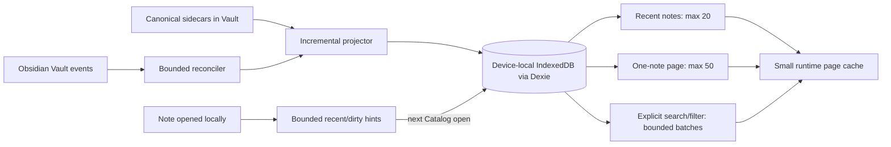

# Entire Vault demand-bounded local index and automated Gate

## Status

- Date: 2026-07-19
- Status: revised implementation-ready specification; runtime implementation has not started
- Current authorization: specification and local automated validation plan only; the 2026-07-19
  follow-up explicitly requires the plan to be revised before any implementation begins
- Explicit exclusion for the current work: no UI component, layout, copy, interaction, or styling
  changes
- Planned backend Slice: S35
- Deferred UI cutover: S36, requiring separate authorization

This focused specification is authoritative when it conflicts with the full-memory Vault-index
assumptions in:

- `docs/specs/2026-07-14-obsidian-annotation-plugin-design.md`, D-25 and Entire Vault;
- `docs/specs/2026-07-14-obsidian-annotation-plugin-execution-plan.md`, S07;
- `docs/specs/2026_07_15_refactor_to_preact.md`, R05/R06 and the 20k query Gate;
- `docs/delivery/slices/S07-vault-index/`, `R05-observable-index/`, and `R06-vault-preact/`.

It does not change canonical sidecar schemas, Current file behavior, annotation/Ink lifecycle,
Trash/garbage-collection policy, or existing UI in S35. The earlier documents remain the historical
record of the current implementation.

## Decision summary

`Entire Vault` means that a query can cover the whole Vault. It no longer means that every
annotation is restored into JavaScript memory or rendered by default.

The target behavior is:

1. Plugin startup does not open or rebuild the Vault index.
2. Opening `Entire Vault` without a query reads at most 20 recent note summaries from a device-local
   database.
3. Expanding one note reads at most 50 annotation rows through keyset pagination.
4. The rest of the Vault stays on disk until the user enters text or an explicit filter.
5. Search scans only the lightweight local projection in bounded database batches; it is cancellable
   and yields between batches.
6. Canonical sidecars remain the only authority. The local database is disposable and never
   synchronized through iCloud.
7. Runtime memory is proportional to the current page and a small cache, not to Vault size.
8. When the Catalog is closed, note-open and sidecar events do not open it; they enter bounded
   in-memory hint buffers and reconcile on the next explicit Catalog use.



## Problem statement

The current implementation bounds DOM nodes but not the data model.

`VaultAnnotationIndex` currently owns all list entries in a JavaScript `Map` and can retain several
additional O(N) representations:

- the primary `Map`;
- normalized search strings;
- the sorted snapshot;
- the searchable snapshot;
- facet arrays/maps;
- the last grouped query result.

`VaultIndexCache` serializes the whole projection to `.obsidian-annotations/v1/index.json`.
Restoring it parses the whole file and rebuilds the complete in-memory index. `VaultIndexBuilder`
also collects every projected entry in one array before replacing the index. `query()`,
`snapshot()`, facet calculation, selection hydration, rename, and some delete paths all assume a
full-memory collection.

The 20,000-entry evidence from S07/R05/R06 proves that the virtualized UI materializes few DOM rows
and that the current machine can search a 20k in-memory array quickly. It does not prove any of the
following:

- retained memory is independent of Vault size;
- CPU remains bounded at 100k or 1M annotations;
- opening the scope does not deserialize the complete projection;
- external changes update only affected records;
- the index cannot compete with Pencil input or other foreground work;
- a parseable `ink-summaries.json` is fresh relative to canonical surfaces.

This is the wrong resource model for a mobile-first plugin. Virtualizing the final DOM is not enough
when the data, search text, facets, and query result are still fully materialized before rendering.

## Current runtime baseline and frozen diagnosis

“Full rebuild” in the current implementation does not read every Markdown file and normally does not
read complete Ink vectors. It still rebuilds the complete derived Entire Vault collection from every
note that owns Inkstone sidecars, so its cost grows with the total annotated Vault rather than with
the current screen or changed source.

### Current trigger matrix

| Current trigger                                             | Current behavior                                                                                                 |
| ----------------------------------------------------------- | ---------------------------------------------------------------------------------------------------------------- |
| Plugin startup                                              | Does not rebuild by itself.                                                                                      |
| First switch to `Entire Vault` while its view is not fresh  | Restores the whole Vault `index.json` if available, then always starts one canonical full rebuild.               |
| Re-enter `Entire Vault` while the same view remains fresh   | Reuses the in-memory index.                                                                                      |
| External canonical create/modify/delete while scope is open | Coalesces events for 180 ms, then starts a full rebuild.                                                         |
| External canonical event while `Current file` is active     | Refreshes the current projection, marks the Vault index stale, and defers the rebuild until `Entire Vault`.      |
| Ordinary plugin-owned canonical write                       | Suppresses the matching file event and incrementally updates the ready in-memory index.                          |
| Markdown source delete/rename                               | Mutates the in-memory index directly and clears the monolithic cache; it does not immediately perform a rebuild. |
| Retry action                                                | Starts a full rebuild.                                                                                           |

The 180 ms timer is only a trailing debounce. It does not bound work for a long iCloud/Sync stream:
events spaced beyond the debounce window can repeatedly abort an in-progress build and restart it
from the root. An external Ink surface event also starts an affected-note summary rebuild without
awaiting it before the Vault-wide rebuild is scheduled, so both jobs may overlap.

### Current rebuild process and cost model

One rebuild currently:

1. lists every directory under `.obsidian-annotations/v1/notes/`;
2. reads each `meta.json` sequentially;
3. uses four note workers by default;
4. lists and reads every text annotation JSON for each discovered note;
5. reads one `ink-summaries.json` per note, falling back to canonical surface reads when that
   summary is absent or invalid;
6. accumulates every active entry in a new JavaScript array while the previous Map remains usable;
7. retries the whole scan once if an incremental index mutation supersedes it;
8. replaces the complete in-memory Map, rebuilds search strings/snapshots on demand, serializes the
   complete sorted projection, and rewrites Vault `index.json`.

For `D` sidecar note roots, `A` text-record files, and `E` active projected entries, a normal pass
is approximately `O(D + A)` storage operations plus `O(A + E log E)` main-thread decode/projection/
sorting work. Peak memory may simultaneously contain the old Map and its caches, the new entry
array, decoded records, the replacement Map, and the full JSON serialization string. This behavior
is the baseline S35 must remove, not optimize in place.

## First-principles constraints

| ID    | Constraint                                                                                                  |
| ----- | ----------------------------------------------------------------------------------------------------------- |
| EV-01 | Canonical sidecars are authoritative; every index/cache/database projection is disposable.                  |
| EV-02 | `Entire Vault` is a query scope, not an eager materialization contract.                                     |
| EV-03 | Default presentation is a bounded recent-note window, not a browse-all list.                                |
| EV-04 | Runtime memory must be O(current page + bounded batch + small LRU), not O(total annotations).               |
| EV-05 | IndexedDB owns persistent records, indexes, transactions, and ordered cursors; application code does not    |
|       | implement another general-purpose database.                                                                 |
| EV-06 | No index database or monolithic cache file is stored inside the Vault or synchronized through iCloud.       |
| EV-07 | Vault events accelerate convergence but are not the sole correctness mechanism.                             |
| EV-08 | Reconciliation reads file bodies only for sources whose identity or stat changed.                           |
| EV-09 | Every query has a hard page/batch limit, an `AbortSignal`, and a versioned cursor.                          |
| EV-10 | Ink input, Current file loading, and canonical persistence outrank search indexing and reconciliation.      |
| EV-11 | A local index failure may make Entire Vault temporarily unavailable; it must never block annotation or Ink  |
|       | creation, canonical saving, Current file, or recovery.                                                      |
| EV-12 | No full-text engine, Worker, WASM, or custom inverted index is added until the bounded database search Gate |
|       | proves it necessary.                                                                                        |
| EV-13 | S35 does not change the UI and must not ship a second production index alongside the current one.           |
| EV-14 | Opening a note or writing a canonical annotation must not open a closed Catalog solely to keep a derived    |
|       | projection warm.                                                                                            |

## Goals

- Define an asynchronous, page-oriented application port for recent notes, one-note rows, search,
  filters, and bounded facet suggestions.
- Store the derived projection in a device-local IndexedDB database using a mature wrapper.
- Make local canonical writes and external sidecar changes update only affected projections.
- Detect missed creates, modifications, deletions, and renames without parsing every unchanged
  sidecar.
- Make first build, repair, and schema replacement cancellable, resumable, and memory-bounded.
- Prove resource behavior at 20k and 100k scale in a real installed desktop Obsidian production
  host.
- Provide one automated local Gate command and machine-readable evidence.
- Preserve exact canonical-data safety and existing Current file behavior.

## Non-goals

- No UI changes in S35.
- No physical iPad session for S35; the acceptance Gate is local and automated.
- No canonical sidecar schema migration.
- No database file inside `.obsidian-annotations/`.
- No live SQLite database in the Vault.
- No native SQLite bridge, SQLite WASM/OPFS stack, server, telemetry, or remote search service.
- No fuzzy search, semantic search, OCR, handwriting recognition, or relevance-learning model.
- No custom token store or home-grown inverted index in the first implementation.
- No unbounded browse-all endpoint and no exact all-result count on the interactive query path.
- No automatic physical deletion of canonical records.
- No production dual-write to both the old in-memory index and the new database while UI still
  consumes only the old index.

## Terminology

### Canonical sidecar

The text annotation record or bounded Ink surface stored under `.obsidian-annotations/v1/notes/`. It
is the source of truth and participates in the user's existing Vault synchronization.

### Vault Catalog

The new application-facing name for the device-local, queryable projection. This avoids using
`Index` for both a product read model and a JavaScript container.

### Catalog Note

A note-level aggregate containing path, title, active annotation counts, problem counts, and recent
activity timestamps. It contains no array of all child entries.

### Catalog Entry

A lightweight text-annotation or Ink-surface row used for list display, structured filters, and
search. It never contains an Ink control trace, Brush Geometry, Canvas pixels, mask, or thumbnail
SVG.

### Source Stamp

The device-local observation of one sidecar path: kind, owning note/logical ID, `mtime`, size,
optional content digest, and projected revision.

### Reconciliation

A cold, cancellable comparison between the current sidecar inventory and Source Stamps. It parses
only new/changed sources and removes projections only after an inventory pass completed.

### Projection Epoch

A monotonically increasing database value changed by every committed Catalog mutation. Query cursors
are valid only for the epoch in which they were issued.

## Product data-access contract

### Default state: recent notes only

With no search text and no explicit filter:

- return at most 20 `CatalogNoteSummary` rows;
- sort descending by `activityAt`, then stable `noteId`;
- return no child annotation arrays;
- provide no cursor that can turn this into browse-all;
- do not calculate global facets or an exact annotation total;
- do not open or parse canonical sidecars merely to satisfy the query.

`activityAt` is the maximum of:

- `lastAnnotatedAt`, derived from active canonical annotations/Ink summaries; and
- `lastOpenedAt`, a device-local timestamp updated when the note is opened.

`lastOpenedAt` is disposable local state. It is not written into canonical sidecars and is not a
cross-device synchronization claim.

Opening a note while the Catalog database is closed records only a bounded 20-note in-memory hint.
It does not open IndexedDB. The hints are merged on the next explicit Catalog open; losing them in a
crash is acceptable because recency is not canonical data.

### Expanded note

Opening one recent/search result note group:

- returns at most 50 Catalog Entries;
- uses document-order keyset pagination `(position, rowId)`;
- never loads other notes;
- returns `nextCursor`/`hasMore`, not an array containing every child;
- invalidates the cursor with a typed `superseded` result if the Projection Epoch changes.

### Explicit Vault query

Non-empty normalized search text or at least one explicit filter enters query mode.

- Page size defaults to 30 and cannot exceed 50.
- The result is a flat bounded page plus note metadata needed to group that page.
- The default order is `updatedAt DESC, rowId DESC`.
- Pagination continues from the last scanned database key, not an integer offset.
- Exact total count is omitted. The response reports `hasMore` and scan progress.
- A query may return `partial` while a long on-demand scan continues; it must never pretend a
  partial page is a complete all-Vault result.
- A new query aborts the previous query before starting work.

### Facet suggestions

Facet discovery is also on demand and bounded:

- fixed enums (`type`, `status`, `conflict`) come from domain/schema definitions;
- styles come from plugin settings;
- note/folder/tag suggestions require a prefix and return at most 20 values;
- no method returns every note, folder, or tag as a runtime array;
- exact facet counts are not required on the interactive path.

### Bulk operations

Bulk actions operate on explicitly selected `(noteId, annotationId, expectedRevision)` snapshots.
There is no implicit `select all matching` that materializes every result. Existing revision-safe
canonical mutation rules remain unchanged.

### Runtime cache bounds

One Catalog instance may retain at most:

- 20 recent Catalog Note summaries;
- three entry/search pages, each no larger than 50 rows;
- one active database scan batch no larger than 128 rows;
- 20 pending recent-note hints;
- 256 Dirty Source Hint paths or one collapsed `needsReconcile` bit;
- query/filter/cursor metadata without duplicated annotation bodies.

Closing the scope clears pages and the active batch. An LRU eviction never writes canonical data and
never changes search correctness; an evicted page is read again from IndexedDB.

## Application ports

The UI-facing contract becomes asynchronous and page-oriented after the deferred S36 cutover:

```ts
interface VaultCatalogQueryPort {
  recentNotes(input?: {
    readonly limit?: number; // default 20, maximum 20
    readonly signal?: AbortSignal;
  }): Promise<RecentNotesResult>;

  entriesForNote(input: {
    readonly cursor?: CatalogCursor;
    readonly limit?: number; // default 30, maximum 50
    readonly noteId: string;
    readonly signal?: AbortSignal;
  }): Promise<CatalogEntryPage>;

  search(input: {
    readonly cursor?: CatalogCursor;
    readonly filters?: VaultCatalogFilters;
    readonly limit?: number; // default 30, maximum 50
    readonly signal?: AbortSignal;
    readonly text: string;
  }): Promise<VaultCatalogSearchPage>;

  suggestFacet(input: {
    readonly facet: 'folder' | 'note' | 'tag';
    readonly limit?: number; // maximum 20
    readonly prefix: string;
    readonly signal?: AbortSignal;
  }): Promise<readonly FacetSuggestion[]>;
}

interface VaultCatalogProjectionPort {
  applyTextRecord(record: TextAnnotationRecord, source: SourceObservation): Promise<void>;
  applyInkSummaries(input: InkSummaryProjection): Promise<void>;
  removeSource(input: SourceRemoval): Promise<void>;
  renameNote(input: NoteRenameProjection): Promise<void>;
  recordNoteOpened(noteId: string, openedAt: string): Promise<void>;
}

interface CatalogResultMeta {
  readonly freshness: 'current' | 'reconciling' | 'stale';
  readonly projectionEpoch: number;
}
```

There is intentionally no `snapshot()`, synchronous `query()`, `rebuild(entries[])`, or
`facets(): all values` method.

Every public limit is validated. A caller cannot request `Number.MAX_SAFE_INTEGER`, omit an internal
scan batch limit, or reinterpret a search cursor under different query text/filters.

## Database decision

### Selected baseline

Use IndexedDB through Dexie in `src/storage/`.

IndexedDB supplies persistent keyed records, secondary indexes, ordered cursors, and atomic
transactions. Dexie supplies declarative schema versions, compound/multi-entry indexes,
transactions, bulk operations, and browser implementation workarounds. This is narrower and less
error-prone than extending the project's thin Ink Draft adapter into a second general-purpose
database layer.

The implementation spike must pin an exact audited Dexie 4.x version. The current candidate is
4.4.x. Only the core `dexie` package is allowed; Dexie Cloud, React hooks, sync, observability, and
network addons are out of scope.

### Alternatives

| Alternative                         | Decision | Reason                                                                                   |
| ----------------------------------- | -------- | ---------------------------------------------------------------------------------------- |
| Full JavaScript `Map`               | Reject   | O(Vault) retained memory and repeated O(N) caches/results.                               |
| Vault `index.json`                  | Retire   | Whole-file parse/rewrite, iCloud churn, stale-cache ambiguity, and no query paging.      |
| Raw IndexedDB throughout production | Reject   | Recreates schema, transaction, upgrade, cursor, and browser-workaround infrastructure.   |
| Native SQLite                       | Reject   | Not a portable Obsidian mobile plugin primitive and would require an unavailable bridge. |
| SQLite WASM/OPFS                    | Reject   | Adds WASM/Worker/filesystem complexity before evidence requires it.                      |
| FlexSearch persistent index         | Defer    | Adds a second index lifecycle; permit only after the bounded 100k search Gate fails.     |
| Custom inverted/token index         | Reject   | Reimplements a search database and increases write/storage amplification.                |

Dexie is not canonical storage. If the dependency cannot pass the production Obsidian spike, mobile
bundle scan, blocked-upgrade test, and resource Gate, the fallback is a small storage adapter over
native IndexedDB behind the same ports—not a return to the full-memory model.

## Local database placement and lifecycle

- Database family: `inkstone-vault-catalog-v1`.
- The database is device-local browser storage, separate from `inkstone-annotations-drafts-v1`.
- It must be scoped to one Vault through a `VaultLocalIdentityPort`; the desktop implementation may
  hash a gated `FileSystemAdapter.getBasePath()`, while mobile/other adapters use a persistent local
  namespace and validate a stored Vault fingerprint.
- Raw Vault paths or annotation text must not appear in the database name.
- A fingerprint mismatch fails closed and creates a fresh derived database; it never serves another
  Vault's projection.
- Constructing plugin services does not open the database. Only explicit Catalog use, repair, or an
  already-open Catalog transaction may access it.
- Canonical and external events received while the database is closed enter a bounded Dirty Source
  Hint set. The set holds at most 256 normalized paths; overflow collapses to one `needsReconcile`
  bit. Neither case opens IndexedDB.
- Closing/switching away from Entire Vault clears page/search caches immediately and closes the
  Dexie connection after at most a 30-second idle grace period. The grace period retains no full
  Catalog arrays.
- `onunload` closes the Dexie connection and cancels all query/reconcile work.
- A `versionchange`/blocked upgrade closes the old connection; the Catalog reports unavailable
  rather than leaving a half-upgraded instance.
- Because the database is derived, schema changes do not perform unbounded in-place data migration.
  A new schema uses a new database generation and rebuilds lazily from canonical sources. The old
  generation is deleted only after the new generation is usable.

## Database schema v1

Schema notation below uses Dexie syntax. Exact TypeScript names may change during the S35.0 spike,
but key order and query purpose are frozen.

```ts
db.version(1).stores({
  meta: '&key',
  notes:
    '&noteId, &filePath, [activityAt+noteId], [lastAnnotatedAt+noteId], folder, titleNormalized',
  entries:
    '++rowId, &[noteId+annotationId], [noteId+position+rowId], [updatedAt+rowId], ' +
    'filePath, folder, type, status, styleId, conflict, *tagsNormalized',
  sources: '&sidecarPath, [noteId+kind+logicalId], noteId, kind, projectedRevision',
});
```

### `meta`

Required keys:

- `schemaVersion`;
- `vaultFingerprint`;
- `projectionEpoch`;
- `lastCompletedReconcileEpoch`;
- `lastCompletedReconcileAt`;
- `reconcileState` (`idle` or an interrupted run descriptor);
- `databaseGeneration`;
- `cleanShutdown`.

`cleanShutdown` is a reconciliation hint, not a transaction log. A false value may schedule an
earlier inventory pass; it cannot make canonical data invalid.

### `notes`

```ts
interface CatalogNoteRow {
  readonly activityAt: string;
  readonly annotationCount: number;
  readonly conflictCount: number;
  readonly filePath: string;
  readonly folder: string;
  readonly inkCount: number;
  readonly lastAnnotatedAt: string;
  readonly lastOpenedAt?: string;
  readonly noteId: string;
  readonly problemCount: number;
  readonly textCount: number;
  readonly title: string;
  readonly titleNormalized: string;
}
```

No note row embeds child Catalog Entries. Counts are updated in the same IndexedDB transaction as
the affected entry set. When removal affects a maximum timestamp, the new maximum is read through
the note/updated index rather than loading all child entries.

### `entries`

```ts
interface CatalogEntryRow {
  readonly annotationId: string;
  readonly body?: string;
  readonly conflict: 0 | 1;
  readonly filePath: string;
  readonly folder: string;
  readonly headingPath?: readonly string[];
  readonly noteId: string;
  readonly position: number;
  readonly quote: string;
  readonly revision: number;
  readonly rowId?: number;
  readonly searchTextNormalized: string;
  readonly status: AnnotationIndexStatus;
  readonly strokeCount?: number;
  readonly styleId?: string;
  readonly styleName?: string;
  readonly tags: readonly string[];
  readonly tagsNormalized: readonly string[];
  readonly type: 'highlight' | 'ink' | 'note' | 'underline';
  readonly updatedAt: string;
}
```

Forbidden fields include:

- `points` or Brush Control Trace;
- contours, polygons, masks, meshes, geometry digests, or Canvas pixels;
- `thumbnailSvg` or other preview markup;
- complete canonical records not needed for list/search;
- a precomputed array of tokens/ngrams.

`searchTextNormalized` preserves current case-insensitive NFKC substring semantics without building
an inverted index. It is computed once when projecting a changed record and stored on disk. Its
fields are quote, optional body, file path, tags, style name/ID, Ink heading, type, status, and
conflict label.

### `sources`

```ts
interface CatalogSourceRow {
  readonly contentDigest?: string;
  readonly kind: 'ink-summary' | 'ink-surface' | 'meta' | 'text-record';
  readonly logicalId: string;
  readonly mtime: number;
  readonly noteId: string;
  readonly projectedRevision?: number;
  readonly sidecarPath: string;
  readonly size: number;
}
```

Source Stamps permit deletion, rename, and missed-event detection without retaining a JavaScript
path map. A reconcile pass ordered-merges one completed Vault directory listing with a database
Source cursor; unchanged stamps are compared but not rewritten. Digest calculation is conditional:

- unchanged `(mtime, size)` skips body read;
- changed stat reads and parses the source;
- same stat with suspicious lifecycle evidence may compare a content digest;
- an unavailable/unhydrated source is retained as unknown and is never interpreted as deleted.

## Query execution

### Keyset pagination

Integer offsets are forbidden because deep offsets are O(N) and unstable under mutation. Cursors
contain:

- schema version;
- Projection Epoch;
- normalized query/filter digest;
- driver index and direction;
- last scanned compound key.

The cursor is opaque to callers and validated before use. A mismatched epoch/query returns
`superseded`; it never silently skips or duplicates rows under another query.

### Bounded search algorithm

The baseline search is a bounded IndexedDB scan, not an in-memory rebuild:

1. Normalize query text once with NFKC and locale-independent lowercase rules.
2. Use `[updatedAt+rowId]` descending as the single Vault-search driver so ordering and cursors stay
   deterministic. Apply text and structured filters within each bounded batch; do not implement a
   custom cost-based query planner.
3. Read at most 128 lightweight Catalog Entry rows in one transaction.
4. Apply remaining structured predicates and `searchTextNormalized.includes(needle)`.
5. Append matches only until the requested page is full.
6. Close the transaction, check `AbortSignal` and Projection Epoch, then yield to the host.
7. Continue from the last scanned key only when another batch is necessary.
8. Return a cursor containing the last scanned key and whether more source rows may exist.

`entriesForNote` separately uses `[noteId+position+rowId]`; bounded facet suggestions use their
declared tag/note/folder indexes. These endpoints do not change the Vault-search driver.

No transaction is held open across a timer/rAF yield. A production `toArray()` is allowed only after
a statically visible `limit()` no greater than 128. Unbounded `toArray()`, `sortBy()`, `snapshot()`,
`getAll()`, `keys()`, or `primaryKeys()` over Catalog tables is prohibited.

### Search accelerator decision Gate

Do not add FlexSearch in S35 by default. First run the real-host 100k Gate below.

A persistent full-text accelerator may be proposed later only if all are true:

- worst-case explicit search exceeds the total-latency budget after database/query tuning;
- main-thread slice and memory budgets already pass;
- a production Obsidian spike proves persistent IndexedDB operation and CJK behavior;
- it remains lazy, returns bounded numeric IDs, and hydrates rows from Dexie;
- it never stores canonical Ink vectors or becomes required for correctness;
- it has a bounded repair story and does not add a synchronous write to canonical mutation paths.

WASM or a main-thread search engine is not an acceptable response to a reconciliation, persistence,
or compositor bottleneck.

## Incremental projection

### Target execution matrix

The implementation must distinguish path-level projection, inventory reconciliation, and full
canonical rebuild. They are different operations and must have different triggers.

| Target trigger/state                                                      | Required operation                                                                                                                      | Full inventory allowed   | Full canonical rebuild allowed |
| ------------------------------------------------------------------------- | --------------------------------------------------------------------------------------------------------------------------------------- | ------------------------ | ------------------------------ |
| Plugin startup or ordinary note open while Catalog is closed              | Record only bounded in-memory session/hint state.                                                                                       | No                       | No                             |
| Local canonical write while Catalog is closed                             | Add one normalized Dirty Source Hint, or collapse overflow to `needsReconcile`.                                                         | No                       | No                             |
| First Catalog use with a valid database in a new plugin session           | Open the database, flush retained hints, then run a bounded changed-only inventory to cover the offline interval; remain `reconciling`. | Yes                      | No                             |
| Ordinary known-path create/modify/delete/rename while Catalog is open     | Coalesce and apply only the affected path/logical source set transactionally.                                                           | No                       | No                             |
| Long external event stream                                                | Maintain one active worker and a follow-up dirty generation; never restart a root scan solely because another event arrived.            | Only if already required | No                             |
| Dirty Hint overflow, unknown root/meta lifecycle event, or unclean resume | Set `needsReconcile`; run changed-only inventory only on the next explicit/open Catalog work opportunity.                               | Yes                      | No                             |
| Missing database or new database generation                               | Stream canonical sources into bounded database transactions.                                                                            | Yes                      | Yes                            |
| Fingerprint mismatch, corrupt/unsupported schema, proven invariant break  | Fail closed and build a fresh disposable generation without serving the suspect generation.                                             | Yes                      | Yes                            |
| Explicit user Repair/digest audit                                         | Read canonical sources in bounded batches and replace or repair the disposable generation.                                              | Yes                      | Yes                            |

“Full inventory” lists paths and compares Source Stamps; it parses only new or changed bodies. “Full
canonical rebuild” reads canonical bodies and reconstructs a new database generation. An ordinary
event, query failure, stale Ink summary, note rename, or scope switch may never be promoted from the
first category into the second merely as an implementation shortcut.

### Local canonical writes

After a canonical sidecar write succeeds:

1. publish a lightweight canonical projection event;
2. if the Catalog is closed, add the path to bounded Dirty Source Hints and stop;
3. if the Catalog is already open, enqueue a device-local Catalog transaction asynchronously;
4. read the existing projected row by indexed identity;
5. reject an older revision and make an identical revision idempotent;
6. upsert/remove the one Catalog Entry and Source Stamp;
7. update the owning Catalog Note aggregate;
8. increment Projection Epoch once;
9. notify query subscribers with an invalidation/version, not a full snapshot.

Canonical success never waits for the Catalog. Catalog failure is logged as a privacy-safe error and
marks the local projection stale. It cannot roll back or report failure for the canonical operation.

### External sidecar events

Create/modify/delete/rename events under the canonical sidecar root are coalesced by normalized path
for 250 ms. Each affected path runs one of:

- create/modify: stat, compare Source Stamp, parse only if changed, project transactionally;
- delete: remove the exact Source Stamp, then reproject its indexed `(noteId, kind, logicalId)`
  source set; remove the Catalog Entry only when no active canonical candidate remains;
- note rename/lifecycle event: update the note and its entries through the `noteId` index in bounded
  database batches;
- summary/surface event: refresh only the affected note's Ink projections.

The event stream is an accelerator. Missing an event does not permanently lose the change because
reconciliation compares the inventory later.

Conflict siblings are separate Source Stamps that may project one logical Catalog Entry. Deleting
one sibling cannot remove the logical row while another active/divergent candidate remains. Deleting
`ink-summaries.json` removes only that derived hint stamp and schedules affected-note
reconciliation; it never deletes canonical surface entries. Meta/root deletion follows the existing
source-note lifecycle service rather than guessing from one missing child.

When the Catalog is closed, the coalescer writes only Dirty Source Hints. On the next explicit open,
hints are applied before the first result can be labelled fresh. If hints overflowed or were lost on
restart, the result exposes `freshness: 'reconciling'` until a completed inventory pass converges.
The Catalog must not present stale cached rows as proven current.

### Ink projection correctness

`ink-summaries.json` remains a disposable hint, not authority. The current schema does not prove
that a parseable summary set matches every current canonical surface revision.

Therefore:

- a local canonical Ink write may project its freshly committed `InkSurfaceSummary` directly;
- an external `surfaces/<id>.json` event parses that affected surface and replaces its projection;
- an `ink-summaries.json` event may accelerate a note refresh but cannot suppress a newer observed
  surface Source Stamp;
- first build/repair may parse canonical surfaces one at a time when freshness cannot be proven;
- canonical surface objects and thumbnail geometry are released after each bounded batch and never
  accumulated in the Catalog.

Adding a source-set digest to a future summary schema is a separate optimization decision, not a
prerequisite for S35 correctness.

## Reconciliation

### Triggers

Reconciliation may run only after one of:

- first explicit Entire Vault/Catalog use on a missing database;
- first explicit Catalog use in a new plugin session when the database predates that session, so
  changes made while the plugin was not observing Vault events can converge;
- Catalog work after an unclean shutdown, background/resume gap, Dirty Hint overflow, or an
  unclassifiable root/meta lifecycle event set `needsReconcile`;
- explicit repair command;
- database schema generation replacement.

An ordinary burst containing known canonical child paths does not trigger a Vault-wide inventory;
those paths use incremental projection. Resume/startup may set an in-memory requirement, but neither
opens IndexedDB nor starts inventory until explicit Catalog use. Reconciliation never runs
synchronously during plugin startup.

### Coalescing and restart policy

- At most one projector/reconciler task owns the Catalog write lane.
- Known paths are normalized and coalesced by final observed path state. A delete followed by a
  recreate is resolved by stat/parse of the final state, not by blindly replaying both events.
- Events arriving during reconciliation enter a bounded next-generation Dirty Source set. They do
  not cancel and restart the root inventory.
- If an event affects a directory whose completed listing was already processed in the current
  epoch, only that path or directory is queued for a follow-up pass.
- Closing the Catalog cancels after the current bounded transaction, persists no unbounded work
  queue, and collapses remaining uncertainty into bounded hints/`needsReconcile`.
- Query cancellation and reconciliation cancellation are separate. Starting a new search may abort
  the old search, but it may not restart canonical inventory.

### Inventory protocol

1. Allocate a reconcile epoch and store `reconcileState: running`.
2. Obtain one complete non-recursive listing of the canonical note-root directories. A failed or
   unavailable listing proves no deletion.
3. Ordered-merge that sorted listing with the database cursor for note-root/meta Source Stamps;
   process additions and only deletions proven by the complete listing.
4. For each present note root, obtain one complete child listing and ordered-merge it with that
   note's Source cursor.
5. Stat each present source; parse only a missing/changed Source Stamp and do not write an unchanged
   stamp.
6. Apply child deletion only after that exact note directory listing completed successfully.
7. Process at most 100 sources or 8 ms of main-thread work per batch, then yield and check
   cancellation, background, Vault close, memory pressure, and foreground Ink activity.
8. Commit `lastCompletedReconcileEpoch/At` only after every note directory completed, then clear the
   running state.

An interrupted pass leaves every unprocessed directory unchanged. It may retain already applied
additions/changes and exact deletions proven by a completed directory listing; it never performs a
global speculative deletion sweep. Restarting repeats from canonical inventory. Progress is a hint,
not a recovery journal.

Obsidian's `DataAdapter.list()` returns one non-recursive directory listing as an array. The adapter
may therefore transiently hold O(annotated note directories) paths for the note root; S35 must not
copy that array into another all-Vault structure, must release it after the ordered merge, and must
report its peak in the Gate. No annotation-entry body array is permitted.

### Full rebuild

Full canonical rebuild is reserved for:

- no local database;
- Vault fingerprint mismatch;
- unsupported/corrupt database schema;
- explicit repair;
- a proven invariant violation.

It is not the normal response to one sidecar event, one failed query, one note rename, or one stale
summary. Rebuild streams directly into bounded database transactions and never creates an
`AnnotationIndexEntry[]` for the whole Vault.

A valid existing Catalog is never deleted merely because a reconciliation was interrupted. A fresh
generation becomes eligible to replace the previous one only after its initial canonical pass
finishes and its Vault fingerprint/schema metadata validate. Until then, the previous generation is
either served as explicitly stale/reconciling or the Catalog is reported unavailable; no partial
generation is labelled current.

## Scheduling and foreground protection

Work priority is fixed:

1. Active Pencil/mouse contact and Canvas frame submission;
2. Current file read/render and canonical persistence;
3. explicit user Catalog query;
4. local canonical projection events;
5. external-event reconciliation;
6. full repair/rebuild.

Background Catalog work must pause within one animation frame when Ink contact becomes active and
may resume only after at least 250 ms without contact/frame debt. On mobile-equivalent settings,
sidecar read concurrency is one; desktop default is two. IndexedDB write batches are serialized per
database, but canonical writes never wait for them.

An explicit search may continue while the sidebar is active, but it still obeys 8 ms CPU slices,
cancellation, and the existing Ink frame budgets.

Catalog result envelopes include `freshness: 'current' | 'reconciling' | 'stale'`. Only a complete
Dirty Source Hint flush plus a valid completed reconcile epoch can report `current` after an unclean
shutdown or hint overflow.

`current` means current relative to all observed Vault events and the latest successful path/stat
inventory. It is not proof that iCloud has synchronized or that a provider did not replace bytes
while preserving both `mtime` and size. An explicit repair performs a full content read/digest when
that stronger check is required.

## Failure policy

| Failure                             | Required behavior                                                                          |
| ----------------------------------- | ------------------------------------------------------------------------------------------ |
| IndexedDB unavailable/quota         | Current file and canonical writes continue; Entire Vault reports local index unavailable.  |
| Dexie open/upgrade blocked          | Close stale connection; retry or create a fresh derived generation; no canonical mutation. |
| Corrupt Catalog row                 | Quarantine/replace affected projection when possible; otherwise rebuild derived database.  |
| Sidecar parse failure               | Keep prior projection marked stale/problematic; never invent a deletion.                   |
| Unhydrated/permission-denied source | Preserve Source Stamp and projection as unknown; retry later.                              |
| Interrupted inventory               | Keep unprocessed rows; only completed-directory comparisons may apply exact deletions.     |
| Stale query cursor                  | Return `superseded`; caller restarts.                                                      |
| Catalog projection event failure    | Mark Catalog stale and retry cold; canonical success remains success.                      |
| Database deletion                   | Rebuild lazily from canonical sidecars.                                                    |
| Old Vault `index.json` present      | Ignore it after cutover; it never seeds the new database.                                  |

Diagnostics may contain counts, durations, batch sizes, schema/generation IDs, error classes, and
digests. They must not contain annotation body, quote, Ink points, thumbnail markup, or full source
path unless the user explicitly exports a repair report.

## Migration and cutover

### S35 backend qualification

S35 builds the new ports, database adapter, projection/reconciliation services, and local Gate
behind tests or an unpublished local-Gate build flag. Production UI continues using the current
index during this Slice. The new engine is not wired as a second always-on production index.

### Deferred S36 UI cutover

S36 is separately authorized work and will:

- adapt the existing Entire Vault view to async recent/search pages;
- preserve existing visual design unless a later UI specification changes it;
- replace selection/facet code that calls `snapshot()`;
- switch canonical projection events to the Catalog;
- remove `VaultAnnotationIndex`, `VaultIndexBuilder`, and `VaultIndexCache` production wiring;
- stop writing `.obsidian-annotations/v1/index.json`;
- best-effort delete the known derived `index.json` after successful cutover, without touching
  canonical note directories;
- keep Current file direct from canonical repositories.

The cutover is atomic at the product architecture level. A permanent feature flag or two production
indexes is prohibited.

## Local automated validation Gate

### Single command

The implementation must add:

```bash
npm run gate:vault-catalog-local
```

The command must:

1. run focused unit/repository/static-bound checks;
2. create an owned disposable test Vault and deterministic Catalog fixtures;
3. build the current production plugin with an unpublished Catalog-Gate flag;
4. install it into the owned Vault;
5. launch/reload and control real desktop Obsidian using the existing local-Gate orchestration;
6. seed/query the production Dexie adapter inside the Obsidian host;
7. capture raw JSON and host/resource samples;
8. analyze every fixed budget automatically;
9. emit build, implementation, fixture, protocol, and schema digests;
10. write PASS/FAIL plus a Source Manifest under
    `docs/delivery/slices/S35-vault-catalog-local-gate/`.

Vitest/jsdom/fake-indexeddb results are necessary but cannot alone pass the production-host Gate. No
physical iPad run is required for S35.

### Fixtures

| Fixture           | Purpose                                                                                     |
| ----------------- | ------------------------------------------------------------------------------------------- |
| correctness-small | CJK/Unicode paths, duplicate quotes, tags, conflicts, tombstones, rename, missing source.   |
| canonical-20k     | 100 notes, 10k text records, 10k minimal Ink surfaces/summaries through production readers. |
| catalog-100k      | 5,000 notes × 20 mixed lightweight entries through production projection/database ports.    |
| deep-note-10k     | One note with 10k entries proving child pagination remains bounded.                         |
| delta-1-percent   | 1% create/modify/delete/rename change set over an existing inventory.                       |
| event-stream      | Spaced sync events, duplicate paths, delete/recreate, and changes during reconciliation.    |
| query-churn       | 100 successive CJK/Latin searches, cancellation, filters, and scope close/reopen.           |
| ink-interference  | Background reconcile/search while deterministic production-Canvas writing is captured.      |

The 100k fixture may seed the derived database through production projection ports to avoid creating
100k physical files. The 20k fixture must use real canonical sidecar files and production
repositories so projection correctness is not replaced by database-only evidence.

### Required instrumentation

- IndexedDB open count and timing;
- sidecar inventory stat count and body-read count;
- path-projection, inventory-start/complete/abort, full-rebuild, and root-restart counts;
- rows visited, rows materialized, batch size, yield count, and cancellation latency;
- main-thread task durations;
- query total latency and time to first page;
- JS heap before open, after recent page, after search, after close/idle;
- database/storage estimate where the host exposes it;
- Projection Epoch and cursor invalidation outcomes;
- Ink input-handler, frame-work, and input-to-submit spans during interference;
- raw canonical hashes before/after database deletion/rebuild.

### Fixed budgets

| Budget                                | PASS condition                                                                                  |
| ------------------------------------- | ----------------------------------------------------------------------------------------------- |
| Startup isolation                     | 0 Catalog IndexedDB opens and 0 sidecar index reads before explicit Catalog use/repair.         |
| Recent-note materialization           | At most 20 note rows and 0 entry rows; P95 query ≤ 50 ms.                                       |
| One-note page                         | At most 50 returned rows; no batch > 128; P95 ≤ 75 ms.                                          |
| Search batch                          | At most 128 visited rows or 8 ms CPU before yielding.                                           |
| Search long task                      | No Catalog main-thread task ≥ 50 ms.                                                            |
| Search cancellation                   | Previous query stops within 50 ms after abort/new query.                                        |
| Common 100k search first page         | P95 ≤ 250 ms for a query matching at least one row in the newest 10% of the driver order.       |
| Worst-case 100k absent/CJK-tail query | Completes within 5 s; no long-task violation.                                                   |
| Query result memory                   | At most three 50-row pages plus one 128-row batch and bounded note metadata.                    |
| Recent-page heap delta                | ≤ 8 MiB over pre-open idle checkpoint.                                                          |
| Search-page heap delta                | ≤ 16 MiB over pre-open idle checkpoint after one completed page.                                |
| Vault-size retained-heap slope        | 100k post-close/idle retained heap is ≤ 20k retained heap + max(4 MiB, 10%).                    |
| Inventory transient memory            | One note-root listing + one child listing + one 100-row batch; additional heap ≤ 8 MiB.         |
| No-op reconcile writes                | 0 note/entry/source row writes and 0 body reads; only run-state metadata may change.            |
| Ordinary external path event          | 0 Vault-wide inventories/rebuilds; read only the affected source set and conflict siblings.     |
| Same-session retained hint flush      | Without overflow/uncertainty, 0 Vault-wide inventories; read only hinted source bodies.         |
| Long external event stream            | One active write lane; 0 root-scan restarts caused solely by later events.                      |
| Explicit digest repair                | Detects preserved-stat byte replacement in bounded 100-source/8 ms batches.                     |
| Incremental reconcile body reads      | For 1% delta, reads ≤ changed sources + 1% fixed verification allowance; unchanged bodies skip. |
| Reconcile scheduling                  | Concurrency 1 mobile-equivalent/2 desktop; batch ≤ 100 sources or 8 ms before yield.            |
| Interrupted reconciliation            | Performs no speculative/global deletion and preserves every unprocessed directory.              |
| Ink interference                      | Background work pauses within one frame; existing S27 local input/frame budgets remain PASS.    |
| Canonical safety                      | DB clear/rebuild changes 0 canonical sidecar bytes.                                             |
| Storage amplification                 | Catalog database ≤ 4× serialized lightweight projection bytes for the 100k fixture.             |
| Production query bounds               | Static guard finds no unbounded Catalog `toArray/getAll/sortBy/keys/primaryKeys/snapshot`.      |

Absolute desktop timings are qualification limits for the owned local environment, not a claim about
every device. The structural limits—page size, batch size, zero eager startup work, cancellation,
memory slope, sidecar read amplification, and canonical safety—are release invariants.

Latency distributions use at least five deterministic repetitions after one separately reported cold
run. Heap checkpoints are sampled after the same idle/quiescence protocol in every condition; the
report must state whether host GC was requested or only natural idle collection was available. A
Gate cannot selectively discard a slow or high-memory repetition.

### Gate artifacts

```text
docs/delivery/slices/S35-vault-catalog-local-gate/
  README.md
  raw/capture.json
  results.json
  performance.md
  test-results.md
  risk-register.md
  source-manifest.md
```

`results.json` must include per-budget actual/limit/status, dataset cardinalities, host/Obsidian
versions, database/Dexie versions, and all required digests. A failed run remains evidence and is
not overwritten by a later pass.

## Execution hold point

This plan revision completes the currently authorized work. S35.0 begins only after a later explicit
implementation instruction. Until then, do not add Dexie/fake-indexeddb, create runtime ports, wire
a Gate flag, modify `main.ts`, create a database, or change the UI.

## TDD task breakdown

Every implementation step follows one failing observable test, minimum implementation, green
verification, then refactor. Mock only database/Vault/clock/scheduler boundaries.

### S35.0 — Dependency and production-host feasibility spike

Deliverables:

- add and pin the minimal Dexie core dependency in the spike branch;
- prove injected `indexedDB`/`IDBKeyRange` works with fake-indexeddb;
- prove create/open/transaction/compound-index/multi-entry/versionchange/close/delete inside the
  real installed Obsidian Gate host;
- measure production bundle gzip delta;
- define and test `VaultLocalIdentityPort` including cross-Vault mismatch rejection;
- record why Dexie is accepted or fall back to a thin native adapter behind the same port.

Exit:

- no UI or `main.ts` production wiring;
- mobile import scan passes;
- real-host database smoke passes;
- dependency decision and measurements are recorded.

### S35.1 — Page-oriented domain/application contract

Deliverables:

- define Catalog Note/Entry DTOs, limits, filters, result states, typed cursors, and errors;
- define query/projection/inventory/scheduler ports;
- test hard limit validation, cursor query digest, epoch invalidation, and immutable page results;
- remove any need for `snapshot()` from the new port.

Exit:

- all behavior can be tested against an in-memory fake port without importing DOM/Obsidian/Dexie;
- no method can request or return the complete Catalog.

### S35.2 — Dexie Catalog repository

Deliverables:

- implement schema v1 and typed storage adapter;
- implement recent-note query, note-entry keyset page, bounded facet suggestions, and transactions;
- implement exact upsert/remove/rename/note-aggregate updates;
- implement database generation, close/versionchange/quota/corruption handling;
- add the static production-query bound checker.

Tests:

- compound/multi-entry index behavior;
- 20/50/128 caps;
- no cross-note or cross-Vault leakage;
- revision stale/identical/divergent cases;
- quota, abort, blocked upgrade, deletion, and rebuild;
- no Ink vectors/thumbnail SVG in stored rows.

Exit:

- fake-indexeddb repository contract passes;
- delete/recreate produces an empty disposable Catalog without touching fixture sidecars.

### S35.3 — Incremental projector and reconciler

Implementation order inside this Slice is fixed as four vertical TDD cycles; they are not one
horizontal “write all tests, then all services” batch:

1. **S35.3a — Closed-Catalog hints and coalescer.** Prove zero IndexedDB opens, 256-path overflow,
   final-state path coalescing, and one dirty follow-up generation.
2. **S35.3b — Exact path projector.** Prove local/external create, update, tombstone, physical
   delete, rename, and conflict-sibling behavior without any Vault-wide inventory.
3. **S35.3c — Completed-directory reconciler.** Prove changed-only parsing, exact deletion only
   after a successful listing, interrupted-pass safety, cross-session convergence, and no-op zero
   writes/body reads.
4. **S35.3d — Scheduler integration.** Prove one write lane, no root restart under a long event
   stream, foreground Ink pause, scope-close cancellation, and freshness transitions.

Deliverables:

- project text records and Ink summaries after canonical success;
- coalesce external sidecar events by path;
- buffer at most 256 Dirty Source Hints and 20 recent-note hints without opening a closed database;
- implement Source Stamps, completed-directory ordered merge, changed-only parsing, and exact
  deletion detection without rewriting unchanged stamps;
- implement note rename/source-missing updates by indexed batches;
- integrate foreground priority/Ink pause signals through an application scheduler port;
- preserve parse/unhydrated failures as stale/unknown rather than deletion.

Tests:

- create/update/tombstone/physical delete/rename/conflict for text and Ink;
- deleting one conflict sibling preserves/reprojects the logical row, and deleting
  `ink-summaries.json` removes no canonical surface row;
- missed event discovered by reconciliation;
- changed stat parsed, unchanged stat skipped;
- no-op reconciliation performs zero note/entry/source row writes and zero body reads;
- explicit digest repair detects a same-size/preserved-mtime byte replacement;
- interrupted pass cannot delete from an unprocessed/failed directory;
- event arriving during reconciliation supersedes older projection safely;
- a sustained event stream does not abort/restart root inventory and rechecks only affected
  paths/directories after the current epoch;
- one external Ink surface change cannot leave a stale summary row indefinitely;
- canonical writes are not awaited on Catalog completion;
- closed-Catalog events perform zero IndexedDB opens, hint overflow sets one reconcile bit, and the
  next explicit open converges before reporting `freshness: 'current'`.

Exit:

- a 1% delta causes O(delta) body reads;
- no full rebuild on an ordinary event;
- no runtime wiring that duplicates the current production index.

### S35.4 — On-demand bounded search

Deliverables:

- implement NFKC normalized search projection;
- implement the fixed updated-time search driver, 128-row database batches, keyset continuation,
  yielding, progress, and cancellation;
- implement result-page grouping metadata without full result arrays;
- implement long-query supersession on Projection Epoch change;
- add a benchmark that determines whether a search accelerator is necessary.

Tests:

- CJK, case, Unicode normalization, quote/body/path/tag/style/type/status search parity;
- combined filters;
- match at beginning/middle/end and absent query;
- cancellation between every batch boundary;
- mutation during scan returns `superseded`;
- no exact total/full facet/full snapshot allocation;
- 20k and 100k resource budgets.

Exit:

- baseline Gate passes, or a separate evidence-backed accelerator proposal is written before any
  FlexSearch/Worker/WASM implementation.

### S35.5 — Real Obsidian local Gate and evidence

Deliverables:

- implement `npm run gate:vault-catalog-local`;
- reuse owned-Vault launch/reload/foreground orchestration from the S27 local Gate;
- generate deterministic 20k canonical and 100k Catalog fixtures;
- capture raw host/query/memory/read-amplification/Ink-interference evidence;
- emit PASS/FAIL, reports, and Source Manifest.

Exit:

- every fixed budget has machine-readable evidence;
- full `npm run check`, mobile bundle scan, and the real-host Gate pass;
- failures remain recorded;
- no physical iPad or UI modification is required.

### S36 — Deferred UI cutover and legacy removal

This Slice is specified only to make the migration boundary explicit. It is not authorized by the
current request.

- consume async recent/search pages in the existing visual shell;
- replace full snapshot selection/facets;
- atomically switch production projection wiring;
- remove old in-memory index/cache/builder and Vault `index.json` writes;
- add local UI behavior tests and a separate acceptance decision.

## Acceptance criteria

- Entire Vault default data access returns no more than 20 recent note summaries.
- Non-recent notes do not enter runtime memory until an explicit query/filter or note expansion
  needs them.
- No production API exposes a full Catalog snapshot.
- Runtime memory slope between 20k and 100k satisfies the fixed Gate.
- Search, paging, and reconcile are cancellable and use bounded database batches.
- Startup does not open/rebuild the Catalog or read its sidecars.
- Local canonical mutation never waits before reporting canonical success; it updates an already
  open Catalog asynchronously or records a bounded Dirty Source Hint while closed.
- Opening notes and receiving sidecar events while the Catalog is closed perform zero Catalog
  IndexedDB opens.
- An ordinary known-path external event performs zero Vault-wide inventories and zero full canonical
  rebuilds.
- A sustained external event stream does not restart root inventory; it converges through one
  bounded follow-up dirty generation.
- Missed create/modify/delete/rename events with an observable path/stat delta converge through
  changed-only reconciliation; explicit digest repair covers preserved-stat replacement.
- A no-change reconciliation rewrites no Catalog Note/Entry/Source rows and reads no sidecar bodies.
- An interrupted inventory cannot remove valid projections.
- Ink summaries cannot remain trusted solely because `ink-summaries.json` is parseable.
- Clearing/corrupting/replacing the local database changes no canonical bytes and loses no
  annotation data.
- Current file and Ink remain usable when the Catalog database fails.
- A stale/reconciling Catalog is labelled explicitly and cannot claim `freshness: 'current'` until
  pending hints and required inventory work complete.
- No derived Catalog/index file is written into the Vault after S36 cutover.
- S35 passes unit, repository, static-bound, 20k canonical, 100k real-host Catalog, memory, and Ink
  interference Gates without modifying UI.

## Residual risks and explicit follow-ups

- Local desktop Obsidian evidence does not prove an exact iPad latency number. S35 accepts this by
  user decision, while retaining structural mobile-safe budgets and the mobile bundle scan.
- IndexedDB quota and eviction policy remain controlled by the host. Because the Catalog is
  disposable, eviction is availability degradation rather than canonical data loss.
- `lastOpenedAt` is device-local and may differ across devices by design.
- The current canonical Ink summary schema lacks source-set freshness proof. S35 parses every
  observed changed surface rather than trusting a parseable summary; a digest-bearing summary schema
  may reduce cold work later.
- A provider can theoretically change sidecar bytes while preserving both `mtime` and size during
  plugin downtime. Ordinary changed-only reconciliation cannot observe that case without reading
  every body; explicit repair/digest audit detects it, and the canonical sidecar remains unaffected.
- On-demand substring search is O(scanned lightweight rows) in total CPU. It is intentionally
  demand-bound and yielded; the 100k Gate decides whether a mature persistent accelerator is worth
  its additional lifecycle.
- Vault-local identity on mobile lacks the desktop base-path primitive and must pass the S35.0
  cross-Vault mismatch test before production cutover.
- An older plugin version may recreate Vault `index.json`; newer builds ignore it. This is harmless
  derived-data churn, not canonical conflict resolution.

## Source Manifest

### Sources

- User decision on 2026-07-19: Entire Vault should present recent annotated files by default; the
  rest of the Vault should be loaded only when explicitly searched.
- User architecture direction on 2026-07-19: prioritize simple, robust, economical mobile resource
  use; do not retain the complete index in memory; prefer established database tooling over a
  home-grown index.
- User instruction on 2026-07-19: write a detailed specification and task breakdown, use local
  automated validation, and do not modify UI in this work.
- User follow-up on 2026-07-19: revise the plan first and do not begin implementation.
- `AGENTS.md` and `CONTEXT.md`.
- `docs/specs/2026-07-14-obsidian-annotation-plugin-design.md`, especially D-02, D-10, D-12, D-15,
  D-25, Entire Vault, Performance, and Reliability.
- `docs/specs/2026-07-14-obsidian-annotation-plugin-execution-plan.md`, S07 and S14 resource
  evidence.
- `docs/specs/2026_07_15_refactor_to_preact.md`, Entire Vault performance, R05/R06, and performance
  Gate.
- `docs/specs/2026-07-16-sidecar-lifecycle-trash-and-garbage-collection.md`, note lifecycle, index
  hygiene, resource scheduling, and failure policy.
- `docs/delivery/slices/S07-vault-index/`, `R05-observable-index/`, and `R06-vault-preact/`.
- Current implementation: `src/domain/vault-annotation-index.ts`,
  `src/application/vault-index-builder.ts`, `src/application/vault-index-events.ts`,
  `src/storage/vault-index-cache.ts`, `src/adapters/obsidian/annotation-sidebar-view.ts`,
  `src/ui/vault-annotation-sidebar.ts`, `src/ui/sidebar/vault-annotation-sidebar-app.tsx`,
  `src/main.ts`, and `scripts/scale-harness.ts`.
- Existing IndexedDB precedent: `src/storage/indexeddb-ink-draft-store.ts` and its tests.
- `node_modules/obsidian/obsidian.d.ts`, especially mobile-safe `DataAdapter.list/stat`,
  `Vault.getName()`, and desktop-only `FileSystemAdapter.getBasePath()` boundaries.
- [Indexed Database API 3.0](https://www.w3.org/TR/IndexedDB/) for persistent records, indexes,
  transactions, and ordered cursors.
- [Dexie official repository](https://github.com/dexie/Dexie.js),
  [compound indexes](https://dexie.org/docs/Compound-Index),
  [multi-entry indexes](https://dexie.org/docs/MultiEntry-Index),
  [bulkPut transaction warning](https://dexie.org/docs/Table/Table.bulkPut%28%29), and
  [offset pagination limits](https://dexie.org/docs/Collection/Collection.offset%28%29).
- [Obsidian mobile plugin self-critique checklist](https://docs.obsidian.md/oo/plugin) for mobile
  adapter/import/dependency constraints.
- `/Users/ivan/.agents/docs/agents/workflows.md` and
  `/Users/ivan/.agents/docs/agents/handoff-policy.md`.

### Produced artifacts

- `docs/specs/2026-07-19-entire-vault-demand-bounded-index.md`.
- One authoritative-document entry in `docs/specs/README.md`.

### Key decisions

- Redefine Entire Vault as full-Vault query coverage, not eager full-Vault presentation.
- Default to at most 20 recent note summaries; page one note or explicit query results on demand.
- Replace the full-memory Map/whole-Vault JSON design with a disposable device-local Dexie database.
- Use keyset pagination and 128-row search batches; prohibit full snapshots and unbounded table
  materialization.
- Keep a closed Catalog truly dormant: note opens and sidecar events enter bounded in-memory hints
  and cannot open IndexedDB solely to warm derived data.
- Separate exact path projection, changed-only inventory, and full canonical rebuild; an ordinary
  event can invoke only the first, while the third is reserved for missing/corrupt generations and
  explicit Repair.
- Replace the current abort/restart response to long sync streams with one active write lane and a
  bounded follow-up dirty generation.
- Preserve exact substring semantics initially through bounded IndexedDB scans; defer a persistent
  full-text engine until the 100k production-host Gate proves it necessary.
- Treat Vault events as an accelerator and use completed-directory ordered merge for missed changes
  and exact deletion detection without rewriting unchanged stamps.
- Keep S35 backend qualification separate from the later S36 UI cutover; do not ship a permanent
  dual-index architecture.
- Require local real-Obsidian automation and resource evidence; no physical iPad session for S35.

### Verification evidence

- Document-only planning change; no UI, runtime code, tests, package dependency, canonical schema,
  local database, or Vault data was modified.
- Relevant current specifications, S07/R05/R06 Slice evidence, index implementation/callers, scale
  harness, IndexedDB Draft adapter, and official IndexedDB/Dexie/Obsidian sources were inspected
  before drafting.
- `npx prettier --check` passed for this specification and `docs/specs/README.md`.
- A local Markdown-link resolver confirmed every repository-relative link in both files exists.
- `git diff --check` passed for the tracked README change; the equivalent no-index whitespace check
  produced no errors for this new untracked specification.
- The S35 automated/real-host Gates are planned, not yet implemented or passed.
- The current 180 ms external-event path, full builder loop, cache rewrite, and in-memory
  replacement behavior were re-read before freezing the revised trigger matrix.

### Open questions / risks

- S35.0 must prove a collision-safe mobile `VaultLocalIdentityPort` using only mobile-safe Obsidian
  APIs.
- Dexie exact version and bundle delta are intentionally fixed by the dependency spike, not guessed
  in this document.
- The 100k Gate may justify a mature persistent search accelerator; no accelerator is pre-approved
  without that evidence.
- S36 UI cutover remains explicitly outside the current authorization.
