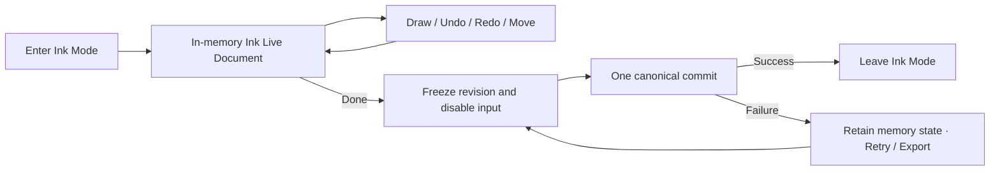

# Ink Explicit-Commit and Canvas Presentation Foundation

- **Status:** Adopted product correction, 2026-07-20
- **Scope:** Ink Mode persistence, inactivity, lifecycle, Canvas invalidation, and viewport
  presentation semantics for Pen and Highlighter
- **Overrides:** The automatic Draft and idle/background canonical-save contract in
  `2026-07-17-ink-native-feel-performance-and-brush-fidelity.md`, especially `INK-PF-34`,
  `INK-PF-35`, `INK-PF-37`, `INK-PF-47`, and `INK-PF-54`. It also narrows the broad frame/backing
  replacement allowance in `INK-PF-22` and `INK-PF-43`: projection changes do not authorize full-
  viewport rerasterization. Sidecars remain canonical and the Ink Live Document remains mounted
  working truth.

## Executive Decision

Ink Mode is an explicit editing session. Pen, Highlighter, Undo, Redo, selection, and movement
mutate an in-memory Ink Live Document. Clicking **Done** is the only user-required durability
barrier. A normal pause between strokes does not authorize Draft, IndexedDB, JSON, sidecar, Vault,
or canonical work.

The product accepts loss of every change made since entering Ink Mode when the host process is
killed before a successful Done or best-effort idle save. Native-feel input and presentation take
precedence over stroke-by-stroke crash durability.

Canvas presentation follows the same priority. One Pencil contact owns a frozen Stage Frame and may
update only its Active Stroke Presentation. Scroll/zoom is deferred while that contact is active;
forced rotation or Split View seals the confirmed prefix before adopting a new frame. During a
viewport gesture the existing raster may be compositor-scaled and temporarily less sharp. New-scale
committed pixels are prepared after the gesture and replace the temporary presentation without
rerasterizing history on every gesture tick.

## Normative Contract

### Session and durability

- `INK-EC-01` — Entering Ink Mode mounts one process-local Ink Live Document. Until a successful
  canonical commit, it is the only working truth for the session and is visibly `Unsaved` after the
  first mutation.
- `INK-EC-02` — A completed Pen or Highlighter contact becomes immediately available to rendering,
  Undo, Redo, selection, and subsequent contacts without waiting for any persistence operation.
- `INK-EC-03` — A sudden process kill before Done may lose all changes made since entering Ink Mode.
  This is accepted product behavior, not a Recovery defect.
- `INK-EC-04` — New Ink sessions do not append to the Draft Buffer or any Recovery Journal. Legacy
  Recovery data may remain a bounded, cold, read-only migration input; it never blocks a new session
  or writes new recovery state.

### Done commit

- `INK-EC-05` — Done ends the interactive portion of the session. It first completes or cancels the
  owned contact, freezes exact revision `N`, disables new drawing, and shows `Saving…`.
- `INK-EC-06` — Done materializes and commits revision `N` once through the canonical sidecar
  repository. Bounded-surface fragmentation and multi-file publication remain one logical commit.
- `INK-EC-07` — Done succeeds only after the canonical repository reports revision `N` committed.
  Success leaves Ink Mode. Failure keeps the complete in-memory document mounted, reports `Unsaved`,
  and offers Retry and Export; it never silently discards the revision.
- `INK-EC-08` — The Done latency budget is at most 1 second for a normal document and at most 3
  seconds for the 10k-stroke/30-surface worst-case fixture. These are separate commit budgets and do
  not relax input or presentation budgets.

### Leaving without Done

- `INK-EC-09` — Switching notes, closing the Markdown view, or otherwise leaving Ink Mode with an
  unsaved revision presents **Save / Discard / Cancel**. Save follows the Done commit; Discard is an
  explicit destructive decision; Cancel returns to the mounted session.
- `INK-EC-10` — No lifecycle Adapter may silently convert view detachment into data loss while the
  process is still able to present the choice.

### Best-effort idle save

- `INK-EC-11` — A best-effort canonical save is permitted after either of two unambiguous idle
  signals: the document becomes hidden/backgrounded or the host explicitly prepares to suspend; or
  the foreground session has received no user interaction for a sustained inactivity window. The
  default inactivity window is 60 seconds and production configuration must never shorten it below
  30 seconds. Stylus, touch, pointer, keyboard, wheel, scroll, pan/zoom, toolbar, Undo/Redo,
  selection, and any Ink command reset the window. A 500 ms pause, absence of Pointer Events alone,
  `requestIdleCallback`, or an arbitrary short timer is not such a signal.
- `INK-EC-12` — Idle save starts only with no active contact, no unpresented Contact Batch, no
  pending Active Stroke Presentation generation, and no frame debt. It coalesces all dirty state
  into one immutable revision snapshot.
- `INK-EC-13` — Idle save is best-effort, not a durability promise. Suspension or process kill may
  prevent it from starting or completing. Failure retains memory while the process survives and does
  not create a blocking Retry-before-draw state.
- `INK-EC-14` — Idle save CPU work is cooperatively chunked and cancelable. When the document
  becomes foreground-visible or any user interaction resumes, remaining continuations yield before
  new Ink input and may resume only after another qualifying idle signal. A completed older revision
  never clears the dirty state of a newer revision.

## Ink Mode Work Prohibitions

Outside Done or a qualifying idle save, the entire mounted Ink Mode session—not merely the Pointer
listener stack—performs zero:

- `localStorage`, IndexedDB, Draft Buffer, Recovery Journal, or Vault writes;
- canonical snapshot, sidecar read/modify/write, surface fragmentation, or canonical validation;
- JSON encoding, checksum, chain digest, parity digest, or persistence summary rebuild;
- persistence retry timer, 500 ms debounce, or per-stroke flush scheduling.

Pointer move and pointer completion retain the stronger existing prohibition against storage,
encoding, hashing, complete trace materialization, full geometry compilation, and history scans.

## Cooperative Scheduling Contract

Scheduling is a mechanism for bounded optional work, not permission to persist.

- `INK-EC-15` — Input work has priority over every queued non-input continuation.
- `INK-EC-16` — Deferred main-thread work consists of independently resumable work units whose
  measured wall time is at most 1 ms on the target iPad. Every unit returns to the host event loop.
- `INK-EC-17` — Every deferred unit carries a session/contact epoch. A changed epoch cancels stale
  work before its next unit.
- `INK-EC-18` — Production may use native `requestIdleCallback` when present. Its fallback uses
  frame deadlines plus a task-queue continuation such as `MessageChannel`; neither Adapter may run
  one unbounded synchronous callback or use a timeout to force optional work during Ink Mode.
- `INK-EC-19` — Work that cannot be divided below the unit budget must move behind a Worker seam or
  run only after Done has disabled drawing. Main-thread WASM does not satisfy this rule.

## Canvas Presentation Contract

### First principles

Canvas 2D is an immediate-mode output bitmap, not the retained model of Logical Strokes. Brush
Control Traces, Brush Geometry, InkDocumentChange, bounds, and generations determine what pixels
should exist; Canvas pixels are disposable presentation state. The browser may accelerate raster or
compositing, but Inkstone owns invalidation, reconstruction, memory bounds, and correctness.

Setting an HTML Canvas or OffscreenCanvas backing `width` or `height` resets its 2D rendering
context and clears its bitmap, even when the assigned value equals the old value. CSS projection may
allow WebKit to composite an existing bitmap without rerasterizing it, but layer promotion is a host
optimization rather than an Inkstone guarantee. The Implementation therefore treats backing mutation
and compositor projection as different operations.

### Semantic invalidation

- `INK-EC-20` — `InkRenderRuntime` owns the Canvas invalidation decision. Its Implementation
  distinguishes Active delta, document damage, projection-only change, backing replacement, and
  recovery rebuild. Callers report the semantic change; they do not request an undifferentiated full
  redraw.
- `INK-EC-21` — Active delta processes newly confirmed geometry plus the frozen mutable-tail bound.
  It neither queries committed history nor invalidates committed tiles.
- `INK-EC-22` — Document damage from Add, Undo, Redo, Erase, Move, restyle, selection exclusion, or
  promotion invalidates only conservative affected bounds/IDs. Add and identical promotion reuse
  prepared geometry and never clear the committed viewport.
- `INK-EC-23` — Scroll, document-origin motion, and in-progress zoom are projection-only changes.
  They perform zero Logical Stroke compilation and zero full-viewport Canvas clear. Existing raster
  is translated/scaled by the presentation layer while newly exposed or settled-scale content is
  satisfied from bounded committed raster tiles.
- `INK-EC-24` — Backing replacement is authorized only by a genuine physical backing-size or DPR
  change after there is no active contact. Stage Frame origin changes, subpixel layout noise, and
  redundant width/height assignments never replace backing storage.
- `INK-EC-25` — Recovery rebuild is an explicit, reason-coded fallback. Allowed reasons are initial
  document installation/replacement, Canvas context restoration, genuine post-contact backing/DPR
  replacement, Brush Render Version invalidation, and detected disposable-cache corruption. Every
  other full-viewport rebuild reason fails the performance Gate.

### Layering, tiles, and memory

- `INK-EC-26` — The visible presentation retains at most the existing three viewport-sized backing
  stores: committed, Active stable, and Active mutable-tail/Highlighter mask. No document-sized
  Canvas and no fourth simultaneous viewport backing store are permitted.
- `INK-EC-27` — Committed presentation uses disposable raster tiles or equivalent bounded damage
  units. A tile key includes its logical region, content generation, projection scale bucket, DPR,
  and Brush Render Version inputs. A miss is rebuilt from the Ink Live Document and Brush Geometry;
  tile pixels never become canonical.
- `INK-EC-28` — Committed raster tiles share the existing disposable-cache budget from `INK-PF-30`.
  Their additional retained RGBA area is capped at the smaller of the remaining 32 MiB per-mount
  disposable budget and 1.5 viewport-equivalent physical-pixel areas. Eviction is outside-viewport,
  then least recently used. Tile size is an implementation tuning value recorded in the protocol
  digest, not a product-visible contract.
- `INK-EC-29` — Tiles do not create an unbounded DOM/compositor layer tree. Production uses a
  bounded Canvas/ImageBitmap pool behind the committed presentation Seam. The count, estimated RGBA
  bytes, hits, misses, evictions, and rebuild reasons are observable in diagnostics.
- `INK-EC-30` — A settled backing replacement prepares required visible tiles while the old bitmap
  remains CSS-projected. In one rAF after contact and required tiles are ready, it mutates backing
  dimensions, composites the prepared tiles, and adopts the new Stage Frame. Active stable/tail
  stores are reused; the old temporary projection is removed in the same presentation generation.

### Pencil contact and viewport gestures

- `INK-EC-31` — During an active Pencil contact: full-viewport committed rebuild count is zero;
  Canvas backing-dimension mutations are zero; committed Logical Stroke queries/compilations are
  zero; and scroll/zoom/resize work cannot share the active rAF callback. Contact ownership begins
  before the first Brush Geometry is drawable; an empty or delayed Active Geometry state never
  authorizes committed work to consume that frame.
- `INK-EC-32` — Simultaneous Pencil drawing and viewport mutation is not supported. A Pencil contact
  owns its immutable Stage Frame epoch. User scroll, pan, or zoom intent is deferred until contact
  completion. If the host forces a new layout epoch through rotation, Split View, remount, or native
  navigation, the runtime seals the last valid confirmed prefix as one Logical Stroke, rejects stale
  post-epoch samples, and only then adopts/rebuilds the new frame. It never bridges points across
  Stage Frame epochs.
- `INK-EC-33` — During zoom, rotation, and Split View transition, the old bitmap may be temporarily
  compositor-scaled and less sharp. Inkstone does not rerasterize history on each gesture/observer
  tick. After the viewport settles, visible committed tiles are rebuilt for the new scale/DPR and
  atomically replace the temporary projection.
- `INK-EC-34` — ResizeObserver and layout measurements use semantic tolerances. Subpixel-equivalent
  Stage Frames produce no frame replacement, no cache invalidation, and no Canvas work.

### Full and partial redraw rules

| Event                                                      | Required presentation work                                      |
| ---------------------------------------------------------- | --------------------------------------------------------------- |
| Active Pen/Highlighter samples                             | Append stable coverage; rebuild only bounded mutable tail       |
| Pen-up / identical promotion                               | Promote prepared geometry; no full-viewport clear               |
| Add                                                        | Draw the added Logical Stroke or invalidate intersecting tiles  |
| Undo/Redo/Erase/Move/restyle/selection                     | Clear/rebuild affected dirty rects or tiles only                |
| Scroll/document-origin change                              | Reproject cached pixels; fill newly exposed tiles only          |
| Continuous zoom                                            | Compositor-scale old bitmap; zero per-tick geometry compile     |
| Settled zoom/rotation/Split View                           | Cold visible-tile rebuild and one post-contact backing adoption |
| Subpixel ResizeObserver noise                              | No work                                                         |
| Initial document/replacement or Canvas context restoration | One reason-coded visible recovery rebuild                       |
| Unknown invalidation reason                                | Fail closed in diagnostics and fail the performance Gate        |

No ordinary command performs a document-wide raster rebuild. An allowed visible recovery rebuild
queries only the logical viewport with `O(log H + V)` behavior, where `H` is historical Logical
Strokes and `V` is visible results. If it cannot finish inside the viewport budget, it remains a
cold tiled rebuild and may not become one synchronous active-frame task.

### Canvas scheduling and experimental Adapters

- `INK-EC-35` — `InkRenderRuntime` remains the single Active presentation owner. The first physical
  down may submit its already-compiled bounded Active coverage synchronously from the input task so
  it cannot wait behind a previously queued history rAF. Subsequent Active paint uses its one rAF;
  it precedes committed tile or overlay work, and optional work cannot consume the remaining frame
  budget once Active Stroke Presentation is pending.
- `INK-EC-36` — `getImageData`, Canvas readback, `toDataURL`, `toBlob`, export rasterization, and
  bitmap serialization are forbidden throughout interactive Ink Mode. They run only after Done or
  through an explicit export path.
- `INK-EC-37` — A `desynchronized: true` Canvas 2D context is an experimental Adapter because the
  host may ignore it and may trade latency for tearing. It requires current-build iPad A/B evidence
  and cannot be the only mechanism satisfying any budget.
- `INK-EC-38` — Worker/OffscreenCanvas is first eligible for committed tile reconstruction.
  Main-thread Canvas 2D remains the required first-tip Active Stroke Adapter until a production-iPad
  A/B proves Worker transfer, acknowledgement, fallback, and memory behavior are all superior. Main-
  thread WASM does not change these scheduling rules.

### Canvas performance invariants

- Active Canvas mutation work has P99 at most 4 ms on the target iPad while the existing complete
  rAF callback budget remains P99 at most 12 ms.
- Listener entry to first Canvas mutation remains within the frozen input-to-submit budget and P99
  at most two measured refresh intervals.
- Active contact, normal Add, and pen-up each produce zero full-viewport redraws and zero backing-
  dimension mutations.
- Scroll/zoom ticks produce zero committed geometry compiles; a settled gesture rebuilds only
  visible missing/invalid tiles. Scroll and toolbar zoom share one trailing settle; each cold-lane
  rAF prepares at most two tiles and the final batch may atomically composite in that same frame.
- Empty versus 10k-stroke/30-surface fixtures preserve the existing active-rAF history-independence
  budget. Committed work is bounded by invalid tile count and local density, never total history.
- A reason-coded allowed visible recovery rebuild retains the existing physical-iPad P95 below one
  60 Hz frame; otherwise the tiled rebuild must remain incremental and off the active lane.
- Backing stores, committed raster tiles, geometry cache, diagnostics, and compositor-layer count
  are reported separately and remain within their fixed budgets during the five-minute soak.

## Required Gate Changes

The Local Obsidian Performance Gate must add an explicit-commit protocol:

1. Enter Ink Mode, replay Pen and Highlighter over empty, 1k, and 10k/30 fixtures, wait through
   multiple former debounce windows but less than the configured sustained-inactivity window, and
   assert zero persistence calls before Done.
2. Let the sustained-inactivity window expire and begin a stroke during each CPU/I/O continuation
   phase of the resulting idle save. Assert that interaction resets the window, cancels or pauses
   remaining work, and that no Draft or canonical continuation competes with the first submitted
   frame.
3. Inject deferred work before Pointer down. Assert that no work unit exceeds 1 ms, stale work is
   canceled by the contact epoch, first visible Ink arrives within the frozen presentation budget,
   and no A-to-B connector is produced.
4. Independently inject background/hidden and sustained-inactivity signals and assert at most one
   coalesced best-effort revision save per dirty revision. Foreground or interact with the document
   during the save and prove subsequent Ink is not gated by its continuations.
5. Exercise Save / Discard / Cancel for note switch and view close.
6. Measure Done separately against the 1-second normal and 3-second worst-case budgets, including
   canonical failure retention and Retry/Export behavior.
7. Keep the five-minute growing-history soak. Legitimate Logical Stroke memory may grow with
   authored content; transient queues, backing stores, diagnostics, geometry caches, and scheduler
   state must remain bounded.
8. Record semantic invalidation reason, full-viewport redraw count, backing-dimension mutation,
   committed compile count, dirty/tile bounds, tile-cache bytes, and compositor-layer count for
   every replay phase. Unknown or unclassified full redraws fail.
9. Replay Pen and Highlighter while injecting scroll, ResizeObserver noise, zoom ticks, rotation,
   and Split View epochs. Active contact must show zero committed rebuild/backing mutation and no
   cross-epoch connector.
10. Prove normal Add, pen-up, Undo/Redo, Erase, Move, restyle, and selection use append or bounded
    damage only. No operation may reinterpret its change as an unrestricted viewport redraw.
11. Replay continuous zoom with the old bitmap projection, then settle. Gesture ticks must compile
    zero committed strokes; the settled frame must rebuild visible tiles under the cold-lane and
    memory budgets before removing the temporary projection. Capture waits until the production
    renderer reports zero queued frames rather than treating a fixed delay as completed work.
12. Force context loss/restoration, genuine DPR/backing changes, tile eviction, and cache
    corruption. Each allowed recovery rebuild must carry its exact reason and preserve the mounted
    Ink Live Document as reconstruction truth.
13. Persist a resumable condition checkpoint after every COMPLETE condition. A checkpoint is valid
    only when build, implementation, protocol, and normalized fixture digests all match and its
    conditions form the exact required prefix. A retry skips that prefix and restarts only the
    failed/missing condition; the five-minute soak restarts as one indivisible measurement. Any
    digest change invalidates the checkpoint. Successful final capture removes it.

An iPad marker is invalid unless the installed real-Obsidian build passes this revised local
protocol and identifies its exact build and protocol digests.

## Migration and Deletion

Implementation of this decision deletes new-write use of the Draft Buffer and removes automatic
`scheduleLiveFlush()` demand from ordinary commands, pen-up, and short idle gaps. It preserves:

- canonical bounded sidecars and fail-closed iCloud reconciliation;
- the process-local Ink Live Document, Undo/Redo, bounds index, and Logical Stroke identities;
- read-only legacy migration required to open existing user data;
- failure retention while the current process remains alive.

Removing Draft/Recovery production writers is preferred to leaving dormant scheduling paths behind
feature flags. The deletion concentrates persistence behavior behind the explicit commit seam and
prevents later callers from accidentally restoring per-stroke durability work.

## Non-goals

- This decision does not promise recovery after a process kill before Done.
- It does not make a background or sustained-inactivity save a durability guarantee.
- It does not replace canonical sidecars with an operation log.
- It does not support simultaneous Pencil contact and scroll/zoom/viewport mutation.
- It does not require perfect raster sharpness during an in-progress zoom, rotation, or Split View
  transition; sharp settled output remains required.
- It does not promise that WebKit promotes any Canvas to a compositor layer or honors
  `desynchronized: true`.
- It does not adopt Worker, WASM, WebGL, WebGPU, or a fourth viewport backing store without separate
  current-build physical evidence.

## Acceptance Criteria

- Foreground Ink Mode produces no storage or canonical work before Done or the configured sustained-
  inactivity window.
- A normal pause between strokes cannot start persistence work; only at least 30 seconds of complete
  user inactivity may qualify, with 60 seconds as the production default.
- A process kill before Done is documented and produces no Recovery/quota warning on restart.
- Note switch and view close present Save / Discard / Cancel when dirty.
- Done success commits the exact visible revision and exits; Done failure retains it and exposes
  Retry/Export.
- A qualifying background or sustained-inactivity signal may save one coalesced revision but cannot
  delay input after the document becomes visible or user interaction resumes.
- Normal and worst-case Done commits meet their separate latency budgets.
- Active Pencil contact performs zero full-viewport committed rebuilds, backing-dimension mutations,
  committed history queries, and committed geometry compiles.
- Scroll and continuous zoom reproject cached pixels without per-tick history rerasterization.
- Zoom, rotation, and Split View may temporarily scale the old bitmap; settled presentation is
  rebuilt at the new scale/DPR without a cross-epoch stroke or visible blank frame.
- Add and pen-up append/promote; editing commands invalidate bounded damage; only the explicit
  recovery whitelist can rebuild the visible viewport.
- Tile/backing/cache bytes and layer counts remain bounded and observable throughout growing-history
  and viewport stress runs.

## Source Manifest

### Sources

- User decisions in the current Codex task on 2026-07-20: Done-before-kill loss accepted; note
  switch/close uses Save / Discard / Cancel; obvious idle means background/hidden state or a long
  period without any user interaction and may perform best-effort save; Done failure retains memory
  with Retry/Export; Done budgets are 1 second normal and 3 seconds for 10k strokes/30 surfaces;
  zoom/rotation/Split View may temporarily scale the old bitmap; simultaneous Pencil contact and
  viewport mutation is not supported.
- `CONTEXT.md`, especially Ink Sample, Contact Batch, Active Stroke, Active Stroke Presentation,
  Logical Stroke, Ink Live Document, Draft Buffer, and Legacy Recovery Journal.
- `docs/specs/2026-07-17-ink-native-feel-performance-and-brush-fidelity.md`.
- `docs/specs/2026-07-17-ink-native-feel-execution-plan.md`.
- `docs/delivery/slices/S27R5-ink-foundation-ipad-regate/evidence-main-canvas-2d/raw/session-1-empty-pen-highlighter-pointer-main-canvas-2d-run-1.json`.
- `docs/delivery/slices/S27R5-ink-foundation-ipad-regate/attempts/20260720-session-1-persistent-stringing/`.
- HTML Living Standard Canvas sections describing backing-dimension reset, Canvas settings, context
  loss, and OffscreenCanvas: `https://html.spec.whatwg.org/multipage/canvas.html`.
- WebKit Web Inspector Layers reference describing repaint/compositing trade-offs and layer memory:
  `https://webkit.org/web-inspector/layers-tab/`.
- `/Users/ivan/.agents/docs/agents/workflows.md` and
  `/Users/ivan/.agents/docs/agents/handoff-policy.md`.

### Produced artifacts

- `docs/specs/2026-07-20-ink-explicit-commit-session.md`.
- Updated `docs/specs/README.md` index.
- Explicit-commit lifecycle and cold-save fencing in `src/application/ink-document-session.ts`,
  `src/ui/ink-canvas-controller.ts`, and `src/adapters/obsidian/ink-mode-manager.ts`.
- Bounded committed-raster infrastructure in `src/ui/ink-raster-tile-cache.ts` and
  `src/ui/ink-render-runtime.ts`.
- Revised real-Obsidian capture and analysis protocol in
  `src/adapters/obsidian/ink-local-performance-gate.ts` and
  `scripts/ink-local-obsidian-performance-gate.mjs`.

### Key decisions

- Foreground Ink Mode is memory-only until Done.
- Process-kill loss before Done is accepted.
- A background/hidden signal or sustained user inactivity may authorize one best-effort save; a
  short idle timer or idle callback may not.
- Leaving a dirty session requires Save / Discard / Cancel.
- Done is an input-disabled explicit commit with failure retention and fixed latency budgets.
- `InkRenderRuntime` owns semantic invalidation and treats full-viewport redraw as a reason-coded
  recovery path, not a normal viewport update.
- Pencil contact freezes the Stage Frame; navigation waits, while forced rotation/Split View seals
  the confirmed prefix before rebuilding.
- Continuous viewport gestures compositor-scale old pixels and settle through bounded committed
  raster tiles; transient softness is accepted.
- The current three-backing-store ceiling remains. Disposable tile/cache memory is bounded, and
  Worker/`desynchronized` remain evidence-gated Adapters.

### Verification evidence

- `npm test` passed on 2026-07-20: 153 files and 1,469 tests.
- `npm run test:performance` passed: 12 files and 79 performance tests.
- `npm run lint`, `npm run typecheck`, and `npm run format:check` passed.
- `npm run test:coverage` passed: 145 files and 1,448 tests; 80.50% statements, 76.58% branches,
  81.35% functions, and 82.71% lines.
- `npm run build` passed, including the mobile-bundle check.
- Targeted regressions prove first-tip Active paint precedes committed-history work; initial and
  invalidated raster reconstruction prepares at most two missing tiles per rAF; resized backing
  adoption retains the projected old bitmap until tiles are ready; and a contact preempts pending
  backing adoption without committed queries or backing mutation.
- A diagnostic real-Obsidian Gate attempt on 2026-07-20 completed all ten deterministic conditions
  and then failed the five-minute soak after foreground focus was lost. Its raw evidence identified
  history-tile reconstruction competing with contact submission and a cache-lifecycle exit save
  contaminating the foreground measurement. Both paths now have regression coverage: normal Add
  promotes prepared geometry without rebuilding the invalidated history tile, contact ownership
  starts before Active geometry exists, and cache-lifecycle diagnostics end before explicit exit.
- The Gate persists digest-fenced COMPLETE-condition checkpoints. An unchanged retry resumes at the
  first missing condition; a failed five-minute soak restarts only that indivisible soak. The soak
  remains the last foreground/focus-dependent phase of any retry.
- A later fail-fast real-Obsidian attempt completed all ten deterministic conditions before soak and
  proved scroll plus repeated toolbar zoom now share one settled projection. That single settle
  required ten visible tiles; the old one-tile scheduler emitted ten preparation frames plus one
  composite frame. The scheduler now prepares a fixed maximum of two tiles per rAF, and Gate capture
  waits for `queuedFrameCount === 0` before evaluating the frozen 5–8 viewport-frame budget.
- Final `npm run gate:ink-local-obsidian` evidence on real Obsidian 1.12.7 is `PASS` for build
  `cb101472e41e4e355e5db5bc4561b099c194a7c97011e43c68653c14d5f6fc5b`: all 10 conditions and the
  300526.3 ms Pen/Highlighter soak passed. Input handler P99 was 0.6 ms, frame-work P99 0.4 ms,
  input-to-submit P99 10.4 ms, stroke-commit P99 2.8 ms, pending missed-frame ratio 0%, and both
  worst-case viewport conditions completed in five redraw frames. The run recorded zero hanging,
  open, dropped, forbidden-hot-path, foreground-canonical-persistence, active-contact viewport, or
  pending-gap violations. The checkpoint was removed only after final PASS.

### Open questions / risks

- Tile dimensions, scale buckets, overscan, and whether `desynchronized` improves the target iPad
  remain profile-driven tuning decisions; their budgets and observable protocol fields are frozen.
- WebKit compositor promotion and internal GPU copies are host-controlled and cannot be guaranteed;
  physical layer/repaint/memory evidence remains required.
- iOS may suspend before a background save completes; only Done is a required durability barrier.
- The compressed iPad physical sessions remain pending; the local PASS does not claim physical
  Pencil delivery, device thermal behavior, or subjective Notes/Freeform parity.
