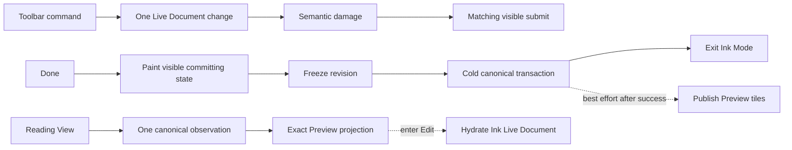

# Ink Responsive Commands, Save, and Preview

- **Status:** Adopted product and architecture correction, 2026-07-20
- **Scope:** Ink toolbar commands, Done feedback and canonical commit, Reading View Preview, cold
  hydration, disposable raster caching, scheduling, diagnostics, and performance Gates
- **Applies to:** Pen and Highlighter; empty, 1k-stroke, and 10k-stroke/30-surface documents
- **Builds on:** `2026-07-20-ink-explicit-commit-session.md`
- **Narrows:** Any Implementation that treats an ordinary command or read-only Preview as a reason
  to install/rebuild the complete editable document

## Executive Decision

The latest physical evidence shows that the Pencil path can feel smooth while toolbar commands,
Done, and many-stroke file opening still feel slow. These are different workloads and must have
separate response budgets.

Inkstone will use four deep Modules:

1. **Ink Command Presentation** owns one mutation-to-visible-submit transaction.
2. **Canonical Save Transaction** owns Done feedback, revision freeze, save planning, write, and
   terminal outcome.
3. **Preview Projection** owns exact read-only Ink pixels without mounting the editable Ink stack.
4. **Ink Work Scheduler** owns interactive, visible, and cold priorities plus cancellation.

Sidecars remain canonical. The editable Ink Live Document remains in-memory working truth during Ink
Mode. Preview raster tiles are disposable device-local data and never sync through the Vault. No
Worker, WASM, canonical manifest, or new sidecar schema is authorized merely because it might be
faster; each requires profiler evidence that the corresponding measured stage is dominant.

## Product Contract

### Writing remains the highest priority

- `INK-RSP-01` — The existing Pencil input, frame-work, input-to-submit, pending-work, stroke
  commit, viewport, memory, and no-storage hot-path budgets remain unchanged.
- `INK-RSP-02` — A toolbar command, Preview task, Done preparation, idle save, cache operation, or
  diagnostic task never shares priority with an active Pencil contact.
- `INK-RSP-03` — A host interval at least 50 ms is a writing failure only when diagnostics prove it
  overlaps active contact or required contact presentation. Other intervals are evaluated against
  the budget of their tagged command, Preview, save, or cold-work lane.

### Commands are one transaction

- `INK-RSP-04` — Undo, Redo, erase, move, restyle, and selection mutations publish exactly one
  authoritative `InkDocumentChange` per accepted command.
- `INK-RSP-05` — The matching presentation consumes that change once. A command handler never
  follows an exact change with an undifferentiated `sync(read, null)`, full document install, full
  committed-raster clear, or full-viewport rebuild.
- `INK-RSP-06` — Full document install is reserved for initial editable hydration, explicit document
  replacement/reload, context restoration, and reason-coded recovery. It is forbidden for an
  ordinary command.
- `INK-RSP-07` — Pressed, disabled, or busy feedback is visible independently of the final Canvas
  pixels. A command cannot appear unresponsive while waiting for its document mutation.
- `INK-RSP-08` — The command transaction completes only when the Render Implementation submits a
  presentation generation containing the matching semantic damage or reports a retained failure.

### Done is an explicit feedback-first transaction

- `INK-RSP-09` — Tapping Done synchronously transitions the mounted session from `interactive` to
  `committing`, disables drawing and destructive toolbar commands, and renders visible `Saving…`
  feedback.
- `INK-RSP-10` — No canonical observation, trace materialization, surface fragmentation, JSON
  encode, repository write, Vault call, or Preview-cache encode begins until the committing state
  has painted at least once.
- `INK-RSP-11` — After the feedback paint, Done freezes one exact Live Document revision `N` and
  constructs one document-level save plan. Per-surface sessions do not independently publish UI
  saving transitions.
- `INK-RSP-12` — One save plan reuses one canonical validation observation, note identity, and
  conflict decision. It encodes/writes only affected surfaces and publishes one terminal document
  outcome.
- `INK-RSP-13` — Successful canonical commit of `N` permits Ink Mode to close. Done does not wait
  for encoded Preview-cache publication; that is a cancellable best-effort cold task after success.
- `INK-RSP-14` — Failure retains the complete in-memory revision, shows `Unsaved`, and permits Retry
  or Export. It never silently exits or forces the user to discard.
- `INK-RSP-15` — The Save / Discard / Cancel behavior for navigation with unsaved state remains as
  specified by `INK-EC-09` and `INK-EC-10`.

### Preview is a read-only projection

- `INK-RSP-16` — Reading View note text mounts and becomes usable without waiting for Ink canonical
  decode, Live Document construction, Geometry compilation, or raster-cache access.
- `INK-RSP-17` — Preview does not construct Active Canvas state, Pencil listeners, toolbar state,
  Undo state, editable Ink Live Document state, or persistence state.
- `INK-RSP-18` — One note-open transaction performs at most one canonical enumeration/observation.
  Presence, exact projection identity, conflict state, and later editable hydration reuse that
  observation when it remains current.
- `INK-RSP-19` — Cache hit presents exact-revision transparent raster tiles. Cache miss
  progressively rasterizes the current viewport and never requires full-document Geometry
  compilation before the first visible Ink.
- `INK-RSP-20` — Entering Ink Mode keeps exact Preview pixels visible while the editable Ink Live
  Document hydrates. When hydration and its first matching presentation are ready, the editable
  presentation replaces Preview without a blank frame.
- `INK-RSP-20A` — Preview/Edit replacement is a compositor-only opacity handoff. The outgoing exact
  pixels remain fully visible until the incoming presenter has painted once; the two fixed
  presentation layers then cross-fade for at most 140 ms. The handoff never delays Pencil input,
  Done completion, canonical save, or Preview hydration, never requests Canvas redraw solely for
  animation, and releases the outgoing presenter only after the fade settles. Reduced Motion
  completes the handoff immediately without animation.
- `INK-RSP-20B` — Preview and Edit share the same pane-wide Stage coordinate plane. The visible
  Preview backing is bounded to the pane viewport, but its logical query may begin before or extend
  beyond the Markdown document origin. Ink with negative logical X or otherwise outside the Markdown
  document box remains visible and is never clipped merely because Reading View content uses a
  narrower readable-line-width container.
- `INK-RSP-20C` — Preview scroll never clears, resizes, hides, or mutates the currently presented
  Canvas before a matching replacement is complete. During motion the retained bitmap follows the
  document through a compositor transform; canonical query, Geometry compilation, and Canvas draw
  occur in a bounded staging backing, and only a current complete generation may atomically replace
  the presented bitmap.
- `INK-RSP-20D` — Editable scroll is compositor-only until settlement. Settlement never shifts,
  self-copies, or reuses committed bitmap pixels, even through an intermediate Canvas: repeated
  bitmap shifts produce feedback accumulation in real Chromium/WebKit. The target viewport is
  reconstructed from bounded retained raster tiles; missing tiles prepare behind the retained CSS
  projection, and only the complete current viewport may replace it. This does not add a fourth
  persistent backing store or recompile unaffected history Geometry.
- `INK-RSP-21` — A Preview cache entry is never used merely because note revision numbers match.
  Exact identity includes same-revision content divergence and renderer inputs.
- `INK-RSP-22` — The existing 160x90 surface-summary thumbnail is discovery metadata only. Because
  it samples bounded strokes, it is not an exact document Preview and cannot silently become
  canonical identity.

## Module Responsibilities

### Ink Command Presentation Module

The Interface accepts a command intent and returns a response token. Its Implementation owns:

- command eligibility and immediate visual feedback;
- exactly one Live Document mutation;
- exactly one semantic `InkDocumentChange`;
- affected IDs/bounds and dirty-tile invalidation;
- the matching presentation generation and response diagnostics.

Callers do not manually invoke an additional document sync after a successful mutation. Observer
notification and explicit handler synchronization are mutually exclusive paths, not cumulative ones.

The first correction removes confirmed duplicate null-change sync/full install behavior. Only after
that correction is profiled may the Live Document history projection change. If needed, stable
ordering and structural sharing must allow a command affecting `k` Logical Strokes to update in
`O(k log H)` or better without scanning/sorting/copying complete history `H`.

### Canonical Save Transaction Module

The Interface accepts frozen revision `N` and returns one committed or retained result. Its
Implementation owns:

- first-feedback paint acknowledgement;
- revision freeze and dirty Logical Stroke set;
- bounded materialization and surface fragmentation;
- one canonical validation snapshot;
- affected-surface write planning;
- encode, atomic sidecar publication, and summary publication;
- one document-level saving state and one terminal state;
- Retry-compatible retained failure.

The save transaction may delegate divisible cold work to the Work Scheduler and indivisible work to
a Worker only when measured main-thread duration exceeds the cold-unit budget. Main-thread WASM does
not make blocking work acceptable.

### Preview Projection Module

The Interface accepts a note identity, canonical observation token, Stage Frame, scale bucket, and
DPR. Its Implementation returns exact pixels for visible logical tiles and owns:

- canonical token validation;
- cache hit/miss/stale/corrupt decisions;
- viewport-first raster ordering;
- progressive projection and compositor presentation;
- Preview-to-Edit generation fencing;
- memory and device-local cache release.

The Projection may use Canvas, ImageBitmap, or image elements behind its Interface. It cannot expose
those choices to canonical storage or the editable document model.

### Canonical Observation Interface

Repository observation distinguishes four questions without forcing every caller through the
heaviest answer:

1. Is canonical Ink absent, present, conflicting, or unsupported?
2. What exact surface-set identity is current?
3. Which bytes/records are needed for visible Preview tiles?
4. Which complete Logical Strokes are needed for editable hydration?

The first Implementation must eliminate duplicate full reads and reuse one observation. A new
canonical manifest is authorized only if profiler evidence shows exact identity discovery remains a
dominant cold-open cost after duplicate work and editable mount removal.

## Device-local Preview Cache

- `INK-RSP-23` — Encoded Preview tiles use IndexedDB behind a storage Adapter. They are never stored
  in `localStorage`, sidecars, Markdown, the Vault, or iCloud.
- `INK-RSP-24` — The key includes vault identity, stable note identity, sorted exact surface-set
  content digest, Brush Render Version/renderer version, logical tile grid coordinate and size,
  scale bucket, DPR, color-space, and alpha contract.
- `INK-RSP-25` — Cache publication is two-phase: write encoded bytes under a generation, then
  publish its complete generation token. A partial generation is never presented.
- `INK-RSP-26` — Canonical commit success, external sidecar reconciliation, renderer-version change,
  same-revision divergence, or note identity change fences older cache completions.
- `INK-RSP-27` — Quota, eviction, blocked upgrade, transaction abort, system purge, decode failure,
  stale generation, and corruption all degrade to cache miss. They never block note text, drawing,
  Done success, or canonical reconciliation.
- `INK-RSP-28` — Encoded disk cache is capped at 32 MiB per note and 128 MiB plugin-wide. Eviction
  is least-recently-used after obsolete generations. These are cache budgets, not durability quotas.
- `INK-RSP-29` — Decoded tiles, Geometry, and spatial indexes remain inside the existing 32 MiB per-
  mount and 64 MiB plugin-wide disposable memory budget. One plugin-wide budget coordinator owns
  their actual retained-byte accounting and eviction.
- `INK-RSP-30` — Stable logical tile grids are independent of viewport-clipped edge bounds. A cached
  tile may be reused across mounts and compatible viewports without producing an unbounded DOM or
  compositor layer tree.

## Work Scheduler Contract

The Work Scheduler has exactly three priority lanes:

| Lane          | Work                                                                            | Preemption                        |
| ------------- | ------------------------------------------------------------------------------- | --------------------------------- |
| `interactive` | Pencil input, command feedback, matching presentation                           | never waits for other lanes       |
| `visible`     | dirty visible tiles, Preview pixels, Edit handoff                               | yields to interactive             |
| `cold`        | Done materialization after feedback, canonical I/O preparation, cache encode/GC | yields to interactive and visible |

- `INK-RSP-31` — Every visible/cold unit carries note, mount, session, revision, and generation
  epochs. Any mismatch cancels it before its next mutation or publication.
- `INK-RSP-32` — Deferred visible/cold main-thread CPU units target at most 1 ms: at least 99% of
  measured units are at or below 1 ms, P99 is at most 2 ms, and every unit remains strictly below 4
  ms. A unit reaching 4 ms, or a sustained over-1-ms ratio above 1%, fails the Gate and moves to a
  Worker Seam or behind completed Done. The 1 ms target remains a diagnostic warning boundary, not a
  zero-tolerance verdict distorted by JIT, GC, timer, or host scheduling jitter.
- `INK-RSP-33` — Native `requestIdleCallback` or `scheduler.postTask` and the iOS MessageChannel/rAF
  fallback have identical priority, cancellation, and frame-debt semantics.
- `INK-RSP-34` — `requestIdleCallback` is only a scheduling signal. It does not authorize foreground
  persistence; the Done or sustained-idle/background product rules still apply.
- `INK-RSP-35` — New interaction cancels or preempts visible/cold continuations before the next
  unit. A backgrounded or sustained-idle session may resume cold work only under `INK-EC-11` through
  `INK-EC-14`.
- `INK-RSP-36` — No cold task begins with active contact, unpresented input, pending Active Stroke
  Presentation, frame debt, or unacknowledged command feedback.

## Diagnostics Contract

- `INK-RSP-37` — Every command records privacy-safe kind, request time, first-feedback time, apply
  start/end, change publication, matching presentation submit, and terminal outcome.
- `INK-RSP-38` — Done records first-feedback paint, revision freeze, materialize slices, save-plan
  construction, encode, Vault write, summary publication, terminal outcome, and total duration.
- `INK-RSP-39` — Preview records note-content-ready, canonical observation, cache lookup, first Ink
  pixel, visible viewport complete, editable hydration ready, and Preview-to-Edit adoption.
- `INK-RSP-40` — A host gap records monotonic timestamp, duration, lane, active-contact flag,
  current command/save/Preview stage, note-safe workload identity, pending generations, and
  queued-work counts. Diagnostics never record note text or raw points.
- `INK-RSP-41` — Full document install, full raster clear, full-viewport rebuild, backing mutation,
  canonical observation, Geometry compile, encode, and storage calls expose reason-coded counts.
- `INK-RSP-42` — `todo` is not a defined command kind. Until reproduced, reports preserve that
  literal human wording and do not relabel it as Redo.

## Frozen Performance Budgets

Let `R` be the measured refresh interval; at the current fixed 60 Hz Gate, `R` is approximately 17
ms.

| Workload                                   | Budget / invariant                                                  |
| ------------------------------------------ | ------------------------------------------------------------------- |
| Pencil path                                | Existing S27/explicit-commit budgets remain unchanged               |
| Toolbar first feedback                     | P99 <= 1R                                                           |
| Undo/Redo apply                            | P95 <= 4 ms; P99 <= 8 ms                                            |
| Command matching submit                    | P95 <= R + 8 ms; P99 <= 2R                                          |
| Ordinary command full install              | 0                                                                   |
| Ordinary command full raster clear/rebuild | 0                                                                   |
| 10k/30 command growth                      | P95 delta versus empty <= `max(1 ms, 10%)`                          |
| Done first-feedback paint                  | P99 <= 1R + 2 ms                                                    |
| Work before Done feedback paint            | 0 materialize, encode, canonical observation, Vault, or cache calls |
| Done total, normal                         | <= 1 s                                                              |
| Done total, 10k/30                         | <= 3 s                                                              |
| Preview note content                       | never waits for Ink work                                            |
| Preview cache-hit first Ink                | P95 <= 100 ms; P99 <= 200 ms after note layout is ready             |
| Preview cache-miss first visible tile      | P95 <= 250 ms; P99 <= 500 ms after note layout is ready             |
| Preview cache hit hot work                 | 0 Live Document construction and 0 Geometry compile                 |
| Preview cache miss scope                   | current viewport progressive; no full-document raster prerequisite  |
| Active-contact host gaps >=50 ms           | 0                                                                   |
| Memory/disk                                | bounded by `INK-RSP-28` through `INK-RSP-30`                        |

Editable hydration latency is recorded separately from Preview visibility. Before it becomes a
release Gate, the first real-Obsidian implementation must establish empty/1k/10k baselines and
freeze a target that does not require a blank frame or remove Preview interaction.

## Local Obsidian Gate

The real installed Obsidian plugin and production Canvas Gate is the hard prerequisite for another
physical run. Vitest/jsdom alone cannot pass this specification.

The single local Gate command must add deterministic cases for:

- each toolbar command on empty, 1k, and 10k/30 fixtures;
- exactly one change and zero full install/raster clear for ordinary commands;
- 100 Undo/Redo samples with early/middle/late history windows;
- Done with normal, delayed, failed, and 30-surface Repository Adapters;
- proof that Saving painted before cold work;
- cold/warm Preview open, cache hit/miss/stale/corrupt/quota/eviction;
- same-revision divergence and external canonical change;
- Preview-to-Edit handoff with no blank generation;
- pane-wide Preview parity for Ink inside and outside the Markdown document box;
- continuous Preview/Edit scroll with zero visible-canvas clear/backing mutation before replacement
  and zero overlapping committed self-copy;
- two or more simultaneous mounts under the plugin-wide memory budget;
- lane preemption and cancellation when Pencil or command interaction resumes;
- at least five minutes of mixed growing history/Preview/command soak after all focused cases pass.

The Gate outputs raw JSON, build/protocol/implementation digests, per-stage percentiles, invariant
counts, cache/memory budgets, early-to-late growth comparisons, Source Manifest, and PASS/FAIL. Any
required failure prevents physical marker generation. Failed local conditions can be resumed without
rerunning already-passing digest-compatible conditions.

Unit and focused performance tests run during development. The long real-Obsidian Gate runs only
after all implementation Slices are code-complete, unless a targeted profiler run is explicitly
needed to choose between designs.

## Physical Acceptance

Physical acceptance remains at most four short sessions; this specification does not add sessions:

1. Empty Pen + Highlighter writing remains drawing-only.
2. The 10k/30 worst-case session includes cold/warm Preview open, Preview-to-Edit handoff, and
   representative Undo/Redo.
3. Navigation/layout continues to cover scroll, zoom, rotation, and Split View.
4. Stability/reference includes one final Done observation and normal/failed feedback as practical.

Obvious writing lag or heat still fails fast. Command, Preview, and Done delays are recorded by
their own spans rather than inferred from unattributed rAF gaps. Human testers are not asked to run
the former 47-condition matrix.

## Delivery Slices

### S35 — Command response and attribution

- Add command/open/Done stage diagnostics and tagged host gaps.
- Reproduce and TDD the confirmed Undo/Redo double-sync/full-install regression using the production
  Live Document notification path, not a non-callback fake.
- Audit erase, move, restyle, selection, Undo, and Redo.
- Pass focused empty/1k/10k command budgets.

### S36 — Done Canonical Save Transaction

- TDD visible committing state and first-painted-frame ordering.
- Replace per-surface UI saving publication with one document transaction.
- Reuse one canonical observation and encode/write only affected surfaces.
- Preserve Retry/Export and all explicit-commit failure semantics.

### S37 — Preview Projection and canonical observation

- Eliminate duplicate presence/mount reads and duplicate initial installs.
- Mount read-only Preview without editable state.
- Implement viewport-first cache-miss raster and Preview-to-Edit generation fencing.
- Establish cold-open stage baselines before considering a canonical manifest.

### S38 — Device-local Preview cache and global budget

- Implement the IndexedDB Adapter, exact key, atomic generation publication, and stale fencing.
- Add quota/corruption/eviction/external-change tests.
- Unify decoded Geometry/raster accounting under the plugin-wide memory coordinator.
- Prove multiple mounts remain bounded.

### S39 — Work Scheduler, Gate, and compressed physical protocol

- Centralize lane priority, cancellation, iOS fallback, and stage attribution.
- Add resumable local Gate conditions and new budgets.
- Align the physical analyzer with explicit-commit Session 1, where persistence samples are not
  required before export.
- Run the long local Gate once after S35–S39 code completion, then resume the four-session maximum.

## Non-goals

- Restoring per-stroke durability, Recovery Journal writes, or strong foreground synchronization.
- Persisting Preview pixels in sidecars, Markdown, Vault, or iCloud.
- Replacing the Brush Geometry contract or changing visible Pen/Highlighter calibration.
- Using a document-sized Canvas or unbounded DOM/compositor tile layers.
- Hiding slow work behind main-thread WASM.
- Adding a canonical manifest or Worker without stage-specific profiler evidence.
- Increasing physical acceptance beyond four sessions.

## Rollback and Failure Containment

- Command transaction changes can fall back to exact semantic invalidation, not to silent full
  rebuild. A necessary recovery rebuild must remain reason-coded and Gate-visible.
- Preview cache may be disabled or cleared independently; canonical Preview regeneration remains the
  correctness fallback.
- IndexedDB failure never changes the sidecar schema or blocks Done.
- Preview Projection failure removes only Ink pixels and surfaces an actionable retry; note text
  remains available.
- Work Scheduler failure cannot reorder canonical success before bytes are committed or allow a
  stale generation to publish.

## Acceptance Checklist

- [ ] S35–S39 automated tests pass through vertical TDD.
- [ ] Ordinary commands produce one change and zero full installs/rebuilds.
- [ ] Done feedback paints before any cold/canonical work.
- [ ] Many-stroke Preview no longer mounts editable state or performs duplicate full reads.
- [ ] Preview retains pane-wide Ink outside the Markdown document box and both Preview/Edit scroll
      without blank, repeated, or feedback-smeared pixels.
- [ ] Exact Preview cache survives remount/restart and fails safely under every invalidation case.
- [ ] Empty/1k/10k/30 command, Preview, Done, memory, and soak budgets pass in real Obsidian.
- [ ] The local result includes digests, raw evidence, analysis, and Source Manifest.
- [ ] No physical marker is generated before the local Gate passes.
- [ ] Physical acceptance uses at most four short sessions and preserves human-authored ratings.

## Source Manifest

### Sources

- User decisions in the current Codex task on 2026-07-20: writing feels good; `todo`, Undo, Done,
  and many-stroke opening feel slow; combine the review into one improvement specification; keep
  `docs/delivery/` local-only.
- `CONTEXT.md`
- `docs/specs/2026-07-17-ink-native-feel-performance-and-brush-fidelity.md`
- `docs/specs/2026-07-20-ink-explicit-commit-session.md`
- `src/adapters/obsidian/ink-mode-manager.ts`
- `src/application/ink-document-session.ts`
- `src/application/ink-surface-session.ts`
- `src/storage/ink-surface-repository.ts`
- `src/ui/ink-canvas-controller.ts`
- `src/ui/ink-render-runtime.ts`
- `src/ui/ink-raster-tile-cache.ts`
- `src/ui/ink/ink-toolbar-app.tsx`
- `src/runtime/ink-performance-diagnostics.ts`
- Latest local-only S27R5/S34 physical evidence and human report, intentionally excluded from Git
  under `docs/delivery/`.

### Produced artifacts

- `docs/specs/2026-07-20-ink-responsive-commands-save-and-preview.md`
- Updated `docs/specs/README.md`
- Updated `AGENTS.md`

### Key decisions

- Commands, Done, Preview, and Pencil have separate response budgets.
- Preview becomes an exact read-only projection with a disposable device-local cache.
- Done is feedback-first and document-transactional; cache publication never delays success.
- Scheduling uses interactive, visible, and cold lanes with generation cancellation.
- Worker/WASM and a canonical manifest remain evidence-triggered decisions.
- Long local Gate runs after code completion; physical acceptance remains at most four sessions.

### Verification evidence

- The pre-spec implementation baseline passed `npm run check` on 2026-07-20: 145 regular test files
  / 1448 tests, 12 performance test files / 79 tests, lint, typecheck, production build, and mobile
  bundle check.
- A real-Obsidian A/B reproduction on 2026-07-20 isolated editable-scroll feedback smearing to the
  committed-Canvas bitmap-shift path: repeated alternating scrolls accumulated copied pixels with
  the path enabled, while blocking only that path stopped the accumulation. The production path was
  removed, the focused 203-test UI suite passed, and the installed build remained stable after 32
  alternating scrolls of the same 1k-history fixture.
- This specification is verified by Markdown formatting, `git diff --check`, and local-link review.
  It does not claim full S35–S39 Gate completion.

### Open questions / risks

- The action called `todo` has not been mapped to a runtime command.
- Cold-open, Done, and command stage percentages remain unknown until S35 diagnostics exist.
- A canonical manifest may become necessary if exact identity discovery still requires dominant full
  decode after duplicate work is removed.
- Editable hydration latency needs a real-Obsidian baseline before its release budget is frozen.
