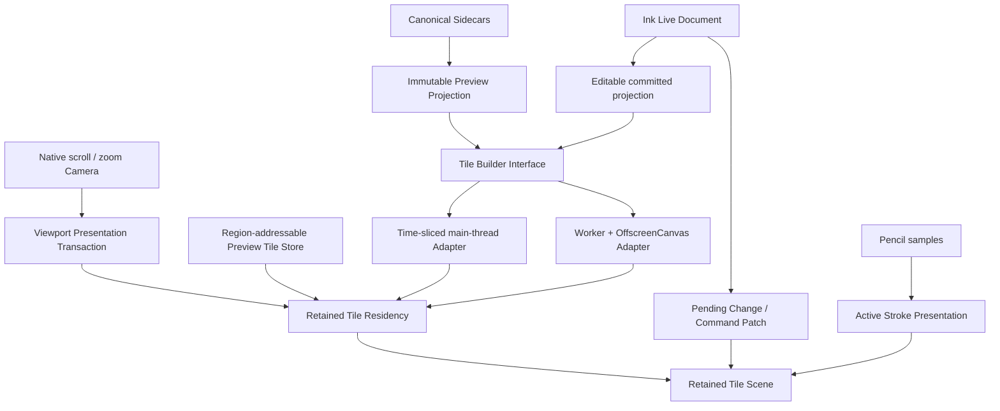

# Ink Retained Tile Scene and Worker Rasterization

- **Status:** Main-thread Retained Tile production path implemented; optional Worker Adapter built
  but not promoted; S46 installed-Obsidian/physical Gate pending, 2026-07-20
- **Scope:** Preview and Edit historical-Ink presentation, world-tile identity, scroll/zoom
  continuity, raster residency, region-addressable Preview caching, and optional Worker +
  OffscreenCanvas tile construction
- **Applies to:** Pen and Highlighter; empty, 1k-stroke, and 10k-stroke/30-surface documents;
  negative-X pane-wide Ink; 50% through 200% Edit zoom; 60 Hz iPad and desktop Obsidian
- **Builds on:**
  - `2026-07-16-ink-704-zoomable-workspace.md`
  - `2026-07-16-ink-stage-frame-and-native-navigation.md`
  - `2026-07-17-ink-native-feel-performance-and-brush-fidelity.md`
  - `2026-07-20-ink-explicit-commit-session.md`
  - `2026-07-20-ink-responsive-commands-save-and-preview.md`
- **Supersedes:** The normal-path single-viewport bitmap replacement interpretation of `INK-EC-30`,
  `INK-RSP-20C`, and `INK-RSP-20D`; the whole-generation presentation interpretation of
  `INK-RSP-25`; and any interpretation of `INK-V1.3-13` that authorizes immediate-mode full-viewport
  redraw for a Camera-only change

## Executive Decision

Inkstone will replace the normal historical-Ink presentation model of “one viewport Canvas,
temporarily CSS-projected and later rebuilt as a complete viewport” with a **Retained Tile Scene**.
The scene is addressed in the existing per-note logical coordinate plane. Scroll changes only the
Camera. Continuous zoom projects retained tiles through the compositor. Content mutation damages
only intersecting world tiles. A complete tile replaces an older or lower-resolution tile
atomically; the Implementation never clears already-presented coverage merely because a new viewport
or LOD is pending.

Preview and Edit share world-tile addressing, LOD selection, residency, scheduling, diagnostics, and
tile-construction machinery, but they do not share product state:

- **Preview** observes one immutable canonical projection and may use exact encoded IndexedDB tiles
  plus decoded in-memory tiles. It never mounts Undo, selection, Pencil input, or an editable Ink
  Live Document merely to scroll.
- **Edit** observes one process-local Ink Live Document revision. Its committed historical tiles and
  command patches are disposable memory only until Done commits an exact canonical revision. Active
  Stroke Presentation remains an independent latency-first layer and never waits for a tile.

Worker + OffscreenCanvas is authorized as an optional **Tile Build Adapter**. On a capable runtime,
one long-lived Worker may compile Brush Geometry, raster Preview/committed tiles, and encode cold
cache bytes. The main thread retains Pencil input, Stage Frame/Camera updates, residency decisions,
DOM/compositor presentation, and atomic adoption. The same Tile Builder Interface must have a
time-sliced main-thread fallback. Worker or OffscreenCanvas failure is a performance degradation,
never a correctness failure.

The target iPad diagnostic already reports Dedicated Worker, main-thread OffscreenCanvas 2D,
OffscreenCanvas transfer, Offscreen WebGL2, Worker animation frame, WASM, and WASM SIMD APIs as
available. It does not expose `SharedArrayBuffer` because the Obsidian WebView is not
cross-origin-isolated. Those observations authorize a production-path probe; they do **not** prove
that a worker-local OffscreenCanvas can raster non-empty Ink, transfer an ImageBitmap, and have the
real WKWebView presenter adopt and close it correctly. Shared memory and Atomics are not required.



## Problem Evidence

The current Implementation contains tile-like caches but does not present a retained tile scene.

### Preview

- `InkPreviewProjectionController` presents one visible viewport Canvas and one staging viewport
  Canvas.
- A scroll first projects the old visible Canvas. The scheduled replacement then queries the new
  viewport, recompiles every visible Logical Stroke through `SharedInkStrokeGeometry`, clears and
  redraws the complete staging viewport, and swaps the two Canvases.
- IndexedDB is consulted at mount/open. A later scroll does not demand-load decoded tile addresses;
  it normally returns to canonical query + Geometry compilation.
- Cache load reads every encoded tile in one published generation into JavaScript memory rather than
  only `viewport + overscan`.
- Cache publication rerenders visible tiles after the viewport has already been rendered and
  rewrites the retained generation.
- Stored tile validation rejects negative tile coordinates even though pane-wide Ink permits
  negative logical X.

Consequently, rapid navigation beyond the old viewport can exhaust retained coverage before the
complete replacement is ready. Cancellation tied to a viewport epoch also discards useful tile work
whose content identity remains current.

### Edit

- The visible historical layer remains one viewport-sized committed Canvas.
- During Camera motion the Canvas is CSS-projected. After a fixed settle delay, raster tiles are
  prepared and then recomposited by clearing the complete committed viewport.
- The raster key includes exact floating-point scale and viewport-clipped edge bounds.
- Logical tile span is derived from `128 / actualScale`, so zoom changes the grid itself; small
  scrolls also produce new edge keys.
- The raster budget is an LRU byte cap, not a spatial residency policy. Entries are reported as
  non-visible and there is no pinned viewport, low-resolution ring, directional prefetch, or parent
  LOD fallback.
- One tile build can synchronously query, order, compile, and draw dense history. “Two tiles per
  frame” is therefore not a wall-time guarantee.
- `installDocument()` currently invokes terminal raster-cache `dispose()` and then reuses the same
  object, so later raster bytes can escape plugin-wide memory accounting.

Consequently, a settled scroll or zoom still behaves like a viewport rebuild. Exact-scale cache
misses, insufficient old coverage, and a final full-Canvas clear expose flicker, blank intervals,
feedback accumulation, or stale projection.

### Existing Worker coverage

- The experimental Worker Offscreen presentation Adapter controls Active stable/tail Canvases. It is
  not the historical Preview/committed tile renderer and is not the default physical Pen path.
- Preview uses OffscreenCanvas on the main thread and a Worker only for PNG encoding. Canonical
  query, Brush Geometry compilation, and tile raster still run on the main thread.
- Existing capability probes, transferable buffer pool, epoch protocol, acknowledgement,
  backpressure, prewarm, timeout, and fault fallback are useful foundations, but the current Worker
  protocol has no world tile, LOD, content revision, guard band, or tile-result contract.

## Goals

| ID           | Goal                                                                                                                           |
| ------------ | ------------------------------------------------------------------------------------------------------------------------------ |
| `INK-RT-G01` | Preserve all accepted Pencil move, first-tip, pen-up, physical-brush, and heat budgets.                                        |
| `INK-RT-G02` | Camera-only scroll/zoom cost depends on changed visible tile addresses, not total history.                                     |
| `INK-RT-G03` | Already-presented pixels never disappear while a replacement tile/LOD is incomplete.                                           |
| `INK-RT-G04` | Preview cache-hit scrolling performs zero Live Document construction and zero Brush Geometry compilation.                      |
| `INK-RT-G05` | Edit mutations invalidate only conservative world-tile damage and never block the next contact.                                |
| `INK-RT-G06` | Preview and Edit share disposable tile machinery without sharing mutable product state.                                        |
| `INK-RT-G07` | Worker/OffscreenCanvas reduces main-thread frame debt when it wins measured end-to-end cost and fails safely when it does not. |
| `INK-RT-G08` | Tile nodes, decoded pixels, worker mirrors, Geometry, and disk bytes remain bounded and observable.                            |

## Compatibility and Supersession

| Existing contract            | This specification's exact interpretation                                                                                                                        |
| ---------------------------- | ---------------------------------------------------------------------------------------------------------------------------------------------------------------- |
| `INK-V1.3-01`, `INK-V1.3-07` | Remain authoritative. Stage Frame is the single complete coordinate epoch; Tile Scene code consumes it and never measures a competing frame.                     |
| `INK-V1.3-13`                | `redraw` for a Camera-only change means update scene transform and demand. It does not authorize immediate full-viewport raster.                                 |
| `INK-EC-30`                  | Its safe real-DPR/backing replacement sequence remains valid. Ordinary settled scroll/zoom no longer replaces one complete viewport bitmap.                      |
| `INK-RSP-08`                 | Remains authoritative. A command patch must contain matching post-command semantic pixels; toolbar feedback alone is insufficient.                               |
| `INK-RSP-20C`, `INK-RSP-20D` | Their retain-until-ready guarantee remains; the bounded staging viewport swap is replaced by per-tile/bounded-damage adoption.                                   |
| `INK-RSP-25`                 | Whole-generation readiness is replaced by crash-atomic readiness per immutable Preview tile under one projection catalog.                                        |
| `INK-PF-30`, `INK-EC-28`     | Existing cache and mandatory-presentation working-set accounting remains authoritative; this specification does not silently add a second full-density viewport. |

## Domain Language

### Note Logical World

The existing stable per-note logical coordinate plane. It is not a Vault-wide world and a content
revision does not create a new origin, unit, or spatial formula. A Projection Identity names one
exact canonical or live content projection **within** this plane. Its origin is the Markdown display
plane's logical top-left `(0, 0)`, and one logical unit is one unscaled CSS pixel at 100%
presentation. New documents use a 704 logical-px Markdown width; pane-wide Ink may have negative X
or X greater than 704. Existing non-704 Sidecars retain their authored coordinates without scaling
or normalization. The tile grid is not clipped to the Markdown width.

Sidecar stroke points remain surface-local. Existing projection rules remain authoritative:
schema-v1 uses deterministic canonical surface order and cumulative origin; schema-v2/v3 uses the
persisted `layout.originY`; schema-v3 Physical fragments preserve exact `fragmentGlobalY` and
boundary/order provenance. Persisted gaps between surface origins remain gaps. A projection index
stores note-global conservative bounds without eagerly joining or materializing every trace. Only
fragments selected for exact raster/damage are joined into one Logical Stroke before Brush Geometry
or Highlighter composition.

### Camera

The Stage Frame projection from Note Logical World into client/CSS/backing coordinates. For logical
point `L`, document client origin `O`, measured scale `S`, Canvas client origin `C`, and DPR `D`:

```text
client(L)    = O + S * L
canvasCss(L) = client(L) - C
logical(P)   = (P - O) / S
backing(L)   = D * canvasCss(L)
```

Native scroll normally changes `O` while retaining `S`. Zoom, Fit, resize, sidebar change, host
replacement, rotation, and Split View may atomically change both `O` and `S`. Tile presentation
consumes the complete Stage Frame, including its compatibility-adjusted `documentClientOrigin`; it
never anchors to the raw layout-root rectangle. DPR changes backing density. None changes canonical
Logical Stroke coordinates.

### World Tile Coordinate

The stable **spatial** address of one complete rectangular region at one quantized LOD:

```ts
interface InkWorldTileCoordinate {
  readonly lod: number;
  readonly column: number;
  readonly row: number;
}
```

For the world span selected by `lod`:

```text
column = floor(logicalX / worldSpan(lod))
row    = floor(logicalY / worldSpan(lod))
```

Column and row use mathematical floor and are signed safe integers on the normal tiled path.
Negative row supports a viewport above logical Y zero and brush/guard overhang; it does not relax
the invariant that persisted control-point Y is non-negative and bounded by its surface. A finite
canonical coordinate outside the safely tileable range is preserved and uses an explicit
`untileable-range` fallback; it is never clamped, aliased, or classified as corrupt.

LOD increases with raster density and follows one exact hierarchy:

```text
worldSpan(lod + 1) = worldSpan(lod) / 2
parent(lod, column, row) = (lod - 1, floor(column / 2), floor(row / 2))
```

The parent formula also uses floor for negative coordinates. Viewport edges, `scrollTop`, Canvas
dimensions, exact floating-point zoom, projection revision, renderer identity, and surface-local IDs
do not enter the World Tile Coordinate.

### Tile Content Key

The exact disposable-content identity at one World Tile Coordinate:

```ts
interface InkTileContentKey {
  readonly projectionIdentity: string;
  readonly rendererVersion: string;
  readonly coordinate: InkWorldTileCoordinate;
  readonly tileContentToken: string;
  readonly rasterVariant: InkRasterVariant;
}
```

Preview uses the exact immutable canonical Projection Identity; its Tile Content Token is derived
from that exact projection/coordinate render input (using the projection digest itself is valid when
the whole projection is immutable). Edit uses a stable mounted-session Projection Identity plus a
monotonic Scene Revision and a per-coordinate Tile Content Token. A Scene Revision fences
command/synchronization work but is not a spatial address and does not by itself invalidate every
tile. Unaffected coordinates inherit their Tile Content Token across Live Document revisions;
conservative damage changes only intersecting tokens.

### Raster Variant

The disposable pixel representation of a World Tile Coordinate. It records exact backing width and
height, effective `pixelsPerLogicalUnit`, color space, alpha contract, and any renderer-specific
pixel input. It does not introduce an independent density hierarchy beside LOD. Raw DPR need not be
an additional key only when it is already completely represented by the effective pixel density. The
Camera selects a suitable variant; it never rewrites world coordinates. Exact base span, backing
dimensions, and hysteresis thresholds are Implementation tuning values included in the protocol
digest and frozen after focused benchmarks.

### Guard Band

Extra logical coverage queried and rasterized around a tile's nominal bounds. It covers brush
radius, anti-aliasing, joins, and filters. Only the nominal interior is presented. This preserves
Pen continuity and Highlighter optical density without double-blending shared edges.

### Retained Tile Scene

A bounded presentation of individually positioned tile nodes or canvases under one Camera transform.
It retains current, fallback, and near-visible coverage across scroll/zoom. It is not one viewport
bitmap and not an unbounded DOM/compositor layer tree.

### Tile Residency

The in-memory lifecycle and eviction state of exact/fallback pixels: `building`, `ready`, `visible`,
`near-visible`, `cold`, `dirty`, `stale`, or `disposed`. Visibility and recency are different facts.
Visible exact/fallback coverage is pinned; cold entries are evicted first.

### Pending Change / Command Patch

The bounded visible presentation of an accepted Edit change while affected committed tiles are being
rebuilt. Active Add promotion may remain in its prepared presentation until matching tiles are
adopted. Destructive commands use affected patch tiles or equivalent exact local damage; they do not
clear/rebuild the viewport.

## Normative Contract

### Coordinate and identity

- `INK-RT-01` — The Note Logical World is the only tile-coordinate authority. No new persisted
  coordinate plane or sidecar field is introduced.
- `INK-RT-02` — One Stage Frame remains the only Adapter between Note Logical World, client,
  Canvas-CSS, and Canvas-backing coordinates. Tile code consumes the complete immutable published
  epoch, including compatibility inset; it does not reconstruct layout from pane width, padding, raw
  layout-root bounds, `scrollTop`, or requested toolbar scale.
- `INK-RT-03` — World Tile Coordinates are pure spatial `(lod, column, row)` identities. Their
  bounds are complete grid-aligned rectangles. Viewport clipping occurs only at presentation and
  never changes coordinate or cached bytes.
- `INK-RT-04` — Signed tile columns and rows are valid through memory, Worker protocol, IndexedDB,
  diagnostics, and eviction. Negative logical X round-trips without normalization to the Markdown
  document box. Negative row supports viewport/brush overhang only; canonical point Y remains
  non-negative. An `untileable-range` result preserves a valid extreme coordinate without aliasing.
- `INK-RT-05` — Preview projection identity includes stable note identity, exact sorted surface-set
  content digest, and renderer inputs. Edit projection identity is a stable mounted-session
  namespace; Scene Revision and per-coordinate Tile Content Token carry Live Document freshness.
  Revision equality alone is insufficient, and a Scene Revision change alone does not invalidate
  inherited unaffected tiles.
- `INK-RT-06` — Projection indexes globalize conservative bounds through the existing schema-v1
  cumulative positioning, schema-v2/v3 `originY`, and schema-v3 Physical provenance rules without
  eager whole-document join. Selected linked fragments are joined before exact Geometry, raster, and
  damage. A linked Logical Stroke remains one ordering, Undo, Geometry, and Highlighter identity
  even when its coverage crosses tiles or surfaces.
- `INK-RT-07` — LOD and Raster Variant affect only disposable pixels. Zoom/DPR never mutate Brush
  Control Trace, Brush Geometry, stroke bounds, Undo identity, selection, or sidecars.
- `INK-RT-08` — One pure Tile Grid Implementation owns world spans, signed column/row calculation,
  nominal bounds, parent relation, and spatial equality. A separate Tile Key Factory combines the
  coordinate with exact content/renderer/Raster Variant identity. A versioned Brush Renderer owns
  conservative render outset; one Tile Damage Projector applies that same outset to query, damage,
  guard crop, and seam tests. Preview and Edit may not implement parallel formulas.

### Retained Tile Scene and LOD

- `INK-RT-09` — Normal Preview and committed Edit history are presented as a Retained Tile Scene.
  The monolithic committed viewport Canvas is not the normal scroll/zoom reconstruction unit.
- `INK-RT-10` — Scroll is a Camera-only operation for already-resident tiles. It moves the scene by
  compositor transform and performs zero Brush Geometry compilation, tile raster, storage, Canvas
  backing resize, or full-viewport clear in the input/scroll handler.
- `INK-RT-11` — Continuous zoom, rotation, Split View transition, and resize may temporarily scale a
  compatible retained LOD. Exact target-LOD work begins outside the gesture/input handler and
  atomically refines individual tiles after motion settles.
- `INK-RT-12` — Exact floating-point zoom is never a tile key. The LOD selector uses a small
  quantized density pyramid with hysteresis so minor scale/layout noise does not thrash the scene.
- `INK-RT-13` — A target tile replaces its fallback only after its Tile Content Key, bounds,
  versioned render outset, guard crop, completeness, and adoption fence are validated. Spatial
  fallback matching uses compatible World Tile Coordinates/parent coverage without pretending its
  content key is exact. Adoption is per tile or bounded damage set, never “clear viewport, then
  repopulate.”
- `INK-RT-14` — A current compatible old/parent tile remains visible until replacement. Missing
  never-built cold regions may progressively acquire Ink, but an already-presented region never
  flashes transparent, duplicates, accumulates feedback, or disappears during navigation.
- `INK-RT-15` — The scene maintains exact visible tiles when available, a bounded near-visible ring,
  and a directional look-ahead selected from scroll velocity. Lower LOD may cover overscan when
  exact pixels would exceed memory.
- `INK-RT-16` — Reverse scroll within retained overscan reuses spatially matching resident tiles.
  Camera reversal reprioritizes useful work; it does not invalidate pixels whose Tile Content Key
  remains current.
- `INK-RT-17` — Tile nodes are bounded and recycled. Production may use Canvas, ImageBitmap-backed
  Canvas, or image elements behind the presentation Interface. It must not promote one permanent
  compositor layer per historical tile or rely on host-specific `will-change` behavior for
  correctness.

### Preview

- `INK-RT-18` — Preview observes one immutable canonical projection and never creates an editable
  Ink Live Document on cache-hit open or cache-hit scroll.
- `INK-RT-19` — Preview has two disposable residency tiers: decoded in-memory pixels for current
  navigation and encoded IndexedDB bytes for device-local reuse. Neither is canonical or synced.
- `INK-RT-20` — The IndexedDB Adapter is region-addressable. It loads only the immutable catalog and
  requested `viewport + overscan` Tile Content Keys; a 10k-tile cache lookup cannot read every tile
  byte into JavaScript.
- `INK-RT-21` — Cache publication is complete per tile under an immutable projection generation. A
  partial/corrupt tile is never presented, but publication does not require every tile in the
  document or every region ever visited to exist before any complete tile can be used. This is the
  authoritative interpretation of `INK-RSP-25`. One IndexedDB transaction atomically writes tile
  payload, validated metadata, and the committed/ready catalog entry. Readers use committed entries
  only; abort/replay is idempotent, and orphan payload/obsolete catalog GC is bounded cold work.
- `INK-RT-22` — Cache-hit visible/overscan tiles are decoded into residency and reused across
  scrolling. A cache-hit scroll performs zero canonical record materialization and zero Brush
  Geometry compile.
- `INK-RT-23` — Cache misses request visible addresses first, then directional near-visible
  addresses, then optional coarse coverage/encoding. Cold pyramid construction never delays note
  text, Done, Pencil input, or an already-visible exact tile.
- `INK-RT-24` — Same-revision divergence, external sidecar reconciliation, renderer change, note
  rename/identity change, stale catalog, decode failure, quota, transaction abort, or system purge
  degrades affected addresses to miss. It never blocks the note or mutates canonical bytes.
- `INK-RT-25` — Preview may opportunistically publish a coarse LOD after canonical Done or during
  qualifying cold Preview work. This improves far-scroll coverage but is not part of canonical
  commit success and cannot extend Done latency budgets.

### Edit

- `INK-RT-26` — Active Stroke Presentation remains independent of the committed Tile Scene. It
  preserves the accepted main-thread first-tip path, frozen contact Stage Frame, stable/tail
  incremental Geometry, and existing Pencil budgets.
- `INK-RT-27` — During an active contact no committed visible/near/cold tile query, build, encode,
  disk I/O, scene replacement, or LOD refinement may consume the Active rAF or main-thread input
  budget. Worker work must pause/yield quickly enough to prove no target-iPad input regression.
- `INK-RT-28` — Entering Edit may seed committed presentation from exact canonical Preview tiles.
  The Ink Live Document hydrates behind those pixels. Once the Live revision diverges, only
  intersecting coordinates receive new Tile Content Tokens and transition to memory-only Live
  pixels; unaffected tiles inherit their token across Scene Revisions.
- `INK-RT-29` — Completed Add accepts the Logical Stroke and Undo state before tile work. Prepared
  Active/committed Geometry remains visibly promoted in the Pending Change layer until all affected
  visible base tiles for the accepted generation are ready. The next contact never waits.
- `INK-RT-30` — Undo, Redo, Erase, Move, restyle, and selection exclusion produce exact affected
  IDs/bounds. Only intersecting tiles or bounded patches rebuild. The command transaction retains
  immediate feedback and matching-submit budgets without a full install or viewport clear.
- `INK-RT-31` — Dirty base tiles may remain physically retained only **behind** an exact
  post-command Pending Change Patch. Erase, Undo, Move, restyle, or selection exclusion patches must
  cover and make the old wrong pixels invisible. `INK-RSP-08` matching-submit is satisfied by that
  semantic patch or final tiles, never by toolbar feedback alone. If exact semantic damage cannot
  submit within the existing budget, the command reports retained failure instead of indefinitely
  exposing old pixels.
- `INK-RT-32` — A bounded damage set adopts atomically when partial adoption would break ordering,
  Highlighter blend, linked-stroke continuity, or command parity. Unrelated tile addresses continue
  independently.
- `INK-RT-33` — Edit live-revision tiles, patch pixels, Worker mirrors, and encoded intermediates
  remain memory-only. They cannot enter the persistent Preview cache until exact revision `N` has
  successfully completed Done and the cache publication is fenced to canonical identity `N`.
- `INK-RT-34` — Preview-to-Edit and Edit-to-Preview handoff retains outgoing exact pixels until the
  incoming scene has presented matching coverage once. Any cross-fade is opacity-only, at most 140
  ms, disabled by Reduced Motion, and never triggers raster solely for animation.

### Tile Builder and Worker/OffscreenCanvas

- `INK-RT-35` — One Tile Builder Interface accepts acknowledged immutable projection slices, exact
  Tile Build jobs, scoped cancellation/adoption fences, and returns complete tile results plus
  privacy-safe timings. Preview and Edit use different Projection Adapters behind this Interface.
- `INK-RT-36` — The required fallback is a resumable main-thread Canvas 2D Implementation. Query,
  ordering, Geometry compile, draw, guard crop, and encode are divided into measured units governed
  by the existing interactive/visible/cold scheduler. Physical Trace/contour compilation is
  continuation-based; Highlighter uses one Logical-Stroke scratch mask/opaque coverage followed by
  exactly one alpha composite. A dense indivisible kernel is split into smaller tile/subtile or
  contour batches; it may not run past `INK-RSP-32` under a reason-coded exception.
- `INK-RT-36A` — One visible-build generation computes its Stage Frame, LOD, addressed regions, Tile
  Content Tokens, and Tile Keys once. Resumable Geometry/draw units advance that immutable plan;
  they must not rescan or re-key the complete visible demand on every continuation. Camera, DPR,
  Scene Revision, exclusions, context restoration, disposal, or generation change invalidates the
  plan before its next mutation or publication.
- `INK-RT-37` — A Worker + OffscreenCanvas 2D Implementation is authorized for Preview cache-miss
  tiles and Edit committed/dirty tiles. It is preferred only after an end-to-end target-iPad
  bake-off shows lower main-thread frame debt without unacceptable latency, memory, or heat.
- `INK-RT-38` — The tile Worker is not the Active Stroke correctness path. Main-thread Active Canvas
  2D remains required; the existing experimental Active Worker Adapter may continue its independent
  bake-off but cannot be required by this specification. The first production release keeps Active
  on main whenever Tile Worker is enabled. A plugin-wide Worker Registry records total Worker and
  byte ownership; simultaneous Active and Tile Workers require a separate experimental matrix.
- `INK-RT-39` — On iPad, production creates at most one long-lived tile Worker per plugin runtime.
  It has one running resumable tile step, at most eight queued job descriptors, at most four queued
  descriptors per mount, at most two transferred-but-unadopted pixel results, and a 16 MiB hard cap
  for Worker mirrors, scratch, queued/in-flight payload, and pending results inside the existing
  plugin budget. Same-key jobs coalesce; obsolete Camera demand drops. Priority is visible-dirty,
  visible-Preview, near-visible, then cold, with weighted round-robin between mounts. Exact ceilings
  are protocol-digested and may only increase after memory/thermal evidence.
- `INK-RT-40` — Worker projection synchronization is demand-first and two-phase. Bounded chunks land
  in a staging mirror identified by `{workerEpoch, sessionId, projectionIdentity, mirrorSequence}`;
  only a final exact digest/sequence acknowledgement makes it buildable. Deltas are monotonic and
  acknowledged. Opening a 10k document never synchronizes the whole projection merely to draw its
  viewport. Projection mirrors use reference counts plus byte-capped LRU; dispose is acknowledged
  before main-thread byte leases release. No tile job structured-clones the complete document or
  complete object graph.
- `INK-RT-41` — Every sync, job, cancellation, acknowledgement, and result carries one scoped
  identity chain: `workerEpoch`, mount/session, projection identity, Scene Revision, mirror
  sequence, Tile Content Token, generation, and job ID as applicable. A build additionally carries
  World Tile Coordinate, Raster Variant, nominal/guard bounds, render-outset version, priority, and
  renderer version. Adoption requires the current per-coordinate token and exact acknowledged
  dependencies. A later unrelated Scene Revision may still accept a matching token; any affected or
  otherwise mismatched result is closed/discarded without presentation.
- `INK-RT-42` — Worker-local `new OffscreenCanvas(...)` and transferable `ImageBitmap` are the
  preferred tile path. Transferring permanent visible DOM Canvas ownership is not required and is
  not the normal Tile Scene design. Visible Worker transport is ImageBitmap only. If the exact
  ImageBitmap round trip fails, visible raster fails closed to the resumable main-thread Builder;
  PNG/WebP is cold-cache transport only. `convertToBlob()` failure skips disk caching and never
  invokes synchronous `toDataURL()` or main-thread encode.
- `INK-RT-43` — Runtime activation uses an end-to-end probe: Worker construction, worker-local
  OffscreenCanvas 2D context, non-empty Pen and Highlighter raster, ImageBitmap transfer through the
  exact production protocol, real presenter adoption/alpha verification, and cleanup. The probe runs
  the digest-pinned production Worker artifact, not a generic snippet. Worker rAF and DOM
  `transferControlToOffscreen` are recorded capabilities but do not gate Tile Worker activation.
  Encode is probed separately and cannot gate visible pixels.
- `INK-RT-44` — Worker error, timeout, context loss, message error, backpressure, unsupported
  ImageBitmap transfer, or memory pressure fences the Worker epoch, stops adoption, closes/abandons
  every owned resource, records a reason, and circuit-breaks Tile Worker for the current plugin
  runtime before the main-thread Builder starts. The Implementation never runs Worker and fallback
  for the same job concurrently. Background/page lifecycle also fences the epoch; foreground use
  requires a health handshake or one clean recreation. Per-tile restart loops are forbidden.
- `INK-RT-45` — PNG/WebP encoding, digest, and IndexedDB publication are cold work. They yield to
  visible tile builds and stop while interaction, frame debt, command feedback, or Active Stroke
  Presentation is pending.
- `INK-RT-46` — Worker source containing shared Brush Geometry is a build-generated, digest-pinned
  classic Blob Worker payload embedded in `main.js` and revoked on teardown, unless a later exact
  packaging contract passes installed desktop and iPad Obsidian. Capability probing constructs this
  same artifact. Artifact digest participates in build/renderer/protocol identity. New tile
  rendering may not depend on `Function#toString` of an import-free closure.
- `INK-RT-47` — WASM is not required. It may replace a pure Worker Geometry/raster kernel only after
  stage profiling proves that kernel dominant and an A/B demonstrates an end-to-end win. Main-thread
  WASM never satisfies scheduling or input isolation.
- `INK-RT-47A` — Worker build is a cooperative step machine. It yields to the Worker event loop
  between query chunks, individual/batched stroke compile, contour batches, and draw batches. The
  maximum non-preemptible quantum is strictly below 4 ms on the target runtime and active-contact
  pause acknowledgement is at most `1R`. If a kernel cannot meet that contract, it is repartitioned
  or Tile Worker is disabled; a queued `cancel` message is not treated as physical preemption.
- `INK-RT-47B` — Pause is lease/ref-counted, never a global bare `resume()`. Active contact stops
  new tile admission, acquires a scoped pause lease, and delays result adoption until release. If
  the pause acknowledgement misses `1R`, the coordinator terminates/fences the Worker before any
  fallback work begins.
- `INK-RT-47C` — Pixel ownership follows one audited state machine:
  `worker-owned -> transferred/result-owned -> residency-owned -> presenter-consumed/closed`.
  Rejection, stale result, postMessage failure, adoption failure, eviction, and unload each have one
  explicit closer. Drawing an ImageBitmap into a tile Canvas closes the source immediately;
  retaining a bitmap forbids an additional pixel copy. Admission reserves replacement peak bytes
  (`old + new + guard + transfer`), and the Worker owns one reusable scratch OffscreenCanvas or a
  protocol-bounded tiny pool.

### Residency, scheduling, and memory

- `INK-RT-48` — One Retained Residency Module owns decoded tile bytes, ImageBitmap/Canvas lifecycle,
  visibility pinning, Tile Content Token, near-visible/look-ahead ranking, LRU, and terminal
  disposal. It accepts already-planned demand and damage; it does not measure Camera, interpret an
  `InkDocumentChange`, or choose guard policy. `dispose()` is terminal; reinstall/reset uses an
  explicit non-terminal operation.
- `INK-RT-49` — Visible exact tiles are pinned. A compatible lower-LOD fallback is pinned only until
  each exact replacement adopts, then released coordinate by coordinate. Production never holds two
  complete same-density viewports for transition. Near-visible exact tiles, coarse coverage,
  Geometry, and cold bytes are evicted in a deterministic order recorded in diagnostics.
- `INK-RT-50` — Existing budgets remain authoritative. Geometry, indexes, masks, and additional
  disposable cache remain within 32 MiB per mount and 64 MiB plugin-wide. The currently presented
  Tile Scene replaces the mandatory committed-viewport backing working set and is reported
  separately under `INK-PF-30`, while `INK-EC-28` still limits additional retained RGBA to the
  smaller of remaining cache budget and 1.5 viewport-equivalent physical-pixel areas. Replacement
  adopts incrementally, drops near/cold first, and lowers fallback/target density before exceeding
  the budget. Preview disk remains 32 MiB per note and 128 MiB plugin-wide.
- `INK-RT-51` — Every retained resource reports estimated bytes to the plugin-wide coordinator,
  including encoded seed buffers held in JS, decoded ImageBitmap/Canvas backing, Worker revision
  mirrors, and pending transfer buffers where measurable. Eviction closes ImageBitmap and releases
  Canvas backing immediately.
- `INK-RT-52` — The existing three scheduler lanes remain authoritative. Interactive never waits.
  Required visible/dirty tiles use `visible`; overscan/coarse/encode/GC use ranked visible or `cold`
  work according to whether they are necessary to preserve current coverage.
- `INK-RT-53` — Camera epoch and content/projection epoch are distinct. Camera changes reprioritize
  coordinates. Only incompatible Projection Identity, Tile Content Token, renderer, render-outset
  version, or Raster Variant makes completed pixels stale. A Scene Revision change alone does not
  stale inherited unaffected Edit tiles.
- `INK-RT-54` — One tile count is never treated as a time budget. Main-thread work units obey
  `INK-RSP-32`; Worker jobs expose query, compile, raster, transfer, encode, and queue timings so
  dense tiles cannot hide behind a jobs-per-frame counter.
- `INK-RT-55` — New interaction preempts optional main-thread work before the next unit, stops all
  new tile admission during active contact, and acquires the Worker pause lease specified by
  `INK-RT-47B`. No query/build/decode/adopt occurs on the main thread during contact. Worker
  promotion additionally requires no measurable Pencil or thermal regression; otherwise the Adapter
  is circuit-broken for that runtime.
- `INK-RT-55A` — Before S42 begins, focused S41 evidence freezes protocol-digested hard ceilings.
  Initial ceilings are at most 64 live tile DOM nodes/resources per mount, three promoted scene
  roots (historical, command patch, Active), no per-tile `will-change`, and one Builder scratch
  Canvas per Adapter. Visible/near/coarse subdivisions and recycling behavior are reported and must
  fit the byte contracts; lower ceilings are preferred when benchmarks allow.

### Viewport Presentation Transaction

- `INK-RT-56` — One Viewport Presentation Transaction Module **consumes** complete immutable Stage
  Frame epochs published by the DOM Adapter. It owns only presentation epoch, scene transform,
  motion/settled state, demand, adoption fencing, and transform cleanup for Preview and Edit. It
  never measures, constructs, mutates, or partially merges a Stage Frame.
- `INK-RT-57` — Fixed settle delay is a scheduling heuristic, not a correctness barrier. Coverage
  readiness and exact generation determine adoption. Rapid scroll/zoom/reversal cannot expose a
  target merely because a timer fired.
- `INK-RT-58` — Native scroll remains owned by the Obsidian Reading View scroll host. Inkstone
  neither bridges wheel/touch scroll nor creates document-sized scroll geometry.
- `INK-RT-59` — Active Pencil contact freezes the Stage Frame as already specified. User Camera
  mutation is deferred; forced rotation/Split View seals/rejects across epochs before any scene
  replacement.
- `INK-RT-60` — Initial cold Preview may progressively present its first Ink tiles after text. Once
  a tile/region is presented, navigation within the same compatible projection cannot hide it before
  replacement exists. A never-built cold region is distinguished diagnostically from a flicker or
  stale-generation regression.
- `INK-RT-61` — Context restoration, renderer-version invalidation, true DPR/backing change, and
  disposable-cache corruption are reason-coded recovery events. They rebuild demanded tiles and do
  not silently fall back to one synchronous full-document or full-viewport raster task.
- `INK-RT-62` — Tile Store, Worker, and scene failures are isolated from canonical Save. Done may
  succeed while cache publication fails; cache failure cannot turn an exact committed revision back
  into Unsaved.
- `INK-RT-63` — Unload terminates the Worker, cancels jobs, closes all ImageBitmap resources,
  releases Canvas backings, unregisters memory participants, and revokes object URLs. A stale
  completion after unload performs no DOM/storage mutation.
- `INK-RT-63A` — An external canonical change retains the old projection as one complete
  `stale-but-presented` scene root and never mixes it tile-by-tile with the new projection. It
  atomically switches when required new visible coverage is complete. If correctness requires
  fail-closed before replacement, the entire old Ink root is removed in an explicit reason-coded
  transition with user-visible pending/unavailable state; this is an allowed `INK-RT-G03` exception,
  not a navigation flicker.

## Required Interfaces

The exact names may change during TDD, but the responsibilities and non-leakage are normative.

```ts
interface InkTileGrid {
  address(point: InkNoteLogicalPoint, lod: InkTileLod): InkTileAddressResult;
  addresses(bounds: InkNoteLogicalRect, lod: InkTileLod): InkTileAddressResult;
  nominalBounds(coordinate: InkWorldTileCoordinate): InkNoteLogicalRect;
  parent(coordinate: InkWorldTileCoordinate): InkWorldTileCoordinate | null;
}

interface InkTileKeyFactory {
  create(input: {
    projectionIdentity: string;
    rendererVersion: string;
    coordinate: InkWorldTileCoordinate;
    tileContentToken: string;
    rasterVariant: InkRasterVariant;
  }): InkTileContentKey;
}

interface InkTileDamageProjector {
  project(
    change: InkDocumentChange,
    projection: InkNoteLogicalProjectionIndex,
    renderOutset: InkVersionedRenderOutset,
    lod: InkTileLod,
  ): InkTileDamageSet;
}

interface InkViewportDemandPlanner {
  plan(
    stageFrame: InkPublishedStageFrame,
    motion: InkCameraMotion,
    residency: InkTileResidencySnapshot,
  ): InkTileDemandPlan;
}

interface InkTileWorkScheduler {
  submit(job: InkTileBuildJob): InkTileJobToken;
  cancel(scope: InkTileCancellationScope): void;
  acquirePause(scope: InkTileWorkerScope, reason: InkTilePauseReason): InkTilePauseLease;
}

interface InkTileBuilder {
  synchronize(
    input: InkTileProjectionSnapshot | InkTileProjectionChange,
  ): Promise<InkTileProjectionAcknowledgement>;
  build(job: InkTileBuildJob): Promise<InkTileBuildResult>;
  cancel(scope: InkTileCancellationScope): void;
  dispose(): void;
}

interface InkPreviewTileStore {
  open(identity: InkPreviewProjectionIdentity): Promise<InkPreviewTileCatalog | null>;
  loadRegion(
    identity: InkPreviewProjectionIdentity,
    keys: readonly InkTileContentKey[],
  ): Promise<readonly InkEncodedTile[]>;
  publishCompleteTiles(
    identity: InkPreviewProjectionIdentity,
    tiles: readonly InkEncodedTile[],
  ): Promise<InkTilePublicationResult>;
  discard(identity: InkPreviewProjectionIdentity): Promise<void>;
}

interface InkTileResidency {
  lookup(plan: InkTileDemandPlan): InkTileResidencySnapshot;
  accept(result: InkTileBuildResult): InkTileAcceptance;
  markDamage(damage: InkTileDamageSet): void;
  releaseProjection(identity: string): void;
  dispose(): void;
}
```

`InkNoteLogicalPoint` and `InkNoteLogicalRect` are branded/globalized types; Tile Grid APIs cannot
accept Sidecar-local `InkPoint`. `InkTileAddressResult` is either tileable coordinates or explicit
`untileable-range`. `InkTileProjectionAcknowledgement` includes worker epoch, session/projection,
acknowledged mirror sequence/digest, and retained bytes. `InkTilePauseLease` exposes its
acknowledgement and an idempotent release; no caller can globally resume work paused by another
scope.

The storage Adapter never imports DOM, Canvas, Ink Live Document, or Brush Geometry. The Worker
Adapter never imports Obsidian/Vault APIs. UI callers never write IndexedDB or canonical sidecars
directly.

## Presentation and Redraw Matrix

| Event                        | Main-thread synchronous work                  | Tile work                                         | Presentation rule                                                           |
| ---------------------------- | --------------------------------------------- | ------------------------------------------------- | --------------------------------------------------------------------------- |
| Pencil down/move             | Existing capture + Active incremental paint   | none                                              | Active layer only                                                           |
| Pen-up Add                   | Seal/promote + one Live Document change       | affected committed tiles after acceptance         | prepared Add stays visible until replacement                                |
| Undo/Redo/Erase/Move/restyle | Immediate feedback + one semantic change      | affected patch/tile set only                      | exact post-command patch obscures old pixels; bounded set adopts atomically |
| Preview cache-hit open       | catalog + demanded decode                     | no Geometry compile                               | visible addresses first                                                     |
| Preview cache-miss open      | text never waits; create visible requests     | visible tile build, then near/coarse              | first tiles progressive and stable                                          |
| Scroll                       | update Camera transform and demand set        | newly exposed/near tiles only                     | no clear, backing resize, or whole viewport swap                            |
| Continuous zoom              | compositor transform retained LOD             | none in input handler                             | temporary softness accepted                                                 |
| Settled zoom                 | select quantized LOD                          | missing visible target LOD, then near             | replace individual complete tiles                                           |
| Rotation/Split View          | freeze/adopt complete Stage Frame transaction | new demanded addresses                            | retain compatible old/fallback coverage                                     |
| Done success                 | canonical transaction unchanged               | optional fenced Preview publication after success | cache never delays Done                                                     |
| External canonical change    | new projection identity                       | demand new Preview scene                          | whole old root is stale-presented or explicitly fail-closed; never mixed    |
| Worker fault/context loss    | record + choose fallback                      | main-thread resumable rebuild                     | retain current pixels                                                       |
| Memory pressure              | replan and evict cold/near first              | optional coarse replacement                       | visible exact/fallback stays pinned                                         |

## Performance Contract

Let `R` be the measured refresh interval; on the fixed 60 Hz Gate, `R` is approximately 17 ms.
Existing S27, explicit-commit, command, Done, and Preview budgets remain in force. The following are
additional hard invariants unless explicitly marked as a tuning baseline.

| Workload                              | Budget / invariant                                                                                                       |
| ------------------------------------- | ------------------------------------------------------------------------------------------------------------------------ |
| Pencil input and Active paint         | No regression from existing frozen budgets                                                                               |
| Scroll/zoom input handler CPU         | P99 <= 2 ms                                                                                                              |
| Camera-only handler                   | 0 Geometry compile; 0 tile raster; 0 storage; 0 backing resize; 0 viewport clear                                         |
| Camera-only normal path               | 0 complete viewport reconstruction/adoption                                                                              |
| Deterministic 120-event scroll burst  | 1 settled redraw transaction required; at most 2; tile preparation units are not redraws                                 |
| Already-presented coverage            | 0 transparent/disappearing frames before compatible replacement                                                          |
| Decoded-ready resident tile adoption  | P95 <= 1R; P99 <= 2R after demand is known; excludes disk read/decode                                                    |
| Deterministic reverse-scroll trace    | exact/fallback hit ratio >= 95% while reversal remains inside the frozen retained-ring distance                          |
| Preview cache-hit scroll              | 0 Live Document construction and 0 Geometry compile                                                                      |
| Preview cache lookup scope            | `O(catalog + requested addresses)`; independent of total cached tile bytes                                               |
| Preview cache-miss first visible tile | Existing P95 <= 250 ms; P99 <= 500 ms after layout                                                                       |
| Continuous zoom                       | 0 target-LOD raster in input/gesture handler                                                                             |
| Settled zoom                          | visible target LOD before optional near/coarse work                                                                      |
| Edit Add/pen-up                       | 0 persistence; 0 viewport clear; next contact never waits                                                                |
| Ordinary Edit command                 | Existing first-feedback and matching-submit budgets; affected tiles only                                                 |
| Dense tile main-thread work           | Each unit satisfies `INK-RSP-32`; no unbounded tile function                                                             |
| Worker activation                     | Main-thread frame-work P99 improves by >= `max(1 ms, 20%)`; visible P99 regresses <=10%; no input/heat/memory regression |
| Memory/disk                           | Existing `INK-RSP-28` through `INK-RSP-30` and `INK-RT-50`/`51`                                                          |

The Gate reports exact and fallback coverage separately. “Resident” means decoded, validated, and
ready for adoption. Far jumps outside the retained ring are measured separately and do not dilute
the reverse-scroll ratio. The Gate must not classify a never-built cold region on first open as
“flicker”; it must classify removal of previously presented compatible coverage during compatible
navigation as a hard failure. External projection change, explicit correctness fail-closed, context
loss/GPU purge, and terminal unload are classified separately with their required fallback.

## Diagnostics Contract

- `INK-RT-64` — Every Camera transaction records requested/presented Stage Frame epochs, motion
  kind, demanded tile count, exact/fallback/unknown coverage, LOD, hit/miss, adoption count, and
  settle/adoption timestamps.
- `INK-RT-65` — Every tile records privacy-safe World Tile Coordinate, hashed Projection Identity/
  Tile Content Token, scene/mirror/generation fences, source (`memory`, `disk`, `main-builder`,
  `worker-builder`, `parent-fallback`), queue/query/compile/raster/transfer/decode/adopt durations,
  bytes, ownership transitions, and terminal outcome. No note text or raw control points enter
  diagnostics.
- `INK-RT-66` — Full viewport clear, backing mutation, complete viewport composite, Geometry compile
  in Camera handler, whole-generation cache load, and disposed-cache reuse are reason-coded
  invariant counters. Their ordinary scroll/zoom count must be zero.
- `INK-RT-67` — Residency reports visible/near/cold/dirty counts, pinned bytes, ImageBitmap/Canvas
  bytes, DOM/node/layer counts, Worker mirror/queue/transfer/scratch/pending-result bytes,
  evictions, closes, orphan resources, and per-mount/plugin totals.
- `INK-RT-68` — Worker capability records production-artifact construct, worker-local
  OffscreenCanvas 2D, non-empty Pen/Highlighter raster, ImageBitmap transfer/presenter
  adoption/close, encode, non-gating Worker rAF/DOM transfer, cross-origin isolation,
  SharedArrayBuffer, and selected/ fallback Adapter. API presence and end-to-end readiness are
  separate fields.
- `INK-RT-69` — The protocol digest records tile grid/LOD policy, guard-band rule, raster variant,
  renderer version, scheduler policy, Worker protocol version, memory budgets, and presentation
  Adapter. A changed digest invalidates resume-compatible Gate results.

## Local Gate

Unit and focused performance tests run during development. The long real-Obsidian Gate runs once
after S40-S45 are code-complete, except for a bounded profiler/bake-off needed to choose tile size,
LOD, or Worker promotion. Failed digest-compatible conditions remain resumable.

The installed-production-plugin Gate must add deterministic coverage for:

1. **Addressing and seams**
   - 1 px, one-tile-minus-1, exact-tile, and one-tile-plus-1 scroll identity;
   - negative X, negative row from viewport/brush overhang, canonical negative-Y rejection, and
     explicit extreme-X `untileable-range` fallback;
   - schema-v1 cumulative positioning, schema-v2/v3 origin gaps, fractional schema-v3
     `fragmentGlobalY`, linked cross-surface strokes, and existing non-704 Sidecars;
   - compatibility inset and zoom/DPR/client/logical round trip without embedding float scale in the
     World Tile Coordinate;
   - Pen anti-aliasing, maximum width/tilt render outset, and Highlighter guard/crop parity;
   - exact LOD hysteresis and parent relation, including negative column/row floor behavior.
2. **Preview navigation**
   - cold and warm open on empty, 1k, and 10k/30;
   - continuous scroll beyond three viewport heights, rapid reversal, diagonal scroll, and far jump;
   - cache-hit scroll with zero Geometry compile;
   - region lookup proving a large store reads only demanded addresses;
   - stale, corrupt, partial, quota, eviction, negative-coordinate, and external-change cases.
3. **Edit navigation and mutation**
   - the same scroll/zoom sequences while Edit is mounted;
   - Add promotion, Undo/Redo, Erase, Move, restyle, and linked cross-tile commands;
   - no Camera work during active contact and no next-contact wait after pen-up;
   - Preview seed to Edit live divergence, unrelated Scene Revision retaining unaffected Tile
     Content Tokens, and Done success back to Preview;
   - destructive command patch hides old wrong pixels and satisfies `INK-RSP-08` before completion.
4. **Viewport transactions**
   - continuous pinch/step zoom, rapid zoom reversal, resize, rotation, Split View, and remount;
   - no removal of old/fallback coverage before target adoption;
   - no full viewport clear, self-copy, duplicate feedback, or mixed generation.
5. **Residency and lifecycle**
   - visible pinning, directional overscan, reverse-scroll hit ratio, LRU, two mounts, memory
     pressure, node/layer caps, incremental lower-LOD replacement, terminal dispose, reinstall,
     unload, and exact resource close;
   - crash between IndexedDB payload/catalog/ready writes, idempotent replay, corrupt metadata, and
     bounded orphan GC;
   - external canonical change uses whole-root stale handoff or explicit fail-closed, never mixed
     projection tiles.
6. **Worker/OffscreenCanvas**
   - exact production-artifact end-to-end Pen/Highlighter raster-transfer-present-close probe;
   - main-versus-Worker pixel/alpha/completeness parity for each renderer, LOD, effective density,
     negative coordinate, guard seam, and Highlighter exactly-once blend; cropped nominal pixels
     must match exactly or Worker is not promoted;
   - snapshot staging/final digest acknowledgement, delta sequence barrier, demand-first mirror,
     multi-mount fairness, queue/result/byte admission, coalescing, LRU mirror disposal
     acknowledgement, and zero full-document sync on open;
   - cooperative quantum and pause-ack timing, scoped cancellation, stale result, timeout, context
     loss, postMessage/adopt failure, background/foreground epoch fencing, circuit breaker, unload,
     and no concurrent duplicate fallback;
   - ownership fault injection proves zero orphan ImageBitmap, Canvas, buffer lease, result, or job;
   - same-build/protocol A/B uses at least 30 visible/dirty tiles per empty/1k/10k × Pen/Highlighter
     condition and reports queue, sync, compile, raster, transfer, adopt, cancel-ack, cutover, peak
     bytes, 3-5 minute heat, and the quantitative promotion thresholds.

The Gate outputs raw JSON, build/spec/protocol/implementation digests, stage percentiles, coverage
timeline, tile maps without note content, invariant counts, memory/disk totals, main-versus-Worker
A/B, Source Manifest, and PASS/FAIL. Marker generation remains blocked until all required local
conditions pass.

## Physical Acceptance

This specification does not increase the existing maximum of four short iPad sessions. Tile work is
incorporated into the existing sessions:

1. Empty Pen + Highlighter confirms the Active path did not regress.
2. 10k/30 confirms cold/warm Preview open, far scroll, reversal, Edit mutation, and memory behavior.
3. Navigation confirms scroll, pinch/step zoom, rotation, Split View, and Preview/Edit handoff with
   no blank, flash, overlap, feedback accumulation, or offset.
4. Stability compares main-thread versus promoted Worker Adapter when the local bake-off authorizes
   it, including subjective heat and sustained 3-5 minute navigation/drawing.

Any obvious Pencil lag, disappearing previously-presented Ink, repeated tile feedback, uncontrolled
memory growth, or heat regression fails fast.

## Delivery Slices

Implementation status at the end of the code-first phase:

| Slice | Status                                          | Evidence boundary                                                                                                                                                                                                                 |
| ----- | ----------------------------------------------- | --------------------------------------------------------------------------------------------------------------------------------------------------------------------------------------------------------------------------------- |
| S40   | Implemented                                     | Regression contracts, cache lifecycle, and diagnostics are covered by focused tests.                                                                                                                                              |
| S41   | Implemented                                     | Shared signed Tile Grid, content keys, damage, LOD, demand, residency, and memory accounting are in production modules.                                                                                                           |
| S42   | Implemented                                     | Preview uses region reads, retained tile nodes, cache-first presentation, parent fallback, and bounded near/look-ahead prefetch.                                                                                                  |
| S43   | Implemented                                     | Edit committed history uses retained tiles, incremental content tokens/damage, a generation-scoped visible demand plan, resumable dense-tile work, and a bounded prefetch ring; Active Stroke remains separate.                   |
| S44   | Main-thread path implemented; Worker unpromoted | The resumable Canvas fallback, digest-pinned Worker artifact, protocol, admission/fencing, probe, coordinator, and Adapter are implemented and unit-tested. Production promotion remains blocked on same-build target-device A/B. |
| S45   | Implemented candidate                           | Preview/Edit share a Viewport Presentation Transaction; Camera motion projects retained roots and exact LOD refinement is deferred. Final tuning remains a Gate concern.                                                          |
| S46   | Pending                                         | Do not run the focus-sensitive installed-Obsidian Gate until explicitly entering final verification.                                                                                                                              |

### S40 — Contract, diagnostics, and regression freeze

- Add the domain glossary and exact addressing/coverage diagnostics.
- Reproduce >3-viewport Preview/Edit scroll, rapid reverse, exact-scale zoom invalidation, negative
  tile storage, whole-generation cache load, and disposed-cache reuse.
- TDD coverage timeline assertions that distinguish cold unknown from removed presented pixels.
- Fix the raster-cache terminal lifecycle bug only after its failing test exists.
- No presentation architecture replacement and no long Gate in this Slice.

### S41 — Stable World Tile Coordinates, Content Keys, and Residency

- Implement pure Tile Grid, Tile Key Factory, versioned render-outset Damage Projector, and LOD
  Modules with branded note-global inputs.
- Replace exact-scale and viewport-clipped tile keys with stable signed World Tile Coordinates plus
  exact Tile Content Keys.
- Deepen raster LRU into visibility-aware Retained Residency with terminal lifecycle and global byte
  accounting.
- Establish tile-size, LOD, ring, node/resource, and replacement-working-set ceilings through
  focused benchmarks; record them in protocol digest before S42.
- Unit/focused tests only.

### S42 — Region-addressable Preview Tile Scene

- Replace full-generation `load/publish` with catalog + demanded-region reads and per-tile complete
  publication.
- Add decoded memory residency and a bounded reusable Tile Scene.
- Make cache-hit scroll consume resident/disk tiles without canonical query or Geometry compile.
- Add visible-first miss, parent/coarse fallback, directional prefetch, negative coordinates, and
  exact invalidation.
- Delete the normal full-viewport staging-swap scroll path after parity tests pass.

### S43 — Editable Committed Tile Scene and Command Patches

- Replace normal committed viewport reconstruction with retained committed tiles.
- Keep Active stable/tail layers unchanged.
- Add promotion retention for Add and bounded patch/damage adoption for Undo/Redo/Erase/Move/
  restyle/selection.
- Seed exact canonical Preview tiles on Edit entry; inherit unaffected per-tile content tokens
  across Live revisions; ensure destructive semantic patches obscure old pixels; prevent unsaved
  tile persistence.
- Pass existing command and Pencil focused budgets before proceeding.

### S44 — Resumable Tile Builder and Worker Adapter

- Define one Tile Builder protocol and the time-sliced main-thread Implementation first.
- Build the digest-pinned embedded Worker artifact containing shared Brush Geometry.
- Add one plugin-wide resumable Tile Worker with acknowledged demand-first mirror, scoped tokens and
  pause leases, hard byte/queue admission, multi-mount fairness, OffscreenCanvas raster,
  transferable ImageBitmap ownership, cold encode, epoch circuit breaker, and fault fallback.
- Extend runtime capability probe through the exact production raster-transfer-present-close path.
- Run pixel parity and quantitative main/Worker A/B; do not promote Worker merely because APIs
  exist.

### S45 — Viewport Transaction, LOD tuning, and memory closure

- Centralize Preview/Edit Camera motion, coverage readiness, reversal, target LOD, and atomic
  transform cleanup.
- Remove correctness dependence on fixed settle timers and separate camera/content epochs.
- Tune hysteresis, exact/coarse ring, direction prefetch, tile/node counts, and memory under empty,
  1k, 10k/30, multiple mounts, and pressure.
- Delete obsolete viewport bitmap replacement and duplicate scheduling paths.

### S46 — Unified Gate and compressed physical acceptance

- Complete unit, integration, focused performance, installed-Obsidian, and resumable Gate coverage.
- Run the long Gate once after S40-S45 are code-complete.
- Promote the Worker Adapter only if the target-iPad A/B meets latency, memory, fallback, and heat
  requirements; otherwise ship the time-sliced main-thread Adapter without weakening correctness.
- Generate the physical marker only after local PASS and use at most the existing four sessions.

Each Slice requires vertical TDD, a Source Manifest, focused performance evidence, and rollback
notes. Slice completion does not require the long Gate until S46.

## Rollback and Failure Containment

| Failure                                  | Required behavior                                                                                                |
| ---------------------------------------- | ---------------------------------------------------------------------------------------------------------------- |
| Tile Store disabled/quota/corrupt        | Address becomes miss; text and canonical save continue                                                           |
| Finite coordinate outside tile range     | Preserve canonical data; use explicit bounded `untileable-range` presenter; never clamp or alias                 |
| Decoded tile missing                     | Retain compatible fallback or progressively build cold region; never clear scene first                           |
| Worker unavailable/faulted               | Fence/circuit-break Worker epoch, release ownership, then use resumable main-thread Tile Builder                 |
| ImageBitmap transfer/adopt unsupported   | Visible Worker raster is disabled; use main-thread Builder; encoded formats remain cold-cache only               |
| Worker result stale                      | Close/discard result; no adoption/publication                                                                    |
| Tile build too slow                      | Keep old/parent coverage; preempt optional work; record dense tile                                               |
| Memory pressure                          | Evict cold/near/coarse, adopt incrementally, and lower LOD before exceeding budgets; preserve Active             |
| Context loss                             | Discard affected disposable pixels and demand reason-coded rebuild                                               |
| External canonical change                | Whole old root remains stale-presented until atomic new-root switch, or explicit reason-coded fail-closed        |
| Done succeeds, Preview publication fails | Canonical success remains success; cache retries only as cold work                                               |
| Tile architecture feature flag rollback  | Fall back to exact, reason-coded presentation; never restore silent feedback self-copy or storage on Pencil path |

## Non-goals

- Changing Pen/Highlighter physical models, Brush Control Trace, Brush Render Version, or visible
  calibration.
- Changing 704 logical width, pane-wide drawing, Stage Frame formulas, sidecar schema, anchors,
  surface fragmentation, or explicit Done durability.
- Making Preview editable or persisting Edit live-revision tiles before canonical Done.
- Creating a document-sized Canvas, an unbounded DOM tile tree, a per-tile permanent compositor
  layer, or a multi-Worker raster farm on iPad.
- Requiring `SharedArrayBuffer`, cross-origin isolation, WebGPU, WebGL, WASM, or native code.
- Using main-thread WASM to hide unstable tile identity, persistence, WebKit compositor, or
  scheduling defects.
- Treating Worker support as proof of a performance win without an end-to-end target-device A/B.
- Increasing the physical condition matrix or running the long Gate after every Slice.

## Acceptance Checklist

- [x] One Tile Grid serves Preview and Edit with branded note-global inputs, signed coordinates,
      viewport-independent bounds, exact content keys, and non-aliasing extreme-range fallback.
- [x] Scroll/zoom handlers perform zero Geometry compile, tile raster, storage, backing resize, and
      full viewport clear.
- [x] Preview warm scroll reads demanded tiles and performs zero Live Document construction/
      Geometry compile.
- [x] Previously-presented compatible coverage remains visible until exact replacement.
- [x] Continuous zoom uses compositor projection and settled zoom refines quantized LOD tiles.
- [x] Edit Add/commands change only affected Tile Content Tokens; destructive exact patches hide old
      pixels and preserve next-contact readiness.
- [ ] Active Stroke Presentation and frozen Stage Frame behavior pass unchanged budgets.
- [x] Unsaved Edit tiles never enter persistent Preview cache.
- [ ] Worker production-artifact probe, pixel parity, bounded mirror/queue, cooperative pause,
      scoped fencing, ownership cleanup, circuit breaker, and quantitative target-iPad A/B are
      evidenced.
- [x] Main-thread fallback satisfies correctness and resumable unit budgets without Worker.
- [ ] Negative X, guard seams, Highlighter blend, rapid reverse, far scroll, rotation/Split View,
      multiple mounts, quota, corruption, context loss, and memory pressure pass.
- [ ] Memory/disk/node/Worker resources remain within frozen budgets and close on eviction/unload.
- [ ] S40-S45 code and focused tests complete before the long Gate; failed compatible conditions
      resume rather than restart.
- [ ] S46 local Gate passes before at most four physical sessions.

## Source Manifest

### Sources

- User decisions in the current Codex task on 2026-07-20:
  - Preview should display fixed cached tiles and scroll quickly without editable machinery.
  - Edit should reuse cached historical pixels while retaining editing correctness.
  - Both modes require explicit scroll/zoom cache planning without regressing accepted Pencil feel.
  - World coordinates must be explained from first principles.
  - Worker and OffscreenCanvas should be incorporated where appropriate.
- `CONTEXT.md`
- `AGENTS.md`
- `docs/specs/2026-07-16-ink-704-zoomable-workspace.md`
- `docs/specs/2026-07-16-ink-stage-frame-and-native-navigation.md`
- `docs/specs/2026-07-17-ink-native-feel-performance-and-brush-fidelity.md`
- `docs/specs/2026-07-20-ink-explicit-commit-session.md`
- `docs/specs/2026-07-20-ink-responsive-commands-save-and-preview.md`
- Current Implementation inspection:
  - `src/ui/ink-stage-frame.ts`
  - `src/ui/ink-preview-projection-controller.ts`
  - `src/ui/ink-render-runtime.ts`
  - `src/ui/ink-raster-tile-cache.ts`
  - `src/ui/ink-preview-tile-encoder.ts`
  - `src/ui/ink-worker-offscreen-presentation-adapter.ts`
  - `src/runtime/ink-work-scheduler.ts`
  - `src/runtime/ink-runtime-capabilities.ts`
  - `src/runtime/ink-worker-protocol.ts`
  - `src/storage/indexeddb-ink-preview-cache.ts`
  - `src/application/ink-preview-projection.ts`
  - `src/domain/ink-surface.ts`
  - `src/domain/ink-surface-layout.ts`
- Target iPad evidence: `/Users/ivan/Downloads/S27 Diagnostics.json`
- Chromium RenderingNG architecture and data structures:
  - <https://developer.chrome.com/docs/chromium/renderingng-architecture>
  - <https://developer.chrome.com/docs/chromium/renderingng-data-structures>
- Apple/WebKit OffscreenCanvas support and corrective evidence:
  - <https://webkit.org/blog/14445/webkit-features-in-safari-17-0/>
  - <https://webkit.org/blog/15406/release-notes-for-safari-technology-preview-194/>
- Apple `CATiledLayer`:
  - <https://developer.apple.com/documentation/quartzcore/catiledlayer>
- Mapbox zoom/tile fallback references:
  - <https://docs.mapbox.com/help/glossary/zoom-level/>
  - <https://docs.mapbox.com/ios/maps/api/11.5.4/documentation/mapboxmaps/mapboxmap/prefetchzoomdelta/>
- MDN Canvas/OffscreenCanvas references:
  - <https://developer.mozilla.org/en-US/docs/Web/API/Canvas_API/Tutorial/Optimizing_canvas>
  - <https://developer.mozilla.org/en-US/docs/Web/API/OffscreenCanvas>

### Produced artifacts

- `docs/specs/2026-07-20-ink-retained-tile-scene-and-worker-rasterization.md`
- `CONTEXT.md` additions for Note Logical World, World Tile Coordinate, Tile Content Key, Raster
  Variant, Retained Tile Scene, Tile Residency, and Tile Build Worker
- `AGENTS.md` source-of-truth link to this specification
- Shared Tile domain modules under `src/domain/ink-world-tile-grid.ts`,
  `src/domain/ink-tile-content-key.ts`, `src/domain/ink-tile-damage-projector.ts`,
  `src/domain/ink-edit-tile-content-index.ts`, `src/domain/ink-tile-lod-selector.ts`, and
  `src/domain/ink-viewport-demand-planner.ts`
- Retained presentation and scheduling modules under `src/ui/ink-retained-tile-scene.ts`,
  `src/ui/ink-main-thread-tile-builder.ts`, `src/ui/ink-viewport-presentation-transaction.ts`, and
  `src/ui/ink-preview-seed-buffer-cache.ts`
- Digest-pinned optional Worker modules under `src/runtime/ink-tile-worker-*.ts`
- Region-addressable IndexedDB Preview cache and Preview/Edit integrations in
  `src/storage/indexeddb-ink-preview-cache.ts`, `src/ui/ink-preview-projection-controller.ts`, and
  `src/ui/ink-render-runtime.ts`

### Key decisions

- Reuse the existing per-note logical coordinate contract; introduce no new persisted world.
- Separate stable spatial World Tile Coordinates from exact Tile Content Keys and Edit Scene
  Revision; unaffected Edit tiles survive unrelated commands.
- Replace normal full-viewport historical reconstruction with individually retained world tiles.
- Share disposable tile machinery, not Preview/Edit mutable product state.
- Keep Active Stroke Presentation independent and preserve the accepted main-thread first-tip path.
- Make Preview disk storage region-addressable and complete per tile rather than loading/publishing
  a whole visited generation for every navigation change.
- Use quantized LOD, compatible fallback, guard bands, visibility-aware residency, and atomic
  per-tile/bounded-damage adoption.
- Implement both a resumable main-thread Tile Builder and an optional Worker + OffscreenCanvas Tile
  Builder; promote Worker only after end-to-end target-iPad evidence.
- Use one bounded, cooperatively resumable, epoch-fenced Tile Worker without SharedArrayBuffer;
  exchange audited transferables and retain a complete main-thread fallback.
- Preserve current memory/disk budgets and the maximum of four physical sessions.

### Verification evidence

- Main-agent and three read-only sub-agent inspections mapped current Preview/Edit/Worker/coordinate
  paths and identified the viewport-bitmap reconstruction gap, unstable Edit keys, whole-generation
  Preview loads, negative-coordinate rejection, and raster-cache lifecycle defect.
- `/Users/ivan/Downloads/S27 Diagnostics.json` reports Dedicated Worker, module Worker, main-thread
  OffscreenCanvas 2D/transfer, Offscreen WebGL2, Worker animation frame, WASM, and WASM SIMD APIs
  available; cross-origin isolation and SharedArrayBuffer unavailable; captured presentation used
  `main-canvas-2d`. These are candidate capabilities, not proof of the production Worker
  raster-transfer-present path.
- Focused Retained Tile verification passes 137 tests across Tile Grid/content/damage/LOD/demand,
  region-addressable IndexedDB, Preview/Edit retained scenes, resumable main-thread construction,
  Viewport Presentation Transactions, and Worker protocol/probe/coordinator/Adapter.
- Full Vitest verification passes 173 test files and 1,579 tests, including Ink Mode integration.
- Production `npm run build` passes TypeScript, embedded Worker artifact generation, and the mobile
  bundle guard.
- The long real-Obsidian Gate and target-iPad Worker A/B were intentionally not run during this
  code-first phase. Worker promotion, final performance budgets, and S46 remain pending.

### Open questions / risks

- Exact backing tile dimension, LOD density levels, hysteresis, render outset, subdivision under the
  hard node/resource ceiling, and directional overscan must be selected by focused benchmarks and
  recorded in the protocol digest.
- WebKit ImageBitmap/OffscreenCanvas memory may be approximate and context behavior can differ
  between Safari and embedded WKWebView; the end-to-end probe and fallback remain mandatory.
- Worker raster may reduce main-thread debt but increase total CPU/GPU use or heat. Promotion
  requires physical evidence, not capability presence.
- Initial cold far-scroll regions cannot display Ink pixels that have never been rasterized; the
  product guarantee is progressive first presentation plus no removal/flicker of already-presented
  compatible coverage. Opportunistic coarse LOD reduces but does not make cold work free.
- Destructive commands over an extremely dense tile must preserve existing matching-submit budgets;
  S43 must profile patch granularity before freezing tile size.
