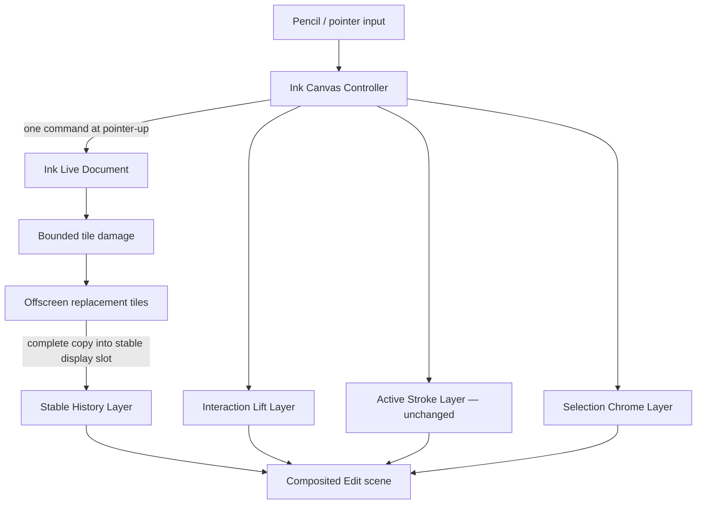

# Ink Semantic Layers and Transform-Only Interactions

- **Status:** Selection movement accepted by the user; scroll and destructive-command continuity
  implemented locally with focused installed-Obsidian and iPad acceptance pending
- **Scope:** Edit-mode selection, move, undo, redo, eraser presentation, and their interaction with
  retained historical tiles, scroll, and zoom
- **Applies to:** Pen and Highlighter; empty, 1k-stroke, and 10k-stroke / 30-surface documents;
  desktop Obsidian and iPad Obsidian
- **Builds on:**
  - `2026-07-16-ink-stage-frame-and-native-navigation.md`
  - `2026-07-17-ink-native-feel-performance-and-brush-fidelity.md`
  - `2026-07-20-ink-responsive-commands-save-and-preview.md`
  - `2026-07-20-ink-retained-tile-scene-and-worker-rasterization.md`
  - `2026-07-21-ink-simple-snapshot-persistence.md`
- **Supersedes:** Any planned production cutover to a new WebGL/WebGPU renderer for the current
  selection, move, undo, redo, or eraser problems; any interpretation that permits a selection drag
  to mutate the Ink Live Document on every animation frame

## Executive Decision

Inkstone SHALL keep the accepted Canvas2D brush pipeline, retained historical tiles, Active Stroke
Presentation, Preview tile path, and simple snapshot persistence. It SHALL NOT perform a broad GPU
renderer rewrite to fix command flicker or selection latency.

Edit presentation will instead use a fixed number of **semantic layers**:

1. a stable retained History Layer;
2. a bounds-sized Interaction Lift Layer for selected Ink;
3. the existing Active Stroke Layer;
4. a lightweight Selection Chrome Layer.

The History Layer is immutable during a continuous interaction. Selection movement is represented by
one compositor transform on the Interaction Lift Layer. The Ink Live Document, bounds index, Undo
stack, retained tile content, and Brush Geometry do not change until pointer-up. At pointer-up, one
semantic move command is committed and only the affected old/new tiles are prepared and atomically
pixel-replaced through stable presentation slots.

Undo, redo, and eraser do not use a transparent overlay to simulate removal. A transparent upper
Canvas cannot erase Ink that belongs to a lower DOM layer. Destructive commands therefore use
complete, offscreen-prepared **replacement tiles** and retain the old complete pixels until the
replacement is ready. The final complete tile is copied into the existing connected display Canvas
in one publication operation. No visible tile is cleared, partially repainted, hidden, detached, or
replaced before the new complete result is ready. Patch composition itself MUST NOT use
`globalCompositeOperation = "copy"` on a bounded patch: browser Canvas semantics clear every pixel
outside that source image. A replacement is prepared as retained source → clear only the damage
rectangle → `source-over` the new patch. Full-canvas `copy` is allowed only for the final same-sized
publication.



## 1. Why the current move path is slow

This is a code-path diagnosis, not a final device profile claim.

The current selection drag is scheduled once per animation frame, but the work inside that frame is
not a simple presentation transform:

1. `InkCanvasController.flushSelectionPreview()` calls
   `InkDocumentSession.previewSelectionMove(dx, dy)`.
2. `previewSelectionMove()` translates every selected Logical Stroke, recomputes bounds, mutates the
   spatial index and ordered projection, increments document generation, and publishes an
   `InkDocumentChange`.
3. `syncUnpublishedSessionMutation()` reads and synchronizes the new document generation.
4. `updateRenderOverlay()` queries the visible world, sorts refs, filters selection, and submits a
   new overlay.
5. `InkRenderRuntime.drawOverlay()` recompiles/draws selected geometry when the overlay refs change.
6. Drag start and drag finish call `setCommittedExclusions()`, which damages committed tile content,
   cancels or resets raster work, and schedules replacement presentation.

The amount of work therefore grows with selected point count, selected stroke count, visible
history, and dirty tile coverage. It also mixes a transient gesture with semantic document state.
That coupling is unnecessary: during a drag, the user has changed only one transform `(dx, dy)`.

### Ranked, falsifiable hypotheses

| Rank | Hypothesis                                                                                                        | Disproof / confirmation signal                                                                                                                                |
| ---: | ----------------------------------------------------------------------------------------------------------------- | ------------------------------------------------------------------------------------------------------------------------------------------------------------- |
|    1 | Per-frame Live Document/index mutation is the primary selection-drag cost.                                        | A transform-only replay must make pointer-frame time history-independent and record zero document changes before pointer-up.                                  |
|    2 | Per-frame visible query/sort and overlay compilation causes additional lag for dense history or large selections. | Instrumented drag must record zero history queries, sorts, and geometry compiles after lift preparation.                                                      |
|    3 | Committed exclusion invalidation at drag boundaries produces the visible start/end hitch.                         | Preparing exclusion tiles once at selection ownership and retaining that ownership through the selection session must remove repeated boundary invalidations. |
|    4 | Replacing, hiding, or partially repainting a published tile causes command and scroll flashes.                    | A stable connected display Canvas plus a complete offscreen result and a first-presentation scroll fence must show continuous old-or-new coverage.            |

Implementation SHALL add the counters and deterministic replay needed to test these hypotheses
before claiming a root cause is closed.

## 2. Risk decision

### Rejected now: full GPU renderer cutover

A WebGL2/WebGPU renderer could eventually provide one GPU scene and explicit frame fences, but it
would also reopen accepted behavior across:

- Pen and Highlighter raster parity;
- Highlighter alpha applied once per Logical Stroke rather than once per triangle/chunk;
- anti-aliasing, joins, caps, pressure, tilt, and seam behavior;
- Active-to-Committed handoff;
- GPU context loss and WebKit fallback;
- memory, thermal, and device-specific behavior;
- Preview/Edit parity and export diagnostics.

That is a broad renderer migration, not the minimum change required for the present defects. The
current product evidence says Active drawing and Preview are acceptable; replacing them would create
more regression surface than benefit.

GPU remains an optional future `TileBuilder` or compositor backend behind the same contracts. It is
not an implementation Slice in this specification.

### Implementation status — 2026-07-21

- SL1–SL6 are implemented on the production selection path behind the existing capability boundary.
- Drag frames retain only the latest constrained delta and submit one compositor transform; they do
  not publish Live Document preview generations.
- Pointer-up clears the transient transform and commits exactly one application-layer move delta.
- Selected IDs retain one presentation owner across acquisition, repeated moves, command changes,
  deselection, and release. Exclusion adoption callbacks are fenced by presentation epoch.
- The semantic Lift reuses the existing bounded Active compositor stack rather than allocating a
  fourth full-viewport DPR backing. Active Pencil and selected-Lift presentation are mutually
  exclusive within that stack; their semantic ownership contracts remain distinct.
- Undo, redo, erase, delete, and other damaged commands prepare complete Canvas replacements
  offscreen, then copy the complete result into the existing connected tile Canvas in one
  publication operation. Published tile DOM identity remains stable and is never cleared first.
- Same-LOD scroll keeps the preceding complete coverage connected and visible through the first
  target-adoption frame. Retired tiles become reusable near-visible cache residents after that
  presentation fence rather than being hidden in the adoption task.
- The stable History Scene is mounted inside the pane-fixed, clipped Ink presentation surface. Its
  retained Tile children MUST NOT participate in Obsidian's native `scrollWidth` or `scrollHeight`.
  One Stage Frame camera matrix projects History, Active, Lift, and Chrome from the same world
  coordinates; scroll callbacks are coalesced to one transform per animation frame.
- A same-size, same-scale, same-LOD scroll settle performs zero backing-store dimension mutation. It
  MAY perform one bounded visible-tile recovery when the camera exposes previously absent tiles, but
  preceding complete coverage remains visible until the target coverage is ready.
- A projected Edit scroll Camera MUST NOT expose a content-bearing world region before its exact
  Tile is present. Cold prefetch remains responsible for overscan, but any still-missing
  content-bearing Tile in the next visible viewport becomes mandatory pre-Camera work; canonically
  empty regions require no backing Canvas.
- Scroll and zoom compose the Stage Frame camera matrix with the selection delta and do not query or
  compile selection geometry during the gesture.
- The legacy preview implementation remains available as the release rollback path. SL7 installed
  Obsidian replay, short iPad acceptance, and rollback cleanup remain pending.

### Chosen now: semantic multi-layer presentation

The chosen design reuses current Brush Geometry, Canvas2D drawing, Stage Frame, retained tile keys,
damage projection, and snapshot persistence. It changes only ownership and scheduling of transient
Edit interactions.

| Area                | Kept                                                       | Narrow change                                                            |
| ------------------- | ---------------------------------------------------------- | ------------------------------------------------------------------------ |
| Active Pencil path  | Existing stable/tail Active canvases and physical compiler | None                                                                     |
| Preview             | Existing immutable retained tiles                          | None                                                                     |
| Stable Edit history | Existing world tile scene and cache                        | Add stable display slots, complete-copy publication, and scroll fence    |
| Selection rendering | Existing Canvas brush adapter and geometry cache           | Render selected Ink once into a dedicated bounds/sparse-tiled lift group |
| Selection drag      | Existing hit test and semantic move result                 | Replace per-frame document mutation with one transform                   |
| Undo/redo/eraser    | Existing domain commands and damage bounds                 | Stage complete replacement tiles; no in-place visible clear              |
| Persistence         | Memory-first session and Done snapshot                     | None                                                                     |

## 3. Layer model and ownership

The implementation SHALL use a fixed number of semantic layers. It SHALL NOT create one DOM layer
per stroke or turn the complete 10k history into SVG nodes.

### L0 — Stable History Layer

- Owns all committed strokes except IDs explicitly owned by the Interaction Lift Layer.
- Uses the existing world-tile addressing, LOD, spatial residency, and overscan rules.
- A visible tile's DOM identity and backing dimensions are stable while it is published.
- Rebuild occurs in a detached Canvas, OffscreenCanvas, or inactive backing.
- Adoption prepares one complete replacement and publishes it into the stable display Canvas in one
  presentation operation; it never clears, detaches, hides, or resizes the published Canvas first.
- A bounded damage patch clears only its rectangle in the detached replacement. Patch-level `copy`
  is forbidden because it clears non-source pixels across the destination Canvas.
- Same-LOD scroll preserves the previous complete coverage through the first frame that adopts the
  new target coverage. Old coverage is retired only after that frame fence.
- The History Layer lives in the pane-fixed clipped surface and uses the same Stage Frame camera as
  every other Ink layer. Mounting 512 px Tile elements directly in the native scroller is forbidden:
  their sparse bounds can enlarge the native scroll range and combine native movement with a second
  Ink projection. Scroll bursts MUST be coalesced to one compositor transform and retain preceding
  coverage until newly demanded tiles are ready.
- Scroll and continuous zoom update tile demand through the Stage Frame; they do not rebuild
  selection geometry.

### L1 — Interaction Lift Layer

- Owns only selected Logical Stroke IDs during an active selection session.
- Uses the same compiled filled contours and Canvas2D composition as committed Ink.
- Renders selected Ink once when ownership is acquired; later move frames only update a transform.
- Is bounds-sized or internally sparse-tiled. It is not another viewport-sized backing store.
- Shares one group transform so a multi-stroke selection moves as one object.
- Preserves exact Pen color/alpha and once-per-Logical-Stroke Highlighter alpha.
- Remains authoritative for those selected IDs until a stable handoff completes; the History Layer
  must exclude the same IDs, preventing double opacity.

The semantic layer may contain several bounded internal canvases for a large or viewport-spanning
selection. Those canvases are implementation tiles within one layer, not new semantic layers.

### L2 — Active Stroke Layer

- Remains the existing latency-first Active stable/tail presentation.
- Never waits for History, Lift, command tiles, persistence, Worker, or selection work.
- This specification does not change its compiler, prediction, promotion, or performance budgets.

### L3 — Selection Chrome Layer

- Owns bounds, hover, handles, affordances, and hit-feedback only.
- Does not redraw the physical stroke pixels.
- Uses CSS/SVG/Canvas chrome as appropriate, but is independent of historical tiles.
- During move, applies the same transform as the Lift Layer.

### Layer order

```text
Selection Chrome
Active Stroke
Interaction Lift
Stable History tiles
Markdown document
```

The exact DOM nesting may differ, but ownership and visual order SHALL remain equivalent.

## 4. Selection and move state machine

### 4.1 Select / acquire ownership

When stroke IDs become selected:

1. Resolve and cache the selected refs and compiled geometry once.
2. Prepare affected History tiles that exclude those IDs while the current complete tiles remain
   visible.
3. Prepare the Lift Layer at transform `(0, 0)` using the exact selected Ink.
4. In one scheduled presentation step, adopt the exclusion tiles and reveal the Lift Layer.
5. Because both presentations show the selected Ink in the same position, the ownership transfer
   must be visually identical: no duplicate, dimming, flash, or alpha change.

Direct pointer-down-and-drag may start before preparation completes. The controller may accumulate
the latest delta, but SHALL NOT show both the old selected Ink and a translated copy. Preparation is
a prerequisite visible-presentation task and must meet the first-lift budget below. The controller
MUST NOT acquire the session/global interaction fence before that prerequisite completes: the fence
pauses visible work, so doing so creates the cycle
`interaction fence -> ownership tile paused -> Lift unavailable -> fence not released`. The
controller may acquire the fence only after both the drag threshold and exact Lift ownership are
ready, and it releases the fence synchronously on pointer-up/cancel.

### 4.2 Drag

For every pointer move:

1. Convert the sample to the frozen Stage Frame's logical coordinate plane.
2. Clamp the delta using a precomputed selection constraint.
3. Replace one in-memory `latestDelta` value.
4. At most once per animation frame, apply a `translate3d`/matrix transform to the Lift and Chrome
   groups.

The drag hot path SHALL perform:

- zero Live Document mutations;
- zero document generation increments;
- zero Undo commands;
- zero bounds-index updates;
- zero retained-tile invalidations;
- zero history queries or sorts;
- zero Brush Geometry compilation after lift preparation;
- zero Canvas clears or redraws of selected stroke pixels;
- zero persistence work.

### 4.3 Commit

Pointer-up commits one atomic semantic command with the final delta:

```ts
interface InkSelectionMoveCommit {
  readonly selectedIds: readonly string[];
  readonly dx: number;
  readonly dy: number;
}
```

The application layer SHALL provide a single-delta move operation. The controller SHALL NOT emulate
it by publishing one final preview mutation and then a second commit mutation.

After semantic commit:

1. the Lift Layer remains at the final transform;
2. the History Layer remains excluded for Lift-owned IDs;
3. old/new affected tiles build from the committed revision;
4. no selected ID is rendered into History while the Lift owns it;
5. selection may keep ownership across repeated moves;
6. deselection schedules one stable ownership handoff back to History.

### 4.4 Cancel

Cancel discards `latestDelta`, restores transform `(0, 0)`, and performs no document command. If the
selection session ends, ownership returns to History only through the same complete handoff used by
deselection.

### 4.5 Deselect / return ownership

1. Prepare complete History replacement tiles including the Lift-owned IDs at their committed
   positions.
2. Keep the Lift visible until every affected visible replacement tile is complete.
3. Adopt replacement tiles and retire the Lift in one presentation transaction.
4. Release cached selection-only geometry and canvases after the next frame fence.

There SHALL be no frame in which the selected stroke appears in both layers or neither layer.

## 5. Undo, redo, and eraser presentation

### 5.1 Why an upper transparent layer is insufficient

Canvas compositing is isolated per DOM Canvas. `destination-out` on an upper Canvas cannot erase
pixels already drawn into a lower Canvas. Therefore destructive commands cannot be fixed by merely
adding an Eraser Layer.

### 5.2 Complete replacement tile contract

For every command damage set:

- The old visible tile remains untouched and visible.
- The new complete tile is rendered into an inactive backing.
- Empty/transparent regions are part of the completed tile result. Publication uses a full-tile
  `copy` operation so transparent replacement pixels remove old pixels without a preceding clear.
- A visible Canvas is never cleared and reused before replacement is ready.
- The existing connected Canvas node and compositor slot remain stable across publication.
- The tile registry changes content generation only after the full replacement is ready.
- Superseded command generations are discarded before adoption.
- Tiles outside conservative damage remain unchanged.

### 5.3 Additive commands

An additive undo/redo result may use a small command overlay for immediate feedback only if the
overlay uses exact final geometry and remains until the replacement tiles are complete. The same
Logical Stroke ID may not be visible in both overlay and History.

### 5.4 Destructive commands

Erase, delete-selection, undo-add, redo-delete, and any command that removes pixels must use
complete replacement tiles. Toolbar state may update immediately, but visible Ink changes only when
the first complete affected result is ready. The command budget requires that to occur promptly;
flickering, blanking, or showing a partially cleared result is forbidden.

### 5.5 Interaction priority

Command replacement work runs in the interactive/visible lane, ahead of background prefetch, Preview
encode, idle drafts, cache GC, and cold canonical preparation. It still yields to an active Pencil
contact.

## 6. Scroll and zoom

- History, Lift, Active, and Chrome consume one complete Stage Frame epoch.
- Continuous scroll/zoom updates camera transforms only.
- A Lift selection uses world coordinates and follows the same camera matrix as History.
- No selected geometry is recompiled because the viewport moved.
- No ownership handoff begins while the viewport gesture is active.
- LOD replacement and deselection handoff occur after settle while old complete coverage remains.
- For a same-LOD scroll, target tiles are adopted before prior non-overlapping coverage is retired;
  retirement is fenced to a later presentation frame and retains reusable cache residency.
- If Pencil contact begins, Active Stroke retains the previously accepted frozen Stage Frame
  contract.

## 7. Memory and complexity bounds

- The implementation adds no fourth full-viewport DPR backing store.
- Lift backing is limited to selected geometry intersecting viewport plus overscan and is internally
  tiled when bounds exceed the safe Canvas dimension or budget.
- Interaction tiles participate in the existing mandatory-presentation memory accounting.
- The total semantic layer count is fixed; sparse tiles do not create per-stroke DOM ownership.
- Compiled selection geometry is keyed by stroke content generation and reused across drag frames.
- On deselect, note switch, host replacement, cancel, or runtime disposal, Lift ownership and
  backings are released deterministically.
- Worker/OffscreenCanvas may build inactive tiles through the existing adapter boundary. Worker
  success is optional and never changes presentation semantics.

## 8. Compatibility and non-goals

### Preserved contracts

- Sidecars/snapshots remain canonical; render layers are disposable.
- Pen and Highlighter geometry, colors, alpha, pressure, tilt, and seams remain unchanged.
- Undo grouping and logical stroke identity remain unchanged.
- Selection hit testing remains in the application/domain model.
- Preview remains read-only and does not mount selection or Live Document machinery.
- Done, idle draft, navigation prompts, and save failure behavior remain unchanged.

### Non-goals

- No WebGL/WebGPU production renderer.
- No rewrite of the brush compiler.
- No per-stroke SVG/DOM scene for full history.
- No new persistence format or concurrency protocol.
- No animated crossfade between two semantically different Ink revisions.
- No attempt to make a transparent upper Canvas erase lower-layer pixels.

## 9. Runtime interfaces

Names are illustrative; implementation may refine them without changing the contracts.

```ts
interface InkInteractionLiftPresenter {
  acquire(selection: readonly InkRenderableStrokeRef[]): Promise<InkLiftToken>;
  presentDelta(token: InkLiftToken, dx: number, dy: number): void;
  holdThrough(token: InkLiftToken, documentGeneration: number): void;
  releaseAfterStableAdoption(token: InkLiftToken): Promise<void>;
  cancel(token: InkLiftToken): void;
}

interface InkStableTilePresenter {
  prepareOwnershipExclusion(strokeIds: readonly string[]): Promise<InkTileAdoption>;
  prepareDocumentDamage(change: InkDocumentChange): Promise<InkTileAdoption>;
  adoptComplete(adoption: InkTileAdoption): void;
}

interface InkSelectionMoveUseCase {
  constraint(selectedIds: readonly string[]): InkTranslationConstraint;
  commitDelta(command: InkSelectionMoveCommit): InkDocumentChange | null;
}
```

`presentDelta()` is presentation-only. It SHALL NOT expose an `InkDocumentReadView` or application
mutation callback.

## 10. Performance and visual budgets

Existing S27/S34/S46 drawing, frame, cache, and heat budgets remain authoritative. This
specification adds focused interaction budgets:

| ID          | Budget                                                                                                                                                      |
| ----------- | ----------------------------------------------------------------------------------------------------------------------------------------------------------- |
| `INK-SL-01` | Selection pointer-move handler P99 <= 2 ms.                                                                                                                 |
| `INK-SL-02` | Transform submission P99 <= 2 ms and <= one submission per animation frame.                                                                                 |
| `INK-SL-03` | First exact Lift ownership presentation <= 2 refresh intervals after drag threshold for empty and 1k fixtures.                                              |
| `INK-SL-04` | After acquisition, drag-frame document changes, index writes, geometry compiles, history queries, tile invalidations, and Canvas redraw calls are all zero. |
| `INK-SL-05` | Pointer-up creates exactly one semantic move command and one conservative damage set.                                                                       |
| `INK-SL-06` | Drag cost from strokes 1–10 through 10k history is statistically flat within the existing repeatability tolerance.                                          |
| `INK-SL-07` | Undo/redo/erase never exposes a blank tile, half-cleared tile, duplicated stroke, or stale-plus-new composite.                                              |
| `INK-SL-08` | Pen and Highlighter raster digest/parity remains unchanged outside selection chrome.                                                                        |
| `INK-SL-09` | Selected Highlighter opacity remains bitwise/effectively equal before acquire, during drag, after commit, and after deselect.                               |
| `INK-SL-10` | Scroll/zoom with an active selection performs zero selection geometry compiles during the gesture.                                                          |
| `INK-SL-11` | Select-and-drag ownership converges without a scheduler deadlock: visible ownership remains runnable before the interaction fence is acquired.              |

## 11. Focused feedback loop

Development SHALL not begin with the full long-running physical Gate.

### Deterministic local replay

Add a focused installed-Obsidian scenario covering:

- Pen and Highlighter;
- one stroke, multi-selection, long stroke, and viewport-spanning selection;
- empty, 1k, and 10k / 30-surface history;
- 120 pointer moves at fixed 60 Hz input timestamps;
- move commit, cancel, deselect, undo, redo, stroke erase, selection delete;
- scroll and zoom while selection ownership is active.
- a production-equivalent scheduler replay where selection interaction fencing pauses cold work but
  cannot pause its own pending ownership presentation;

Raw evidence SHALL include per-frame counters for document mutations, queries, sorts, compiles,
Canvas draws/clears, tile invalidations, tile adoptions, and Lift transform submissions.

### Visual oracle

Capture deterministic frames at:

1. before ownership;
2. ownership acquired at `(0, 0)`;
3. mid-drag;
4. pointer-up before stable adoption;
5. stable adoption;
6. deselection;
7. each destructive command adoption.

The analyzer compares expected logical stroke coverage and alpha. It fails on old-position ghosts,
new-position gaps, double Highlighter opacity, blank dirty regions, or repeated tile accumulation.

### Physical acceptance

Only after unit, integration, focused installed-Obsidian replay, and existing local performance
budgets pass should one short iPad session verify:

- direct select-and-drag response;
- repeated move without cumulative lag;
- undo/redo/erase without flash;
- scroll/zoom while selected;
- Pen/Highlighter unchanged.

## 12. Incremental implementation plan

Each Slice is independently reversible. The old selection presentation path remains behind an
internal rollback switch until the focused Gate and one physical session pass.

### Slice SL0 — Instrument and reproduce

- Add the focused deterministic selection/command replay.
- Add hot-path counters and frame capture points.
- Confirm or reject the four hypotheses in Section 1.
- No production behavior change.

### Slice SL1 — Atomic single-delta move use case

- Add a domain/application command that accepts selected IDs plus final delta once.
- Add bounds/clamp calculation that can be prepared before drag.
- Preserve existing Undo semantics and spatial-index correctness.
- Stop publishing preview generations in the new flagged path.

### Slice SL2 — Interaction Lift prototype behind a flag

- Reuse current Canvas brush compilation/drawing.
- Introduce bounds-sized/sparse-tiled selected-Ink ownership.
- Apply transform-only drag and Chrome synchronization.
- Keep Active Stroke, Preview, and History builders unchanged.

### Slice SL3 — Stable ownership handoff

- Prepare History exclusion/inclusion tiles offscreen.
- Adopt Lift acquire/release without gap, duplicate, or Highlighter alpha change.
- Hold ownership across repeated moves.
- Add cancellation, host replacement, view switch, and disposal cleanup tests.

### Slice SL4 — Selection/move cutover

- Route the production selection drag through SL1–SL3.
- Delete no old code yet.
- Run focused local replay and standard unit/performance suites.
- Enable only after evidence passes.

### Slice SL5 — Complete replacement tiles for commands

- Audit current tile adoption for in-place clear/reuse and mixed-generation exposure.
- Make undo, redo, erase, and delete use complete staged replacement tiles copied into stable
  connected display slots.
- Use exact additive overlay only where ownership is unambiguous.
- Add rapid alternating command and cancellation tests.

### Slice SL6 — Viewport interaction integration

- Share one Stage Frame transform across History, Lift, Active, and Chrome.
- Prove scroll/zoom performs no selection recompile.
- Test LOD settle and deselection handoff after a viewport gesture.

### Slice SL7 — Gate and cleanup

- Run focused installed-Obsidian replay, then the existing relevant local Gate subset.
- Run one short iPad acceptance session.
- Remove the old per-frame preview path only after acceptance.
- Retain a single release rollback switch for one stabilization cycle.

## 13. Rollback and stop conditions

Immediately disable the new path if any Slice regresses:

- Active Pencil move/pen-up budgets;
- Pen/Highlighter raster parity;
- stroke persistence after Done/reopen;
- Undo grouping or selection semantics;
- Preview position/coverage;
- memory/backing-store bounds;
- scroll/zoom continuity.

Because the change is isolated behind selection/command presentation interfaces, rollback restores
the former path without reverting retained tiles, Preview, persistence, or brush work.

## 14. Acceptance criteria

This specification is complete only when:

- selection drag is transform-only after one bounded acquisition;
- pointer-up produces one semantic move command;
- selected strokes never appear in two owning layers or zero owning layers;
- undo, redo, and eraser use complete tile replacement with no visible flash;
- selection, movement, scroll, and zoom remain history-independent on the focused Gate;
- Active drawing and Preview retain their accepted behavior;
- all new memory and presentation work remains bounded and observable;
- local automated evidence and one short iPad session pass.

## 15. Flicker root cause and short Visual Gate amendment

The 2026-07-21 follow-up found four independent deterministic causes behind the remaining flashes
and scroll drift:

1. a bounded `copy` patch cleared every pixel outside the patch on the detached replacement tile;
2. scroll settle called the backing-replacement path even when scale, LOD, and pane dimensions were
   unchanged, while the fixed History Scene attempted to follow WebKit asynchronous scrolling from
   JavaScript.
3. after a command synchronously published its `InkDocumentChange`, the explicit-exit session
   published a second read containing only dirty/persistence-state changes. The Controller treated
   that same-generation read as an unpublished content mutation and called `installDocument()`,
   synchronously clearing every retained History tile before the bounded command patch ran.
4. an added-only change matching the current Active promotion bypassed the retained-tile command
   patch and drew the completed stroke into the pane-fixed committed Canvas. History tiles followed
   the native scroller, but that promoted copy followed the pane, so a subsequent scroll could show
   the same new stroke at two different screen positions.
5. the native-scroller History host exposed full sparse Tile rectangles as scrollable overflow. A
   Tile at the right or bottom edge could enlarge the document scroll range even when its visible
   Ink stayed inside the pane, producing an unexpected horizontal scrollbar and double-applied
   movement.

The Controller SHALL therefore use `(documentId, document generation)` as the History Scene content
identity. A null-change read MAY update dirty state, persistence state, toolbar state, or session
metadata, but MUST NOT reinstall History when that identity is unchanged. A published document
change advances the rendered identity after it has been handed to `applyDocumentChange()`. If a
selection-owned presentation deliberately defers an install, the rendered identity remains old so a
later eligible synchronization still installs the content.

Every completed added stroke MUST be adopted into its intersecting History tiles before temporary
Canvas ownership is retired. The pane-fixed committed Canvas is only a handoff surface and MUST be
cleared and hidden once the exact bounded Tile patch is published. If that patch cannot be
published, Active remains the visible owner until an exact History replacement is ready.

Both causes are testable without subjective timing guesses. The short Gate SHALL run before the
five-minute performance Gate and SHALL finish in roughly one minute including build/reload:

1. `npm run gate:ink-canvas-pixels` bundles the production patch compositor into real headless
   Chrome and verifies exact RGBA preservation outside a one-pixel damage rectangle.
2. `npm run gate:ink-visual` installs the current local-Gate build into the owned synthetic Vault,
   opens real Obsidian, and samples every presentation frame across forward/reverse scroll, a newly
   drawn and submitted stroke followed by another scroll, restyle, Undo, Redo, erase, and Undo.
3. The real-host analyzer requires zero blank History frames, at least one nontransparent visible
   tile per frame, History/Markdown relative drift no greater than 1 CSS px, zero same-LOD backing
   mutation, at most one bounded visible-tile recovery, zero native horizontal overflow, and zero
   nontransparent Ink in the pane-fixed committed Canvas after submission.
4. A failure writes raw per-frame observations and the exact failed budgets to
   `S27 Short Visual Gate Result.json` in the owned test Vault. It does not run the five-minute
   soak.

The DOM/pixel sampler is a fast fail-closed regression check, not a substitute for the final iPad
compositor observation. A visible iPad flash still fails acceptance even if the short local Gate
passes.

The companion Canvas pixel Gate SHALL also sample the first animation frame after every projected
scroll step, before settle. A long deterministic stroke crossing multiple Tile rows must have no gap
larger than two anti-aliasing pixels at DPR 1/2 and scale 1/0.5. A settle-only assertion is not
evidence for scroll continuity because missing target Tiles can become available after the user has
already seen a blank frame.

## Source Manifest

### Sources

- User decisions in the current Codex task on 2026-07-21:
  - avoid a high-risk GPU rewrite;
  - prefer a multi-layer alternative;
  - include selection and movement lag/rendering defects;
  - protect already accepted drawing behavior from regressions.
- Repository commit `be8fc1b` (`feat: add retained ink tiles and snapshot persistence`).
- `CONTEXT.md`.
- `AGENTS.md`.
- `docs/specs/2026-07-16-ink-stage-frame-and-native-navigation.md`.
- `docs/specs/2026-07-17-ink-native-feel-performance-and-brush-fidelity.md`.
- `docs/specs/2026-07-20-ink-responsive-commands-save-and-preview.md`.
- `docs/specs/2026-07-20-ink-retained-tile-scene-and-worker-rasterization.md`.
- `docs/specs/2026-07-21-ink-simple-snapshot-persistence.md`.
- `src/ui/ink-canvas-controller.ts` selection scheduling, synchronization, overlay query, and
  committed-exclusion paths.
- `src/application/ink-document-session.ts` selection preview and commit paths.
- `src/ui/ink-render-runtime.ts` overlay drawing, committed exclusion, damage, and retained tile
  presentation paths.
- Real Chrome proof that patch-level `copy` clears non-damage pixels, captured by
  `scripts/ink-canvas-pixel-gate.mjs` on 2026-07-21.
- `/Users/ivan/.agents/docs/agents/workflows.md`.
- `/Users/ivan/.agents/docs/agents/handoff-policy.md`.

### Produced artifacts

- `docs/specs/2026-07-21-ink-semantic-layers-and-transform-only-interactions.md`.
- Updated `docs/specs/README.md`.
- Updated `AGENTS.md` source-of-truth index.
- `src/application/ink-document-session.ts`: immutable selection constraint plus atomic move-delta
  command.
- `src/ui/ink-canvas-controller.ts`: transform-only drag, stable selection ownership, and
  one-command handoff.
- `src/ui/ink-render-runtime.ts`: composed interaction transform, ownership presentation fence, and
  complete replacement-tile adoption.
- `src/ui/ink-canvas-patch.ts`: exact detached replacement composition that preserves pixels outside
  the damage rectangle.
- `scripts/ink-canvas-pixel-gate.mjs` and `scripts/ink-short-visual-gate.mjs`: fast real-browser and
  real-Obsidian continuity checks.
- Focused application, controller, runtime, and performance regressions in the corresponding test
  files.

### Verification evidence

- Code-path inspection confirms the current drag loop mutates the Live Document and bounds index,
  publishes document generations, synchronizes overlays, and invalidates committed exclusions.
- The current accepted baseline was committed as `be8fc1b` after `npm run check` passed: 1,594 unit
  tests and 99 performance tests, plus format, lint, typecheck, build, and mobile bundle checks.
- The implemented semantic-layer change passed `npm run check` on 2026-07-21: 1,606 unit/integration
  tests and 102 performance tests, plus format, lint, typecheck, production build, and mobile bundle
  checks.
- Automated regressions prove zero Live Document preview publication during direct drag, one final
  semantic move generation, ownership reuse across repeated drags, complete tile-copy publication
  through stable connected Canvas nodes, same-task Lift acquire/release with History adoption,
  transform-only selection projection during zoom, and a same-LOD scroll presentation fence that
  keeps preceding coverage visible through the first target-adoption frame.
- A Controller regression using the real explicit-exit `InkLiveDocument` proves that the
  post-command dirty-state read does not call `installDocument()` again. The focused Controller,
  Runtime, and local-Gate suites pass 239 tests.
- `npm run gate:ink-canvas-pixels` passes against real Canvas pixels, preserving every pixel outside
  the bounded damage rectangle.
- `npm run gate:ink-visual` passes all 32 sampled real-Obsidian frames across bidirectional scroll,
  new-stroke submission and scrolling, restyle, Undo, Redo, erase, and Undo with zero blank History
  frames, coverage loss, History/Markdown drift, or pane-fixed committed Ink. Raw evidence is
  written to `test-fixtures/vault/S27 Short Visual Gate Result.json`.
- Prettier formatting, balanced-fence/local-link structural checks, and `git diff --check` passed
  for this specification and its two indexes on 2026-07-21.

### Open questions and risks

- The relative contribution of the removed document mutation, overlay query/compile, and tile
  invalidation requires the focused installed-Obsidian profiler/replay before assigning final root
  cause percentages.
- Direct select-and-drag is presentation-fenced until exclusion ownership is ready and retains the
  latest requested delta. Installed Obsidian must still verify the first-lift deadline and absence
  of an old-position ghost on a real compositor.
- Very large selections require sparse-tiled Lift presentation under the existing memory budget; one
  unbounded Canvas is forbidden.
- Stable-slot complete tile publication and the scroll presentation fence must be audited in the
  real DOM/compositor path. Passing jsdom pixel logic alone is insufficient to claim flicker
  removal.
- Viewport-spanning destructive commands may temporarily hold old tiles, dirty patches, and complete
  replacements in the same task. The allocation is bounded, but installed/iPad evidence must verify
  peak backing-store and thermal behavior before SL7 passes.
- GPU remains a possible future backend only after the Canvas semantic-layer contracts are stable
  and a separate profile proves that tile construction, not interaction ownership, is the remaining
  bottleneck.
