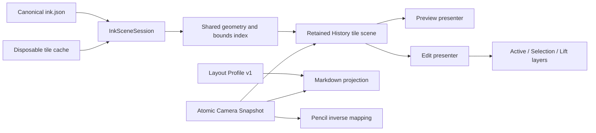

# Ink Shared Scene, Deterministic Layout, and Atomic Camera

## Status

- Created: 2026-07-21
- Status: corrective implementation in progress; physical iPad verification failed on WKWebView
- Scope: iPad first presentation, Preview/Edit scene reuse, horizontal containment, cross-device
  layout parity, and immediate post-zoom input correctness
- Primary target: Obsidian 1.12.7 on macOS and iPadOS at 60 Hz

This specification is a corrective follow-up to:

- `2026-07-16-ink-704-zoomable-workspace.md`
- `2026-07-16-ink-stage-frame-and-native-navigation.md`
- `2026-07-20-ink-responsive-commands-save-and-preview.md`
- `2026-07-20-ink-retained-tile-scene-and-worker-rasterization.md`
- `2026-07-21-ink-semantic-layers-and-transform-only-interactions.md`

Those specifications remain authoritative except where this document explicitly strengthens or
supersedes their contracts. In particular, this document:

1. supersedes the earlier non-goal of fixed Ink-mode typography;
2. requires Preview and Edit to share one disposable History Scene for the same pane, note,
   revision, layout profile, and renderer;
3. strengthens Stage Frame publication into an atomic, epoch-stamped Camera Snapshot contract; and
4. closes the physical-runtime gap between the existing no-overflow/no-transparent-frame contracts
   and the behavior observed on iPad.

## Executive Decision

The four iPad defects do not justify replacing Canvas with SVG, WebGL, WebGPU, or a native drawing
framework. They are lifecycle, scheduling, containment, layout, and coordinate-publication defects.

The approved architecture is:

- Canvas2D remains the accepted Active Stroke and retained History renderer.
- The user experiences one reusable History Scene; the implementation stores that scene as bounded
  retained tiles rather than one unbounded full-page bitmap.
- Preview and Edit mount different interaction layers over the same History Scene. A mode switch
  must not reraster unchanged history.
- Visible work executes several already-bounded work units inside one frame budget. The scheduler
  must not pay one `requestAnimationFrame` delay per stroke or per tile operation.
- Every Ink-mode Markdown projection uses a versioned Layout Profile so the document origin, line
  boxes, wrapping, and headings are deterministic on macOS and iPadOS.
- Zoom presentation and Pencil input consume the same immutable Camera Snapshot epoch. Stale
  transforms are never used for a new contact.
- Worker and `OffscreenCanvas` remain optional accelerators behind the same contracts. They are not
  correctness dependencies and are not required before this specification can pass.



## Problem Evidence

The 2026-07-21 physical iPad walkthrough established four release-blocking defects.

| ID  | Observed defect                         | Physical symptom                                                                                  | Confirmed implementation pressure                                                                                                                                                                                       |
| --- | --------------------------------------- | ------------------------------------------------------------------------------------------------- | ----------------------------------------------------------------------------------------------------------------------------------------------------------------------------------------------------------------------- |
| D1  | Slow first presentation and transitions | Opening Preview, entering Edit, and returning to Preview can take several seconds                 | Visible scheduling yields before every noninteractive unit; Preview compiles and draws per visible stroke and per tile; Preview and Edit own separate controllers and do not transfer a retained History Scene          |
| D2  | Default Preview horizontal overflow     | iPad Preview at default size shows a horizontal scrollbar                                         | The Preview viewport is 744 CSS px, but the retained scene starts at the document's 24 px inset while retaining a 744 px width, producing a right edge at 768 px and `scrollWidth = 752` for a `clientWidth = 744` host |
| D3  | macOS/iPad Ink-to-text mismatch         | The same saved Ink is positioned differently relative to the title and body text                  | Sidecars record layout observations, but the runtime applies only width, height, and zoom; Obsidian mobile and desktop typography/padding remain free to reflow independently                                           |
| D4  | Post-zoom Pencil displacement           | A Pencil contact immediately after zoom can appear far from the tip and may recover seconds later | CSS zoom is applied before a coherent measured inverse is published; the WebKit fallback scales `left` and `top` about the viewport origin; delayed probes at 120/500/1500 ms can later replace the stale mapping       |

The current UAT note used during diagnosis is approximately 262 KB with 47 strokes and 1,197
samples. That payload is too small for JSON parsing or brush geometry alone to justify a
multi-second blank period. The observed duration is consistent with lifecycle duplication and a
frame-per-unit scheduling tax.

The live Safari inspection also established:

- `window.innerWidth = 744`, `devicePixelRatio = 2`;
- Preview `clientWidth = 744`, `scrollWidth = 752`;
- the logical Ink workspace begins at x = 24 and has width 704;
- the fixed Ink surface begins at x = 0 and has width 744; and
- the retained tile scene begins at x = 24 and has width 744.

The follow-up physical Safari inspection established two additional WebKit-specific facts:

- the 744 px mobile host retains 24 px inline padding while the 704 px deterministic workspace
  already owns its own 24 px internal padding, leaving only 696 px of host content width and
  deterministically producing `scrollWidth = 752`; and
- in the inspected iPad WKWebView, a scheduled `requestAnimationFrame` can remain pending for
  multiple seconds while timers continue to run. A frame callback is therefore not a safe
  correctness barrier for first presentation or Pencil admission.

### 2026-07-21 physical-iPad corrective amendment

This amendment supersedes `INK-SLC-48`, `INK-SLC-49`, and steps 3/6 of the earlier Atomic
publication order below:

1. The authored scale, CSS presentation, measured Stage Frame, render projection, and Pencil inverse
   are published synchronously in the zoom command task. The animation frame may refine presentation
   or LOD afterwards, but it is not the commit point.
2. A raw `PointerEvent`, `TouchEvent`, or `Touch` object is never retained and replayed after the
   browser dispatch returns. WebKit may recycle or expose time-dependent coordinates from these
   objects.
3. A new Pencil contact after the zoom command consumes the synchronously published Stage Frame. It
   never waits for `requestAnimationFrame`.
4. Preview visible work prefers a frame boundary but owns a bounded 32 ms timer fallback; the first
   callback wins. Stalled or throttled animation frames cannot create a multi-second blank view.
5. On mobile, the Ink host owns zero outer padding. The versioned 704 px workspace is the single
   owner of deterministic document padding. Ink presentation surfaces remain layout-neutral.

These are correctness contracts, not performance relaxations. A later animation frame may improve
sharpness, but it cannot change where an already accepted contact maps.

These values make D2 deterministic rather than a theme-only visual anomaly.

## Goals

1. Eliminate multi-second blank or incomplete waits when opening Ink Preview or switching between
   Preview and Edit.
2. Reuse unchanged historical pixels, compiled geometry, bounds, and indexes across Preview/Edit
   transitions.
3. Ensure Ink presentation layers never create native horizontal or vertical overflow.
4. Make Ink-mode Markdown geometry deterministic across macOS and iPadOS.
5. Guarantee correct Pencil coordinates on the first contact after any accepted zoom or resize.
6. Preserve all previously accepted writing latency, physical brush, tile memory, scrolling,
   selection, eraser, undo/redo, explicit Done, and simple snapshot persistence behavior.
7. Add automated gates that reproduce each defect without requiring repeated human drawing.

## Non-Goals

- Replacing Canvas2D with pure SVG.
- A broad WebGL, WebGPU, Metal, or PencilKit migration.
- Persisting a full-page raster image in `ink.json`.
- Making raster cache files canonical or syncable.
- Reintroducing Recovery Journal, revision-chain merge, or strong concurrent-writer semantics.
- Reflowing or rebasing existing Ink silently when a legacy note uses a different layout profile.
- Guaranteeing pixel-identical typography on Windows or Linux in this Slice. Layout Profile v1
  freezes the current macOS/iPadOS product target; other platforms remain compatible but require a
  later bundled-font product decision for exact parity.
- Running the full long-duration performance Gate during every implementation step. Targeted tests
  run per Slice; the real Obsidian Gate runs once after all code and unit tests are green.

## Domain Terms

### InkSceneSession

A disposable, pane-and-note-scoped runtime owner of:

- the observed canonical revision;
- the shared stroke bounds/index;
- compiled immutable stroke geometry by content digest;
- the retained History tile scene and its residency;
- memory/disk raster cache handles;
- the active Camera Snapshot; and
- Preview/Edit presenter attachments.

An `InkSceneSession` is not the canonical document and never writes sidecars directly. It may be
destroyed at any time and rebuilt from `ink.json`.

### History Scene

The visual projection of committed strokes for one scene identity. It is logically one scene but is
physically represented by bounded tiles. Preview and Edit reference the same History Scene whenever
their identities are compatible.

### Mode Presenter

A lightweight adapter that attaches mode-specific behavior to an `InkSceneSession`:

- Preview: pointer-transparent History presentation only.
- Edit: History plus Active, Selection, Interaction Lift, toolbar, and input routing.

Changing presenters must not imply rebuilding History.

### Layout Profile

A versioned contract for every geometry-affecting Markdown style used in Ink Preview/Edit. Theme
colors may vary; layout metrics may not.

### Camera Snapshot

An immutable, epoch-stamped set of forward and inverse transforms published as one transaction:

```ts
interface InkCameraSnapshot {
  readonly epoch: number;
  readonly logicalToClient: DOMMatrixReadOnly;
  readonly clientToLogical: DOMMatrixReadOnly;
  readonly paneRect: Readonly<{ left: number; top: number; width: number; height: number }>;
  readonly documentOriginInPane: Readonly<{ x: number; y: number }>;
  readonly scale: number;
  readonly scrollLeft: number;
  readonly scrollTop: number;
}
```

The History Scene, Markdown stage, Active layer, hit testing, and Pencil mapper must consume the
same accepted epoch.

### Presentation Readiness

Readiness is not a single boolean. Diagnostics and UI distinguish:

1. `text-ready`: Markdown has mounted under the accepted Layout Profile;
2. `history-first-pixel`: at least one demanded exact or accepted fallback tile is visible;
3. `history-viewport-exact`: all currently visible exact tiles are presented;
4. `edit-interactive`: logical strokes, bounds, hit testing, and input routing are ready; and
5. `cache-published`: disposable raster publication has completed in a cold lane.

No UI may delay `history-first-pixel` while waiting for states 3–5.

## Normative Product and Architecture Contracts

### A. Scene Ownership and Mode Reuse

| ID         | Contract                                                                                                                                                                                                                                            |
| ---------- | --------------------------------------------------------------------------------------------------------------------------------------------------------------------------------------------------------------------------------------------------- |
| INK-SLC-01 | One pane showing one note owns at most one live `InkSceneSession` for a compatible scene identity. Preview/Edit mode is not part of that identity.                                                                                                  |
| INK-SLC-02 | Scene identity is `(noteKey, canonicalRevision, layoutProfileVersion, projectionDigest, rendererVersion, colorProfile)`. Scroll position, toolbar state, interaction tool, viewport dimensions, and exact zoom percentage are not content identity. |
| INK-SLC-03 | Preview and Edit attach to the same compatible History Scene. They must not allocate a second History root, reparse canonical Ink, rebuild the same bounds index, or recompile unchanged strokes.                                                   |
| INK-SLC-04 | Entering Edit retains Preview History pixels continuously. Edit mounts Active/Selection/Lift/Input layers above those pixels.                                                                                                                       |
| INK-SLC-05 | Entering Preview after a successful Done rebinds the exact live History Scene to the newly persisted canonical revision. It must not reraster unchanged tiles merely because the presenter changed.                                                 |
| INK-SLC-06 | Discard restores the already-retained canonical root. Cancel keeps Edit and its memory state. Neither action clears History before its replacement is ready.                                                                                        |
| INK-SLC-07 | A truly external canonical change creates a staged replacement root. The currently presented root remains visible until the replacement owns complete demanded coverage.                                                                            |
| INK-SLC-08 | File deletion, pane detachment, or note switch releases presenter references immediately and releases the Scene Session through bounded LRU/memory-pressure rules. Stale scene pixels must never attach to another note.                            |
| INK-SLC-09 | `InkSceneSession` remains disposable. Sidecar canonical authority and Last-Done-Wins persistence from the simple snapshot specification remain unchanged.                                                                                           |
| INK-SLC-10 | A memory cache hit may adopt live tile objects by reference. A disk cache hit may decode new tile objects. Neither path may materialize all strokes before the first demanded tile is shown.                                                        |

#### Mode transition matrix

| Transition                  | Required History behavior                                                                                 | Allowed background work                                                            |
| --------------------------- | --------------------------------------------------------------------------------------------------------- | ---------------------------------------------------------------------------------- |
| Cold open → Preview         | Adopt memory tile, then disk tile, then build only misses; present each demanded tile as soon as complete | Remaining visible tiles, near-visible prefetch, index hydration, cache publication |
| Warm Preview → Edit         | Keep the same History root and Camera Snapshot; mount interaction layers                                  | Hit-test/index hydration if not already ready                                      |
| Dirty Edit → Done → Preview | Freeze exact live pixels during save; on success rebind root to new canonical revision                    | Cold cache publication and canonical summary refresh                               |
| Edit → Discard → Preview    | Drop live mutation layers and reveal retained canonical root                                              | Disposal of abandoned live patches                                                 |
| External revision N → N+1   | Keep N visible until a complete demanded replacement set for N+1 is staged                                | Parse, compile, and build N+1 in visible/cold lanes                                |
| Note A → Note B             | Detach A atomically; never project A into B                                                               | Keep A only under bounded LRU if memory permits                                    |

### B. Cache Identity and Reuse

| ID         | Contract                                                                                                                                                                        |
| ---------- | ------------------------------------------------------------------------------------------------------------------------------------------------------------------------------- |
| INK-SLC-11 | Compiled geometry is keyed by immutable stroke content digest plus brush/renderer version, not by tile, mode, viewport, or scroll position.                                     |
| INK-SLC-12 | One stroke is compiled at most once per compatible Scene Session. A stroke crossing multiple tiles reuses that compiled geometry for every tile draw.                           |
| INK-SLC-13 | Tile content identity contains scene identity, world tile coordinate, LOD/density bucket, and theme/color profile. Native scroll offset and mode never invalidate tile content. |
| INK-SLC-14 | Zoom first applies a compositor transform to existing compatible tiles. Exact LOD refinement is replacement work and must not clear the current coverage.                       |
| INK-SLC-15 | A late memory/disk cache hit may satisfy missing coordinates and cancel duplicate build work. Crossing a one-frame lookup deadline must not make a valid late hit unusable.     |
| INK-SLC-16 | Cache publication copies or encodes already completed retained tiles. It must not rerun canonical queries, geometry compilation, or rasterization.                              |
| INK-SLC-17 | Memory, geometry, and tile budgets from the retained-tile specification remain authoritative. Sharing means reference reuse, not unbounded retention.                           |

### C. First-Presentation Scheduling

The sustained per-unit budgets remain target <= 1 ms, P99 <= 2 ms, and over-1-ms ratio <= 1%. The
absolute maximum is < 10 ms so isolated first-use JIT/GC/cold-thumbnail outliers do not reject an
otherwise stable five-minute run. This specification changes dispatch behavior, not ordinary unit
size.

| ID         | Contract                                                                                                                                                                                                            |
| ---------- | ------------------------------------------------------------------------------------------------------------------------------------------------------------------------------------------------------------------- |
| INK-SLC-18 | A visible-lane dispatch may execute consecutive ready units until 4 ms of frame budget is consumed, an interactive task arrives, or the host deadline is exhausted. It yields once per dispatch, not once per unit. |
| INK-SLC-19 | `requestAnimationFrame` is a frame boundary, not a per-stroke semaphore. A 47-stroke viewport must not require at least 47 frames solely because it has 47 compile units.                                           |
| INK-SLC-20 | Interactive Pencil and command presentation preempt visible/cold work before the next unit starts. No noninteractive unit may reach 10 ms; P99 remains <= 2 ms and the over-1-ms ratio remains <= 1%.               |
| INK-SLC-21 | The visible priority order is: adopt existing exact pixels, decode exact cached tile, adopt compatible fallback tile, compile geometry for an actual visible miss, draw that miss.                                  |
| INK-SLC-22 | Each completed demanded tile becomes presentable immediately. `history-first-pixel` must not wait for every visible tile, near-visible tile, cache publication, or edit index.                                      |
| INK-SLC-23 | `requestIdleCallback`, native or emulated, is allowed only for cold work such as prefetch, publication, eviction, and diagnostic aggregation. It is not the first-pixel scheduler.                                  |
| INK-SLC-24 | A visible task cancelled by a newer viewport epoch leaves already-presented compatible coverage in place. Cancellation must not blank the scene.                                                                    |
| INK-SLC-25 | Worker/Offscreen rasterization may replace the execution location of a tile build, but cannot change ordering, identity, adoption, cancellation, or continuity contracts.                                           |

#### Performance budgets

`R` is the current display refresh interval. At the target 60 Hz, `R` is approximately 16.7 ms.

| Scenario                                       | Budget                                                                                                                                 |
| ---------------------------------------------- | -------------------------------------------------------------------------------------------------------------------------------------- |
| Warm Preview ↔ Edit, same Scene Session        | Existing History remains continuously visible; presenter attach P99 <= 1R; zero History tile builds and zero unchanged-stroke compiles |
| Warm open with memory History hit              | First exact History pixels P95 <= 50 ms, P99 <= 100 ms                                                                                 |
| Disk raster hit                                | First exact History pixels retain the existing P95 <= 100 ms, P99 <= 200 ms budget                                                     |
| Cold raster miss                               | First visible tile retains the existing P95 <= 250 ms, P99 <= 500 ms budget                                                            |
| Cold empty/1k Edit interaction readiness       | P95 <= 250 ms, P99 <= 500 ms while History may already be visible                                                                      |
| Cold 10k/30-surface Edit interaction readiness | P95 <= 500 ms, P99 <= 1,000 ms; no multi-second blank History period                                                                   |
| Cache publication                              | Cold-only; zero effect on first pixels, Pencil, commands, scrolling, and mode switching                                                |

### D. Pane-Local Containment and Native Scrolling

| ID         | Contract                                                                                                                                                                                                      |
| ---------- | ------------------------------------------------------------------------------------------------------------------------------------------------------------------------------------------------------------- |
| INK-SLC-26 | Every Ink presentation root is pane-local. Its border box is exactly the current pane viewport `(0, 0, clientWidth, clientHeight)` and does not inherit the Markdown document's 24 px or other content inset. |
| INK-SLC-27 | The fixed surface owns clipping and containment: `contain: strict`, `overflow: clip`, and pointer-transparent presentation behavior. A retained child may not use `overflow: visible`.                        |
| INK-SLC-28 | World/document offsets exist only in the shared Camera Snapshot and child transform. They are never represented by making a full-pane child begin at the Markdown document origin.                            |
| INK-SLC-29 | History, Active, Selection, Lift, debug overlays, and transition roots contribute zero pixels to native `scrollWidth` and `scrollHeight`.                                                                     |
| INK-SLC-30 | The native Markdown scroller remains the sole owner of scroll extents. Manual zoom may make the scaled Markdown stage scrollable, but Ink tile bounds may not enlarge that extent.                            |
| INK-SLC-31 | Pane-wide Ink outside the 704 document may be visible through the clipped pane surface when inside the viewport. It does not create an additional browser scrollbar.                                          |
| INK-SLC-32 | At rest and during Preview/Edit transitions, `abs(scrollWidth - clientWidth) <= 1` when Markdown itself fits. No horizontal scrollbar may appear at the 744 px iPad default viewport.                         |
| INK-SLC-33 | Scroll and zoom project already-retained tiles using compositor transforms. Newly demanded replacement coverage is staged; current pixels are never cleared first.                                            |

Required DOM shape:

```text
pane viewport / native scroller
├── deterministic Markdown workspace (participates in native layout)
└── pane-local fixed Ink surface (strictly contained; no layout contribution)
    ├── camera transform root
    │   └── retained History tiles
    ├── Active layer
    ├── Selection / Interaction Lift layer
    └── transient presentation chrome
```

### E. Deterministic Ink Layout Profile v1

The stable Ink coordinate origin remains the top-left of the canonical 704 logical-pixel Markdown
workspace. The defect is not world-coordinate instability; it is device-dependent Markdown reflow
under that origin.

| ID         | Contract                                                                                                                                                                                                                                                                                         |
| ---------- | ------------------------------------------------------------------------------------------------------------------------------------------------------------------------------------------------------------------------------------------------------------------------------------------------ |
| INK-SLC-34 | Both Preview and Edit apply the same `InkLayoutProfileV1` class and geometry tokens before accepting a scene identity or Camera Snapshot.                                                                                                                                                        |
| INK-SLC-35 | Profile v1 freezes all geometry-affecting properties: logical width, inner padding, box sizing, font stack, font size, line height, heading metrics, inline-title metrics, paragraph/list/blockquote spacing, table layout, image sizing, code/pre wrapping, and border widths that affect flow. |
| INK-SLC-36 | Obsidian themes may provide colors and non-geometric decoration. Theme CSS must not change the Profile's line wrapping, block positions, margins, or measured origin while Ink Preview/Edit is active.                                                                                           |
| INK-SLC-37 | Raw mode remains native Obsidian. The deterministic profile is scoped to Ink Preview/Edit and is removed completely on Raw entry.                                                                                                                                                                |
| INK-SLC-38 | Profile v1 targets macOS/iPadOS with `-apple-system`, `BlinkMacSystemFont`, and `PingFang SC` fallbacks, fixed 16 px body size, fixed 24 px body line box, and the existing 704 logical-pixel workspace. Heading and block tokens are frozen in one exported manifest and one scoped stylesheet. |
| INK-SLC-39 | Runtime scene identity stores/derives `layoutProfileVersion`. New canonical saves bind to `ink-layout-v1`; a device's incidental computed `fontFamily` string is diagnostic evidence, not identity authority.                                                                                    |
| INK-SLC-40 | Existing records remain `legacy-observed-v0` unless explicitly rebased. Opening a legacy record must use its compatibility projection or offer an explicit rebase; it must never silently move strokes.                                                                                          |
| INK-SLC-41 | Font readiness, host style mutation, Split View, rotation, and sidebar resize may request a new layout transaction. Old exact pixels remain visible until the new profile/camera transaction is coherent.                                                                                        |
| INK-SLC-42 | A layout fingerprint includes the profile version and measured invariant geometry. A mismatch fails closed into a visible compatibility state; it does not guess a transform from one device's arbitrary CSS.                                                                                    |
| INK-SLC-43 | On the same canonical note and profile, macOS/iPadOS document origin delta, inline-title baseline delta, block top delta, and line-wrap breakpoints must remain within the acceptance tolerances below.                                                                                          |

#### Layout Profile v1 token surface

The implementation must define these values once, expose them to tests, and generate/scoped-apply
the matching CSS. Duplicating magic numbers between the controller and stylesheet is prohibited.

| Token group               | Required v1 behavior                                                                                           |
| ------------------------- | -------------------------------------------------------------------------------------------------------------- |
| Workspace                 | 704 logical px width; `border-box`; no readable-line-width override; deterministic inline padding              |
| Body                      | 16 px font size; 24 px line box; normal weight 400; Apple/PingFang stack                                       |
| Inline title and H1-H6    | Fixed size, weight, line height, letter spacing, and block margins copied into the versioned manifest          |
| Paragraph/list/blockquote | Fixed margins, indentation, marker width, and collapsed-empty behavior                                         |
| Tables                    | Fixed border widths, cell padding, line height, and overflow policy                                            |
| Images/embeds             | Deterministic max width and intrinsic-size fallback; asynchronous load cannot move an accepted camera silently |
| Code/pre                  | Fixed font fallback, tab size, line height, and wrap/overflow behavior                                         |

The exact heading and block values are captured from the currently accepted macOS baseline during
Slice IL1 and frozen in a checked-in fixture. A later visual redesign increments the profile
version; it never mutates v1 in place.

### F. Atomic Camera and Immediate Post-Zoom Input

| ID         | Contract                                                                                                                                                                                                                               |
| ---------- | -------------------------------------------------------------------------------------------------------------------------------------------------------------------------------------------------------------------------------------- |
| INK-SLC-44 | Camera state progresses through `stable -> pending-layout -> stable`. Only a complete stable snapshot is published to render and input consumers.                                                                                      |
| INK-SLC-45 | A zoom command may compositor-scale the currently presented History immediately, but the new Pencil inverse becomes active only in the same commit that publishes the matching visual transform.                                       |
| INK-SLC-46 | The Stage Frame Adapter measures actual DOM geometry and constructs forward/inverse matrices from one measurement transaction. Renderers and input code do not reconstruct independent origins or scales.                              |
| INK-SLC-47 | Pointer samples are stamped with the accepted camera epoch. One contact uses one accepted epoch unless an explicitly supported viewport gesture ends that contact.                                                                     |
| INK-SLC-48 | If a new Pencil contact arrives during the at-most-one-frame camera commit window, its raw samples are queued and mapped after the new snapshot is accepted. They are never mapped using the old inverse and later corrected visually. |
| INK-SLC-49 | The input fence is bounded to <= 1R. Failure to publish a coherent snapshot within that interval rejects the contact visibly and preserves the prior stable camera; it never draws at a guessed location.                              |
| INK-SLC-50 | WebKit CSS-zoom normalization treats size and origin as one affine transform around the measured containing block. Multiplying viewport `left` or `top` by zoom is forbidden.                                                          |
| INK-SLC-51 | Fixed 120/500/1500 ms correction probes may remain diagnostic triggers but cannot be correctness mechanisms, acceptance barriers, or delayed replacements for an already-used input inverse.                                           |
| INK-SLC-52 | Zoom, scroll, rotation, Split View, sidebar resize, and mode transition all publish through the same Camera Snapshot transaction. There is no Preview-only or iPad-only coordinate formula.                                            |
| INK-SLC-53 | `logical -> client -> logical` round-trip error is <= 0.5 CSS px across accepted scales. A Pencil sample placed immediately after zoom must land within 1 CSS px of the same sample placed after settle.                               |
| INK-SLC-54 | Pencil contact retains the previously accepted frozen Stage Frame. Simultaneous viewport mutation is deferred or ends the current contact according to the existing product decision.                                                  |

Atomic publication order:

1. Record the user's zoom/resize intent and increment a pending epoch.
2. Keep the old History pixels visible and apply an optional compositor preview transform.
3. In the next animation frame, apply Layout Profile/camera CSS and measure the final pane and
   document geometry once.
4. Build and validate `logicalToClient` and `clientToLogical` as inverses.
5. Publish the Camera Snapshot to Markdown presentation, History, Active, Selection/Lift, hit
   testing, and Pencil mapping in one synchronous commit.
6. Release queued Pencil samples against that accepted epoch.
7. Schedule exact LOD refinement and diagnostics outside the commit.

## Renderer Decision

### Canvas2D remains the baseline

Physical Pen/Highlighter behavior is produced by input sampling, filtering, pressure/tilt mapping,
brush geometry, antialiasing, and frame scheduling. SVG does not automatically improve those
properties. A pure SVG history would also create large retained DOM/path graphs, expensive path
mutation, blend-mode differences, and iPad WebKit style/layout pressure at 10k strokes.

The current target is therefore hybrid:

- Canvas2D for Active Stroke and exact History tile rasterization;
- retained Canvas/ImageBitmap tile nodes for shared Preview/Edit History;
- SVG/DOM only for bounded selection outlines, handles, and toolbar chrome; and
- an implementation-neutral Scene Session API so a later WebGL2 backend can be profiled without
  changing product state or mode lifecycle.

WebGL2 is eligible for a separate prototype only if physical profiling after this specification
shows raster/compositor cost, rather than lifecycle/scheduling, remains the primary bottleneck.
WebGPU is not an iPad Obsidian baseline for this release.

## Diagnostics Contract

Every local Gate export must include:

```ts
interface InkSharedSceneDiagnostics {
  readonly noteKeyHash: string;
  readonly sceneSessionId: string;
  readonly sceneIdentity: string;
  readonly presenter: 'preview' | 'edit';
  readonly historyRootId: string;
  readonly historyRootReused: boolean;
  readonly geometryCompileCount: number;
  readonly duplicateGeometryCompileCount: number;
  readonly tileBuildCount: number;
  readonly tileAdoptCount: number;
  readonly cacheHit: 'memory' | 'disk' | 'late-disk' | 'miss';
  readonly schedulerUnitCount: number;
  readonly schedulerHostYieldCount: number;
  readonly firstHistoryPixelMs: number | null;
  readonly viewportExactMs: number | null;
  readonly editInteractiveMs: number | null;
  readonly layoutProfileVersion: string;
  readonly layoutFingerprint: string;
  readonly paneClientWidth: number;
  readonly paneScrollWidth: number;
  readonly cameraRequestedEpoch: number;
  readonly cameraAcceptedEpoch: number;
  readonly pointerCameraEpoch: number | null;
  readonly cameraRoundTripErrorPx: number;
}
```

Required lifecycle spans:

- `scene-session-acquire`
- `canonical-observe`
- `memory-tile-adopt`
- `disk-tile-decode`
- `visible-miss-query`
- `geometry-compile`
- `tile-raster`
- `history-first-pixel`
- `history-viewport-exact`
- `presenter-attach`
- `camera-request`
- `camera-accept`
- `pointer-camera-map`

Diagnostic aggregation is cold work. It must not add storage, encoding, hashing, or logging calls to
Pencil move/up.

## Automated Verification

### Pure and unit tests

1. **Scene identity and reuse**
   - Preview → Edit → Preview keeps the same `sceneSessionId` and `historyRootId`.
   - Mode, scroll, and exact zoom changes do not invalidate content identity.
   - revision/layout/renderer/color changes do invalidate the relevant resources.
2. **Geometry reuse**
   - a stroke crossing at least four tiles compiles once and draws four times;
   - a Preview/Edit transition adds zero duplicate compiles.
3. **Scheduler dispatch**
   - 47 bounded units run in several budgeted dispatches, not 47 host frames;
   - interactive work preempts before the next unit;
   - no unit exceeds the existing strict bound.
4. **Progressive presentation**
   - the first completed tile is adopted before the final visible tile;
   - late cache hits cancel matching duplicate builds;
   - cancellation never clears already-presented coverage.
5. **Containment**
   - presentation roots are pane-local, strictly clipped, and absent from layout extent;
   - document insets appear only in a camera transform.
6. **Layout profile**
   - generated tokens and scoped CSS share one source;
   - representative Chinese/Latin headings, lists, blockquotes, tables, and images produce frozen
     logical geometry;
   - Raw removes every geometry override.
7. **Atomic camera**
   - 50%, 60%, 100%, 150%, 200%, Fit, and containing-scale matrices round-trip within 0.5 px;
   - WebKit rectangles that omit CSS zoom do not scale viewport `left/top` about `(0, 0)`;
   - immediate pointerdown during a pending epoch queues and releases against the new epoch;
   - no pointer event is accepted with a stale epoch.

### Local real-Obsidian Gate

Use the installed production plugin and production Canvas. Vitest/jsdom alone is insufficient.

Fixtures:

- empty note;
- current 47-stroke/1,197-sample UAT note;
- 1k history;
- 10k history across 30 surfaces;
- representative Chinese/Latin layout note; and
- pane-wide strokes on both sides of the 704 workspace.

Automated scenarios:

1. cold Preview open, warm close/reopen, Preview → Edit → Preview;
2. memory hit, disk hit, and forced raster miss;
3. native scroll and 50%/100%/150% zoom while capturing every animation frame;
4. toolbar zoom followed by Pencil injection in the first following frame;
5. 744x1133 DPR2 viewport plus desktop wide viewport and Split View widths;
6. theme color switch with unchanged layout identity; and
7. external canonical revision replacement with old coverage retained.

The Gate writes raw JSON, a human-readable report, build digest, protocol digest, layout profile
digest, and Source Manifest.

### Pixel continuity assertions

- zero fully transparent History frames during open, mode transition, scroll, zoom, or revision
  replacement when compatible pixels were already available;
- no tile-sized blank region before replacement coverage is complete;
- no duplicate History roots simultaneously painting the same exact scene after handoff;
- Preview/Edit screenshots at the same Camera Snapshot have a historical-pixel diff <= 0.1%;
- `abs(scrollWidth - clientWidth) <= 1` at the default iPad viewport; and
- immediate post-zoom injected stroke start differs from settled stroke start by <= 1 CSS px.

### Cross-device layout assertions

For the Layout Profile v1 fixture on macOS and iPadOS:

- document origin delta <= 0.5 logical px;
- inline-title and heading baseline delta <= 1 logical px;
- representative block top/left delta <= 1 logical px;
- identical line-wrap breakpoints for the frozen fixture;
- identical `layoutProfileVersion` and layout fingerprint; and
- no sidecar rewrite merely from opening the other device.

### Physical iPad acceptance

This work adds no 47-run manual matrix. It is one short session appended to the existing physical
Gate after local automation passes:

1. open the 47-stroke UAT note in Preview and enter/leave Edit twice;
2. confirm no multi-second blank, no horizontal scrollbar, and stable title alignment against the
   macOS reference;
3. zoom to 60%, immediately write five short marks, and confirm all five land under the Pencil;
4. rotate or enter Split View, return, and repeat one immediate post-resize mark; and
5. export diagnostics once.

Any wrong-position stroke, horizontal scrollbar, blank transition, or multi-second first-pixel delay
is fail-fast.

## Failure Policy and Safe Fallbacks

- A Scene Session failure keeps the last complete compatible History root visible and may rebuild a
  replacement behind it.
- A cache failure becomes a cache miss and never blocks Preview/Edit entry.
- A Layout Profile mismatch keeps the legacy compatibility projection or shows a recoverable
  compatibility notice. It never silently rebases Ink.
- A Camera Snapshot validation failure retains the previous stable camera and rejects/queues the new
  contact for at most 1R. Drawing with a guessed inverse is forbidden.
- Memory pressure may evict cold/near-visible tiles and compiled geometry under existing budgets. It
  must not evict currently presented coverage before a replacement exists.
- Disabling a new optimization may reduce warm speed, but rollback must preserve correct containment
  and Camera epoch fencing.

## Delivery Plan

All Slices use vertical TDD. Unit and targeted real-Obsidian tests run per Slice; the full local
Gate is deferred until all implementation Slices are green, per the product decision that the Gate
must not repeatedly interrupt development or require continuous focus.

### Slice IL0 — Evidence and failing gates

- Add the diagnostics schema and lifecycle spans.
- Capture current cold/warm first-pixel, unit/yield counts, scene identities, scroll extents, layout
  fingerprints, and camera epochs.
- Add deterministic failing tests for all four defects before changing behavior.
- Preserve the current physical evidence as the red baseline.

### Slice IL1 — Pane containment and Layout Profile manifest

- Move retained roots to a pane-local strictly contained host.
- Remove `overflow: visible` from retained presentation roots.
- Add the Profile v1 token manifest and scoped CSS generated from one source.
- Freeze the accepted macOS fixture geometry and add iPad-equivalent WebKit layout checks.
- Add legacy `v0` compatibility classification without rewriting sidecars.

Acceptance: no default horizontal overflow; Preview/Edit share identical fixture geometry; Raw is
unchanged.

### Slice IL2 — Atomic Camera Snapshot

- Introduce epoch-stamped Camera Snapshot and one publication transaction.
- Delete the `left/top * zoom` WebKit fallback.
- Route History, Active, Selection/Lift, hit testing, and pointer mapping through the same snapshot.
- Add the <=1R pending-contact fence and remove delayed probes as correctness dependencies.

Acceptance: matrix gates pass and first-frame post-zoom strokes land correctly at every required
scale.

### Slice IL3 — Frame-budget scheduler and progressive first tile

- Replace per-unit host yielding with consecutive unit execution inside a 4 ms visible dispatch
  budget.
- Preserve existing per-unit bounds and interactive preemption.
- Present each demanded tile immediately when complete.
- Let valid late cache hits cancel duplicate builds.

Acceptance: the 47-stroke fixture no longer incurs a frame per stroke; existing input/frame budgets
remain green.

### Slice IL4 — Shared geometry and retained History ownership

- Add pane/note-scoped `InkSceneSession`.
- Move canonical observation, bounds/index, compiled geometry, tile residency, and camera ownership
  into the session.
- Make Preview/Edit presenters attach without recreating History.
- Rebind a successful Done root to the new canonical revision without reraster.

Acceptance: warm Preview/Edit transitions build zero History tiles, compile zero unchanged strokes,
and retain pixels continuously.

### Slice IL5 — Cache publication and lifecycle cleanup

- Publish already-retained tile results without rerasterization.
- Enforce bounded LRU/reference release across note switch, pane close, file delete, and memory
  pressure.
- Verify that stale scenes cannot attach to another note and Current File summaries remain correct.

Acceptance: cache publication is cold-only; lifecycle, deletion, eraser, undo/redo, selection, and
save regressions remain green.

### Slice IL6 — Unified local Gate and physical handoff

- Run the single real-Obsidian Gate over empty, 47-stroke, 1k, and 10k/30-surface fixtures.
- Produce raw JSON, budget report, pixel evidence, build/protocol/layout digests, and Source
  Manifest.
- Deploy the passing build to the UAT Vault.
- Run the one short physical iPad session and record the result.

No iPad build is promoted if the local Gate fails a measurable contract.

## Compatibility and Migration

- `ink.json` remains the canonical vector snapshot; raster tiles remain disposable.
- Existing stroke coordinates and 704 logical width remain unchanged.
- New saves may add or derive `layoutProfileVersion = "ink-layout-v1"` through the current schema's
  compatible layout metadata. A schema change, if required, must be additive and separately tested.
- Legacy layout observations remain readable. The runtime must not reinterpret them as v1 merely
  because the current device can render v1.
- Device cache keys include the layout profile and renderer versions so stale pixels cannot be
  adopted after a profile change.
- Preview/Edit sharing is runtime-only and does not weaken explicit Done or persistence failure
  guarantees.

## Risks and Mitigations

| Risk                                                             | Mitigation                                                                                                                                             |
| ---------------------------------------------------------------- | ------------------------------------------------------------------------------------------------------------------------------------------------------ |
| Shared Scene accidentally shares mutable Edit state with Preview | Share immutable/committed History resources only; keep Live Document and Active/Selection state presenter-owned; test Discard and external replacement |
| Warm reuse retains too much memory                               | Existing tile/geometry coordinator budgets, reference counting, LRU, and current-coverage pinning                                                      |
| Layout Profile surprises users with custom themes                | Scope geometry only to Ink Preview/Edit; retain theme colors; Raw remains native; expose profile version and compatibility state                       |
| Apple font metrics still change across OS versions               | Freeze line boxes and fixture fingerprints; fail closed on material mismatch; a bundled cross-platform font remains a later explicit decision          |
| Camera input fence feels like latency                            | Bound to one refresh interval, queue raw samples, and instrument it; never trade correctness for an invisible wrong-position stroke                    |
| Scheduler batching causes frame debt                             | Preserve strict per-unit bounds, cap visible dispatch at 4 ms, and preempt between every unit                                                          |
| Reusing pixels at a new zoom looks temporarily soft              | Accept compositor-scaled fallback during the gesture; replace complete exact tiles progressively without blanking                                      |

## Exit Criteria

This specification is complete only when:

1. every `INK-SLC-*` contract has automated coverage or explicit physical evidence;
2. all four original defects have deterministic red-before/green-after evidence;
3. existing S27/S34/S46 input, frame, command, tile, memory, and heat budgets remain green;
4. Preview/Edit mode switching reuses one compatible History root;
5. the iPad default viewport has no Ink-created horizontal overflow;
6. macOS/iPadOS Layout Profile v1 fixtures align within tolerance;
7. immediate post-zoom Pencil placement passes without delayed correction; and
8. the short physical iPad session passes and exports diagnostics.

## Source Manifest

### Sources

- User report and physical iPad screenshots in the 2026-07-21 Codex task: multi-second first load
  and Preview/Edit transitions, default Preview horizontal scrollbar, macOS/iPadOS positional
  mismatch, and intermittent post-zoom Pencil displacement.
- User follow-up in the same task: Preview and Edit should reuse an already cached image rather than
  redraw on every transition.
- User follow-up in the same task: assess Canvas alternatives, including SVG, while retaining
  physical brushes and high performance.
- User decision in the same task: the final isolated cold-work/paint-boundary misses are acceptable;
  modestly relax those Gate limits instead of adding more hot-path architecture.
- Safari Web Inspector diagnosis from the same task: 744 px viewport, 752 px Preview scroll width,
  704 px workspace at a 24 px document inset, and a retained scene incorrectly combining the inset
  with a full 744 px width.
- `CONTEXT.md`
- `docs/specs/2026-07-16-ink-704-zoomable-workspace.md`
- `docs/specs/2026-07-16-ink-stage-frame-and-native-navigation.md`
- `docs/specs/2026-07-20-ink-explicit-commit-session.md`
- `docs/specs/2026-07-20-ink-responsive-commands-save-and-preview.md`
- `docs/specs/2026-07-20-ink-retained-tile-scene-and-worker-rasterization.md`
- `docs/specs/2026-07-21-ink-simple-snapshot-persistence.md`
- `docs/specs/2026-07-21-ink-semantic-layers-and-transform-only-interactions.md`
- `src/runtime/ink-work-scheduler.ts`
- `src/ui/ink-preview-projection-controller.ts`
- `src/ui/ink-canvas-controller.ts`
- `src/ui/ink-retained-tile-scene.ts`
- `src/adapters/obsidian/ink-mode-manager.ts`
- `styles.css`
- `/Users/ivan/.agents/docs/agents/workflows.md`
- `/Users/ivan/.agents/docs/agents/handoff-policy.md`

### Produced artifacts

- `docs/specs/2026-07-21-ink-shared-scene-layout-and-atomic-camera.md`
- `docs/specs/README.md`
- `AGENTS.md`

### Key decisions

- Treat the four defects as lifecycle, scheduling, containment, layout, and atomic-camera problems;
  do not replace Canvas2D in this scope.
- Reuse a pane/note-scoped retained History Scene across Preview/Edit while keeping editable state
  and canonical persistence boundaries explicit.
- Keep the logical one-scene abstraction physically bounded as retained tiles rather than one
  unbounded full-page bitmap.
- Freeze an Ink Layout Profile v1 for macOS/iPadOS and classify legacy layout observations without
  silent rebasing.
- Publish visual and input transforms through one epoch-stamped Camera Snapshot and queue an
  immediate post-zoom contact for at most one refresh interval.
- Execute multiple bounded visible work units inside one frame budget instead of yielding one frame
  per unit.
- Preserve the <= 1 ms target, <= 2 ms P99, and <= 1% sustained-overrun limits while accepting
  isolated scheduler units below 10 ms, command-submit P99 <= 2R + 2 ms, and Done-feedback P99 <=
  1R + 4 ms.

### Verification evidence

- Specification references and implementation pressure points were inspected on 2026-07-21.
- `npm run check` passed on 2026-07-21: 170 regular test files / 1,635 tests, 13 performance test
  files / 103 tests, lint, typecheck, production build, and mobile bundle check.
- The complete real-Obsidian capture `local-20260721135943` contains all 16 conditions plus the
  five-minute mixed-tool soak. Reanalysis under the user-approved modest jitter budgets is PASS with
  zero failed budgets; `results.json` preserves distinct capture and analysis protocol digests and
  the unchanged implementation digest.
- `git diff --check` passed after the budget amendment and report regeneration.
- Physical iPad evidence remains pending.

### Open questions / risks

- Exact Windows/Linux font parity requires a later product decision about a bundled font with
  sufficient CJK coverage; it is not silently claimed by Layout Profile v1.
- The current schema may need one additive layout profile field. This must be confirmed during IL1
  before changing canonical serialization.
- Worker/Offscreen promotion remains evidence-driven after lifecycle and scheduling defects are
  removed.
