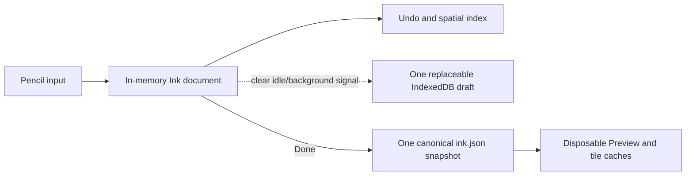

# Ink Simple Snapshot Persistence

**Status:** Accepted — core implementation complete; local Obsidian Gate pending **Scope:** Ink
document persistence, active-session ownership, legacy migration, and save failure behavior
**Overrides:**

- `2026-07-17-ink-icloud-resilient-persistence.md` in full;
- the canonical multi-surface, revision-chain, merge, and idle canonical-save portions of
  `2026-07-20-ink-explicit-commit-session.md`;
- the persistence implementation described by S36 in
  `2026-07-20-ink-responsive-commands-save-and-preview.md`.

It does not override brush behavior, retained-tile rendering, Preview presentation, viewport,
selection, or undo semantics.

## Executive Decision

Inkstone is a personal, single-user drawing tool. Persistence SHALL optimize for a responsive and
predictable local editing session, not for concurrent database-style mutation.



One active Ink editor owns one in-memory document. Drawing, undo, redo, tool switching, scrolling,
and zooming do not write the Vault. Pressing **Done** freezes the current document and replaces one
canonical file. The latest successful Done wins.

## 1. Product Contract

### SP1 — One active editor

- The process permits one active Ink editor for a note.
- The active editor is the sole in-process writer for that note.
- A Vault change event SHALL NOT interrupt, merge, retry, or invalidate the active editor.
- Reopening Preview or Ink Mode after the active session ends reads the latest disk snapshot.

### SP2 — Memory-first editing

- All changes before Done live in memory.
- A process kill before Done may lose all changes made since entering Ink Mode. This is accepted.
- No drawing operation waits for persistence.
- Pointer move, pointer up, undo, redo, tool switching, pan, and zoom SHALL perform zero Vault reads
  or writes.

### SP3 — Explicit save

- Done freezes exactly one logical document revision and writes exactly one canonical snapshot.
- The writer does not read an expected base, compare revisions, merge remote strokes, or create a
  revision chain.
- A later successful Done replaces an earlier snapshot: **Last Done Wins**.
- Done pauses drawing and shows Saving.
- A failed save retains the entire in-memory document and offers Retry and Export.
- Done budget remains <= 1 second for an ordinary document and <= 3 seconds for the 10k / 30 surface
  migration fixture.

### SP4 — Explicit navigation

- Switching notes, closing the page, or leaving Ink Mode with unsaved changes presents Save /
  Discard / Cancel.
- Backgrounding does not implicitly commit the canonical Vault snapshot.
- Returning to a live process resumes its in-memory session.

### SP5 — Best-effort draft

- A draft is an optional crash-loss reduction mechanism, never a commit prerequisite.
- It is one replaceable record per note in IndexedDB, not an operation log.
- It may be refreshed only on a clear idle signal: the app is backgrounded or there has been no user
  interaction for a sustained interval.
- Draft encode/write is cancelled or deferred when contact, frame debt, scrolling, zooming, undo,
  redo, or another foreground command begins.
- Draft failure is non-blocking and does not prevent further drawing.
- After a successful Done, the matching draft may be deleted asynchronously.

## 2. Canonical Disk Format

### SP6 — One file

The canonical file for a note is:

```text
.obsidian-annotations/v1/notes/{normalized-note-path-hash}/ink.json
```

The file contains one complete logical Ink document snapshot. Its strokes use document/world
coordinates and are not fragmented by render tile, viewport, or the former 4096 px persistence
surface boundary.

The implementation may retain a schema version or content generation for codec evolution. Such a
field is not a concurrency token and MUST NOT be used to reject a write.

### SP7 — Minimal atomicity

- The repository performs one replacement write for `ink.json`.
- It may rely on the existing Vault adapter's temporary-file-and-rename replacement to avoid a
  half-written JSON file.
- It SHALL NOT add base/head/generation entries, checksums, digest chains, leases, acknowledgements,
  compaction, exact-copy drains, cross-surface journals, or per-surface transactions.
- Successful Done is acknowledged when that single replacement succeeds.
- Preview bitmap/tile generation, summary/index refresh, draft cleanup, and garbage collection are
  not part of the Done acknowledgement.

## 3. Legacy Compatibility

### SP8 — Read-only migration

- If `ink.json` exists, it is authoritative.
- If it does not exist, the loader may read the former metadata plus bounded surface files and join
  them into one in-memory logical document.
- Legacy surface files are read-only migration inputs after this specification takes effect.
- The first successful Done writes `ink.json`; subsequent opens prefer it and do not consult legacy
  surface revisions.
- Migration does not delete legacy data in the foreground save path.

## 4. Mechanisms Removed from the Product Contract

The following concepts SHALL have no production responsibility after the migration slice completes:

- expected-base compare-and-swap;
- `revision-chain-changed` and automatic concurrent append merge;
- canonical surface ownership and durable leases;
- per-surface save state machines and per-surface user-visible Saving states;
- coalescing canonical writers and shared repository write queues;
- multi-surface batch journals;
- recovery `base/head/generation/entry/ack`, checksum chains, compaction, and GC;
- external-write conflict banners during an active personal editing session;
- a forced Retry before the next stroke or before leaving Ink Mode.

Old codecs may remain temporarily behind a migration reader. They MUST NOT remain on the new write
path.

## 5. Rendering and Cache Boundary

This specification changes persistence only:

- The in-memory logical document is the source for the active and committed Canvas layers.
- Retained tile scenes, Preview bitmaps, geometry caches, and spatial indexes remain disposable.
- A cache miss or cache write failure never changes canonical document semantics.
- Canonical save does not wait for rasterization or cache population.

## 6. Execution Slices

### S40 — Contract and observability

- Publish this overriding specification and Source Manifest.
- Add save diagnostics that identify `snapshot-read`, `snapshot-write`, `legacy-read`, and
  `draft-write` without exposing revision-conflict terminology.

### S41 — Single-file snapshot repository

- Add a public repository that reads and replaces one `ink.json` per note.
- Prove that a write performs no read, comparison, or merge.
- Prove that two writes leave exactly the second complete snapshot.

### S42 — Production session cutover

- Prefer `ink.json`; fall back to legacy bounded surfaces only when absent.
- Stop writing an empty canonical surface on Ink Mode entry.
- Route Done through one logical snapshot replacement.
- Ignore same-note external Vault modifications while its editor is active.

### S43 — Best-effort latest draft

- Replace journal semantics with one IndexedDB record per note.
- Schedule only after background or sustained no-interaction signals.
- Ensure draft work is preemptible and absent from foreground command budgets.

### S44 — Delete obsolete production machinery

- Remove the production use of merge, expected-base, per-surface persistence states, coalescing
  canonical writes, and batch journals.
- Keep only the smallest legacy reader necessary for existing notes.

### S45 — Verification

- Run focused unit and integration tests during implementation.
- Run the full local Obsidian performance Gate only after all code slices are complete.
- Resume iPad verification only after the local Gate passes.

## 7. Acceptance Criteria

1. Entering Ink Mode and drawing without Done causes zero canonical Vault writes.
2. Done causes exactly one canonical file replacement and zero expected-base reads.
3. Repeating draw -> Done -> reopen 100 times never produces a revision-conflict state.
4. Two sequential successful Done operations reload exactly the second snapshot.
5. An external file event during active editing neither exits Ink Mode nor blocks the next stroke.
6. A legacy 30-surface fixture opens, saves once to `ink.json`, and reloads identically from that
   file.
7. A failed replacement preserves the in-memory document and exposes Retry and Export.
8. Background/idle draft work never writes the canonical Vault snapshot.
9. Pointer move/up and foreground commands perform zero storage, encode, checksum, and hash calls.
10. Preview and retained-tile behavior remain cache-backed and independent of canonical save
    acknowledgement.

## Source Manifest

### Sources

- Product decisions in the current Codex task, 2026-07-20 through 2026-07-21: explicit Done,
  accepted crash-loss window, Save / Discard / Cancel navigation, idle/background best-effort work,
  and the final decision to remove concurrency and recovery over-design.
- `CONTEXT.md`
- `docs/specs/2026-07-17-ink-icloud-resilient-persistence.md`
- `docs/specs/2026-07-20-ink-explicit-commit-session.md`
- `docs/specs/2026-07-20-ink-responsive-commands-save-and-preview.md`
- `docs/specs/2026-07-20-ink-retained-tile-scene-and-worker-rasterization.md`
- Current implementation audit of `src/application/ink-document-session.ts`,
  `src/application/ink-surface-session.ts`, `src/storage/ink-surface-repository.ts`,
  `src/domain/ink-concurrent-append-merge.ts`, `src/adapters/obsidian/vault-text-file-store.ts`, and
  `src/adapters/obsidian/ink-mode-manager.ts`.

### Produced artifacts

- This specification.
- `src/storage/ink-document-snapshot-repository.ts`
- `src/storage/indexeddb-ink-document-draft-store.ts`
- Direct logical-document save and Draft scheduling in `src/application/ink-document-session.ts`.
- Production cutover and legacy-read preference in `src/adapters/obsidian/ink-mode-manager.ts` and
  `src/main.ts`.
- Focused unit and integration tests for S41–S44.

### Key decisions

- Personal single-writer product contract; one active in-process editor.
- Memory-first editing and explicit Done.
- One canonical file and Last Done Wins.
- Best-effort one-record draft only during clear idle/background periods.
- Legacy surface persistence becomes read-only migration input.
- Rendering caches remain disposable and outside save acknowledgement.

### Verification evidence

- `npm test -- --coverage=false`: 176 files and 1603 tests passed on 2026-07-21.
- `npm run build`: typecheck, production bundle, and mobile bundle check passed on 2026-07-21.
- `npm run lint` and `git diff --check` passed on 2026-07-21.
- The final local Obsidian Gate remains intentionally deferred until code development is complete.

### Open questions and risks

- Simultaneous edits on two devices are intentionally not merged; the last successful Done wins.
- A process kill before Done may lose the current session. The optional draft only reduces this
  window and is not a durability guarantee.
- Legacy files remain until a later, explicitly scheduled cold cleanup.
