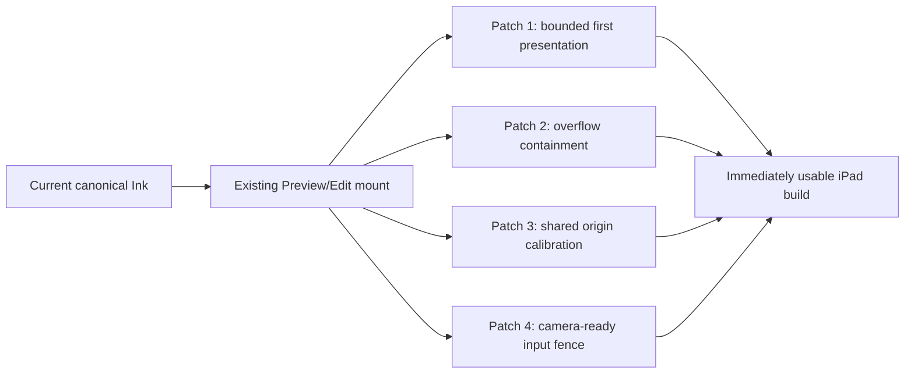

# Ink iPad Immediate Usability Patch

## Status

- Created: 2026-07-22
- Status: approved direction; ready for focused implementation
- Delivery type: patch-only corrective release
- Primary target: Obsidian 1.12.7 on iPadOS at 60 Hz
- Secondary regression target: Obsidian 1.12.7 on macOS

This specification addresses four physical-iPad release blockers without waiting for the larger
shared-scene, deterministic-layout, anchor, or projection redesign.

It is a deliberately narrow corrective follow-up to:

- `2026-07-16-ink-704-zoomable-workspace.md`;
- `2026-07-16-ink-stage-frame-and-native-navigation.md`;
- `2026-07-20-ink-responsive-commands-save-and-preview.md`;
- `2026-07-20-ink-retained-tile-scene-and-worker-rasterization.md`;
- `2026-07-21-ink-semantic-layers-and-transform-only-interactions.md`; and
- `2026-07-21-ink-shared-scene-layout-and-atomic-camera.md`.

Those specifications remain sources of truth for accepted behavior. For the immediate release, this
document supersedes any requirement that the four defects below must first be solved by a new
`InkSceneSession`, a new anchor model, a new Markdown projection, or a renderer migration.

## Executive Decision

The immediate product goal is usable Ink on the user's current iPad, not architectural completion.

Implementation is limited to four independently reversible patches:

1. show an already available first presentation without waiting for fonts, a frame callback, or
   rebuilding unchanged history;
2. remove Ink-created horizontal overflow at the default Preview size;
3. make Preview and Edit use the same measured document-origin calibration, and patch only proven
   macOS/iPad layout metric differences; and
4. prevent a Pencil contact from consuming a stale inverse transform immediately after zoom.

The patch release keeps:

- the existing Logical Stroke and 704 logical-world coordinates;
- the current Canvas2D Active and retained History renderers;
- the current tile cache and semantic layers;
- the current Stage Frame abstraction;
- the current Preview/Edit controllers and handoff seam; and
- the current simple snapshot sidecar and Last-Done-Wins persistence contract.

The patch release does **not** add:

- a new canonical schema or sidecar field;
- a new persistent anchor model;
- a DOM snapshot or Markdown renderer replacement;
- a global Scene owner or `InkSceneSession`;
- SVG, WebGL, WebGPU, Metal, or PencilKit;
- a Worker or `OffscreenCanvas` correctness dependency;
- a Recovery Journal or concurrent-writer protocol; or
- a broad typography reset for all Markdown and third-party embeds.



## User-Visible Defects

| ID   | Defect                               | Physical symptom                                                                | Patch-level cause to verify                                                                                                                                                                                   |
| ---- | ------------------------------------ | ------------------------------------------------------------------------------- | ------------------------------------------------------------------------------------------------------------------------------------------------------------------------------------------------------------- |
| IP-1 | Slow first presentation              | Opening Preview, Preview → Edit, and Edit → Preview can take several seconds    | Mount waits for `document.fonts.ready`; cache adoption and visible work remain behind asynchronous yields; the outgoing exact presentation is not offered to the incoming controller as a zero-copy seed      |
| IP-2 | Default Preview horizontal scrollbar | iPad Preview at the default scale can scroll horizontally                       | The 704 workspace, pane width, transformed/fixed Ink surfaces, and host scroll extent are not proven to have one owner; a presentation-only element can still enlarge the native scroll extent                |
| IP-3 | Position mismatch                    | Ink moves relative to Markdown between Preview/Edit and between macOS/iPadOS    | Preview and Edit independently capture a compatibility inset; host replacement and scale can recapture it differently; remaining mobile/desktop width or padding metrics may differ despite Layout Profile v1 |
| IP-4 | First stroke after zoom is displaced | A contact immediately after zoom may draw far from the Pencil and later recover | Visual scale can be observable before the measured document origin and `clientToLogical` inverse for the same camera epoch are accepted                                                                       |

These are not evidence that Logical Stroke coordinates, Canvas2D, or the sidecar format must be
replaced. They are startup, containment, calibration, and atomic-publication defects.

## Normative Root-Cause Binding

The implementation is not allowed to close a defect by improving only its visible symptom. Each
physical failure is bound to the previously identified root cause and one required patch:

| Confirmed root cause                                                                                                                                                        | Required patch response                                                                                                                                                                                  | What does **not** count as fixed                                                                                                 |
| --------------------------------------------------------------------------------------------------------------------------------------------------------------------------- | -------------------------------------------------------------------------------------------------------------------------------------------------------------------------------------------------------- | -------------------------------------------------------------------------------------------------------------------------------- |
| Preview and Edit own separate rendering lifecycles, so a mode switch rebuilds or reloads pixels that are already on screen                                                  | The existing handoff must transfer a compatible exact History presentation to the incoming controller through a bounded one-shot lease. This is the patch-sized substitute for a new shared Scene owner. | Keeping a spinner, making the fade longer, or rebuilding the same visible history faster                                         |
| `InkCanvasController.whenFirstEnteredPresentation()` ultimately depends on `waitForNextPaint()`, whose bare `requestAnimationFrame` can stall for seconds in iPad WKWebView | Edit readiness must be driven by an actual accepted presentation generation and a deadline-backed host scheduler. A bare rAF can refine timing but cannot be the only resolver.                          | Adding another delayed rAF, waiting for the 100/500/1500 ms probes, or resolving readiness without visible pixels                |
| Editable fixed-Canvas positioning error is folded into the Markdown world origin and may be applied again after scale/reattach                                              | Preview and Edit must share one normalized compatibility vector and one origin formula, applied exactly once per calibration epoch.                                                                      | Adding an iPad-only magic offset or rewriting Logical Stroke coordinates                                                         |
| The current “unified layout” fixes only a subset of geometry while Obsidian mobile selectors can still reflow core Markdown differently                                     | Layout Profile v1 must become a scoped Core Markdown Geometry Lock with identical computed values in Preview/Edit and macOS/iPadOS.                                                                      | Merely recording landmark differences, fixing only the root width, or matching Ink while the underlying title/body still reflows |

This section is normative. If the required response is absent, the corresponding defect remains open
even when one screenshot appears improved.

## Goals

1. Eliminate multi-second blank waits before the first visible Ink pixels.
2. Make warm Preview/Edit switching reuse already painted pixels without rebuilding history first.
3. Ensure default Preview never creates a horizontal scrollbar.
4. Keep the same saved strokes aligned to the same Markdown landmarks in Preview and Edit.
5. Reduce macOS/iPadOS alignment differences to the accepted visual tolerance without replacing
   Obsidian Markdown rendering.
6. Guarantee that the first accepted Pencil contact after zoom uses the camera actually visible to
   the user.
7. Preserve the currently accepted writing smoothness, scroll/zoom presentation, selection, eraser,
   undo/redo, Done, Preview, and persistence behavior.
8. Reach physical iPad verification through one short session instead of another long Gate cycle.

## Non-Goals

- Solving arbitrary semantic anchoring to mutable Markdown in this patch.
- Reimplementing Obsidian Reading View or embedded third-party components.
- Achieving pixel-identical fonts on every operating system.
- Sharing one full mutable renderer across every pane or note.
- Persisting cached bitmaps or layout measurements as canonical data.
- Making cache availability a correctness requirement.
- Increasing global scheduler budgets to hide expensive work.
- Running the full long-duration performance Gate before the first patched iPad UAT.

## Frozen Product Contracts

The following decisions are frozen for this patch:

1. Sidecars remain canonical; tiles, geometry, pixels, and layout measurements are disposable.
2. The logical document remains 704 units wide. Existing Logical Stroke coordinates are not rebased
   or migrated.
3. Mobile `.inkstone-ink-host { padding: 0 }` remains. The 704 workspace is the sole owner of its
   deterministic internal padding.
4. Existing compatibility insets are not deleted speculatively. A red test must first prove a
   duplicate or scale error.
5. The existing 4 ms deferred dispatch budget and 32 ms visible fallback remain. This patch does not
   globally relax the scheduler.
6. Preview and Edit continue to render the real Obsidian Reading View underneath Ink. Third-party
   Markdown components remain Obsidian-owned.
7. Manual Edit zoom may expose intentional horizontal navigation. Only unwanted default Preview
   overflow is prohibited.
8. No incoming patch may block Pencil move/up on storage, encoding, hashing, canonical reads, or
   cache publication.

## Patch 0 — Evidence and Regression Harness

Implementation starts with focused red tests and diagnostic spans. No production behavior changes
are allowed in this Slice.

### Required diagnostics

Record the following timestamps for one mount and one mode handoff:

- `mount-requested`;
- `layout-root-found`;
- `layout-readiness-released`;
- `canonical-read-complete`;
- `memory-seed-adopted`;
- `cache-lookup-complete`;
- `history-first-pixel`;
- `history-visible-exact`; and
- `edit-input-ready`.

For camera publication, record:

- zoom command epoch;
- authored scale;
- measured scale;
- document client origin;
- Stage Frame epoch;
- input inverse epoch; and
- pointerdown admitted/rejected epoch.

Diagnostics stay local and use the existing performance recorder. They must not add telemetry, Vault
writes, console spam during normal use, or work in the Pencil move/up path.

### Required red tests

1. A never-resolving `document.fonts.ready` cannot keep first presentation pending indefinitely.
2. An already-materialized exact seed can become visible before the first host yield.
3. Default mobile Preview has `scrollWidth <= clientWidth + 1` after mount and handoff.
4. Preview and Edit produce the same `documentClientOrigin` from the same pane/layout geometry.
5. Reattaching a 50% layout root does not double-scale a compatibility inset.
6. A pointerdown carrying camera epoch N cannot be mapped with inverse epoch N-1.
7. Camera-fence failure creates zero stroke samples, undo entries, or retained raw events.
8. With rAF intentionally stalled, a compatible Preview → Edit handoff adopts exact History and
   reaches `edit-input-ready` without waiting for that rAF.
9. Core Markdown fixtures under macOS, `.is-mobile`, and `.is-tablet` produce identical computed
   geometry while Layout Profile v1 is active.

## Patch 1 — Bounded First Presentation

### Problem

The current mount path awaits `document.fonts.ready` before it can continue. On physical WKWebView,
font readiness and `requestAnimationFrame` are not reliable first-presentation barriers. In
addition, a cache hit or outgoing exact presentation can remain behind asynchronous scheduling that
is appropriate for building work but unnecessary for O(1) adoption.

### Contract

| ID             | Requirement                                                                                                                                                                                                                                                                                                                                                   |
| -------------- | ------------------------------------------------------------------------------------------------------------------------------------------------------------------------------------------------------------------------------------------------------------------------------------------------------------------------------------------------------------- |
| INK-IPAD-P1-01 | Font readiness is advisory. Mount may wait only for a short bounded opportunity; it must then present using current computed metrics and schedule one later recalibration when fonts settle.                                                                                                                                                                  |
| INK-IPAD-P1-02 | `document.fonts.ready` rejection or non-resolution cannot block Preview, Edit, toolbar input, or first pixels.                                                                                                                                                                                                                                                |
| INK-IPAD-P1-03 | If the existing handoff owns an exact already-painted presentation for the same note, canonical revision, renderer version, DPR bucket, scale, and accepted camera, it must offer that presentation and the incoming controller must adopt it as its first presentation. A compatible warm mode switch cannot rebuild unchanged visible History before reuse. |
| INK-IPAD-P1-04 | Before the first host yield, only O(1) adoption of already-materialized exact pixels or tile references is allowed. It must finish within 1 ms and may not decode, compile geometry, rasterize, hash history, read canonical storage, allocate a viewport backing store, or scan strokes.                                                                     |
| INK-IPAD-P1-05 | Cache miss, incompatible seed, or seed adoption failure falls back to the current canonical/tile path without changing correctness.                                                                                                                                                                                                                           |
| INK-IPAD-P1-06 | The current History pixels stay visible during Preview/Edit handoff until the incoming exact first presentation is ready. A transition may cross-fade already-painted layers but may not cross-fade into blank.                                                                                                                                               |
| INK-IPAD-P1-07 | Background exactness, near-visible prefetch, cache encoding, and cache publication remain visible/cold lane work and never delay first pixels.                                                                                                                                                                                                                |
| INK-IPAD-P1-08 | `whenFirstEnteredPresentation()` resolves from an accepted presentation generation: either an adopted exact seed or submitted incoming exact pixels. Its host-yield mechanism uses the existing deadline-backed frame scheduler or an equivalent <= 32 ms fallback; bare `requestAnimationFrame` is never the only completion signal.                         |
| INK-IPAD-P1-09 | The 100/500/1500 ms extent probes may correct later document extent only. They cannot gate first pixels, Edit interaction readiness, origin publication, or presentation handoff.                                                                                                                                                                             |

### Minimal handoff seed

This patch must extend only the existing presentation handoff object with a small, in-memory,
one-shot seed. It is not a global Scene owner. If a direct resource lease cannot be proven safe, the
implementation must use an already-materialized viewport snapshot or keep the outgoing exact layer
attached until the incoming accepted presentation generation is submitted. It cannot fall back to
blank-then-rebuild and still claim IP-1 complete.

```ts
interface InkPresentationSeed {
  readonly cameraEpoch: number;
  readonly canonicalRevision: string;
  readonly dprBucket: number;
  readonly layoutProfileVersion: string;
  readonly noteKey: string;
  readonly rendererVersion: string;
  readonly scale: number;
  readonly retain: () => InkPresentationSeedLease;
}

interface InkPresentationSeedLease {
  readonly release: () => void;
  readonly source: CanvasImageSource | readonly InkRetainedTileReference[];
}
```

The types are illustrative; implementation may use an equivalent existing representation.

Borrowed-pixel lifetime is normative:

- the outgoing controller cannot clear, close, recycle, resize, or dispose a borrowed Canvas,
  `ImageBitmap`, or retained tile while a seed lease is live;
- first exact replacement, cancellation, identity mismatch, failure, or handoff expiry releases the
  lease exactly once;
- the lease is owned only by the existing handoff object; and
- a leaked lease or double release fails the focused test suite.

### Budget

Measured from user-visible intent on physical iPad:

| Path                                     | First nonblank Ink | Visible exact target |
| ---------------------------------------- | -----------------: | -------------------: |
| Warm Preview ↔ Edit, compatible seed     |      P95 <= 100 ms |        P95 <= 300 ms |
| Warm note reopen, memory tiles available |      P95 <= 150 ms |        P95 <= 500 ms |
| Cold note open, no usable tiles          |      P95 <= 500 ms |      P95 <= 1,500 ms |

The first-pixel fast path itself must be <= 1 ms and make zero decode, compile, raster, hash,
canonical-read, or history-scan calls.

These are patch-release budgets. A later architecture may tighten cold exact completion, but no path
may again present a multi-second blank wait.

### Rollback

The concrete zero-copy lease is independently replaceable, but compatible warm handoff reuse and
continuous outgoing pixels are not optional. If direct borrowing causes ownership or stale-pixel
defects, replace it with a bounded already-materialized snapshot or keep the outgoing exact layer
until the incoming generation is submitted. Falling back to a blank rebuild fails IP-1.

## Patch 2 — Default Preview Horizontal Containment

### Problem

The fixed Ink overlay must be visually pane-wide without participating in native document layout.
The mobile host already removes duplicate outer padding; remaining overflow must be localized to the
exact element enlarging `scrollWidth` rather than hidden with a global CSS rule.

### Contract

| ID             | Requirement                                                                                                                                                                                               |
| -------------- | --------------------------------------------------------------------------------------------------------------------------------------------------------------------------------------------------------- |
| INK-IPAD-P2-01 | At default Preview scale, every Ink presentation element is layout-neutral: it cannot enlarge the Reading View's scrollable width or height.                                                              |
| INK-IPAD-P2-02 | The 704 workspace remains the only deterministic padding owner. The mobile zero-host-padding rule stays in place.                                                                                         |
| INK-IPAD-P2-03 | Fixed overlays use the pane's client box, not the scaled workspace width, as their fixed Canvas rectangle. Internal world-to-client projection handles the document offset.                               |
| INK-IPAD-P2-04 | Retained tile roots, staging canvases, handoff layers, and transition classes remain contained and clipped inside the fixed presentation layer. Their transforms cannot contribute native scroll extents. |
| INK-IPAD-P2-05 | Preview must not solve overflow by changing Logical Stroke coordinates, cropping valid pane-wide Ink, shrinking the 704 world, or globally hiding all horizontal navigation.                              |
| INK-IPAD-P2-06 | Edit manual zoom above Fit may continue to use the existing navigation behavior. Default Preview and Edit Fit must not expose accidental horizontal scroll.                                               |

### Diagnostic rule

The red test must report each candidate element's:

- bounding rect;
- computed position, width, max-width, padding, overflow, contain, and transform;
- `scrollWidth`/`clientWidth`; and
- delta from the nearest scroll container.

The implementation changes only the element proven to own the positive overflow delta. It must not
add another blanket `overflow-x: hidden` to the host as a substitute for containment.

### Acceptance

On iPad Preview at default scale and Edit Fit:

- `scrollWidth <= clientWidth + 1 CSS px`;
- no horizontal scrollbar is visible;
- pane-wide strokes outside the Markdown column remain visible;
- vertical scrolling remains native; and
- entering/leaving Preview does not change the document's scroll width.

### Rollback

CSS/measurement changes are scoped to Ink classes. If containment clips legitimate pane-wide Ink,
revert only Patch 2 and retain the other patches.

## Patch 3 — Shared Origin Calibration and Bounded Layout Compatibility

### Problem

Both the Preview controller and editable Canvas controller currently own a cached
`documentOriginInset`. They can capture it at different lifecycle moments, scales, or host
attachments. That creates Preview/Edit mismatch even when both ultimately draw the same Logical
Strokes.

macOS/iPadOS can also expose different content width, box-sizing, padding, heading, or line metrics.
The patch must distinguish this true layout difference from a duplicate origin correction.

### One calibration formula

Preview and Edit must call one small pure calibration helper or one behaviorally identical shared
function:

```ts
documentClientOrigin = layoutRootClientOrigin + acceptedCompatibilityVector * actualScale;
```

The compatibility vector is stored in unscaled logical CSS units. It is never persisted.

### Contract

| ID             | Requirement                                                                                                                                                                                                                                                                                                     |
| -------------- | --------------------------------------------------------------------------------------------------------------------------------------------------------------------------------------------------------------------------------------------------------------------------------------------------------------- |
| INK-IPAD-P3-01 | Preview and Edit use the same calibration function, inputs, scale normalization, tolerance, and invalidation rules.                                                                                                                                                                                             |
| INK-IPAD-P3-02 | A compatibility vector captured at scale S is normalized back to unscaled units before caching. Applying at scale T multiplies it exactly once by T.                                                                                                                                                            |
| INK-IPAD-P3-03 | Reattach, Reading View host replacement, pane resize, mode handoff, and accepted zoom invalidate stale calibration and publish a new calibration epoch.                                                                                                                                                         |
| INK-IPAD-P3-04 | A calibration may become active only when layout root, fixed overlay, pane client box, scale, and note identity are mutually current.                                                                                                                                                                           |
| INK-IPAD-P3-05 | Existing compatibility insets remain until a red test proves they are duplicated. The patch removes only the proven duplicate application, not the entire correction.                                                                                                                                           |
| INK-IPAD-P3-06 | Layout Profile v1 must lock identical computed geometry for the supported Core Markdown set in Preview/Edit and macOS/iPadOS. Mobile/desktop Obsidian selectors cannot override those geometry values while Ink Preview/Edit is active. Theme colors and third-party component internals remain Obsidian-owned. |
| INK-IPAD-P3-07 | Existing sidecar observations and Logical Stroke points are not rewritten or migrated.                                                                                                                                                                                                                          |
| INK-IPAD-P3-08 | The Geometry Lock is attached to the real `.markdown-preview-sizer.inkstone-ink-workspace`, not to a detached clone. Preview and Edit therefore project over the same Obsidian-rendered Markdown DOM and the same locked line boxes.                                                                            |

### Layout landmark probe

For the same UAT Markdown note, capture these client-space landmarks after layout readiness:

- layout root left/top/width;
- inline title left/top/baseline/line box;
- first H1 left/top/line box;
- first paragraph left/top/line box;
- first list item left/top/line box; and
- the 704 workspace content box.

### Core Markdown Geometry Lock

The patch must make the following geometry identical across macOS/iPadOS and Preview/Edit while Ink
presentation is active:

- workspace width `704px`, `max-width: none`, and `box-sizing: border-box`;
- workspace inline padding `24px` and block padding `8px`;
- base font stack from `INK_LAYOUT_PROFILE_V1`;
- base font size `16px` and line height `24px`;
- inline title and H1-H6 font size, line height, weight, and block spacing;
- paragraph block spacing;
- ordered/unordered list indentation, marker offset, item line height, and item spacing;
- blockquote padding/border contribution;
- table border-box width and cell padding; and
- `pre`/code block box sizing, padding, and line height.

The lock must be expressed as scoped Ink layout variables/rules with sufficient specificity and load
order to win over `.is-mobile` and `.is-tablet` geometry selectors. It must not change colors,
icons, interaction, or the internal layout of third-party embeds.

Implementation may adjust only scoped Layout Profile v1 geometry: width/max-width, box-sizing,
padding, base type metrics, Core Markdown block spacing, list indentation, and the box metrics named
above. It may add missing H4-H6/list/blockquote/table/code geometry tokens to Layout Profile v1, but
those tokens remain presentation-only and cannot enter the sidecar or Logical Stroke model.

Do not introduce an unscoped global reset or rewrite callout/embed/plugin internals. If a
third-party component has platform-dependent intrinsic layout, record it as a later
anchoring/projection concern rather than expanding this patch. The supported Core Markdown set,
however, is mandatory and cannot be left to native mobile CSS.

### Acceptance

1. Given identical DOM rect fixtures, Preview and Edit document origins differ by <= 0.5 CSS px at
   50%, 60%, 99%, 100%, and Fit.
2. After reattach at a different scale, compatibility correction is applied exactly once.
3. On the physical UAT note, saved Ink remains aligned to the selected title, paragraph, and list
   landmarks when switching Preview ↔ Edit.
4. At 100% on macOS and iPadOS, corresponding Core Markdown line boxes and landmarks differ by <= 1
   CSS px after normalizing the pane origin. Text anti-aliasing and glyph raster differences are
   exempt.
5. Existing pane-wide Ink remains pane-wide; calibration does not clamp Ink to the Markdown column.

### Rollback

The shared helper is a pure calculation and contains no ownership or persistence. If the scoped
layout token patch regresses an embed, revert only the proven token override while retaining shared
origin calibration.

## Patch 4 — Zoom Camera-Ready Input Fence

### Problem

The visible workspace scale, overlay position, Stage Frame, render projection, and Pencil inverse
must describe one camera. A later settle may refine tiles, but it cannot silently change where a
contact that has already begun maps.

### Minimal state

The existing Canvas controller may add a transient in-memory camera publication state:

```ts
interface InkCameraPublicationState {
  readonly authoredEpoch: number;
  readonly authoredScale: number;
  readonly inputEpoch: number;
  readonly measuredEpoch: number;
  readonly status: 'ready' | 'pending';
}
```

This is controller state, not a new domain model.

### Atomic publication order

For a zoom command:

1. increment the camera epoch;
2. write the intended workspace scale;
3. synchronously measure the current layout root and pane client box;
4. publish document origin, Stage Frame, render projection, and `clientToLogical` inverse for that
   same epoch;
5. mark input ready only when measured scale/origin are finite and within tolerance; and
6. schedule retained-tile LOD refinement and viewport settle as nonblocking follow-up work.

### Pointerdown behavior

When a Pencil pointerdown arrives while publication is pending:

1. perform one bounded synchronous attempt to complete the current camera publication;
2. if successful, admit the original event immediately using the new epoch;
3. if unsuccessful, reject that contact visibly and create no stroke/sample/undo mutation;
4. never retain or replay the raw `PointerEvent`, `TouchEvent`, or `Touch`; and
5. allow the user to begin a new contact after the camera becomes ready.

The normal path should publish synchronously. The fence is a correctness backstop, not a deliberate
input delay.

### Timeout and rollback

Camera publication may remain pending for at most 96 ms. If a coherent measurement is still not
available:

- atomically restore the last accepted workspace scale, overlay position, Stage Frame, render
  projection, input inverse, and toolbar zoom value;
- cancel pending work for the failed epoch; and
- return to `ready` on the previous epoch.

The controller must never wait seconds for delayed probes or a throttled animation frame before
recovering input correctness.

### Acceptance

| ID             | Requirement                                                                                                                |
| -------------- | -------------------------------------------------------------------------------------------------------------------------- |
| INK-IPAD-P4-01 | The first accepted point immediately after zoom differs from the Pencil's logical target by <= 2 logical units.            |
| INK-IPAD-P4-02 | Visual camera epoch, Stage Frame epoch, render projection epoch, and input inverse epoch match for every accepted contact. |
| INK-IPAD-P4-03 | A rejected pending contact produces zero points, strokes, undo entries, persistence work, or retained raw events.          |
| INK-IPAD-P4-04 | Failure rolls back within 96 ms; the UI never stays visually at a scale whose inverse was not accepted.                    |
| INK-IPAD-P4-05 | A later rAF/timer settle may replace blurry tiles, but cannot move an already accepted stroke.                             |

### Rollback

If synchronous publication regresses zoom smoothness, retain the epoch fence and rollback behavior,
but revert any unrelated render-settle changes. Correct input mapping takes precedence over
immediate tile sharpness.

## Implementation Boundaries

Expected patch locations are intentionally small:

| Area                                            | Allowed change                                                                             |
| ----------------------------------------------- | ------------------------------------------------------------------------------------------ |
| `src/adapters/obsidian/ink-layout-readiness.ts` | Replace unbounded font barrier with bounded advisory readiness and one later notification  |
| `src/adapters/obsidian/ink-mode-manager.ts`     | Carry the required compatible one-shot presentation seed through the existing handoff only |
| `src/ui/ink-presentation-handoff.ts`            | Add bounded borrowed-pixel lease lifetime if required                                      |
| `src/ui/ink-preview-projection-controller.ts`   | O(1) exact seed adoption, shared origin calibration, local containment measurement         |
| `src/ui/ink-canvas-controller.ts`               | Shared origin calibration and camera-ready epoch fence                                     |
| `src/ui/ink-layout-profile.ts` and `styles.css` | Scoped Core Markdown Geometry Lock and evidence-backed containment corrections             |
| Existing focused tests                          | Red/green coverage for all contracts                                                       |
| Short visual Gate script                        | One bounded regression sequence; no long soak loop                                         |

The following changes require a new explicit product decision and are forbidden in this patch:

- moving canonical authority out of the current repository;
- changing point or stroke schemas;
- adding a second cache database;
- creating a global scene graph or long-lived cross-pane owner;
- reimplementing Markdown or embeds; and
- replacing the renderer.

## Delivery Slices

### IP0 — Instrument and freeze failures

- Add the seven focused red tests from Patch 0.
- Add local timing/camera diagnostics behind the existing diagnostics switch.
- Produce a short baseline report from the UAT note.

Exit: failures are deterministic locally or through the short real-Obsidian harness; no production
behavior change.

### IP1 — First-presentation patch

- Bound font readiness.
- Add O(1) exact seed adoption through the existing handoff.
- Preserve outgoing pixels until incoming first exact presentation.
- Prove borrowed resources release exactly once.

Exit: IP-1 budgets pass; no decode/compile/raster/hash call occurs in the seed fast path.

### IP2 — Overflow containment patch

- Identify the exact element adding scroll extent.
- Correct only its sizing/position/containment.
- Preserve pane-wide Ink and Edit manual-zoom navigation.

Exit: default mobile Preview and Edit Fit have no accidental horizontal scrollbar.

### IP3 — Origin/layout patch

- Extract one pure origin-calibration helper.
- Use it from Preview and Edit.
- Add lifecycle invalidation and scale normalization.
- Apply the scoped Core Markdown Geometry Lock and prove its computed values across macOS/iPadOS.

Exit: Preview/Edit and macOS/iPad landmark tolerances pass on the UAT note.

### IP4 — Camera-ready input patch

- Add transient camera publication epochs.
- Publish visual and inverse transforms atomically.
- Add bounded pointerdown completion/fence and 96 ms rollback.

Exit: immediate post-zoom Pencil tests pass at every supported scale.

### IP5 — Short release verification

- Run focused unit/integration tests.
- Install the build into the local UAT Vault.
- Run one short real-Obsidian visual Gate.
- Copy the same build digest to the iPad UAT Vault.
- Complete one short physical session.

Exit: all four defects pass in one physical session with matching build/source manifests.

## Verification Strategy

### Focused automated suite

Run only the tests covering:

- layout readiness;
- mode manager handoff;
- presentation handoff lifetime;
- Preview cache/seed adoption;
- Preview viewport and origin measurement;
- Canvas Stage Frame/origin/zoom input mapping;
- fixed-width/mobile containment CSS; and
- work-scheduler regression.

The focused suite should finish in seconds. Full repository checks run once after all IP slices are
green, not between every red/green step.

### Short real-Obsidian visual Gate

Maximum duration: 60 seconds. It runs one note and does not require continuous focus after the
script begins.

1. Open the UAT note in Preview.
2. Record first pixel and visible exact timestamps.
3. Assert no default horizontal overflow.
4. Switch Preview → Edit → Preview once.
5. Capture title/paragraph/list landmark deltas.
6. Zoom to 50%, 99%, and 100%; inject an immediate first-point probe after each zoom.
7. Export one compact JSON report and stop.

The Gate must terminate on timeout and must not loop between tools or modes indefinitely.

### Physical iPad UAT

Maximum human time: 60–90 seconds.

1. Open `UAT - Start Here`; fail if first Ink remains blank for multiple seconds.
2. Confirm no horizontal scrollbar at default Preview.
3. Switch Preview ↔ Edit once and compare three marked Markdown landmarks.
4. At 50%, 99%, and 100%, zoom and immediately draw one short cross near a known landmark.
5. Confirm ordinary writing remains smooth and Done still persists the result.

Fail fast on any wrong-position stroke, multi-second blank, accidental horizontal scrollbar, or
major writing regression. Do not expand this into the prior multi-condition physical matrix.

## Acceptance Matrix

| Defect                 | Automated acceptance                                                                                                                            | Physical acceptance                                                             |
| ---------------------- | ----------------------------------------------------------------------------------------------------------------------------------------------- | ------------------------------------------------------------------------------- |
| IP-1 slow loading      | Bounded font readiness; mandatory compatible History reuse; Edit readiness has no bare-rAF-only path; <=1 ms seed path; timing budgets recorded | No multi-second blank; warm switch visually immediate                           |
| IP-2 overflow          | `scrollWidth <= clientWidth + 1` at default Preview/Edit Fit                                                                                    | No horizontal scrollbar; pane-wide Ink remains visible                          |
| IP-3 position mismatch | Shared calibration and landmark tolerance tests                                                                                                 | Ink remains on the same title/paragraph/list landmarks across modes and devices |
| IP-4 post-zoom offset  | Epoch equality, <=2 logical-unit error, zero mutation on reject                                                                                 | Immediate first stroke after 50/99/100% zoom lands under Pencil                 |

## Regression Guardrails

The patch is rejected if it causes any of the following:

- Pencil move P99 or pen-up synchronous work exceeds existing frozen budgets;
- storage, encoding, hashing, or canonical reads enter pointer move/up;
- a stroke disappears after pen-up;
- scrolling, selection drag, erase, undo, or redo regains full-scene flashing;
- pane-wide Ink is cropped to the Markdown column;
- mode handoff displays stale pixels from another note or revision;
- a borrowed Canvas/tile is disposed while visible;
- Done loses memory state after a save failure; or
- a new horizontal or nested scrollbar appears.

## Stop Conditions

Stop the patch and return for a separate architecture decision if:

1. cross-device parity demonstrably requires replacing Obsidian Markdown layout;
2. a third-party component requires semantic anchoring rather than origin calibration;
3. correct first presentation requires a global Scene owner rather than a one-shot handoff seed;
4. correct zoom mapping cannot be published or rolled back within the existing controller; or
5. any patch requires a canonical schema migration.

These conditions are not permission to silently broaden the implementation.

## Source Manifest

### Sources

- User instructions in the current Codex task on 2026-07-22: stop the larger architecture plan,
  first repair the four iPad defects with patches, and produce a specification before coding.
- Physical iPad observations supplied in the current task: multi-second first load and mode
  transitions, default Preview horizontal scrollbar, Preview/Edit and macOS/iPad position
  differences, and large immediate post-zoom Pencil displacement.
- `AGENTS.md`.
- `CONTEXT.md`.
- `docs/specs/2026-07-16-ink-704-zoomable-workspace.md`.
- `docs/specs/2026-07-16-ink-stage-frame-and-native-navigation.md`.
- `docs/specs/2026-07-20-ink-responsive-commands-save-and-preview.md`.
- `docs/specs/2026-07-20-ink-retained-tile-scene-and-worker-rasterization.md`.
- `docs/specs/2026-07-21-ink-semantic-layers-and-transform-only-interactions.md`.
- `docs/specs/2026-07-21-ink-shared-scene-layout-and-atomic-camera.md`.
- `src/adapters/obsidian/ink-layout-readiness.ts`.
- `src/adapters/obsidian/ink-mode-manager.ts`.
- `src/runtime/ink-work-scheduler.ts`.
- `src/ui/ink-canvas-controller.ts`.
- `src/ui/ink-preview-projection-controller.ts`.
- `src/ui/ink-presentation-handoff.ts`.
- `src/ui/ink-layout-profile.ts`.
- `styles.css`.
- `/Users/ivan/.agents/docs/agents/workflows.md`.
- `/Users/ivan/.agents/docs/agents/handoff-policy.md`.

### Produced artifacts

- `docs/specs/2026-07-22-ink-ipad-immediate-usability-patch.md`.
- Updated index entry and decision summary in `docs/specs/README.md`.

### Key decisions

- Ship four isolated patches before considering a new anchor/projection/Scene architecture.
- Keep Canvas2D, current Logical Stroke coordinates, current sidecar, current controllers, and
  existing scheduler budgets.
- Treat font readiness as advisory and permit only O(1), already-materialized exact-pixel adoption
  before the first host yield.
- Require compatible warm Preview/Edit handoff to reuse the existing exact History presentation; the
  patch does not add a shared Scene owner, but it cannot fall back to blank-then-rebuild.
- Remove bare `requestAnimationFrame` as the only Edit-first-presentation completion signal.
- Preserve the current mobile zero-host-padding rule and existing compatibility inset until a red
  test proves a duplicate.
- Share one origin-calibration formula between Preview and Edit without persisting layout state.
- Lock Core Markdown geometry to identical computed values while Ink Preview/Edit is active on macOS
  and iPadOS.
- Reject or roll back a noncoherent zoom camera within 96 ms instead of accepting a wrongly mapped
  stroke.
- Use one short Gate and one short iPad session; do not restart the long performance/physical matrix
  for every patch.

### Verification evidence

- This artifact was created from direct code inspection of the current mount, scheduler, Preview,
  Canvas, handoff, layout-profile, and CSS paths.
- No production behavior was changed while authoring this specification.
- Markdown formatting, fenced-block balance, local specification links, and `git diff --check` are
  verified before handoff.

### Open questions / risks

- The exact element producing the residual iPad scroll extent must be identified by the IP0 element
  report; the Spec intentionally does not guess and add another blanket overflow rule.
- Core Markdown geometry is mandatory, but the focused computed-style report must identify which
  Obsidian mobile/tablet selectors currently override Layout Profile v1 so the patch can remain
  scoped and avoid unnecessary global resets.
- Zero-copy handoff is safe only with explicit one-shot resource lifetime. If direct borrowing
  cannot be proven, use an already-materialized viewport snapshot or retain the outgoing exact layer
  until incoming submission. Compatible warm handoff reuse cannot be omitted from IP-1.
- Arbitrary third-party Markdown components may still need a later semantic anchoring/projection
  design. That work is explicitly outside this patch release.
