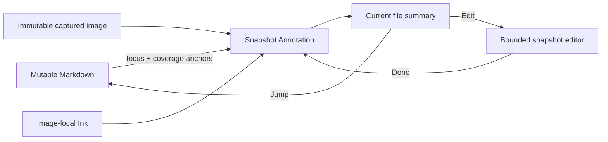

# Snapshot Annotation Capture and Markup

## Status

- Created: 2026-07-22
- Status: approved product direction; Snapshot Annotation is the only new freehand workflow, while
  mobile release remains gated by later cross-backend physical-iPad acceptance
- Primary target: Obsidian 1.12.7 on iPadOS at 60 Hz
- Secondary target: Obsidian on macOS
- UI concept: `docs/specs/2026-07-22-snapshot-annotation-ui-concept.md`

## Superseding Scope

This specification replaces persistent full-document Ink over live, reflowable Markdown as the
product direction for newly created freehand annotations. New freehand creation SHALL bind Ink to an
immutable captured image, not to the `Note Logical World` projected over the live Markdown DOM.

It supersedes requirements in the earlier Ink specifications only where they require:

- new strokes to be authored directly over the live Markdown document;
- a fixed 704-unit Markdown projection to remain active for persistent Ink;
- raw Ink to remain spatially aligned while Markdown reflows;
- Preview and Edit to reproduce one document-wide Ink/Markdown geometry; or
- the plugin to rebase freehand strokes after source-layout changes.

It preserves:

- text highlights, underlines, notes, compound text anchors, and fail-closed recovery;
- sidecars as canonical data and indexes/caches as disposable data;
- existing brush geometry, Pencil capture, eraser, Undo/Redo, and explicit Done semantics where they
  are useful on a bounded snapshot;
- Current file and Entire Vault as the annotation-management surfaces;
- rename, missing-source, Trash, conflict, and no-false-iCloud-claim policies; and
- the rule that UI code never writes canonical files directly.

The 2026-07-22 cutover decision retires the legacy live-Markdown Ink editor, commands, settings, and
new-document creation immediately. It does **not** authorize deletion or lossy migration of existing
`ink.json` documents. Legacy document Ink remains recognizable, readable, and exportable as a
compatibility path; it cannot be created or reopened in the retired editor. Snapshot Annotation is
the only production freehand create/edit workflow.

## Executive Decision

Inkstone SHALL implement iPad-style snapshot markup:

1. The user invokes `Capture & annotate` in Reading View.
2. The plugin captures the currently visible Markdown content area as one immutable image.
3. The plugin records semantic source anchors for the captured content at the same capture
   generation.
4. A full-screen bounded editor opens over that image.
5. Pencil Ink is stored in image-local logical coordinates.
6. Done saves one Snapshot Annotation consisting of the immutable image, semantic source binding,
   and editable vector strokes.
7. Current file orders and activates Snapshot Annotations by source anchor.
8. Reopening always edits the original captured image. Source changes affect link status and
   navigation, never the saved pixels or stroke geometry.



The stable spatial surface is the captured image. Markdown remains mutable and responsive.

## Product Goals

1. Let an iPad user capture what they are currently reading and mark it up with Apple Pencil.
2. Make saved marks permanently align with the pixels the user saw at capture time.
3. Return the user to the same note and reading position after Done.
4. Make every Snapshot Annotation discoverable, navigable, editable, exportable, and deletable from
   Current file.
5. Highlight the Snapshot Annotation associated with the current reading position without painting
   saved Ink over the live Markdown.
6. Preserve annotations when the Markdown changes or its anchor cannot be resolved.
7. Reuse the current annotation sidebar, theme tokens, Pencil/brush pipeline, explicit save, and
   lifecycle infrastructure wherever their contracts still fit.
8. Bound capture, rendering, memory, and storage work to one viewport-sized image and one active
   Snapshot Annotation.
9. Keep capture behind one backend contract so the core product can be implemented first and
   Electron, open-source DOM, and self-developed DOM capture can be compared later.

## Non-Goals

- Persistent freehand Ink directly over live Markdown.
- Full-note or stitched long screenshots in v1.
- Live Preview or source-editing capture in v1.
- Automatic replacement of a saved image when Markdown changes.
- Warping, scaling, or rebasing raw strokes onto updated Markdown.
- OCR, handwriting recognition, semantic gesture recognition, or AI processing.
- Lasso selection, shapes, arrows, collaboration, comments, or multi-user merge in v1.
- Capturing arbitrary Mermaid, Dataview, iframe, video, audio, embedded web, or third-party plugin
  output in v1.
- Native iOS screenshot APIs, undocumented Obsidian native bridges, or an external screenshot
  service as a correctness dependency.
- Treating the first Electron backend as proof of mobile feasibility or as a top-level runtime
  dependency.
- Claiming that a successful local Vault write has synchronized through iCloud.

## Approved Product Decisions

| ID     | Decision                                                                                                                                                                                                                                                                                                        |
| ------ | --------------------------------------------------------------------------------------------------------------------------------------------------------------------------------------------------------------------------------------------------------------------------------------------------------------- |
| SA-001 | V1 captures only the currently visible Markdown content viewport. Obsidian chrome, sidebars, toolbars, status bars, and transient plugin UI are excluded. Persistent Inkstone text annotations rendered as part of the Reading View remain visible in the captured content.                                     |
| SA-002 | Capture creation is available in Reading View only. The command fails with a clear explanation in Live Preview, source mode, or unsupported views.                                                                                                                                                              |
| SA-003 | V1 accepts the captured Reading View viewport as the immutable image. The editor exposes no post-capture crop step.                                                                                                                                                                                             |
| SA-004 | One bounded Snapshot Annotation owns one immutable image, one focus anchor, one to five coverage anchors, and one editable Ink document.                                                                                                                                                                        |
| SA-005 | The image and Ink never update automatically because the source changed. The link projection is `linked`, `source-changed`, or `unanchored`.                                                                                                                                                                    |
| SA-006 | Pencil draws. Finger input pans and pinches by default. Desktop primary mouse draws; `Cmd + wheel` zooms while ordinary wheel scrolling remains native.                                                                                                                                                         |
| SA-007 | V1 tools are Pen, Highlighter, Stroke Eraser, Select and move Ink, color, width, Undo, Redo, and Fit. Select mode moves a hit stroke and pans the image camera when dragging empty canvas.                                                                                                                      |
| SA-008 | Done explicitly commits. Desktop does not paint a Back control over host chrome; Escape or host-native navigation exits. Mobile reserves the system safe area and exposes a touch-sized Close action inside the editor header. Changed sessions offer Save draft, Discard, and Continue editing.                |
| SA-009 | Current file groups Snapshot Annotations by resolved heading and source order and refreshes immediately after Done. Each Snapshot is a large aspect-preserving preview card with a compact stroke/link badge and one overflow menu. Live Markdown receives no Snapshot marker, count, image, or Ink projection. |
| SA-010 | Clicking a row's source action jumps to the focus anchor; clicking its thumbnail previews the snapshot; an explicit Pencil action reopens editing. Double-click is never required.                                                                                                                              |
| SA-011 | Sidebar scroll-follow highlights the nearest relevant Snapshot Annotation. It does not force-scroll while the user is manipulating the sidebar.                                                                                                                                                                 |
| SA-012 | Canonical Snapshot Annotations live in the Vault and use record-level, unique-ID storage. Optional drafts and thumbnails remain device-local and disposable.                                                                                                                                                    |
| SA-013 | V1 exports a flattened PNG. The canonical capture image and editable strokes remain separate internally.                                                                                                                                                                                                        |
| SA-014 | Capture is capability-first. A backend preserves every content class it can render; a locally unsupported node becomes an explicit geometry-preserving placeholder rather than aborting the whole capture or disappearing silently.                                                                             |
| SA-015 | Legacy document Ink is not auto-converted because no trustworthy original captured image exists. It remains a separate read/export path.                                                                                                                                                                        |
| SA-016 | All screenshot implementations conform to one versioned `SnapshotCaptureBackend` contract and return the same validated PNG/geometry/provenance result.                                                                                                                                                         |
| SA-017 | The first core vertical Slice uses the simplest available Electron `capturePage` backend on desktop. Electron stays optional, dynamically resolved, and adapter-confined.                                                                                                                                       |
| SA-018 | Later Slices add an open-source DOM backend and a self-developed DOM backend. Acceptance compares backends with the same fixtures before selecting defaults by platform.                                                                                                                                        |
| SA-019 | On touch devices the Ink toolbar defaults above the bottom safe area. Tool, color, width, options visibility, selection mode, and a user-dragged toolbar position are remembered device-locally; no remembered position means the bottom default remains authoritative.                                         |

## Domain Language

### Snapshot Annotation

One user-authored visual annotation consisting of an immutable Capture Asset, a Source Binding, and
a Snapshot Ink Document. It has one stable ID and one canonical record.

### Capture Viewport

The intersection of the active Reading View's Markdown content surface with the pane's visible
client box at capture generation N. It excludes Obsidian and plugin chrome.

### Capture Asset

The immutable, lossless PNG produced from one accepted Capture Viewport. It is content-addressed by
SHA-256 and never overwritten. Display scale, zoom, DPR, and thumbnails do not change its identity.

### Capture Generation

One synchronous ownership epoch binding source revision, visible DOM geometry, capture bounds,
Source Anchors, and the captured pixels. A source change, view replacement, resize, scroll, or
capture cancellation invalidates the generation.

### Snapshot Capture Backend

One replaceable platform adapter that turns an accepted Capture Generation into a validated PNG.
Every backend declares platform/content capabilities and returns backend ID/version provenance, but
no backend-specific object enters the domain record, editor, sidebar, or persistence workflow.

The initial backend uses Electron `webContents.capturePage` on desktop. Later backends may wrap an
open-source DOM-to-image library, implement Inkstone's own DOM serializer/rasterizer, or use a
controlled Markdown renderer. Backend selection is dependency-injected and capability-based.

### Source Binding

The semantic relation from a Snapshot Annotation to mutable Markdown. It contains one Focus Anchor,
one to five Coverage Anchors, the capture-time source revision, and capture-time heading context. It
is used only for ordering, activation, navigation, change detection, and recovery.

### Focus Anchor

The compound text anchor for the supported block nearest the accepted capture center. It is the
primary sort and jump target.

### Coverage Anchor

One of at most five bounded compound text anchors sampled from visible supported blocks, always
including the first, Focus, and last eligible blocks when they differ. Coverage Anchors improve
scroll activation and recovery but never define Ink geometry.

### Snapshot Ink Document

The bounded vector document whose logical size equals the Capture Asset's CSS-pixel size. Its Pen
and Highlighter strokes use capture-local logical coordinates. DPR and presentation zoom never enter
canonical stroke coordinates.

### Snapshot Link Projection

A disposable current-source result:

- `linked`: Focus resolves uniquely and the sampled capture context remains unchanged;
- `source-changed`: at least one trusted source location resolves, but the captured source context
  has changed; or
- `unanchored`: no unique trusted source location resolves.

No transient Vault read error is allowed to rewrite link state.

### Capture Draft

A best-effort, device-local IndexedDB record for one unsaved new or edited Snapshot Annotation. It
may contain the image Blob and the latest complete Ink document. It is never a canonical Vault
commit and never blocks Pencil input.

## User Experience Contract

### 1. Entry and capture

The command is exposed in the Reading View header as `Capture & annotate` and through the command
palette. Invoking it:

1. verifies that one active Markdown Reading View and file own the command;
2. freezes the current source revision, scroll position, pane identity, viewport bounds, and capture
   generation;
3. identifies supported blocks intersecting the content viewport;
4. creates Focus and Coverage Anchors from Markdown source, never from a persisted DOM `Range`;
5. leases the accepted capture subject to the selected `SnapshotCaptureBackend` without exposing
   backend-specific objects to application/domain code;
6. validates the backend's PNG, dimensions, nonblank coverage, required resources, provenance, and
   generation identity;
7. opens the full-screen editor with the accepted image already visible.

The command shows visible acknowledgement within 100 ms. Capture work is cancellable. If the user
scrolls, resizes, switches notes, changes view mode, or the source/Reading DOM mutates before the
accepted capture is isolated, the generation is cancelled and the user may retry.

Font readiness is advisory and bounded. A never-resolving font promise or animation frame cannot
leave capture pending indefinitely.

### 2. Capture support policy

The Electron core Slice and every backend admitted to final acceptance use the same minimum fixture
set:

- headings and paragraphs;
- emphasis, inline code, links, and task/ordered/unordered lists;
- blockquotes and core callouts;
- tables and fenced code blocks; and
- Vault-local raster images.

The following are capability-dependent rather than global blockers:

- math and SVG generated by render post-processors;
- Mermaid and Dataview;
- Markdown embeds and arbitrary plugin embeds;
- iframe, video, audio, live Canvas, and WebGL content; and
- remote images that cannot be read without violating CORS.

Electron captures the already-composited visible pixels and therefore does not reject these classes
solely because of their DOM type. Web backends first attempt exact serialization of SVG, math,
Mermaid, Dataview, and plugin-generated DOM. If that attempt fails, only the failed generated root
is replaced by a labelled, geometry-preserving placeholder and the backend retries once. iframe,
video, audio, live Canvas/WebGL, object/embed, unreadable local images, and remote/CORS images use a
placeholder directly in Web backends. Remote content is never uploaded or refetched through a new
service. The whole capture fails only when its final PNG, geometry, bounds, cancellation ownership,
or integrity validation is invalid. No node may disappear silently.

Persistent Inkstone text-annotation wrappers are part of the visible Reading content and SHALL be
captured with their text and styling. Only exact transient chrome selectors—such as the Reading
toolbar and note-anchor buttons—may be removed for capture. A broad `inkstone-*` exclusion is
forbidden because it can remove authored text from both Electron pixels and DOM clones.

### 3. Accepted image bounds

The accepted Capture Viewport is the final Capture Asset. V1 exposes no crop control and does not
transform the capture or its Source Binding after the editor opens.

### 4. Snapshot editor

The editor presents:

- Obsidian's native desktop title bar, plus non-overlapping source context and save status inside
  the editor;
- on mobile, a header below the top safe area with an always-visible touch-sized Close action;
- one immutable captured image;
- bounded History and Active Ink layers over that image; and
- one touch-sized toolbar using existing Inkstone/Obsidian visual tokens. Its mobile default is
  above the bottom safe area; an explicitly dragged position may override that default and is
  remembered on the current device.

The image, History, Active layer, hit testing, and input mapper consume one atomic image-camera
snapshot. Pencil input is admitted only when the visible camera and inverse transform share the same
epoch.

The editor SHALL reuse existing brush control traces, brush versions, active-stroke presentation,
stroke eraser, and Undo/Redo where possible. It SHALL NOT reuse the document-wide 704 workspace,
Markdown layout profile, retained world tile scene, or Preview/Edit projection handoff.

Fit is the default presentation. It never enlarges the image above 100%, and the atomic image
camera—not CSS layout—centers the fitted image on both axes. Manual zoom may exceed 100%.

On desktop, ordinary wheel events remain available to the host/scroll container; only `Cmd + wheel`
zooms around the pointer. In Select and move Ink mode, dragging a hit stroke moves that stroke while
dragging empty canvas pans the image camera.

One viewport image is bounded. The default presentation is one decoded image plus bounded Active and
History Canvas layers. A Worker, tile cache, WebGL, or OffscreenCanvas cannot be a correctness
dependency.

### 5. Done, exit, and failure

Done:

1. stops new drawing input and immediately shows Saving;
2. freezes exactly one Snapshot Annotation revision;
3. for a new annotation, writes/verifies the immutable Capture Asset before publishing its record;
4. replaces the canonical record last;
5. returns to the same note and best-effort restored scroll position after success; and
6. immediately refreshes the path-explicit Current file summaries, then asynchronously updates other
   disposable indexes, thumbnails, and source-visibility tracking.

A failed asset or record write retains the complete mounted image and Ink. The editor exposes Retry
and flattened-PNG Export and does not return as if saved.

Escape or host-native navigation behaves as follows:

- unchanged session: close and restore Reading View;
- changed session: offer `Save draft`, `Discard`, and `Continue editing`;
- `Save draft`: place the latest complete image/Ink record in IndexedDB and return;
- `Discard`: requires explicit confirmation and removes only the current unsaved session; and
- background/process suspension: may write a best-effort Draft but never implicitly commit the Vault
  record.

### 6. Current file and live-reading behavior

Current file reuses its scope switcher, search, heading groups, bulk selection, export, deletion,
and problem grouping. Snapshot cards add:

- a two-column masonry layout inside each heading group, with a one-column narrow fallback;
- a lazily loaded, Retina-capable flattened thumbnail that fills the card with `cover` cropping;
- a compact stroke-count/link-state button over the lower-left image corner that jumps to source;
- a single upper-right overflow menu for edit, export, relink, delete, or Restore;
- card-click preview, with source jump available from the stroke-count button and overflow menu; in
  selection mode card-click toggles selection instead; and
- an active style synchronized to the visible source neighborhood.

Every sidebar shell, group, and card must shrink to the owning Obsidian leaf without establishing a
plugin-defined minimum leaf width or horizontal overflow.

The full Capture Asset and stroke arrays are never loaded merely to build the complete Current file
or Entire Vault list. Visible thumbnail work is demand-driven and device-local.

The live Reading View contains no Snapshot marker/count and never paints the saved image or Ink over
mutable Markdown. Resolved source elements may still be observed without modifying their visible DOM
so Reading View scroll position can activate the corresponding Current file row.

### 6.1 Entire Vault

Entire Vault indexes active Snapshot summaries alongside text and legacy Ink without loading PNG
bytes or stroke arrays. It:

- groups Snapshot cards by Markdown file with the existing collapsible file headers;
- searches file path, heading path, Snapshot type, link state, and stroke-count summary;
- exposes `Snapshot` in the existing type filter;
- lazily loads thumbnails only for rendered virtual rows;
- reuses the same preview card and per-Snapshot action menu as Current file; and
- invalidates and rebuilds its disposable index after path-explicit create/edit/delete/Restore or
  relink mutations.

Snapshot cards participate in the same page-local selection mode as text and Legacy Ink. Selection
mode replaces the overflow action with a checkbox and changes card activation from Preview/source
jump to selection toggle. The mixed-type bulk contract is explicit:

- Copy includes Snapshot file, heading, and stroke-count summary text.
- Export writes one flattened Snapshot PNG per selected Snapshot.
- Delete writes revision-checked Snapshot tombstones and participates in the shared five-second
  Restore receipt.
- After a Current file bulk Delete completes, every successful row disappears from the current
  projection immediately, failed rows remain selected, and Restore remains available through the
  shared receipt rather than by retaining successful tombstone cards in the list.
- Per-item dropdown Delete uses the same successful-deletion presentation for text, Legacy Ink, and
  Snapshot: remove the item immediately after canonical success and expose Restore through the
  shared five-second receipt; a failed write leaves the item in place.
- Tags and styles remain disabled whenever the selection contains Snapshot or Legacy Ink because
  those mutations are text-only.
- Select all includes only the explicitly loaded Current file rows or Entire Vault page rows.

Preview opens with an explicit read-only status. Activating that status enters Edit for the same
canonical Snapshot; it does not create a second record or silently mutate the preview session.

### 7. Scroll activation and navigation

The Reading adapter observes resolved Focus/Coverage block visibility. At most one nearest Snapshot
Annotation is the primary active row; other intersecting annotations may receive a secondary visible
state.

- Source jump uses Focus when available, otherwise the nearest uniquely resolved Coverage Anchor.
- If no trusted anchor resolves, jump opens the recovery state instead of guessing.
- Automatic sidebar `scrollIntoView({ block: 'nearest' })` is suspended while the user is hovering,
  touching, scrolling, or keyboard-navigating the sidebar and for a short quiet period afterwards.
- Activation never changes the Markdown scroll position.

### 8. Source changes and recovery

Source changes never mutate the Capture Asset or Snapshot Ink Document.

- `linked`: jump and scroll-follow behave normally.
- `source-changed`: the row remains under the best trusted heading, shows a changed badge, and still
  opens the original snapshot. The user may create a new snapshot at the updated source.
- `unanchored`: the row moves to Problems, retains its image and editable Ink, and exposes manual
  relink.

Manual relink creates a higher canonical record revision with a new Source Binding. It does not
replace the original image or change any stroke coordinates.

### 9. Delete, restore, and export

- Deleting one Snapshot Annotation writes `deletedAt` and offers the existing five-second Restore.
- A deleted record and Capture Asset follow the approved Trash/retention policy. The asset is never
  removed synchronously from the user action.
- Derived thumbnails may be dropped immediately.
- Export creates one flattened PNG using the immutable image and accepted brush renderer versions.
- An unsupported brush version fails closed and preserves canonical data.

## Canonical Data Contract

The following TypeScript is normative in meaning; implementation may split codecs without changing
the invariants.

```ts
interface SnapshotAnnotationRecord {
  readonly anchorFailure?: {
    readonly candidateCount: number;
    readonly reason: 'ambiguous' | 'not-found';
  };
  readonly asset: SnapshotCaptureAsset;
  readonly capturedAt: string;
  readonly createdAt: string;
  readonly deletedAt?: string;
  readonly deviceId?: string;
  readonly filePath: string;
  readonly id: string;
  readonly ink: SnapshotInkDocument;
  readonly noteId: string;
  readonly revision: number;
  readonly schemaVersion: 1;
  readonly source: SnapshotSourceBinding;
  readonly status: 'active' | 'unanchored';
  readonly updatedAt: string;
}

interface SnapshotCaptureAsset {
  readonly backend: SnapshotCaptureProvenance;
  readonly byteLength: number;
  readonly fileName: `capture-${string}.png`;
  readonly logicalHeight: number;
  readonly logicalWidth: number;
  readonly mimeType: 'image/png';
  readonly pixelHeight: number;
  readonly pixelRatio: number;
  readonly pixelWidth: number;
  readonly sha256: string;
}

interface SnapshotCaptureProvenance {
  readonly id: string;
  readonly version: string;
}

interface SnapshotSourceBinding {
  readonly coverage: readonly TextAnnotationTarget[];
  readonly focus: TextAnnotationTarget;
  readonly headingPath: readonly string[];
  readonly sourceRevision: string;
}

interface SnapshotInkDocument {
  readonly logicalHeight: number;
  readonly logicalWidth: number;
  readonly strokes: readonly InkStroke[];
}
```

V1 `InkStroke[]` contains completed Pen and Highlighter Logical Strokes only. The eraser is a
command over stroke identity; it is not persisted as a destructive raster trail.

### Invariants

1. `asset.logicalWidth/Height` exactly equal `ink.logicalWidth/Height`.
2. `pixelWidth/Height` equal the encoded PNG dimensions and are consistent with the declared pixel
   ratio within rounding tolerance.
3. `sha256` matches the exact immutable PNG bytes and the content-addressed filename.
4. Capture backend ID/version is nonempty provenance only. Reopening or exporting never requires the
   original backend.
5. Focus and every Coverage Anchor contain nonempty exact quotes and are never DOM Ranges.
6. Coverage contains 1–5 unique anchors and includes Focus.
7. Canonical stroke coordinates are finite image-local logical units. Accepted samples are clipped
   to the image bounds.
8. Missing/unknown brush metadata fails closed under the existing brush-version contract.
9. A canonical record is not published until its referenced Capture Asset exists locally.
10. Editing a Snapshot Annotation never overwrites or renames its Capture Asset.
11. `source-changed` is a derived projection, not a mutation of captured pixels or Ink.

## Vault Layout and Commit Boundary

```text
.obsidian-annotations/v1/notes/{normalized-note-path-hash}/
  snapshot-annotations/
    {snapshot-id}/
      record.json
      capture-{sha256}.png
```

- IDs are globally unique, so creating snapshots on separate devices does not target one file.
- Each Snapshot Annotation is a record-level conflict boundary.
- The PNG is immutable and written once.
- `record.json` is the commit point and is replaced atomically through the storage port.
- Editing the same Snapshot Annotation on two devices uses Last Done Wins for the record; no stroke
  merge is attempted.
- A local successful write means `Saved locally`, never `Synced`.

The storage layer SHALL add a binary asset port behind `src/storage/` and an Obsidian Vault adapter
behind `src/adapters/obsidian/`. Runtime/domain/UI modules cannot import Node, Electron, `Buffer`,
or native WKWebView types.

### New-record commit order

1. Encode the final PNG and calculate its digest.
2. Write to a new unique asset path or temporary sibling and publish the immutable final path.
3. Read back enough metadata to verify existence, byte length, PNG dimensions, and digest when the
   storage adapter can do so without blocking Pencil input.
4. Write `record.json` last.
5. Publish summary/index changes asynchronously.

If step 4 fails, the mounted session and Draft remain authoritative for retry. The unreferenced PNG
is an orphan eligible only for cold, bounded cleanup after it is proven unreachable.

### Derived data

The following are disposable and never required for correctness:

- flattened thumbnails and their IndexedDB cache;
- Current file/Entire Vault summary indexes;
- decoded image bitmaps;
- compiled brush geometry;
- flattened export pixels; and
- link-resolution and scroll-activation projections.

A summary may contain ID, file path, source order, heading, link state, timestamp, stroke count,
dimensions, and thumbnail cache key. It cannot contain PNG bytes or stroke point arrays.

## Architecture Boundaries

### `src/domain/`

- Snapshot Annotation schema, codec invariants, link-state inputs, summary model, and
  local-coordinate bounds.
- No DOM, Obsidian, Vault, image decoding, or Canvas imports.

### `src/application/`

- Capture preparation, Snapshot editing session, Done/exit orchestration, export, delete/restore,
  anchor resolution coordination, and summary projection.
- Depends on a backend-neutral capture gateway, binary asset, record repository, Draft, clock, and
  ID ports.
- No direct DOM or Vault access.

### `src/storage/`

- Snapshot record repository, binary asset repository, IndexedDB Draft, local thumbnail cache, and
  cold orphan cleanup.
- Record publication remains separate from disposable thumbnail generation.

### `src/adapters/obsidian/`

- Reading viewport bounds, supported-block discovery, source mapping, generation cancellation,
  capture-backend registry/implementations, source jump, scroll observation, note/view lifecycle,
  and Vault binary adapter.
- Electron and DOM-specific objects remain below this boundary and never enter application/domain
  state.

### `src/ui/`

- Full-screen snapshot editor below native host chrome, bounded image camera, reused Ink toolbar,
  Snapshot Current file rows, thumbnail preview, and non-visual source activation.
- UI invokes application commands and never writes records/assets directly.

### `src/runtime/`

- Capture/editor performance spans, memory/capability diagnostics, and local Gate plumbing only.
- No telemetry or note-content logging.

## Capture Backend Contract and Evaluation

Capture is a replaceable platform module. The core feature may be built with Electron first without
making Electron part of domain, storage, editor, or mobile contracts.

### Unified interface

The following interface is normative in meaning and belongs at the Obsidian/platform adapter
boundary:

```ts
interface SnapshotCaptureBackend {
  readonly describe: () => SnapshotCaptureCapabilities;
  readonly capture: (request: SnapshotCaptureRequest) => Promise<SnapshotCaptureBackendResult>;
}

interface SnapshotCaptureCapabilities {
  readonly backendId: string;
  readonly backendVersion: string;
  readonly contentClasses: readonly string[];
  readonly platform: 'desktop-electron' | 'web' | 'both';
  readonly supportsCancellation: boolean;
}

interface SnapshotCaptureRequest {
  readonly captureGeneration: number;
  readonly desiredPixelRatio: number;
  readonly signal: AbortSignal;
  readonly subject: SnapshotCaptureSubjectHandle;
  readonly viewportCssRect: Readonly<{
    height: number;
    left: number;
    top: number;
    width: number;
  }>;
}

interface SnapshotCaptureBackendResult {
  readonly backendId: string;
  readonly backendVersion: string;
  readonly captureGeneration: number;
  readonly capturedCssRect: SnapshotCaptureRequest['viewportCssRect'];
  readonly mimeType: 'image/png';
  readonly pixelHeight: number;
  readonly pixelRatio: number;
  readonly pixelWidth: number;
  readonly pngBytes: Uint8Array;
}
```

`SnapshotCaptureSubjectHandle` is an adapter-owned opaque lease. It may reference a Reading DOM
root, window/pane coordinates, or an Electron capture target inside the adapter, but it cannot be
stored, serialized, or exposed to application/domain code. Cancellation/error types may use platform
objects internally but are normalized before crossing the gateway.

Every backend result passes the same validator before editor entry:

- requested/returned generation and rectangle still match;
- PNG signature, dimensions, byte length, pixel ratio, and nonblank coverage are valid;
- capture contains no excluded Inkstone/Obsidian chrome;
- required resource/content checks pass; and
- backend ID/version provenance is recorded in the Capture Asset.

Once validated, every downstream component consumes the same PNG contract. Reopen, edit, export,
Current file, sync, and recovery never call the original capture backend.

### Backend registry and selection policy

A `SnapshotCaptureBackendRegistry` resolves a backend from platform capabilities and an injected
selection policy.

- Tests inject deterministic fake backends.
- Early desktop Slices explicitly select Electron.
- Backend-comparison HAT explicitly selects one backend at a time; it never relies on an automatic
  fallback chain.
- Production defaults may be platform-specific after acceptance: Electron on desktop and one web
  backend on iPad, or one accepted web backend on both.
- Backend choice is not initially an end-user setting. Development/HAT builds may expose it with the
  backend ID in local diagnostics.
- A backend error is reported with that backend's identity. Silent fallback cannot turn an
  incomplete capture into a successful-looking annotation.

### Backend E — Electron reference backend

The first implementation uses Electron `webContents.capturePage` (or the narrow equivalent exposed
by the current desktop host) to capture a window rectangle and crop it to the accepted Reading
content viewport.

- It is the fastest path for proving the complete product loop on desktop.
- It serves as a pixel-fidelity reference for later DOM backends.
- Electron is resolved lazily only after `Platform.isDesktopApp` and capability checks.
- No static/top-level `electron`, Node, `Buffer`, or `webContents` import is allowed in domain,
  application, storage, runtime, UI, or the shared mobile bundle.
- If the current Obsidian desktop host does not expose an admissible capture handle, Backend E fails
  its Slice explicitly; the backend contract and core tests remain valid.
- Passing Backend E proves the core Snapshot Annotation workflow, not iPad feasibility.

### Backend O — open-source DOM backend

A later Slice wraps one selected open-source DOM-to-image library, for example `html2canvas` or
`html-to-image`, behind the same interface.

Selection SHALL evaluate:

- physical WKWebView compatibility;
- line-wrap/font/pseudo-element fidelity;
- local image/font embedding and CORS behavior;
- Canvas/data-URI limits and memory;
- cancellation support;
- dependency size, maintenance activity, license, and security posture; and
- ability to exclude transient Obsidian/Inkstone UI deterministically.

The library name/version is not part of the product contract. It is pinned only inside the backend
adapter after its Slice records the evaluation and license source.

### Backend D — self-developed DOM backend

Another later Slice implements the minimum Inkstone-owned DOM capture necessary for the accepted
Reading subset:

1. synchronously isolate only the accepted visible Reading content;
2. remove transient selection/focus/plugin UI;
3. inline required computed styles, fonts where admissible, and Vault-local image bytes;
4. serialize through SVG `foreignObject` or an equivalent browser-supported image boundary; and
5. rasterize into one bounded Canvas and encode PNG.

This backend exists to compare fidelity, bundle weight, control, and maintenance against Backend O;
it is not presumed superior.

### Optional Backend R — controlled Markdown rerender

If both DOM approaches expose the same structural limitation, a controlled renderer backend may:

1. map visible supported blocks back to source ranges;
2. render through Obsidian `MarkdownRenderer.render` in an isolated root;
3. apply a capture style profile and inline eligible local assets; and
4. rasterize through the same bounded PNG path.

Backend R is acceptable only if the result remains recognizably the same screenshot as the Reading
View. Materially different line breaks or geometry fail fidelity.

### Shared backend fixtures

Electron, open-source DOM, and self-developed DOM backends SHALL run the same applicable fixtures:

1. short/long paragraphs, headings, inline styles, and links;
2. nested lists, task lists, blockquotes, and callouts;
3. table and fenced code block;
4. one Vault-local PNG/JPEG image;
5. dark and light theme;
6. capture immediately after scroll and resize/orientation change;
7. never-resolving font readiness and stalled `requestAnimationFrame` where applicable;
8. one unsupported remote/CORS image and one generated-content block;
9. cancellation caused by source mutation, note switch, and view replacement; and
10. repeated capture/reopen for memory and lifecycle evidence.

Web backends additionally run physical-iPad portrait and landscape fixtures. Desktop Electron is not
required to run on iPad and cannot receive a mobile score.

### Final backend comparison gate

Acceptance produces a matrix for every implemented backend:

| Dimension         | Evidence                                                           |
| ----------------- | ------------------------------------------------------------------ |
| Platform coverage | macOS/Windows desktop and physical iPad availability               |
| Pixel fidelity    | bounds, line breaks, glyph/image completeness, excluded chrome     |
| Capture latency   | acknowledgement, P50/P95 visible PNG, timeout behavior             |
| Responsiveness    | longest main-thread task and cancellation latency                  |
| Reliability       | blank/tainted/missing-resource failures and repeated-run stability |
| Memory            | peak capture buffers and retained decoded-image growth             |
| Compatibility     | supported/unsupported Markdown/plugin content classes              |
| Product cost      | bundle bytes, dependency/license/security, and maintenance surface |

A production backend must satisfy:

- captured rectangle within 1 CSS px of the requested viewport;
- identical required fixture line breaks and no missing/truncated glyphs;
- required local images present and correctly cropped;
- no Obsidian chrome, plugin marker, toolbar, sidebar, or selection UI leakage;
- unsupported resource-level content is preserved by Electron or represented by an explicit Web
  placeholder without aborting the whole capture;
- capture feedback <= 100 ms;
- core-fixture PNG visible at P95 <= 1,000 ms and hard failure by 3,000 ms;
- backend-specific synchronous work P95 <= 50 ms unless the Electron native call is asynchronous;
- later work split into cancellable bounded tasks where the backend supports cancellation;
- no Canvas dimension/area violation;
- cancellation creates zero canonical records and zero stale Drafts; and
- five consecutive captures do not crash, blank, or increase retained decoded-image memory.

At least one web backend must pass inside physical Obsidian on iPad before mobile release or
selection of a mobile default. If no web backend passes, the Electron desktop vertical slice remains
desktop-only; the retired live-Markdown Ink workflow is not restored as fallback. The next product
decision is paragraph handwriting cards, not implicit expansion of legacy live-Markdown Ink.

### Prohibited backend behavior

- An undocumented Obsidian native bridge.
- Screen Capture API permission prompts or full-screen recording.
- Uploading note content to a screenshot service.
- Treating Electron/desktop-browser success as proof of iPad WKWebView behavior.
- Silently omitting unsupported content or aborting an otherwise valid capture when a bounded
  placeholder can preserve its geometry.
- Leaking backend-specific APIs into canonical records beyond ID/version provenance.

## Performance and Responsiveness Budgets

| Path                                                       | Budget                                        |
| ---------------------------------------------------------- | --------------------------------------------- |
| Capture-command acknowledgement                            | <= 100 ms                                     |
| Core fixture capture to visible editor image               | P95 <= 1,000 ms, hard timeout 3,000 ms        |
| Warm reopen to visible image                               | P95 <= 300 ms                                 |
| Pencil confirmed-sample input to paint                     | P95 < 16.7 ms at 60 Hz                        |
| Undo/Redo/eraser visible response for an ordinary snapshot | P95 <= 100 ms                                 |
| Done feedback                                              | <= 100 ms                                     |
| Ordinary new Snapshot local commit                         | P95 <= 1,000 ms; failure retains session      |
| Current file first visible summary rows                    | P95 <= 300 ms without loading all full assets |

Capture, image encode, Draft, Vault I/O, thumbnail generation, source hashing, and export perform
zero work in Pencil move/up. During editing, decoded History cost depends on the active bounded
snapshot, not note length, Vault size, or legacy Ink history.

Every web backend probes Canvas dimension/area support and selects a bounded pixel ratio before
allocating. The editor keeps at most one accepted Capture Asset decode and the minimum required
Canvas-sized working buffers mounted. Orientation change may temporarily scale presentation but
cannot allocate an unbounded second full-resolution history.

## Reliability and Safety Contracts

1. No successful-looking record may reference a missing, truncated, dimension-mismatched, or
   digest-mismatched PNG.
2. Capture validation failure creates no canonical record.
3. A save failure retains the mounted image and all unsaved strokes and offers Retry/Export.
4. A source anchor ambiguity never changes Ink coordinates and never jumps to a guessed block.
5. A corrupted Capture Asset fails closed, keeps the record visible in Problems, and never replaces
   the asset with a rerendered source.
6. Remote resources are never uploaded or fetched through a new external service.
7. Snapshot pixels may contain sensitive note content; they remain inside the user's Vault or
   device-local Draft/cache and are excluded from diagnostics.
8. Capture and editor code remains mobile-safe: no top-level Node, Electron, native WebKit, or
   `Buffer` dependencies.
9. Deleting a source Markdown note does not delete Snapshot Annotation payloads immediately.
10. Local save status never claims iCloud upload or cross-device availability.

## Accessibility

The captured image and Canvas are not a replacement for the source document's accessible text.

- The editor exposes source note, heading, captured time, link state, tool names, Done, and exit as
  accessible controls.
- The image has an accessible label derived from the Focus Anchor, not from OCR.
- Current file rows expose the Focus quote, capture time, link state, and action labels without
  requiring thumbnail interpretation.
- Source jump returns keyboard/screen-reader users to the semantic Reading View target.
- Active, changed, unanchored, selected, and save-failure states use icon/text/shape in addition to
  color.

## Execution Slices

Every Slice uses one observable red test, minimum implementation, green verification, refactor, and
a Source Manifest. No Slice is complete without its automated evidence and applicable physical HAT.

### S0 — Electron-backed core vertical slice

The first observable red test is: on desktop Obsidian, invoke `Capture & annotate`, receive an
Electron-captured viewport image, draw one stroke, Done, and reopen with pixel-stable alignment.

- Define the unified backend interface, registry, validator, typed failures, and deterministic fake
  backend tests.
- Implement the optional desktop Electron backend through lazy capability resolution and
  `capturePage` rectangle cropping.
- Add the minimum schema-compatible record/asset repository seam, image-local document, in-memory
  session, and bounded editor required for the end-to-end proof. No throwaway canonical format is
  allowed.
- Reuse existing Pen, Active presentation, Undo, explicit Done, and toolbar primitives.
- Keep the Slice behind a development/acceptance flag. It proves the core loop, not final schema
  hardening, Current file completeness, or iPad support.

Local milestone update (2026-07-22): the flagged Electron path now captures a clean Reading View,
draws and saves image-local Ink, verifies the immutable PNG before publishing its record, and
reopens with stable alignment in Obsidian 1.12.7 on macOS. Legacy Ink Preview is an explicit
fail-closed precondition because compositor exclusion is not deterministic. See
`hats/20260722-snapshot-annotation-electron-s0/` and
`docs/delivery/slices/S0-snapshot-annotation-electron-core/README.md`. The broader Slice/release
gate remains open for backend performance scoring and the later web/iPad work listed below.

### S1 — Domain, anchors, and canonical persistence

- Complete schema/codec invariants, image-local bounds, Focus/Coverage anchor creation, link-state
  resolution, and summary models.
- Add binary storage port and Obsidian Vault adapter.
- Implement immutable content-addressed PNG, record-last publication, read verification, and one
  IndexedDB Draft without putting image bytes in text JSON.
- Reuse compound text selectors; do not persist DOM or Electron objects.

### S2 — Core product integration

- Finish Reading View generation ownership, source mapping, exit/Draft/ Discard, save failure,
  Retry, flattened PNG export, and exact return-to-reading behavior.
- Add Current file thumbnails, jump/preview/edit actions, heading groups, marker-free scroll sync,
  source-changed/unanchored recovery, manual relink, delete/Restore, legacy coexistence, and cold
  asset cleanup. Done passes the committed file path to an immediate Current file refresh. Current
  file and Entire Vault reuse one large preview-card component; Entire Vault indexes compact
  Snapshot summaries, groups them by Markdown file, and refreshes its disposable index after
  path-explicit mutations.
- Prove that list building loads no PNG bytes or stroke arrays for offscreen rows.

### S3 — Open-source DOM capture backend

- Evaluate and select one open-source DOM-to-image library behind the backend contract.
- Record version, license, bundle size, known limitations, fixtures, and desktop/WKWebView results.
- Implement only adapter glue and required validation; no core feature fork is allowed.

### S4 — Self-developed DOM capture backend

- Implement the minimum isolated-DOM/style/resource/raster path required by the accepted content
  subset.
- Use the same contract tests, fixtures, validator, editor, persistence, and UI as S0/S3.
- Record maintainability and code/bundle cost as well as visual/performance evidence.

### S5 — Cross-backend acceptance and platform decision

- Run Electron, open-source DOM, and self-developed DOM backends through the shared desktop matrix.
- Run every web backend through physical iPad portrait/landscape HAT.
- Compare pixel fidelity, latency, responsiveness, reliability, memory, compatibility, bundle,
  dependency/license/security, and maintenance.
- Publish an explicit decision selecting a default per platform. Do not select by architecture
  preference without the retained artifacts.

### S6 — Release reliability and retired-Ink enforcement

- Run full automated checks, local Obsidian HAT, physical iPad HAT, save-failure, source-change,
  rename/delete, reopen, export, Draft, memory, and performance evidence using the selected
  backends.
- Prove the mobile bundle excludes Electron/Node code and desktop dynamically loads only its
  selected optional adapter.
- Route the primary freehand create command to Snapshot Annotation and remove legacy document-world
  Ink commands, editor runtime, settings, worker/performance harnesses, and styling.
- Add a production gate that rejects retired commands, settings, selectors, and representative
  legacy runtime source paths.
- Preserve existing legacy sidecar bytes and read/export compatibility until a separately approved
  migration or data-retention decision.
- Keep physical-iPad HAT as the mobile-release/default-backend gate; it no longer blocks removal of
  the failed legacy creation workflow.

## Acceptance Criteria

### Capture and editor

1. Capturing a supported Reading View viewport produces an immutable PNG that matches the visible
   content, retains persistent Inkstone text annotations, and excludes Obsidian/transient-plugin
   chrome.
2. Starting capture outside Reading View explains the restriction and writes nothing.
3. Electron captures visible generated content as composited pixels. Web backends attempt generated
   SVG/math/plugin DOM and replace only genuinely unreadable nodes with explicit placeholders.
4. The accepted Reading View viewport is the final image; no post-capture crop control is exposed.
5. Pencil draws, finger pans/zooms, desktop `Cmd + wheel` zooms, ordinary wheel remains native, and
   the first stroke after zoom maps under the Pencil.
6. Pen, Highlighter, Stroke Eraser, Select and move Ink, color, width, Undo, Redo, and Fit work
   without Vault I/O on the input path; dragging empty canvas in Select mode pans the camera.
   Default Fit is centered and capped at 100%. Tool/color/width/options and an explicitly dragged
   toolbar position survive editor reopen through device-local preference storage.
7. Done saves, refreshes that note's Current file rows immediately, and returns to the same note and
   best-effort scroll position.
8. Escape or host-native exit with edits exposes Save draft, Discard, and Continue editing without
   overlaying the macOS window controls. Mobile reserves the top safe area, exposes Close in that
   header, and defaults an unpositioned toolbar above the bottom safe area.
9. Save failure preserves all pixels/strokes and offers Retry/Export.

### Persistence and portability

10. A new record is never visible before its verified immutable PNG exists.
11. Editing changes `record.json` revision but never changes the Capture Asset digest or bytes.
12. Reopen on another supported device renders the same capture/Ink alignment at every zoom.
13. Flattened PNG export visually matches the editor's accepted brush renderer.
14. Deleting and restoring a Snapshot Annotation preserves the approved Trash semantics.
15. Note rename reconciles file paths; note delete retains the Snapshot Annotation as recoverable
    missing-source data.

### Anchoring and Current file

16. Snapshot rows are ordered/grouped by Focus Anchor, render as a shrink-safe two-column masonry
    with sharp cover thumbnails, and do not load every PNG/stroke array. Stroke counts are
    read-only.
17. Live Markdown shows no Snapshot marker/count; scrolling Reading View activates the relevant
    sidebar row without moving or visibly modifying Markdown.
18. User manipulation of the sidebar suppresses forced scroll-follow.
19. Source jump uses only a unique trusted anchor and pulses the destination.
20. Editing Markdown above the capture does not affect image/Ink alignment.
21. Editing captured source produces `source-changed` while preserving preview/edit/export.
22. Removing all trusted anchors produces `unanchored`, preserves data, and exposes relink.
23. Manual relink changes only Source Binding and record revision.
24. Entire Vault groups and searches Snapshot cards without loading every Capture Asset or stroke
    array; visible rows load thumbnails on demand and keep individual preview/edit/export/source
    actions available. Preview visibly identifies its read-only state and can enter Edit for the
    same Snapshot.

### Release protection

25. The same core workflow and canonical output pass without changes when the selected backend is
    swapped through the registry.
26. S5 and S6 retain the backend comparison and pass with at least one web backend in physical
    Obsidian on iPad; standalone browser or Electron tests are insufficient.
27. The shared/mobile production bundle contains no Node, Electron, native WKWebView, or `Buffer`;
    the optional Electron backend is desktop-only and lazily resolved below the adapter boundary.
28. No external service, telemetry, or note-content diagnostics are introduced.
29. Production exposes no new legacy document-world Ink creation/edit entry, command, setting, or
    live-Markdown runtime; legacy sidecar data remains untouched and readable/exportable.

## Source Manifest

### Sources

- User discussion in the current Codex session on 2026-07-22: concluded that persistent Ink over
  mutable Markdown had failed on iPad due to performance, compatibility, and offset problems;
  proposed iPad-style viewport screenshot markup, Current file discovery, scroll activation,
  source-anchor jump, and reopen-to-edit; approved the recommended MVP decisions and requested this
  specification.
- User follow-up in the current Codex session on 2026-07-22: required a unified screenshot backend
  abstraction; directed the implementation to prove the core feature first with the simplest
  Electron backend, add open-source and self-developed DOM backends in later Slices, and compare
  backends during acceptance.
- User HAT correction in the current Codex session on 2026-07-22: rejected a global SVG blocker;
  required each backend to support as much visible content as possible and degrade only genuinely
  unsupported nodes to robust placeholders instead of failing the whole capture.
- User editor-interaction correction in the current Codex session on 2026-07-22: removed crop,
  required desktop `Cmd + wheel` zoom, required empty-canvas pan in Select and move Ink mode, and
  required the editor to preserve Obsidian's native title bar instead of overlapping macOS window
  controls.
- User Fit/sidebar correction in the current Codex session on 2026-07-22: required centered default
  Fit capped at 100%, removal of the live Markdown Snapshot count, and immediate Current file
  visibility after Done.
- User sidebar/Vault correction in the current Codex session on 2026-07-22: supplied a card sketch,
  required `imagegen` to redesign the cramped Snapshot rows, and reported that Entire Vault had no
  Snapshot presentation experience.
- User narrow-sidebar/preview correction in the current Codex session on 2026-07-22: reported
  horizontal clipping, required two-column masonry cards with sharp `cover` thumbnails, required an
  explicit read-only Preview that can enter Edit, and made the stroke-count badge informational
  rather than interactive.
- User Snapshot selection correction in the current Codex session on 2026-07-23: made the
  stroke-count badge execute source jump and required Snapshot cards to participate in selection
  mode and page-local bulk Copy/Export/Delete/Restore.
- User Current file deletion correction in the current Codex session on 2026-07-23: required
  successful bulk-deleted rows to disappear immediately while retaining the shared five-second
  Restore receipt and failed selections.
- User dropdown-deletion alignment in the current Codex session on 2026-07-23: required text, Legacy
  Ink, and Snapshot dropdown deletion to use the same immediate removal and shared Restore receipt
  as successful bulk deletion.
- User cutover instruction in the current Codex session on 2026-07-22: remove the old doodle code
  and entry points now. The implementation treats this as authorization to retire creation/editing,
  not authorization to delete or silently migrate existing sidecar bytes.
- User physical-iPad failure and repair instruction in the current Codex session on 2026-07-22:
  Safari Inspector showed a uniform/blank html-to-image PNG and SVG-Blob decode failure in the
  self-developed backend; requested a robust fix and true-device verification.
- User capture/mobile-editor correction in the current Codex session on 2026-07-22: required
  persistent Inkstone annotations to remain visible in captures on desktop and iPad, required the
  mobile editor to reserve the top safe area and expose Close, required the toolbar to default at
  the bottom, and requested restoration of its device-local preference memory.
- `AGENTS.md`
- `CONTEXT.md`
- `docs/specs/2026-07-14-obsidian-annotation-plugin-design.md`
- `docs/specs/2026-07-21-ink-simple-snapshot-persistence.md`
- `docs/specs/2026-07-22-ink-ipad-immediate-usability-patch.md`
- `docs/specs/2026-07-16-sidecar-lifecycle-trash-and-garbage-collection.md`
- `docs/specs/2026-07-19-entire-vault-demand-bounded-index.md`
- `docs/specs/2026-07-22-snapshot-annotation-ui-concept.md`
- `src/domain/text-anchor.ts`, `src/domain/text-annotation.ts`, and
  `src/domain/current-file-annotation-list.ts`
- `src/adapters/obsidian/reading-selection.ts`, `src/adapters/obsidian/reading-view-integration.ts`,
  and installed Obsidian 1.13.1 TypeScript API declarations in `node_modules/obsidian/obsidian.d.ts`
- `src/storage/sidecar-repository.ts`, `src/storage/ink-document-snapshot-repository.ts`, and
  `src/storage/indexeddb-ink-document-draft-store.ts`
- `src/ui/sidebar/current-file-sidebar-app.tsx`, `src/ui/ink/ink-toolbar-app.tsx`, and `styles.css`
- [Apple WKWebView `takeSnapshot`](https://developer.apple.com/documentation/webkit/wkwebview/takesnapshot%28with%3Acompletionhandler%3A%29):
  native image capture exists, but is not an exposed Obsidian plugin TypeScript dependency.
- [MDN SVG as an image](https://developer.mozilla.org/en-US/docs/Web/SVG/Guides/SVG_as_an_image):
  image-context external-resource and scripting restrictions.
- [MDN cross-origin images and Canvas](https://developer.mozilla.org/en-US/docs/Web/HTML/How_to/CORS_enabled_image):
  tainted Canvas prevents image readback/encoding.
- [MDN Canvas maximum size](https://developer.mozilla.org/en-US/docs/Web/HTML/Reference/Elements/canvas#maximum_canvas_size):
  browser/environment dimension limits require an iOS capability probe.
- [Electron `webContents.capturePage`](https://www.electronjs.org/docs/latest/api/web-contents/#contentscapturepagerect-opts):
  desktop reference backend API and rectangle capture semantics.
- [html2canvas documentation](https://html2canvas.hertzen.com/documentation): illustrative
  open-source DOM backend and its same-origin/Canvas limitations; no dependency decision is implied.
- [html-to-image README](https://github.com/bubkoo/html-to-image): illustrative open-source DOM
  clone/style/font/image/SVG/Canvas pipeline; no dependency decision is implied.
- `/Users/ivan/.agents/docs/agents/workflows.md` and
  `/Users/ivan/.agents/docs/agents/handoff-policy.md`

### Produced artifacts

- `docs/specs/2026-07-22-snapshot-annotation-capture-and-markup.md`
- Existing companion assets: `docs/specs/assets/snapshot-annotations/desktop-current-file.png` and
  `docs/specs/assets/snapshot-annotations/ipad-snapshot-editor.png`
- Follow-up implementation reference: `docs/specs/assets/snapshot-sidebar-card-and-vault-ui-v2.png`
- Electron S0 implementation under `src/domain/`, `src/application/`, `src/storage/`,
  `src/adapters/obsidian/`, and `src/ui/`, selected by `INKSTONE_SNAPSHOT_ANNOTATION_S0`.
- `hats/20260722-snapshot-annotation-electron-s0/`
- `docs/delivery/slices/S0-snapshot-annotation-electron-core/README.md`

### Key decisions

- Persistent freehand creation moves from live Markdown projection to immutable viewport capture.
- Source anchors support context/navigation only; image-local coordinates own spatial truth.
- Reading View/current viewport define v1 capture scope; V1 has no post-capture crop step.
- Canonical storage uses one unique Snapshot Annotation record plus one immutable content-addressed
  PNG; Drafts/thumbnails/indexes remain disposable.
- Screenshot capture is a versioned backend contract; downstream feature code is backend-neutral.
- Content handling is backend-capability-specific: Electron captures composited pixels, while Web
  backends attempt generated DOM and use explicit resource-level placeholders with one fallback
  retry instead of a global preflight rejection.
- S0/S1 prove the core desktop flow with a lazy optional Electron backend before investing in DOM
  capture.
- Later Slices implement open-source and self-developed DOM backends; S5 compares them and selects
  platform defaults with retained evidence.
- Physical-iPad acceptance remains mandatory before mobile release and a mobile default-backend
  decision, but is not a reason to retain the failed legacy creation workflow.
- Web rasterization keeps capture geometry in CSS pixels until the renderer applies DPR exactly
  once. html-to-image isolation remains at a drawable viewport origin because WKWebView serializes
  an offscreen root coordinate into the generated SVG. The self-developed backend decodes its SVG
  foreignObject through a data-URL `HTMLImageElement`, not `createImageBitmap(SVG Blob)`, because
  iPadOS 18.7 rejects the latter with `InvalidStateError`.
- Existing document-world Ink is preserved and not auto-migrated.
- Snapshot Fit is camera-owned and capped at 100%; visible Markdown remains undecorated while
  existing source elements can drive non-visual Current file activation.
- Current file and Entire Vault reuse one shrink-safe Snapshot preview card. Current file lays cards
  out in a two-column masonry with sharp `cover` thumbnails and a narrow one-column fallback. Stroke
  count jumps to source outside selection mode. Entire Vault persists only compact summary metadata
  in its disposable index; Snapshot participates in page-local Copy/Export/Delete/Restore while
  text-only Tags/Style stay disabled. Preview declares its read-only state and can reopen the same
  Snapshot in Edit.

### Verification evidence

- Repository implementation and specifications were inspected for current anchor, Current file,
  brush, explicit Done, Draft, sidecar, binary-adapter gap, and lifecycle seams.
- Installed Obsidian API declarations expose Markdown rendering/view types but no supported
  screenshot/native WKWebView bridge.
- Official platform documentation was checked for native WKWebView snapshotting, SVG image resource
  restrictions, Canvas taint, and Canvas dimension limits.
- Official Electron `capturePage` documentation and illustrative open-source DOM capture
  documentation were checked before defining the backend contract and evaluation matrix.
- Prettier formatting, `git diff --check`, local Markdown-link resolution, and fenced-block balance
  passed for the specification and updated indexes on 2026-07-22.
- Latest `npm run check` passed on 2026-07-22 after the iPad capture repair: 116 coverage test files
  / 814 tests, 7 performance test files / 8 tests, formatting, lint, typecheck, production build,
  mobile bundle exclusion, and the retired live-Markdown Ink gate.
- `npm run build && npm run install:dev` passed.
- Native Obsidian 1.12.7 dark-theme smoke passed the shrink-safe two-column Current file masonry,
  non-interactive stroke summary, explicit read-only Preview, click-to-Edit flow, and Snapshot-aware
  Entire Vault experience; retained screenshots live in
  `hats/20260722-snapshot-annotation-release/reports/20260722-desktop-retest/`.
- Native Electron core HAT passed capture, one-stroke Done, content-addressed persistence, and
  reopen in Obsidian 1.12.7 on macOS; detailed evidence is in
  `hats/20260722-snapshot-annotation-electron-s0/reports/20260722-local-desktop/summary.md`.
- Safari Web Inspector against physical iPadOS 18.7 Obsidian passed one post-repair portrait smoke
  for each Web backend. html-to-image and Inkstone foreignObject both opened the editor with a
  nonblank accepted 1488×2018 image for a 744×1009 CSS-pixel viewport at DPR 2, with no capture
  notice. Full visual/Pencil, landscape, performance, memory, and five-run physical-iPad HAT remain
  pending for S5/S6.

### Open questions / risks

- The tested Obsidian 1.12.7 macOS host exposes an admissible Electron capture handle; other desktop
  host/version combinations may still fail the capability probe and must remain fail-closed.
- S3–S5 may show that neither open-source nor self-developed DOM capture meets required iPad
  fidelity/performance. That is an explicit mobile No-Go, not permission to ship partial captures.
- Exact iPad fidelity for Web-rendered math/SVG and the frequency of placeholder fallback remain S5
  outcomes; their DOM type alone is no longer a capture blocker.
- Same-record concurrent editing remains Last Done Wins and may create iCloud conflict artifacts; no
  merge is promised.
- Portrait/dark/failure-state visual polish remains to be designed after capture feasibility.
- Optional migration or destructive cleanup of legacy document-world Ink data requires a separate
  decision; this cutover deliberately preserves those bytes and export compatibility.
