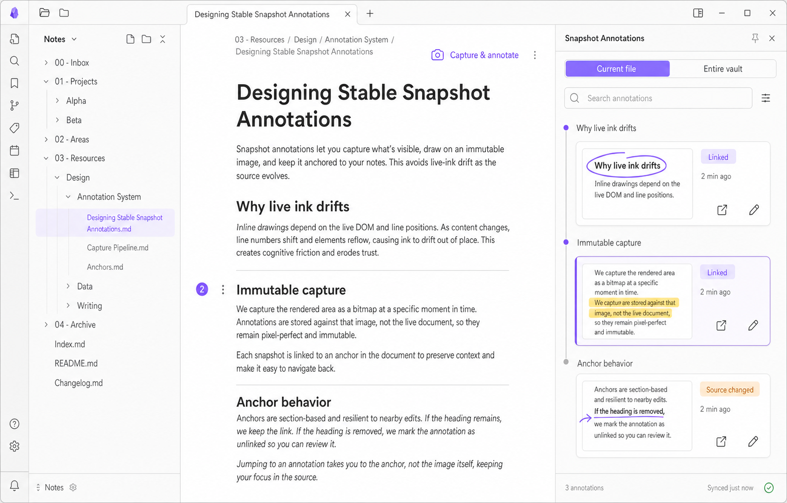
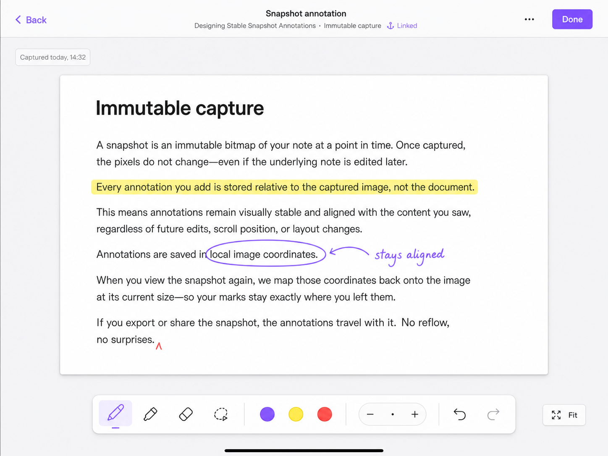
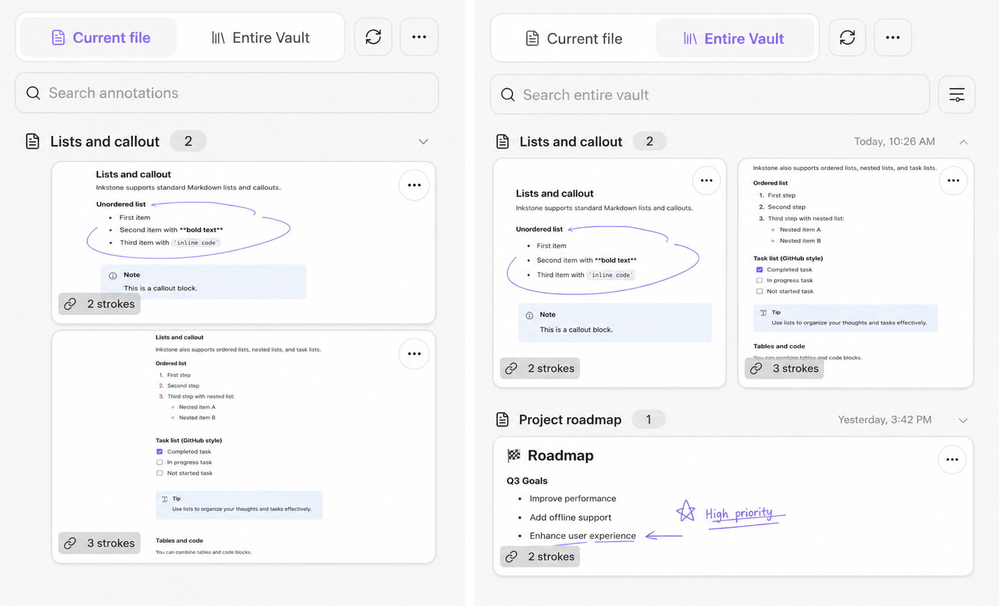

# Snapshot Annotation UI Concept

## Status

- Created: 2026-07-22
- Status: exploratory UI direction; not an implementation specification
- Platforms: desktop Obsidian and iPad landscape
- Companion implementation specification: `2026-07-22-snapshot-annotation-capture-and-markup.md`

This concept replaces persistent freehand Ink over live, reflowable Markdown with an immutable
captured image that remains semantically linked to its source location. It records the current
product discussion and generated mockups without superseding the existing Ink specifications.

## Product Model

```text
mutable Markdown
    -> semantic source anchor
immutable captured image
    -> image-local stroke coordinates
editable snapshot Ink
```

The snapshot never reflows. Markdown edits may change the source-link state, but they do not move or
warp the saved strokes.

## Desktop Direction



The desktop concept emphasizes navigation and context management:

- `Capture & annotate` is an explicit Reading View action.
- Live Markdown contains no Snapshot marker/count and saved Ink is not painted over the live
  document; source visibility activates Current file without visible DOM decoration.
- `Current file` groups snapshot cards by resolved document heading and orders them by source
  position.
- A document-position rail and active card connect the visible Markdown section to its snapshots.
- Jump-to-anchor and edit-snapshot are separate actions.
- Source-link health is visible as `Linked`, `Source changed`, or an eventual unanchored state.

## iPad Direction



The iPad concept emphasizes a focused, bounded Pencil session:

- Capture opens a full-screen editor over one immutable image.
- Obsidian's native title bar remains visible; editor source context and status sit below it without
  a custom Back button, while the shared toolbar keeps explicit `Done` semantics.
- A bottom toolbar provides Pencil-sized targets for pen, highlighter, eraser, selection, color,
  width, undo, redo, and Fit.
- The editor opens in centered Fit, capped at 100%; manual zoom may go above 100%.
- Sidebars and live Markdown controls remain hidden while drawing.
- Returning should restore the original note and reading position.

## Interaction Notes

- On touch devices, editing must have an explicit button. Double-tap may be a desktop convenience,
  but cannot be the only edit gesture.
- Sidebar scroll-follow should pause while the user is directly manipulating the sidebar.
- A saved snapshot remains viewable when its source anchor becomes ambiguous or unresolved.
- Source changes create status, not automatic screenshot replacement or stroke rebase.
- Desktop ordinary wheel remains native and `Cmd + wheel` zooms the Snapshot. In Select and move Ink
  mode, dragging empty canvas pans the image while dragging a hit stroke moves the stroke.
- V1 accepts the captured viewport directly and exposes no crop step.

## Snapshot Card and Entire Vault Follow-up



This follow-up turns the user's card sketch into the implementation reference for both sidebar
scopes:

- the captured page is the card rather than a small leading thumbnail;
- landscape and portrait captures retain their relative aspect without cropping;
- a compact lower-left badge carries link state and stroke count;
- one upper-right overflow menu replaces exposed edit/export/delete button rows; and
- Entire Vault groups the same cards by Markdown file, with search, type filter, sort, and lazy
  thumbnail loading.

## Source Manifest

### Sources

- User discussion in the current Codex session on 2026-07-22: proposed an iPad-style screenshot,
  markup, save, Current file navigation, scroll activation, source-anchor jump, and reopen-to-edit
  workflow.
- User follow-up on 2026-07-22: remove crop, use `Cmd + wheel` for desktop zoom, pan empty canvas in
  Select mode, and preserve Obsidian's native title bar instead of overlapping macOS window
  controls.
- User follow-up on 2026-07-22: use `imagegen` to redesign the cramped Snapshot rows from the
  supplied large-card sketch and add a populated Entire Vault experience.
- `CONTEXT.md`: current Ink domain language and canonical/disposable data boundaries.
- `docs/specs/2026-07-14-obsidian-annotation-plugin-design.md`: annotation, compound-anchor,
  fail-closed, Current file, mobile-first, and sidecar product baseline.
- `docs/specs/2026-07-22-ink-ipad-immediate-usability-patch.md`: current physical-iPad rendering,
  overflow, position, and post-zoom failure evidence.
- `src/ui/sidebar/current-file-sidebar-app.tsx` and `styles.css`: existing Current file hierarchy,
  Obsidian theme tokens, spacing, and control conventions.
- `/Users/ivan/.codex/skills/.system/imagegen/SKILL.md` and its prompting guidance: image-generation
  workflow and UI-mockup prompt constraints.

### Produced artifacts

- `docs/specs/2026-07-22-snapshot-annotation-ui-concept.md`
- `docs/specs/assets/snapshot-annotations/desktop-current-file.png`
- `docs/specs/assets/snapshot-annotations/ipad-snapshot-editor.png`
- `docs/specs/assets/snapshot-sidebar-card-and-vault-ui-v2.png`

### Key decisions

- Raw Ink is local to an immutable captured image rather than the live Markdown layout.
- Markdown linkage is semantic and used for ordering, activation, navigation, and recoverability.
- Desktop prioritizes Current file context; iPad drawing prioritizes a focused full-screen canvas.
- Live Markdown shows no Snapshot marker/count or persisted freehand overlay.
- Current file and Entire Vault reuse one preview-first Snapshot card and one action-menu model.

### Verification evidence

- Both generated PNG files were inspected for layout hierarchy, requested interaction affordances,
  and text legibility.
- Desktop PNG: 1568 x 1003, SHA-256
  `949e162729cc9471b68b07f85424204c38a448ed3dcb4429e8cf58d3bacd144e`.
- iPad PNG: 1448 x 1086, SHA-256 `9116c1a2d5934ddd1c4d42bc543f9d29128976c1a382808eca694b6eb7b25cab`.
- Sidebar follow-up PNG: 1610 x 977, SHA-256
  `a57e4fa6de77b37b699c7b108ea1768509128b224b457e9bd3e0d8406b7372a2`.
- No implementation, browser acceptance, or physical-iPad usability test was performed for this UI
  concept.

### Open questions / risks

- Physical-iPad feasibility and fidelity of capturing the visible Obsidian Reading View must be
  proven before treating this direction as implementation-ready.
- The supported capture scope for images, Mermaid, Dataview, Canvas, SVG, and third-party embeds is
  undecided.
- Capture resolution, compression, storage lifecycle, iCloud transfer cost, and asset garbage
  collection need explicit contracts.
- The exact anchor coverage model and scroll-follow thresholds need interaction prototyping.
- Portrait iPad, narrow desktop sidebar, dark theme, accessibility, and failure states are not yet
  designed.
