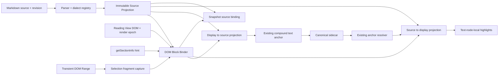

# Parser-backed Text Source Projection and Powerful Reading Selection

- Created: 2026-07-23
- Status: implementation delivered; release qualification pending physical-iPad P0
- Scope: Reading View text selection, Markdown source projection, highlight restoration, and
  Snapshot source binding

## Relationship to Existing Specifications

This focused correction supersedes the rendered-text-to-source mapping mechanics described by:

- `Anchor Creation`, `First-Version Supported Content`, and `First-Version Restricted Content` in
  [the base product specification](2026-07-14-obsidian-annotation-plugin-design.md).
- The hand-scanned rendered/source mapping implementation delivered by S02 and S03 in
  [the master execution plan](2026-07-14-obsidian-annotation-plugin-execution-plan.md).

The S02 and S03 artifacts remain valid historical evidence. Their persistence, compound-anchor,
resolver, overlap, and fail-closed decisions remain in force. This specification replaces only the
mapping foundation and expands the source-backed Reading View surfaces that can be selected.

The following decisions are unchanged:

- Sidecars are canonical.
- A DOM `Range` is transient input and is never persisted.
- `TextPosition` plus `TextQuote` plus structural scope remains the canonical compound text target.
- Ambiguous targets fail closed. The plugin never guesses.
- Editing mode remains dormant under
  [the editing-mode dormancy correction](2026-07-17-editing-mode-dormancy.md).
- Visually generated content without a stable Markdown source routes to
  [Snapshot Annotation](2026-07-22-snapshot-annotation-capture-and-markup.md).

## Executive Decision

Inkstone will replace its line-oriented, hand-written Markdown scanner with one parser-backed,
bidirectional **Source Projection**.

Source Projection is a revision-scoped semantic model that connects:

```text
Markdown UTF-16 source offsets
        ↕
source-backed visible text runs
        ↕
actual Obsidian Reading View DOM
```

The same projection must serve all source/visual mapping consumers:

1. Reading View DOM selection to canonical Markdown source range.
2. Canonical source range back to Reading View highlight fragments.
3. Snapshot Annotation source-block capture and jump-to-source.
4. Local diagnostics explaining why a surface is or is not source-backed.

There must not be separate competing heuristics for creation, restoration, and Snapshot binding.

The initial implementation should use a CommonMark-compliant, position-preserving parser with an
extension mechanism. The recommended stack is [micromark](https://github.com/micromark/micromark)
plus the relevant [mdast/remark](https://github.com/remarkjs/remark) utilities and explicit
Obsidian-dialect extensions. Undocumented Obsidian parser internals must not become a production
dependency.

## Problem Statement

The current mapper does not fail mainly because the selected sentence is duplicated. It fails
because it tries to reconstruct Markdown semantics by scanning lines and then requires a rendered
block to match one of the guessed source candidates.

The observed failure classes are structural:

- A contiguous list is consumed as one candidate while Obsidian exposes each `<li>` as a selectable
  block. The first item can map while later items cannot.
- Inline code causes the entire containing block to be rejected, even when the user selects only
  ordinary text beside the code.
- Unaliased wikilinks are rejected while aliased wikilinks can pass.
- Selection support is coupled to whole-block projection, so unsupported syntax anywhere in a block
  can invalidate an otherwise traceable subrange.
- All projection failures are surfaced as “ambiguous”, hiding the difference between unsupported
  syntax, stale render context, no match, generated content, and genuine multiple matches.
- Creation, reverse highlight rendering, and Snapshot source lookup reuse the same brittle block
  locator without a semantic intermediate representation.

In the inspected UAT note, 8 of 17 controller-supported Reading View blocks mapped and 9 failed. All
nine failed blocks were list items. The selected paragraph shown in the reported screenshot was
unique in the Markdown source, demonstrating that a generic ambiguity message is not diagnostic
evidence.

## Goals

### G1 — Select source-backed visible text

Users can annotate visible text wherever Inkstone can prove a stable, monotonic relationship to
Markdown source, including lists, nested lists, links, wikilinks, inline code, fenced code,
blockquotes, callouts, and tables.

### G2 — One bidirectional truth

Creation and restoration use the same revision-scoped projection. A source interval accepted during
creation must project back to the same visible text on an unchanged render.

### G3 — Precise failure

Unsupported and ambiguous cases remain fail-closed, but the user sees the actual reason and the
system retains a structured diagnostic code.

### G4 — Mobile-safe latency

Full-source parsing is amortized by source revision and never added as uncached synchronous work to
`mouseup`, `selectionchange`, or touch-selection stabilization.

### G5 — Preserve durable anchors

The new projection improves target creation without replacing the existing durable compound anchor
or resolver pipeline.

### G6 — Extensible Obsidian dialect

Obsidian-specific syntax and third-party renderers have explicit adapters and tests. New syntax does
not require editing one monolithic scanner.

## Non-goals

- Persisting DOM paths, DOM nodes, CSS selectors, or DOM `Range` objects.
- Re-enabling Live Preview or Source Mode annotation creation.
- Guessing a source target for generated or reordered DOM.
- Annotating arbitrary Dataview, Mermaid, iframe, Canvas, PDF, or embedded-note output as if it were
  local Markdown text.
- Changing sidecar schema merely to deliver the first projection cutover.
- Supporting one durable target made from discontiguous or visually reordered source ranges.
- Replacing the existing text-anchor resolver, unanchored lifecycle, or overlap renderer.
- Using a remote service, telemetry pipeline, or private Obsidian parser API.

## Domain Language

### Source Projection

An immutable, pure representation derived from one Markdown source revision and one dialect version.
It records semantic blocks and the relationship between source offsets and visible text.

### Projected Block

A semantic source block such as a paragraph, heading, list item, table cell, code block, or callout
body. A projected block owns a source interval, structural path, visible-text stream, and visible
runs.

### Visible Run

One mapping segment between a source interval and a display interval. Runs distinguish literal text,
atomic transformations, hidden syntax, and generated presentation.

### DOM Block Binding

A transient, render-epoch-scoped association between one actual Reading View element and one
projected block. It is derived from section bounds, semantic kind, DOM order, neighboring blocks,
and visible-stream validation.

### Source-backed

A displayed selection is source-backed only when every selected display fragment maps to one unique,
monotonic source interval under the current source revision and render epoch.

### Generated Content

Visible DOM whose text is produced, substituted, reordered, or fetched by a renderer without a
registered stable mapping to the current Markdown file.

## Product Requirements

| ID         | Requirement                                                                                                                        |
| ---------- | ---------------------------------------------------------------------------------------------------------------------------------- |
| TXT-SP-001 | Inkstone must parse the complete current Markdown source into one immutable projection per revision.                               |
| TXT-SP-002 | Parser and dialect extensions must preserve exact source offsets in the repository's UTF-16 coordinate system.                     |
| TXT-SP-003 | Selection creation and highlight restoration must use the same projected blocks and visible runs.                                  |
| TXT-SP-004 | DOM binding must use `getSectionInfo()` only as a bounded, just-in-time hint, not as an exact node source map.                     |
| TXT-SP-005 | A mapping is accepted only when block binding and both selected endpoints are unique.                                              |
| TXT-SP-006 | Multiple selected blocks may have different semantic kinds when their mappings are unique, ordered, and coalescible.               |
| TXT-SP-007 | Hidden Markdown syntax inside accepted endpoints may remain in `quote.exact`; `displayText` preserves what the user saw.           |
| TXT-SP-008 | Syntax markers at the outer selection edges must be excluded whenever the visible endpoints map inside source text.                |
| TXT-SP-009 | Unsupported syntax elsewhere in a block must not invalidate an independently traceable selected run.                               |
| TXT-SP-010 | Generated or non-monotonic content must fail closed and offer Snapshot Annotation when applicable.                                 |
| TXT-SP-011 | Every failure must retain a typed reason code and show reason-specific user copy.                                                  |
| TXT-SP-012 | The projection cache must be bounded and invalidated by source revision, dialect version, and render epoch where applicable.       |
| TXT-SP-013 | No interaction handler may synchronously parse an uncached full note.                                                              |
| TXT-SP-014 | New production syntax support requires a dialect fixture, DOM binding fixture, round-trip test, and explicit support-matrix entry. |
| TXT-SP-015 | Production cutover must not silently fall back to the legacy mapper after the new mapper rejects a target.                         |
| TXT-SP-016 | Local diagnostics may explain candidates and rejection reasons but must not transmit note content.                                 |

## Architecture



### Architecture Boundaries

| Layer                    | Responsibility                                                                                                                    |
| ------------------------ | --------------------------------------------------------------------------------------------------------------------------------- |
| `src/domain/`            | Pure parser-facing projection types, dialect semantics, offset mapping, invariants, and typed errors. No DOM or Obsidian imports. |
| `src/application/`       | Projection acquisition, cache ports, anchor preparation orchestration, and fallback decisions.                                    |
| `src/adapters/obsidian/` | Reading View DOM capture, `getSectionInfo()` access, DOM block binding, render-epoch lifecycle, and Snapshot integration.         |
| `src/storage/`           | No new canonical projection data. Any persisted cache is disposable and versioned.                                                |
| `src/ui/`                | Reason-specific feedback, progress state when projection is warming, and Snapshot fallback action. No sidecar writes.             |
| `src/runtime/`           | Local timings, bounded-cache diagnostics, and performance plumbing only.                                                          |

## Pure Source Projection Contract

The following is a conceptual contract. Exact names may change during TDD, but the information and
invariants may not be weakened.

```ts
type ProjectedBlockKind =
  | 'paragraph'
  | 'heading'
  | 'list-item'
  | 'blockquote'
  | 'callout-title'
  | 'callout-body'
  | 'table-cell'
  | 'code-block'
  | 'math-block';

type VisibleRunMapping = 'identity' | 'atomic' | 'hidden' | 'synthetic';

type VisibleRunRole =
  'text' | 'link-label' | 'inline-code' | 'code-text' | 'math' | 'syntax' | 'generated';

interface SourceProjectionKey {
  filePath: string;
  sourceRevision: string;
  dialectVersion: string;
}

interface SourceProjection {
  key: SourceProjectionKey;
  sourceLength: number;
  blocks: readonly ProjectedBlock[];
}

interface ProjectedBlock {
  id: string;
  kind: ProjectedBlockKind;
  sourceStart: number;
  sourceEnd: number;
  structuralPath: readonly StructuralPathSegment[];
  visibleText: string;
  runs: readonly VisibleTextRun[];
}

interface VisibleTextRun {
  sourceStart: number;
  sourceEnd: number;
  displayStart: number;
  displayEnd: number;
  mapping: VisibleRunMapping;
  role: VisibleRunRole;
  selectable: boolean;
}
```

### Projection Invariants

1. All source and display intervals are half-open UTF-16 intervals.
2. Block source intervals are bounded by the source length.
3. Display intervals within a block are ordered and non-overlapping.
4. Selectable runs can project each accepted display boundary to one deterministic source boundary.
5. `identity` maps equivalent source and display code-unit sequences.
6. `atomic` maps one indivisible display unit to a larger or transformed source interval, such as an
   entity or supported rendered math element.
7. `hidden` consumes source but contributes no display text, such as emphasis delimiters, link
   destinations, task markers, block IDs, or comments.
8. `synthetic` contributes display text but has no source interval. It is non-selectable unless an
   explicit dialect adapter supplies canonical source semantics.
9. No projected block may claim source text owned by an unrelated sibling block.
10. A projection built for one revision is never reused for another revision.

### Boundary Semantics

Selections are defined by visible endpoints, not by whole-block equality:

- Selecting `bold` inside `**bold**` maps to the inner source characters and excludes the outer
  delimiters.
- Selecting across `plain **bold** tail` may produce a canonical source quote containing internal
  `**` markers while `displayText` remains `plain bold tail`.
- Selecting the visible label in `[label](destination)` maps to `label`, excluding brackets and
  destination at the outer edges.
- Selecting across a link and adjacent text may necessarily include hidden link syntax inside the
  one contiguous canonical source interval.
- Selecting a rendered entity maps the indivisible display character to the complete entity source.
- A browser endpoint inside synthetic or non-selectable presentation is rejected rather than snapped
  to a guessed neighbor.

## Parser and Dialect Registry

### Core Parser Choice

The default implementation should use micromark-compatible token positions and mdast semantics
because the stack provides CommonMark compliance, concrete positional information, and extension
points. Parser selection is accepted only after a spike proves:

- Browser and Obsidian mobile compatibility.
- UTF-16 offset equivalence with JavaScript string slicing.
- Deterministic output for the supported fixture corpus.
- A production-bundle cost recorded in the Slice evidence.
- No Node.js or Electron top-level runtime imports.

If the recommended stack fails a gate, the replacement must still satisfy this projection contract.
Changing libraries is allowed; returning to hand-scanned line candidates is not.

### Dialect Modules

The registry must isolate syntax-specific behavior:

1. CommonMark block and inline syntax.
2. GFM task lists, tables, and strikethrough.
3. YAML frontmatter.
4. Obsidian wikilinks and embeds.
5. Obsidian `==highlight==`.
6. Obsidian callouts.
7. Obsidian block IDs.
8. Obsidian comments.
9. Math syntax.
10. Registered third-party source-backed renderers.

Each module declares:

- Recognized source syntax.
- Semantic block and run output.
- Hidden, visible, atomic, and synthetic regions.
- Whether partial selection is supported.
- DOM binding characteristics.
- Golden source and DOM fixtures.
- User-facing failure behavior when mapping is unavailable.

The dialect version is a stable digest or explicit version derived from the enabled module set and
their semantics. It participates in cache keys.

## DOM Block Binder

The parser cannot know the exact DOM produced by the active Obsidian version, theme, or plugin set.
The DOM Block Binder connects the pure projection to the current Reading View without persisting DOM
identity.

### Binder Inputs

- Current file path and source revision.
- Current immutable Source Projection.
- Current Reading View render epoch.
- The actual semantic element and its owned visible-text stream.
- A just-in-time `MarkdownPostProcessorContext.getSectionInfo()` result when available.
- Semantic DOM kind, ancestor path, and preceding/following source-backed siblings.

### Owned Visible Text

The binder must collect only text owned by the candidate block:

- A list item excludes text owned by nested child list-item blocks.
- Plugin-owned highlight wrappers are transparent.
- Task checkboxes, list bullets, fold controls, and generated callout icons are synthetic.
- `aria-label`, pseudo-elements, and CSS-generated content are not treated as source text.
- Hidden or non-rendered DOM does not contribute to the display stream.

### Binding Algorithm

1. Resolve the nearest supported semantic DOM block for each captured selection fragment.
2. Read section information immediately before candidate resolution. Treat null or stale data as a
   missing hint, not as permission to scan globally.
3. Restrict candidates to the current source section when valid; otherwise use a bounded neighboring
   block window derived from already-bound siblings.
4. Filter by compatible semantic kind and structural ancestry.
5. Validate the complete owned visible-text stream against each projected candidate, accounting for
   declared atomic and synthetic runs.
6. Enforce monotonic DOM order and projected source order across sibling bindings.
7. Accept only one candidate. Zero candidates is `not-found`; multiple candidates is `ambiguous`.
8. Cache the binding only for the current source revision and render epoch.

Whole-note global text equality is never sufficient evidence by itself. Repeated text is resolved by
bounded structure and monotonic neighboring context; if it is still not unique, binding fails
closed.

### Render Epoch

Each Reading View mount or post-processor rerender receives a new render epoch. DOM bindings and
text-node indices are scoped to that epoch. Source Projection can survive a rerender when the source
revision is unchanged; DOM bindings cannot.

## DOM Selection to Source Algorithm

1. Capture the transient browser `Range`, direction, and visible selected text.
2. Split the range into ordered text-node-local fragments while excluding plugin chrome and
   explicitly generated surfaces.
3. Associate each fragment with one semantic DOM block.
4. Resolve a unique Projected Block through the DOM Block Binder.
5. Convert the fragment's DOM text offsets to offsets in the block's owned display stream.
6. Project both display endpoints through selectable visible runs.
7. Merge adjacent fragments that refer to the same projected run.
8. Verify that all source fragments are monotonic and can be coalesced into one contiguous source
   interval.
9. Slice `quote.exact` from the unmodified Markdown source. Preserve the normalized visible
   selection as `displayText` when it differs.
10. Pass the source interval to the existing `createTextAnchor()` path for prefix, suffix,
    structural scope, source revision, and persistence.

### Multi-block Selection

The current “same block kind only” rule is removed. A paragraph-to-list, list-to-quote, or
heading-to-paragraph selection is allowed when:

- Every block binding is unique.
- DOM and source orders agree.
- The selected fragments can be represented by one contiguous source interval.
- No selected endpoint is generated or non-selectable.
- Reverse projection on the unchanged render reproduces the visible selection.

Discontiguous multi-range browser selections, column selections, or renderer-reordered output remain
unsupported until the canonical target schema can represent an ordered set of source intervals.

## Source to DOM Algorithm

Highlight restoration must not locate blocks with a second Markdown scanner.

1. The existing anchor resolver returns a canonical source interval or `unanchored`.
2. Query the Source Projection for projected blocks intersecting the source interval.
3. Project each intersection through visible runs.
4. Hidden source-only regions contribute no highlight fragment.
5. Resolve each projected block to its current DOM binding.
6. Convert display intervals to text-node-local DOM intervals.
7. Feed those intervals to the existing overlap render plan and wrapper lifecycle.
8. If any required block cannot bind uniquely, retain the canonical record and expose a render
   diagnostic. Do not mutate or delete the anchor.

For an unchanged source revision and render epoch:

```text
accepted DOM selection
  → source interval
  → DOM highlight fragments
```

must reproduce the same normalized visible text.

## Snapshot Annotation Integration

Snapshot Annotation remains the fallback for visual content without one stable text-source mapping.
It must also consume Source Projection for source-aware operations:

- Capture of source blocks covered by a viewport region.
- Jump from Snapshot provenance to the corresponding source or Reading View block.
- Re-finding the rendered element for an existing Snapshot source anchor.
- Explaining when a capture includes generated content outside local Markdown.

The Snapshot manager must not keep separate calls to the legacy block-candidate locator after the
projection cutover.

### Fallback UX

When a text selection is rejected as `generated-content` or `unsupported-syntax` and a usable
viewport exists, the reason panel may offer:

```text
This content is rendered from something Inkstone cannot trace to this Markdown file.
[Annotate a snapshot instead]
```

The fallback is explicit. Inkstone never silently converts a failed text annotation into a Snapshot
Annotation.

## Support Matrix

This matrix defines the target after the projection cutover, not the behavior of the legacy mapper.

| Surface                                     | Text Annotation target                                               | Notes                                                                                 |
| ------------------------------------------- | -------------------------------------------------------------------- | ------------------------------------------------------------------------------------- |
| Paragraphs and headings                     | Supported                                                            | Partial and cross-node selection.                                                     |
| Bold, italic, highlight, strikethrough      | Supported                                                            | Outer syntax excluded; internal syntax may remain in canonical quote.                 |
| Lists, task lists, and nested list items    | Supported                                                            | Each list item is a distinct projected block; checkbox is synthetic.                  |
| Blockquotes                                 | Supported                                                            | Quote markers are hidden source runs.                                                 |
| Callout body                                | Supported                                                            | Same source ownership as quoted body.                                                 |
| Explicit callout title                      | Supported                                                            | Title source is selectable.                                                           |
| Default/generated callout title and icon    | Not text-selectable                                                  | Synthetic presentation.                                                               |
| Markdown links                              | Visible label supported                                              | Destination hidden at outer edges.                                                    |
| Aliased and unaliased wikilinks             | Visible label supported                                              | Alias/target semantics provided by dialect module.                                    |
| Inline code                                 | Supported                                                            | Backticks hidden; code text source-backed.                                            |
| Fenced code and syntax-highlighted spans    | Supported                                                            | Fence/info string hidden; selected code text must remain monotonic.                   |
| GFM tables                                  | Supported by cell                                                    | DOM cell and projected cell must bind uniquely.                                       |
| Escapes and character entities              | Supported                                                            | Atomic runs where display/source lengths differ.                                      |
| Block IDs and Obsidian comments             | Visible surrounding text supported                                   | Hidden syntax is non-selectable.                                                      |
| Whole rendered math element                 | Not text-selectable until a proven DOM adapter exists                | Pure projection models it atomically; current MathJax DOM proof is incomplete.        |
| Partial rendered math                       | Unsupported initially                                                | Display glyphs are not reliably monotonic with TeX source.                            |
| Static raw HTML                             | Surrounding source text only                                         | HTML-rendered text endpoints remain unsupported until a deterministic adapter exists. |
| Embedded notes and cross-file transclusions | Snapshot fallback initially                                          | Requires explicit source-file and embed-instance semantics.                           |
| Mermaid, Dataview, iframe, query results    | Snapshot fallback                                                    | Generated content.                                                                    |
| Third-party renderer output                 | Unsupported unless a registered adapter proves stable source mapping | No class-name heuristic.                                                              |
| Visually reordered or discontiguous content | Unsupported under current target schema                              | Requires a future multi-range anchor.                                                 |

## Typed Failure Model

The application boundary returns structured failure, never an undifferentiated exception:

```ts
type SourceProjectionFailureCode =
  | 'empty-selection'
  | 'outside-reading-view'
  | 'projection-warming'
  | 'stale-context'
  | 'unsupported-syntax'
  | 'generated-content'
  | 'non-monotonic-selection'
  | 'source-target-not-found'
  | 'source-target-ambiguous'
  | 'internal-error';
```

| Code                      | User-facing meaning                                                       | Retry / action                                |
| ------------------------- | ------------------------------------------------------------------------- | --------------------------------------------- |
| `empty-selection`         | Select some text first.                                                   | Adjust selection.                             |
| `outside-reading-view`    | Text annotations are available in Reading View.                           | Open Reading View.                            |
| `projection-warming`      | Inkstone is preparing this note for selection.                            | Keep selection; retry automatically.          |
| `stale-context`           | The note or preview changed while the selection was being mapped.         | Re-capture after current render settles.      |
| `unsupported-syntax`      | This Markdown feature is not yet selectable.                              | Name the feature; offer Snapshot when useful. |
| `generated-content`       | This visible content cannot be traced to the current Markdown source.     | Offer Snapshot.                               |
| `non-monotonic-selection` | The visible selection does not correspond to one continuous source range. | Narrow selection.                             |
| `source-target-not-found` | Inkstone could not connect this rendered block to the current source.     | Rerender/retry; retain local diagnostic.      |
| `source-target-ambiguous` | More than one source target remains possible after structural binding.    | Narrow selection or add context.              |
| `internal-error`          | Inkstone could not prepare this annotation.                               | Retry; log redacted local diagnostic.         |

The word “ambiguous” is reserved for two or more surviving source candidates.

## Persistence and Compatibility

No text-annotation schema migration is required for the first cutover:

- `position.start` and `position.end` remain canonical UTF-16 source offsets.
- `quote.exact` remains the canonical Markdown source slice.
- `quote.prefix` and `quote.suffix` remain source context.
- `displayText` remains optional and stores normalized visible text when it differs from
  `quote.exact`.
- Structural scope and source revision remain resolver evidence.
- Existing S02/S03 records continue through the current resolver.

The projection is disposable derived state. It must not become more canonical than the Markdown file
or sidecar.

A future schema version may add an ordered set of source intervals for discontiguous or reordered
content. That decision is explicitly deferred.

## Unicode and Line-ending Contract

The complete mapping path must use UTF-16 code units because current persisted positions and
JavaScript DOM offsets use that coordinate system.

Required fixtures include:

- CJK text.
- Emoji inside and outside the Basic Multilingual Plane.
- Combining characters.
- Bidirectional text.
- Escaped punctuation.
- Named, decimal, and hexadecimal entities.
- LF and CRLF notes.
- Variation selectors and zero-width joiner emoji sequences.

Parser offsets must be proven against direct JavaScript `slice()` behavior. Any parser line/column
coordinates are secondary; canonical offsets are absolute UTF-16 offsets into the exact source
string used to build the projection.

## Cache and Performance Policy

### Cache Keys and Invalidation

- Source Projection key: `{filePath, sourceRevision, dialectVersion}`.
- DOM binding key additionally includes `{viewId, renderEpoch}`.
- Source revision change invalidates projection and every dependent DOM binding.
- Reading View rerender invalidates DOM bindings but may reuse an unchanged Source Projection.
- Dialect registry change invalidates every projection built by the previous dialect version.

### Bounded Resources

- Keep projections in an LRU bounded by both entry count and estimated bytes.
- The implementation proposal must publish the chosen limits and mobile memory evidence.
- Text-node indices and DOM bindings are released on view cleanup.
- No derived mapping artifact is required for data recovery.

### Scheduling

1. Begin projection preparation after the current source revision is loaded, before user selection
   when practical.
2. Parse at most once per revision; concurrent consumers share one in-flight result.
3. Never parse an uncached full note synchronously inside a selection event.
4. If the projection is not ready, preserve the transient interaction context and finish mapping
   asynchronously only while source revision and render epoch remain current.
5. Yield between large DOM-binding batches so Reading View remains responsive.

### Performance Gates

These are targets to measure, not current claims:

| Scenario                                | Gate                                                               |
| --------------------------------------- | ------------------------------------------------------------------ |
| Cached single-block endpoint projection | P95 ≤ 8 ms desktop; P95 ≤ 16 ms physical iPad                      |
| Cached ten-block selection projection   | P95 ≤ 16 ms desktop; P95 ≤ 32 ms physical iPad                     |
| Visible-section DOM binding             | No long task over 50 ms; bounded yieldable batches                 |
| Toolbar after stable native selection   | Preserve base target: ≤ 100 ms desktop; ≤ 150 ms physical iPad     |
| 200,000-character note                  | One parse per revision; no parse-on-scroll or parse-per-selection  |
| Projection cache                        | Demonstrably bounded under repeated navigation across 100 notes    |
| Production bundle delta                 | Recorded and reviewed before cutover; no Node/Electron mobile leak |

## Security, Privacy, and Accessibility

- Parsing and binding are local-only.
- Diagnostics must not include full note text by default. They may include hashes, lengths, semantic
  kinds, candidate counts, offsets, and an explicitly enabled short redacted excerpt.
- No telemetry or external parser service is allowed.
- Failure feedback must be announced through the existing accessible status/error mechanism.
- Keyboard selection and native iPad selection handles must enter the same mapping path.
- The Snapshot fallback action must have visible text or an accessible name and must never steal the
  user's active selection before activation.

## Testing Strategy

### TDD Verticals

Implementation proceeds in vertical red-green-refactor cycles:

1. One failing pure projection fixture.
2. Minimum dialect/run implementation.
3. One failing DOM binding fixture.
4. Minimum binder integration.
5. Forward and reverse round-trip.
6. Real Reading View acceptance evidence.

Large parser replacement commits without observable vertical tests are not acceptable.

### Pure Projection Corpus

Every supported syntax fixture records:

- Exact Markdown input.
- Projected block kinds and source intervals.
- Visible text and all visible runs.
- Display endpoint to source endpoint examples.
- Source interval to display interval examples.
- Expected rejection for non-selectable regions.

### Required Automated Suites

- Golden CommonMark/GFM/Obsidian dialect fixtures.
- Regression fixtures for contiguous list items two and later.
- Inline code with an ordinary-text selection before and after it.
- Aliased and unaliased wikilinks.
- Nested lists, task lists, blockquotes, callouts, links, and tables.
- Syntax-highlighted fenced code with multiple DOM spans.
- Repeated identical text in sibling and distant blocks.
- Cross-kind, monotonic multi-block selection.
- Generated, reordered, embedded, and stale-render rejection.
- UTF-16 and CRLF matrix.
- Forward/reverse round-trip property tests.
- Existing resolver mutation, unanchored, and overlap suites.
- Snapshot source-block capture and jump-to-source integration.
- 200,000-character and 100-note cache/performance regressions.

### Round-trip Properties

For every accepted unchanged selection:

```text
display interval → source interval → display interval
```

must return the same normalized visible text and equivalent endpoint semantics.

For every accepted source-backed highlight:

```text
source interval → display fragments
```

must produce ordered, non-overlapping, text-node-local intervals inside the uniquely bound blocks.

No property test may convert ambiguity into an arbitrary match to make the suite pass.

## Human Acceptance

The HAT Vault must include one dedicated Source Projection note and the reported
`UAT - Start Here.md`.

### Desktop P0

- Select and create annotations in every item of one tight contiguous list, including the second and
  last items.
- Repeat with nested and task lists.
- Select ordinary text immediately before and after inline code.
- Select inside inline code and a syntax-highlighted fenced code block.
- Select aliased and unaliased wikilink labels.
- Select across paragraph → list and heading → paragraph boundaries.
- Reload Obsidian and verify every accepted annotation restores to the same visible text.
- Confirm unsupported generated content offers an accurate reason and no text sidecar.
- Confirm an actual repeated ambiguous target says ambiguous and creates no sidecar.

### Physical iPad P0

- Repeat list, inline-code, wikilink, and cross-block selection with native handles.
- Verify projection warming does not collapse the selection or freeze scrolling.
- Verify toolbar latency and error announcements against the performance gate.
- Verify Snapshot fallback can be activated without accidental text-annotation creation.

### Negative P0

- Change the note between selection capture and commit; expect `stale-context`.
- Select partial rendered math; expect `unsupported-syntax`, not `ambiguous`.
- Select Dataview/Mermaid/embed output; expect `generated-content` and explicit Snapshot fallback.
- Force two indistinguishable bounded candidates; expect `source-target-ambiguous`.
- Disable a dialect adapter; expect its named unsupported reason and no legacy fallback.

## Delivery Sequence

This is sequencing guidance, not a substitute for a separately reviewed execution plan.

### SP0 — Parser and Projection Spike

- Prove the recommended parser stack, UTF-16 coordinates, mobile bundle safety, and representative
  Obsidian dialect extensions.
- Deliver pure projection fixtures and measured bundle/runtime evidence.
- No production cutover.

### SP1 — Paragraph, Heading, and List Vertical

- Introduce the projection port, cache, and DOM Binder.
- Cut one complete creation/restoration path for paragraphs, headings, lists, tasks, and nested
  lists.
- Run in developer-only shadow comparison against the old mapper. Note text remains local.

### SP2 — Inline and Complex Core Syntax

- Add emphasis, links, wikilinks, inline/fenced code, blockquotes, callouts, tables, entities, and
  multi-kind cross-block selection.
- Replace generic error copy with the typed failure model.

### SP3 — Unified Reverse Projection and Snapshot Binding

- Remove legacy locator use from highlight restoration and Snapshot source-aware operations.
- Verify one projection serves every mapping consumer.

### SP4 — Cutover and Legacy Removal

- Complete desktop and physical-iPad HAT.
- Record performance, reliability, bundle, and Source Manifest evidence.
- Remove the hand-scanned mapper only after all production callers have migrated.
- Do not retain the old mapper as an automatic fallback.

## Cutover, Rollback, and Observability

- During development, a local developer flag may run both mappers for comparison, but only the new
  result is eligible for new-path acceptance testing.
- Comparison logs contain reason codes, offsets, hashes, and candidate counts, not full note
  content.
- Production cutover changes no canonical schema, so release rollback can restore the previous code
  without migrating sidecars.
- Once cut over, a new-path rejection does not invoke the legacy mapper. Operational rollback is a
  plugin-version rollback, not per-selection heuristic fallback.
- Existing annotations remain recoverable through the current resolver even if a new render cannot
  bind; they become locally unrendered or `unanchored` according to existing semantics, never
  deleted.

## Exit Gate

This implementation is release-qualified only when all of the following are true:

- The reported tight-list regression maps every source-backed list item in `UAT - Start Here.md`.
- The supported syntax matrix has golden source fixtures and representative Obsidian DOM fixtures.
- Forward/reverse round-trip tests pass for every supported fixture.
- Supported fixtures produce zero false `ambiguous` errors.
- Ambiguous and generated fixtures produce zero false-positive source bindings.
- Creation, restoration, and Snapshot source binding have no production dependency on the legacy
  block candidate scanner.
- Existing text annotation records require no migration and continue to resolve.
- Desktop and physical-iPad P0 HAT are recorded.
- Performance, cache bounds, parser bundle cost, and mobile scan are recorded.
- `npm run check` passes.
- Slice evidence and its Source Manifest are complete.

### Current Gate Status — 2026-07-23

- Delivered: parser-backed forward/reverse projection, bounded cache, Reading View binding,
  creation/restoration, Snapshot capture/jump/refind migration, typed failure UX, legacy mapper
  removal, automated fixtures, desktop performance evidence, desktop HAT, mobile bundle scan, and
  Slice evidence.
- Desktop HAT additionally proved real Obsidian 1.12.7 behavior for tight lists, inline code,
  paragraph/list and heading/paragraph cross-block selection, postprocessor-root replacement after
  reload, and MathJax fail-closed Snapshot fallback.
- Open release gate: physical-iPad P0 latency, native selection-handle, scrolling, and accessibility
  evidence. It is not inferred from desktop, simulator, or automated evidence.
- Deferred surface: whole rendered-math selection remains disabled until an explicit MathJax DOM
  adapter proves a stable atomic boundary.

## Risks and Open Decisions

| Risk / decision                                    | Required treatment                                                                           |
| -------------------------------------------------- | -------------------------------------------------------------------------------------------- |
| Obsidian dialect differs from CommonMark           | Isolated dialect modules and golden fixtures; no private parser dependency.                  |
| Obsidian DOM changes across versions/themes        | Semantic binder contract plus captured representative DOM fixtures and real HAT.             |
| Parser bundle or memory cost is too high on iPad   | SP0 measurement gate; optimize projection representation or choose another compliant parser. |
| Third-party plugins mutate source-backed DOM       | Require an explicit registered adapter; otherwise generated-content/Snapshot.                |
| Static HTML browser repair changes text order      | Keep HTML-rendered endpoints unsupported until a deterministic adapter is proven.            |
| MathJax display/source mapping is not monotonic    | Keep partial selection unsupported and defer whole-element selection until DOM proof exists. |
| Cross-block source interval contains hidden syntax | Preserve canonical source quote and separate visible `displayText`.                          |
| Discontiguous selections require schema change     | Defer to a future ordered multi-range target proposal.                                       |
| Physical-iPad behavior remains unmeasured          | iPad P0 HAT is a cutover gate, not inferred from desktop or simulator evidence.              |

## Source Manifest

### Sources

- User report in the current Codex task on 2026-07-23 that many Reading View selections cannot be
  annotated, including the supplied screenshot showing the generic message
  `This selection is ambiguous in the Markdown source.`
- User instruction in the current Codex task on 2026-07-23 to create a specification following the
  recommended systematic selection architecture.
- Ephemeral screenshot source:
  `/var/folders/2q/6mht0dc90jxfygb7pxx6w5yh0000gn/T/codex-clipboard-2763fe00-9b33-441c-b2ff-773624d090f4.png`.
- Live UAT note inspected in Obsidian:
  `/Users/ivan/Downloads/Inkstone-UAT-Vault/UAT - Start Here.md`.
- `AGENTS.md` and `CONTEXT.md`.
- `docs/specs/2026-07-14-obsidian-annotation-plugin-design.md`.
- `docs/specs/2026-07-14-obsidian-annotation-plugin-execution-plan.md`.
- `docs/specs/2026-07-17-editing-mode-dormancy.md`.
- `docs/specs/2026-07-22-snapshot-annotation-capture-and-markup.md`.
- `docs/delivery/slices/S02-reading-highlight/source-manifest.md`.
- `docs/delivery/slices/S03-anchor-resolver/source-manifest.md`.
- Current implementation inspected on 2026-07-23:
  - `src/domain/rendered-source-map.ts`.
  - `src/adapters/obsidian/reading-selection.ts`.
  - `src/adapters/obsidian/reading-annotation-controller.ts`.
  - `src/adapters/obsidian/reading-view-integration.ts`.
  - `src/adapters/obsidian/snapshot-annotation-manager.ts`.
  - `src/application/annotation-service.ts`.
  - `src/domain/text-anchor.ts`.
  - `src/domain/text-anchor-resolver.ts`.
  - `src/ui/reading-highlight-renderer.ts`.
- Installed Obsidian API type declaration for `MarkdownPostProcessorContext.getSectionInfo()`.
- [W3C Web Annotation Selectors and States](https://www.w3.org/TR/selectors-states/).
- [micromark repository and extension model](https://github.com/micromark/micromark).
- [remark and mdast ecosystem](https://github.com/remarkjs/remark).
- `/Users/ivan/.agents/docs/agents/workflows.md`.
- `/Users/ivan/.agents/docs/agents/handoff-policy.md`.

### Produced Artifacts

- `docs/specs/2026-07-23-parser-backed-text-source-projection.md`.
- `docs/specs/README.md` index update.
- `docs/delivery/slices/S36-parser-backed-source-projection/`.
- `src/domain/source-projection.ts`.
- `src/adapters/obsidian/reading-source-projection.ts`.
- `test-fixtures/vault/Source Projection HAT.md` in the local acceptance Vault.

### Key Decisions

- Replace hand-scanned Markdown candidates with one parser-backed, bidirectional Source Projection.
- Keep the existing compound source anchor and resolver; never persist DOM identity.
- Bind DOM blocks with section hints, semantics, visible-stream validation, neighboring context, and
  monotonic order.
- Permit cross-kind selection when it maps uniquely to one contiguous source interval.
- Support source-backed links, wikilinks, inline/fenced code, lists, callouts, and tables through
  explicit dialect modules.
- Reserve `ambiguous` for actual multiple candidates and introduce typed failures for every other
  rejection class.
- Route generated content to explicit Snapshot Annotation fallback.
- Cache by source revision and dialect version; never synchronously parse an uncached full note in a
  selection handler.
- Require both desktop and physical-iPad evidence before production cutover.

### Verification Evidence

- Live Obsidian scan on 2026-07-23: 17 blocks accepted by the current controller's structural
  filter, 8 mapped, and 9 failed; all 9 failures were list items.
- The paragraph shown in the report, `这是独立的人工验收 Vault。`, occurs once and mapped to source
  offsets 16–32 in the inspected note.
- Minimized current-mapper regression:
  - Second item in a tight three-item list: failed.
  - The same text moved to the first item: passed.
  - The same items separated by blank lines: passed.
  - Plain prefix beside inline code: failed.
  - Unaliased wikilink: failed.
  - Aliased wikilink: passed.
- Focused existing suite passed 38 of 38 tests: `rendered-source-map.test.ts`,
  `reading-annotation-controller.test.ts`, and `reading-view-integration.test.ts`. This confirms a
  coverage gap rather than an already-failing checked-in test.
- Specification formatting, local links, fenced-block balance, and repository diff checks are
  recorded after file creation.
- S36 replaces that legacy suite with parser/dialect, DOM binding, selection, restoration, Snapshot,
  cache, and performance coverage. Final commands and counts are recorded in
  `docs/delivery/slices/S36-parser-backed-source-projection/test-results.md`.
- Desktop Obsidian 1.12.7 acceptance screenshots and sidecar offsets are recorded in
  `docs/delivery/slices/S36-parser-backed-source-projection/hat-guide.md`.

### Open Questions / Risks

- The selected mdast/micromark package set passed UTF-16, cache, performance, production-bundle, and
  mobile-scan gates; physical-iPad memory and latency remain unmeasured.
- Representative DOM fixtures and real Obsidian 1.12.7 desktop HAT pass without treating private
  class names as stable API; physical-iPad DOM and native-handle behavior remain to be recorded.
- Physical-iPad selection latency and selection-retention behavior remain unmeasured.
- Whole rendered-math selection remains intentionally disabled; partial MathJax selection is
  verified as `unsupported-syntax` with an explicit Snapshot fallback.
- A future multi-range anchor schema is required for discontiguous or renderer-reordered selection.
- The screenshot source is in an ephemeral temporary directory; its visible error message and the
  associated live-note evidence are summarized in this durable artifact.
