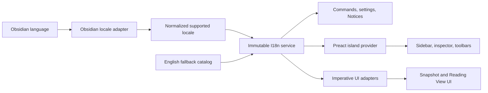
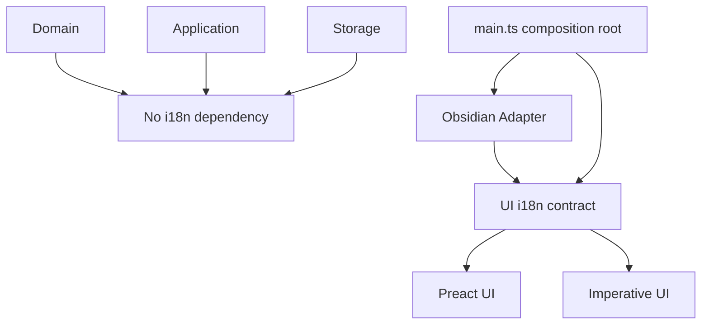

# Inkstone Annotations Internationalization

## Status

- Created: 2026-07-24
- Strategy status: approved in conversation
- Detailed execution status: awaiting planning and source-language baseline approval
- Source language: English (`en`)
- First target language: Simplified Chinese (`zh`)
- Minimum supported Obsidian version: 1.7.2

## Executive Decision

Inkstone Annotations SHALL provide a typed, synchronous, bundled internationalization layer for all
user-facing plugin copy. English remains the source of truth. The first complete target locale is
Simplified Chinese. The active locale follows the configured Obsidian language at plugin startup,
and unsupported or incomplete locales fail closed to English.

The first milestone SHALL NOT add a plugin-specific language selector. Obsidian reloads when its
application language changes, so commands, views, settings, Notices, imperative UI, and Preact
islands can resolve one immutable locale during plugin startup and remain consistent for the whole
plugin lifecycle.

The implementation SHALL use a small project-owned catalog rather than a general-purpose i18n
runtime. Locale catalogs are bundled with the plugin, require no network access, and are validated
for key and parameter parity before release.



## Current-State Inventory

There is no existing i18n package, locale resolver, translation catalog, or missing-key feedback
loop.

The current source has these notable user-facing surfaces:

- approximately 31 `Notice` calls in `src/main.ts`;
- 9 registered command definitions in `src/main.ts`;
- 42 TSX files under `src/ui/`;
- mixed English and Simplified Chinese in `src/settings-tab.ts`;
- high copy density in:
  - `src/ui/sidebar/vault-annotation-sidebar-app.tsx`;
  - `src/ui/sidebar/current-file-sidebar-app.tsx`;
  - `src/ui/inspector/annotation-inspector-app.tsx`;
  - `src/ui/ink/ink-toolbar-app.tsx`;
  - `src/ui/floating/quick-highlight-toolbar-app.tsx`;
  - Snapshot editor and annotation decision dialogs;
- literal assertions for visible text, tooltips, placeholders, and accessibility labels across the
  existing Vitest suite;
- dynamic English formatting for annotation types, statuses, counts, timestamps, file groups, export
  results, and error feedback;
- persisted default style names (`Sun`, `Mint`, `Sky`, `Rose`, and `Violet`) that must be
  distinguished from user-authored custom names.

Obsidian 1.13 exposes the public `getLanguage()` function, but that API was added in Obsidian 1.8.7.
Inkstone's minimum supported version remains 1.7.2, whose public type surface exposes `moment` but
not `getLanguage()`.

## Product Goals

1. Make every Inkstone-owned, user-facing string available in English and Simplified Chinese.
2. Follow the configured Obsidian language without requiring a separate Inkstone preference.
3. Preserve English behavior and layout as the source-language regression baseline.
4. Translate visible text and accessibility semantics together.
5. Provide correct locale-aware counts, plural forms, dates, and numbers.
6. Prevent new hard-coded user-facing copy from bypassing the catalog.
7. Keep locale selection and translation deterministic, synchronous, offline, and testable.
8. Preserve the current mobile, pop-out window, Preact island, imperative Canvas, and Obsidian
   compatibility contracts.
9. Make adding a later locale a bounded catalog-and-acceptance change rather than another
   architecture migration.

## Non-Goals

- Translating user-authored Markdown, notes, tags, file paths, headings, or custom style names.
- Adding locale data to Sidecars, IndexedDB caches, indexes, drafts, or export filenames.
- Changing stable annotation IDs, style IDs, command IDs, plugin ID, schema values, or diagnostic
  metric names.
- Sending copy or user data to a translation service.
- Runtime language-pack downloads.
- Automatically mapping Traditional Chinese (`zh-TW`) to Simplified Chinese.
- Delivering Traditional Chinese, RTL layout, or more than one target language in the first
  milestone.
- Localizing Obsidian Marketplace metadata at runtime. `manifest.json` remains an English,
  marketplace-compatible artifact.
- Translating developer logs, assertion messages, invariant errors, or machine-readable export
  fields unless they are intentionally presented as user-facing copy.
- Mutating persisted user settings merely to translate a default display name.

## Language and Fallback Contract

### Supported locales

```ts
type SupportedLocale = 'en' | 'zh';
```

Locale resolution SHALL apply these rules in order:

1. Read `getLanguage()` when the running Obsidian version exposes it.
2. Fall back to Obsidian's exported `moment.locale()` value on versions without `getLanguage()`.
3. Normalize case and separators only for comparison; retain explicit locale distinctions.
4. Resolve `zh` to the Simplified Chinese catalog.
5. Resolve `en` and English regional variants to English.
6. Resolve every other locale, including `zh-TW`, to English until an exact supported catalog
   exists.

The Adapter SHALL feature-detect `getLanguage()` behind an adapter-local compatibility type. UI,
Domain, Application, and Storage modules SHALL NOT inspect Obsidian APIs directly.

The active `SupportedLocale` is immutable for one plugin lifecycle. No UI island may independently
read browser or document locale state.

### Fallback behavior

- English is the complete fallback catalog.
- A missing target-locale key returns the English value, never a raw key.
- A missing English key is a test/build failure.
- Development diagnostics may record a missing target key without user data, but production UI must
  not display debug warnings.
- Catalog failures must never prevent the plugin from loading; startup falls back to English.

## Architecture

### Module placement

```text
src/ui/i18n/
  contract.ts
  create-i18n.ts
  locale-catalog.ts
  locale-context.tsx
  locales/
    en.ts
    zh.ts

src/adapters/obsidian/
  obsidian-locale.ts

scripts/
  check-i18n.mjs
```

The exact file split may be refined during TDD, but the dependency direction is fixed:



### I18n service

The presentation contract SHALL expose at least:

```ts
interface I18n {
  readonly locale: SupportedLocale;
  t<Key extends MessageKey>(key: Key, parameters: MessageParameters[Key]): string;
  formatNumber(value: number): string;
  formatDateTime(value: string | Date): string;
}
```

Parameterless messages may use an ergonomic overload, but parameter names remain statically
associated with their keys.

Preact roots SHALL provide the service through an island-local Context. Imperative UI and Obsidian
Adapters SHALL receive it through constructor or factory input. A mutable process-global translator
is forbidden because Obsidian pop-out windows and isolated UI tests must not share hidden state.

### Catalog organization

Catalog keys describe stable semantic intent, not the current English sentence. Recommended
namespaces are:

- `common.*`
- `command.*`
- `notice.*`
- `settings.*`
- `annotation.type.*`
- `annotation.status.*`
- `sidebar.current.*`
- `sidebar.vault.*`
- `sidebar.bulk.*`
- `inspector.*`
- `quickToolbar.*`
- `inkToolbar.*`
- `snapshot.*`
- `export.*`
- `error.*`
- `accessibility.*`

Shared keys are allowed only when the meaning, tone, and grammatical role are the same. Identical
English text with different product meaning remains in its local namespace.

Catalog validation SHALL prove:

- exact key parity with English;
- exact placeholder/parameter parity;
- no undefined key usage;
- no unused key unless explicitly marked for an in-progress Slice; and
- no empty production translation.

### Copy quality

English copy remains concise, sentence-cased, and consistent with Obsidian terminology. Simplified
Chinese copy SHALL:

- use natural product language rather than word-for-word translation;
- preserve `Obsidian`, `Markdown`, `Inkstone`, `Ink`, `Snapshot`, and stable format names where
  translation would reduce recognizability;
- use one approved term for each annotation type and lifecycle state;
- preserve placeholders, shortcuts, paths, counts, and identifiers;
- avoid unnecessary punctuation in compact controls;
- account for narrow mobile and Sidebar layouts; and
- translate visible labels and their `aria-label`/tooltip equivalents consistently.

An initial terminology table SHALL be included in the Chinese catalog review:

| English             | Simplified Chinese |
| ------------------- | ------------------ |
| Annotation          | 标注               |
| Highlight           | 高亮               |
| Underline           | 下划线             |
| Note                | 笔记               |
| Current file        | 当前文件           |
| Entire Vault        | 整个仓库           |
| Snapshot Annotation | 截图标注           |
| Unanchored          | 未锚定             |
| Needs rebase        | 需要重新定位       |
| Restore             | 恢复               |
| Capture & annotate  | 截图并标注         |
| Legacy Ink          | 旧版 Ink           |

The table is a review baseline, not permission to mechanically reuse a term in every grammatical
context.

## Dynamic Copy and Formatting

### Counts and plural forms

Dynamic counts SHALL use message parameters and `Intl.PluralRules`, not inline
`count === 1 ? ... : ...` branches. English distinguishes singular and plural. Chinese may use one
surface form while still implementing the same parameter contract.

Examples include:

- annotation counts;
- selected counts;
- stroke counts;
- unreadable file counts;
- deleted/restored counts; and
- cleanup result counts.

### Dates and numbers

Presentation timestamps SHALL use `Intl.DateTimeFormat` created for the resolved locale. The current
manual `MM-DD HH:mm` formatter may remain available only where the specification requires a stable
machine-like compact value; visible dates otherwise become locale-aware.

Numbers in search placeholders, summaries, and Notices SHALL use `Intl.NumberFormat`.

File paths, hashes, revisions, and source timestamps stored or exported as data remain unchanged.

### Expected and unexpected errors

UI code SHALL stop exposing arbitrary `error.message` values directly to users.

- Expected failures are classified into stable presentation error codes and translated.
- Unknown failures produce a localized generic message and preserve the original error in
  `console.warn`.
- Domain and Application invariant text remains English developer evidence and is not imported into
  the locale catalog.
- A path or backend label may be interpolated only when the user needs it to act on the result.

## Persisted Data Contract

Internationalization SHALL NOT change canonical annotation data.

Default style names require special handling:

1. Stable style IDs and colors remain authoritative.
2. If a stored name equals the historical built-in English name for that style ID, presentation may
   render the locale's built-in label.
3. Any other stored name is user-authored and must be displayed verbatim.
4. The migration must not rewrite existing settings simply to remove or translate a name.
5. The settings UI must make the distinction between localized default display name and custom name
   understandable.

Tags, note text, headings, file paths, and user-entered query text are never translated or
locale-normalized beyond existing search behavior.

## Migration Slices

Implementation SHALL use sequential vertical TDD Slices. Each Slice starts with an observable
failing test, implements the minimum behavior, runs its focused tests, and then runs the integration
gate appropriate to its risk.

| Slice | Scope                                                                                                                                                | Allowed primary files                                                                                   | Required evidence                                                                                           |
| ----- | ---------------------------------------------------------------------------------------------------------------------------------------------------- | ------------------------------------------------------------------------------------------------------- | ----------------------------------------------------------------------------------------------------------- |
| I0    | Freeze English source baseline and final copy inventory                                                                                              | Tests, baseline notes, no production behavior changes                                                   | Existing English UI states and known layout risks recorded                                                  |
| I1    | Typed catalogs, locale normalization, Obsidian 1.7.2 fallback, Preact provider, `check:i18n` foundation                                              | `src/ui/i18n/**`, `src/adapters/obsidian/obsidian-locale.ts`, test helpers, scripts and package scripts | Locale, fallback, parameter parity, Obsidian compatibility, lint/typecheck tests                            |
| I2    | Composition root, commands, view title, settings, Ribbon actions, Notices                                                                            | `src/main.ts`, `src/settings-tab.ts`, relevant Obsidian Adapters and tests                              | English/Chinese command, setting, Notice and accessibility tests                                            |
| I3    | Shared primitives, action models, Quick Toolbar, Inspector and common dialogs                                                                        | Bounded shared UI/inspector/toolbar files and tests                                                     | Both locales render; actions, focus and accessibility behavior unchanged                                    |
| I4    | Current File Sidebar, selection mode, bulk dialogs, Snapshot cards and Legacy Ink rows                                                               | Current-file Sidebar files and tests                                                                    | Empty/loading/error/ready/search/selection/bulk/restore states in both locales                              |
| I5    | Entire Vault Sidebar, filters, sorting, grouping, bulk flows and index state                                                                         | Vault Sidebar files and tests                                                                           | Building/unavailable/empty/results/filter/group/bulk states in both locales                                 |
| I6    | Snapshot editor, Ink toolbar, capture placeholders, expected error mapping, counts/dates, human-readable export copy and default style display names | Snapshot/Ink UI, presentation formatters, export composition inputs, settings presentation and tests    | No raw English leakage in Chinese UI; no canonical data mutation; golden exports updated by explicit locale |
| I7    | Hard-coded-copy feedback loop, documentation, final visual/copy acceptance and release gate                                                          | i18n checker, ESLint/script integration, docs and focused style fixes                                   | `check:i18n`, full `package:rc`, English/Chinese acceptance matrix                                          |

One Slice must not opportunistically migrate another Slice's module. Cross-Slice primitives are
introduced in I1 or I3 and consumed later.

## Source-Language Baseline

Before I1 changes production code, the English baseline SHALL record:

1. Command palette labels and Ribbon actions.
2. Settings states, including cache-cleanup preview, confirmation, success, held records, and error.
3. Quick Toolbar: highlight, underline, note, Snapshot handoff, pending, success, and error.
4. Inspector: create/edit, tags, style, relocation, save, delete, conflict, and validation.
5. Current File Sidebar: empty, loading, error, populated, conflict, deleted/restore, search,
   selection mode, bulk dialogs, Snapshot cards, and Legacy Ink.
6. Entire Vault Sidebar: restoring/building/unavailable, empty, results, search, filters, sort,
   collapsed groups, selection, and bulk feedback.
7. Snapshot preview/edit, unsaved-exit decision, local save failure, retry, capture placeholders,
   and Ink controls.
8. Desktop, iPad-width, 380 px and 300 px Sidebar containers, and a non-global `ownerDocument`
   pop-out fixture.

The baseline records existing intentional truncation separately from accidental clipping. User
content may remain ellipsized where the current design requires it; control labels, dialog actions,
status text, and accessibility labels must remain complete and understandable.

## I18n Feedback Loop

`npm run check:i18n` SHALL become part of `npm run check` before the final Slice is complete.

It SHALL detect hard-coded user-facing copy in these sinks:

- `new Notice(...)`;
- command `name`;
- Setting `setName`, `setDesc`, `setButtonText`, and `setPlaceholder`;
- JSX text nodes;
- `aria-label`, `title`, `placeholder`, visible `label`, `message`, and `description` props;
- known imperative `textContent`, `setText`, and user-facing attribute writes.

The checker may use an explicit allowlist for:

- CSS classes and selectors;
- icon IDs;
- command IDs;
- data attributes;
- stable schema/status values;
- developer logs and invariant errors;
- user fixture content; and
- external brand and format names.

The allowlist must be narrow and reviewed. A broad file- or directory-level exemption is forbidden.

## Test and Acceptance Matrix

### Automated tests

Every locale-sensitive component SHALL have either parameterized English/Chinese coverage or a
focused catalog/service test proving the shared path.

Minimum automated gates:

```bash
npm run check:i18n
npm run format:check
npm run lint
npm run typecheck
npm run typecheck:obsidian-1.7.2
npm run test:coverage
npm run test:performance
npm run build
npm run package:rc
```

The final build SHALL report bundle-size delta. The existing 1,000,000-byte production limit remains
binding. Adding a general-purpose i18n runtime to solve catalog lookup alone is not acceptable.

### Functional acceptance

For both `en` and `zh`:

- every command remains executable;
- every action remains discoverable with mouse, touch, keyboard, and screen reader semantics;
- no raw key or unintended source-language string is visible;
- unsupported locales render complete English;
- search, filtering, sorting, bulk selection, editing, save, retry, export, delete, and restore keep
  existing behavior;
- pop-out windows use their owning document;
- mobile/touch layout remains usable; and
- persistence output is byte-for-byte unchanged unless a human-readable export locale is explicitly
  an input to that export.

### Visual and copy acceptance

English is compared to the frozen baseline. Simplified Chinese is checked for:

- clipped buttons;
- hidden dialog actions;
- accidental single-line truncation;
- overlapping toolbars;
- broken Sidebar filters;
- abnormal line breaks;
- inconsistent terminology;
- untranslated accessibility labels;
- mixed English/Chinese sentences; and
- machine-like or misleading translations.

## Rollout and Compatibility

- English remains the safe fallback for the first release.
- The locale is resolved before registering commands and mounting UI.
- Existing settings load without migration writes.
- Existing Sidecars, drafts, caches, exports, and release artifacts remain readable.
- Obsidian 1.7.2 compatibility is verified through the existing aliased typecheck.
- No runtime top-level Node.js or Electron import may be introduced.
- A local write continues to make no iCloud synchronization claim.

If the target-language catalog cannot pass copy and visual acceptance, the release may ship the i18n
foundation with English only, but it must not advertise Simplified Chinese support until the catalog
is complete.

## Acceptance Criteria

The milestone is complete only when:

1. English and Simplified Chinese catalogs have exact key and parameter parity.
2. Obsidian `en` and `zh` select the expected catalog; 1.7.2 fallback and unsupported locales are
   tested.
3. All in-scope visible and accessibility copy uses the I18n service.
4. No arbitrary internal `error.message` is exposed as translated UI.
5. Existing user-authored and canonical data remains unchanged.
6. Default style labels localize without overwriting custom names.
7. The hard-coded-copy checker is part of the normal project gate.
8. English source-language regression and Simplified Chinese visual/copy acceptance pass.
9. The full release-candidate lifecycle passes.
10. The project operating guide documents how to add copy, add a locale, run checks, and review
    translations.

## Open Risks

- The initial static scan cannot perfectly distinguish user copy from test fixtures, IDs, logs, and
  user content; the checker needs an intentionally narrow allowlist.
- English copy is duplicated across old imperative UI and newer Preact modules; migration may reveal
  shared component boundaries that must remain smaller than a broad UI refactor.
- Existing tests frequently query English accessibility labels. Test helpers must move to stable
  selectors where the label itself is not the behavior under test, without weakening accessibility
  assertions.
- Human-readable export localization may affect golden files. Locale must be explicit so English
  exports remain deterministic.
- Chinese copy is often shorter than German or French; passing Chinese layout acceptance does not
  prove future expansion-language safety.
- The current settings model persists historical English default style names. Presentation logic
  must distinguish those defaults from genuine custom names without rewriting settings.

## Source Manifest

### Sources

- User instruction on 2026-07-24: plan multilingual support, then create a spec before
  implementation.
- `AGENTS.md`
- `CONTEXT.md`
- `docs/specs/2026_07_15_refactor_to_preact.md`
- `docs/specs/2026-07-22-snapshot-annotation-capture-and-markup.md`
- `package.json`
- `manifest.json`
- `src/main.ts`
- `src/settings.ts`
- `src/settings-tab.ts`
- `src/domain/style-preset.ts`
- `src/ui/`
- `src/adapters/obsidian/`
- `node_modules/obsidian/obsidian.d.ts`
- `node_modules/obsidian-1-7-2/obsidian.d.ts`
- [Obsidian translations language list](https://github.com/obsidianmd/obsidian-translations#existing-languages)
- `/Users/ivan/.agents/docs/agents/workflows.md`
- `/Users/ivan/.agents/docs/agents/handoff-policy.md`
- `/Users/ivan/.agents/skills/migrate-frontend-i18n/SKILL.md`

### Produced artifacts

- `docs/specs/2026-07-24-inkstone-internationalization.md`

### Key decisions

- English is the source language; Simplified Chinese is the first target.
- Locale follows Obsidian at plugin startup; no plugin language override is added initially.
- Unsupported and incomplete locales fall back to English.
- `getLanguage()` is feature-detected and falls back to `moment.locale()` for Obsidian 1.7.2.
- The project uses a typed, bundled, synchronous catalog with no external i18n runtime or service.
- I18n remains a presentation concern and never enters canonical annotation data.
- Default built-in style labels may localize, but custom persisted names remain verbatim.
- Implementation proceeds through sequential vertical TDD Slices after the planning and baseline
  approval gates.

### Verification evidence

- Read project architecture, product specifications, settings model, public Obsidian type surfaces,
  test scripts, UI structure, copy hotspots, and current CI/release gates.
- Confirmed `getLanguage()` is present in the current Obsidian types and absent in the aliased
  Obsidian 1.7.2 types.
- Confirmed production bundle budget is 1,000,000 bytes.
- Confirmed there was no existing locale or i18n implementation before this specification.
- Specification formatting check is recorded after creation.
- No production code or source-language baseline was changed while drafting this specification.

### Open questions / risks

- Planning approval and source-language baseline approval are still required before I1
  implementation.
- Final Simplified Chinese terminology and copy require human review during acceptance.
- Future `zh-TW`, RTL, and expansion-language support remain separate milestones.
