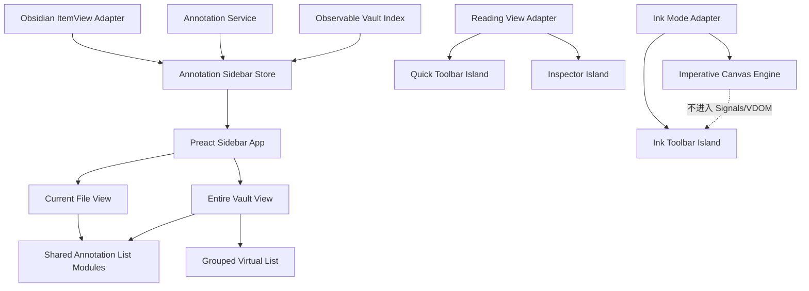

# Inkstone UI Architecture Refactor: Preact + Signals

结论：采用 **Preact + `@preact/signals` 的渐进式 UI
Island 重构**。不重写 Domain、Application、Storage、Canvas、CodeMirror 和 Reading
View；只重构 UI 层及其状态管理。

框架只是手段。真正解决性能问题的关键是：

- Sidebar 不再通过 `replaceChildren()` 全量重建。
- Current file / Entire Vault 切换不再销毁状态并重新读取数据。
- Vault Index 不再每次查询都复制、排序全部记录。
- 20,000 条数据仍然只渲染可视区域。
- Canvas 高频绘制路径不进入 Preact 和 Signals。

## 一、目前最需要深化的 Module

现有 Domain/Application 的 Depth 已经不错，问题集中在 UI：

| Module                   |    规模 | 主要问题                                                    |
| ------------------------ | ------: | ----------------------------------------------------------- |
| `CurrentFileSidebar`     |  727 行 | Header、搜索、列表、Ink、菜单、恢复、焦点全部混在一起       |
| `VaultAnnotationSidebar` |  942 行 | 查询、筛选、批量操作、弹窗、虚拟列表、列表项混在一起        |
| `AnnotationInspector`    |  551 行 | 表单、保存状态、dismiss、删除、重定位混合                   |
| `InkCanvasController`    |  980 行 | Canvas 高频绘制和低频工具栏混合                             |
| `AnnotationSidebarView`  |  565 行 | Obsidian Adapter、数据加载、缓存、业务动作、UI 生命周期混合 |
| `styles.css`             | 2145 行 | 样式依赖具体 DOM 层级，缺少清晰层次                         |

主要重复包括：

- Current file / Entire Vault 的 Scope tabs 和 Header。
- 标注类型图标、标题、笔记摘要、元数据。
- 时间、状态和标签格式化。
- 文件/标题分组 Header。
- Ellipsis Action Menu。
- Edit、Open、Copy、Export、Delete、Restore。
- Empty、Loading、Error 状态。
- 点击外部关闭、Escape、返回焦点。

## 二、目标架构



### 保持不动

以下 Implementation 继续保留：

- 文本锚点和重定位。
- Annotation Service。
- Sidecar Repository。
- Vault Index 的领域规则。
- Reading View renderer。
- CodeMirror extension。
- Canvas pointer、frame scheduling、stroke rendering。
- Ink persistence session。

### 进入 Preact

- Current file。
- Entire Vault。
- Sidebar Header 和 Scope。
- 列表项与分组。
- 搜索、筛选、批量操作。
- Inspector。
- Quick Toolbar。
- Add note 的 Inspector 复用入口。
- Ink Toolbar 的按钮部分。

## 三、框架层重构

### 1. Preact 渲染 Seam

新增统一的 UI Island mount Module：

```ts
interface UiIsland<Props> {
  mount(container: HTMLElement, props: Props): void;
  update(props: Props): void;
  unmount(): void;
}
```

Obsidian Adapter 只负责：

- 获取 `contentEl` 和 `ownerDocument`。
- 创建 Store。
- 注入业务动作。
- mount/unmount Preact。
- 响应 Obsidian 文件和 Workspace 生命周期。

这样 `AnnotationSidebarView` 不再知道列表具体如何渲染。

### 2. TypeScript 和构建配置

计划调整：

- 增加 `preact`。
- 增加 `@preact/signals`。
- `tsconfig.json` 支持 `.tsx`。
- 配置 `jsxImportSource: "preact"`。
- esbuild 打包 Preact，继续 externalize Obsidian 和 CodeMirror。
- 不引入 `preact/compat`。
- 不引入 Redux、Zustand 等第二套 Store。
- 不使用 CSS-in-JS。
- 测试使用 Vitest、jsdom 和 `preact/test-utils`。

Preact Signals 可以让依赖某个 Signal 的 UI 精确更新，部分场景可以直接绑定 DOM，避免整棵 Virtual
DOM 重渲染。[Preact Signals 官方文档](https://preactjs.com/guide/v10/signals/)

### 3. Owner Document 支持

Obsidian 支持 Pop-out Window，不能依赖全局 `document`。

建立 `ObsidianUiEnvironment`：

```ts
interface ObsidianUiEnvironment {
  document: Document;
  window: Window;
  portalRoot: HTMLElement;
}
```

规则：

- Portal 始终挂到 `container.ownerDocument.body`。
- Icon、Tooltip、Menu 都使用当前窗口的 Document。
- 不直接使用全局 `document.body`。
- 每个 Sidebar Leaf 拥有独立 Store，不使用全局单例 UI Store。

### 4. Store 划分

不建立万能全局 Store，采用每个 UI Island 独立 Store：

- `AnnotationSidebarStore`
- `AnnotationInspectorStore`
- `QuickToolbarStore`
- `InkToolbarStore`

Signals 只属于 UI 层，不泄漏到 Domain/Application Interface。

## 四、Sidebar Store 设计

```ts
type SidebarScope = 'current-file' | 'entire-vault';

interface AnnotationSidebarState {
  scope: SidebarScope;
  current: CurrentFileState;
  vault: VaultState;
}
```

### Current File State

包含：

- 当前文件路径。
- `idle/loading/ready/error`。
- 当前列表模型。
- Ink summaries。
- Active annotation ID。
- Search query。
- Selection mode。
- Selected keys。
- Bulk dialog / pending / feedback。
- Storage health。
- Restore 到期时间。
- 当前滚动位置。

### Entire Vault State

包含：

- `idle/restoring/building/ready/unavailable`。
- Search query。
- Filters。
- Sort。
- Collapsed groups。
- Bulk selection mode。
- Selected keys。
- Scroll offset。
- Index version。
- 当前查询结果。

### Scope 切换

当前实现切换 Scope 会销毁一个 UI Module，再创建另一个，并可能重新读取 Repository。

重构后：

- Sidebar App 始终存在。
- Current/Vault Store 始终存在。
- Vault 第一次打开才懒加载。
- Vault 加载后保持有界虚拟 DOM。
- 切换 Scope 只修改 `scope` Signal。
- 搜索、筛选、展开、批量选择和滚动位置全部保留。
- 后台 Index rebuild 不阻塞 Scope 切换。

## 五、共享列表 Module

不建议制造一个拥有二十多个 boolean props 的万能 `AnnotationListItem`。

采用三层组合。

### 1. 统一 Presentation Model

Current file 和 Entire Vault 的领域输入不同：

- Current file：`CompactAnnotationRow`、`InkSurfaceSummary`
- Entire Vault：`AnnotationIndexEntry`

先分别映射成统一的 Presentation Model：

```ts
interface AnnotationListItemModel {
  key: string;
  id: string;
  revision: number;

  kind: 'highlight' | 'underline' | 'note' | 'ink';
  tone: 'default' | 'warning' | 'deleted';

  title: string;
  secondary?: string;
  metadata: readonly MetadataToken[];

  leading: { kind: 'icon'; icon: string; styleId?: string } | { kind: 'thumbnail'; source: string };

  state: {
    active: boolean;
    conflict: boolean;
    deleted: boolean;
    unanchored: boolean;
  };

  capabilities: readonly AnnotationCapability[];
}
```

Presentation Model 只包含显示所需数据，不包含 Repository，也不直接执行操作。

这会统一：

- 图标选择。
- 时间格式化。
- 状态名称。
- 标签格式化。
- Warning tone。
- 标题和摘要截断。
- 可用操作判断。

### 2. `ListItemFrame`

负责统一列表项外框：

- Leading icon/thumbnail。
- 内容区域。
- Trailing action。
- Active/hover/focus/deleted/warning 状态。
- Compact/comfortable 两档密度。
- 选中背景覆盖完整操作行。
- 键盘和可访问性语义。

### 3. `AnnotationSummary`

负责：

- 标题。
- 可选笔记摘要。
- Metadata line。
- Tooltip 和文本截断。
- 稳定的单双行布局。

### 4. `TextAnnotationListItem`

复用 `ListItemFrame` 和 `AnnotationSummary`，负责：

- Highlight。
- Underline。
- Note。
- Edit/Open/Delete/Restore 等动作。

### 5. `InkAnnotationListItem`

保持独立，因为它有：

- Thumbnail。
- Stroke count。
- `needs-rebase`。
- `unanchored`。
- Edit Ink。
- SVG/PNG export。
- Whole-surface deletion。

它仍然复用：

- `ListItemFrame`
- `MetadataLine`
- `ActionMenu`
- Async action feedback

### 6. Context Wrapper

Current 和 Vault 各保留一个很薄的 Wrapper：

```text
CurrentAnnotationRow
  → TextAnnotationListItem
  + Selection checkbox（仅选择模式）

VaultAnnotationRow
  → TextAnnotationListItem
  + Selection checkbox（仅选择模式）
```

差异只留在 Wrapper：

- Current 有 active source navigation。
- Current 和 Vault 使用一致的显式选择模式：隐藏行级菜单、整行切换选择、禁用搜索，Header 提供全选、取消全选和完成选择。
- Current 和 Vault 共用五个批量动作：标签、样式、复制、导出、删除；对 Ink 不安全的标签和样式动作禁用。
- Vault 额外提供 file
  context；选择模式中的文件 Header 在数量和折叠按钮前提供三态 checkbox，可只全选或反选该文件的当前查询结果。
- 两个 Scope 的 item checkbox 都固定在末列，选中背景、边框和左侧 accent 使用同一套状态语言。
- 批量动作使用居中、内容宽度的浮动 Dock，不再使用贴满 Sidebar 底边的 action bar。
- Vault 行高固定，满足虚拟列表。
- Current 可以展示 note preview。

## 六、通用 UI Module 清单

### 基础 Primitive

| Module                | 职责                                     |
| --------------------- | ---------------------------------------- |
| `ObsidianIcon`        | 用 `setIcon()` 渲染 Obsidian 图标        |
| `IconButton`          | Icon、Tooltip、ARIA、pressed/busy/danger |
| `SegmentedControl`    | Current file / Entire Vault、mark type   |
| `SearchField`         | Search icon、清除、键盘行为              |
| `MetadataLine`        | 标签、时间、类型、状态、warning          |
| `Badge`               | 数量、状态                               |
| `EmptyState`          | 图标、标题、说明、可选动作               |
| `StatusBanner`        | Loading、Error、Conflict                 |
| `AsyncActionFeedback` | Pending、Success、Error、Retry           |

### Layer 和菜单

标准 Ellipsis 操作优先使用 Obsidian 原生 `Menu`，获得现成的：

- 外部点击关闭。
- Escape。
- 图标。
- 键盘操作。
- Obsidian 主题适配。

复杂 Popover 使用共享 `DismissibleLayer`：

- Portal。
- Outside click。
- Escape。
- Focus return。
- Layer stack。
- Owner Document。
- Viewport collision。

### Sidebar

| Module                  | 使用位置                           |
| ----------------------- | ---------------------------------- |
| `SidebarHeader`         | Current/Vault 共用                 |
| `ScopeSwitcher`         | Current/Vault 共用                 |
| `AnnotationGroupHeader` | Heading、Problems、Ink、Vault file |
| `AnnotationList`        | Current file                       |
| `GroupedVirtualList`    | Entire Vault                       |
| `VaultFilterMenu`       | Vault                              |
| `FilterChips`           | Vault                              |
| `BulkActionDock`        | Current/Vault 共用                 |
| `SidebarStateView`      | Empty、Loading、Error              |

### Inspector

- `AnnotationInspectorShell`
- `OverlapChooser`
- `AnnotationEditor`
- `MarkTypeSegmentedControl`
- `StyleSwatches`
- `TagField`
- `InspectorActionBar`
- `DeletedAnnotationState`
- `ReattachmentPreview`

Inspector 状态改为 discriminated union：

```ts
type InspectorState =
  | { kind: 'closed' }
  | { kind: 'choosing'; records: readonly TextAnnotationRecord[] }
  | { kind: 'editing'; draft: InspectorDraft; save: AsyncState }
  | { kind: 'previewing-reattachment'; candidate: ReattachmentCandidate }
  | { kind: 'deleted'; record: TextAnnotationRecord };
```

避免现在 `dirty`、`saving`、`element`、`saveBeforeDismiss` 等松散状态组合。

### Floating Toolbar

共享：

- `FloatingToolbar`
- `AnchoredLayer`
- `RovingToolbarFocus`
- `AsyncActionButton`
- `StyleSwatch`
- `ToolButtonGroup`

Quick Toolbar 使用 Anchor Rect；Ink Toolbar 使用可拖动 Viewport Position。

## 七、Entire Vault 性能重构

框架迁移必须同时修改 Index 查询路径，否则可能只是把卡顿从 DOM 换到 VDOM。

### 当前问题

`VaultAnnotationIndex.query()` 会调用 `snapshot()`，而 `snapshot()` 每次都会：

1. 复制全部 Entries。
2. 全量排序。
3. 搜索过滤。
4. 分组。
5. Flatten。
6. 重建 Virtual List viewport。

搜索每输入一个字符都会重复这些步骤。

### 目标

新增可观察的 Index Seam：

```ts
interface VaultAnnotationQueryPort {
  isReady(): boolean;
  query(input: VaultQuery): VaultAnnotationQueryResult;
  snapshot(): readonly AnnotationIndexEntry[];
  subscribe(listener: () => void): () => void;
}
```

优化策略：

- Document-order snapshot 缓存。
- 只在 `rebuild/upsert/remove` 时失效。
- Index 更新时增加 version。
- Search/Filters/Sort 使用 computed Signal。
- Search debounce 80–120ms。
- Query 输入相同直接复用结果。
- Facet options 独立缓存，不在每次 render 时重新扫描。
- 不为 20,000 条记录各自创建 Signal。
- Virtual scroll 通过 `requestAnimationFrame` 合并。
- 重叠窗口中的 keyed rows 保留，不全部销毁。

## 八、虚拟列表 Module

继续使用项目内实现，不急于引入第三方 Virtual List。

```ts
interface GroupedVirtualListProps<T> {
  items: readonly T[];
  itemKey(item: T): string;
  itemHeight(item: T): number;
  renderItem(item: T): ComponentChildren;
  overscanPx: number;
  scrollOffset: number;
  onScrollOffsetChange(offset: number): void;
}
```

支持两类高度：

- Group Header：固定高度。
- Annotation Row：固定高度。

验证要求：

- 20,000 条记录时 DOM 列表节点不超过 40 个。
- Collapse/Expand 后 offset 正确。
- 搜索后滚动位置按明确规则重置。
- Scope 切换后恢复原滚动位置。
- Bulk checkbox 不因虚拟化丢失状态。
- Menu 不被 viewport overflow 裁切。

## 九、Canvas 重构原则

不把 Canvas 绘制迁移到 Preact。

将 `InkCanvasController` 拆成：

```text
InkCanvasEngine
├── pointer events
├── stroke buffering
├── frame scheduling
├── coordinate conversion
├── committed render
└── erasing

InkToolbarStore
├── active tool
├── color
├── width
├── undo/redo availability
├── save failure
└── floating position

InkToolbarView
└── Preact UI
```

高频 Pointer Points、Canvas Frame 和 Stroke Rendering 不进入 Signals。

Preact 只处理低频状态：

- 切换工具。
- 颜色。
- 宽度。
- Undo/Redo 可用性。
- Save error。
- Toolbar position。

## 十、建议目录结构

```text
src/ui/
  runtime/
    mount-preact-island.tsx
    obsidian-ui-environment.ts
    portal-root.tsx

  stores/
    annotation-sidebar-store.ts
    annotation-inspector-store.ts
    quick-toolbar-store.ts
    ink-toolbar-store.ts

  models/
    annotation-list-item-model.ts
    annotation-metadata.ts
    annotation-actions.ts

  primitives/
    obsidian-icon.tsx
    icon-button.tsx
    segmented-control.tsx
    search-field.tsx
    metadata-line.tsx
    badge.tsx
    empty-state.tsx
    status-banner.tsx
    dismissible-layer.tsx

  annotation-list/
    list-item-frame.tsx
    annotation-summary.tsx
    text-annotation-list-item.tsx
    ink-annotation-list-item.tsx
    annotation-group-header.tsx
    action-menu.tsx

  sidebar/
    annotation-sidebar-app.tsx
    sidebar-header.tsx
    current-file-view.tsx
    entire-vault-view.tsx
    grouped-virtual-list.tsx
    vault-filter-menu.tsx
    bulk-action-dock.tsx

  inspector/
    annotation-inspector-app.tsx
    overlap-chooser.tsx
    annotation-editor.tsx

  floating/
    quick-highlight-toolbar-app.tsx
    ink-toolbar-app.tsx

  canvas/
    ink-canvas-engine.ts
```

## 十一、执行 Slice

每个 Slice 都是开发—验证闭环。

### R0：冻结行为和性能基线

依赖：无。

- [ ] 记录当前 bundle：`main.js` 468,725 bytes，gzip 99,204 bytes。
- [ ] 记录 Current/Vault warm switch 延迟。
- [ ] 记录 20k Search、Sort、Collapse 延迟。
- [ ] 记录 Scope 切换前后的 DOM 节点数。
- [ ] 添加“搜索、筛选、滚动、展开状态应保留”的失败测试。
- [ ] 添加“切换 Scope 不触发重复 Vault rebuild”的失败测试。
- [ ] 固化现有 ARIA 和 `data-inkstone-*` 契约。

完成标准：拥有重构前机器基线，测试先红。

### R1：Preact 基础运行时

依赖：R0。

- [ ] 安装 Preact、Signals。
- [ ] 配置 TSX 和 esbuild。
- [ ] 实现 mount/update/unmount。
- [ ] 实现 `ObsidianUiEnvironment`。
- [ ] 实现 Portal 和 Owner Document。
- [ ] 加入 `ObsidianIcon` 和 `IconButton`。
- [ ] 验证 unload 后无残留 DOM、listener、effect。
- [ ] 验证 Pop-out Window Document。

完成标准：一个实验 UI Island 可 mount/update/unmount，但用户界面不改变。

### R2：Presentation Model 与 Primitive

依赖：R1。

- [ ] 定义统一 List Item Presentation Model。
- [ ] 实现 Current text、Current Ink、Vault entry mapper。
- [ ] 合并 icon/status/time/tag formatting。
- [ ] 实现 `MetadataLine`、`Badge`、`EmptyState`、`StatusBanner`。
- [ ] 实现 Action Descriptor 和 Async Action State。
- [ ] 为 mapper 编写纯函数测试。

完成标准：Current/Vault 可以产生一致的展示模型，但仍可继续使用旧 UI。

### R3：Sidebar Shell 与 Store

依赖：R1、R2。

- [ ] 建立 `AnnotationSidebarStore`。
- [ ] 建立长期存在的 Scope state。
- [ ] 迁移 Sidebar Header、ScopeSwitcher。
- [ ] 迁移 Loading/Empty/Error。
- [ ] `AnnotationSidebarView` 收敛为 Obsidian Adapter。
- [ ] 约二十个构造 callback 收敛为 Commands Module。
- [ ] Vault 仍保持 lazy load。
- [ ] Scope 切换不丢状态。

完成标准：Header 和 Scope 进入 Preact，列表暂时可继续挂旧 Implementation。

### R4：共享列表与 Current File

依赖：R2、R3。

- [ ] 实现 `ListItemFrame`。
- [ ] 实现 `AnnotationSummary`。
- [ ] 实现 `TextAnnotationListItem`。
- [ ] 实现 `InkAnnotationListItem`。
- [ ] 实现 `AnnotationGroupHeader`。
- [ ] 迁移 Current file。
- [ ] Restore 5 秒窗口进入 Store。
- [ ] Active selection、focus、navigation 回归。
- [ ] 删除、Restore、Edit、Export 回归。
- [ ] 删除旧 Current DOM builder。

完成标准：Current file 完全由 Preact 渲染，并通过原有行为测试和视觉验收。

### R5：Observable Index 与查询优化

依赖：R0，可与 R4 部分并行。

- [ ] 为 Index 增加 version/subscription。
- [ ] 缓存排序后的 snapshot。
- [ ] 缓存 facets。
- [ ] Query 添加 memoization。
- [ ] Search 添加 debounce。
- [ ] 更新合并，避免重复刷新。
- [ ] 20k 性能测试。
- [ ] 验证 derived index 仍然可删除、重建。

完成标准：查询性能独立于 Preact UI 验证通过。

### R6：Entire Vault 与虚拟列表

依赖：R3、R4、R5。

- [ ] 迁移 Search/Filter/Sort。
- [ ] 迁移 Filter Menu 和 Chips。
- [ ] 迁移 File Group Header。
- [ ] 实现 Grouped Virtual List。
- [ ] 迁移 Text/Ink row。
- [ ] 迁移 Bulk selection。
- [ ] 迁移 Bulk dialogs 和 feedback。
- [ ] 保留 collapse、filter、sort、selection、scroll。
- [ ] 20k DOM 有界验证。
- [ ] 删除旧 Vault DOM builder。

完成标准：Entire Vault 完全由 Preact 渲染，Scope warm switch 不再明显卡顿。

### R7：Inspector、Quick Toolbar

依赖：R1、R2。

- [ ] 实现共享 Dismissible Layer。
- [ ] 迁移 Inspector 状态机。
- [ ] 迁移 Overlap chooser。
- [ ] 迁移 Mark Type、Style、Tags。
- [ ] 迁移 Quick Toolbar。
- [ ] Add note 复用 Inspector，并默认激活 Note、聚焦输入框。
- [ ] 保存成功关闭。
- [ ] 显式保存失败保持打开并聚焦 Retry；失焦保存失败放弃未提交修改并关闭。
- [ ] 外部点击和 Escape 回归。
- [ ] 删除旧 global listener 实现。

完成标准：所有悬浮层使用统一 dismiss、focus 和 async feedback。

### R8：Ink Toolbar 解耦

依赖：R1、R2。

- [ ] 从 Canvas Controller 提取 Toolbar Store。
- [ ] 从 Canvas Controller 移除 Toolbar DOM 构造。
- [ ] 迁移 Tool/Color/Width/Undo/Redo/Done。
- [ ] 保留拖动和 viewport clamp。
- [ ] 正常保存不显示遮挡提示。
- [ ] 保存失败显示可操作错误。
- [ ] Canvas repaint 不经过 Preact。
- [ ] 重跑 input-to-paint 性能测试。

完成标准：Ink Toolbar 由 Preact 渲染，Canvas 性能无回退。

### R9：清理与发布 Gate

依赖：R4、R6、R7、R8。

- [ ] 删除旧 imperative UI classes 和重复 helper。
- [ ] 清理未使用 CSS。
- [ ] CSS 按 tokens/base/primitives/features 分层。
- [ ] 保持最终产物仍为一个 `styles.css`。
- [ ] 执行完整单元和集成测试。
- [ ] 执行 20k / 200k 性能测试。
- [ ] 执行 mobile bundle check。
- [ ] 安装最新验收 Vault。
- [ ] 用户完成真实视觉验收。
- [ ] 更新 Spec、Execution Plan 和 Source Manifest。

完成标准：代码中只保留一套 UI Implementation，没有长期双轨。

## 十二、性能 Gate

| 指标                      |                  Gate |
| ------------------------- | --------------------: |
| Desktop 同步启动工作      |         继续低于 30ms |
| Current/Vault warm switch |        P95 低于 100ms |
| 20k Search 计算           |         P95 低于 25ms |
| Search 输入到结果更新     | debounce 后低于 150ms |
| 20k 列表 DOM 行数         |             不超过 40 |
| Virtual scroll 单帧工作   |       P95 低于 16.7ms |
| Ink input-to-paint        |       P95 低于 16.7ms |
| `main.js` gzip            |      建议不超过 115KB |
| Scope 切换                |  不触发 Vault rebuild |
| Current refresh           |  不重建无变化的列表项 |

Obsidian 官方要求插件保持轻量初始化、延迟不可见 UI，并使用生产构建；Preact
Store 和 View 必须在 Sidebar 真正打开后创建。[Obsidian 插件加载优化](https://docs.obsidian.md/plugins/guides/load-time)

## 十三、主要风险

1. **框架迁移反而让 20k 列表变慢**

   解决：先做 Index cache，再迁移 Vault UI；虚拟列表不为每条记录创建 Signal。

2. **新旧 UI 双轨持续太久**

   解决：每个 Slice 完成后删除对应旧 Implementation，不保留永久 Feature Flag。

3. **Canvas 被响应式状态拖慢**

   解决：Pointer points 和绘制帧禁止进入 Signals。

4. **Obsidian Pop-out Window 出错**

   解决：所有 Portal、Icon、Menu 使用 `ownerDocument`。

5. **主题兼容退化**

   解决：继续使用 Obsidian CSS variables 和内置图标，不引入 CSS-in-JS。

6. **视觉重构与框架重构同时失控**

   解决：迁移阶段先复用现有 class 和视觉 token；视觉调整在对应 Slice 通过功能回归后进行。

7. **iPad 验证拖慢开发**

   按当前决策，本轮继续跳过真实 iPad 验收，但保留 mobile
   bundle、无 Node/Electron 顶层依赖和触摸尺寸自动检查。真实 iPad 在后续单独验收。

## 十四、实现状态（2026-07-15）

- R0–R8 的实现与自动化 Gate 已完成；逐 Slice 证据和 Source Manifest 位于
  `docs/delivery/slices/R00-preact-baseline/` 至 `R08-ink-toolbar-preact/`。
- R9 的旧 UI helper 清理、CSS 层次、完整测试、20k/200k 性能、mobile
  bundle 和本地验收 Vault 安装已完成；最终证据位于 `docs/delivery/slices/R09-preact-release/`。
- HAT 入口位于 `hats/20260715-preact-ui-architecture-refactor/`。真实 Obsidian 视觉、pop-out
  window、键盘/指针的产品 owner 验收仍开放，因此在人工签字前不宣称 R9 或整轮重构完成。
- 原生 Obsidian 1.12.7 工程验收已记录于
  `docs/delivery/slices/R09-preact-release/native-runtime-report.md`：Current/Vault 热切换 P95
  17.8ms，20,004 条索引的搜索在 50ms 时未提前应用、108.2ms 完成，且两个 Scope 的 DOM 实例均跨切换保留。该证据不替代产品 owner 的视觉签字。
- 最新 production bundle 仍为单一 `main.js` + `styles.css`；`styles.css`
  以 tokens、base/primitives、features 分区，Canvas 高频路径仍不进入 Preact/Signals。

R0–R9 的实现状态已回写到
[`2026-07-14-obsidian-annotation-plugin-execution-plan.md`](2026-07-14-obsidian-annotation-plugin-execution-plan.md)；后续工作以该总执行计划和 R09
HAT 为准，不再重复启动 R0/R1。

## Source Manifest

### Sources

- `docs/specs/2026-07-14-obsidian-annotation-plugin-design.md`
- `docs/specs/2026-07-14-obsidian-annotation-plugin-execution-plan.md`, especially S15.
- `docs/delivery/slices/R00-preact-baseline/` through `docs/delivery/slices/R09-preact-release/`.
- User instruction in the current Codex task on 2026-07-15 to keep all plugin plans and
  specifications under `docs/specs/`.

### Produced artifacts

- `docs/specs/2026_07_15_refactor_to_preact.md`
- Preact UI implementation and R00–R09 evidence referenced above.
- `hats/20260715-preact-ui-architecture-refactor/`

### Key decisions

- Use Preact + Signals for UI islands only; Canvas, Domain, Application, Storage, CodeMirror, and
  Reading View hot paths remain outside reactive rendering.
- Preserve one UI implementation after each migration Slice rather than keeping a permanent dual
  path.
- Treat product-owner native visual acceptance as separate from automated completion.

### Verification evidence

- See `docs/delivery/slices/R09-preact-release/source-manifest.md` and `native-runtime-report.md`
  for the latest automated and native evidence.

### Open questions / risks

- Product-owner visual acceptance, pop-out window observation, and the remaining R09 HAT items stay
  open in the master execution plan.
